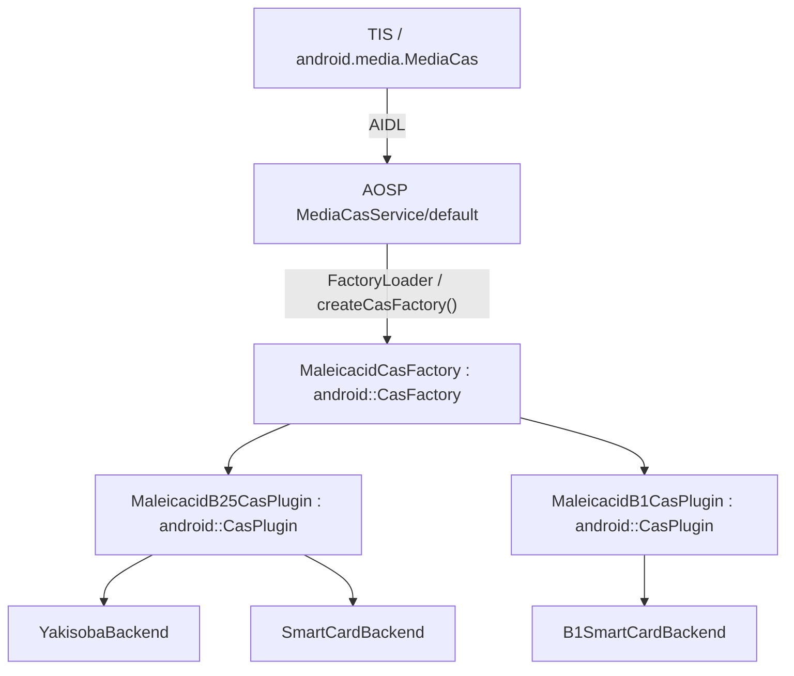

# Maleicacid CAS plugin 設計正本

本書は Maleicacid の CAS plugin に関する規範正本である。AOSP Media CAS service と vendor CasPlugin の境界、B25/B1 capability、plugin/session lifecycle、backend ownership、ECM/EMM処理、session/tokenと動的鍵状態の対応・更新・失効、token寿命、teardownを所有する。

製品全体のrelease到達点とmodule間責務は `../開発規則.md`、Tuner HAL公開契約は `../tuner_hal/DESIGN_JA.md`、TIS runtimeは `../tis/DESIGN_JA.md` を正とする。本書はそれらを再定義しない。

## 1. AOSP Media CAS service と Maleicacid plugin の境界

`android.hardware.cas.IMediaCasService/default` はAOSP標準 `MediaCasService` を使用する。Maleicacidは独自 `IMediaCasService/default` serviceを実装しない。

MaleicacidはAOSP Media CAS plugin ABIに従うvendor shared libraryを提供し、AOSP `FactoryLoader` による探索・読込みを使用する。配置・Soong設定・組込み確認は [INTEGRATION.md](INTEGRATION.md) を参照する。



両pluginはそれぞれSessionTableを持ち、B25はplugin単位のbackend bindingを持つ。ECMから得たodd/even KsはMediaCas session IDに対応する内部鍵状態へ反映する。CAS pluginの依存先にTuner HALを置かず、製品の共有方針は`../開発規則.md`の「r52のMULTI2固定値と動的鍵状態」に従う。

AOSP `MediaCasService` はplugin libraryのdiscovery/load、service-level plugin列挙・support query、AIDL `ICas` wrapper生成、listener bridgeを所有する。Maleicacid pluginはこれらを重複実装しない。

plugin entry point `createCasFactory()` はC linkageとする。返却する `android::CasFactory` と生成する `android::CasPlugin` はAOSP C++ virtual interfaceであるため、MaleicacidのAOSP plugin ABI境界はC++で実装する。

B25/B1のpacket descrambleはMedia CAS descramblerへ移さず、Tuner HAL `IDescrambler` が所有する。Maleicacid B25 pluginはMedia CAS `DescramblerFactory`を提供しない。

ClearKeyはAOSP標準compatibility pathのままとし、Maleicacid B25/B1 backend stateから分離する。

## 2. factory と plugin capability

`MaleicacidCasFactory` はB25/B1 CA system IDのsupport判定、B25/B1 plugin descriptor query、caSystemIdに対応するCasPlugin instance生成を所有する。AOSP `CasAPI.h` のpure virtual ABIに従い、`CasPluginCallback` 版と `CasPluginCallbackExt` 版の両 `createPlugin()` を実装する。両overloadは同じsystem-id dispatchを使い、B25なら `MaleicacidB25CasPlugin`、B1なら `MaleicacidB1CasPlugin` を生成し、callback形式だけをadapterで分ける。AIDL default `MediaCasService` はExt callback版を使用するが、legacy callback版も未実装のまま残さない。

CA system IDの数値と方式の対応は`../開発規則.md`の「CA system IDの正本」を参照する。factoryのdescriptor・support query・両createPlugin()とTISの選択を同じ対応へ揃え、backendごとに別IDを割り当てない。

同一CA system IDについてSmartCard版とYakisoba版を別descriptorとして列挙しない。backend差は1個のB25 plugin内部へ閉じる。

最初にadvertiseするMaleicacid capabilityはB25 `yakisoba_only` とする。SmartCard未実装を `yakisoba_only` の成立条件にしない。

B25をadvertiseするには、採用profileについて次を満たす。

```text
共通:
  - AOSP CasPlugin lifecycle / status contract
  - complete ECM / EMM input contract
  - MediaCas session IDと同一のtokenからcurrent odd/even Ksへの一意な参照
  - 同じtokenに対応するcurrent Ksのatomic更新
  - revoke / stale-token rejection
  - TIS -> MediaCas -> Tuner 結合確認
  - 採用するARIB STD-B25日本語原本の受信機能力条項の確認
  - product effective capacity が確認済み要求を満たすことの検証
  - §3.1のsession容量分類と、初期通知のTRM反映後にsessionを要求する順序の結合確認

yakisoba_only:
  - Yakisoba backend
  - B25 ECM / EMM
  - credential供給
  - bounded operation
  - secret lifetime
  - 採用統合形態に必要なaccess controlと配布条件

smartcard_only:
  - SmartCard backend
  - card初期化 / ECM / EMM
  - bounded I/O
  - card removal / close

prefer_smartcard_then_yakisoba:
  - 両backendの成立条件
  - plugin単位backend binding
  - SmartCard状態未確定時のnon-fallback
```

ARIB STD-B25の現行版判定と、その版の具体的な受信機能力値を本文で確認済みであることは分けて扱う。旧版英訳の具体値を未確認の現行日本語原本要求値として代用しない。

B1は同じ `MaleicacidCasFactory` が所有する第二のCA systemとして提供する。r52完了時にはfactoryのdescriptor queryがB25とB1の各descriptorを返し、B1 support queryをtrueとし、`createPlugin(B1)` が `MaleicacidB1CasPlugin` を生成できなければならない。`MaleicacidB1CasPlugin` は `B1SmartCardBackend` を使うECM-only plugin coreとし、B1 `processEmm()` はunsupportedを返す。B1の成立はB25 `yakisoba_only` backendの内部実装条件にはしないが、r52全体の完了条件には含める。

## 3. B25/B1共通 CasPlugin ABI 契約

`MaleicacidB25CasPlugin` と `MaleicacidB1CasPlugin` は、いずれもAOSP `android::CasPlugin` ABIの同じ公開面を実装する。CA方式に依存しない公開契約を本節に集約し、B25/B1固有差分だけを後続節で規定する。

```text
- setStatusCallback(CasPluginStatusCallback)
- setPrivateData()
- openSession(CasSessionId*)
- openSession(intent, mode, CasSessionId*)
- closeSession()
- setSessionPrivateData()
- processEcm()
- processEmm()
- sendEvent() / sendSessionEvent()
- provision() / refreshEntitlements()
- plugin/session lifecycle
```

内部責務として、MediaCas session/tokenと動的鍵状態の対応・Ks更新・失効を§9〜§13に従って維持する。これは追加のCasPlugin公開methodやTuner HALへの呼出しではない。

採用AOSP plugin ABIに存在しないvendor独自public methodを追加しない。公開面を拡張せず、各CA方式で意味を持たないoperationは空successにせずAOSP既存のcannot-handle相当statusへ写像し、stateを変更しない。invalid/closed session、illegal argument等はAOSP既存statusの意味を保って返す。

`setStatusCallback()` はAOSP `MediaCasService` がplugin生成後に登録するstatus callbackを保持するABI面とする。factoryの `createPlugin()` で受け取った `appData` と組み合わせてstatus eventをservice側へ返す。callback登録前はstatus callbackを発行せず、plugin破棄開始後はcallbackを発行しない。callback invocationはcommit済みstateだけを通知し、callback中にplugin内部state lockを保持することを要求しない。AIDL release応答との関係は§4に従う。

session数の通知方針は§3.1に従う。ClearKeyが試験用にintent/modeをstatus callbackへechoする動作をB25/B1へ複製しない。

引数なしの `openSession(CasSessionId*)` はframeworkのdefault session openであり、B25/B1とも各CA方式のscheme-default MULTI2 sessionを生成する。typed `openSession(intent, mode, ...)` はB25/B1で `LIVE + MULTI2` を通常入力として受理する。これ以外の非対応intent/modeはstateを変更せずcannot-handle相当statusを返す。

`processEcm()` の成功条件はB25/B1共通で、対象sessionのcurrent odd/even Ksのatomic更新が確定済みで、同じMediaCas session ID bytesから直ちに利用可能であることとする。固定値と更新対象の区別は§10、確定点は§12に従い、確定前にsuccessを返さない。close/releaseとの競合、late completion、revoke、callback orderingは§4および§12〜§13の共通契約に従う。

### 3.1 Framework/TRMへのsession数通知

B25の各profileとB1は、採用構成の同時session容量を次のように分類する。通知方針の正本は本節とし、固定上限の有無にかかわらず初期容量を通知する。

| 採用構成の条件 | Framework/TRMへの通知 |
|---|---|
| session表、backend、sessionに必須の鍵状態等に有限の同時session上限がある | 有効上限を`PLUGIN_SESSION_NUMBER_CHANGED`の`arg`として通知する。上限をplugin側の`RESOURCE_BUSY`だけで表現しない |
| 同時session数そのものに固定上限がなく、session数を理由とする受付拒否を行わない | AOSP TRMの既定容量と同じ`Integer.MAX_VALUE`を本製品の初期通知値にする。`RESOURCE_BUSY`はsession数とは独立した一時的なI/O競合・作業資源不足等に限る |
| 上限の有無または有効値を確定できない | 無制限として扱わず、当該profileのadvertise / r52結合条件を未達とする |

容量の正本は、採用product設定と実資源に基づいて受付を確定するsession/backend resource ownerが持つ。有限値は同じCA systemの全plugin instanceを通じて使用可能な同時session総数であり、個別pluginの空き数・現在使用数ではない。同じ物理資源を二重計上せず、各instanceが異なる上限でTRMを上書きしない。`prefer_smartcard_then_yakisoba`でもbackendごとの局所上限を独立に通知せず、選択可能な構成全体で成立するCA systemの有効上限を確定する。容量値と有限/無制限の判定をTISへ複製しない。

B25/B1 pluginは、`setStatusCallback()`登録後に確定済みの現在値を初期通知し、その後は実資源の構成変更等で有効上限が変わった確定点の後に通知する。初期通知を最初のopenSessionやECM処理まで遅延しない。session open/closeで変わる残数を上限として再通知しない。通知は§3〜§4のcallback寿命・orderingに従い、未登録callbackを呼ばず、破棄済みinstanceから送らない。B25/B1とも通知経路は既存の`CasPluginStatusCallback` → AOSP listener → `MediaCas` → `updateCasInfo(caSystemId, maxSessionNum)`とする。TISは容量の有限/無制限を別途判定せず、同じ初期通知の処理完了を待ってからsessionを要求する。登録順序・非同期待機・期限・失効は`../tis/DESIGN_JA.md`を正とする。

AOSP `StatusEvent`の既定はsession数を制限しない扱いであり、Android 15のTRMは未登録のCA systemを`Integer.MAX_VALUE`で管理する。`0`の通知はTRMの資源登録削除であって、恒久的な「受付上限0」の登録ではない。card喪失等の受付拒否・鍵失効をこの通知だけに任せず、§4・§7・§13のowner側処理を行う。有限上限の通知後はTRMのsession割当て・優先度回収を利用するが、上限減少の通知だけで既存sessionが直ちに回収されるとは仮定しない。

callbackは非同期であり、pluginはTRMへの反映完了を応答として受け取らない。通知反映までの競合や一時的な資源不足でも、session/backend resource ownerは実容量を超えて受け付けず、確保不能を`ERROR_CAS_RESOURCE_BUSY`として返す。session生成失敗ではIDを公開せず、確定済みsession/鍵状態を変更しない。これは有限上限の通知を省く代替ではない。ECM確定前の失敗は§12に従う。

TISのsession追跡・資源回収通知後の処理は`../tis/DESIGN_JA.md`を正とする。容量の確定と通知には既存のresource ownerとcallbackを使い、plugin内の優先度調停器、別の容量集約service、容量通知専用workerは要求しない。

## 4. plugin / session lifecycle

論理stateは次を満たす。

```text
plugin:  Live -> Releasing -> Released
session: Opening -> Active -> Closing -> Closed
                         \-> Failed -> Closing -> Closed
```

pluginの `Releasing` はvendor CasPluginの破棄開始、`Released` は破棄完了を表す。AOSP AIDL `CasImpl::release()` の応答時点とは区別する。標準実装は `mPluginHolder` を空にして新規呼出しを拒否するが、実行中のmethodは局所的な `shared_ptr` を保持するため、そのmethodが参照を解放するまでplugin破棄は遅延し得る。AIDL release呼出しをvendor pluginへ通知する独自method、service改変、監視threadを追加しない。

同期backend処理はplugin methodの参照寿命内で完了させる。AIDL releaseと競合して既に実行中のmethodは、その応答後に結果をcommitし得る。これをpluginが検知・拒否できるとは規定しない。session closeが先に確定した場合は、そのsessionへの後着commitを拒否する。通常のTIS終了ではECM/EMM配送停止、descrambler参照解除、各session close、MediaCas closeを直列に行い、この競合を発生させない。

内部workerを採用する場合は、plugin破棄開始で新規処理とcallbackを停止し、既存処理を取消しまたは完了待ちして、sessionと鍵参照を失効させてから破棄を完了する。workerが自身の停止に必要なplugin寿命を循環参照で保持してはならない。`appData` はservice wrapper所有の借用値であり、plugin破棄後に使用しない。AIDL release応答時点で全worker、callback、鍵資源が既に破棄済みという強い保証は追加しない。

具体的なclass名、mutex、thread、generation fieldは規定しない。必要な意味契約は次とする。

- Released pluginを再利用しない。
- Closed sessionに対するECM/private-data mutationを成功させない。
- session closeまたはplugin破棄開始と外部backend処理が競合した場合、遅れて返った結果をClosed/Releasing stateへcommitしない。AIDL release応答だけをReleasingへの遷移とみなさない。
- 古いECM completionが後から新しいcurrent key materialを上書きしない。
- listener notificationはstate commit後に行い、listener failureでcommit済みstateをrollbackしない。AOSP listener契約がsession IDを正規引数として要求する場合はその契約に従い、raw/prepared key、ECM/EMM本文等の秘密materialをcallbackへ露出しない。
- callbackからhalf-committed stateを観測可能にしない。
- method successは、そのmethodが公開上成立させるstateがcommit済みとなった時点だけ返す。

## 5. B25 backend ownership

YakisobaとSmartCardは別pluginではなく、B25 plugin instance内部のbackendとして扱う。

```text
B25Backend
  |- YakisobaBackend
  `- SmartCardBackend
```

backend種別は各B25 plugin instance内で一度だけ確定し、releaseまでそのpluginの全sessionとEMM処理で共有する。同じplugin instanceの途中でbackendを切り替えない。同じplugin instanceへ複数のbackend-dependent operationが並行して最初に到達しても、異なるbackendへ同時確定せずbinding結果を一意にする。具体的なlock/thread方式は規定しない。

TISのplugin/session所有単位は `../tis/DESIGN_JA.md` の「CAS / descrambler の現行境界」を正とする。同節のplugin共有は同一CasController内に限られ、別のTvInputService Sessionやscan contextとの共有を要求しない。本pluginは独立した複数client/plugin instanceを受け入れ、各instance内の複数ECM sessionとEMMを同じbackendへ帰属させる。sessionや鍵slotをCA system IDごとに1個へ制限することも、HAL/service全体を横断するbackend選択器を追加することも要求しない。

`setPrivateData()` がbackend binding前に成功した場合、後続bindingはそのcommit済みplugin-local private dataと整合するbackend contextを生成する。binding後の `setPrivateData()` は、plugin-local stateとactive backend contextが異なる成功状態にならないよう一体として更新し、失敗時は直前の成功stateを維持する。version counter等の具体方式は必須化しない。

複数plugin instanceが同じphysical cardまたは同じYakisoba backend resourceを共有する実装では、その共有resource自身が必要なI/O/state orderingを提供する。backend種別の選択までplugin間で共有することを必須にしない。

### 5.1 profile

```text
smartcard_only:
  - pluginをSmartCard backendへbindする。
  - card不在等でYakisobaへ暗黙切替しない。

yakisoba_only:
  - pluginをYakisoba backendへbindする。
  - SmartCard probeを行わない。
  - Yakisoba障害でSmartCardへ暗黙切替しない。

prefer_smartcard_then_yakisoba:
  - pluginがUnboundのときだけSmartCardをprobeする。
  - CARD_VALIDならSmartCardへbindする。
  - CARD_ABSENT / CARD_INVALID / CARD_UNSUPPORTED / CARD_IO_UNAVAILABLEならYakisobaへbindできる。
  - CARD_UNKNOWN_TIMEOUTではYakisobaへfallbackせず、bindingをUnboundのままにする。
```

build typeだけからbackendを暗黙決定しない。profileはproduct imageで固定したcapability設定から決定し、service lifetime中の一時healthやcard挿抜でdescriptor集合を変更しない。

## 6. 最初に成立させる `yakisoba_only`

最初に使用可能にするB25 profileは `yakisoba_only` とする。

最初の `YakisobaBackend` はB25 plugin library内のin-process backendとし、Soongで供給される `libyakisoba-cross` の `libyakisoba` C APIを使用する。

```text
MaleicacidB25CasPlugin (C++)
        |
        v
YakisobaBackend (C++)
        |
        | bcas_decodeECM() / bcas_decodeEMM()
        v
libyakisoba-cross / libyakisoba
```

Yakisoba backendはlibyakisobaの戻り値とodd/even Ksをplugin lifecycle、AOSP status、sessionの動的鍵状態の更新契約へ正規化する。

`processEcm()` はECM入力をbackendへ渡し、成功時に得たodd/even Ksを、同じMediaCas session IDから参照する内部鍵状態へatomicに反映する。§12の確定点でsuccessを返し、製品固定parameterをsessionの更新対象に含めない。

`processEmm()` はplugin-wide backend mutationとして扱い、関連ECM処理がhalf-updated entitlement/work-key stateを観測しないorderingを提供する。

backend operationはcallerを無期限に占有しない。deadline、cancellation、worker等の具体方式は固定しない。request送信後に結果不明となったmutationを成功扱いしない。同一backendでreplay-safeまたはidempotentであることを実装上証明できるoperationは安全な再送を許してよいが、その保証がないmutationを自動再送しない。outcome-unknownを別backendへのfallback条件にしない。

raw key、Kw、Ks、credentialを通常log、TIS、AOSP公開AIDLへ露出しない。ECM/EMMはTISからAOSP標準 `processEcm()` / `processEmm()` 入力として受け取る正規経路を許可し、その入力を通常log、別AIDL、診断dump等へ不要に再公開しない。

Yakisobaを別vendor daemonへ分離する実装も禁止しない。daemonを採用する場合だけ、IPC schema互換性、request/response対応付け、size bound、access control、bounded I/O、stale request rejectionを満たす。daemon自体、明示version field、特定socket pathをAOSP要件として必須化しない。

### 6.1 section入力とpayload抽出

AOSP `processEcm()` / `processEmm()` のscheme-private入力は、本製品ではTISが取得した完全な1 sectionとする。TISは内容を解釈・切断せず、Maleicacid CAS pluginの入力adapterが次を行う。

- 対応するECM/EMM table_id、sectionの構文、宣言長と実長、採用方式で必要なCRCを検証する。長さ不足、余剰byte、切れたmessage、不正CRCをbackendへ渡さない。
- ECMはsection headerとCRC等の外枠を除き、暗号化ECM payloadの先頭からMAC末尾までを `bcas_decodeECM()` へ渡す。libyakisobaの256-byte上限と最小長を呼出し前に検証し、返却鍵は同APIのodd、even順に受け取る。
- EMM section内のmessage境界と宛先を検証し、message単位で `bcas_decodeEMM()` へ渡す。`Individual` は対応するARIB message種別から決め、全EMMへ固定値を渡さない。各messageの長さと種別固有の最小長を検証し、256-byteを超える入力を渡さない。
- EMMの出力bufferを確保し、復号後のcommand、宛先、長さ、更新番号、適用条件をbackendで検証する。TISへ復号本文を返さない。ECM/EMMの構文・command解釈はCAS側に閉じ、TS demuxやPSI/SI意味解析を複製しない。

### 6.2 EMMの復号結果とwork key更新

`bcas_decodeEMM()` の成功は復号・MAC検証の成功であり、entitlementやwork key台帳への更新完了ではない。YakisobaBackendが復号後commandの解釈と適用を所有し、対象外宛先の除外、重複更新の扱い、更新番号・権利条件の検証を経て、ECMが実際に参照するlibyakisobaのwork key台帳へ反映する。更新不能なcommandを復号成功だけで処理成功にしない。

libyakisobaの公開された2個のdecode APIだけではwork key台帳を更新できない。初期統合では無改変のlibyakisobaをplugin内へ静的にリンクし、既存の内部 `Register()` と鍵初期化・参照処理へ接続する限定的な内部adapterを使用する。内部関数の宣言と型は採用sourceに合わせ、AOSP ABIや公開libyakisoba APIへ露出しない。共有libraryから未exportの関数を呼べるという前提を置かない。静的リンクの設定とシンボル解決の確認は [INTEGRATION.md](INTEGRATION.md) を参照する。

libyakisobaのwork key台帳と初期化状態はprocess内で共有されるため、複数pluginにまたがる初期化、ECM参照、EMM更新は同じbackend resource ownerで直列化する。台帳の複製、pluginごとの別Kw cache、service全体のbackend選択器を追加しない。初期化前の登録が後続初期化で失われない順序を守る。内部 `Register()` の拒否を成功へ変換せず、同一内容の既適用更新と、未対応更新・状態不整合を区別する。

EMM処理は適用対象messageごとに検証と更新を確定し、関連ECMが更新途中の台帳を観測しないようにする。複数messageの途中失敗では、既に適用した更新を未適用と偽らず、未適用分を成功扱いせず、対応する失敗を返す。後続再配送では既適用更新を重複適用しない。全sectionを巻き戻すための第二台帳は必須化しない。

### 6.3 入力・backend結果の対応

| 結果 | 公開結果と副作用 |
|---|---|
| section/messageの構文・長さ不正 | `BAD_VALUE`。当該messageは適用しない |
| MAC検証失敗（`-EILSEQ`） | `ERROR_CAS_DECRYPT`。鍵・権利を更新しない |
| ECMに必要なwork keyがない（`-ENOKEY`） | `ERROR_CAS_NO_LICENSE`。新しいKsを公開しない。初期設定自体の未成立が判明している場合は `ERROR_CAS_NOT_PROVISIONED` |
| EMMの対象外宛先（`-ENOMSG`） | 当該messageを除外し、残りを処理する。鍵更新を実施したとは扱わない |
| 解釈・適用できないcommand | `ERROR_CAS_CANNOT_HANDLE`。復号成功を更新成功へ置き換えない |
| 適用対象の検証・更新が完了 | 成功。後続ECMが更新済み台帳を参照できる |

Yakisoba構成の完了確認は、[タスク完了判定の実施方法](../タスク完了判定の実施方法.md#casのyakisoba構成の完了確認)を参照する。

## 7. SmartCard backend

SmartCardは同じB25 pluginへ追加するbackendとする。SmartCard追加によってAOSP service、factory、plugin ABI、TIS、Tuner token contractを変更しない。

SmartCard backendは次を所有する。

```text
- card reader検出
- card挿入状態確認
- reset / ATR
- card種別確認
- ARIB準拠card command生成・送受信
- response status分類
- card初期化応答の検証
- entitlement validation / Kw管理
- ECMからのodd/even Ks取得
- EMMによる権利・Kw更新
- card removal / fatal invalidation
```

SmartCard I/Oは同一physical cardのstate mutation orderingを一意にし、open/reset/card command等がcallerを無期限に占有しない。結果不明operationをsuccessへ丸めない。復号器で使用する固定値は§10に従い、card初期化応答からTuner HALへ供給する契約を設けない。

`prefer_smartcard_then_yakisoba` でSmartCard状態を規定時間内に確定できない場合は `CARD_UNKNOWN_TIMEOUT` とし、そのpluginをYakisobaへbindしない。

pluginがSmartCardへbind済みの状態でcard removalまたはfatal invalidationが発生した場合、影響sessionを失敗させ、新規key resolveを遮断する。同じpluginをYakisobaへ切り替えない。

## 8. B1

B1の正式対応は `MaleicacidB1CasPlugin` + `B1SmartCardBackend` のECM-only経路とする。Yakisoba backendはB1で使用しない。

B1 pluginは§3の共通AOSP `CasPlugin` ABI契約と§4の共通lifecycle契約に従う。default `openSession(CasSessionId*)` はB1 scheme-default MULTI2 sessionを生成し、typed `openSession(intent, mode, ...)` は `LIVE + MULTI2` を受理する。その他の非対応intent/modeはstateを変更せずcannot-handle相当statusを返す。

B1 `processEcm()` のsuccessは§3および§12の共通契約に従い、current odd/even Ksのatomic更新が確定済みで、同じMediaCas session IDから直ちに利用可能になった時点だけ返す。旧Ksとの新旧混在を許さず、late ECM completionで鍵状態を巻き戻さない。

B1 `processEmm()` はunsupportedとし、stateを変更せずcannot-handle相当statusを返す。B1のplugin-level `setPrivateData()` はCAT/EMM経路を持たないためunsupportedのままとし、空successにしない。一方 `setSessionPrivateData()` はPROGRAM/ESのCA descriptor private dataを受けるAOSP標準session入力として受理する。入力はCAS scheme-privateなopaque bytesとしてsession-localにcommitし、TISは内容を解釈しない。B1 ECM処理がその内容を必要としない実装でも、未使用であることだけを理由にこの標準入力を拒否しない。更新と `processEcm()` が競合する場合はhalf-committed private dataを観測させない。B1で意味を定義しない `sendEvent()`、`sendSessionEvent()`、`provision()`、`refreshEntitlements()` はstateを変更せずcannot-handle相当statusを返す。`setStatusCallback()`、`closeSession()`、plugin release、stale completion rejection、session鍵状態のrevoke、MediaCas close前のVOID unlinkはB25/B1共通契約に従う。

B1 plugin advertise gateは次を満たす。

```text
- B1 descriptor / support query / createPlugin(B1)を提供
- default / typed session openを共通契約どおり実装・検証済み
- §3.1のsession容量分類と、初期通知のTRM反映後にsessionを要求する順序を結合確認済み
- B1 SmartCard ECM処理を実装・検証済み
- processEcm() success -> 同じtokenからcurrent odd/even Ksの参照を検証済み
- processEmm()をunsupportedとして明示
- EMM依存のactivation/control information取得をunsupportedとして明示
- EMM依存の契約更新・権利更新をunsupportedとして明示
- B1でYakisoba backendを選択しない
- genericなKs更新 / revoke / closeを検証済み
```

TISはB1 sessionでEMM filterを起動せず、`MediaCas.processEmm()`を呼ばない。CATにEMM PIDがあってもB1復号開始条件・成功条件にしない。

B1の公開・移植可能な参照実装としては `libaribb1` 系の挙動を一次候補にする。コードを移植・リンクする場合はライセンス条件を実装前に確認する。

## 9. MediaCas session ID / Tuner key token

TIS向けに第二のvendor-private tokenを発行しない。MediaCas session ID bytesをそのままTuner key tokenとして使用する。

```text
Tuner key token:
  - MediaCas.Session.getSessionId() bytes
  - 1..16 bytes
  - AOSP Tunerの予約値 `[0x00]` ではない
  - opaque
  - raw keyを含めない
  - caSystemId / backend種別 / owner世代 / key更新番号を公開形式へ埋め込まない
```

MediaCas session IDはECM成功前でも存在してよい。その時点ではidentityだけを予約し、復号に必要なKsが利用可能になるまでTuner側の鍵取得を成功させない。固定値だけが利用可能な状態を鍵成立として扱わない。

初回生成と再割当てのどちらでも、session ID公開前に長さ・予約値を検査し、live identityおよびstale linkage/retired referenceが残るidentityと衝突しないことを保証する。`[0x00]`はcurrent key解除のための値であり、正規sessionへ割り当てない。条件を満たすIDを確保できなければopenSessionを失敗させ、IDや部分的なsessionを公開しない。TIS側で別tokenへ変換して補正しない。

process lifetime全体でtokenを永久に再利用しない実装を選んでもよいが必須ではない。必要なのは、stale tokenが別sessionのkey materialへ接続されないことである。

## 10. tokenから参照する動的鍵状態

固定値と動的鍵状態の製品方針は`../開発規則.md`の「r52のMULTI2固定値と動的鍵状態」を正とする。

tokenはsessionに対応するcurrent odd/even Ks、またはそれを使用できる内部鍵資源への参照を解決する。固定値を含む`Multi2KeyMaterial`一式をCASからpublishするruntime resourceにはしない。Tunerが参照したKsと製品固定値から復号用materialを内部構成することは、この責務分離を変えない。

CA system ID、MediaCas session identity、SmartCard/Yakisoba種別、CAS owner世代、鍵更新番号はCAS側の管理情報であり、Tunerの復号用materialの必須fieldにしない。

stale owner/updateの排除にgeneration、cookie、version counter等を内部実装として使用してよいが、それらをAOSP tokenまたはTuner key materialの必須形式にしない。

`IDescrambler.setKeyToken(token)` は、その時点のkey bytes snapshotへ固定する操作ではなくstable slot identityへlinkする操作とする。同じsessionの後続ECMでは、そのtokenを変更せず参照先のodd/even Ksを一括更新する。

既にpacket処理がmaterial参照を取得済みの場合は、その参照で処理を完了してよい。1 packet処理中に旧/new materialのfieldを混在させない。

## 11. key material ownership / mutation

- 固定値の所有と使用は§10に従う。
- odd/even Ksの取得・更新はsessionのECM/backend処理を所有するCAS側の責務とし、ECM成功時に同じtokenの参照先へ反映する。
- 鍵の登録・更新は、当該sessionの正当なCAS所有者に対応するvendor内部処理だけが行う。失効と後着更新の排除は§11.1に従う。
- TISや一般appが内部鍵状態を直接変更できてはならない。
- vendor内部の鍵共有は§11.1の意味契約を満たす。API名、TTL、slot上限、wire magic、固定retry回数を本書で必須化しない。
- 所有者交代後の旧owner、旧request、revoke済みtokenからの更新を受理しない。
- backend owner loss/restart時は影響する旧sessionを失効させ、旧ownerから後着したECM/EMM/key mutationを新ownerのstateとして受理しない。owner identityの表現は実装詳細とする。
- access controlは採用process/IPC構成に応じてSELinux、socket ownership、peer credential、Binder identity等から必要な手段を選ぶ。不要な二重機構を必須化しない。
- KsやKw等の可変秘密情報の一時表現は必要期間を越えて保持・永続化しない。特定のzeroize APIやmemory primitiveを必須化しない。

### 11.1 vendor内部の鍵共有契約

AOSP MediaCasServiceからCasPluginへの呼出しは同一process内のC++ ABI呼出しであり、CasPlugin ABI自体にIPCを追加しない。TISはMediaCas session由来のopaque tokenをAOSP Tuner `setKeyToken()`へ渡し、Tuner descramblerはそのtokenで有効な鍵状態を参照する。

本書のregistry、slotは、sessionと鍵状態の対応・更新・失効を表す論理上の役割である。製品の共有方針は`../開発規則.md`を正とし、保管先のprocess、server/clientの配置、通信方式を本書で固定しない。製品の復号経路と次の契約を満たす具体的な共有方式をvendor内部実装に委ね、共有機構の新設を要求しない。

- 同じMediaCas session由来tokenから、そのsessionのcurrent odd/even Ksを一意に参照できる。複数箇所に鍵表現を置く方式でも、独立した正本として更新・失効を食い違わせない。
- ECMによるKs更新と失効を一貫して確定し、§12の成功条件と§13の参照寿命を満たす。
- 鍵状態を管理する主体は、CAS所有者の喪失を検出して影響するsessionを失効させる。通常closeによる失効と同じく、新規の鍵取得と後着更新を拒否し、TISの通知処理を失効の開始条件にしない。喪失の検出手段は採用方式に従う。
- 未許可主体による状態変更と、別ownerのsessionへの更新を拒否する。tokenを知っていることだけを更新権限にしない。
- 所有者喪失または鍵状態の失効後に旧tokenを有効として扱わず、再起動後の遅延処理から旧鍵状態を復活させない。token再割当ては§9・§13に従う。

内部共有方式のためにAOSP公開AIDLやMediaCas session IDへ鍵素材・transport情報を追加しない。raw Kw / Ksの扱いは`../開発規則.md`の責務境界に従う。

### 11.2 操作と失効の責任主体

動的鍵状態の正本はCAS側のsession所有に帰属する。§11.1の内部鍵状態の管理主体は、そのsession ownerの権限で状態を管理する既存のvendor内部処理を指す。独立したserviceや新しいclassの名前ではない。TunerはDescramblerの参照結合を所有し、CAS側の鍵更新権限を持たない。

| 論理操作 | 責任主体 | 成功・失敗の意味 |
|---|---|---|
| session/tokenの登録 | CAS session owner | §9のIDを当該sessionへ一意に対応付ける。ECM前の登録だけでKs取得を成功させない |
| `update(token, Ks)`相当 | ECMを処理するCAS session ownerが要求し、内部鍵状態の管理主体が認可・確定する | 対象session/ownerが有効で、当該操作の更新権限があり、失効・新しい更新に追い越されていない場合だけ§12でatomicに確定する。tokenの所持だけを権限にしない |
| `resolve(token)`相当 | Tuner descramblerが参照を要求し、内部鍵状態の管理主体が有効性を判定する | 読取りを許可されたconsumerへ、そのsessionの確定済みKsの利用参照を返す。未成立・失効・参照先不明・内部障害なら鍵を返さない |
| `revoke(token)`相当 | CAS session ownerがclose等で要求し、内部鍵状態の管理主体が確定する | §13の確定後は新規取得と後着更新を拒否する。取得済みpacket参照だけを同節に従ってdrainする |
| CAS owner / MediaCasService喪失 | 内部鍵状態の管理主体 | 死亡したowner自身のcleanupやTIS通知を待たず、影響sessionの状態を無効として扱う。ownerの有効性を確認できない間も新規取得・更新を成功させない |
| Tuner再起動 | TunerのDescrambler参照owner | 旧object・PID・token結合を引き継がず、新objectへの明示設定とCAS側の有効性確認を要求する。生存する別consumerのCAS状態まで一括失効させない |
| 内部鍵状態自体の喪失・再起動 | 内部鍵状態の管理主体 | 失われたsession/tokenを有効として再構成せず、新規取得・後着更新を拒否する。Tunerの参照cacheから正本を復元しない |

Tuner再起動が参照結合だけを失う場合と、採用した共有方式で鍵状態自体も失う場合を区別する。後者は表の鍵状態喪失規則も適用する。失効の検出・認可・確定をどのprocessへ配置しても、この責任をTISへ転嫁しない。

表の操作名は説明用であり、追加の公開APIやwire methodを要求しない。`resolve`不能時の`setKeyToken()`戻り値・既存結合の維持・診断は`../tuner_hal/DESIGN_JA.md`のtoken契約へ写像する。packet処理で参照不能なら復号成功やscrambling_controlの平文化にせず、同正本の失敗診断・scrambled pass-through契約に従う。

## 12. processEcm() commit契約

`processEcm()` successの確定点は、ECM結果のodd/even Ksが対象sessionの内部鍵状態へatomicに反映され、同じMediaCas session ID bytesからcurrent Ksを直ちに利用可能になった時点とする。結果不明の場合は成功を返さない。

確定前に失敗した場合は旧Ksを維持する。ただし、所有者喪失等で既に失効した鍵状態を復活させない。更新するKsを準備してから一括確定し、1 packetの復号で異なる更新の鍵情報を混在させない。固定値はこのsession更新の対象にしない。

同一sessionのmutating CAS operationを直列化するか、同等のstale-completion排除を行い、古いECM結果が後着してcurrent Ksを巻き戻さないようにする。具体同期方式は実装詳細とする。

## 13. revoke / close / release

失効の所有軸はMediaCas session/tokenの寿命とする。transport接続をsessionの所有者にせず、次の場合に当該tokenの新規key resolve/resource取得を遮断する。

```text
- session close
- plugin破棄開始（AIDL release応答だけではなく§4の寿命に従う）
- current CAS owner loss
- credential revoke
- backend fatal failure
- registry corruption
```

revoke後に競合して既に取得済みの内部material参照は、そのpacket処理終了まで保持してよい。新規packet処理へ再取得させない。

tokenはrevoke、必要なdescramblerからの参照解除、既取得内部参照drainが完了するまで別sessionへ再割当てしない。参照解除は、利用中のdescramblerへのVOID成功、または当該descramblerの閉鎖完了によって成立する。

MediaCas由来tokenを利用中のTuner descramblerで使用した場合、通常終了・再選局ではMediaCas session close前に `setKeyToken(VOID)` を成功させる。VOID失敗時は当該session/pluginと資源の所有を保持して再試行する。VOID成功後にsession closeと対応PID/descrambler解放へ進み、全sessionの解放後にplugin releaseへ進む。

AOSP Tunerの資源回収は `releaseAll()` 内でdescramblerを閉じ、その後に `onResourceLost()` を通知する。この通知を受けた経路では、既に閉鎖されたdescramblerへのVOID成功を要求しない。閉鎖完了により新規packet処理からの参照がなくなったことをTIS側の所有管理へ反映し、MediaCas sessionのcloseへ進む。通常のVOID失敗、単なるtimeout、受信信号喪失を資源回収通知と同一視しない。TIS側の具体処理は `../tis/DESIGN_JA.md` を正とする。

MediaCas側のTRM資源回収では、Frameworkが管理対象sessionへ `closeSession()` を呼んでから `MediaCas.EventListener.onResourceLost()` を通知する。この強制closeでは、TISによる先行VOIDを待たず、pluginはsession closeの確定点で当該slotをrevokeする。Tuner Descramblerがまだ旧tokenを保持していても、新規packet処理がそのslotから鍵を再取得できてはならない。TISの通知処理は残った参照の解消と受信停止を担い、revokeの開始条件にはしない。TIS側のTRM登録条件、通知後の所有処理、通常closeとの区別は `../tis/DESIGN_JA.md` の「r52のMediaCas資源回収」を正とする。

backend物理cleanupのretry/reset/taint方式はbackend resource ownerの実装詳細とし、service-global `CleanupPending` worker/tableを必須化しない。

## 14. CAS plugin / Tuner HAL / TIS責務

### CAS plugin

```text
- B25/B1 CA system supportをfactory経由で提供
- plugin/session lifecycle
- CA private data受領
- ECM
- B25 EMM
- backend binding
- sessionのKs更新と内部鍵状態の失効
- MediaCas session IDとstable key slotの対応維持
- CAS event/status
```

CAS pluginはTS demux、188-byte TS packet descramble、AV、DVRを担当しない。製品固定値の使用は`../開発規則.md`に従い、CAS側のsession更新は動的なKs状態を対象とする。

### Tuner HAL

```text
- ITuner.openDescrambler()
- IDescrambler.setKeyToken()
- addPid() / removePid()
- token -> stable key slot linkage
- PID -> token mapping
- payload-only MULTI2 descramble
- scrambling-controlに基づくodd/even key選択
- descramble diagnostics
```

Tuner HALはB25/B1、SmartCard/Yakisoba、credential sourceを解釈して分岐しない。ECM/EMMやcard I/Oを担当しない。

### TIS

```text
- CA descriptorからcaSystemIdを決定
- §5が参照する同一CasController内でcaSystemIdごとにMediaCas/CAS pluginを共有
- B25 PMT/CAT/ECM/EMM filter
- B1 PMT/ECM filter
- MediaCas / MediaCas.Session lifecycle
- B25 processEcm() / processEmm()
- B1 processEcm()
- MediaCas session ID bytesをTuner key tokenとしてsetKeyToken()へ渡す
- addPid()で対象PIDを接続
- MediaCas close前のVOID unlink
```

TISはraw key、card protocol、MULTI2 algorithmを解釈・保持しない。

## 15. error mapping

backend/internal errorは、判定できる場合AOSP CASの既存statusへ意味を保って写像する。専用意味が存在する状態をUNKNOWNへ潰さない。

unknown CA system IDのservice-level behaviorはAOSP標準MediaCasServiceに従い、support queryはunsupported、plugin/descrambler生成はAOSP標準のnull/unsupported semanticsを維持する。Maleicacidは独自service semanticsを追加しない。

unsupported operationを空successにしない。

## 16. libyakisoba / GPL

`libyakisoba` はGPL-3.0として扱う。Android製品イメージや配布物へ `libyakisoba` または改変版を同梱する場合、適用される配布義務を満たす。

in-process direct linkを採用する場合は、その結合範囲へ適用されるGPL条件を確認し満たす。別daemonを採用する場合もdaemon側のGPL義務は残り、daemon化だけでGPL義務が消滅するとは扱わない。

libyakisoba改変版を配布する場合は、GPLv3条件に従って対応するソースを提供する。B1についてlibyakisobaを実装根拠にしない。

## 17. product integration方針

製品構成ではMaleicacid独自のCAS AIDL service binary、CAS service用VINTF fragment、CAS service用init rcを追加しない。本repositoryの `cas_plugin/` にも独自 `IMediaCasService/default` service artifactを置かない。

AOSP標準MediaCasServiceの有効化、pluginの配置、Soong設定と組込み確認は [INTEGRATION.md](INTEGRATION.md) を正とする。

plugin libraryは `createCasFactory()` をexportし、AOSP `media/cas/CasAPI.h` の `android::CasFactory` / `android::CasPlugin` ABIと整合させる。`CasFactory` のlegacy/Ext両 `createPlugin()`、`CasPlugin` の `setStatusCallback()`、default/typed両 `openSession()` を含むpure virtual ABI面を全て実装する。

最初の `yakisoba_only` 構成における静的リンクと内部adapterの設計判断は§6.2に従う。SmartCard componentを `yakisoba_only` のbuild/advertise条件にしない。

## 18. validation

共通CasPluginの最低完了条件は次とする。

```text
- AOSP MediaCasServiceがdefault instanceとして起動する
- 開発規則のCA system ID対応とfactory descriptor・support query・両createPlugin()・TIS選択が一致する
- 初回生成・再割当てでsession IDを1..16 bytesに限定し、`[0x00]`を除外する。空・長さ超過・予約値を公開しない
- B25各profile/B1の有限上限をTRMへ初期通知・変更通知し、同一CA systemの複数pluginで総数が一致する。使用数を上限として通知しない
- 有限上限反映後のsession割当て・優先度回収、通知との競合時の過剰割当て拒否、失敗したopenのID未公開を結合確認する
- 固定session数上限のない構成でも初期容量を通知し、RESOURCE_BUSYがsession数と独立した一時資源不足を表すことを確認する。容量不明を無制限へ読み替えない
- B25/B1とも初期容量通知をsession生成前に処理し、未通知・期限切れ・旧instanceの通知ではTISがopenSessionを呼ばないことを確認する
- Maleicacid独自IMediaCasService serviceが製品経路に存在しない
- pluginの配置とFactoryLoaderによる発見はINTEGRATION.mdの組込み確認に従う
- CasFactoryのlegacy/Ext両createPlugin()がB25/B1とも対応するplugin coreを生成できる
- AOSP MediaCasServiceがExt callback版createPlugin()後にsetStatusCallback()を登録できる
- plugin破棄開始後にplugin status/event callbackを発行しない
- session closeまたはplugin破棄開始後のlate resultがkey stateを復活させない
- AIDL releaseと実行中methodの競合では、局所参照解放までplugin破棄が遅延し得ることを検証する
- 通常TIS終了で配送停止、descrambler参照解除、session close、MediaCas closeの順序を検証する
- 通常終了のVOID unlinkと資源回収時のDescrambler閉鎖確認を区別し、§13の参照解除 / revoke契約を満たす
- MediaCas TRMのsession close確定後、TIS通知前でも旧tokenの新規resolveが失敗する
- TISのr52 MediaCas資源回収契約に従い、閉鎖済みsessionの再closeなしで配送停止・Descrambler閉鎖・plugin退役が完了する
- 別CasControllerの同一CA systemが独立pluginとして動作し、一方の回収が他方のslotを失効させない
- 採用した共有方式でCAS所有者喪失・MediaCasService死亡とKs更新が競合しても、影響するsessionだけが失効し、後着結果が鍵状態を復活させない
- Tuner再起動で旧参照結合を継承せず、内部鍵状態自体の喪失時には旧token/cacheから状態を復元しない
- 未許可主体による状態変更、別ownerのsession更新、所有者喪失・失効後の旧token使用を拒否する
- live session間およびtoken再割当て時に、別sessionのKsへの誤接続を起こさない
- 固定値を実行時にCAS pluginからTuner HALへ渡さず、ECM由来のodd/even Ksだけを更新対象にして復号できる
- ClearKey compatibility pathを破壊しない
- B25/B1 Media CAS descramblerを追加しない
- packet descramble ownerがTuner HALのままである
- Tuner VTSの適用範囲はTuner設計の「r52のCAS試験profile境界」に従い、ClearKeyのMedia CAS試験をB25/B1の実復号証拠へ読み替えない
- raw key / Kw / Ks / credentialを通常log、TIS、公開AIDLへ露出しない
```

B25 `yakisoba_only` の最低完了条件は次とする。

```text
- B25 descriptorが1個だけ列挙される
- B25 system ID support queryがtrue
- createPlugin(B25)がMaleicacidB25CasPluginをAIDL ICasとして返す
- default openSessionがB25 scheme-default MULTI2 sessionを生成できる
- typed `LIVE + MULTI2` が同じB25 session semanticsを生成できる
- yakisoba_onlyではSmartCard probeが発生しない
- ECM/EMMがYakisoba backendへ到達する
- processEcm() success後に同じMediaCas session ID tokenからcurrent odd/even Ksを参照できる
- 後続ECMで同じtokenに対応するcurrent Ksをatomic更新できる
- ECM/EMMは標準processEcm/processEmm入力としてのみ公開AIDLを通し、通常log・別AIDL・診断dump等へ不要に再公開しない
```

B1 ECM-onlyの最低完了条件は次とする。

```text
- B1 descriptorが列挙される
- B1 system ID support queryがtrue
- createPlugin(B1)がMaleicacidB1CasPluginをAIDL ICasとして返す
- default openSessionがB1 scheme-default MULTI2 sessionを生成できる
- typed `LIVE + MULTI2` が同じB1 session semanticsを生成できる
- B1でYakisoba backendを選択しない
- B1 processEcm() success後に同じMediaCas session ID tokenからcurrent odd/even Ksを参照できる
- B1 processEmm() がstateを変更せずunsupported/cannot-handle相当statusを返す
- PROGRAM/ES CA metadataからB1 sessionへ `setSessionPrivateData()` を成功させ、その後のECM処理まで同じsessionで継続できる
- B1 plugin-level `setPrivateData()` とB1で意味を定義しないevent/provision/refresh operationが空successせずcannot-handle相当statusを返す
- B1 session closeまたはplugin破棄開始で新規key resolveを遮断し、revoke後のlate ECM結果がkey stateを復活させない
- 通常終了のVOID unlinkと資源回収時のDescrambler閉鎖確認を区別し、§13の参照解除 / revoke契約を満たす
```

## 19. 実装順序

実装は次の順で成立させる。

```text
1. AOSP CasFactory / CasPlugin shared library skeleton
2. B25 plugin/session lifecycle
3. YakisobaBackend + libyakisoba-cross integration
4. yakisoba_only advertise / ECM / EMM
5. MediaCas session由来tokenとcurrent Ks状態のend-to-end結合確認
6. SmartCardBackend
7. smartcard_only / prefer_smartcard_then_yakisoba
8. B1 plugin support
```

この順序により、SmartCard実装を待たずに `yakisoba_only` を最初のB25実動作経路として成立させる。

## 20. 参照

- AOSP [`media/cas/CasAPI.h`](https://android.googlesource.com/platform/frameworks/native/+/android-15.0.0_r1/headers/media_plugin/media/cas/CasAPI.h)
- AOSP [`StatusEvent.aidl`](https://android.googlesource.com/platform/hardware/interfaces/+/android-15.0.0_r1/cas/aidl/android/hardware/cas/StatusEvent.aidl)と[`TunerResourceManagerService.java`](https://android.googlesource.com/platform/frameworks/base/+/android-15.0.0_r1/services/core/java/com/android/server/tv/tunerresourcemanager/TunerResourceManagerService.java)のsession数既定動作
- AOSP CAS AIDL default `MediaCasService`
- AOSP CAS AIDL default `FactoryLoader`
- [AOSP Android 15 MediaCas](https://android.googlesource.com/platform/frameworks/base/+/android-15.0.0_r1/media/java/android/media/MediaCas.java): Context付きconstructor、typed openSession、TRM回収とEventListener
- [AOSP Android 15 Tuner Descrambler](https://android.googlesource.com/platform/frameworks/base/+/android-15.0.0_r1/media/java/android/media/tv/tuner/Descrambler.java): key tokenの参照解除とclose
- [AOSP Tuner framework](https://source.android.com/docs/devices/tv/tuner-framework): MediaCas/Tuner/TRMの責務分担
- [AOSP Android 15 IDescrambler](https://android.googlesource.com/platform/hardware/interfaces/+/android-15.0.0_r1/tv/tuner/aidl/android/hardware/tv/tuner/IDescrambler.aidl): tokenによるkey slotへの接続
- [AOSP AIDL for HALs](https://source.android.com/docs/core/architecture/aidl/aidl-hals): 同一partition内のHAL間通信方式と公開インターフェースの扱い
- ARIB STD-B25
- `libyakisoba-cross`
- `libaribb25` / `libaribb1` はSmartCard挙動・B1挙動・MULTI2等の参照に使用し、製品B25の一体型TS→TS pipelineとしてリンクしない。
