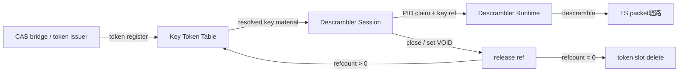
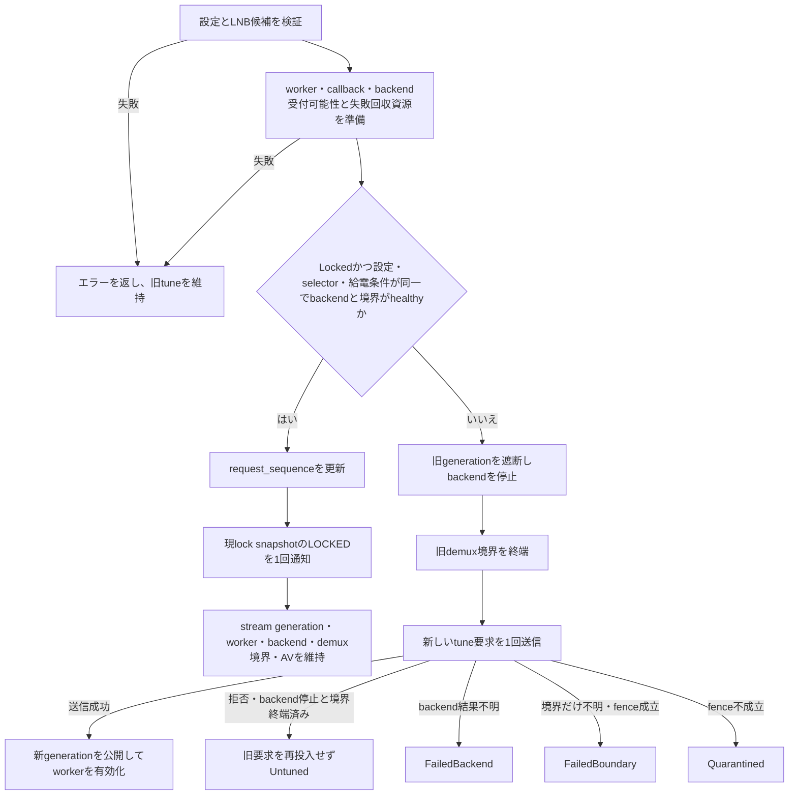

# Tuner HAL 設計判断


## DESIGN_JA.md の責務境界

`DESIGN_JA.md` は Tuner HAL の設計正本である。本書は、AOSP 公開契約、ARIB/ISDB 入力処理、本製品の対応範囲、状態所有者、資源寿命、失敗時遷移、quarantine 条件、未対応機能の返却方針を定義する。

本書は、作業履歴、リリース履歴、ビルド手順、atest手順、VTS手順、静的検索手順、成果物命名規則、完了宣言テンプレートを定義しない。それらは `開発規則.md`、`タスク完了判定の実施方法.md`、`CHANGELOG.md`、各作業計画を正とする。

本書と他文書で、状態遷移、資源寿命、戻り値、capability、失敗時波及範囲が矛盾する場合は、本書を正として他文書を修正する。ただし、作業完了判定、成果物名、build / atest / VTS 手順については `タスク完了判定の実施方法.md` を正とする。


### 共通部品の定義条件

本書で共通部品と呼ぶものは、単なる関数名・ファイル名・薄い委譲 wrapper ではない。共通部品として設計正本へ置く場合は、次を定義する。

| 項目 | 必須内容 |
|---|---|
| 論理契約名 | 例: `ObjectCloseTxn`、`ObjectMethodTxn`、`StreamBoundaryTxn` |
| 実装正本 | 物理 module / file / type は `tuner_hal2/DESIGN_JA.md` の同名論理契約行を単一正本として参照し、本書では複製しない |
| 公開入口 | AIDL層または service_runtime 層から呼んでよい entry point |
| 所有する状態 | lifecycle、registry、callback、worker、FMQ、packet assembler など、当該部品が正本として変更する状態 |
| 所有しない状態 | 呼び出し元または別 transaction が所有する状態 |
| phase order | lifetime / request build / validation / dispatch / commit / rollback / quarantine の順序 |
| 失敗時処理 | 戻り値、rollback、cleanup継続、cleanup failed、quarantine の扱い |
| 呼び出し許可層 | AIDL method body、object wrapper、service_runtime façade、domain transaction のうち許可する層 |
| 呼び出し禁止層 | 誤用を避けるため直接呼んではならない層 |
| 最低テスト | status precedence、rollback、retry、cleanup failure、quarantine などを固定する test |

上記を満たさないものは、共通部品ではなく helper、façade、adapter、または implementation detail と呼ぶ。helper / façade が transaction 正本を名乗ってはならない。

`transaction` という名前は、少なくとも状態変更の開始条件、commit、rollback または cleanup failure / quarantine のいずれかを所有する部品にだけ使う。runtime lock を取って closure を呼ぶだけの部品、引数を同名 method へ横流しするだけの wrapper、domain naming を隠さない薄い façade は transaction ではない。


## 外部文書参照: no-panic / 劣化起動 / 閉鎖側失敗境界

この項目のうち、禁止構文、低レベル失敗の型付き検出、公開status変換の集約方法、mutex汚染、ワーカー生成・joinの実装規約は`tuner_hal/CODE_CONVENTION.md`を正とする。公開AIDL戻り値、status precedence、次状態、資源寿命、閉鎖側失敗対象は本書だけを正本とし、実装規約側で再定義しない。


## 正本・移動済み情報の読み方

本書の正本階層は次の順とする。

1. `DESIGN_JA.md の責務境界`、`製品スコープ / AOSP capability / VTS profile 境界`、`AIDL 契約境界`、`Tuner HAL 状態遷移表SSOT` を最上位正本とする。
2. `0-S. 状態所有・寿命・失敗時遷移設計`、`表1`〜`表20`、`ARIB/ISDB入力処理契約`、`Stream boundary 契約`、`Packet pipeline 正本契約`、`AV shared handle 入出力契約` を、現在の設計契約の正本とする。
3. 旧 `補足契約:` 章は本体正本章へ吸収済みであり、本書内に二重正本として残さない。
4. 個別リリースの履歴、作業経緯、ビルド/atest/VTS/静的検索/成果物命名/完了宣言は本書では定義しない。履歴は `CHANGELOG.md`、完了判定は `タスク完了判定の実施方法.md` を正とする。

削除・移動した旧記載の追跡表は現行リリース物に置かない。現行仕様は本書、実装規約は `tuner_hal/CODE_CONVENTION.md`、統合手順は `tuner_hal2/INTEGRATION.md`、変更履歴は `tuner_hal/CHANGELOG.md` を正とする。存在しない trace 文書を正本参照にしてはならない。

## 製品スコープ / AOSP capability / VTS profile 境界

製品全体のリリース到達点、日本向け scan 候補、サービス検出、channel key の実装データ保持者は tv 直下の `開発規則.md` を正とする。本節では、Tuner HAL の capability、VTS/profile、AIDL戻り値に閉じる境界だけを固定する。HAL は渡された tune request を処理し、BLIND_SCAN や HAL-generated Japanese scan plan は capability / VTS profile で対応宣言しない。

Tuner VTS用XMLは実行環境に依存する静的構成であり、既定では導入しない。使用するVTS artifact/tag/commitと、試験実行機の`ro.vendor.vts_tuner_configuration_variant`を`VtsEnvironmentProfile`の入力として固定し、XML filenameは選択したVTS実装が実際に行う解決規則から決定する。Android 14 AIDL VTSでbase名`/vendor/etc/tuner_vts_config_aidl_V1`へnon-empty variantを`.`区切りで付加して`.xml`を読む実装を選択した場合は、`/vendor/etc/tuner_vts_config_aidl_V1[.<variant>].xml`として解決する。AOSP branch、VTS artifact/tag/commit、variant property、受信元、周波数、stream ID、PID、実行手順、filter/DVR queue容量、製品memory予算を宣言し、必要な全資源を起動前に予約できる場合だけ、その値を持つ静的XMLを解決済みpathへinstallする。VTS artifactまたはvariant propertyを含む環境入力が未確定な場合はfilename自体を`DESIGN_HOLD_VTS_ENVIRONMENT_UNDECLARED`とし、推測したpathへXMLをinstallせず、VTS成功を宣言しない。descrambler AIDL objectを実装していても、試験設定だけで本番のスクランブル解除成功を宣言しない。

Tuner HAL の capability / VTS profile では TS 入力だけを宣言する。製品全体の TS-only スコープは `開発規則.md` を正とし、本書では Tuner HAL の宣言値と返却値を固定する。MMTP、TLV、ALP、IP CID は capability と VTS profile に宣言しない。`IFilter.configureIpCid()` は filter種別にかかわらず `UNAVAILABLE` とする。CID を保存だけして 照合、経路制御、配送 に使わない成功扱いの無処理 を残してはならない。


### export ID と VTS profile の固定

Tuner HAL が framework へ export する frontend ID は backend の単純な numeric index だけに依存しない。`px4video0` と `pxmlt5video0` のように異なる device family が同じ unit index を持つ場合でも、HAL の frontend ID と physical group ID は衝突してはならない。device family code と unit index を組み合わせ、1,000,000 番台の px4 frontend ID として export する。DVB frontend ID はハッシュではなく固定ビット割当で生成し、`2,000,000 + (adapter_id << 12) + (frontend_index << 4) + variant` とする。`adapter_id` と `frontend_index` は 8 bit、`variant` は 4 bit で、variant は ISDB-T=0、ISDB-S=1 に固定する。範囲外の DVB probe は export しない。生成後の duplicate ID 検出は最終保険として残す。px4 frontend の `exclusiveGroupId` は unit index 単独値ではなく、device family code と unit index を含む packed physical group id として返す。

DVB frontend の `exclusiveGroupId` は公開 frontend ID や `(adapter_id, frontend_index)` の一意性から生成せず、backend topology が検証した「同時に機能できない物理 frontend 群」を正本として決める。同じ物理 frontend から公開する ISDB-T/ISDB-S variant は必ず同じ group に属する。異なる `(adapter_id, frontend_index)` を別 group にできるのは、RF/tuner/demod を含む同時利用不可資源を共有せず同時利用できることを topology で確認できる場合だけとし、共有が確認された別 tuple は同じ group にする。global group ID は符号付き32 bitの非負範囲に収め、上位4 bitの backend class と下位28 bitの backend 固有 group payload は、検証済み排他群へ衝突しない識別子を割り当てるための名前空間にだけ使う。現行 backend class は px4=`0x10000000`、DVB=`0x20000000` に固定する。payload が28 bitへ収まらない候補、異なる排他群の group ID 重複、同一排他群内で group ID が不一致になる候補は `CapabilitySnapshot` へ commit せず、その frontend を公開しない。resource arbitration は frontend ID の数値近接や DVB node tuple ではなく、この検証済み物理排他群と `exclusiveGroupId` の対応だけを正本とする。


`DvrLeasePool`は確定済みで不変の`CapabilitySnapshot`を参照し、`getDemuxCaps()`応答と`openDvr()`受付可否を決める唯一の情報源とする。再生・記録DVRの全体上限は`snapshot.playback_count`と`snapshot.record_count`、demuxごとの上限は各1個とする。受付時はlifecycleと引数を検証し、用途別・demux別の使用枠を一括予約してから要求FMQと通知枠を準備する。途中失敗では仮予約を全て取り消し、不完全objectを公開しない。`CleanupPending`または`Quarantined`は最終解放まで使用中と数える。Tuner VTSはruntime能力から無条件に導出せず、起動前`VtsEnvironmentProfile`にVTS artifact/tag/commit、variant property、入力元、PID、経路、queue容量、memory予算が定義されるまで`DESIGN_HOLD`としてXML filenameを解決せず、XMLをinstallしない。使用する静的設定は確定済み`CapabilitySnapshot`に収まり、必要queue容量を正確に予約できなければならない。


### VTS profile / capability / 実装済み機能 対応表

VTS XML/profileで使う機能、capabilityで宣言する機能、実装済み機能は一致させる。VTS profileで使用する機能をcapability非宣言または未実装扱いにしてはならない。capabilityで宣言する機能をVTS/profileから到達不能にして検査を回避してはならない。

| 領域 | capability / profile 方針 | 設計契約 |
|---|---|---|
| `IFilter.setDataSource(filter)`、`filter == NULL` | AOSP意味論として存在する必須契約であり、現行設計の成功対象 | sink filter の入力元を demux input へ戻す |
| `IDescrambler.addPid(pid, optionalSourceFilter)` / `removePid(pid, optionalSourceFilter)`、`optionalSourceFilter == NULL` | AOSP意味論として存在する必須契約であり、現行設計の成功対象 | 指定PIDについてdemux input全体への登録 / 解除として扱う |
| AV shared handle release | media filter shared memory profileでは到達する | `releaseAvHandle(fd付き handle, 0)` を成功させる |
| monitor event | 現行のTS-only `ProductProfile`では対応宣言しない | `configureMonitorEvent(0)`だけを監視停止として成功させ、非0 maskは`UNAVAILABLE`とする。monitor event用の状態、worker、queue、能力値を生成しない |
| AV passthrough | 対応宣言しない | profileでは `isPassthrough=false` に固定する |
| `linkCaps` | main type 粒度 | 広告した main type pair は VTS が生成する subtype `UNDEFINED` 接続も成功対象に含める。成功させない pair は広告しない |


### Tuner HAL 固定境界

- CS110 は周波数のみで選局する。ISDB-S settings で `streamIdType=UNDEFINED` かつ `streamId=0` の明示未指定、または AOSP SDK の default 表現である `streamIdType=STREAM_ID` かつ `streamId=INVALID_STREAM_ID(0xFFFF)` だけを selector なしとして扱う。CS110 tune request に TSID / relative stream-number selector が指定された場合は `INVALID_ARGUMENT` とする。`streamIdType=RELATIVE_STREAM_NUMBER` の負値、`streamIdType=UNDEFINED` の負値、その他の負値 selector は未指定へ丸めない。

ISDB-S selectorはAOSPの`FrontendIsdbsStreamIdType`を正とし、`STREAM_ID`と`RELATIVE_STREAM_NUMBER`を別domainとして受理・検証する。Linux DVB / earth_pt1は`STREAM_ID 0..65534`を`DTV_STREAM_ID`へ渡す。px4 legacy ABIは`slot < 12`を相対番号、`slot >= 12`をabsolute TSIDとして解釈するため、px4では`RELATIVE_STREAM_NUMBER 0..7`と`STREAM_ID 12..65534`をlegacy `slot`へ直接渡す。absolute `STREAM_ID 0..11`はAOSP上有効だが同ABIで相対値と区別できないため、副作用なしの`UNAVAILABLE`とする。`65535`は明示TSIDとして`INVALID_ARGUMENT`とする。selector kindを数値域から推測せず、TISへ`EffectiveCapabilities`、driver名、relative slotを公開しない。`ProductProfile`は検証済み能力を抑止できるが、新設または拡張してはならない。


- コールバック失敗、ワーカー異常終了、FMQ / EventFlag 失敗の状態遷移、診断、後続処理停止条件は表7・表8を正とする。本節では再定義しない。
- DVR 状態 interval はコールバックワーカーの周期にだけ使う。ワーカーの wait は stop signal で wake 可能な cancellable wait とし、close / Drop / shutdown は interval 満了を待たない。
- `getAvSharedHandle()`とAV filter `start()`の状態別契約は、本書の「表4. AV共有メモリ資源寿命表」を正とする。`releaseAvHandle()`の入力分類、戻り値、資源変化は「表1-C-AVH. `releaseAvHandle()` 全域判定表」だけを正とする。

backendのエラーは、呼び出し側の不正値・値域違反を`INVALID_ARGUMENT`、不存在・使用中・容量不足・規格上は有効だが未対応を`UNAVAILABLE`、不正なライフサイクルを`INVALID_STATE`、依存資源の未初期化を`NOT_INITIALIZED`、割り当て失敗を`OUT_OF_MEMORY`、権限・入出力・設定破損・不変条件違反を`UNKNOWN_ERROR`へ対応付ける。


- 現行のTS-only `ProductProfile`はfilter monitor eventを宣言しない。`configureMonitorEvent(0)`は監視停止として成功し、未配送monitor event、保存mask、種別ごとの最終観測値を消去する。非0 maskは常に`UNAVAILABLE`とし、monitor event用の状態、worker、queueを生成しない。通常の`DATA_READY` / `OVERFLOW` / `onFilterEvent()` deliveryはmask 0または非0要求の拒否によって抑止しない。
- soft demux の section / PES assembler と filter `stop()` / `flush()` / `configure()` / `close()` の状態別契約は、本書の「表1. IFilter 状態表」を正とする。
- `setMaxNumberOfFrontends(type, maxNumber)`は同じ`FrontendType`の`0 <= maxNumber <= defaultMax(type)`だけを成功させる。負値、未知type、同typeの既定上限超過は`INVALID_ARGUMENT`とし、別typeの上限を変更しない。
- 製品実行時 の frontend registry は実在 probe できた backendエントリ だけで構成する。probe 失敗は 診断情報レコード に残し、劣化 frontendエントリ / テスト劣化補助関数 / 診断劣化補助関数 は作らない。


### nullable Binder 境界

AOSP意味論としてNULL binder入力を持つ境界は、`IFilter.setDataSource(filter)`の`filter == NULL`、`IDescrambler.addPid(pid, optionalSourceFilter)` / `removePid(pid, optionalSourceFilter)`の`optionalSourceFilter == NULL`、`IFrontend.setCallback(callback)`の`callback == NULL`、`ILnb.setCallback(callback)`の`callback == NULL`とする。`setDataSource`はdemux input復帰、`IDescrambler`のNULL filterは指定PIDについてdemux input全体を対象とする操作、callback NULLは登録解除である。これらはAOSP公開契約上の必須動作であり、NULL経路とnon-null経路の期待動作、状態遷移、戻り値、資源寿命、失敗時遷移は本書を唯一の契約正本とする。

生成言語bindingの表現、現在の実装到達状態、実装阻害の追跡先は公開契約ではないため`../tuner_hal2/DESIGN_JA.md`を正とする。実装状態を理由に本節のAOSP契約を弱めたり、frozen AIDLをvendor独自改変したりしてはならない。

### `IFrontend.setCallback()` 登録契約

frontend runtimeはcallback slotを`Empty(callback_generation)`または`Registered(callback_identity, callback_generation)`として所有する。`callback_generation`は単調増加し、古い値を再利用しない。tune/scan workerはcallback実体を保持せず、frontend operation generationとeventだけを配送キューへ渡す。配送開始時に現在のcallback slotを解決し、callback generationが置換済みの未配送entryは破棄する。置換前にBinder配送を開始済みの呼出結果は診断へ記録し、新callbackへ重複配送しない。

| API / 入力状態 | AIDL戻り値 | 確定する状態 | 失敗時と資源寿命 |
|---|---|---|---|
| `setCallback(non-NULL)` / Live / `Empty` | 成功 | 新callbackのstrong referenceとdeath recipientを準備し、Liveを再検証して`Registered(new_identity, new_generation)`へ原子的に確定する | 新artifact準備または登録が失敗した場合は`UNKNOWN_ERROR`とし、`Empty`とgenerationを維持する |
| `setCallback(non-NULL)` / Live / `Registered(old)` | 成功 | 同一identityを含む再設定を受理し、新callbackと新generationへ原子的に置換する。確定後は旧generationの新規配送を許可しない | 確定前失敗は`UNKNOWN_ERROR`とし、旧callback、旧generation、旧配送許可を維持する。確定後に旧death recipientの解除結果を確定できない場合は型付き診断と後片付け台帳へ移し、新callbackを旧callbackへ戻さない |
| `setCallback(NULL)` / Live | 成功 | callback slotを`Empty(new_generation)`へ原子的に変更し、旧generationの未配送entryを破棄する。既に`Empty`なら成功no-opとしてよい | callback解除とruntime registry clearは同じtransactionで確定する。確定前失敗は旧callbackを維持し、成功扱いにしない |
| `setCallback(any)` / LogicalClosed、CleanupPending、Quarantined | `INVALID_STATE` | 入力状態を維持 | callback artifact、generation、配送queueを変更しない |

current callbackのBinder deathは、death recipientが保持したcallback generationとslotの現generationが一致する場合だけslotを`Empty(new_generation)`へ変更する。置換済みcallbackの遅延death通知は無視する。`close()`は公開操作を遮断した後にcallback generationを無効化し、未配送entryを破棄してcallback artifactを一回だけ後片付けする。

### Android 14 AIDL filter source 境界の現行処理


`configure()`は入力元との接続を変更しない。新しい設定が既存の接続と両立しない場合は`INVALID_STATE`で拒否し、以前の設定と接続を保持する。切断は`setDataSource(null)`で明示する。不正な設定には`INVALID_ARGUMENT`を返す。


`IDescrambler.addPid()` / `removePid()` は、`optionalSourceFilter == NULL` を demux input 全体に対する PID 登録 / 解除として扱い、`optionalSourceFilter != NULL` を指定 filter output、すなわち upper stream に対する PID 登録 / 解除として扱う。NULL 経路は現行AOSP契約上の必須成功対象として設計上および目標実装上の対象に含めるが、現行Rust Binder境界では受信経路が未成立であるため、実装済み対象、VTS接続済み、またはAOSP契約達成済みには含めない。non-null source filter 経路は、本書の「表D-1. IDescrambler PID 操作表」を正とし、同一 demux、非閉鎖、世代一致を検証する。


### 公開transactionのphase・確定点・失敗処理契約

この表は`../tuner_hal2/DESIGN_JA.md`から責務移管した公開transactionのphase、確定点、失敗処理を保持する。公開AIDLの意味、状態、戻り値、確定点、rollback / cleanupは本書が唯一の正本である。実装owner、module anchor、呼び出し禁止入口は`../tuner_hal2/DESIGN_JA.md`を正とする。

object methodでは、呼出対象のlifecycle/generation不整合を引数値の詳細検証より先に`INVALID_STATE`へ確定する。呼出対象の生存検証後のtag、列挙値、nullable入力、値域の不正は`INVALID_ARGUMENT`とし、状態を変更しない。別object引数のlifecycle/generation不整合は`INVALID_STATE`、foreign owner、別demux、wrong kind、非互換関係は`INVALID_ARGUMENT`とし、呼出対象objectのowner検証と引数objectのownership検証を同じ判定へ丸めない。

| 契約 | 必須phase order | 確定点・失敗処理 |
|---|---|---|
| object method | 呼出対象live・自身の登録owner・generation・kind確認 → request変換 → 引数object live/generation確認 → 引数object owner/demux/kind/関係検証 → dispatch計画 → 一回限り権限消費 → domain実行 | domain commit前は無変更。呼出対象lifecycle不整合と引数object lifecycle不整合は`INVALID_STATE`、foreign/wrong関係は`INVALID_ARGUMENT`、commit後失敗は型付き診断と契約別cleanupへ接続 |
| root/child open | 公開ID・能力確認 → 全使用権仮予約 → runtime登録準備 → Binder object準備 → 一括commit | objectとruntime登録を同時公開し、途中失敗は全仮予約・artifactを逆順解放 |
| public close / owner loss / Drop leak | 論理閉鎖 → 新規権限遮断 → worker・queue・接続・artifact・domain cleanup → runtime unregister → ledger解放 | runtime unregister成功後だけobject tableをClosedへ確定。再試行可能失敗はauthorityとleaseを`CleanupPending`へ移す |
| descrambler key/session | session検証 → key claim準備 → PID・session変更 → commit → 旧claim解放 | sessionとkey tableを同じcommitで更新し、失敗時は旧sessionを維持 |
| source boundary | 両objectのlive・owner・demux・generation確認 → 新関係準備 → queue/assembler境界 → 関係commit → 旧関係解放 | commit前失敗は旧関係を維持し、境界の部分確定は隔離 |
| frontend tune/scan | request検証 → tuneでは同一条件・healthy snapshot判定、scanではrequest fingerprint確定 → worker/callback/rollback準備 → 非破壊tune re-entry、同一`LockedReported`のscan継続、または旧session遮断後のbackend要求・新generation commitへ分岐 | 同一健全tuneは`request_sequence`と現lockの`LOCKED`配送予約だけを確定し、現generation・worker・backend・demux境界・AVを維持する。scan継続は旧scan generationをfenceし、backend再探索なしに新callback generationからENDを1回配送する。それ以外のfull tune/scanだけが旧session遮断、backend要求、新generation commitへ進み、失敗時は`../tuner_hal/DESIGN_JA.md`の表19と統合状態表に従う |
| callback artifact | owner live確認 → artifact保持 → runtime登録 → domain確定 → lock外配送 | lookup失敗、Binder配送失敗、cleanup失敗を別phaseとして記録し、片側だけ残さない |
| worker終端 | stop predicate確定 → wake/cancel → 終了回収またはReaper移管 → 残cleanup → lease返却 | 世代遮断前に移管せず、回収完了前に専有資源を再利用しない |

## AIDL 契約境界

`IFilter`、`IDvr`、`IFrontend`、`IDemux`、`ILnb`、`IDescrambler` の 公開メソッド は、AIDL HAL の契約面として close 後状態を必ず検査する。状態別の戻り値、次状態、維持する内部状態、破棄・無効化する内部状態は、本書の「Tuner HAL 状態遷移表SSOT」を正とする。

通常のメモリ割り当て、FMQの作成・領域確保、共有メモリまたはdma-bufの割り当てについて、要求を満たす容量を確保できないことが確定した場合は`OUT_OF_MEMORY`へ写像する。`UNKNOWN_ERROR`は、容量不足ではない内部不整合、allocator/backendから原因を確定できない異常、または割り当て結果・副作用を確定できない障害に限定する。既知の容量不足を`UNKNOWN_ERROR`へ丸めず、低レベル実装名やerrnoにより公開結果を変えない。個別APIのlifecycle、入力、未対応、commit後失敗が優先される場合は各状態表のpriorityを正とする。

### ITunerルートAPIの固定契約

| API | 成功条件と結果 | 失敗時 |
|---|---|---|
| `getFrontendIds()` | 起動時に確定したfrontend IDを昇順で返す。ID集合はサービス世代中不変であり、`setMaxNumberOfFrontends()`で増減させない | snapshotを読み出せない内部障害は`UNKNOWN_ERROR`、部分結果は返さない |
| `openFrontendById(id)` | 公開済みID、type別の現在上限、使用権、runtime登録を同一transactionで確定し、指定IDの`IFrontend` objectだけを返す | 未公開IDは`INVALID_ARGUMENT`、公開済みだが現在上限または使用枠により開けない場合は`UNAVAILABLE`、後段準備失敗では予約と登録を戻してobjectを返さない |
| `getFrontendInfo(id)` | 公開済みIDに対応する起動時確定済みの不変な`FrontendInfo`を返す | 未公開IDは`INVALID_ARGUMENT`、内部snapshot障害は`UNKNOWN_ERROR`、部分情報は返さない |
| `getDemuxIds()` | `CapabilitySnapshot.publicDemuxes`のkeyを昇順で返す。ID集合はサービス世代中不変とする | snapshotを読み出せない内部障害は`UNKNOWN_ERROR`、部分結果は返さない |
| `openDemux(out demuxId)` | 公開済みdemux ID集合から使用可能な1 IDを選び、その使用権、runtime登録、`IDemux` objectを同一transactionで確定する。成功時だけ、objectと要素数1の`demuxId`配列を一括して返す | 使用可能な公開IDまたは容量がない場合は`UNAVAILABLE`。後段準備失敗では予約と登録を戻し、objectもIDも返さない |
| `openDemuxById(id)` | 公開済みの指定IDについて使用権とruntime登録を同一transactionで確定し、その`IDemux` objectだけを返す。入力IDを出力として返さない | 未公開IDは`INVALID_ARGUMENT`、公開済みだが使用中または容量不足は`UNAVAILABLE`、後段準備失敗では予約と登録を戻してobjectを返さない |
| `getDemuxCaps()` | `CapabilitySnapshot.publicDemuxes`と同じper-demux能力集合から`numDemux`と`filterCaps`を導出し、その他の不変な`DemuxCapabilities`項目と一括で返す | snapshotを読み出せない内部障害は`UNKNOWN_ERROR`、部分的な能力値は返さない |
| `getDemuxInfo(id)` | `CapabilitySnapshot.publicDemuxes[id].filterTypes`を不変の`DemuxInfo.filterTypes`として返す | 未公開IDは`INVALID_ARGUMENT`、内部snapshot障害は`UNKNOWN_ERROR` |
| `openDescrambler()` | descrambler object枠と`NeverCalledUnbound` session台帳だけを同一transactionで確定し、`IDescrambler` objectだけを返す。demux ID、demux generation、`DescramblerCapacityPool`は選択しない | 対応するdescrambler能力またはobject/session枠がない場合は`UNAVAILABLE`。後段準備失敗では予約と登録を戻してobjectを返さない |
| `getLnbIds()` | 起動時に公開対象と確定したLNB IDを昇順で返す。現行profileでは空配列を返す | snapshotを読み出せない内部障害は`UNKNOWN_ERROR`、部分結果は返さない |
| `openLnbById(id)` | 将来、公開済みIDのendpoint使用権とruntime登録を同一transactionで確定できる場合に、その`ILnb` objectだけを返す | 現行profileではLNB能力を公開しないため`UNAVAILABLE`。能力を公開する将来profileでは、未公開IDは`INVALID_ARGUMENT`、使用中または後片付け未完のendpointは`UNAVAILABLE`とし、objectを返さない |
| `openLnbByName(name, out lnbId)` | 本製品は名前付き外部LNBを公開しない | 空文字は`INVALID_ARGUMENT`、その他の名前は`UNAVAILABLE`。LNB ID、object、leaseを生成せず、出力を部分公開しない |
| `isLnaSupported()` | `false`を返す | 内部状態へ依存させない |
| `setLna(enable)` | 本製品はLNA制御を公開しない | `UNAVAILABLE`。frontend、backend、capabilityを変更しない |

### `FrontendInfo` scalar capability 契約

公開frontendごとに、`CapabilitySnapshot`は`FrontendInfo`へ返す`minFrequency`、`maxFrequency`、`minSymbolRate`、`maxSymbolRate`、`acquireRange`を`FrontendScalarCapability`として変更不能に保持する。`getFrontendInfo(id)`はこのsnapshotをコピーするだけとし、呼出し時のbackend probe、推測値、別の周波数表から値を合成しない。

- `minFrequency`と`maxFrequency`は、同じfrontendの公開`tune()`/`scan()` validationが受理し得る周波数集合の外側境界と一致させ、`0 <= minFrequency <= maxFrequency`を満たす。境界外を`UNAVAILABLE`で拒否する実装が、それより広い範囲を`FrontendInfo`で広告してはならない。逆に、明示選局で受理する周波数をこの範囲外へ置いてはならない。
- `minSymbolRate`と`maxSymbolRate`は当該frontendが受信可能なsymbol rate rangeをsymbols per secondで表し、`FrontendSettings`でcallerが明示symbol rateを指定できるかどうかとは分離する。backend/device/profileの能力証跡から実際の受信可能範囲を決め、明示指定非対応だけを理由に`0/0`へ固定したり、独自sentinelとして扱ったりしない。settings側の`symbolRate`受付可否は別のvalidation契約に従う。
- `acquireRange`は、要求周波数の周囲でbackendが探索可能と製品profileで検証した非負の範囲だけを返す。検証済みの非0範囲がない現行profileでは`0`とする。`acquireRange`を`minFrequency`/`maxFrequency`の外側を受理する根拠にしてはならない。
- 起動時のsnapshot候補について、上記scalarとfrontend validation、backend設定経路、`ProductProfile`のいずれかが矛盾する場合は候補をcommitしない。scalarだけを後からclampして整合したことにしてはならない。


### demux能力の横断不変条件

`CapabilitySnapshot.publicDemuxes`は、公開demux IDをkey、当該demuxで実際にopenできる`DemuxFilterMainType`のbit ORを`filterTypes`とする単一の順序付きmapである。`getDemuxIds()`、`getDemuxInfo()`、`getDemuxCaps()`、`openDemux()`、`openDemuxById()`はこのmap以外からIDまたはfilter main typeを合成してはならない。

| 公開値 | 唯一の導出規則 |
|---|---|
| `getDemuxIds()` | `sort(keys(publicDemuxes))` |
| `DemuxCapabilities.numDemux` | `size(publicDemuxes)` |
| `getDemuxInfo(id).filterTypes` | `publicDemuxes[id].filterTypes` |
| `DemuxCapabilities.filterCaps` | 全`publicDemuxes[id].filterTypes`のbit OR。集合が空なら0 |

snapshot確定時に、ID重複、未定義bit、公開filter数と矛盾するmain type、`numDemux != size(publicDemuxes)`、または`filterCaps != OR(filterTypes)`を検出した候補はcommitせず、候補vector全体を戻す。確定後に`DemuxInfo`と`DemuxCapabilities`を別々に補正してはならない。これによりAndroid 14 VTSの全demux横断一致を構造的に保証する。

`setMaxNumberOfFrontends(type, maxNumber)`の上限は`FrontendType`ごとに独立して保持する。`defaultMax(type)`は起動時probeに成功し、非空のhardware infoまで準備できた同じtypeのfrontend数、`currentMax(type)`はその初期値を持つ。未知のtype、負値、`defaultMax(type)`超過は`INVALID_ARGUMENT`とする。`0..defaultMax(type)`への変更は成功し、既存leaseを強制closeしない。新規openだけを`activeLeaseCount(type) < currentMax(type)`で制限し、0では同typeの新規openを`UNAVAILABLE`とする。`getMaxNumberOfFrontends(type)`は同じtypeの`currentMax`を返す。`getFrontendIds()`の不変な機器ID集合は上限変更で増減させない。

### 非対応のTimeFilterとCI CAM

本製品の`DemuxCapabilities.bTimeFilter`は`false`に固定する。`IDemux.openTimeFilter()`はdemuxが閉鎖済みなら`INVALID_STATE`、それ以外では`UNAVAILABLE`を返し、`ITimeFilter` object、lease、workerを生成しない。したがって`setTimeStamp()`、`clearTimeStamp()`、`getTimeStamp()`、`getSourceTime()`、`close()`へ到達可能な公開objectは存在しない。

VTS製品設定の`canConnectToCiCam`は`false`に固定する。CI CAM系APIはAIDLシグネチャどおり次の契約へ分け、CAM ID、接続状態、backend状態を変更しない。対応しない機能を成功扱いの無処理にしてはならない。

| API / 入力 | 閉鎖済みobject | Live object |
|---|---|---|
| `IFrontend.linkCiCam(ciCamId)` / `unlinkCiCam(ciCamId)` / `IDemux.connectCiCam(ciCamId)`、`ciCamId < 0` | `INVALID_STATE` | `INVALID_ARGUMENT` |
| 同3 API、`ciCamId >= 0` | `INVALID_STATE` | `UNAVAILABLE` |
| `IDemux.disconnectCiCam()` | `INVALID_STATE` | `UNAVAILABLE` |

`disconnectCiCam()`には入力引数がないため、CAM ID検証を適用しない。

### `IFrontend.getHardwareInfo()`

公開するfrontendは、probe時に非空のhardware info文字列を確定できたものに限る。文字列はbackend種別、物理機器識別子、driver revisionなど、秘密情報を含まない不変情報から生成し、同じfrontend objectの寿命中は同じ値を返す。objectがLiveなら必ず成功して非空値を返し、部分値や空文字を返さない。閉鎖開始後は`INVALID_STATE`とする。probe時に生成できないfrontendは`getFrontendIds()`へ公開せず、VTSがopen済みfrontendで失敗する状態を作らない。


`IFrontend.getStatus(statusTypes)` と `getFrontendStatusReadiness(statusTypes)` では、返却件数の契約が異なる。`getStatus()` は、`FrontendInfo.statusCaps` で公開した種類だけを要求順に返し、公開済み種類の重複も維持する。未公開の既知値と、この実装がまだ認識しない将来の列挙数値は無視するため、要求がすべて非対応種類であれば空の配列を返して成功する。種類ごとの「取得不能」を表す架空値を生成してはならない。要求された公開済み種類の取得に1件でも失敗した場合は、部分結果を返さず `UNAVAILABLE` とする。`getFrontendStatusReadiness()` は、既知・未知にかかわらず要求された各要素に対し要求順で1件ずつ返す。公開済み種類には `UNAVAILABLE`、`UNSTABLE`、`STABLE` のいずれか、未公開の既知値と将来の列挙数値には `UNSUPPORTED` を返す。stable AIDLへ将来追加された列挙値だけを理由に要求全体を`INVALID_ARGUMENT`へ落とさず、現行Android 14の公開済み値に対するVTSの順序・件数・値の契約は維持する。出力件数を決める処理は両APIで共用しない。

公開済みstatusの値は、frontend runtimeが所有する世代付き`FrontendStatusSnapshot`だけから返す。tune/scan workerまたはbackend監視処理が、backend I/Oの完了後に同じfrontend generationを再検証してsnapshotを更新する。`getStatus()`と`getFrontendStatusReadiness()`はsnapshotを読むだけとし、backend I/O、probe、worker起動、状態変更を行わない。snapshotはstatus種別ごとに値、readiness、取得元、更新generation、単調増加する更新番号を持つ。新しいtune/scan、`stopTune()`、`stopScan()`、backend切断、fatal backend failure、`close()`では旧generationの値を無効化する。公開中の`DEMOD_LOCK`と`RF_LOCK`は、現generationで未取得または無効化済みなら`false`かつ`UNSTABLE`とし、fatal backend failureで値の正当性を保証できない場合は要求全体を`UNAVAILABLE`とする。時刻だけで同generationのlock値を失効させず、世代境界またはbackend事象で更新する。任意telemetryは、起動時に安定取得と更新経路を証明できない限り`statusCaps`へ公開しない。


`IFilter.setDataSource(source)` は、AOSP意味論どおり `source != NULL` の場合に指定 filter output を入力元とし、`source == NULL` の場合に sink filter の入力元を demux input へ戻す。`setDataSource(NULL)` は現行設計の成功対象に含める。AOSP frozen/stable AIDL の vendor 独自改変、raw Binder transaction parser による公開契約を通さない実装は採用しない。non-null source filter 経路では、旧 `SourceFilter(filter_id, generation)` origin に属する section / PES assembler、continuity、flush generation、downstream partial state を切断し、旧 source 由来の未完了 payload を新 source 由来 payload へ連結してはならない。

`IFrontend.tune()` はbinder thread上でlock完了まで待ち続けず、表19およびAT-001と同じ二分岐を正とする。前回状態が`Locked`で、正規化済みsettings、typed selector、LNB/power条件が同一であり、backendとstream boundaryの同値性・健全性を同一snapshotで証明できる場合は非破壊re-entryとする。`request_sequence`を更新し、現lockに対応する`LOCKED`を正確に1回配送するが、現stream generation、worker、backend要求、demux境界、接続filter/DVR、AV経路を維持し、旧workerまたはgenerationの無効化、backend再要求、demux boundary reset、AV中断を行わない。

旧tuneが未完了、条件が異なる、または同値性・健全性を証明できない場合だけfull retuneへ進む。prepareで新要求の検証、必要資源、callback経路、失敗回収経路を確定した後、前回tune/scanのgenerationを無効化して旧sessionを遮断し、backendへtune requestを投入し、新generationの非同期workerが`LOCKED`または`NO_SIGNAL`を終端通知する。破壊的commit後に新要求が拒否された場合は旧要求を自動再投入せず、表19の原因別状態へ遷移する。

無応答backendを有限時間で終端する製品watchdogはbackend別`ProductProfile.tuneTerminalDeadlineMs`を正とし、現行profileはearth_pt1=`4000 ms`、px4=`7000 ms`とする。これはAIDL規定値ではなく、正常なbackend処理列を期限前に打ち切らないための製品値である。backendからlockまたは明示失敗が来ないまま期限へ達した場合は、現generationだけを停止し、接続demuxへのデータを遮断して`NO_SIGNAL`を正確に1回通知し、状態を`Idle`へ移す。同一generationで期限とlockが競合した場合は、期限判定前にbackendの確定済みlockを再確認し、既に観測済みの`LOCKED`を優先する。`stopTune()`、`close()`、full retuneとなる次回`tune()`、`scan()`は該当generationをcancelし、古いworkerからの通知を捨てる。非破壊re-entryは現generationを維持する。Android 14 AIDL VTSへ結び付けるprofileは、実信号でVTSの`WAIT_TIMEOUT=3秒`より前に`LOCKED`を通知できることを別の受入条件とする。VTSの待機値を製品watchdogへ流用せず、backend別deadlineを3秒へ短縮しない。

`IFrontend.scan()` は、同一条件の再 scan であっても成功扱いの無処理にしない。対象LineageOS 21 / Android 14 VTSは、最初の `scan(K)` で `LOCKED` を受け取ると同じsettingsとscan typeで `scan(K)` を再度呼び、その後の `END` を待つ。この継続契約を満たすため、frontend scan sessionは `Idle`、`Running(generation, request_fingerprint)`、`LockedReported(generation, request_fingerprint)` を区別する。`request_fingerprint` は正規化済み `FrontendSettings` と `FrontendScanType` から決定し、object identityやdriver固有表現へ依存させない。

`Running(g, K)` で `LOCKED` のcallback配送が成功した場合は `LockedReported(g, K)`へ確定する。同じKで次の `scan()` が呼ばれた場合も、AOSP契約どおり旧generationを先に終端し、新しいcallback generationを発行する。ただし、同一要求について既にlock報告済みであるためbackendを再探索せず、新generationから `END` を正確に1回配送する。これは新generationとterminal callbackを持つ継続stepであり、成功扱いの無処理ではない。旧generationから遅延到着したcallbackはgeneration mismatchとして捨てる。

異なるrequest fingerprintの `scan()`、`stopScan()`、`tune()`、`close()`では `LockedReported` を破棄する。異なるrequestは通常の新scanとしてbackend探索を開始する。同一requestの継続で `END` 配送が失敗した場合は、scanのterminal reasonとend delivery outcomeを分離する既存契約に従い、backend再探索または二重 `LOCKED` で補償しない。最低試験は `scan(K) → LOCKED(g1) → scan(K) → END(g2)` を満たし、2回目にbackend探索と再度の `LOCKED` がないこと、`scan(K2)`、`stopScan()`、`tune()`、`close()`で継続状態が失効することを確認する。

`IFrontend.close()` は frontend backend の critical cleanup を成功扱いで握り潰さない。公開 close では、scan cancel、tune ワーカー stop、ライブ pump stop、backend close、コールバック解除、demux unbind、frontend lease release を step runner として扱い、途中 step が失敗しても後続 cleanup を継続し、最初に観測した critical error を AIDL 状態 として返す。cleanup failure 後の frontend オブジェクト は通常操作へ戻さず、close retry だけを通常の復旧経路として許可する。戻り値を返せない Drop 経路は通常 cleanup の代替にせず、未 close または cleanup 未完了を `ObjectCloseTxn`へ未完cleanup authorityと診断を移管し、同じcleanup state machineで再試行または隔離へ進める。

DVB / earth_pt1 backend では、`DTV_CLEAR` は明示的な tune 停止操作である `stop_tune()` の責務とする。DVB backend の `close()` は reader stop と fd release を行うが、`DTV_CLEAR` の実行を close の必須条件とはしない。したがって、DVB `close()` が `DTV_CLEAR` を発行しないことを release blocker または bug と扱わない。

`IFrontend.removeOutputPid(pid)` は、frontend 出力段で PID を除去できる実装が存在しない限り `UNAVAILABLE` とする。soft demux 後段の block list だけで PID を捨てる実装は、frontend-level output PID removal を実装したことにしない。


### DVR playback status の空き領域基準

DVR playback status は playback input buffer の空き領域、すなわち space を基準に判定する。

| PlaybackStatus | 意味 |
|---|---|
| `SPACE_EMPTY` | playback input buffer の空き領域が空、すなわち書き込み余地がない |
| `SPACE_ALMOST_EMPTY` | 空き領域が少ない |
| `SPACE_ALMOST_FULL` | 空き領域が多い |
| `SPACE_FULL` | 空き領域が満杯、すなわち buffer は空に近い |

使用済み量基準と空き領域基準を混同してはならない。


## Tuner HAL 状態遷移表SSOT

本節の表は、Tuner HAL の状態を持つ公開API、内部事象、資源寿命、戻り値、副作用のSSOTである。表に記載した状態別契約は、後続の散文で再定義しない。後続本文は、表だけでは読み取れない背景、製品方針、能力宣言、実装上の補足に限定する。


### 0-S. 状態所有・寿命・失敗時遷移設計

#### 0-S-1. 設計原則

Tuner HAL は、内部状態の正本を1つに固定する。複数の構造体が同じ状態を独立に保持してはならない。

公開API 主経路は、必ず正本所有者を経由する。共通部品を追加しただけ、一部経路が共通部品を呼ぶだけ、旧名が消えただけでは、設計適合とはみなさない。

各APIは次を固定する。

| 項目 | 内容 |
|---|---|
| 状態所有者 | どの構造体が正本か |
| 成功時commit | 何が確定するか |
| 失敗時rollback | 何を戻すか |
| rollback失敗時 | quarantine / failed / retry のどれに落とすか |
| cleanup失敗時 | 再試行可能に残すか、quarantineするか |
| Drop時動作 | Dropで何をしてよいか |
| 診断 | 何を残すか |
| 公開API戻り値 | どのAIDL状態を返すか |

rollback不能、cleanup不能、正本不一致、backend実状態とregistry不一致、ワーカー状態不一致は、通常状態として扱ってはならない。通常状態へ戻せない場合は quarantine または failed 状態へ落とす。

#### 0-S-2. 状態所有者表

| 資源 / 状態 | 正本所有者 | 補助所有者 | 禁止事項 |
|---|---|---|---|
| service lifecycle | `TunerHal` | なし | 子資源が service 全体状態を直接変更しない |
| frontend lease | `FrontendLedger` | `FrontendRuntime` | open count、physical group、runtime binding を別々に確定しない |
| frontend backend state | `FrontendRuntime` | backend adapter | backend実状態とruntime状態を通常状態で乖離させない |
| demux id / refcount | `DemuxLedger` | `DemuxHal` | live id、registry record、refcount を別々に確定しない |
| demux データ経路 | `DemuxRuntime` | `RuntimeIoRegistry` | FMQ/DVR/AV境界処理をAPIごとに重複実装しない |
| filter lifecycle | `FilterLedger` | `FilterHal`, `soft_demux` | soft demux filter record と binder object の片方だけを残さない |
| filter queue | `FilterQueueBacking` | `FilterHal` | write成功後のwake失敗を完全失敗として黙殺しない |
| DVR lifecycle | `DvrLedger` | `DvrHal`, `soft_demux` | DVR object と soft demux DVR record の片方だけを残さない |
| playback queue | `PlaybackQueueBacking` | playback ワーカー | ワーカー失敗だけでDVRをclosed扱いにしない |
| descrambler session | `DescramblerSession` | `DescramblerLedger` | demux binding、PID、source filter、key tokenを別々に閉じない |
| key token | `DescramblerKeyTable` | `DescramblerSession` | refcount不整合のまま成功扱いしない |
| LNB state | `LnbRegistry` | backend adapter | backend状態とregistry状態の乖離を通常状態にしない |
| ワーカー | `WorkerRuntime` | 所有オブジェクト | 所有者不明ワーカーを作らない |
| stream boundary | `StreamBoundaryTxn` | demux/filter/DVR/AV | tune/scan/source切替で境界処理を重複実装しない |
| packet pipeline | `PacketPipeline` | `soft_demux` | continuity、origin、generationを複数箇所で更新しない |
| AV shared memory | `AvSharedBacking` | `FilterHal` | fd番号一致をshared handle同一性条件にしない。fd付きhandle + `avDataId == 0` はclient側shared handle使用終了通知として扱う |

未解放AV allocationの正本は、正の`avDataId`をkeyとするactive token台帳に記録した`{owner_filter_id, filter_generation, transfer_kind, backing_id, allocation_id, avDataId, lease_state}`とする。ファイル記述子番号や`fstat`の`{st_dev, st_ino, size}`をallocation identityの正本にしてはならない。`fstat`などの記述子メタデータは、採用した記憶領域実装で同一性が保証される場合だけ補助検証と診断に用いる。共有ハンドルの`dataId=0`解放は呼出先IFilterが所有するboundedなクライアント使用権を対象とし、正の`dataId`解放はactive token台帳で当該IFilterの未解放allocationと転送方式を特定して行う。allocation解放成功時はtoken entryを削除し、その後activeでない正のtokenは`INVALID_ARGUMENT`として資源を変更しない。解放済みduplicate、foreign、never-issuedを永久に識別するためのtombstoneは持たない。台帳の信頼性を確認できない場合は`UNKNOWN_ERROR`とし、安全を確認できない記憶領域を隔離する。


#### 0-S-3. 公開API transaction（状態遷移）契約

公開API の状態変更は、原則として次の段階で扱う。

```text
validate
  -> reserve
  -> prepare
  -> apply
  -> commit
```

| 段階 | 許可 | 禁止 |
|---|---|---|
| validate | 引数、状態、capability、owner一致、closed状態の確認 | 状態変更 |
| reserve | ledger / id / slot / ワーカーslot の仮確保 | backend実状態の変更 |
| prepare | ワーカー生成準備、コールバック経路準備、rollback snapshot取得 | 旧公開状態の破壊 |
| apply | backend / soft_demux / queue / registry への変更 | commit不能な変更をsnapshotなしに行うこと |

各操作は準備、主要状態の確定、確定後処理の順に実行する。主要状態の確定では正本状態、所有権、backendへの反映を扱い、確定後処理ではcallback、状態通知、診断、後片付けの集計を扱う。確定後処理の失敗は型付きの副次結果として保存し、主処理の戻り値を変更しない。ただし、API別状態表がコールバック経路の準備または登録を成功確定条件に含める操作では、その処理を確定前に実行する。この共通則を使ってAPI別の成功条件を確定後処理へ移してはならない。


| 段階 | 許可 | 禁止 |
|---|---|---|
| rollback | commit前変更の取り消し | 失敗を握りつぶして通常状態へ戻すこと |
| quarantine | rollback不能資源の隔離 | 成功扱いで通常操作を許すこと |

commit前失敗では、成功戻りを返してはならない。commit後cleanup失敗では、APIの戻り値方針を各API表で固定し、必ず診断に残す。rollback失敗時は、対象資源を quarantine または failed 状態へ落とす。


#### 0-S-3A. 共通部品適用表

共通化するのは、state owner、commit boundary、rollback authority、failure semantics が一致する不変条件とmechanismだけとする。phaseの形が似ているだけの状態機械を同一transactionへ統合しない。API別節は公開意味、対象、順序、戻り値だけを定義し、状態mutationの第二の正本を持たない。

| 対象処理 | 所有共通部品 | 必ず通す経路 | 禁止する実装 |
|---|---|---|---|
| public close / owner loss / Drop | `ObjectCloseTxn` | `begin_close`を単一atomic commitとしてlogical close確定・新規通常操作遮断・`CloseCleanupAuthority`取得を同時に線形化し、そのauthority下でtyped cleanupを実行 | `DropLeakTxn`等の別cleanup authority、API/Drop/Reaperごとのclose state machine、中間的なclosed-without-authority状態 |
| Filter source relation | `SourceBoundaryTxn` | Filter source/sink relationのvalidate/prepare/commit/rollback。`setDataSource()`、source Filter close/unlink cleanupの全mutationを同ownerへ接続 | demux/frontend relationを吸収すること、API別graph mutation |
| Demux frontend source relation | `DemuxFrontendSourceTxn` | relation prepareと`StreamBoundaryTxn.prepare()`を同じ上位transactionでcommit/abort。`setFrontendDataSource()`、Frontend/Demux closeのunbind cleanupを同ownerへ接続 | relationとstream generationを別commitで公開すること |
| stream data boundary | `StreamBoundaryTxn` | stream generation、continuity、section/PES/record-index parser/assembler boundaryとprepared invalidation dispatch | relation、Filter/DVR queue内部、A/V sync map、PCR store内部、callback artifact、descrambler stateを所有すること |
| callback registration | `CallbackRegistrationUseCase` | AIDL façadeはBinder artifactのprepare/releaseだけを行い、service_runtime側ownerがruntime registry mutationとdomain callback stateをprepareして一つのcomposite commit/rollback policyで確定する | AIDL façadeがdomain stateまたはrollback policyを所有すること、`LnbHal`等がBinder callback実体を直接所有すること、三者を片側だけcommitすること |
| LNB persistent control | `LnbControlTxn` | `setVoltage()` / `setTone()` / `setSatellitePosition()`のlock、backend apply、registry commit、失敗状態を共通化 | `sendDiseqcMessage()`をpersistent state transactionへ吸収すること、3 APIで同型state machineを複製すること |
| descrambler PID mutation | `DescramblerPidTxn` | `addPid()` / `removePid()`のclaim、backend apply、ledger commit、compensation | key mutation/session cleanupと統合すること、API別backend/ledger二重commit |
| descrambler key mutation | `DescramblerKeyTxn` | key token/refcount/session key mutation | PID/session cleanupを吸収すること |
| descrambler session cleanup | `DescramblerSessionCleanupTxn` | PID/key/pool帰属のcleanupと失敗集約 | normal PID/key mutationのownerになること |
| Record DVR / Filter relation | `RecordDvrFilterRelationTxn` | attach/detach/close/demux cleanupから同じrelation mutationへ接続 | DVR/Filter側に別shadow relationを持ち別commitすること |
| worker lifecycle mechanism | `WorkerRuntime` / `WorkerHandle` | owner generation、signal、stop/wake/join、reaper handoff | `WorkerLifecycleProtocol`等の第二generic owner、domain start/stop state machineの吸収 |
| worker failure classification | `WorkerFailureClassifier` | stop/wake/join/EventFlag/Reaper/backend-control/callback等の失敗種別を共通typed分類し、ownerへ分類結果だけを返す | 停止順序、retry/cleanup、公開状態遷移の所有、API/worker別の文字列・errno再分類 |
| domain commit後callback failure | `PostCommitCallbackFailureTxn` | commit済みdomain stateを維持しcallback health/diagnosticだけ更新 | callback失敗でdomain rollback、API別同型failure handler |
| Filter producer drain | `FilterProducerDrainGate` | `Open`/`Draining`/`Closed`、`filter_delivery_generation`、`parser_state_generation`、`admitted_producer_count`、bounded pending event queue、`FilterProducerPermit(g)`を同gateの単一正本として管理し、`QueueCleanupTxn`はtyped drain入口だけを使用 | Filter flush全体やDVR queue stateの所有、`QueueCleanupTxn`/API/workerによるgate内部state直接変更 |
| DVR queue epoch | `QueueEpochProtocol` | PlaybackQueueBacking.queue_identityを参照し、同一identity内のqueue_epoch/token/drainを管理 | Filter stateまたはDVR flush全体を所有すること |
| Filter / DVR `flush()` cleanup orchestration | `QueueCleanupTxn` | Filter/DVR固有stateを所有せず、公開`flush()`のcleanup対象調停・typed下位protocol呼出し・失敗集約だけを共通化 | `FilterProducerDrainGate` / `QueueEpochProtocol`内部状態の直接所有、API別cleanup orchestrationの複製 |
| DVR playback read/inject | `PlaybackConsumeTxn` | FMQ read、TS parse、backend inject、consume cursorを一つの状態機械で扱う | workerやFMQ helperがread/parse/inject/consumeを再実装すること |
| A/V sync relation | `AvSyncRegistry` | `filter_id <-> hw_id`双方向relationをprepared mutationで外側transactionと同commit | 片方向mapの直接更新、PCR anchorとのowner統合 |
| PCR clock anchor | `PcrClockAnchorStore` | generation-scoped anchorとprepared invalidationを外側boundaryと同commit | API/`StreamBoundaryTxn`によるanchor内部の直接更新、A/V sync relationとのowner統合 |

#### 0-S-3B. 共通部品の規範定義

次表の10項目を満たしたものだけを共通部品の設計正本とする。物理 module / file / type アンカーは`tuner_hal2/DESIGN_JA.md`の「共通transaction / use-caseの規範実装アンカー」を単一正本とし、本書の「実装正本」列はその同名論理契約行への参照だけを持つ。

| 論理契約名 | 実装正本 | 公開入口 | 所有する状態 | 所有しない状態 | phase order | 失敗時処理 | 呼び出し許可層 | 呼び出し禁止層 | 最低テスト |
|---|---|---|---|---|---|---|---|---|---|
| `ObjectCloseTxn` | `tuner_hal2/DESIGN_JA.md` の同名論理契約行 | public `close()`、owner loss/Drop、shutdown/reaper retryはいずれも同じ`begin_close`入口 | `CloseCleanupAuthority`、未完step、cleanup report、retry/reaper handoff、完了確定 | API固有入力、backend内部状態、queue parser内部 | `begin_close` atomic commit（logical close確定 + 新規通常操作遮断 + authority取得） → authority下でtyped cleanup全件試行 → unregister/release → complete/pending | 全stepを試行し、retryableは`CleanupPending`。authority取得後にcaller/ownerが消滅した場合は未完authorityを回収機構へ一度だけ移管し、実状態不明/遮断不能だけquarantine。主障害とcleanup障害を別保持 | object close façade、owner-loss/Drop façade、reaper | AIDL method body、Drop、worker、backendが独自cleanup authorityを持つこと、logical closeとauthority取得の分離commit | close-vs-Drop race、`begin_close` atomicityと中間状態不存在、owner-loss/Drop handoffの一回性、途中失敗後も後続cleanup実行、retry、二重release防止、quarantine |
| `SourceBoundaryTxn` | `tuner_hal2/DESIGN_JA.md` の同名論理契約行 | `IFilter.setDataSource()` use-case、`ObjectCloseTxn`/source unlink cleanupからのtyped relation mutation | Filter source/sink relationとそのrelation generation | demux/frontend relation、DVR queue、A/V sync/PCR内部 | validate → relation prepare → source boundary prepare → commit / rollback | pre-commitは旧relation維持、確定不明だけ対象relationを隔離 | Filter source use-case、`ObjectCloseTxn` typed cleanup command | API wrapper/workerのgraph直接変更、Demux frontend use-case | NULL復帰、replacement、wrong demux/owner、closed/generation、source close/unlink cleanup、cleanup idempotence、prepare/commit fault |
| `DemuxFrontendSourceTxn` | `tuner_hal2/DESIGN_JA.md` の同名論理契約行 | `IDemux.setFrontendDataSource()` use-case、`ObjectCloseTxn`/Frontend・Demux cleanupからのtyped unbind mutation | demux/frontend relationのorchestration | stream parser内部、Filter source graph | validate → relation prepare + `StreamBoundaryTxn.prepare()` → composite commit（新relation・stream generation・旧relation logical detach） → old relation physical cleanup | pre-commitは両prepared stateをabortし旧relation/旧generation維持。commit結果不明だけ対象demuxを隔離。composite commit成功後のold relation physical cleanup失敗では新relationをrollbackせず、旧relation cleanupだけをretryable cleanupへ移管し、旧資源の実状態不明時だけ旧relation資源をquarantine | Demux frontend-source use-case、`ObjectCloseTxn` typed cleanup command | `SourceBoundaryTxn`への吸収、relation/stream別commit、post-commit cleanup失敗による新relation rollback | same-source no-reset、switch/unbind、Frontend/Demux close cleanup、cleanup idempotence、boundary prepare failure、composite commit fault、post-commit old relation cleanup failureで新relation維持 |
| `StreamBoundaryTxn` | `tuner_hal2/DESIGN_JA.md` の同名論理契約行 | typed stream-boundary use-case、上位transactionからの`prepare()` | stream generation、continuity、section/PES/record-index parser/assembler boundary、prepared invalidation dispatch | relation table、Filter/DVR queue内部、A/V sync/PCR内部、callback、descrambler | validate → prepare `PreparedStreamBoundary` → commit / abort | abortでは旧generation維持、commit不明時だけ対象streamをfail/quarantine | service_runtime packet/boundary use-case、上位relation transaction | API/worker/helperのparser/generation直接変更 | standalone commit、prepared abort/commit、stale generation、relation composite atomicity |
| `CallbackRegistrationUseCase` | `tuner_hal2/DESIGN_JA.md` の同名論理契約行 | Frontend/LNB等のset/clear/replace callback。AIDL façadeはartifact prepare/releaseだけを行い、prepared artifact handleをservice_runtime ownerへ渡す | service_runtime側registration transactionのorchestration、prepared runtime registry mutation、domain callback logical stateのcommit/rollback policy。Binder artifact本体はcallback storeが所有 | Binder artifact storage/strong ref、callback配送後のdomain state、backend state | AIDL artifact prepare（非公開） → service_runtime runtime registry prepare → domain callback state prepare → service_runtime composite commit（prepared artifact handle採用 + runtime mutation + domain logical state） → AIDL old artifact cleanup | composite commit前はservice_runtime ownerがruntime/domain prepared stateをabortし、AIDL façadeへprepared artifact releaseを指示して旧callbackを維持。commit後のold artifact cleanup失敗では新registrationをrollbackせずcleanup/診断へ接続し、callback delivery失敗は`PostCommitCallbackFailureTxn` | service_runtime callback registration owner、AIDL artifact prepare/release façade | AIDL façadeによるdomain state/rollback policy所有、LNB/domain/backend/resource ledgerのBinder strong ref直接保持、artifact/runtime/domainの片側commit | set/replace/NULL、各prepare failure、composite commit fault、old artifact cleanup failureで新registration維持、Binder death/generation |
| `LnbControlTxn` | `tuner_hal2/DESIGN_JA.md` の同名論理契約行 | `setVoltage()` / `setTone()` / `setSatellitePosition()` | operation lock、candidate、backend apply結果、LnbRegistry commit、failure state | DiSEqC transient send、callback、endpoint lease | validate → lock → old snapshot → candidate → backend apply → registry commit | `Rejected`はregistry不変。backend反映成功後のregistry commit失敗ではbackend rollback applyを行わずLNBを失敗状態とし、当該操作および以後の公開control APIを`UNKNOWN_ERROR`とする。backend反映結果自体が不明な場合はLNBをfail/quarantine。成功時だけgeneration更新 | LNB object use-case | 3 APIの個別state machine、DiSEqCの吸収 | 3操作、invalid/unavailable、backend rejected/indeterminate、registry failure、close race |
| `DescramblerPidTxn` | `tuner_hal2/DESIGN_JA.md` の同名論理契約行 | `addPid()` / `removePid()` use-case | PID tuple、pool PID claim、backend packet-path apply、compensation | key refcount、session close/pool session lifetime | validate → claim/prepare → backend apply → PID ledger commit → compensation on failure | pre-commit rollback、backend適用後commit失敗はcompensation、compensation不能/実状態不明だけquarantine | descrambler PID use-case | AIDL/packet helperのclaim/backend/ledger直接変更 | add/remove idempotence、NULL/non-NULL source、wrong owner/generation、capacity、backend/commit/compensation fault |
| `DescramblerKeyTxn` | `tuner_hal2/DESIGN_JA.md` の同名論理契約行 | `setKeyToken()` use-case | key token/refcount/session-key mutation | PID relation、session cleanup | validate → new key acquire/prepare → backend apply → session/key-table commit → old ref release | pre-commit rollback、refcount/commit不整合は対象session/key tableをfail/quarantine | descrambler key use-case | PID/cleanup path、AIDL direct key table mutation | valid/invalid/VOID/same/replacement、backend fault、commit/refcount fault |
| `DescramblerSessionCleanupTxn` | `tuner_hal2/DESIGN_JA.md` の同名論理契約行 | descrambler closeは`ObjectCloseTxn`からtyped cleanup command、demux invalidationはdemux invalidation ownerからtyped cleanup request | sessionに属するPID/key/pool帰属のcleanup進捗 | public close authority、normal key/PID mutation、他session | trigger（close authorityまたはdemux invalidation generation）確認 → session cleanup直列化 → backend detach全件 → claims/key refs/pool session release → report | 全対象を試行し、close起因retryableは`ObjectCloseTxn`の`CleanupPending`へ、invalidation起因retryableはdemux invalidation ownerへtyped pending結果を返してcleanup/reaperで再試行。状態不明だけ対象sessionをquarantine | `ObjectCloseTxn` typed cleanup command、demux invalidation owner | public API/workerによる個別release、demux invalidationをpublic close authorityとして扱うこと | close/invalidateの別入口、partial cleanup、retry、idempotence、quarantine |
| `RecordDvrFilterRelationTxn` | `tuner_hal2/DESIGN_JA.md` の同名論理契約行 | attach/detach、Filter/DVR close、demux cleanup | Record DVR/Filter relationの単一正本 | Filter/DVR lifecycle本体、queue payload | validate both objects → relation prepare → union-route prepare → single commit / abort | pre-commit旧relation維持、commit不明時だけrelation/routeをfail | DVR/Filter relation use-case、close cleanup command | DVR/Filter両側のshadow relation別commit | duplicate attach、absent detach、wrong owner/demux/kind、close/detach race、commit fault |
| `WorkerRuntime` / `WorkerHandle` | `tuner_hal2/DESIGN_JA.md` の同名論理契約行 | 各domain worker ownerのspawn/stop/wake/join/reaper | owner generation、stop signal、JoinHandle、fence、reaper handoff mechanism | domain start/stop state、backend semantic failure、queue payload | spawn fenced worker → signal stop → wake/cancel → observe/join or reaper handoff → release after completion | failureをtyped reportしleaseを早期再利用しない、遮断不能だけServiceCritical | domain worker owner、cleanup/reaper | generic `WorkerLifecycleProtocol`の追加、AIDLからの直接join | generation fence、stop/wake ordering、join/reaper、panic、no early reuse |
| `WorkerFailureClassifier` | `tuner_hal2/DESIGN_JA.md` の同名論理契約行 | worker owner / cleanup managerからのtyped failure | stop/wake/join/EventFlag/Reaper/backend-control/callback等の失敗種別分類だけ | worker lifecycle、停止順序、retry/cleanup、quarantine、公開状態遷移 | typed/raw failure受理 → source/domainをtyped分類 → ownerへ分類結果返却 | 文字列推測・API別errno推測を禁止し、unknownもtyped分類として返す。分類器自身はstate mutationしない | worker owner、cleanup manager、callback/backend failureを扱うowner | classifierからdomain/public stateを直接変更すること、owner側で同型分類を再実装すること | stop/wake/join/EventFlag/Reaper/backend-control/callback分類、owner間同一分類、state不変 |
| `PostCommitCallbackFailureTxn` | `tuner_hal2/DESIGN_JA.md` の同名論理契約行 | domain commit済みcompletion use-caseから`WorkerFailureClassifier`で分類済みのtyped callback failureを受け取る | callback health、delivery outcome、診断への写像と確定 | commit済みdomain state、backend state、failure category分類 | verify post-commit → classified typed callback failure受領 → delivery outcome / health / diagnostic commit | failure categoryを再分類せず、domain rollback禁止・public結果維持。分類済みcategoryからcallback health/delivery outcome/診断だけを確定 | Frontend/Filter/DVR等のcompletion use-case | API別rollback handler、文字列/errno再分類、failure categoryの再分類 | Frontend tune、Filter/DVR start、分類済みmissing/store/Binder failureのcategory維持、domain unchanged、classifier二重呼出しなし |
| `FilterProducerDrainGate` | `tuner_hal2/DESIGN_JA.md` の同名論理契約行 | Filter/SharedFilter producer、`QueueCleanupTxn`からのtyped drain request | `Open`/`Draining`/`Closed`、`filter_delivery_generation`、`parser_state_generation`、`admitted_producer_count`、bounded pending event queue、`FilterProducerPermit(g)` | FMQ内容、DVR token/epoch、flush全体のorchestration | `Open`でadmit/permit発行 → producer commit/finishでpermit解放 → drain開始を`Draining`へ線形化し新規admit拒否 → admitted producerとpending eventを排出 → generation/parser stateを確定して`Open`へ戻す、またはcloseで`Closed` | panic/returnでもpermit解放。drain中は旧generationのproducer/eventを新generationへ確定せず、遮断不能だけFilter fail。`QueueCleanupTxn`はtyped入口の結果だけを集約 | data producer、`QueueCleanupTxn` | Binder callback/IO/joinをpermit内に保持、`QueueCleanupTxn`/API/workerがgate内部stateを直接変更、DVR stateの吸収 | Open/Draining/Closed遷移、flush中の新規permit拒否、全permit/pending event排出、generation/parser更新、panic/drop、commit前失敗時の旧state維持、共通orchestratorからのdrain |
| `QueueEpochProtocol` | `tuner_hal2/DESIGN_JA.md` の同名論理契約行 | DVR data path、`QueueCleanupTxn`からのtyped flush request | `Open(g)`/`Draining(g)`/`Closed`、`queue_epoch`、一回限りのread/write transaction token、受付中transaction数 | `queue_identity`（`PlaybackQueueBacking`所有）、Filter producer、DVR parser/stats、flush orchestration | `Open(g)`でbegin/token発行 → commit/cancel/dropでtokenを一回消費 → flush開始を`Draining(g)`へ線形化して新規begin拒否 → 受付中transaction排出 → epoch prepare/commitで`Open(g+1)`、closeで`Closed` | stale token・二重token消費を拒否し、flush commit前失敗は旧`Open(g)`/epoch/positionを維持 | DVR data path、`QueueCleanupTxn` | Filter path、API別token state machine、orchestratorの内部state直接変更 | Open/Draining/Closed遷移、一回性token、flush race、commit前状態不変、stale token、identity ABA |
| `QueueCleanupTxn` | `tuner_hal2/DESIGN_JA.md` の同名論理契約行 | Filter / DVR `flush()` use-case | cleanup orchestration plan、typed下位protocol呼出順序、共通失敗集約/result composition | Filter producer permit/state、DVR queue token/epoch、API固有eligibility/公開状態 | API ownerが対象確定 → typed drain/cleanup request → 全対象結果集約 → API ownerへtyped result返却 | 下位protocol失敗を成功へ丸めず全対象を試行し、API固有state transitionは各ownerへ返す | Filter/DVR flush use-case | 下位protocol内部stateの直接変更、non-flush API、API別orchestration複製 | Filter/DVR双方が同じorchestratorを通る、下位state独立、partial cleanup failure、result aggregation |
| `PlaybackConsumeTxn` | `tuner_hal2/DESIGN_JA.md` の同名論理契約行 | playback workerの1 consume step | FMQ read transaction、processing buffer、parse/inject cursor、consume result | worker lifetime、queue epoch owner | beginRead → copy → commitRead → parse → inject incrementally → finish/retain | retryable injectはbuffer/cursor保持、stop保持、flush/close/fatalは損失診断して破棄 | playback worker | FMQ/helperの独自consume state machine | partial TS、partial inject、retry、stop→start preserve、flush discard |
| `AvSyncRegistry` | `tuner_hal2/DESIGN_JA.md` の同名論理契約行 | AV/PCR filter configure/unregister/close、demux close | `filter_id <-> hw_id`双方向relation | PCR clock anchor、filter lifecycle本体 | validate → prepared bidirectional mutation → outer transaction commit/abort | abortで両map不変、片方向確定を通常状態にしない | filter/demux lifecycle transaction | API/Filter wrapper/StreamBoundaryのmap直接更新 | register、reconfigure、unregister、filter/demux close、abort、bidirectional invariant |
| `PcrClockAnchorStore` | `tuner_hal2/DESIGN_JA.md` の同名論理契約行 | PCR観測、stream/filter boundaryからprepared invalidation | generation-scoped `PcrClockAnchor` | A/V sync ID relation、stream generation本体 | observe/update または prepare invalidation → outer commit/abort | stale generation拒否、abortで旧anchor維持、commit後は旧anchor再利用禁止 | PCR data path、StreamBoundary/filter lifecycle | API/StreamBoundaryによる内部直接変更 | PCR observe/wrap、flush/stop/close/input-gen/retune/playback flush invalidation、stale generation |

#### 0-S-4. 失敗分類と波及範囲

| 失敗種別 | 例 | 戻り値 | 波及範囲 | 禁止事項 |
|---|---|---|---|---|
| クライアント誤用 | 引数不正、owner不一致 | `INVALID_ARGUMENT` | 呼び出し対象のみ | backend/データ経路 failureへ昇格しない |

公開 `close()` の意味は、インターフェース、論理ライフサイクル、後片付け状態を組み合わせた単一の表で定める。`Live` オブジェクトに対する最初の `close()` は、すべての後片付けを試す前に `LogicalClosed` を確定し、回復処理以外のメソッドを拒否する。`IFrontend.close()` と `ILnb.close()` は複数回呼び出せる。`LogicalClosed+CleanupComplete` では、完了済みの後片付けを再実行せず `SUCCESS` を返す。`IDvr.close()` と `IFilter.close()` は、同じ状態で `INVALID_STATE` を返す。IDvrのその他のメソッドも失敗とし、IFilterの遅延した `releaseAvHandle()` は別の解放台帳操作として扱う。どのインターフェースでも、`LogicalClosed+CleanupPending` の `close()` は未完手順の回復再試行に限定し、未完手順だけを実行する。完了時だけ `SUCCESS` を返し、失敗時はその操作に対応する後片付けエラーを返して `CleanupPending` を維持する。`Quarantined` では公開 `close()` に `INVALID_STATE` を返し、内部の後片付け管理機構だけが処理する。論理ライフサイクル軸は`Live`または`LogicalClosed`、後片付け軸は`NotStarted`、`CleanupPending`、`CleanupComplete`、`Quarantined`のいずれか一つとする。`Live+NotStarted`、`LogicalClosed+CleanupPending`、`LogicalClosed+CleanupComplete`、`LogicalClosed+Quarantined`だけを有効な組み合わせとし、`CleanupPending+CleanupComplete`や`Quarantined+CleanupComplete`は成立させない。


| 失敗種別 | 例 | 戻り値 | 波及範囲 | 禁止事項 |
|---|---|---|---|---|
| unsupported | capability外、恒久非対応 | `UNAVAILABLE` | なし | callback/ワーカー状態を先に見て別エラーにしない |
| コールバック失敗 | Binder コールバック失敗 | API表に従う | コールバック所有者 | データ経路全体を即failedにしない |

ワーカー関連の失敗種別は`WorkerFailureClassifier`だけがtyped分類する。対象にはstop/wake/join/EventFlag/Reaper/backend-control/callback等の発生源を含めるが、分類器が所有するのは分類結果だけであり、停止順序、retry、cleanup、quarantine、公開状態遷移は各worker owner/API契約に残す。FMQ payload commit後のEventFlag起床失敗についても、payload保持・再起床というdata-path状態機械はqueue runtimeが所有し、classifierは失敗種別を分類するだけとする。


| 失敗種別 | 例 | 戻り値 | 波及範囲 | 禁止事項 |
|---|---|---|---|---|
| データ経路 failure | FMQ/shared memory破損 | `UNKNOWN_ERROR` | 対象filter/DVR/AV | frontend backend failureと混同しない |
| ledger failure | 正本台帳不整合 | `UNKNOWN_ERROR` | 対象資源 | 通常状態に戻さない |
| rollback failure | 旧状態復元失敗 | `UNKNOWN_ERROR` | 対象資源をquarantine | 成功扱いにしない |
| cleanup failure | close/drop後片付け失敗 | API表に従う | 対象資源 | Dropだけに逃がさない |

#### 0-S-5. API別設計適合条件

各API表は、少なくとも次の列を持つ。既存表に同じ情報が分散している場合も、各項目への対応を追跡できることを必須とする。

| 項目 | 必須理由 |
|---|---|
| 事前状態 | closed / closing / failed / quarantined を区別するため |
| validate内容 | 引数不正と状態不正を分けるため |
| commit対象 | 成功時に何が確定するかを固定するため |
| rollback対象 | 失敗時に何を戻すかを固定するため |
| cleanup失敗時 | close / Drop / best-effort の扱いを固定するため |
| 次状態 | API戻り値と内部状態を一致させるため |
| 診断 | 失敗原因を追跡するため |

### Tuner HAL runtime 設計契約

Tuner HAL runtime の公開API状態、内部事象、資源寿命、失敗時波及範囲を以下の設計契約として固定する。


公開APIの戻り値は、不存在または別所有者のIDを`INVALID_ARGUMENT`、同一サービス内の閉鎖済みオブジェクトを`INVALID_STATE`とする。通常のメモリ割り当て、FMQ領域、共有メモリ、dma-bufなど要求byte容量の不足が確定した場合は`OUT_OF_MEMORY`、frontend・demux・filter・DVR・worker slot・leaseなど論理資源の使用枯渇は`UNAVAILABLE`、依存資源の未初期化は`NOT_INITIALIZED`、内部不整合・破損、原因不明、または割り当て結果・副作用を確定できない内部障害は`UNKNOWN_ERROR`とする。個別API表がlifecycle、入力、未対応、確定前後のpriorityを定める場合はその表を優先する。実体のないオブジェクトを生成せず、自動的な隔離も行わない。


- filter ID は HAL 外部へ返す値を demux-local ID のまま維持する。DVR attach/detach、filter データ入力元、AV sync ID 取得では、渡された filter オブジェクト の内部 owner demux を検証し、owner demux が一致しない filter を `INVALID_ARGUMENT` で拒否する。
- ワーカー は handle 保存先の mutex を確保してから spawn する。保存先を確保できない場合は spawn しない。ワーカー `panic` は `WorkerHandle::join_from_owner()` 経由で診断へ残し、detached ワーカーを作らない。
- 長寿命 ワーカー の待機は `Mutex` + `Condvar` を基本とし、stop request → wake → join の順で停止する。`AtomicBool` は close済み / stop要求 / export済みなどの単純 flag に限定し、複合状態同期の代替にしない。`loom` は テスト専用 候補であり、通常 単体テスト と静的ロジック確認の代替にはしない。

- 現行仕様で管理対象となる長寿命ワーカーは、`WorkerHandle` が owner id、`JoinHandle`、owner `ConcreteWorkerSignal` を所有し、owner signal の `Mutex<WorkerSignalState> + Condvar` で stop/work generation を wake する。`WorkerExit` は `Normal` / `StopRequested` / `RuntimeFailure` / `PanicOrJoinFailure` を正式名とする。

ワーカーの後片付けは、本書のワーカー終了契約に従って事象駆動で行い、選局成否を固定時間で覆す`TargetDriverTimingProfile`は設けない。停止を待つ各バックエンド操作は、停止通知またはファイル記述子の閉鎖で必ず復帰することを検証済み契約として持つ、ドライバーまたはカーネルの契約から導いた内部I/O期限内に復帰する、または別プロセスへ隔離して`ReaperSupervisor`が終端またはサービス再起動を行える、のいずれかを満たさなければならない。いずれも証明できないバックエンド経路は能力として公開しない。取り消し時は、利用可能な停止・起床通知を各1回送る。終了済みのワーカーは直ちに回収する。実行中のワーカーは、所有者世代を無効化して状態変更を遮断した後、有界の`ReaperSupervisor`へ一度だけ移して隔離する。公開APIの呼び出し元を`join`待ちで停止させない。実際の終了と残りの後片付けが完了するまで、使用枠は返却しない。回収機構の容量は、強制している同時稼働ワーカー数の上限から導出する。停止待ち操作が取消要求または内部I/O期限に反して終了しない場合、`ReaperSupervisor`は型付きの進行保証違反を確定し、局所終端が不可能ならサービス再起動を要求する。遮断されていない全体状態の変更、遮断不能な全体専有資源、または置換処理との競合を示す型付き証跡がある場合に限り、サービス全体へ影響する障害として扱う。所有者内に隔離済みの残存処理によって、無関係な能力を停止してはならない。

失敗の影響範囲は、既定では所有者、世代、依存資源の組に限定する。ワーカー生成、コールバック、要求処理の失敗によって、正常な同階層の処理を破壊してはならない。残存ワーカーをサービス全体に影響するものと判定できるのは、所有者世代を無効化した後もサービス全体の台帳またはバックエンドを変更できる、サービス全体で専有する単一資源・ファイル記述子・キューを保持する、所有者・世代・依存資源のトークンで遮断できない、または同一資源の再起動と競合する、のいずれかを満たす場合に限る。いずれにも該当しない場合は、所有者、世代、依存資源の組だけを隔離し、無関係な所有者は利用可能なままとする。サービス全体を隔離するには、型付き診断に判定根拠を明記する。


- frontend source transition は transactional に扱い、new bind / old unbind / record更新 / stream 境界 reset の途中失敗時には新 binding をrollbackし、rollback不能なら demux を 異常時閉鎖済み にする。


- DVR start は 状態 interval 分だけ Binder thread を sleep しない。状態 interval は コールバック ワーカー の周期だけに使う。

キュー、機器、パケットの各読み取り結果は、本書の「失敗影響範囲」に従って分類する。非ブロッキング読み取りでデータがない場合と `WouldBlock` は `NoData`、`EINTR` は `Interrupted` とし、状態を変えずに再試行する。明示的な停止または所有中の入力に対するEOFは `Closed` とする。`InfrastructureCorrupt` はFMQの記述子、制御情報、トランザクションの不変条件違反に限定し、影響を受ける経路を隔離する。不正な188バイトTSパケットは、そのパケットだけを破棄して型付き診断を残し、基盤破損として扱わない。TEI付きパケットはTS生データ出力と記録出力には保持し、意味解析には使用しない。連続性の不連続ではTS生データと記録データを保持し、そのPIDの意味解析組み立てだけを初期化する。SectionまたはPESの解析失敗では対象の意味単位を破棄し、正しい境界から再開する。所有中の入出力に恒久障害が生じても、遮断されていない全体状態の変更を示す型付き証跡がない限り、影響を受けるランタイムだけを終了する。破損または致命的失敗を無言で `NoData` に変換してはならない。


- px4 close は control FD だけでなく TS reader FD と reader state も解放する。
- px4 の CNR 取得は optional telemetry であり、`PTX_GET_CNR` 失敗だけで ロック/状態 query を fatal error にしない。
- セクションフィルター は condition の必要 byte 幅が payload 長を超える場合に match しない。prefix だけ一致した短い payload を match としない。
- セクションフィルターの`repeat=false`は重複抑止ではなく、同一`start()`世代内のone-shot配送停止条件である。`SectionBits`は最初に一致したsectionを1件配送した後に自動配送を停止する。
- `TableInfo`の公開照合条件は、TS filter settingsのPID、table id、versionである。明示versionではそのversionだけを照合し、`version=-1`では最初のtarget選択時にversionを照合条件から外す。callerが指定していないtable種別一覧、送出周期、`ProductProfile`の私的一覧で受理対象を狭めない。
- Android 14 `SectionSettings`の`repeat=false`が明記するのは、`TableInfo`でtable IDとversionに基づくall sectionsを配送した後に停止することまでである。同一PID上で公開条件に一致する複数の`table_id_extension`、actual version、`current_next_indicator`のどれをone-shot対象にするか、および候補全体の有限終端はAOSP公開契約では規定されない。ISO/IEC 13818-1／ARIBの拡張section構文では、`section_number=0..last_section_number`の完結性は1個のtable instance内で成立し、同じtable IDでも`table_id_extension`、actual version、`current_next_indicator`が異なれば別のsection番号空間を持つ。本設計では`TableInstanceKey={input_origin_generation, filter_generation, PID, table_id, table_id_extension, actual_version, current_next_indicator}`を内部同一性とし、別instanceの同じsection番号を一つのtableへ混成しない。
- AOSP公開面は`table_id_extension`または全subtable集合の列挙・終端通知を持たない。`TableInfo repeat=false`のfirst-instance解決はAOSP未規定の複数候補に対する製品内規則として、次項のtarget選択で定義する。
- 本製品は、AOSP未規定の複数候補解決として、公開条件に一致して入力順で最初に受理した構造上完全なsectionが属する1個の`TableInstanceKey`をone-shot targetに選ぶ。first-instanceはAOSPの明文要求ではなく、有限なsnapshotを決定的に選択する製品内規則である。これはcaller-visible filter条件を追加するものでも、AOSPがall sectionsを1個のinstanceと定義したと主張するものでもない。`version=-1`はtarget選択時のwildcardであり、全actual versionを1回で配送する指定ではない。target確定後のactual version固定は設定値の書換えではなくtable instance identityである。全serviceのEIT等、複数instanceを包括的・継続的に取得するcallerは`repeat=true`を使用し、SI engineがinstance別の完成を管理した後に明示的に`stop()`する。Tuner HALは未知の全instance集合の一巡または終端を推測しない。
- 対象instanceの構造上完全なsectionは、最初の出現順に各section番号を正確に1回だけ逐次配送する。FMQ書込みまたはevent登録が確定した後にだけ対応bitを配送済みbitmapへ立て、重複sectionは再配送しない。`0..last_section_number`の全bitが確定した時点で自動配送を停止する。全payloadをtable完成まで保持せず、section番号順への並べ替えも行わない。短形式でversion、extension、section番号を持たないtableは、公開条件に一致した最初の完全sectionを1 sectionのtableとして配送して停止する。
- target確定後は、別extension、別actual version、別current/nextのsectionを対象へ混成または配送しない。`version=-1`でtarget完成前に別versionが到着してもtargetを先着instanceから切り替えず、明示versionでは他versionを無視する。target内で`last_section_number`が矛盾するsectionはmalformedとして破棄し、誤完了させない。`repeat=true`では公開条件に一致する全instanceを継続配送する。
- `TableInfo repeat=false`の完了に時間窓、再送一巡、最初に完成したcandidate、非公開table一覧を使用しない。不完全なtargetでは有限時間で停止することを推測せず、callerの`stop()`、`flush()`、再設定、stream boundaryまで待機する。`flush()`、再設定、stream boundaryはtarget metadataと配送済みbitmapを破棄し、旧generationのsectionを新generationへ連結しない。
- SECTION能力閉包がone-shot用に確保する追加状態は、1 filter当たり1個の`TableInstanceKey`、`last_section_number`等の固定metadata、および256-bit（32 byte）の配送済みbitmapだけとする。FMQ backpressure中の未確定sectionは既存のsection assembler／配送保留予算で保持し、commit前にbitmapを更新しない。最大256 section分のpayloadを別領域へ常時予約せず、通常のsection組立て・FMQ・配送予算とone-shot追跡状態を二重計上しない。
- `TableInfo.version`は`-1`または`0..31`だけを受け付ける。`-1`はtarget選択時にversionを無視する指定であり、caller-visibleな設定をruntime観測値へ書き換えない。範囲外は`INVALID_ARGUMENT`とする。
- PES `streamId`は`0..=255`を明示`stream_id`として照合し、AOSP `Constant.INVALID_STREAM_ID`の`0xFFFF`をwildcardとして扱う。負値、`256..=65534`、`65536`以上は`INVALID_ARGUMENT`とする。PES能力を広告するdemuxは、全ての有効な明示stream IDとwildcardを通常のPES filter設定として受理し、`0xBD`その他の私的部分集合へ制限しない。ARIB字幕を利用するTIS profileは`0xBD`を指定してよいが、それは利用側の選択でありHAL capabilityの制限ではない。`PES_packet_length=0`はH.222.0で許可される映像stream ID `0xE0..0xEF`のruntime組立てとして扱い、その他のstream IDで受信した長さ0 PESはmalformedとして当該意味単位を破棄する。
- `IFilter.setDataSource()` の互換性は本書の「表1-D. `setDataSource()` 互換表」を正とする。`setDataSource(NULL)` は demux input 復帰として成功対象に含める。filter source を指定する場合は、表1-D-3の subtype 別成立条件を正とする。source filter として指定できるのは TS生データフィルタだけである。下流として成功させるのは TS生データフィルタと record フィルタだけである。section / PES / AV への raw TS 再parse chain、および section payload、PES payload、AV payload、record payload を直接 source として再配送する経路は作らない。非対応の linkage は `UNAVAILABLE` とし、ペイロードなしフィルタを source または sink にする接続は `INVALID_ARGUMENT` とする。`linkCaps` に広告した main type pair はVTS生成の `UNDEFINED` subtype接続も成功させる。
- `IFilter.setDataSource(source)` の non-null source 経路は 同一demux内のfilter接続グラフ の接続だけを正式対象とする。`linkCaps` は同一 demux 内で開いた source / sink filter の main type 対応可否を表し、別 demux に属する filter を source に指定する経路を capability / VTS profile 対象に含めない。source / sink object の lifetime、generation、kind を先に確認し、その後に owner demux 不一致と自己参照を `INVALID_ARGUMENT` で拒否する。AOSP API 文面上の「another filter」は本製品では同一 demux の filter graph 内の別 filter として扱い、別demux間のfilter接続グラフは作らない。
- `IFilter.getQueueDesc()` の成否は configure 済みかどうかではなく、open時フィルタ種別が通常FMQを持つかどうかで決める。通常FMQ対象フィルタは未configureでも記述子取得を成功させる。

健全性による操作制限は次のとおりとする。callbackの配送先に障害がある場合はdomain処理を継続し、新しいcallback配送だけを停止する。診断格納先の障害ではdomain処理を継続し、代替の計数値だけを更新する。backendが利用不能の場合は問い合わせとcloseを許可し、状態変更には`UNAVAILABLE`を返す。registryが破損した場合は対象domainの状態変更に`UNKNOWN_ERROR`を返し、closeと問い合わせは許可する。FMQが破損した場合は対象オブジェクトの開始と書き込みを拒否し、`flush()`と`close()`は許可する。


- `IDescrambler.addPid()` / `removePid()` の source filter は AOSP意味論では optional であり、`NULL` は demux 入力全体の PID 指定である。NULL 経路は現行AOSP契約上の成功対象として扱う。

AV資源上限は全codec共通の固定byte値にしない。`ProductProfile`は対応するcodec、stream subtype、backendごとに`avMaxEventBytes`と`avMaxOutstandingEventsPerFilter`を持つ。`avMaxEventBytes`は、対応宣言するcodec/profileで成立し得る最大access unitまたはPES payload、HAL assembler上限、allocatorの連続・map可能上限、対象機器とdecoderでの最悪値測定を突き合わせ、正の有限値として導出する。対応codecの正当な最大sampleを収容できないprofileはAV能力を公開しない。allocator上限をcodec上限の代用にせず、単一event上限と未解放payload総量を分離する。

各AV filterの集約上限`avPerFilterLiveBytes`は、当該filterが取り得る最大`avMaxEventBytes`と`avMaxOutstandingEventsPerFilter`のchecked積以上とする。`avRuntimeBudgetBytes`は、最終`CapabilitySnapshot`へ含める各AV能力閉包のfilter別集約上限をchecked加算して導出する。event-local allocationは、event上限、filter集約上限、runtime集約上限を別々にclaimし、`releaseAvHandle()`または後片付け完了時に同じ台帳へ返却する。

構造上有効なeventがprofile導出済み`avMaxEventBytes`を超える場合、または一時的に集約claimできない場合は、handle/dataIdを公開する前に暫定allocationを解放し、`DemuxFilterStatus::OVERFLOW`と原因別診断を通知する。既に公開したhandleを暗黙解放せず、filter lifecycleを失敗へ移さない。容量が返却された後の後続eventは通常どおり再試行可能とし、固定8 MiB閾値だけを理由に対応codecの正当なsampleを恒久dropしない。

公開能力は、サービス初期化時の機器probeと`ProductProfile`から、実際に同時予約が必要な依存閉包ごとに原子的に確定し、最後に1個の変更不能な`CapabilitySnapshot`へ合成する。依存閉包は少なくとも、(1) frontend/backend/電源/frontend worker・callback、(2) demux base/query/open、(3) main type別filterとFMQ、(4) PES assembler、(5) AV allocationとhandle台帳、(6) playback/record DVR、(7) cleanup/reaper共有枠に分ける。各閉包は必要な下位閉包と共有pool claimを同一transactionで予約し、失敗時はその閉包の仮予約だけを戻す。

最終合成は依存順に行い、同じworker、callback、reaper、FMQ byte、AV/PES byteを二重計上しない。AV閉包の不足で無関係なfrontendまたはrecord DVR閉包を落とさず、共有するdemux baseや全体worker poolが不足する場合だけ、その依存先を使う閉包へ失敗を伝播する。`getDemuxIds()`、`getDemuxInfo()`、`getDemuxCaps()`、open受付、`numDemux`、`filterCaps`の横断不変条件は、合成後snapshotから一括導出する。能力広告と受付判定は同じsnapshotだけを参照し、別候補closureの列を実行時に混成しない。

AV payloadは配送時、宣言長ありPESはheaderから必要量を確定した時点、長さ0映像PESは受信量増加時、FMQとplayback処理中bufferはconfigure時に実領域をclaimする。PES filterを非0で公開する場合は、PES閉包が`pesRuntimeBudgetBytes >= MAX_PES_BUFFER_BYTES * pesFilterCount`を満たし、有効な明示`streamId 0..255`とwildcard `0xFFFF`を同じ能力で受理する。ARIB字幕用`0xBD`はTISの利用設定でありHAL capabilityの部分集合ではない。VTSは別の起動前環境bindingとし、VTS artifact/tag/commitとvariant propertyを含む環境入力が未定義中はXML filenameを解決せず、XMLをinstallせず成功を表明しない。

- 入力値不正は `INVALID_ARGUMENT`、未対応 capability は `UNAVAILABLE`、オブジェクト state 不整合は `INVALID_STATE`、mutex汚染 や内部整合性崩壊は `UNKNOWN_ERROR` / `HalError::Internal` に写像する。

- AV filter の `start()`、shared backing、MediaEventの状態別契約は、本書の「表4. AV共有メモリ資源寿命表」を正とする。`releaseAvHandle()`の契約は「表1-C-AVH. `releaseAvHandle()` 全域判定表」だけを正とする。
- A/V sync の状態別契約は本書の「A/V sync 方針」と「A/V sync 非採用範囲」を正とする。


### 0. 総則

#### 0.1 本製品の固定方針

| 項目 | 固定内容 |
|---|---|
| 入力範囲 | 製品全体の入力方式スコープは `開発規則.md` を正とする。本書では Tuner HAL の capability / VTS profile として TS 入力だけを宣言し、MMTP、TLV、ALP、IP CID を宣言しないことを固定する |
| ライブAV正式経路 | non-passthrough `MediaEvent`を使用し、共有領域+`dataId`を第一選択、イベント固有fd+`dataId`を正式な代替方式とする |
| AVペイロードとFMQ | AVペイロードは通常FMQへ書き込まない。EventFlag は FMQ対象経路の通知にだけ使う |

`releaseAvHandle()`の判定は、本書の`releaseAvHandle()`判定表だけを根拠とする。この表は共有領域方式と、イベントごとにファイル記述子を渡す`MediaEvent`方式の両方を扱う。負の`dataId`は`INVALID_ARGUMENT`とする。空ハンドルと0の組は、状態を変えず成功する。返却済み共有ハンドルと0の組では、呼出先IFilterの台帳にあるクライアント側共有ハンドル使用権だけを解放する。`dataId=0`のshared/event-local handle leaseで、同一backing/allocationに対するboundedなlease stateから解放済みと確認できる重複終了は状態を変えず成功し、所有者、世代、転送方式、識別情報の不一致には`INVALID_ARGUMENT`を返す。空ハンドルと正の`dataId`の組では、一致する使用中の共有領域またはイベント固有領域を解放する。正の`avDataId`はactive token台帳に存在する場合だけ解放を成功させ、成功時にtokenを削除する。以後、同じ値を含めactiveでない正のtokenは`INVALID_ARGUMENT`とし、資源を変更しない。イベント固有ファイル記述子を含むハンドルと一致する正の`dataId`では、そのイベント固有領域を解放する。同ハンドルと0の組では、台帳上のイベント固有ハンドル使用権だけを終了し、割り当ては後続の正の`dataId`解放まで維持する。フレームワークまたはCodec2の参照数を判定条件にしない。未発行、不明、別所有者、識別情報不一致の組には`INVALID_ARGUMENT`を返す。台帳上の同一性情報を分類できない場合は`UNKNOWN_ERROR`とし、安全を確認できない領域を解放または再割り当てしない。ファイル記述子のメタデータは補助検証と診断に限定する。発行済みの割り当ては論理閉鎖後も解放できるようにし、隔離状態の後片付けは内部処理だけで行う。


| 項目 | 固定内容 |
|---|---|
| AV passthrough | 本製品では恒久的に対応しない。passthrough capability は宣言せず、passthrough要求は configure時 `UNAVAILABLE` とする |
| 監視イベント配送 | 現行のTS-only `ProductProfile`では非対応。`configureMonitorEvent(0)`だけを監視停止として成功させ、非0マスク値は常に`UNAVAILABLE`とする。将来対応profileの状態機械を本設計へ先取りしない |
| PCR | ペイロードキューとして公開しない。AV同期の内部状態として扱う |
| 未対応機能 | capability と VTS profile に宣言しない。要求された場合は configure時、専用API呼び出し時、対応する公開API呼び出し時のいずれかで `UNAVAILABLE` とする |
| close | `closed` は公開API遮断ゲート、`cleanup_complete` は後片付け完了根拠として別管理する |
| ABI不整合 | AIDL ABI、Rust/C 接続層の関数シグネチャ、リンク不整合は実行時状態表に入れない。ビルド、リンク、AIDL確認、VINTF確認で弾く対象とする |

#### 0.2 状態圧縮の許可条件

状態遷移表で複数の状態を1行へ圧縮してよいのは、次の4条件を全て満たす場合だけである。

| 条件 | 固定内容 |
|---|---|
| 条件1 | 選択式の戻り値、選択式の次状態、未固定語をセル内に書かない |
| 条件2 | 対象状態集合を表内に明記し、集合のヌケモレを許さない |
| 条件3 | 戻り値、次状態関数、副作用、診断、資源寿命が対象状態集合内で完全に同じである |
| 条件4 | 同値性根拠を表内に明記する |

次状態は固定値だけでなく、`入力状態を維持`、`共有ハンドル軸だけ公開済みに変更` のような関数で固定してよい。関数で固定する場合は、変更する状態軸と維持する状態軸を表内に書く。

#### 0.3 文書間の責務境界

| 文書 | 正とする内容 | 禁止事項 |
|---|---|---|
| `tuner_hal/DESIGN_JA.md` | Tuner HAL の公開API状態、内部事象、資源寿命、戻り値、副作用、確定点、巻き戻し、閉鎖側失敗の対象 | 同じ状態遷移契約を他文書で再定義すること |
| `tuner_hal/CODE_CONVENTION.md` | Tuner HAL 固有の実装規約、禁止構文、補助関数 使用規則、静的確認観点 | DESIGN_JA.md の状態遷移、戻り値、資源寿命を別内容で定義すること |
| `GLOBAL_CODE_CONVENTION.md` | Rust / Kotlin 全体に共通する実装規約 | Tuner HAL 固有の状態遷移を定義すること |
| `タスク完了判定の実施方法.md` | 検査手順、証跡の取り方、判定時の確認順序 | 設計契約や実装規約を新規定義すること |
| `tuner_hal/CHANGELOG.md` | 変更履歴、リリース履歴、過去の作業理由 | 現行設計の正本として扱うこと。CHANGELOG にしかない方針で実装を正当化すること |


### 表0-F. IFrontend tune / scan 統合状態表

`tune()`と`scan()`は同じfrontend backendと世代を共有する。新しい操作へ移る前に、競合する旧操作を停止し、旧generationのcallback権限を無効化する。停止に失敗した場合は新操作を開始しない。`scan()`が成功した場合は、同一条件でも常に新しいscan generationを開始する。

| 番号 | 事前状態 | 呼び出し | AIDL戻り値 | 次状態 | 副作用 |
|---:|---|---|---|---|---|
| FR-001 | Idle | `tune(settings)` | 成功 | Tuning(generation+1) | 新tuneを開始 |
| FR-002a | Tuning | `tune(settings)` | 成功 | Tuning(stream_generation+1) | 未完了の旧tuneを停止・遮断して新tuneを開始する |
| FR-002b | Locked、正規化settings・selector・LNB/power条件が同一、backend/stream boundaryがhealthy | `tune(settings)` | 成功 | Locked(stream_generation維持、tune_request_sequence+1) | backend再要求、worker交換、demux境界終端、AV中断を行わない。現lock snapshotに基づく`LOCKED`を新request sequenceへ1回配送する |
| FR-002c | Lockedで条件が異なる、または同値性・健全性を証明できない | `tune(settings)` | 成功 | Tuning(stream_generation+1) | 旧tuneを停止・遮断して新tuneを開始する |
| FR-003 | Scanning | `tune(settings)` | 成功 | Tuning(generation+1) | scanをCancelledで終端してから新tuneを開始 |
| FR-004 | Idle | `scan(settings, type)` | 成功 | Scanning(generation+1) | 新scanを開始 |
| FR-005 | Tuning / Locked | `scan(settings, type)` | 成功 | Scanning(generation+1) | tuneを停止してから新scanを開始 |
| FR-006 | Scanning | `scan(settings, type)` | 成功 | Scanning(generation+1) | 条件の同異にかかわらず旧scanを停止して新scanを開始 |
| FR-007 | Tuning / Locked | `stopTune()` | 成功 | Idle | tune世代を終端し、接続demuxの境界を閉じる |
| FR-008 | Idle / Scanning | `stopTune()` | 成功 | 入力状態を維持 | active tuneがないためbackend tune-stopを呼ばない。Scanningではscan generation、backend scan、scan callbackを継続し、attached demuxのstream boundaryを変更しない |
| FR-009 | Scanning | `stopScan()` | 成功 | Idle | scanをCancelledで終端 |
| FR-010 | Idle / Tuning / Locked | `stopScan()` | 成功 | 入力状態を維持 | active scanがないため無処理。tuneは停止しない |
| FR-011 | FailedBackend / FailedBoundary | `tune()` / `scan()` | `INVALID_STATE` | 入力状態を維持 | 回収前に新操作を開始しない |
| FR-012a | FailedBackend / FailedBoundary | `stopTune()` / `stopScan()`。backend停止と全対象demux境界の終端を確認できた | 成功 | Idle | 失敗を生じた旧操作を回収し、世代を終端する |
| FR-012b | FailedBackend | `stopTune()` / `stopScan()`。backend停止結果を確認できない | `UNKNOWN_ERROR` | FailedBackend | 新規操作を拒否し、backend世代を再利用しない |
| FR-012c | FailedBoundary | `stopTune()` / `stopScan()`。backend停止済みだがdemux境界の終端を確認できない。旧世代のfenceは成立 | `UNKNOWN_ERROR` | FailedBoundary | 不明な境界を隔離し、無関係なdemuxへ波及させない |
| FR-012d | FailedBackend / FailedBoundary | `stopTune()` / `stopScan()`。旧世代のcallback・queue・backend確定権限を遮断できない | `UNKNOWN_ERROR` | Quarantined | 当該frontendと遮断不能な依存だけを隔離する |
| FR-013 | Closing / Closed / Quarantined | `tune()` / `scan()` / `stopTune()` / `stopScan()` | `INVALID_STATE` | 入力状態を維持 | 公開操作を実行しない |

旧操作の停止失敗は、backend停止不明なら`FailedBackend`、backend停止済みでdemux境界だけ不明かつ旧世代fence成立なら`FailedBoundary`、旧世代fence自体を証明できない場合だけ`Quarantined`へ写像する。新しいbackend要求、worker、callback generationは公開しない。旧操作を正常に停止した後、新しい`tune()`要求が拒否された場合は旧要求を自動再投入しない。旧generationは既に遮断され、旧demux境界も終端しているため、旧TSをcallerが新サービス向けに再構成したfilterへ流さず、表19の原因別失敗状態へ進む。

### 表1. IFilter 状態表

#### 表1-A. IFilter 状態コード

| 状態コード | 状態名 | 意味 |
|---|---|---|
| F0 | 非AV未設定 | 非AVフィルターの`openFilter()`後、`configure()`未完了 |
| F1 | FMQ設定済み | FMQ対象フィルターが設定済みかつ未開始 |
| F2 | FMQ開始済み | FMQ対象フィルターが開始済み |
| F3 | FMQ停止済み | FMQ対象フィルターが開始後に停止済み |
| F4 | コールバック設定済み | 通常FMQを持たない非AVフィルターが設定済みかつ未開始 |
| F5 | コールバック開始済み | 通常FMQを持たない非AVフィルターが開始済み |
| F6 | コールバック停止済み | 通常FMQを持たない非AVフィルターが開始後に停止済み |

フィルターの通常FMQペイロード、DVR記録ストリーム、TS/MMTP記録コールバックのメタデータは、互いに独立した3つの経路として扱う。TS/MMTP記録フィルターは通常のフィルターFMQを公開しない。ペイロードは接続先のRecord DVR FMQだけへ書き込み、PID、索引、バイト番号、PTS、開始コードのメタデータは `DemuxFilterTsRecordEvent` または `DemuxFilterMmtpRecordEvent` のコールバックで通知する。Section、PES、TS生データのペイロードフィルターは通常のフィルターFMQを使用する。PESは有効な明示`streamId 0..255`とwildcard `0xFFFF`を同じ能力で受理し、映像`0xE0..0xEF`の長さ0 PESもruntime組立て対象とする。


AVフィルターの状態コードは、AOSP `IFilter`が`configureAvStreamType()`と`getAvSharedHandle()`を`configure()`とは独立したメソッドとして公開することに合わせ、設定状態、実行状態、補助種別、共有ハンドルの各軸から次のとおり導出する。

| 状態コード | 設定・実行状態 | 補助種別 | 共有ハンドル |
|---|---|---|---|
| A0 | 設定済み・停止中 | 未設定 | 未公開 |
| A1 | 設定済み・停止中 | 設定済み | 未公開 |
| A2 | 設定済み・停止中 | 未設定 | 公開済み |
| A3 | 設定済み・停止中 | 設定済み | 公開済み |
| A4 | 設定済み・開始中 | 未設定 | 未公開 |
| A5 | 設定済み・開始中 | 設定済み | 未公開 |
| A6 | 設定済み・開始中 | 未設定 | 公開済み |
| A7 | 設定済み・開始中 | 設定済み | 公開済み |
| A8 | 未設定 | 未設定 | 未公開 |
| A9 | 未設定 | 設定済み | 未公開 |
| A10 | 未設定 | 未設定 | 公開済み |
| A11 | 未設定 | 設定済み | 公開済み |

状態コードは上表の直積を短縮した表記であり、正本状態は各軸で保持する。例えば`start()`は設定済みのA0..A3だけをA4..A7へ移し、A8..A11には`INVALID_STATE`を返す。`stop()`、`configureAvStreamType()`、`getAvSharedHandle()`は、各API表で明示した軸だけを変更する。

`openFilter()`で音声または映像サブタイプを開いた直後はA8とする。補助種別の設定でA9、共有ハンドルの取得でA10、両方を実施した場合はA11へ移る。`configure()`は設定軸だけを変更し、A8→A0、A9→A1、A10→A2、A11→A3とする。

ペイロードの配送経路と監視マスク・監視イベントの配送経路は分離する。対応するprofileでは、初回状態と状態変化をcallbackで通知する。

PCRなどの実行状態と、監視マスク・監視イベントの配送状態は別の状態軸で管理する。

実行状態、hint、handleの公開状態、世代は互いに独立した型で表し、成立しない組み合わせだけを型で禁止する。


AV filter の audio/video routing 種別は open subtype を正とする。TsAudio は Audio、TsVideo は Video である。`configureAvStreamType()` は codec / stream type hint を保存する補助APIであり、未実行であっても `setDataSource()`、`start()`、PES/AV routing、MediaEvent 配送の必須条件にはしない。

#### 表1-B. IFilter 基本API状態契約

| 番号 | API / 入力 | 対象状態集合 | AIDL戻り値 | 次状態関数 | 副作用 | 診断 | 同値性根拠 / 設計上の成立条件 |
|---:|---|---|---|---|---|---|---|
| F-B-001 | `configure()` FMQ対象設定 | F0 | 成功 | F1 | queue世代を更新し旧一過性状態を消去 | `filter_configure_success` | 未設定からFMQ対象へ進む |
| F-B-002 | `configure()` callback-only対象設定 | F0 | 成功 | F4 | callback配送世代を更新し、旧一過性eventとparser状態を消去する | `filter_configure_success` | record/PCRなど通常FMQを持たないsubtypeを設定する |

キューを公開しない状態とcallbackイベントを無効にする状態は分けて管理する。


| 番号 | API / 入力 | 対象状態集合 | AIDL戻り値 | 次状態関数 | 副作用 | 診断 | 同値性根拠 / 設計上の成立条件 |
|---:|---|---|---|---|---|---|---|
| F-B-003 | `configure()` live AV non-passthrough | A8, A9, A10, A11 | 成功 | 設定状態だけ設定済みに変更。他軸は維持 | AV世代を進め、未配送の旧一過性状態を破棄。TsAudio は Audio、TsVideo は Video の routing 種別を open subtype から導出する | `filter_configure_success` | 未設定のAV状態だけを受理し、補助種別と共有ハンドル軸を維持する |
| F-B-004 | `configure()` AV passthrough | A0, A1, A2, A3, A8, A9, A10, A11 | `UNAVAILABLE` | 入力状態を維持 | なし | `unsupported_passthrough_configure` を増やす | 本製品ではpassthroughを恒久非対応とし、停止後の再設定でも同じ判定を行う |
| F-B-005 | `configure()` で、open時のmain typeと異なるunion tagを指定 | F0, F1, F3, F4, F6, A0, A1, A2, A3, A8, A9, A10, A11 | `INVALID_ARGUMENT` | 入力状態を維持 | なし | `filter_main_type_mismatch` を増やす | 未対応main typeは`openFilter()`で`UNAVAILABLE`として拒否され、オブジェクトが存在しない。既存オブジェクトの型不一致はconfigure前と停止済みのnon-AV、AVの未設定・停止済み状態を含め入力契約違反として区別する。開始中のF2/F5/A4〜A7はF-B-009のlifecycle判定を正とする |
| F-B-006 | `configure()` 同一設定の再指定 | F1, F3 | 成功 | 入力状態を維持 | キュー識別子、キュー内容、各世代、組み立て状態、診断を維持する | `filter_configure_idempotent` を増やす | 同じ正規化済み設定の再指定は無処理とする |
| F-B-006a | `configure()` 異なる設定への再設定 | F1, F3 | 成功 | F1 | キュー識別子は維持し、配送世代と解析状態世代を更新して旧データ、組み立て状態、PCR、`startId`状態を破棄する | `filter_reconfigure_success` | 設定差分を確定した後にだけ再設定境界を進める |
| F-B-006b | `configure()` AV同一設定の再指定 | A0, A1, A2, A3 | 成功 | 入力状態を維持 | AV配送世代、解析状態世代、共有ハンドル軸、配送済み割り当てを維持する | `filter_configure_idempotent` を増やす | Android 14 VTSのconfigure→start→stop→configure→startを成立させ、同一設定は無処理にする |
| F-B-006c | `configure()` AV異なる設定への再設定 | A0, A1, A2, A3 | 成功 | 設定状態、補助種別軸、共有ハンドル軸を維持 | AV配送世代と解析状態世代を進め、未配送の旧一過性状態を破棄する。配送済み割り当ては`ReleaseOnly`として維持する | `filter_reconfigure_success` | AIDLが許す停止後の再設定を受理し、クライアントへ渡した資源の寿命を短縮しない |
| F-B-007 | `configure()` callback-only同一設定の再指定 | F4, F6 | 成功 | 入力状態を維持 | callback世代、未配送event、parser状態を維持する | `filter_configure_idempotent` を増やす | 同じ正規化済み設定の再指定は無処理 |
| F-B-007a | `configure()` callback-only異なる設定への再設定 | F4, F6 | 成功 | F4 | callback配送世代とparser状態世代を進め、旧未配送eventとpartial stateを破棄する | `filter_reconfigure_success` | 非開始callback-only状態だけを再設定する |

初期化時の世代管理では、`filter_delivery_generation` と `parser_state_generation` を独立させ、DVRキューではさらに `queue_epoch` を使用する。異なる設定への`configure()`が成功した場合だけ、フィルター配送世代と解析状態世代を進め、解析器、PCR、`startId`の状態を初期化する。同じ正規化済み設定の再指定では、これらの世代と状態を維持する。設定契約で明示的に変更するものを除き、キューの記憶領域と識別子、入力元の関連付け、コールバック、監視マスク、ヒントは維持する。FilterまたはSharedFilterの `flush()` は `FilterProducerDrainGate` を `Draining` に移し、新しい線形許可を拒否して、サービス所有ワーカーを起床させる。許可の解放に必要なロックを保持せず、有限個の非ブロッキング許可がすべて返るまで待つ。許可の有効範囲は、ブロッキング読み取り・待機・一時保持の後から、FMQへの確定書き込みまたは保留イベントの追加までに限定し、Binderコールバックと外部入出力を含めない。その後、未消費のFMQデータと未配送イベントを一括で破棄し、取り出し済みまたは配送中のコールバックと、配送済みAV領域は維持する。解析状態を初期化し、解析状態世代だけを進めて `Open` に戻す。消去確定前に失敗した場合は、ポインター、内容、保留イベント、すべての世代を変更しない。ロック汚染または部分的確定という不可能状態が生じた場合は、対象を閉鎖して隔離する。DVRの `flush()` は `QueueEpochProtocol` に従い、開始・確定トランザクションがすべて終了した後に `queue_epoch` だけを進める。`stop()` はキュー内容と識別子を維持する。入力元の置換ではフィルター配送世代と解析状態世代を同じ確定点で進め、`close()` ではすべての世代軸を遮断する。

現在の世代から切り離した後も、解放待ちの記憶領域と解放台帳を保持し、解放後使用と枠の再利用競合を防ぐ。


| 番号 | API / 入力 | 対象状態集合 | AIDL戻り値 | 次状態関数 | 副作用 | 診断 | 同値性根拠 / 設計上の成立条件 |
|---:|---|---|---|---|---|---|---|
| F-B-009 | `configure()` 開始中 | F2, F5, A4, A5, A6, A7 | `INVALID_STATE` | 入力状態を維持 | なし | `configure_while_started` を増やす | 開始中再設定を禁止する |
| F-B-010 | `start()` FMQ対象 | F1, F3 | 成功 | F2 | FMQ作業スレッドを開始し、停止済みなら再開 | `filter_start_success` | F1 と F3 は start に関して戻り値、副作用、次状態が同一 |
| F-B-011 | `start()` callback-only対象 | F4, F6 | 成功 | F5 | callback workerを開始または再開し、通常FMQは生成しない | `filter_start_success` | record/PCRなどcallback-only経路を開始する |
| F-B-012 | `start()` AV | A0, A1, A2, A3 | 成功 | 実行状態軸だけ開始済みに変更。他軸は維持 | 新規AV配送を許可する。shared handle未取得・client lease解放済み・共有領域不足・過大AUでは表4-Bのevent-local fd方式を使用する | `filter_start_success` | AOSPはshared backingとevent-local `avMemory`の両方を許し、shared handle取得を`start()`の前提にしない |
| F-B-012a | `start()` 未設定AV | A8, A9, A10, A11 | `INVALID_STATE` | 入力状態を維持 | なし | `start_invalid_state` を増やす | `configure()`未完了では開始対象が存在しない |
| F-B-013 | `start()` 既に開始済み | F2, F5, A4, A5, A6, A7 | 成功 | 入力状態を維持 | なし | `start_idempotent` を増やす | 重複 start は冪等成功 |
| F-B-014 | `start()` 未設定 | F0 | `INVALID_STATE` | F0 | なし | `start_invalid_state` を増やす | 未設定では開始対象が存在しない |
| F-B-015 | `stop()` FMQ対象 | F2 | 成功 | F3 | 新規FMQ書き込みを停止 | `filter_stop_success` | FMQ開始状態を停止状態へ進める |
| F-B-016 | `stop()` callback-only対象 | F5 | 成功 | F6 | 新規callback event生成を停止し、配送済みeventの寿命は維持する | `filter_stop_success` | callback-only開始状態を停止済みにする |
| F-B-017 | `stop()` AV | A4, A5, A6, A7 | 成功 | 実行状態軸だけ停止済みに変更。他軸は維持 | 新規AV配送を停止。既存 `dataId` は release / flush / close まで維持 | `filter_stop_success` | 戻り値、診断、状態軸変換規則、資源寿命が同一 |
| F-B-018 | `stop()` 非開始設定済み状態 | F1, F3, F4, F6, A0, A1, A2, A3, A8, A9, A10, A11 | 成功 | 入力状態を維持 | なし | `stop_idempotent` を増やす | 停止済み相当の状態で stop は冪等成功 |
| F-B-019 | `stop()` 未設定 | F0 | 成功 | F0 | なし | `stop_idempotent` を増やす | AOSP SDK 契約に合わせ、未開始 filter stop は no-op 成功とする |
| F-B-020 | `close()` | 全非閉鎖状態 | 表5に従う | 表5に従う | 後片付け開始 | 表5に従う | close の戻り値と後片付け完了判定は表5を正とする |

AV割り当てについては、本書の「AV割り当て」と「表1-C-AVH. `releaseAvHandle()` 全域判定表」だけを正とする。`openFilter(type, bufferSize, cb)`の`bufferSize`はAOSPが要求するFMQ容量としてだけ検証・予約し、AV payloadの上限には流用しない。AV payload領域はイベントごとの要求サイズで割り当て、filter別の未解放合計が`CapabilitySnapshot.avPerFilterLiveBytes`、サービス全体の未解放合計が`CapabilitySnapshot.avRuntimeBudgetBytes`を超えない場合だけ確定する。両値は起動前に`ProductProfile`を検証してsnapshotへ固定し、未宣言または0の場合はAV filter能力を公開しない。共有方式とイベント固有方式は同じ実行時台帳を消費し、起動時または`CapabilitySnapshot`選択時にpayload領域を先取りしない。上限超過、容量枯渇、割り当て処理の失敗は、コールバックと`dataId`の公開前に当該イベントの非同期失敗として処理する。破棄するのは当該イベントだけとし、使用中の割り当てを追い出してはならない。`avDataId`は符号付き63ビットの正数とし、再利用しない。`flush()`、再設定、論理閉鎖の後も、配送済みの割り当てを`ReleaseOnly`として保持する。active token台帳に残る`Active`または`ReleaseOnly`の解放は1回だけ資源を返して成功し、成功時にtokenを削除する。以後、同じ値を含めactiveでない正のtoken、および別所有者・組の不一致には`INVALID_ARGUMENT`を返し、資源を変更しない。台帳の信頼性を確認できない場合は`UNKNOWN_ERROR`とし、対象記憶領域を隔離する。


#### 表1-C. IFilter 補助API状態契約

| 番号 | API / 入力 | 対象状態集合 | AIDL戻り値 | 次状態関数 | 副作用 | 診断 | 同値性根拠 / 設計上の成立条件 |
|---:|---|---|---|---|---|---|---|
| F-C-001 | `getQueueDesc()` | F0 かつ open時フィルタ種別が通常FMQ対象、F1, F2, F3 | 成功 | 入力状態を維持 | 通常FMQ記述子を返す | `queue_desc_success` | `getQueueDesc()` の成否は configure 済みではなく通常FMQ有無で決める |
| F-C-002 | `getQueueDesc()` | F0 かつ open時フィルタ種別が通常FMQ非対象 | `UNAVAILABLE` | F0 | なし | `queue_desc_unavailable` を増やす | 未configureでも非FMQ対象は記述子を公開しない |
| F-C-002a | `getQueueDesc()` | A0, A1, A2, A3, A4, A5, A6, A7, A8, A9, A10, A11 | `UNAVAILABLE` | 入力状態を維持 | なし | `queue_desc_unavailable` を増やす | AVペイロードは通常FMQではなく、共有領域またはイベント固有fdを参照する`MediaEvent`を使用する |
| F-C-003 | `getQueueDesc()` | F4, F5, F6 | `UNAVAILABLE` | 入力状態を維持 | なし | `queue_desc_unavailable` を増やす | callback-only filterは通常FMQを持たない |

FMQの使用方法はフィルターのサブタイプごとに定める。SectionとTS生データのペイロードフィルターは通常のフィルターFMQを使用する。PESも通常FMQを使用し、PES subtypeの`openFilter()`は個数枠とFMQ容量を予約して成功させる。`configure()`は有効な明示`streamId 0..255`とwildcard `0xFFFF`を成功させる。映像`0xE0..0xEF`の長さ0 PESはruntime組立て対象とし、その他のstream IDで受信した長さ0 PESだけをmalformedとして破棄する。TS/MMTP記録フィルターには通常のフィルターFMQを設けず、ペイロードはRecord DVR FMQへ、索引メタデータはコールバックイベントへ送る。音声・映像メディアフィルターは通常FMQではなく、共有領域またはイベント固有fdを参照する`MediaEvent`を使用する。PCR、監視、`startId`などコールバックだけで通知するイベントには、ペイロードFMQを設けない。Record DVRは記録FMQを、Playback DVRは再生FMQを所有する。未対応のmain typeまたは規格上有効だが未対応のsubtypeは`openFilter()`で`UNAVAILABLE`を返し、filter object、queue、使用枠を生成しない。


| 番号 | API / 入力 | 対象状態集合 | AIDL戻り値 | 次状態関数 | 副作用 | 診断 | 同値性根拠 / 設計上の成立条件 |
|---:|---|---|---|---|---|---|---|
| F-C-004 | `configureAvStreamType()` 正常入力 | A0, A1, A2, A3, A8, A9, A10, A11 | 成功 | 補助種別軸を設定済みに変更。他軸は維持 | stream type hint を指定値で保存する。TsAudio には Audio、TsVideo には Video だけを許可する | `av_stream_type_configured` | 非開始AV状態として同値。routing 種別はopen subtype由来であり、共有ハンドル公開状態に依存しない |
| F-C-005 | `configureAvStreamType()` のunion tagがopen subtypeと不一致 | A0, A1, A2, A3, A8, A9, A10, A11 | `INVALID_ARGUMENT` | 入力状態を維持 | なし | `av_stream_type_tag_mismatch` を増やす | TsAudio + Video tag、TsVideo + Audio tagは、対応能力不足ではなく対象filterに対する入力不整合である |
| F-C-006 | `configureAvStreamType()` 開始中 | A4, A5, A6, A7 | `INVALID_STATE` | 入力状態を維持 | なし | `av_stream_type_while_started` を増やす | 開始中の種別変更は禁止 |

`IFilter.configureAvStreamType()`は、閉鎖されていない音声または映像フィルターだけで受け付ける。`AvStreamType` unionの公開tagはAudioとVideoだけであり、passthrough入力は存在しない。passthroughの可否は`configure()`が受け取る`DemuxFilterAvSettings.isPassthrough`で判定する。`OpenUnconfigured`または`ConfiguredStopped`では、open subtypeに一致するAVストリーム種別のhintを一括で置き換えて`SUCCESS`を返す。同じ値の再指定は状態を変えず`SUCCESS`とする。TsAudioにVideo tag、またはTsVideoにAudio tagを指定した場合は`INVALID_ARGUMENT`を返し、以前のhintと全状態を維持する。`Started`では`INVALID_STATE`を返し、状態、入力元、記憶領域、`dataId`、queue世代を変更しない。AV以外のfilterには、このobject種別では非対応のAPIとして`UNAVAILABLE`、論理閉鎖済みfilterには`INVALID_STATE`を返す。`runtime_failed`も真の場合でも閉鎖済み判定を優先する。


| 番号 | API / 入力 | 対象状態集合 | AIDL戻り値 | 次状態関数 | 副作用 | 診断 | 同値性根拠 / 設計上の成立条件 |
|---:|---|---|---|---|---|---|---|
| F-C-008 | `configureAvStreamType()` 非AV | F0, F1, F2, F3, F4, F5, F6 | `UNAVAILABLE` | 入力状態を維持 | なし | `av_stream_type_unavailable` を増やす | configure前を含む非AV状態は全て同値 |
| F-C-010 | `getAvSharedHandle()` 初回 | A0, A1, A4, A5, A8, A9 | 成功 | 共有ハンドル軸だけ公開済みに変更。他軸は維持 | shared backing を生成しハンドルを返す | `av_shared_memory_create` を増やす | 種別軸と実行状態軸を維持し、ハンドル軸だけ変更する |

handleの公開状態とクライアント側の使用状態は分けて管理し、複製した新しいhandleを再取得する遷移を設ける。

open済みのAV filterでは、`configure()`前でも成功させる。


| 番号 | API / 入力 | 対象状態集合 | AIDL戻り値 | 次状態関数 | 副作用 | 診断 | 同値性根拠 / 設計上の成立条件 |
|---:|---|---|---|---|---|---|---|
| F-C-013 | `getAvSharedHandle()` 非AV | F0, F1, F2, F3, F4, F5, F6 | `UNAVAILABLE` | 入力状態を維持 | なし | `av_handle_unavailable` を増やす | configure前を含む非AV状態は全て同値 |
| F-C-020 | `flush()` FMQ対象 | F1, F2, F3 | 成功 | 入力状態を維持 | FMQ未消費データと一過性状態を破棄 | `filter_flush_success` | FMQ対象状態は flush に関して同値 |
| F-C-021 | `flush()` callback-only対象 | F4, F5, F6 | 成功 | 入力状態を維持 | 未配送callback eventとparser partial stateを破棄し、通常FMQと配送済みeventは変更しない | `filter_flush_success` | callback-onlyの全設定・実行状態で同じ消去境界を持つ |

`flush()`では、監視マスク、callback登録、PCRの識別情報を変更しない。


| 番号 | API / 入力 | 対象状態集合 | AIDL戻り値 | 次状態関数 | 副作用 | 診断 | 同値性根拠 / 設計上の成立条件 |
|---:|---|---|---|---|---|---|---|
| F-C-022 | `flush()` AVハンドル未公開 | A0, A1, A4, A5, A8, A9 | 成功 | 入力状態を維持 | 一過性状態を破棄 | `filter_flush_success` | ハンドル未公開AV状態では共有ハンドル資源を触らない |
| F-C-023 | `flush()` AVハンドル公開済み | A2, A3, A6, A7, A10, A11 | 成功 | 入力状態を維持 | 未配送AV payloadと一過性eventを破棄し、shared backing、client handle lease、配送済み`dataId`領域を維持する | `filter_flush_success` | flushはクライアント保持中の共有backingまたは配送済みallocationを解放しない |

未配送データと配送済み使用中領域を分け、配送済み使用中領域は`releaseAvHandle()`まで保持する。


| 番号 | API / 入力 | 対象状態集合 | AIDL戻り値 | 次状態関数 | 副作用 | 診断 | 同値性根拠 / 設計上の成立条件 |
|---:|---|---|---|---|---|---|---|
| F-C-024 | `flush()` 未設定 | F0 | `INVALID_STATE` | F0 | なし | `filter_flush_invalid_state` を増やす | 未設定では破棄対象が存在しない |

現行のTS-only `ProductProfile`ではmonitor eventを宣言しない。AIDLのreset入力だけを実装し、非0 maskを受理する将来状態機械は置かない。


| 番号 | API / 入力 | 対象状態集合 | AIDL戻り値 | 次状態関数 | 副作用 | 診断 | 同値性根拠 / 設計上の成立条件 |
|---:|---|---|---|---|---|---|---|
| F-C-025 | `configureMonitorEvent(0)` | F0, F1, F2, F3, F4, F5, F6, A0, A1, A2, A3, A4, A5, A6, A7, A8, A9, A10, A11 | 成功 | 入力状態を維持 | mask 0を確定し、未配送monitor eventと種別ごとの最終観測値を消去する。通常のfilter event、callback登録、FMQ、parser状態は維持する | `monitor_event_reset`を増やす | AIDLのResetによる監視停止を実装し、非監視eventへ波及させない |
| F-C-026 | `configureMonitorEvent(nonzero)` | F0, F1, F2, F3, F4, F5, F6, A0, A1, A2, A3, A4, A5, A6, A7, A8, A9, A10, A11 | `UNAVAILABLE` | 入力状態を維持 | monitor mask、観測値、worker、queueを生成または変更しない | `monitor_event_unavailable`を増やす | 現行profileが宣言しない有効機能要求を成功扱いにしない |
| F-C-027 | `configureIpCid()` | F0, F1, F2, F3, F4, F5, F6, A0, A1, A2, A3, A4, A5, A6, A7, A8, A9, A10, A11 | `UNAVAILABLE` | 入力状態を維持 | なし | `ip_cid_unavailable` を増やす | IP CID は Tuner HAL の視聴経路 / capability 対象外 |
| F-C-028 | `setDelayHint()` 正常入力 / non-media filter | F0, F1, F2, F3, F4, F5, F6 | 成功 | 入力状態を維持 | hint 値だけ保存 | `delay_hint_set` | 資源寿命を変えない。media / AV filter は対象外 |
| F-C-028a | `setDelayHint()` media / AV filter | A0, A1, A2, A3, A4, A5, A6, A7, A8, A9, A10, A11 | `UNAVAILABLE` | 入力状態を維持 | なし | `delay_hint_media_unavailable` を増やす | `FilterDelayHint` は media filter に非適用であり、成功扱いにしない |

時間に関するヒント値は、すべて符号付きミリ秒で扱う。負値には `INVALID_ARGUMENT` を返し、0はヒントの無効化または初期化とする。正値は、内部の時間型へ表現可能な範囲であればすべて受け付ける。検査付き変換であふれが発生する場合は `INVALID_ARGUMENT` とする。`ProductProfile` に恣意的な上限を設けない。内部カウンターは飽和演算を使い、確定済みの公開結果を後から覆してはならない。


| 番号 | API / 入力 | 対象状態集合 | AIDL戻り値 | 次状態関数 | 副作用 | 診断 | 同値性根拠 / 設計上の成立条件 |
|---:|---|---|---|---|---|---|---|
| F-C-030 | `getId()` / `getId64Bit()` | F0, F1, F2, F3, F4, F5, F6, A0, A1, A2, A3, A4, A5, A6, A7, A8, A9, A10, A11 | 成功 | 入力状態を維持 | IDを返す | なし | 読み取り専用APIで資源寿命を変えない |
| F-C-031 | `setDataSource()` 成功組み合わせ | 表1-Dで成功と定義した組み合わせ | 成功 | 入力状態を維持 | source 参照を保持 | `set_data_source_success` | 詳細は表1-Dを正とする |
| F-C-032 | `setDataSource()` 拒否組み合わせ | 表1-Dで拒否と定義した組み合わせ | 表1-Dに従う | 入力状態を維持 | なし | 表1-Dに従う | 詳細は表1-Dを正とする |

##### 表1-C-AVH. `releaseAvHandle()` 全域判定表

shared-handle lease、event-local handle lease、個別AV allocationは別の寿命である。正の`avDataId`はAOSPが往復させるopaque release tokenとして扱い、未解放allocationだけをboundedなactive token台帳へ保持する。`NativeHandle.ints`へHAL内部のowner、generation、allocation IDを追加せず、数値fd一致もallocation identityの正本にしない。

| 優先順 | 判定ID | ハンドル種別 | フィルター状態 | 台帳状態 | `dataId`区分 | 同一性条件 | AIDL結果 | 処理後状態 | 割り当てへの作用 | 補足 |
|---|---|---|---|---|---|---|---|---|---|---|
| 1 | AVH-001 | ANY | ANY | ANY | NEGATIVE | 評価しない | INVALID_ARGUMENT | UNCHANGED | NONE | 負の`dataId`を最優先で拒否 |
| 2 | AVH-002 | ANY | QUARANTINED | ANY | ZERO_OR_POSITIVE | 公開台帳を安全に分類できない | INVALID_STATE | UNCHANGED | NONE | 隔離後の後片付けは内部回収機構が所有 |
| 3 | AVH-003 | MALFORMED_OR_UNSUPPORTED_FD_SHAPE | OPEN_OR_LOGICAL_CLOSED | ANY | ZERO_OR_POSITIVE | 形状を分類できない | INVALID_ARGUMENT | UNCHANGED | NONE | fd番号一致だけで解放しない |
| 4 | AVH-004 | RETURNED_SHARED_HANDLE | OPEN_OR_LOGICAL_CLOSED | RegistryFailure | ZERO | shared leaseを安全に分類できない | UNKNOWN_ERROR | RegistryFailure | NONE | 不確実な解放を行わない |
| 5 | AVH-005 | RETURNED_SHARED_HANDLE | OPEN_OR_LOGICAL_CLOSED | ActiveSharedHandleLease | ZERO | 呼出先IFilterに有効な共有ハンドル使用権が1件あり、入力形状が共有方式と一致 | SUCCESS | SharedHandleLeaseRemoved | 共有ハンドル使用権だけを解放 | 共有backingとAV allocationは維持し、後続`getAvSharedHandle()`で再取得可 |
| 6 | AVH-006 | RETURNED_SHARED_HANDLE | OPEN_OR_LOGICAL_CLOSED | ReleasedSharedHandleLease | ZERO | 同じ共有backingに対するboundedなlease stateが解放済み | SUCCESS | UNCHANGED | NONE | `dataId=0`のshared lease終了だけは同一backingのlease stateで冪等化する |
| 7 | AVH-007 | RETURNED_SHARED_HANDLE | OPEN_OR_LOGICAL_CLOSED | UnknownOrForeignSharedHandle | ZERO | 呼出先IFilterのshared leaseと一致しない | INVALID_ARGUMENT | UNCHANGED | NONE | allocation tokenとは別に判定する |
| 8 | AVH-008 | EMPTY | OPEN_OR_LOGICAL_CLOSED | ANY | ZERO | allocation解放を伴わないevent終了 | SUCCESS | UNCHANGED | NONE | 状態を変えない |
| 9 | AVH-009 | EMPTY | OPEN_OR_LOGICAL_CLOSED | ActiveAllocationToken | POSITIVE | active tokenが呼出先IFilter、generation、transfer kind、backing/allocationを一意に特定し、allocationが`Active`または`ReleaseOnly` | SUCCESS | TokenRemoved | バイト容量とallocation使用権を正確に1回解放 | 成功時にactive token台帳から削除する |
| 10 | AVH-010 | EMPTY | OPEN_OR_LOGICAL_CLOSED | InactiveOrUnknownToken | POSITIVE | active token台帳に存在しない | INVALID_ARGUMENT | UNCHANGED | NONE | 解放済みduplicate、foreign、never-issuedを永久分類せず、いずれも資源を変更しない |
| 11 | AVH-011 | EVENT_LOCAL_HANDLE | OPEN_OR_LOGICAL_CLOSED | RegistryFailure | ZERO_OR_POSITIVE | event-local leaseまたはactive tokenを安全に分類できない | UNKNOWN_ERROR | RegistryFailure | NONE | 不確実な解放を行わない |
| 12 | AVH-012 | EVENT_LOCAL_HANDLE | OPEN_OR_LOGICAL_CLOSED | ActiveAllocationToken | POSITIVE | active tokenが呼出先IFilterのevent-local allocationを特定し、入力handle形状がevent-local方式と一致 | SUCCESS | TokenRemoved | handle使用権を閉じ、allocationを1回解放 | 成功時にactive token台帳から削除する |
| 13 | AVH-013 | EVENT_LOCAL_HANDLE | OPEN_OR_LOGICAL_CLOSED | ActiveEventLocalHandleLease | ZERO | 呼出先IFilterに有効なevent-local handle使用権があり、入力形状が当該使用権と一致 | SUCCESS | EventLocalHandleFinalized | 受領handle使用権だけを閉じる | 正のactive tokenとallocationは後続の`EMPTY + dataId`解放まで維持する |
| 14 | AVH-014 | EVENT_LOCAL_HANDLE | OPEN_OR_LOGICAL_CLOSED | EventLocalHandleFinalizedWithActiveToken | ZERO | 同じ未解放allocationに対するhandle使用権だけが既に終了済み | SUCCESS | UNCHANGED | NONE | allocationがactiveな間だけboundedなlease stateとして冪等化する |
| 15 | AVH-015 | EVENT_LOCAL_HANDLE | OPEN_OR_LOGICAL_CLOSED | ActiveAllocationToken | POSITIVE | tokenはactiveだがowner、generation、transfer kindまたは入力handle形状が一致しない | INVALID_ARGUMENT | UNCHANGED | NONE | 別allocationを解放しない |
| 16 | AVH-016 | EVENT_LOCAL_HANDLE | OPEN_OR_LOGICAL_CLOSED | InactiveOrUnknownToken | POSITIVE | active token台帳に存在しない | INVALID_ARGUMENT | UNCHANGED | NONE | 永久tombstoneを要求しない |

受け入れ条件:

- 正の`avDataId`は1..=`I64_MAX`のchecked monotonicなopaque release tokenとし、service instance内で再利用しない。
- active token台帳には未解放allocationだけを保持し、各entryは`{owner_filter_id, filter_generation, transfer_kind, backing_id, allocation_id, avDataId, lease_state}`を保持する。台帳サイズは`avPerFilterLiveBytes`、`avRuntimeBudgetBytes`および未解放allocation数の既存上限によってboundedでなければならない。
- 正の`avDataId`によるallocation解放成功時はactive token entryを削除する。以後、同じ値を含めactive token台帳に存在しない正のtokenは`INVALID_ARGUMENT`とし、資源を変更しない。解放済みduplicate、foreign、never-issuedを永久に区別する契約は設けず、allocationごとのtombstoneを保持しない。
- `flush()`、再設定、logical closeは配送済み未解放allocationを`ReleaseOnly`として保持し、そのactive tokenも解放要求まで保持する。
- `dataId=0`のshared/event-local handle lease終了はallocation tokenとは別のboundedなlease stateで扱う。allocation解放後まで正のtokenの履歴を残すために流用してはならない。
- 台帳または記憶領域の処理に失敗し、active tokenの所有者、世代、転送方式、使用権を分類できない場合は`UNKNOWN_ERROR`とし、状態を確定できない資源を解放または再割り当てしない。補助的なfd metadataだけで別allocationへ対応付けない。

#### 表1-D. `setDataSource()` 互換表

`setDataSource()` は sink 側公開APIである。実装は、表1-D-1の判定順序を先に適用し、通常の source / sink 種別互換は表1-D-3の行列で判定する。

##### 表1-D-1. `setDataSource()` 判定順序表

| 優先 | 条件 | AIDL戻り値 | 次状態 | 固定理由 |
|---:|---|---|---|---|
| 1 | sink が閉鎖済み | `INVALID_STATE` | sink 状態を維持 | `setDataSource()` は sink 側公開APIであり、sink 自身の閉鎖状態を最優先で判定する |
| 2 | sink が実行時失敗状態 | `INVALID_STATE` | sink 状態を維持 | fail-closed 状態の filter は再配線しない |
| 3 | sink が開始中 | `INVALID_STATE` | sink 状態を維持 | 開始中に入力元参照を変更しない |
| 4 | source が `NULL` | 成功 | sink 状態を維持 | sink filter の入力元を demux input へ戻す。filter object ではないため自己参照・source閉鎖・別demux所属の判定対象にしない |
| 5 | source と sink が同一 object | `INVALID_ARGUMENT` | sink 状態を維持 | 自己参照を禁止する |
| 6 | source が閉鎖済みまたは実行時失敗状態 | `INVALID_STATE` | sink 状態を維持 | source の lifecycle 異常であり、引数形式不正として扱わない |
| 7 | source が別 demux 所属 | `INVALID_ARGUMENT` | sink 状態を維持 | demux 境界をまたいだ接続を禁止する |
| 8 | 上記に該当しない | 表1-D-3に従う | 表1-D-3に従う | 通常の種別互換判定を行う |


open済みで未設定のfilterも有効な入力元・配送先に含め、公開するすべての組み合わせがVTSの`SetFilterLinkage`相当の要求を満たすことを前提とする。

TSからTSへの`linkCaps`と、NULL以外を渡す`setDataSource()`の接続関係を維持する。open済みで未設定の`UNDEFINED`またはTSの端点は、VTS用の`TsRaw`として接続可能にする。規格上は有効だが未対応の具体的なsubtypeには`UNAVAILABLE`を返す。


##### 表1-D-2. `setDataSource()` endpoint分類表

| 分類名 | 含むもの | 通常FMQ payload | AV共有メモリ | 備考 |
|---|---|---:|---:|---|
| demux input | source が `NULL` の場合のAOSP契約上の標準入力元 | 対象sinkに従う | 対象sinkに従う | filter object ではない。sink filter を demux input へ戻す成功経路として扱う |
| section フィルタ | section payload を出す FMQ対象フィルタ | あり | なし | source にはしない。SourceFilter 経由の section sink としても扱わない |
| PES フィルタ | PES payload を出す FMQ対象フィルタ | あり | なし | source にはしない。SourceFilter 経由の PES sink としても扱わない |
| TS生データフィルタ | TS raw payload を出す FMQ対象フィルタ | あり | なし | `SourceFilter` 経由で再投入できる唯一の source 種別。下流として成功させるのは TS生データフィルタと record フィルタだけである |
| AV フィルタ | live audio / video フィルタ | なし | あり | source にはしない。SourceFilter 経由の AV sink としても扱わない |


##### 表1-D-3. `setDataSource()` 通常組み合わせ行列

この行列は、表1-D-1の優先1〜7を通過した場合だけ適用する。つまり、sink は非閉鎖かつ非開始、source は非閉鎖、同一 demux 所属、source と sink は別 object である。source が `NULL` の場合は AOSP契約上は優先4の対象であり、この行列には入らない。

戻り値は、非NULLで別所有者または別demuxのオブジェクトを`INVALID_ARGUMENT`、閉鎖済み・不正なライフサイクルを`INVALID_STATE`、規格上は有効だが未対応のsubtype・能力を`UNAVAILABLE`、TPID・tagの不一致を`INVALID_ARGUMENT`、資源不足を`UNAVAILABLE`、内部破損を`UNKNOWN_ERROR`とする。NULLはこの拒否条件に含めず、表1-Dどおりdemux input復帰として成功させる。


| source \ sink | section フィルタ | PES フィルタ | TS生データフィルタ | AV フィルタ | record フィルタ | ペイロードなしフィルタ |
|---|---|---|---|---|---|---|
| TS生データフィルタ | `UNAVAILABLE` | `UNAVAILABLE` | 成功 | `UNAVAILABLE` | 成功 | `INVALID_ARGUMENT` |
| ペイロードなしフィルタ | `INVALID_ARGUMENT` | `INVALID_ARGUMENT` | `INVALID_ARGUMENT` | `INVALID_ARGUMENT` | `INVALID_ARGUMENT` | `INVALID_ARGUMENT` |


##### 表1-D-4. `setDataSource()` 行列セルの副作用

| 行列結果 | AIDL戻り値 | 次状態 | 副作用 | 診断 | 設計上の成立条件 |
|---|---|---|---|---|---|
| demux input 復帰 | 成功 | sink 状態を維持 | AOSP契約に従い既存 source 参照を解除し、sink の入力元を demux input に戻す | `set_data_source_demux_input` | source が `NULL` で、sink が非閉鎖かつ非開始である |
| 成功 | 成功 | sink 状態を維持 | sink が source 参照を保持する。登録済み source がある場合は新しい source 参照で置換する | `set_data_source_success` | source / sink の組み合わせが表1-D-3の成功セルに一致する |


### Filter data source の source lifecycle エラー


### 表2. IDvr 状態表

#### 表2-A. IDvr 状態コード

| 状態コード | 状態名 | 意味 |
|---|---|---|
| D0R | 録画DVR未設定 | `openDvr(type=RECORD, bufferSize, cb)` 後、`configure(settings)` 未完了 |
| D0P | 再生DVR未設定 | `openDvr(type=PLAYBACK, bufferSize, cb)` 後、`configure(settings)` 未完了 |
| D1 | 録画設定済み | record DVR が configure 済み |
| D2 | 録画開始済み | record DVR が start 済み |
| D3 | 録画停止済み | record DVR が stop 済み |
| D4 | 再生設定済み | playback DVR が configure 済み |
| D5 | 再生開始済み | playback DVR が start 済み |
| D6 | 再生停止済み | playback DVR が stop 済み |
| D7 | 閉鎖済み | `close()` 後片付け完了済み |
| D8 | 閉鎖済み・後片付け待ち | 論理閉鎖済みで、再試行可能な後片付けが残る |


#### 表2-B. IDvr API別状態契約

| 番号 | API / 入力 | 対象状態集合 | AIDL戻り値 | 次状態関数 | 副作用 | 診断 | 同値性根拠 / 設計上の成立条件 |
|---:|---|---|---|---|---|---|---|
| DVR-001 | `configure(record settings)` | D0R | 成功 | D1 | open時に作成済みのqueue identityを維持し、録画しきい値などの設定を確定 | `dvr_configure_success` | DVR種別とsettings種別が一致 |
| DVR-002 | `configure(playback settings)` | D0P | 成功 | D4 | open時に作成済みのqueue identityを維持し、再生しきい値などの設定を確定 | `dvr_configure_success` | DVR種別とsettings種別が一致 |
| DVR-003 | `configure()` 種別不一致 | D0R, D1, D3, D0P, D4, D6 | `INVALID_ARGUMENT` | 入力状態を維持 | なし | `dvr_configure_kind_mismatch` を増やす | 対象は record DVR への playback settings と playback DVR への record settings とする |
| DVR-004 | `configure()` 同一DVR種別の非開始再設定 | D1, D3, D4, D6 | 成功 | record DVR は D1、playback DVR は D4 | queue identityとfilter接続を維持し、設定世代だけを更新 | `dvr_reconfigure_success` | 同一DVR種別の非開始再設定として同値 |
| DVR-005 | `configure()` 開始中 | D2, D5 | `INVALID_STATE` | 入力状態を維持 | なし | `dvr_configure_while_started` を増やす | 開始中再設定を禁止 |
| DVR-006 | `getQueueDesc()` | D0R, D0P, D1, D2, D3, D4, D5, D6 | 成功 | 入力状態を維持 | open時に確保したDVR FMQ記述子を返す | `dvr_queue_desc_success` | AOSP `IDvr.getQueueDesc()`は設定処理ではなく、open時に生成済みのキュー記述子を返す |

open済みのrecord DVRとplayback DVRでは、`configure()`前も同じキュー記述子を返す。

DVR FMQは`openDvr()`の`bufferSize`から作成し、`configure()`はAOSPの`DvrSettings`に含まれるしきい値などを設定する。`configure()`または再設定でFMQの識別子、容量、記述子を置換しない。設定失敗では設定世代、queue位置、接続済みfilterを変更しない。再設定成功でも接続関係を維持する。接続関係を変更できるのは`attachFilter()`、`detachFilter()`、filterまたはDVRの閉鎖だけとする。

#### `DvrSettings` configure 契約

`IDvr.configure()`は`statusMask`、`lowThreshold`、`highThreshold`、`dataFormat`、`packetSize`を同一の`DvrSettingsSnapshot`としてvalidateし、全項目が成功条件を満たした場合だけ設定世代を一括commitする。いずれか1項目の拒否時は以前のsettings、FMQ read/write位置、queue identity、filter接続、worker状態を変更しない。

- `statusMask=0`はstatus callbackを要求しない有効値として成功させ、データ経路は通常どおり動作させる。AIDLで既知のstatus bitのうち現行profileが生成できないbitは`UNAVAILABLE`、予約bit・未知bitは`INVALID_ARGUMENT`とする。成功後はmaskで選択したstatusだけをcallback対象にし、非選択statusを内部観測しても公開callbackへ出さない。
- `lowThreshold`と`highThreshold`はbyte単位とし、`0 <= lowThreshold <= highThreshold <= openDvr(bufferSize)`を満たす場合だけ受理する。負値、大小逆転、FMQ容量超過は`INVALID_ARGUMENT`とし、clampしない。
- playbackでは水位をplayback input FMQの`unusedBytes = capacity - usedBytes`で測り、low/high thresholdを空き領域byteへ適用する。recordではRecord DVR output FMQの`unconsumedBytes`へlow/high thresholdを適用する。playbackの使用済み量、recordの空き領域量、別queueの`queued_bytes`を代用しない。
- `dataFormat`は現行TS-only `ProductProfile`が扱うTS formatだけを成功させる。AIDL上既知だが非TSのformatは`UNAVAILABLE`、予約値・未知値・未定義のformatは`INVALID_ARGUMENT`とする。
- `packetSize`は正のbyte数だけを構文上受け付ける。現行TS formatでは188 byteだけを成功させ、正の別packet sizeは本製品のpacket pipelineで扱わないため`UNAVAILABLE`、0以下は`INVALID_ARGUMENT`とする。`dataFormat`と`packetSize`を独立に黙認せず、組として検証する。
- status callbackは、現在のqueue状態から算出したstatusのうち`statusMask`で選択されたものだけを、`start()`直後の初期通知、threshold crossingまたはstatus変化、および設定済みstatus intervalの周期確認で配送する。同一状態を周期ごとに必ず再通知する必要はなく、callback失敗は既存のcallback health契約へ接続する。


| 番号 | API / 入力 | 対象状態集合 | AIDL戻り値 | 次状態関数 | 副作用 | 診断 | 同値性根拠 / 設計上の成立条件 |
|---:|---|---|---|---|---|---|---|
| DVR-008 | `start()` record / record filter attach 済み | D1, D3 | 成功 | D2 | 録画作業スレッドを開始 | `dvr_start_success` | record DVR は attached record filter を入力源として録画を開始する |
| DVR-008a | `start()` record / record filter 未attach | D1, D3 | 成功 | D2 | 録画作業スレッドを開始。filter未attach中は実データ配送なし | `dvr_start_without_record_filter` を増やす | record DVR は filter未attachでも start() 自体を成功させる。後続attachまたはstatus通知でデータ経路を接続する |
| DVR-009 | `start()` playback | D4, D6 | 成功 | D5 | 再生入力受付を開始 | `dvr_start_success` | playback DVR の非開始状態は start に関して同値 |
| DVR-010 | `start()` 開始済み | D2, D5 | 成功 | 入力状態を維持 | なし | `dvr_start_idempotent` を増やす | 重複 start は冪等成功 |
| DVR-011 | `start()` 未設定 | D0R, D0P | `INVALID_STATE` | 入力状態を維持 | なし | `dvr_start_invalid_state` を増やす | 未設定DVRでは開始対象が存在しない |
| DVR-012 | `stop()` record | D2 | 成功 | D3 | record productionを停止し、Record DVR FMQへ確定済みの未消費データとqueue identityを維持する。`stop()`をrecord-input continuity boundaryとして、停止区間を跨げないparser / index / assembler等のRecord-path partial stateを破棄する | `dvr_stop_success` | client-visible queued dataは`stop()`で破棄せず、未消費Record DVR FMQの破棄は`flush()`だけが行う |
| DVR-013 | `stop()` playback | D5 | 成功 | D6 | 再生入力受付を停止 | `dvr_stop_success` | playback開始済みを停止済みにする |
| DVR-014 | `stop()` 設定済み非開始 | D1, D3, D4, D6 | 成功 | 入力状態を維持 | なし | `dvr_stop_idempotent` を増やす | 非開始設定済み状態で stop は冪等成功 |
| DVR-015 | `stop()` 未設定 | D0R, D0P | 成功 | 入力状態を維持 | なし | `dvr_stop_idempotent` を増やす | AOSP SDK 契約に合わせ、未開始 DVR stop は no-op 成功とする |

record DVRの`flush()`は、開始中には`INVALID_STATE`、停止中または設定済みの非開始状態では成功とする。playback DVRの`flush()`は開始中も成功し、未読入力を既存キュー上で破棄する。recordとplaybackは別の規則として扱う。


| 番号 | API / 入力 | 対象状態集合 | AIDL戻り値 | 次状態関数 | 副作用 | 診断 | 同値性根拠 / 設計上の成立条件 |
|---:|---|---|---|---|---|---|---|
| DVR-016 | `flush()` record・非開始 | D1, D3 | 成功 | 入力状態を維持 | record出力FMQの未消費データ、record assembler、record statsを破棄し、接続関係は維持する | `dvr_record_flush_success` | 設定済み・停止済みの録画DVRは同じ消去境界を持つ |
| DVR-016a | `flush()` record・開始中 | D2 | `INVALID_STATE` | D2 | なし | `dvr_record_flush_while_started` を増やす | 録画生成中に出力キューを消去しない |
| DVR-016b | `flush()` playback・非開始 | D4, D6 | 成功 | 入力状態を維持 | playback入力FMQの未読データ、packet assembler、playback statsを破棄し、接続関係は維持する | `dvr_playback_flush_success` | 設定済み・停止済みの再生DVRは同じ消去境界を持つ |
| DVR-016c | `flush()` playback・開始中 | D5 | 成功 | D5 | 新しい読取確定を止め、受付済みtokenを完了または取消した後、playback入力FMQの未読データ、packet assembler、playback statsを破棄する | `dvr_playback_flush_success` | 開始状態を維持したまま、確定済み読取との競合をなくして消去する |
| DVR-017 | `flush()` 未設定 | D0R, D0P | `INVALID_STATE` | 入力状態を維持 | なし | `dvr_flush_invalid_state` を増やす | 未設定DVRでは破棄対象が存在しない |

DVRの読み書きはSDK・JNIの補助処理として扱う。playbackの読み取りは入力元からplayback FMQへの転送、recordの書き込みはrecord FMQから出力先への転送とし、いずれもバイト数で定義する。


| 番号 | API / 入力 | 対象状態集合 | AIDL戻り値 | 次状態関数 | 副作用 | 診断 | 同値性根拠 / 設計上の成立条件 |
|---:|---|---|---|---|---|---|---|
| DVR-024 | `attachFilter()` valid filter | D0R, D1, D2, D3 | 成功 | 入力状態を維持 | 未登録なら登録する | `dvr_attach_filter_success` | record DVRは設定前からfilter接続関係を保持できる |
| DVR-025 | `attachFilter()` 同一filter重複 | D0R, D1, D2, D3 | 成功 | 入力状態を維持 | 登録数を増やさない | `dvr_attach_filter_idempotent` を増やす | 重複attachは冪等成功 |

open済みのrecord DVRでは、`configure()`前もfilterの接続と切断を許可する。

Record DVRとFilterの接続relationは`RecordDvrFilterRelationTxn`を唯一のmutation ownerとする。`attachFilter()` / `detachFilter()`、Filter/DVR close、demux cleanupは同じtyped relation mutationを使用し、DVR側とFilter側に別々のshadow relationを置いて別commitしてはならない。公開API表は対象状態、入力分類、冪等性、戻り値だけを正本として持つ。


| 番号 | API / 入力 | 対象状態集合 | AIDL戻り値 | 次状態関数 | 副作用 | 診断 | 同値性根拠 / 設計上の成立条件 |
|---:|---|---|---|---|---|---|---|
| DVR-027 | `attachFilter()` playback DVR | D0P, D4, D5, D6 | `INVALID_ARGUMENT` | 入力状態を維持 | なし | `dvr_attach_wrong_dvr_kind` を増やす | `attachFilter()`は録画DVRだけの操作であり、DVR種別不一致として扱う |
| DVR-028 | `attachFilter()` 閉鎖済みfilter | D0R, D1, D2, D3 | `INVALID_STATE` | 入力状態を維持 | なし | `dvr_attach_closed_filter` を増やす | 同一サービス内で寿命を終えたobjectはライフサイクル不整合として扱う |
| DVR-028a | `attachFilter()` 別所有者、別demux、録画非対応filter | D0R, D1, D2, D3 | `INVALID_ARGUMENT` | 入力状態を維持 | なし | `dvr_attach_invalid_filter` を増やす | owner、demux、filter種別の不一致を閉鎖状態と混同しない |
| DVR-029 | `detachFilter()` 登録済みfilter | D0R, D1, D2, D3 | 成功 | 入力状態を維持 | 登録を解除する | `dvr_detach_filter_success` | record DVRだけfilter detachを受ける |
| DVR-030 | `detachFilter()` 未登録filter | D0R, D1, D2, D3 | 成功 | 入力状態を維持 | なし | `dvr_detach_filter_idempotent` を増やす | 未登録detachは状態を変えず成功する |
| DVR-030a | `detachFilter()` 閉鎖済みfilter | D0R, D1, D2, D3 | `INVALID_STATE` | 入力状態を維持 | なし | `dvr_detach_closed_filter` を増やす | 同一サービス内で寿命を終えた引数objectのライフサイクル不整合 |
| DVR-030b | `detachFilter()` 別所有者、別demux、録画非対応filter | D0R, D1, D2, D3 | `INVALID_ARGUMENT` | 入力状態を維持 | なし | `dvr_detach_invalid_filter` を増やす | foreign owner、demux、filter種別の不一致を未登録の同一filterと混同しない |
| DVR-032 | `detachFilter()` playback DVR | D0P, D4, D5, D6 | `INVALID_ARGUMENT` | 入力状態を維持 | なし | `dvr_detach_wrong_dvr_kind` を増やす | `detachFilter()`は録画DVRだけの操作であり、DVR種別不一致として扱う |
| DVR-033 | `setStatusCheckIntervalHint()` 正常入力 | D0R, D0P, D1, D2, D3, D4, D5, D6 | 成功 | 入力状態を維持 | hint 値だけ保存 | `dvr_status_hint_set` | 資源寿命を変えない |

長さ、件数、位置の入力が負値の場合は`INVALID_ARGUMENT`を返す。0はAPIごとに定めた意味に限定し、バッファー長0と読み書き長0には`INVALID_ARGUMENT`を返す。位置0は有効とし、状態通知間隔0は既定値への復帰とする。長さと位置の加算が上限を超える場合、`usize`へ変換できない場合は`INVALID_ARGUMENT`、割り当て不能時は`OUT_OF_MEMORY`を返す。


| 番号 | API / 入力 | 対象状態集合 | AIDL戻り値 | 次状態関数 | 副作用 | 診断 | 同値性根拠 / 設計上の成立条件 |
|---:|---|---|---|---|---|---|---|
| DVR-035 | `close()` | 全非閉鎖状態 | 表5に従う | 表5に従う | 後片付け開始 | 表5に従う | close の戻り値と後片付け完了判定は表5を正とする |
| DVR-036 | 閉鎖後の公開API | D7, D8 | `INVALID_STATE` | 入力状態を維持 | なし | `dvr_closed_access` を増やす | 閉鎖後は `close()` 以外の公開APIを成功させない |

### 表3. フィルタ種別別データ経路表

configure 非受理後は IFilter 状態が F0 のままである。その後に `getQueueDesc()` が呼ばれた場合は open時フィルタ種別の通常FMQ有無に従い、`start()`、`flush()` 等が呼ばれた場合は表1の F0 行に従う。

| 番号 | フィルタ種別 / 要求 | 本製品での扱い | capability / VTS profile | configure時 / 専用API戻り値 | 後続公開APIの扱い | ペイロード配送 | 固定根拠 |
|---:|---|---|---|---|---|---|---|
| 1 | section | 受理 | 宣言する | 成功 | 表1のFMQ対象状態に従う | 通常FMQ | PSI/SI sectionの取得に必要 |
| 2 | PES | 有効なPES設定を一般に受理 | 明示`streamId 0..255`とwildcard `0xFFFF`のPES能力を宣言する | `openFilter()`は成功。`configure()`は全有効stream IDとwildcardを成功させる。映像`0xE0..0xEF`の長さ0 PESもruntimeで扱う | 表1のFMQ対象状態に従う | 通常FMQ + `DemuxFilterPesEvent` | TISのARIB字幕経路は利用設定として`0xBD`を指定する。video/audio本体はAV filter経路を使用してよい |
| 3 | TS生データ | 受理 | 宣言する | 成功 | 表1のFMQ対象状態に従う | 通常FMQ | 試験用の生TS取得に必要 |
| 4 | パススルーではないライブAV音声・映像 | 受理 | AVフィルターと2つの`MediaEvent`方式を宣言する。通常FMQからのAVペイロード読み出しをVTS構成に入れない | 成功 | 表1のAV状態に従う | 共有領域+`dataId`、またはイベント固有fd+`dataId` | 本製品のライブAV正式経路 |
| 5 | AVパススルー | 恒久非対応 | 宣言しない | `UNAVAILABLE` | AVの未設定状態を維持。後続APIは表1のA8..A11に従う | なし | 本製品では対応しない |
| 6 | PCRおよびAV同期用情報 | 内部状態として受理 | ペイロードqueueとして宣言しない | 成功 | 表1のペイロードなし状態に従う | ペイロードなし。AV同期の内部状態へ反映 | PCRを通常FMQへ出さない |
| 7 | MMTP、TLV、ALP | Tuner HALの対応能力およびVTS構成の対象外 | 宣言しない | `UNAVAILABLE` | 状態は未設定のまま。後続APIはF0に従う | なし | 製品全体の入力方式は`開発規則.md`を正とし、本書ではTuner HALの返却値だけを定める |
| 8 | IP CID | Tuner HALの対応能力およびVTS構成の対象外 | 宣言しない | `configureIpCid()`は`UNAVAILABLE` | 入力状態を維持 | なし | IPフィルターをTuner HALの視聴経路に含めない |


#### raw section / raw PES event 生成契約


Section/PES処理は、外形の抽出、設定されたCRC検査、型付きevent生成に必要な意味検証を独立した段階として扱う。外形の抽出では、TS、PES、sectionの宣言長を越えて読み取らず、上限内の完全なデータ塊であることを確認する。raw sectionでは、`isCheckCrc=true`のCRC検査だけを配送条件へ追加し、予約ビットや表固有構文の検証結果を生バイト列の配送条件にしない。raw以外では、型付きメタデータを安全に生成できる構文検証の成功を必要とする。外形が不完全、長さとして成立しない、設定上限を超える、または境界を特定できない場合は配送しない。`tableId`、`version`、`streamId`、PTS/DTS、`dataLength`を推測で生成してはならない。rawバイト列の配送、到着通知、型付きeventの配送、破棄理由は、別々のカウンターと受け入れ試験で確認する。

| filter出力 | `isCheckCrc` | 入力 | FMQ配送 | status通知 | 型付きevent | 診断 |
|---|---:|---|---|---|---|---|
| raw section | 任意 | 外形不完全、宣言長不成立、境界不明 | しない | データ到着としては通知しない | 生成しない | 外形破棄理由を記録 |
| raw section | true | 外形完全、CRC一致 | 元のsection全体を配送 | `DATA_READY`またはEventFlag起床 | 生成しない | 正常配送を記録 |
| raw section | true | 外形完全、CRC不一致またはCRC検査に必要な末尾不足 | しない | データ到着としては通知しない | 生成しない | CRC破棄を記録し、overflowへ写像しない |
| raw section | false | 外形完全。CRC、予約ビット、表固有構文のいずれかが不正 | 元のsection全体を配送 | `DATA_READY`またはEventFlag起床 | 生成しない | 不正内容とraw配送を併記 |
| non-raw section | true | 外形完全、CRC不一致 | しない | データ到着としては通知しない | 生成しない | CRC破棄を記録し、overflowへ写像しない |
| non-raw section | false | 外形完全、CRC不一致、型付きevent生成に必要な構文は正常 | 配送する | event配送規則に従う | 検証済みメタデータだけで生成 | CRC未検査設定であることを記録してよい |
| non-raw section | 任意 | 外形完全だが予約ビットまたは型付きevent生成に必要な構文が不正 | しない | データ到着としては通知しない | 生成しない | 構文破棄理由を記録 |


### 生section・生PESイベントのメタデータ


### 表4. AV共有メモリ資源寿命表


#### 表4-A. 共有領域方式だけの発行条件

AV共有メモリの slot size は filter `bufferSize` から算出してはならない。`bufferSize` は通常FMQ対象フィルタの queue 容量であり、AV共有メモリの単位領域サイズとは別定数にする。

| 項目 | 固定内容 |
|---|---|
| `bufferSize` との関係 | filter `bufferSize` を AV slot size に流用しない |
| 適用領域 | 共有領域方式だけに適用する。イベント固有fd方式には適用しない |
| 共有方式MediaEvent発行条件 | payload が共有領域に収まり、共有ハンドル公開済み、client release未済みで、有効な `dataId` を発行できる場合だけ共有方式で発行する |
| 条件不成立時 | 表4-BのAVM-008Cへ進み、イベント固有fd方式を試す。共有方式の条件不成立だけでイベントを破棄しない |
| VTS/profile 条件 | AVペイロードの通常FMQ読み出しを前提にしない |

#### 表4-B. AV共有メモリ資源寿命表

| 番号 | 操作 / 事象 | 対象状態集合 | AIDL戻り値 | shared backing | 公開済みハンドル | 使用中領域 | `dataId` | 一過性状態 | 累積カウンタ | 新規配送可否 | 次状態関数 | 設計上の成立条件 | 同値性根拠 |
|---:|---|---|---|---|---|---|---|---|---|---|---|---|---|
| AVM-001 | `configure(AV)` | A8, A9, A10, A11 | 成功 | 入力状態を維持 | 入力状態を維持 | なし | 未発行 | 補助種別を維持し、routing種別をopen subtypeから導出 | `av_generation`を進める | 不可 | 設定状態軸だけ設定済みに変更 | 設定前に取得可能な共有ハンドルを無効化せず、TsAudio/TsVideoは補助種別未設定でもrouting可能 | 設定状態以外の軸を維持する |
| AVM-005a | `getAvSharedHandle()` 再取得 / 未開始 | A2, A3, A10, A11 | 成功 | 維持 | 公開済み | 維持 | 維持 | client release済みなら未済みに戻す | `av_shared_handle_reuse` を増やす | 不可 | 入力状態を維持 | 既存backingから新しいhandle leaseを返すが、未設定または停止済みのためpayload配送は開始しない | handle leaseの再取得と実行状態を直交させる |
| AVM-005b | `getAvSharedHandle()` 再取得 / 開始済み | A6, A7 | 成功 | 維持 | 公開済み | 維持 | 維持 | client release済みなら未済みに戻す | `av_shared_handle_reuse` を増やす | 可 | 入力状態を維持 | 既存backingから新しいhandle leaseを返し、共有方式の発行条件を満たす後続payloadだけを配送可能にする | handle leaseの再取得と実行状態を直交させる |
| AVM-008 | AV payload 到着 | A6, A7 + client release未済み | 公開APIなし | 維持 | 公開済み | 割当 | 発行 | MediaEvent 生成 | `av_delivered` を増やす | 可 | 入力状態を維持 | `dataId` と共有メモリ領域が対応すること | ハンドル公開済み開始済みかつ client release未済み状態は同値 |
| AVM-008B | AV payload到着 / 2方式とも割当不能 | A4, A5, A6, A7 | 公開APIなし | 維持 | 入力状態に従う | 作らない | 発行しない | drop・overflow状態更新 | `av_allocation_drop`を増やす | 不可 | 入力状態を維持 | 使用中領域を追い出さず、2方式とも安全に割り当てられないイベントだけを破棄する | 実体のない`MediaEvent`を公開しない |
| AVM-008C | AV payload到着 / 共有方式を使用不能 | A4, A5, A6, A7 | 公開APIなし | 入力状態に従う | 入力状態に従う | イベント固有領域を割当 | 発行 | イベント固有fdを持つ`MediaEvent`生成 | `av_event_local_delivered`を増やす | 可 | 入力状態を維持 | 正確なpayload長の領域と正の`dataId`を同じ台帳へ登録してから公開する | 共有ハンドル未取得、使用権解放済み、共有領域不足、過大AUの正式な代替方式 |
| AVM-012 | `flush()` | A0, A1, A4, A5, A8, A9 | 成功 | 未生成 | 未公開 | なし | 未発行 | 消去 | 累積値維持 | 入力状態に従う | 入力状態を維持 | ハンドル未取得で flush が失敗しないこと | ハンドル未公開AV状態は同値 |
| AVM-013 | `flush()` | A2, A3, A6, A7, A10, A11 | 成功 | 維持 | 公開済みを維持 | 未配送領域だけ破棄し、配送済み領域を維持 | 配送済みIDを維持 | 一過性eventを消去 | 累積値維持 | 入力状態に従う | 入力状態を維持 | shared backingとclient leaseを維持し、未配送領域だけを消去する | handle公開済みAV状態はflushに関して同値 |
| AVM-014 | `stop()` | A4, A5, A6, A7 | 成功 | 維持 | 入力状態のハンドル軸に従う | 維持 | 維持 | なし | `av_stop` を増やす | 不可 | 実行状態軸だけ停止済みに変更。他軸は維持 | 停止しても既存`dataId`は release / flush / close まで維持 | 戻り値、診断、状態軸変換規則、資源寿命が同一 |
| AVM-015 | `close()` | 全AV状態 | 表5に従う | 新規配送用backingを閉じる | 新規取得不可 | 未配送領域を破棄し、配送済み未解放領域を`ReleaseOnly`へ移す | 未配送IDを無効化し、配送済みIDの解放台帳を維持 | 消去 | close診断へ反映 | 不可 | 表5に従う | 論理閉鎖後もAOSP/JNIから遅延する`releaseAvHandle()`を受理し、解放後使用を防ぐ | 新規配送の閉鎖と配送済み領域の寿命を分離する |


### AV shared handle 入出力契約

`getAvSharedHandle()` は、AV shared memory を表す fd付き `NativeHandle` と共有メモリ総サイズを返す。client は、共有ハンドル使用終了時に、`getAvSharedHandle()` で受け取った fd付き `NativeHandle` を `releaseAvHandle(avMemory, 0)` に渡してよい。

`releaseAvHandle()`の正規入力形状、判定順序、戻り値、資源変化は「表1-C-AVH. `releaseAvHandle()` 全域判定表」だけを正とする。同表では、呼出先IFilter、台帳上の所有者、世代、転送方式、`avDataId`、使用権の状態を先に検証する。ファイル記述子番号を同一性の根拠にせず、ファイル記述子のメタデータは採用した記憶領域実装で保証できる補助検証に限定する。未解放で配送済みと確認できるトークンの世代だけが不一致の場合は、`INVALID_STATE`ではなく`ReleaseOnly`として扱う。台帳上の同一性情報が一致しない場合、または別所有者のハンドルである場合は`UnknownOrForeign`と分類して`INVALID_ARGUMENT`を返す。台帳の障害によって同一性情報を分類できない場合は`UNKNOWN_ERROR`を返し、安全を確認できない記憶領域を解放せず、影響を受けた台帳を隔離する。


fd付きhandle + `avDataId == 0` の成功は、shared backing、公開済みhandle、既存slot、active `avDataId` を破棄することを意味しない。以後のAV payload配送を継続するには、client release済み状態を解除するために `getAvSharedHandle()` 再取得を必要としてよい。


### 表5. `close()` / 後片付け完了状態表

| 番号 | 対象 | 呼び出し元 / 事象 | 後片付け手順 | 手順分類 | 閉鎖ゲート | 後片付け完了フラグ | 公開API戻り値 | Drop挙動 | 再試行条件 | 後続公開API | 診断保持 | 設計上の成立条件 | 固定根拠 |
|---:|---|---|---|---|---|---|---|---|---|---|---|---|---|
| CL-001 | Filter / DVR | 公開`close()`開始 | 公開API遮断開始 | 公開API遮断 | true | false | 後続手順結果で決定 | 該当なし | 後片付け未完の間は再試行対象 | `close()`以外は`INVALID_STATE` | close開始 | `close()`開始直後から他APIが成功しないこと | 閉鎖ゲートと後片付け完了を分離 |

`Drop`または所有者消滅では、待機を伴わない後片付けを開始し、待機を伴う`join`は回収機構へ委ねる。

後片付け権限は`CloseCleanupAuthority`の一回限りの所有権で表す。公開`close()`が`begin_close`に成功した時点で同権限を取得し、Dropと所有者消滅処理は同じ権限を取得できない限り新しい後片付けを開始しない。公開`close()`が完了前に戻る場合は、未完の依存資源と権限を`CleanupPending`または内部回収機構へ移管する。Dropは権限が未取得の漏えいだけを終端化し、公開`close()`と同じ手順を並行実行しない。


| 番号 | 対象 | 呼び出し元 / 事象 | 後片付け手順 | 手順分類 | 閉鎖ゲート | 後片付け完了フラグ | 公開API戻り値 | Drop挙動 | 再試行条件 | 後続公開API | 診断保持 | 設計上の成立条件 | 固定根拠 |
|---:|---|---|---|---|---|---|---|---|---|---|---|---|---|
| CL-005 | Filter / DVR | 公開`close()` | 未生成資源の解放 | 安全な無処理成功 | true | 既存値を維持 | 成功扱い | 該当なし | 不要 | `close()`以外は`INVALID_STATE` | 安全な無処理成功手順 | 未生成資源の解放が`close()`失敗にならないこと | lazy allocation と整合 |
| CL-007 | Filter / DVR | 公開`close()`全手順成功 | 完了確定 | 完了確定 | true | true | 成功 | Dropで何もしない | 不要 | `close()`以外は`INVALID_STATE`。二重`close()`は CL-009 に従う | close成功 | cleanup_complete が true になること | 完全閉鎖 |
| CL-008 | Filter / DVR | 公開`close()`致命的手順失敗 | 未完確定 | 異常時閉鎖 | true | false | `UNKNOWN_ERROR` | Dropは別authorityを作らず、未完authorityを`ObjectCloseTxn`/回収機構へ一度だけ移管 | 失敗手順が残る間 | `close()`以外は`INVALID_STATE`。二重`close()`は CL-010 に従う | `failed_step`, `error_kind`, `remaining_steps` | 失敗が成功扱いにならないこと | fail-closed |
| CL-010 | Filter / DVR | 二重`close()` | 後片付け未完 | 再試行 | true | false | 再試行結果に従う | Dropは別authorityを作らず、未完authorityを`ObjectCloseTxn`/回収機構へ一度だけ移管 | 失敗手順が残る間 | `close()`以外は`INVALID_STATE` | `close_retry` | 未完cleanupを成功扱いで隠さないこと | cleanup_complete を正にする |

`CleanupPending`では、すべてのインターフェースの`close()`が未完了の後片付けだけを再試行する。`CleanupComplete`では、FrontendとLNBの`close()`は状態を変えず成功し、DVRとFilterの`close()`は`INVALID_STATE`を返す。Filterの使用中AV台帳は、`close()`の再試行または再度の`close()`で解放済みとして扱わない。


#### 表5-A. close開始遮断 実装所有表


| Resource | close開始時の状態 | close中に許可する操作 | close中に拒否する操作 | cleanup失敗時状態 | 再試行条件 |
|---|---|---|---|---|---|
| Frontend | `closing=true`, `cleanup_complete=false` | `close()` の再試行、所有者喪失 cleanup | `tune/scan/stopTune/stopScan/setCallback/linkLnb` | `cleanup_failed` または failed | `close()` または 所有者喪失 経路で再試行 |
| Descrambler | `closing=true`, `cleanup_complete=false` | `close()` の再試行 | `setDemuxSource/setKeyToken/addPid/removePid` | `cleanup_failed` | `close()` 再試行可 |


### 表6. FMQ / EventFlag / 接続層失敗写像表

型付きエラーは次のようにAIDLの結果へ写像する。`InvalidInput`、`Range`、`ForeignObject` は `INVALID_ARGUMENT`、`WrongLifecycle`、`Closed`、`AlreadyActive` は `INVALID_STATE`、`MissingResource`、`Busy`、`Capacity`、`UnsupportedValidInput` は `UNAVAILABLE`、`DependencyNotInitialized` は `NOT_INITIALIZED`、`AllocatorFailure` は `OUT_OF_MEMORY`、`Io`、`Permission`、`Corruption`、`InvariantViolation` は `UNKNOWN_ERROR` とする。ただし、各インターフェースのメソッド契約に個別の定めがある場合は、その定めを優先する。特に `IFrontend.close()` と `ILnb.close()` の重複呼び出しは成功とし、DVRとFilterの重複 `close()` は `INVALID_STATE` とする。


| 番号 | 発生箇所 | 発生文脈 | 失敗条件 | 失敗分類 | 対象 | AIDL戻り値 | 作業スレッド挙動 | 一過性状態 | 累積カウンタ | あふれ通知 | 異常時閉鎖条件 | 再試行可否 | ペイロード扱い | 設計上の成立条件 | 固定根拠 |
|---:|---|---|---|---|---|---|---|---|---|---|---|---|---|---|---|
| FMQ-002 | 記述子公開 | 公開API | ファイル記述子複製失敗 | 記述子生成失敗 | Filter / DVR | `UNKNOWN_ERROR` | 該当なし | なし | `descriptor_fd_error` を増やす | なし | なし | 可 | ペイロード未公開 | ファイル記述子複製失敗後に再取得を試せること | 一時失敗扱い |

オブジェクトのライフサイクルでは、`public_closed` と `runtime_failed` を独立した状態軸とし、`cleanup_pending` を3つ目の内部状態軸とする。`public_closed=false` かつ `runtime_failed=false` の通常状態では、インターフェースの各メソッドを受け付ける。`runtime_failed=true` では診断、スナップショット取得、`close()`だけを許可し、状態変更またはデータ処理を行うメソッドには、状態を変えず`UNKNOWN_ERROR`を返す。`public_closed=true`では、インターフェース固有の再`close()`契約だけを許可し、その他のメソッドには`INVALID_STATE`を返す。ただし、`IFilter.releaseAvHandle()`はクライアントが既に保持するAV領域の解放台帳操作であり、通常の公開メソッド判定から除外して表1-C-AVHを適用する。両方が真の場合、同解放操作以外では`public_closed`を優先し、`close()`はインターフェース固有の契約に従う。公開面を閉じても後片付け完了を意味するものではなく、`cleanup_pending`の処理はサービスの後片付け管理機構で継続してよい。


| 番号 | 発生箇所 | 発生文脈 | 失敗条件 | 失敗分類 | 対象 | AIDL戻り値 | 作業スレッド挙動 | 一過性状態 | 累積カウンタ | あふれ通知 | 異常時閉鎖条件 | 再試行可否 | ペイロード扱い | 設計上の成立条件 | 固定根拠 |
|---:|---|---|---|---|---|---|---|---|---|---|---|---|---|---|---|
| FMQ-003A | FMQ生成 | 内部初期化 | AidlMessageQueue が無効、EventFlag word取得失敗、EventFlag生成失敗 | FMQ生成失敗 | Filter / DVR | `UNKNOWN_ERROR` | 該当なし | 作成失敗 | `fmq_create_error` を増やす | なし | 公開前なので対象なし | 再試行可 | 記述子未公開 | 無効queueをRust側に返さないこと | native薄層は create 成功条件として `isValid()` と EventFlag生成成功を確認する |

queueへの確定後に`EventFlag`による起床へ失敗した場合は、確定後診断へ記録する。確定済みデータはqueueに保持し、巻き戻さない。生成側を停止し、`flush()`および`close()`ではデータを破棄する。再起床の所有者は当該queue runtimeとし、クライアントの次回読み書き通知、`start()`、出力先の開始、または同runtimeの明示的な再開事象で、保留データがある場合に1回だけ再起床を試す。成功後は排出処理を再開し、失敗中に追加のデータを取り込まない。確定済みの公開操作の結果は変更しない。

`QueueFull`と`Backpressure`は破損ではないものとして扱う。公開メソッドでは`UNAVAILABLE`を返し、実行中のワーカーでは状態と計数だけを更新する。`DescriptorMismatch`、`PointerCorruption`、`ImpossibleRegion`は`UNKNOWN_ERROR`とし、該当するqueueだけを隔離する。サービス全体は閉鎖しない。


| 番号 | 発生箇所 | 発生文脈 | 失敗条件 | 失敗分類 | 対象 | AIDL戻り値 | 作業スレッド挙動 | 一過性状態 | 累積カウンタ | あふれ通知 | 異常時閉鎖条件 | 再試行可否 | ペイロード扱い | 設計上の成立条件 | 固定根拠 |
|---:|---|---|---|---|---|---|---|---|---|---|---|---|---|---|---|
| FMQ-011 | EventFlag wait timeout | 作業スレッド | 待機timeout | 通常待機timeout | Filter / DVR | 公開APIなし | 継続 | なし | 増やさない | なし | なし | 可 | なし | timeoutが異常診断を汚さないこと | 採用済み方針 |

待機結果は、時間切れ、再試行可能な割り込み、回復不能な破損として型で区別する。

容量不足、上限超過、割り当て失敗、破損は別の種別とし、失敗の影響範囲も分ける。


| 番号 | 発生箇所 | 発生文脈 | 失敗条件 | 失敗分類 | 対象 | AIDL戻り値 | 作業スレッド挙動 | 一過性状態 | 累積カウンタ | あふれ通知 | 異常時閉鎖条件 | 再試行可否 | ペイロード扱い | 設計上の成立条件 | 固定根拠 |
|---:|---|---|---|---|---|---|---|---|---|---|---|---|---|---|---|
| FMQ-014 | AV共有メモリ破損 | 作業スレッド | backing破損、offset範囲外、領域管理不整合 | 致命的AV資源破損 | live AV | 公開APIなし | 作業スレッド致命停止 | 致命的状態 | `av_shared_memory_internal_error` を増やす | なし | 1回で異常時閉鎖済み | 不可 | 対象AVペイロード破棄 | 不正offsetをMediaEventで出さないこと | 安全性優先 |


共通トランザクションでは、失敗し得る準備処理を、操作固有の確定点より前に完了する。再選局だけは明示的な例外とし、2つのドメイン確定点を持つ。確定Aでは、失敗し得る新しいバックエンド要求より前に、旧ストリーム状態を終端させる。確定Bでは、バックエンド要求の成功後に新世代を有効化する。この2つの確定点を1つにまとめたり、順序を入れ替えたりしてはならない。また、選局以外の操作に選局境界の初期化規則を適用してはならない。


#### checked FMQ shim 入力契約


#### 表6-A. FMQ / EventFlag commit 細分表

表6の失敗写像を実装へ落とすため、FMQ delivery の commit 点を次で固定する。記述子公開、payload write、clear、playback read は同じ成功条件で扱わない。

| 処理 | commit前 | commit点 | commit後失敗 | 公開API戻り値 / worker挙動 | 内部状態 |
|---|---|---|---|---|---|
| FMQ descriptor export | grantor / fd / ints / flags の検証 | descriptor を AIDL へ返す直前 | fd duplicate 失敗、grantor配置不整合 | transient export failure は Err 後も再取得可。structural failure は runtime failed | 表6 FMQ-001〜003 に従う |
| payload write | queue世代、空き領域、線形生産許可、payload長を検証し、queue位置を変更しない | payload全体の書き込み位置をFMQへ確定する | EventFlag起床失敗 | payloadは再書き込みせずqueueへ保持する。確定済みの公開結果は維持し、workerは追加取込みを止めて、当該queue runtimeが定めた再起床事象だけで起床を再試行する | write位置とpayloadは確定済み。保留起床、診断、overflow状態だけを更新する |
| clear / `flush()` | 新規transactionを遮断し、受付済みtokenを完了または取消する。queue位置、内容、世代はまだ変更しない | 未消費領域の破棄と`queue_epoch`または解析状態世代の更新を同一排他区間で確定する | 診断記録または再起床失敗 | commit前失敗は状態不変で再試行可。commit後は消去成功を維持し、旧世代を復元しない | queue identityとdescriptorは維持し、内容、対象assembler、statsをAPI別規則に従って更新する |
| playback read | `beginRead()`で得た範囲を検証し、所有権付き処理中領域を準備する。read位置は未確定 | 対象バイト列を処理中領域へ1回だけ移し、同じ範囲の`commitRead()`を成功させる | backend注入の一部受理、再試行可能失敗、致命的失敗 | commit後はFMQから再読せず処理中領域からだけ再試行する。停止・閉鎖・致命的失敗では残存バイト数と理由を記録して終端する | `FMQ_CONSUMED`と`DEMUX_INJECTED`を別状態で持ち、投入カーソルを受理済みバイト数だけ進める |

`CleanupPending`は、本書のワーカー終了契約に従い、所有者内に閉じた依存資源別の状態とする。開始元の操作は、その時点で実行可能な後片付け手順をすべて1回ずつ試す。未完項目はサービス起動時から常駐する`ReaperSupervisor`の有界work queueへ渡し、外部APIが再度呼ばれなくても自律的に再試行する。再試行時刻は登録から0、10、100、1000 ms、その後は1000 msごととし、30秒で通常再試行を終端する。期限までに完了できなければ、世代遮断が成立する資源は`Quarantined`、成立しない資源は`ServiceCritical`へ移す。完了した依存資源の使用枠だけを返却し、未完・隔離資源の枠は保持する。再`close()`、所有者消滅、依存資源の完了通知、サービス初期化は即時再開を要求できるが、唯一の進行契機にはしない。再開要求は所有者、世代、依存資源の組ごとにまとめる。実行中のワーカーは所有者世代を無効化して変更を遮断し、有界の`ReaperSupervisor`へ一度だけ移して直ちに隔離する。公開APIの呼び出し元は`join`を待たない。実際の終了と残りの後片付けが完了するまで使用枠を返却しない。移管失敗、遮断失敗、または全体状態への変更を遮断できないことを示す型付き証跡がある場合は、サービス全体に影響する障害として扱う。所有者内に完全に隔離できた残存処理で、無関係な`ITuner`の能力を停止してはならない。公開結果では主処理の結果を優先し、後片付けの型付き集約診断を別に保持する。

FMQのバイト列を所有権付きの一時領域へ複製した後、`commitRead()`を行って`FMQ_CONSUMED`へ遷移する。バックエンドへの投入に成功した場合は`DEMUX_INJECTED`へ遷移する。投入失敗時は一時領域から再試行し、停止または閉鎖時に残存するデータは明示的な損失診断へ記録する。

`EINTR` は、停止または取り消しが要求されておらず、当該操作の既存期限も超えていない間だけ再試行する。再試行回数を別の設定値として設けない。取り消し時は型付きの `Cancelled`、期限超過時は `Timeout` を返す。待機中の致命的エラーは `errno` を診断に保持し、メソッド別の戻り値表に従って変換する。


checked FMQ shim は、`queue == null` または `out_written == null` を `INVALID_ARGUMENT` とする。`size == 0` は `data == null` でも成功扱いの無処理 とする。`size > 0 && data == null` は `INVALID_ARGUMENT` とする。この契約は FMQ 実体の read/write 契約より前に適用する。

### 表7. 操作別 確定点 / 巻き戻し / 閉鎖側失敗表

本表は、複数の所有者または外部副作用をまたぐ操作について、個別状態表に重複記載しない確定点の所在を固定する索引である。単一object内で完結する戻り値と状態遷移は表1、表2、表4、表5、表D-1を正とし、本表へ複製しない。成功を返すには、索引先で定めた確定点までの変更が全て完了していなければならない。確定点前の失敗、巻き戻し不能時の対象、閉鎖側失敗は索引先の規則に従う。

| 番号 | 操作 / 事象 | 変更順序 | 成功の確定点 | 確定点前の失敗 | 巻き戻し不能時の対象 | 公開戻り値 / 作業スレッド終了 | 設計上の成立条件 |
|---:|---|---|---|---|---|---|---|
| AT-001 | `IFrontend.tune()` / 再選局 | 表19のvalidate・prepare後、安定同一条件なら非破壊re-entry、その他は確定A・backend要求・確定B | 安定同一条件は`request_sequence`更新と`LOCKED`配送予約の確定時。full retuneは新generationを確定Bで公開した時 | re-entry判定前の失敗は旧状態を維持する。確定A後に新要求が拒否された場合は旧要求を自動再投入せず、backend停止・境界終端を確認できれば`Untuned`、結果不明は`FailedBackend`、境界不明は`FailedBoundary`、fence不成立は`Quarantined`へ進む | frontend、旧世代、失敗したdemux境界 | 表19の失敗分類に従う | 非破壊re-entryに確定A/Bを適用しない。破壊的commit後の旧session復元経路を設けない |
| AT-002 | `IFrontend.stopTune()` | 対象確定・旧世代遮断・backend停止・demux境界終端 | backend停止と全対象demux境界の終端が確定した時点 | 旧世代遮断前は状態不変。遮断後は旧選局を復元しない | frontendと失敗したdemux | 「`IFrontend.stopTune()`の失敗時状態」に従う | 停止成功後に旧配送が残らない |
| AT-003 | `IDemux.setFrontendDataSource()` | `DemuxFrontendSourceTxn`が入力/owner/generationを検証し、relation prepareと`StreamBoundaryTxn.prepare()`を取得してcomposite commit。commit後の旧relation physical cleanupは別のpost-commit cleanupとして行う | relation・demux入力generation・旧relation logical detachを同じ上位commitで公開した時点 | commit前失敗は両prepared stateをabortし旧relation/旧generationを維持。commit結果不明時だけ当該demuxを隔離。commit後の旧relation cleanup失敗では新relationを維持し、旧資源cleanupだけをretry/quarantineへ接続 | demux frontend relationと入力境界、cleanup失敗した旧relation資源 | `DemuxFrontendSourceTxn` / `StreamBoundaryTxn`契約に従う | relationまたはstream boundaryだけを先にcommitしない。post-commit cleanup失敗でcommit済み新relationをrollbackしない |
| AT-004 | Filter / DVR configure・start・flush | configure/startは各domain transaction、flushは`QueueCleanupTxn`が共通orchestrationと失敗集約を行い、Filter固有stateは`FilterProducerDrainGate`、DVR固有stateは`QueueEpochProtocol`へtyped委譲 | API別状態と対象queue/parser generationまたは実行状態を各API ownerの確定点で公開した時点 | commit前は状態不変。共通orchestratorは下位stateを二重所有しない | 当該FilterまたはDVR | 表1、表2、表6-A、0-S-3Bに従う | API別にcleanup orchestrationを複製せず、異なる下位state machineを統合しない |
| AT-005 | public close / owner loss / Drop | `ObjectCloseTxn.begin_close`がlogical close確定・新規通常操作遮断・一回性`CloseCleanupAuthority`取得を単一atomic commitとして線形化し、そのauthority下でtyped cleanup・登録解除・資源回収を実行 | `begin_close` commit時点で公開通常操作を遮断しcleanup authorityを一意に取得。cleanup完了は表5の完了条件を満たしauthorityを消費した時点 | `begin_close`前は状態不変。取得後の未完手順とauthorityは`CleanupPending`または回収機構へ一度だけ移管 | 当該objectと未完依存資源 | 表5と`ObjectCloseTxn`に従う | logical close/通常操作遮断/authority取得を別commitにせず、API/Drop/Reaperが別々のcleanup state machineを持たない |
| AT-006 | callback登録 | AIDL façadeがBinder artifactを非公開prepareし、service_runtime側`CallbackRegistrationUseCase`がruntime registry mutationとdomain callback stateをprepareしてcomposite commitする。AIDL façadeはcommit後に旧artifact cleanupだけを行う | service_runtime composite commitがprepared artifact handle、runtime mutation、domain logical stateを同時に採用した時点 | composite commit前はservice_runtime ownerがruntime/domain prepared stateをabortし、AIDL façadeへprepared artifact releaseを指示して旧callbackを維持。commit後の旧artifact cleanup失敗は新registrationをrollbackせずcleanup/診断へ接続 | callback artifact store、runtime registry、所有object logical state | 0-S-3Bとcallback ownership契約に従う | AIDL façadeがrollback policy/domain stateを所有しない。LNB等がBinder callback実体を直接保持せず、登録の片側だけを残さない |
| AT-007 | 複数demux stream boundary | 対象一覧固定後、demuxごとに独立した境界transactionを実行 | 各demuxのcommitを個別に記録し、全対象を処理した時点 | 未処理対象は変更せず、commit済み対象を巻き戻さない | 変更結果を確定できないdemuxだけ | 表SB-1に従う | 一部成功を全体rollbackで隠さない |
| AT-008 | `IFrontend.scan()` / `stopScan()` | 入力検証・request fingerprint確定・worker/callback経路準備 → 旧scan世代終端 → 同一`LockedReported`なら新generationのEND step、それ以外はbackend要求と新scan世代確定 | 同一lock報告済みrequestの継続は新generationとEND配送権限を一括で公開した時点。通常scanはbackend受理、新世代、worker、callback許可を一括で公開した時点 | 旧世代終端前は状態不変。終端後は旧scanを復元しない。同一request継続のEND失敗をbackend再探索または二重LOCKEDで補償しない | frontend、scan worker、callback経路、scan continuation state | scan終了理由とcallback配送結果の規則に従う | `scan(K)→LOCKED→scan(K)→END`を新旧generationのfence付きで成立させ、異なるrequest・stopScan・tune・closeで継続状態を破棄する |
| AT-009 | `IFilter.setDataSource()` | `SourceBoundaryTxn`が表1-D検証後にsource/sink relationとsink source-boundaryをprepare/commit | source/sink relationとsink入力世代を同一確定点で公開した時点 | commit前は旧relation維持、commit結果不明時だけ当該sink/relationを隔離 | Filter source/sink relationとsink入力境界 | 表1-D、表18-B、`SourceBoundaryTxn`に従う | API別relation state machineを持たない |
| AT-009a | `IDescrambler.setDemuxSource()` | 閉鎖gate確認、一回性消費、demux ID・生存・世代・対応能力の検証、対応する`DescramblerCapacityPool`へのsession結合予約、session台帳確定 | commit Aで初回呼出しを`CallConsumed`へ不可逆に変更し、成功経路だけcommit Bで`{demux_id, demux_generation, pool_id}`とpool上のsession帰属を`Bound`へ一括変更する | commit A後の検証・予約失敗はpool帰属を戻して`CallConsumedUnbound`を維持する。commit B後に片側だけ不明な場合は当該descrambler sessionとpool claimを隔離する | descrambler source-call state、demux generation、共有pool session帰属 | 「IDescrambler demux結合契約」に従う | `openDescrambler()`時にdemuxを推測せず、失敗を含む初回呼出しだけにsource設定権限を与える |
| AT-010 | `IDescrambler.setKeyToken()` / `addPid()` / `removePid()` | keyは`DescramblerKeyTxn`、PID add/removeは`DescramblerPidTxn`が別々にvalidate・prepare・backend apply・ledger commit・compensationを所有 | 各transactionのbackendと対応台帳が同じ要求を確定した時点 | backend反映前は台帳不変。backend反映後commit失敗は各ownerが補償し、補償失敗/実状態不明時だけ当該descramblerを隔離 | key transactionは鍵使用権、PID transactionはPID claim | token/PID状態表と0-S-3Bに従う | key/PID/session cleanupを一つのstate machineへ統合しない |
| AT-010a | Frontend / Demux / Filter / DVR / Descrambler / LNB open | 能力と容量の検証・資源予約・runtime object準備・registry登録・公開 | registry登録と所有者台帳を確定し、AIDLが要求するobjectおよびout IDを同一応答で返す時点 | 公開前の準備物を逆順に解放する。解放結果を確定できない資源は`CleanupPending`または隔離へ移し、objectもout IDも部分公開しない | 準備中objectと予約済み資源 | 原因別のopenエラーを返し、objectを公開しない | APIごとのAIDL出力形状を維持し、公開失敗後に半登録object、単独のout ID、消費済み容量を残さない |

再選局は表19およびAT-001の二分岐を正とする。`Locked`で正規化settings、typed selector、LNB/power条件が同一かつbackendとstream boundaryがhealthyな場合は、確定A/Bを通らない非破壊re-entryとし、`request_sequence`更新と現lockの`LOCKED`配送予約だけを確定する。stream generation、worker、backend要求、demux境界、AVは維持する。

それ以外のfull retuneには、明確に分離した2つの確定点を設ける。段階Aでは入力検証、必要資源、局所的なbackend受付可能性、失敗回収経路、未稼働状態の準備を完了し、frontend transaction lockを取得する。確定Aでは旧backend、旧worker、旧generationを終端し、関連済みdemuxとassemblerのstream boundaryを初期化する。その後に新しい選局要求をbackendへ送る。要求成功時だけ確定Bで新generationを公開し、準備済みworkerを有効化する。

確定A後に新要求が拒否された場合は、callerが要求していない旧要求を自動再投入しない。準備済み状態を解放し、backend停止と全demux境界終端を確認できれば`Untuned`、backend結果を確定できなければ`FailedBackend`、境界終端を確定できなければ`FailedBoundary`、旧generationのfenceを成立させられなければ`Quarantined`へ遷移する。旧TSを新サービス向けdemux/filter generationへ戻す経路を設けない。確定A自体の完了可否が不明な場合も旧要求を再投入せず、表19の原因別状態へ閉じる。確定Aと確定Bを1つの確定処理として記述してはならず、stream boundary初期化はbackend要求より前の確定Aで行う。

確定前にコールバックの登録または配送に失敗した場合は、バックエンドを停止し、世代を`TerminalFailed`へ遷移させ、以後のコールバックを抑止する。接続済みデマルチプレクサの境界を初期化し、公開操作は`UNKNOWN_ERROR`を返す。確定後のコールバック配送に失敗した場合は`PostCommitCallbackFailureTxn`へ渡し、ドメイン状態と公開結果を維持したままcallback health、delivery outcome、診断だけを更新する。Frontend/Filter/DVR等が同型処理を個別に持たない。

`terminal_reason` と `end_delivery_outcome` は、互いに独立した項目として保持する。`terminal_reason` は `Completed`、`Cancelled`、`FailedBackend`、`FailedPanic` のいずれかとし、END通知の結果で上書きしない。`end_delivery_outcome` は `Delivered`、`CallbackMissing`、`StoreFailure`、`BinderFailure` のいずれかとする。バックエンド停止と世代終端は各1回だけ行い、通知失敗は副次的な診断・集計情報として扱う。

callbackの健全性は独立した状態軸とし、障害の影響はcallbackに依存する操作だけに限定する。

`addPid()`と`removePid()`の共通backend/ledger state machineは`DescramblerPidTxn`だけが所有する。バックエンドが準備用APIを持たない場合の冪等適用と補償rollbackも同transaction内で完了し、巻き戻しに失敗した場合だけデスクランブラーを隔離する。API別記述はPID/source入力分類と公開statusだけを持つ。


| 番号 | 操作 / 事象 | 変更順序 | 成功の確定点 | 確定点前の失敗 | 巻き戻し不能時の対象 | 公開戻り値 / 作業スレッド終了 | 設計上の成立条件 |
|---:|---|---|---|---|---|---|---|
| AT-011 | `ILnb.setVoltage()` / `setTone()` / `setSatellitePosition()` | `LnbControlTxn`が`operation_lock`取得 → old snapshot → candidate → backend apply → registry commitを一回だけ実装 | backend反映と`LnbRegistry` commitが両方成功した時点 | backend反映失敗ではregistryを変更しない。backend反映成功後のregistry確定失敗ではbackend rollback applyを行わずLNBを失敗状態にする | LNB、関連 satellite frontend | `UNKNOWN_ERROR`、LNBは失敗状態。以後の公開制御APIも`UNKNOWN_ERROR` | registryとbackendの二重巻き戻し失敗を作らない。3 APIで同型transactionを複製せず、`sendDiseqcMessage()`を吸収しない |


### 表8. 資源寿命・所有権・破棄失敗表

本表は、公開objectの状態表だけでは寿命を表せない長寿命資源について、所有者、通常破棄、異常時破棄、破棄失敗時の扱いを固定する。短命な局所変数と、単一APIの排他区間だけで生存する準備物は対象外とする。表7の操作別契約と矛盾する場合は、表7の操作別契約を優先し、本表を更新する。

| 番号 | 資源 | 所有者 | 作成 / 取得 | 通常破棄 | 異常時破棄契機 | 破棄失敗時 | 設計上の成立条件 |
|---:|---|---|---|---|---|---|---|
| RL-002 | scan / tune generation | `FrontendHal` | `tune()` / `scan()` | stopTune / stopScan / close / 次generation | コールバック失敗、ワーカー異常 | 古いgenerationの通知を捨て、現generationを失敗状態にする | 古いワーカーが新状態を上書きしない |
| RL-003 | demux generation | `DemuxHal` | demux open / stream boundary reset | demux close | frontend tune boundary、demux fail-closed | demuxを閉鎖側失敗。診断に失敗対象を残す | closed demux向けの後続配送が残らない |
| RL-004 | Filter / DVR FMQとdescriptor | `FilterHal` / `DvrHal` | object open時にqueueを生成し、descriptor取得時に複製を公開 | cleanup authorityが新規transactionを遮断し、受付済みtokenを完了または取消した後に破棄 | queue破損、EventFlag回復不能障害 | 当該queueを隔離し、descriptorとqueue領域を再利用しない | configureでqueue identityを置換しない |
| RL-005 | AV backing、event-local allocation、client lease | `AvSharedBacking`とFilter別割り当て台帳 | shared handle公開またはMediaEvent準備 | `releaseAvHandle()`でleaseまたはallocationを1回解放。論理close後も配送済みallocationは`ReleaseOnly`で保持 | 台帳破損、identity検証不能、allocator破損 | 対象領域を保持して隔離し、別allocationへ再利用しない | client lease、allocation、backingの寿命を分離する |
| RL-006 | callback artifactとregistry entry | callback artifact store / `RuntimeCallbackRegistry` / domain logical owner。登録orchestrationは`CallbackRegistrationUseCase` | callback保持成功後にruntime登録し、domain状態へ確定 | runtime unregister成功後にだけdomain entryを閉じ、artifactを解放 | Binder死亡、unregister失敗、registry破損 | 再試行可能なら`CleanupPending`、破損時は当該registry entryをunhealthy化 | domainだけを閉じてcallbackを残さない |
| RL-007 | workerとreaper lease | `WorkerRuntime` / `WorkerHandle`、移管後は`ReaperSupervisor` | worker開始時に稼働枠と回収枠を同じ台帳から予約 | 終了報告回収と依存資源の後片付け完了後に1回返却 | panic、取消不能、終了証明不能 | 世代遮断後に回収機構へ1回移管し、遮断不能なら`ServiceCritical` | 実終了前に枠、FD、endpointを再利用しない |
| RL-008 | descrambler key、token、PID claim | key tableと`DescramblerSession` | 鍵登録、token発行、PID追加の各transaction | 参照数0、session close、PID解除時に1回解放 | backend解除失敗、token台帳破損 | sessionまたはkey tableを隔離し、残存参照を再割当てしない | key material、opaque token、PID claimを別寿命にする |
| RL-009 | backend FDとdevice endpoint | frontend / LNB / demuxのbackend adapter | probe成功後、対応objectのreservation確定時 | worker停止とbackend closeの完了後 | close/ioctl失敗、残存workerによる使用 | 使用権を保持して局所隔離し、共有変更を遮断できなければ`ServiceCritical` | 実終了前に同じ専有endpointを新世代へ渡さない |
| RL-010 | `CloseCleanupAuthority` | 最初に`begin_close`へ成功した経路 | public close、所有者消滅、Dropのいずれかが一回だけ取得 | 全後片付け完了時に消費済みとして終了 | 所有者が完了前に消滅 | 権限と未完依存資源を`CleanupPending`または回収機構へ移管 | 複数経路が同じ後片付けを並行実行しない |
| RL-010a | 容量reservation | `CapabilitySnapshot`に対応するresource ledger | 公開objectまたはworkerの準備段階 | 公開失敗のrollbackまたは最終cleanupで1回返却 | rollback失敗、台帳不整合 | 対象reservationを隔離し、容量へ戻さない | 公開能力と受付容量を同じ台帳で拘束する |

資源はopen時に生成し、close時に破棄する。`flush()`は内容の消去、`configure()`は設定の更新だけを行う。


有効な台帳項目がないトークンには `INVALID_ARGUMENT` を返す。期限切れまたは失効済みの印を永続保持しないため、不明、別所有者、期限切れ、失効済み、解放済みのトークンはすべてこの分類に含める。台帳には登録済みだが、要求されたセッションまたはライフサイクルでは使用できないトークンには `INVALID_STATE` を返す。`VOID` トークンには `SUCCESS` を返し、セッションの鍵との関連付けを解除する。台帳ロックの期限超過には `UNAVAILABLE`、台帳破損には `UNKNOWN_ERROR` を返して台帳を隔離する。クライアントのトークンを拒否したことだけを理由に、descramblerオブジェクトを閉鎖または汚染状態にしてはならない。


| 番号 | 資源 | 所有者 | 作成 / 取得 | 通常破棄 | 異常時破棄契機 | 破棄失敗時 | 設計上の成立条件 |
|---:|---|---|---|---|---|---|---|
| RL-011 | LNB registry state | `LnbRegistry`。persistent mutation ownerは`LnbControlTxn` | LNB open / set系API | `ILnb.close()` | backend反映失敗、registry確定失敗、mutex汚染 | LNBを失敗状態。関連frontendへ診断反映 | registry状態とbackend状態を成功扱いで乖離させない |

hardware状態が不明であることと、frontendの動作状態は分けて管理する。


### 表9. 固定表現要約表

本表は、表1から表8に固定した主要事項の要約である。状態遷移、戻り値、資源寿命、閉鎖側失敗対象は表1から表8を正とし、本表だけを根拠に実装完了と判定してはならない。

| 番号 | 固定表現 | 関連箇所 |
|---:|---|---|
| 1 | 製品全体の入力方式スコープは `開発規則.md` を正とする。本書では Tuner HAL の capability / VTS profile として TS入力だけを宣言し、MMTP、TLV、ALP、IP CID を宣言しないことを固定する | 方式・capability 説明 |
| 2 | 本製品のライブAVフィルタはnon-passthrough `MediaEvent`を使用し、共有領域方式とイベント固有fd方式の両方を正式対応とする | AV経路説明 |
| 3 | AVペイロードは通常FMQへ書き込まない。EventFlag は FMQ対象経路の通知にだけ使う | AV / FMQ 説明 |
| 4 | 本製品では AV passthrough を恒久的に対応しない。passthrough capability は宣言せず、passthrough要求は configure時 `UNAVAILABLE` とする | AV passthrough 説明 |
| 5 | `getQueueDesc()` は横断gateに該当しない通常可用状態で、対象オブジェクトが通常FMQ記述子を持つ場合だけ成功する。IFilterでは configure 済みかどうかではなく open時フィルタ種別の通常FMQ有無を正とする | IFilter / DVR状態表 |
| 6 | `flush()` は共有ハンドル未公開のAVフィルタでも成功する。共有ハンドル未公開中は無処理成功として扱う | AV flush 説明 |
| 8 | Filter / DVR の `close()` は、公開API遮断ゲートと後片付け完了状態を分離する。致命的な後片付け失敗は `UNKNOWN_ERROR` と異常時閉鎖済み状態に反映する | close説明 |
| 9 | ABI不整合、関数シグネチャ不整合、リンク不整合は実行時状態表に入れない | FMQ / 接続層説明 |
| 10 | 状態行を圧縮してよいのは、対象状態集合、戻り値、次状態関数、副作用、診断、資源寿命の同値性を表内に明記できる場合だけとする | 表の記載規則 |
| 11 | EventFlag はペイロード格納先ではない。EventFlag は FMQ対象経路の通知機構として扱う | EventFlag説明 |
| 14 | `setDataSource(NULL)` は AOSP意味論として sink の入力元を demux input に戻し、現行AOSP契約として成功対象に含める | setDataSource説明 / nullable Binder 境界 |

### 10. 設計表の自己整合条件

| 番号 | 整合観点 | 設計上の条件 |
|---:|---|---|
| 1 | 未固定語検査 | 設計値セルに未固定語が残っていない。互換表の種別名では具体種別名を列挙する |
| 2 | 選択式表現検査 | 戻り値セルと次状態セルに二者択一の表現がない |
| 4 | 同値圧縮検査 | 圧縮行には対象状態集合と同値性根拠がある |
| 5 | capability整合検査 | 未対応機能が capability と VTS profile に宣言されていない |
| 7 | AV経路検査 | AVペイロードを通常FMQへ書き込む経路が表に存在しない |
| 8 | EventFlag表現検査 | EventFlag をペイロード格納先として扱う表現がない |
| 9 | close検査 | `closed` と `cleanup_complete` が分離され、致命的後片付け失敗を成功扱いにしていない |
| 11 | AOSP setDataSource 検査 | `setDataSource(NULL)` は demux input 復帰として成功対象に含める |
| 12 | 実装反映検査 | 表1〜表8の各行に対応する単体テストや状態遷移テストを作成できる |
| 13 | 共通部品SSOT検査 | 0-S-3Aの各ownerが0-S-3Bの10項目を満たし、`tuner_hal2/DESIGN_JA.md`の単一実装アンカーと一致し、API別節に第二のstate-mutation正本がない |


### 表10. 失敗領域と波及範囲

失敗分類と波及範囲は、本書冒頭の「0-S-4. 失敗分類と波及範囲」を正本とする。本節では再定義しない。

各API表で異なる戻り値または波及範囲を採る場合は、API表側にその差分だけを記載する。コールバック失敗、ワーカー失敗、backend failure、データ経路 failure、ledger failure、rollback failure、cleanup failure を同じ失敗として丸めてはならない。

### 表11. 同一条件呼び出し 無処理 契約

同一条件の再指定は、破壊的操作にしてはならない。破壊的操作が必要な場合は、状態比較により条件差分を確定してから実行する。

| API | 同一条件 | 破壊的処理の可否 | 異なる条件 |
|---|---|---:|---|
| `IDemux.setFrontendDataSource(frontend)` | 現在と同じ frontend / generation | stream boundary reset を行わない | 旧frontend unbind、新frontend bind、boundary reset |
| `IFrontend.tune(settings)` | `Locked`でnormalized settings、typed selector、LNB/power条件が同一かつbackendとstream boundaryがhealthy | 非破壊re-entryとし、`request_sequence`更新と現lockの`LOCKED`再通知だけを行う。stream generation、worker、backend要求、demux境界、AVを維持する | 条件不一致、旧tune未完了、または同値性・健全性を証明できない場合だけ表19のfull retuneへ進む |
| `IFilter.configure(settings)` | 現在設定と同一 | queue / AV backing を破棄しない | validate後にcommitし、必要時だけqueue境界処理 |

`configure()`で種別を変更してはならない。open時の種別と異なるsettings unionには`INVALID_ARGUMENT`を返す。


### 表12. 公開API transaction（状態遷移）契約

公開API transaction の共通契約は、本書冒頭の「0-S-3. 公開API transaction（状態遷移）契約」を正本とする。本節では validate / reserve / prepare / apply / commit / rollback / quarantine を再定義しない。

個別APIの戻り値と状態遷移は各API状態表を正とし、複数所有者または外部副作用をまたぐ操作の確定点と巻き戻し対象は「表7. 操作別 確定点 / 巻き戻し / 閉鎖側失敗表」の索引先を正とする。表7が0-S-3と矛盾する場合は、0-S-3の原則に合わせて表7を更新する。

### 表13. best-effort 使用範囲

`best_effort` の使用範囲は、「0-S-3. 公開API transaction（状態遷移）契約」と「0-S-4. 失敗分類と波及範囲」を正本とする。本節では表を重複定義しない。


### 表14. 寿命ID・世代ID・token 規則

寿命ID、世代ID、token ID に `saturating_add()` を使って固定値で継続してはならない。上限到達時は対象を失敗状態へ移すか、新規発行を失敗させる。

| 対象 | 加算規則 | 上限到達時 | 禁止事項 |
|---|---|---|---|
| filter delivery generation | `checked_add(1)` | 対象filterをquarantine | `saturating_add()` で固定値継続 |
| section / PES assembler generation | `checked_add(1)` | 対象filterをquarantine | flush判定不能なまま継続 |
| ワーカー signal generation | `checked_add(1)` | 対象ワーカーをfailed停止 | wake generation固定化 |
| LNB state generation | `checked_add(1)` | 対象LNBをquarantine | 世代固定化 |
| AV `avDataId` | 正数だけ発行。0と負数は予約 | AV経路 failed | wrapして負値IDを発行 |

`OpaqueKeyToken`、`TokenEntryId`、`ResolvedKeyMaterial`、CASの有効性は、別の型と別の存続期間で管理する。


### 表15. backend state model

DVB と px4 の状態、診断名前空間、失敗扱いは分離する。DVB backend failure を px4 診断へ記録してはならず、px4 backend failure を DVB 診断へ記録してはならない。

| backend | 状態 | 意味 | 診断名前空間 |
|---|---|---|---|
| DVB | `Idle` | fdあり、tuneなし | DVB |
| DVB | `Tuning` | tune ioctl中 | DVB |
| DVB | `Locked` | lock確認済み、reader稼働可 | DVB |
| DVB | `Stopping` | `stop_tune()` 中 | DVB |
| DVB | `Closed` | reader停止、fd release済み | DVB |
| DVB | `Failed` | ioctl/read/clear等で復旧不能 | DVB |
| px4 | `Idle` | device open済み、streamingなし | px4 |
| px4 | `Streaming` | px4 streaming中 | px4 |
| px4 | `Stopping` | streaming停止中 | px4 |
| px4 | `Closed` | device release済み | px4 |
| px4 | `Failed` | px4固有ioctl/read失敗 | px4 |

frontend 共通処理から backend failure を記録する場合は、backend種別を受け取り、対応する診断名前空間だけへ記録する。

### 表16. source filter downstream 契約

source filter downstream の対応範囲は、「表18. source filter origin / downstream 状態所有契約」を正本とする。本節では同じ行列を重複定義しない。

本製品の source filter linkage は raw TS packet を下流 raw TS / record 系へ配送する範囲だけを正式対応とする。section payload / PES payload / AV payload / record payload を別filterへ直接再投入する linkage は対応しない。非対応組み合わせは成功扱いの無処理 にせず、設定時または接続時に `UNAVAILABLE` とする。

### 表17. key token 所有権・参照カウント契約

key token は HAL 内部では refcount 付き共有資源として管理する。同一 token bytes を複数 `IDescrambler` が `setKeyToken()` してよい。

HAL 内 refcount は、HAL が保持する token 解決結果の寿命だけを管理する。CAS session の本来の寿命、CAS HAL 側の失効、ECM更新方針を代替しない。


| 番号 | 操作 | 入力状態 | AIDL戻り値 | key table 変更 | session 変更 | 設計上の成立条件 |
|---:|---|---|---|---|---|---|
| KT-001 | `setKeyToken(non-VOID)` | token malformed | `INVALID_ARGUMENT` | なし | なし | 長さ・形式不正を未知tokenと混同しない |
| KT-002 | `setKeyToken(non-VOID)` | token unknown / expired / revoked / releasedで台帳項目なし | `INVALID_ARGUMENT` | なし | なし | 入力トークンで参照できる項目が存在しない |
| KT-002a | `setKeyToken(non-VOID)` | 台帳項目は存在するが現在のsessionでは利用不能 | `INVALID_STATE` | なし | なし | sessionのライフサイクル不整合として扱う |
| KT-003 | `setKeyToken(non-VOID)` | 現在tokenなし、新token有効 | 成功 | 新token refcount +1 | sessionに新token設定 | key material解決とrefcount増加が両方成功 |
| KT-004 | `setKeyToken(non-VOID)` | 現在token A、新token A | 成功 | 変更なし | 変更なし | 同一token再設定は 無処理。release しない |
| KT-005 | `setKeyToken(non-VOID)` | 現在token A、新token B | 成功 | B refcount +1 後に A refcount -1 | sessionをBへ変更 | B確保成功前にAを失効しない |
| KT-006 | `setKeyToken(VOID)` | 現在token A | 成功 | A refcount -1 | session keyを空へ変更 | refcount減少とsession clearが両方完了 |
| KT-007 | descrambler close | 現在token A | close表に従う | A refcount -1 | session closed | key release失敗時はdescramblerを異常時閉鎖へ移す |
| KT-008 | token refcount 0 | active sessionなし | - | token slot削除 | - | expired tokenを永久保持しない |


#### 表17-B. Descrambler cleanup / key lifetime transaction（状態遷移）表

`DescramblerSession` と `DescramblerKeyTable` の更新は `DescramblerKeyTxn` / `DescramblerSessionCleanupTxn` が所有する。session と key table をAPIごとに別々に個別更新してはならない。cleanup 中に1件失敗しても、同じ demux / close 対象に属する後続 session の cleanup を未試行のまま終了してはならない。

| 操作 | session更新順序 | key table更新順序 | 失敗時 | 後続session処理 | 共通部品 |
|---|---|---|---|---|---|
| `setKeyToken(non-VOID)` validate | session未変更 | 新key ref取得 | 取得失敗ならsession変更なし | 継続 | `DescramblerKeyTxn` |

以前のtoken項目は使用不能な`CleanupPending`へ移し、closeまたはresetから解放を再試行できる権限を保持する。

snapshotの問い合わせは読み取りだけとし、古い資源の後片付けは明示的なトランザクションへ分離する。


| 操作 | session更新順序 | key table更新順序 | 失敗時 | 後続session処理 | 共通部品 |
|---|---|---|---|---|---|
| `invalidate_demux()` | 全affected sessionを走査 | key release/expire | 1件失敗しても全件試行 | 失敗一覧を返す | `DescramblerSessionCleanupTxn` |
| `close()` | 表5のpublic close lifecycleがclosing gateを確立した後、`DescramblerSessionCleanupTxn`がsession cleanupを実行 | `DescramblerSessionCleanupTxn`がkey refをrelease | 失敗時は表5に従いcleanup_failedを維持し、未完stepだけ再closeでretry | retry可 | `DescramblerSessionCleanupTxn`（外側のclose lifecycleと再試行権限は表5のpublic close契約） |




### 表18. source filter origin / downstream 状態所有契約

Tuner HAL は AOSP Tuner HAL の filter linkage 構造のうち、capability と本表で固定した範囲だけを受理する。

本製品の source filter linkage は、raw TS packet を下流 raw TS / record 系へ配送する範囲だけを正式対応とする。section payload / PES payload / AV payload を別filterへ直接再投入する linkage は対応しない。

AOSP `DemuxCapabilities.linkCaps` は main type 粒度であり、VTS は広告された main type pair について subtype `UNDEFINED` の filter 接続を生成し得る。そのため本製品は、実際に成功させない main type pair を `linkCaps` に広告しない。TS→TS main type linkage を広告する場合は、VTS が生成する `UNDEFINED` subtype source / sink の `setDataSource()` 接続と demux input 復帰を成功対象に含める。

VTS は linkCaps の main type bit から subtype `UNDEFINED` の `DemuxFilterType` を生成し得る。そのため、TS→TS main type linkage を宣言する場合、`UNDEFINED` subtype による source filter 接続要求は成功対象として扱う。`UNDEFINED` subtype を成功させない方針を採る場合は、対応する main type pair を `linkCaps` に広告しない。

source filter は配送元であり、downstream filter の continuity / assembler 状態を未接続時に進めてはならない。source filter flush / reconfigure / close では、source origin generation を進め、接続済みdownstreamのpartial stateを破棄する。

| 番号 | 事象 | 状態所有者 | 許可する副作用 | 禁止する副作用 | 設計上の成立条件 |
|---:|---|---|---|---|---|
| SF-001 | frontend input TS | `TsInputOrigin::Frontend` | frontend origin の continuity / assembler 更新 | source filter origin への混入 | frontend直入力として処理 |
| SF-002 | DVR playback input TS | `TsInputOrigin::PlaybackDvr(dvr_id, queue_identity, queue_epoch)` | playback origin の continuity / assembler 更新 | frontend origin への混入 | playback入力として処理 |
| SF-003 | source filter raw TS delivery | `TsInputOrigin::SourceFilter(filter_id, generation)` | 接続済みdownstreamに限り、そのdownstream用状態を更新 | downstream未接続時のassembler更新 | 未接続なら状態を汚染しない |
| SF-004 | source filter flush | source filter + downstream接続表 | source origin generation更新、接続済みdownstream partial破棄 | 古いpartialの保持 | flush後の旧payloadを配送しない |
| SF-006 | source filter close | source filter | downstream接続解除、source origin破棄 | downstreamに閉鎖済みsourceを残す | close後source由来配送なし |

| source filter 出力 | downstream | 対応 | 配送内容 | 状態所有者 | flush時処理 | 非対応時 |
|---|---|---:|---|---|---|---|
| raw TS packet | raw TS filter | 可 | 同一TS packet view | downstream raw TS filter | source origin generation更新 | - |

recordのデータ経路とイベント経路は分離する。


| source filter 出力 | downstream | 対応 | 配送内容 | 状態所有者 | flush時処理 | 非対応時 |
|---|---|---:|---|---|---|---|
| raw TS packet | section filter | 不可 | 再parse section は行わない | なし | なし | `UNAVAILABLE` |
| raw TS packet | PES filter | 不可 | 再parse PES は行わない | なし | なし | `UNAVAILABLE` |
| section payload | 任意downstream | 不可 | 直接再配送しない | なし | なし | `UNAVAILABLE` |
| PES payload | 任意downstream | 不可 | 直接再配送しない | なし | なし | `UNAVAILABLE` |
| AV payload | 任意downstream | 不可 | 直接再配送しない | なし | なし | `UNAVAILABLE` |


#### 表18-B. source filter boundary 補足表

source filter boundary は downstream lifecycle、queued payload、pending event、assembler state、DVR attach を分けて扱う。source filter の接続変更だけで downstream filter の公開 lifecycle を暗黙に stopped / failed へ変えてはならない。failed 化する条件は本表または表6/表5に明記された異常に限定する。

| 操作 | downstream lifecycle | queued payload | pending event | assembler state | DVR attach | public状態 |
|---|---|---|---|---|---|---|
| `setDataSource(NULL)` | downstreamを維持し、入力元をdemux inputへ戻す | 旧source由来entryは物理破棄できるものを破棄し、残るentryを旧generationとして配送禁止にする | 旧source由来eventを抑止 | 旧source originをresetし、demux inputの新generationを開始 | downstream filterのRecord DVR接続は維持 | 非開始状態を維持して成功。開始中は`INVALID_STATE` |
| non-null sourceの新規接続 | sourceとsinkの寿命、owner、demux、kindを検証して関連を確定 | 接続前originの未配送entryを旧generationとして配送禁止にする | 接続前originのeventを抑止 | 新しい`SourceFilter(filter_id,generation)` originで初期化 | sinkのRecord DVR接続は維持 | 非開始状態を維持して成功。開始中は`INVALID_STATE` |
| non-null sourceの置換 | 旧sourceとの関連を切断して新sourceを同一transactionで確定 | 旧source由来entryを破棄または旧generationとして配送禁止にする | 旧source由来eventを抑止 | 旧originをresetし、新source originを初期化 | sinkのRecord DVR接続は維持 | 確定前失敗は旧関連を維持。確定後は新関連だけを公開 |
| source filter `flush()` | downstreamの公開lifecycleと接続を維持 | 当該source由来entryを破棄または旧generationとして配送禁止にする | 当該source由来eventを抑止 | source origin generationを進めてpartialをreset | 変更なし | downstreamを自動停止・失敗にしない |
| source filter再設定 | downstreamの接続を維持し、互換性を再検証する | 旧設定世代のentryを破棄または配送禁止にする | 旧設定世代のeventを抑止 | source origin generationを進めてpartialをreset | 変更なし | source開始中の再設定は拒否。非開始時の確定前失敗は旧設定を維持 |
| source filter実行失敗 | downstreamはsource lost境界を観測 | source由来entryを破棄または配送禁止にする | source由来eventを抑止 | source originをreset | 変更なし | downstreamを自動failedにせず、再配送だけを止める |
| source filter close / unlink | 接続を解除し、downstreamはsource lost境界を観測 | source由来entryを破棄または旧generationとして配送禁止にする | source由来eventを抑止 | source originをreset | source filter自身がcloseされる場合は表5のFilter close cleanupでRecord DVR接続を解除する。relation unlinkだけではsource自身のRecord DVR接続を変更しない。sink側接続は維持 | downstreamを自動failedにしない。閉鎖済みsourceの再指定は`INVALID_STATE` |
| downstream `stop()` | source接続を維持 | 未配送entryを維持するが、停止中は新規配送しない | 未配送eventを維持し、停止中は通知しない | partialを破棄 | 変更なし | stopの状態表に従う |
| downstream `close()` | source接続を解除 | downstream所有entryを破棄 | downstream所有eventを破棄 | downstream assemblerを破棄 | downstream自身のRecord DVR接続を解除 | 表5に従う |
| upstream generation mismatch | 変更しない | 配送しない | eventを抑止 | 当該旧originのpartialをreset | 変更なし | runtime failedにはしない |

Record DVR経路について、表18-Bの`queued payload` / `entry`は、Record DVR FMQへcommitする前にHAL内部で保持しているentryだけを指す。Record DVR FMQへのcommitはAOSPのbyte FMQ契約上の公開境界であり、commit済みbyte列にはsource/filter/generationを示すsideband metadataを付与しない。したがって、source変更、source filterの`flush()`・再設定・close、またはgeneration不一致だけを理由に、Record DVR FMQへcommit済みのbyte列を遡及的に選択破棄または配送禁止へ変更してはならない。これらの境界は、commit前の内部entryと境界以後のproductionにだけgeneration fenceを適用する。client未消費のRecord DVR FMQ全体を破棄する操作は`IDvr.flush()`だけとする。

AOSP AIDLの`IFilter.flush()`が対象とする「filterが生成済みで未消費のdata」は、Record DVR経路ではRecord DVR FMQへの成功commit前にfilter側が所有するdataまでとする。Record DVR FMQへ成功commitした時点で、そのdataはfilter側では消費済みとなりDVR側の所有境界へ移る。commit後にclientがまだ消費していないbyte列は`IDvr.flush()`の対象であり、`IFilter.flush()`で遡及的に選択破棄してはならない。

開始中の`setDataSource()`には、引数がNULLかどうかにかかわらず`INVALID_STATE`を返す。入力元の接続と切断は、open済み、設定済み、または停止済みの場合だけ許可し、動作中の切り替えは行わない。

録画DVRの接続・切断規則は表2を正とする。重複接続と未接続フィルターの切断は状態を変えず`SUCCESS`、別所有者・別デマルチプレクサ・異なる種類・再生DVRへの操作は`INVALID_ARGUMENT`、閉鎖済みfilterは`INVALID_STATE`、接続容量の不足は`UNAVAILABLE`、バックエンドの失敗は`UNKNOWN_ERROR`とする。接続順序によって結果を変えてはならない。


### 表19. `IFrontend.tune()` transaction（状態遷移）契約

`IFrontend.tune()` は、validateとtransaction-lock下の同値性判定が完了するまで旧tune状態を破壊しない。前回tuneが未完了、設定が異なる、またはbackend・stream boundaryの健全性を証明できない場合だけ旧要求を停止・遮断して新しいstream generationへ進む。前回tuneが`Locked`で、正規化settings、typed selector、LNB/power条件が同一かつbackendと接続demux境界がhealthyである場合は、`stream_generation`を維持する非破壊re-entryとする。公開呼出しごとの`request_sequence`は更新し、現lock snapshotから`LOCKED`を当該sequenceへ1回配送するが、backend再要求、worker交換、境界reset、AV中断を行わない。

validateにはsettings型、周波数範囲、frontend capability、LNB候補を含める。prepareにはworker、callback、backend requestの局所的な受付可能性、必要資源、旧generationを遮断した後の失敗回収経路を含め、旧tuneを破壊する前に確認可能な条件を全て確定する。backendへ実要求を送らなければ判定できない拒否だけをcommit A後に残す。


ワーカー生成 失敗時に `LOCKED` / `NO_SIGNAL` / scan message を送ってはならない。

| 番号 | 段階 | 処理 | 失敗時 | 旧tune維持 |
|---:|---|---|---|---:|
| TN-001 | validate | settings型、値域、frontend capability、LNB関連、閉鎖状態を検証する | malformed、範囲外、不正enum、selector型不一致は`INVALID_ARGUMENT`。有効だが非対応のdelivery system、帯域、機能は`UNAVAILABLE` | 維持 |
| TN-002 | prepare | 新worker枠、callback経路、backend要求、境界処理、失敗時回収に必要な資源を旧状態へ触れず準備する | 準備物を逆順に解放し、原因別のエラーを返す。解放不能時は当該準備資源を隔離する | 維持 |
| TN-003a | stable same-setting re-entry | transaction lock下で`Locked`、正規化settings・typed selector・LNB/power条件の一致、backend/stream boundary healthyを同一snapshotから確認する。`request_sequence`だけを更新し、lock外で`LOCKED`を1回配送する | snapshotまたはcallback準備を確定できなければTN-003bへ進む | stream generation、worker、backend、demux境界、AVを維持 |
| TN-003b | full retune selection | 旧tune未完了、条件不一致、または同値性・健全性を証明できない | TN-004へ進める | TN-004まで旧状態を維持 |
| TN-004 | revalidate under transaction lock | frontend、LNB、旧worker、接続demuxのIDとgenerationを再検証し、対象一覧を固定する | 準備物を解放して状態を変えず失敗する | 維持 |
| TN-005a | commit A | 旧generationへのcallback・queue・backend確定権限を遮断し、旧workerとbackendを停止して全対象demux境界を終端する。旧設定は診断snapshotとしてだけ保持し、再投入権限を持たせない | 全処理の成功時だけTN-006aへ進む | 復元しない |
| TN-005b | commit A失敗 / backend停止不明 | backend停止結果を確定できない | `UNKNOWN_ERROR`を返し`FailedBackend`へ移し、新要求を送らない | 復元しない |
| TN-005c | commit A失敗 / 境界不明・fence成立 | backend停止済みだがdemux境界の終端を確定できない | `UNKNOWN_ERROR`を返し`FailedBoundary`へ移し、新要求を送らない | 復元しない |
| TN-005d | commit A失敗 / fence不成立 | 旧世代のcallback・queue・backend確定権限を遮断できない | `UNKNOWN_ERROR`を返し`Quarantined`へ移す | 復元しない |
| TN-006a | backend request | 新しい選局要求をbackendへ正確に1回送り、受理された | TN-007aへ進む | 新要求へ移行中 |
| TN-006b | backend request拒否 / backend停止・全境界終端を確認 | 新要求の準備物を解放し、旧要求を再投入しない | 新要求の原因別エラーを返し`Untuned`へ移る | 復元しない |
| TN-006c | backend request結果不明 | 新旧いずれのbackend要求がactiveか確定できない | `UNKNOWN_ERROR`を返し`FailedBackend`へ移す | 復元しない |
| TN-006d | backend停止済み・境界不明・fence成立 | 新要求を公開せず、不明なdemux境界を隔離する | `UNKNOWN_ERROR`を返し`FailedBoundary`へ移す | 復元しない |
| TN-006e | fence不成立 | 旧世代または新要求の確定権限を遮断できない | `UNKNOWN_ERROR`を返し`Quarantined`へ移す | 復元しない |
| TN-007a | commit B | backend受理を記録し、新generation、worker、callback許可、demuxへの新入力世代を一括で公開する | 成功時TN-008へ進む | 維持しない |
| TN-007b | commit B失敗 / 新backend停止と境界終端を確認 | 新generationを公開せず、全準備物を解放する | 原因別エラーを返し`Untuned`へ移す | 維持しない |
| TN-007c | commit B失敗 / backend停止不明 | 新generationを公開せず、backend資源を再利用しない | `UNKNOWN_ERROR`を返し`FailedBackend`へ移す | 維持しない |
| TN-007d | commit B失敗 / 境界不明・fence成立 | 新generationを公開せず、不明なdemux境界を隔離する | `UNKNOWN_ERROR`を返し`FailedBoundary`へ移す | 維持しない |
| TN-007e | commit B失敗 / fence不成立 | 新旧generationの確定権限を遮断できない | `UNKNOWN_ERROR`を返し`Quarantined`へ移す | 維持しない |
| TN-008 | async run | 非同期workerがLOCKED、NO_SIGNAL、取消、backend失敗のいずれかを現generationへ確定する。`tuneTerminalDeadlineMs`到達はNO_SIGNALとして終端する | worker異常または期限到達は現generationを終端し、古いgenerationの通知を抑止する | 新tuneへ遷移済み |
| TN-009 | callback delivery after commit B | 現generationの確定済みeventだけをcallbackへ配送する | callback失敗はdomain状態を戻さず、callback healthと診断を更新する | 新tuneを維持 |

malformed/range違反は`INVALID_ARGUMENT`、構文上validだが当該frontend/profileが非対応なら`UNAVAILABLE`とする。例えば、負周波数、不正enum、selector型不一致は`INVALID_ARGUMENT`、対応外delivery system、帯域、機能は`UNAVAILABLE`である。



### 表20. counter / generation overflow 契約

寿命IDは wrap / saturating reuse を禁止し、`checked_add()` 失敗時に対象を failed / quarantine する。

診断counterは `saturating_add()` を許可する。ただし、上限到達時は `diagnostic_counter_saturated` を記録し、本体データ経路を停止しない。

診断counter overflowを、filter / DVR / demux / frontend の runtime failure に昇格してはならない。診断counterは成功/失敗判定に使ってはならない。

障害時の拒否は対象filterの新しい操作に限定する。demuxの隔離は、共有台帳の破損が確認された場合だけ行う。


| 分類 | 対象 | 加算規則 | overflow時 | データ経路 への波及 | 禁止事項 |
|---|---|---|---|---|---|
| 寿命ID | section generation | `checked_add(1)` | filter failed | あり | wrap / saturating reuse |
| 寿命ID | PES generation | `checked_add(1)` | filter failed | あり | wrap / saturating reuse |
| 寿命ID | source filter origin generation | `checked_add(1)` | source filter failed | あり | wrap / saturating reuse |
| 寿命ID | AV `avDataId` | 正数範囲で `checked_add(1)` | AV経路 failed | あり | 0 / 負数発行、wrap |

起床世代が上限を超えた場合は、該当するワーカーだけを停止し、新しい世代番号を持つワーカーを生成する。再生成に失敗した場合だけ所有者を隔離し、世代番号の上限超過だけを理由に所有者全体を失敗状態へ移してはならない。


| 分類 | 対象 | 加算規則 | overflow時 | データ経路 への波及 | 禁止事項 |
|---|---|---|---|---|---|
| 診断counter | malformed packet count | `saturating_add(1)` | saturated flag 記録 | なし | wrap、panic、データ経路停止 |
| 診断counter | drop count | `saturating_add(1)` | saturated flag 記録 | なし | wrap、panic、データ経路停止 |
| 診断counter | ioctl error count | `saturating_add(1)` | saturated flag 記録 | なし | wrap、panic、データ経路停止 |
| 診断counter | queue clear failure count | `saturating_add(1)` | saturated flag 記録 | なし | wrap、panic、データ経路停止 |
| debug統計 | dump用累計 | `saturating_add(1)` | saturated表示 | なし | 成功/失敗判定に使う |

| 表示項目 | 値 |
|---|---|
| `counter_value` | `u64::MAX` |
| `counter_saturated` | `true` |
| `last_increment_result` | `Saturated` |

diagnostic counterのsaturation/dropは、diagnostic取得APIを除く全business APIの戻り値を変更しない。例外は設けない。


| 表示項目 | 値 |
|---|---|
| 本体状態 | 維持 |
| 追加診断 | `diagnostic_counter_saturated:<counter_name>` |


## ワーカー abnormal exit と scan terminal state の固定方針

ワーカー `panic` はログ-only にしない。`WorkerRuntime::spawn_owned_with_exit_hook()` / `WorkerHandle::join_from_owner()` が `WorkerExitReason` を返し、`panic` は診断情報と表7・表8で定義した対象状態へ反映する。公開API経路で `stop_tune_worker()` または `stop_live_pump()` が `RuntimeFailure` / `PanicOrJoinFailure` を観測した場合は、表7・表8に従って戻り値と次状態を決め、次の tune / scan / stopTune 処理へ進まない。best-effort 経路では戻り値を返せないが、異常を成功扱いにせず実行時診断へ残す。

scan ワーカー は次の terminal reason を保持する。

```text

実行中状態はscanのライフサイクル状態として分離し、終端理由の列挙値は`Completed`、`Cancelled`、`Failed*`だけに限定する。


Completed
Cancelled
FailedBackend
FailedPanic
```

scan の normal / stopScan / backend error / `panic` は終端理由として区別する。コールバック登録済みでscanが開始済みの場合、terminal時に可能な限りENDを送る。ENDの配送結果は`Delivered`、`CallbackMissing`、`StoreFailure`、`BinderFailure`の別軸へ保存し、終端理由を上書きしない。

### scan END 通知失敗の固定

scan END 通知失敗は コールバック失敗 の固定契約であり、Stream boundary / データ経路 failure の正本を変更しない。

scan ワーカー 内の `END` 通知は、`PROGRESS_PERCENT`、`FREQUENCY`、`LOCKED`、`INPUT_STREAM_IDS`、`LOCKED` / `NO_SIGNAL` event と同じく callback 契約の一部として扱う。
`notify_scan_end_with_callback()` の戻り値を `let _ = ...` で捨ててはならない。

- `END` 通知成功時だけ、scan terminal 通知済みとして扱う。


- 失敗理由は コールバック失敗 診断に記録する。コールバック失敗 だけで `mark_live_path_failed()` を呼んではならない。


この固定は HAL 内部の失敗伝播であり、AOSP AIDL 公開面は変更しない。


## ARIB/ISDB入力処理契約

本書は、Tuner HALが扱うARIB/ISDB入力処理のうち、HAL内に置く処理だけを固定する。

| 項目 | 所有者 |
|---|---|
| 日本向けscan候補表 | TIS |
| channel key / service候補 | TIS |
| 明示選局要求の検証 | Tuner HAL |
| TS packet validation | Tuner HAL `PacketPipeline` |
| section/PES assembly | Tuner HAL `soft_demux` |
| record index | Tuner HAL `soft_demux` |
| MULTI2 payload復号中核 | Tuner HAL descrambler |
| ECM/EMM処理 | CAS HAL / CAS bridge |
| card I/O | CAS HAL / CAS bridge |
| EPG / SI意味解釈 | TIS / arib_si_engine_rs |

Tuner HALは、日本向けscan候補表、BS TSID表、CATV周波数表、service candidate tableを独自生成しない。TISが生成した 明示選局候補 を検証・変換・実行する。

### HAL責務境界

モジュール間の責務境界は `開発規則.md` を正とする。本章の設計は、AOSP Tuner HAL の公開契約に対し、Tuner HAL 内部の寿命、所有権、失敗時状態、配送境界、capability、AIDL戻り値だけを固定する。

## エラー写像 / scan lifecycle / section overflow / DVR close の契約

`IDescrambler`、`IFilter.setDataSource()`、Filter / DVR / Frontend / LNB の状態別 エラー写像 は、本書の「Tuner HAL 状態遷移表SSOT」を正とする。本節では、表セルだけでは表現しきれない診断保持、scan terminal 保存、section overflow 通知、DVR cleanup 補助関数 の補足だけを固定する。


終端理由とcallback配送結果は別の状態軸で管理する。


`Malformed`、`OversizeSection`、`StalePartialDiscard`、`QueueOverflow`は、それぞれ別の結果、計数値、状態として扱う。


所有者消滅では待機を伴わない後片付けを開始し、残りは回収機構へ委ねる。


## lab profile のサービス対応

代表ゲートは次の サービス 対応で固定する。

| 系統 | frontend | 周波数 | ONID | TSID | service_id | PMT PID | PCR PID | video PID | audio PID | record PID |
|---|---|---:|---:|---:|---:|---:|---:|---:|---:|---:|
| ISDB-T | `FE_ISDBT_0` | 557142857 Hz | 32736 | 32736 | 1024 | 256 | 272 | 272 | 273 | 272 |
| BS | `FE_ISDBS_0` | 1049480000 Hz | 4 | 16400 | 101 | 256 | 272 | 272 | 273 | 272 |
| CS110 | `FE_ISDBS_0` | 1613000000 Hz | 6 | 0 | 301 | 256 | 272 | 272 | 273 | 272 |

固定 PID は lab profile の代表値であり、実機検証時は同じ サービス 対応表に合わせる。製品 scan では PMT から得た PID を使う。

## BS と CS110 の選局契約


`STREAM_ID`と`RELATIVE_STREAM_NUMBER`は別々に検証する。absolute `STREAM_ID 0..11`はLinux DVBでは通常のabsolute値として受理し、px4ではlegacy ABI上relative値と区別できないため`UNAVAILABLE`とする。数値だけでrelativeへ読み替えたり`INVALID_ARGUMENT`にしてはならない。


## scan / tune の責務分担

この節は Tuner HAL から見た責務分担を説明するものであり、日本向け scan 候補表のSSOTではない。選局対象範囲と除外条件の設計契約は tv 直下の `開発規則.md`、候補表の具体値と実行時候補生成は TIS の実装データを正とする。

Tuner HAL は、TIS が生成した 明示選局候補 を検証・変換・実行するだけであり、日本向け候補表、BS TSID 表、CATV周波数表、サービス candidate table を独自に生成せず保持しない。

日本向け周波数表、CATV周波数表、BS/CS110のTSID表、channel key、サービス検出 の実装データ保持者は TIS とする。選局対象、周波数帯、BS/CS110 selector 境界、CATV 候補範囲の設計契約は tv 直下の開発規則.mdを正とする。Tuner HAL は HAL-generated Japanese scan plan を持たず、TIS が作った explicit candidate を `Tuner.tune()` で受ける。HAL の `scan()` は AOSP/VTS互換の最小実装に限定し、製品の通常 channel scan は TIS の周波数表 + `tune()` ループに寄せる。


セレクターの基本対応は次のとおりとする。Linux DVB / earth_pt1は`STREAM_ID 0..65534`を値を変更せず`DTV_STREAM_ID`へ渡す。px4は`RELATIVE_STREAM_NUMBER 0..7`と`STREAM_ID 12..65534`をkind別に検証してlegacy `slot`へ直接渡す。px4のabsolute `STREAM_ID 0..11`は相対番号とのABI衝突により表現不能なので`UNAVAILABLE`とし、relativeとして解釈せずbackendを変更しない。固定TSID→slot表、TMCC由来の暗黙変換、TISからのbackend hintを使わない。ISDB-T、CATV、CS110ではISDB-S用selectorを使用しない。

selectorの種類を正として判定し、数値域から種類を推測しない。`RELATIVE_STREAM_NUMBER`はHALの正式入力だが、TISの通常product/VTS候補が使用する必要はない。

CATV も TIS の製品 scan 候補表に実装データとして追加する。CATV候補表は C13〜C63 に固定する。MID band は C13〜C22、SHB band は C23〜C63 とし、中心周波数は ARIB STD-B21 5.12-E2 Appendix 10 Table 10-3・Table 10-4 の `+1/7 MHz` オフセット込みで保持する。C22 は `167 + 1/7 MHz`、C23 は `225 + 1/7 MHz` であり、C21からC22、C22からC23は単純な6MHz連続として計算しない。地上UHF候補表とCATV候補表はどちらもTIS側が正であり、Tuner HAL はCATV scan planを自前生成しない。TIS はCATV候補を 明示選局候補 としてHALへ渡し、px4 backend は渡されたCATV frequencyをlegacy `freq_no/addfreq` へ変換するだけにする。

この節に現れる UHF、CATV、BS、CS110 の範囲説明は、Tuner HAL の独立した候補表定義ではない。値の更新が必要になった場合は、まず `開発規則.md` の設計契約と TIS の候補表実装を更新し、Tuner HAL 側は 明示選局要求 の validation と backend adapter だけを追従させる。


CATVをスコープに含めるため、TIS の製品 scan table は地上UHFだけを前提にしてはならず、CATV C13〜C63 も候補として保持する。

Tuner HAL 側に置いてよい周波数・サービス関連データは、次に限定する。

- VTS / lab profile 用の代表点
- TIS から渡された 明示選局要求 を backend ioctl へ落とすための backend adapter
- px4 legacy API 用の `freq_no / slot / addfreq` 変換
- 明示選局要求 の validation に必要な最小境界値

これらは product scan candidate table、サービス検出 SSOT、channel display number、BS/CS110 TSID table、TvProvider メタデータの SSOT ではない。製品 scan 候補表、BS/CS110 TSID 表、CATV 中心周波数表、display number、channel key、TvProvider 登録用 メタデータは TIS 側を正とする。

VTS / lab profile は代表点だけでよく、全 CATV 候補の実波存在を VTS pass 条件にはしない。

`IFrontend.scan(settings, AUTO_SCAN)`を処理する場合も、HALが日本向け候補列を生成しない。TISが明示した1候補に対する一回限りのscanとして扱い、継続探索はTISが次のcandidateを投入する。


## セクションフィルターの条件幅とsection長上限

`numBytesInSectionFilter` は section payload の最大長ではなく、セクションフィルター condition の byte幅として扱う。mask / filter byte 幅は16 bytesを維持する。

`bitWidthOfLengthField`はISO/IEC 23008-1のMMTP section message用であり、MPEG-TSの`section_length`幅を指定する入力ではない。本製品はMMTPを公開しないため、この値をTSのsection assembly、CRC、condition判定へ使用しない。TSの`section_length`はISO/IEC 13818-1およびARIB STD-B10 5.13-E1 Part 1 5.2.4〜5.2.17の表構文に従う12ビットとして固定し、MMTP用入力値の違いでTS処理を変えてはならない。


Tuner HALは、TSペイロードの抽出、sectionの区切り、宣言長の検査、任意のCRC検査、フィルター照合、queueまたはFMQへの配送、および伝送診断から成る汎用MPEG-TS section転送だけを担当する。PAT、CAT、PMT、NIT、SDT、BAT、EIT、TDT、TOT、BIT、NBIT、LDT、CDT、PCAT、SDTT、AIT、AMTを含む各PSI/SI表について、表固有の意味解析、正規化、複数sectionの集約、データベース更新、意味オブジェクトの生成を行ってはならない。TISなどの要求元が汎用sectionフィルターを設定し、HALより上位で表の意味解釈を担当する。再利用可能なSI解析ライブラリーも、その上位層だけで使用する。

条件に一致したsectionは、設定済みフィルターの契約に従って完全なsectionとメタデータを配送するか、汎用の伝送・外形・CRCエラーを報告する。HALが意味を解釈できないことだけを理由に、PSI/SI sectionを無言で破棄してはならない。予約済み、未割り当て、private、外部所有のTable IDを型付きARIB SIとして推測しない。ただし、有効なフィルターで選択された場合は、汎用の生sectionとして配送対象にできる。伝送構文、Table IDごとの長さ上限、公開フィルター状態は本書を正とし、表固有の意味解釈だけを`arib_si_engine_rs/DESIGN_JA.md`の責務とする。

### Table ID別section長上限

1021区分は`section_length <= 1021`かつsection全体`<= 1024`、拡張区分は`section_length <= 4093`かつsection全体`<= 4096`とする。

| 規格 | `table_id`または範囲 | 表名 | `section_length`上限 | section全体の上限バイト数 |
|---|---|---|---:|---:|
| ISO/IEC 13818-1 | 0x00 | PAT | 1021 | 1024 |
| ISO/IEC 13818-1 | 0x01 | CAT | 1021 | 1024 |
| ISO/IEC 13818-1 | 0x02 | PMT | 1021 | 1024 |
| ISO/IEC 13818-1 | 0x03 | TSDT | 1021 | 1024 |
| ARIB STD-B10 5.13-E1 5.2.4 | 0x40-0x41 | NIT actual/other | 1021 | 1024 |
| ARIB STD-B10 5.13-E1 5.2.6 | 0x42, 0x46 | SDT actual/other | 1021 | 1024 |
| ARIB STD-B10 5.13-E1 5.2.5 | 0x4A | BAT | 1021 | 1024 |
| ARIB STD-B10 5.13-E1 5.2.7 | 0x4E-0x6F | EIT p/f、schedule | 4093 | 4096 |
| ARIB STD-B10 5.13-E1 5.2.8 | 0x70 | TDT | 5 | 8 |
| ARIB STD-B10 5.13-E1 5.2.10 | 0x71 | RST | 1021 | 1024 |
| ARIB STD-B10 5.13-E1 5.2.11 | 0x72 | ST | 4093 | 4096 |
| ARIB STD-B10 5.13-E1 5.2.9 | 0x73 | TOT | 1021 | 1024 |
| ARIB STD-B10 5.13-E1 5.2.12〜5.2.17、Part 3 5.1.1〜5.1.3 | 0x4C, 0xC2, 0xC4-0xC7, 0xD0-0xD2 | INT、PCAT、BIT、NBIT、LDT、LIT、ERT、ITT | 4093 | 4096 |
| ARIB STD-B10 5.13-E1 5.2.16とISO/IEC 13818-1拡張section構文 | 0xFE | AMT | 4093 | 4096 |
| MPEG-TS構文 | その他、予約済み、private | 型付き意味解析の対象外 | 4093 | 4096 |


### PSI/SI section CRC_32

CRC_32 は MPEG-2 PSI/SI section CRC_32 を用いる。CRC対象範囲は `table_id` から CRC_32 直前までとし、受信section末尾4 byteを期待CRCとして比較する。

CRC計算の初期値、生成多項式、bit order は ISO/IEC 13818-1とARIB STD-B10 5.13-E1 Part 1 Annex BのPSI/SI section CRC_32に従う。

`isCheckCrc=true`では、CRC不一致をdelivery不成立とし、queue overflowへ写像しない。`isCheckCrc=false`ではCRC一致を配送条件にしない。section lengthによる外形検査は常に行う。reserved bitとsyntax構造の検証は型付きevent生成の条件であり、raw sectionの生バイト列配送条件にはしない。


PUSI到達時の `pointer_field` は、直前の未完了sectionに対して pointer バイト列の範囲だけを合法なtailとして扱う。pointer bytesで直前sectionが完了しない場合、または `pointer_field == 0` で未完了sectionが残っている場合は、旧partial sectionを新section本文へ連結してはならない。旧partial sectionは破棄し、stale partial discard 診断counterへ記録してから `1 + pointer_field` の位置を新section開始として扱う。


### ARIB section validator 契約


section length field周辺およびversion byte周辺のreserved bitは、ARIB / MPEG-TSの型付きsection解析で検証する。reserved bitが仕様値から外れるsectionは意味解析上のmalformedとして扱い、non-rawの型付きeventを生成しない。raw sectionは外形が完全で、設定されたCRC検査に合格する限り、元のバイト列を配送できる。

## queue overflow / drop 通知方針

internal queue overflow を first-class event として扱う。soft demux 内部 queue、filter delivery queue、DVR record output queue、AV shared buffer、FMQ write のいずれで payload drop または write failure が起きても、無通知破棄 にしてはならない。queue push API は成功、旧データ破棄、新データ破棄、full/backpressure、閉鎖済み を区別できる結果型を返し、破棄バイト数 / drop packets を診断カウンター に必ず反映する。

filter runtime state と DVR runtime state は pending overflow を持つ。コールバック ワーカー は FMQ write failure だけでなく internal queue drop も overflow 通知対象にし、次回 コールバック 周期で `OVERFLOW` / overflow 状態 を必ず上位へ通知する。section / PES / record / DVR raw TS で payload が欠落した場合、上位から欠落を観測できない正常短縮として扱ってはならない。

用途別 drop policy は次で固定する。

| path | 方針 |
|---|---|
| ライブ AV | 低遅延優先。filter queue overflow では古い AV payload の 旧データ破棄 を許容する。ただし overflow event と drop counter は必須。shared memory slot 不足では active slot を eviction せず overflow 診断に落とす。 |
| TS raw | filter FMQ payload は新データ破棄方針とする。古い TS raw payload を暗黙に捨てて時系列を詰めてはならない。 |
| section | 新データ破棄方針とし、overflow event と drop counter を必須にする。EIT / PMT / CAT 等の欠落を上位が検知可能にする。 |
| PES | 新データ破棄方針とし、overflow event と診断カウンター を必須にする。raw PES と ES payload の表現を混在させてはならない。 |
| record metadata event | filter FMQ payload bytes は0とし、entry数上限を持つ新データ破棄方針とする。`TsRecordEvent` 生成用の 188 byte TS packet は metadata として保持し、通常 FMQ watermark / data-size delay の対象にしない。 |
| record / DVR raw TS | 大容量化して極力 drop を避ける。DVR record output queue は新データ破棄方針とし、drop した場合は record 状態 / 診断情報に必ず出す。 |
| DVR playback input | framework producer から playback input FMQ へ書き込まれ、HAL consumer が再注入する入力方向である。HAL 内部の drop-old queue として扱わず、producer-backpressure / no-eviction として model 化する。 |

ライブ AV shared memory slot size と oversized payload の分類は次で固定する。

| 項目 | 固定内容 |
|---|---|
| slot size と `bufferSize` | AV shared memory slot size は framework が渡す filter `bufferSize` だけから縮小算出しない。product profile の下限を下回ってはならない |
| oversize 診断 | slot size 超過は `DroppedOversizePayload` とし、malformed / empty payload と混同しない |
| overflow 状態 | oversize drop は `pending_overflow` または AV 専用 overflow pending を立て、次 callback 周期で `OVERFLOW` を通知する |


AV payload delivery result は、少なくとも `Delivered`、`DroppedBeforeHandleExport`、`DroppedNoFreeSlot`、`DroppedOversizePayload`、`DroppedMalformedPayload` を区別する。slot size 超過を `DroppedInvalidPayload` に丸めてはならない。

queue 容量は profile 依存にできる構造にする。VTS/lab profile の小容量で overflow test を行えることと、product profile で record / DVR raw TS を大容量化できることの両方を満たす。overflow 時に古いデータを捨てるか新しいデータを捨てるかは用途別に固定し、ライブ AV の 旧データ破棄 方針を TS raw / section / PES / 録画経路 に流用してはならない。`filter_queue_model()`、`dvr_queue_model()`、`QueuePolicy.overflow_policy`、`QueuePolicy.bounded_entries` はこの用途別方針を診断モデルとしてそのまま表す。未公開リリース候補のため、後方互換目的の alias、boolean 互換 field、旧モデル API は残さず削除する。`QueueOverflowPolicy` を唯一の overflow 方針表現とする。


`QueuePushOutcome` は 受理バイト数、破棄バイト数、破棄要素数、旧データ破棄/新データ破棄、overflow を区別する。filter queue で overflow した場合は runtime state の `pending_overflow` を立て、コールバック ワーカー が payload 有無にかかわらず次周期で `DemuxFilterStatus::OVERFLOW` を通知する。record DVR output queue は 1サービスTS録画 用に 新データ破棄 方針を採り、full 時に新規 TS packet を 無通知破棄 せず `RecordStatus::OVERFLOW` へ伝播する。


## Stream boundary 契約

stream boundary は、次の事象で発生する。

```text
tune
stopTune
scan candidate 切替
frontend close
frontend unbind
setFrontendDataSource
setDataSource
filter flush
DVR flush
filter close
DVR close
descrambler demux/key/PID invalidate
```

boundary処理は `StreamBoundaryTxn` を正本とする。各APIが個別に FMQ、AV shared memory、section/PES assembler、DVR queue、callback generation を直接処理してはならない。

| 対象 | 処理 |
|---|---|
| FMQ | 旧generation payloadは `StreamBoundaryTxn` が破棄する。物理破棄前に観測されるentryはgeneration判定で無効化し、配送しない |
| EventFlag | wake失敗を診断 |

配送済みで使用中の領域は`releaseAvHandle()`まで保持する。


| 対象 | 処理 |
|---|---|
| section assembler | 対象origin/PID/generationだけ破棄 |
| PES assembler | 対象origin/PID/generationだけ破棄 |
| continuity tracker | 対象origin/PIDだけreset |
| source filter origin | frontend/playback/source-filterを混在させない |
| record queue | 旧boundary payloadを新boundaryとして扱わない |
| callback | old generationのコールバックを抑止 |

1つのfilter flushが、同じsource origin/PIDを共有する無関係なfilterのassemblerまたはcontinuityを壊してはならない。


#### 表SB-1. 複数 demux boundary 一部失敗表

複数 demux を跨ぐ stream boundary は、全体成功/全体失敗だけでなく、demux 単位の一部成功を第一級状態として扱う。成功済み demux を rollback して通常状態へ戻そうとしてはならない。

| 状態 | 成功demux | 失敗demux | 公開API戻り値 | 後続操作 | 診断 |
|---|---|---|---|---|---|
| 全件成功 | boundary generation 更新済み | なし | `OK` | 通常継続 | boundary success |
| 一部成功・変更前失敗 | commit済みのdemuxは新generationを維持 | 検証、予約、排他取得の段階で失敗したdemuxは旧generationを維持 | 原因別エラー | 失敗demuxだけ再試行可。成功demuxを巻き戻さない | demux別のcommit有無と変更前失敗理由 |
| 一部成功・変更後状態不明 | commit済みのdemuxは新generationを維持 | 外部適用開始後に実状態を確定できないdemuxだけ隔離 | `UNKNOWN_ERROR` | 隔離demuxは内部回収またはclose。健全なdemuxは継続 | 最終確認済み段階、外部副作用、隔離根拠 |
| 全件失敗・全て変更前 | なし | 全demuxが旧generationを維持 | 最初の主失敗を返す | 全対象を再試行可 | demux別の変更未開始証跡 |
| 全件失敗・変更後状態不明を含む | なし | 状態不明のdemuxだけ隔離し、変更前失敗demuxは旧generationを維持 | `UNKNOWN_ERROR` | 状態別に再試行または内部回収 | demux別の失敗段階と状態確定可否 |
| 未処理対象あり | 処理済みcommitは維持 | 未処理demuxは変更しない | 先行する主失敗を返す | 未処理demuxは再試行対象として残す | 処理済み、失敗、未処理の集合を別々に記録 |

複数のデマルチプレクサ境界で一部だけ成功した場合、公開操作はエラーを返す。確定済みのデマルチプレクサは新しい世代で継続する。失敗したデマルチプレクサは、変更開始前の失敗なら以前の状態を維持し、変更開始後に実状態を確定できない場合だけ当該デマルチプレクサを隔離する。子オブジェクトへの失敗の波及も、失敗したデマルチプレクサの配下に限定する。

すべてのデマルチプレクサが失敗した場合も一律に隔離しない。各デマルチプレクサを処理段階ごとの結果で判定し、事前条件または準備の失敗では以前の状態を維持する。変更開始後に実状態を確定できない場合だけ隔離する。フロントエンドは操作失敗を返すが、健全な以前の世代を維持できるデマルチプレクサでは再試行を許可する。

再試行可能なlock失敗とregistryの破損は別の失敗として扱う。

境界トランザクションの内部で失敗した場合は、確定済みのデマルチプレクサを維持し、未処理のデマルチプレクサを変更せず再試行対象として残す。変更開始後に完了状態を確定できないデマルチプレクサだけを隔離し、未処理の対象を自動的に隔離してはならない。


## Packet pipeline 正本契約

### TS resync buffer 末尾 packet 契約

TS resync buffer は、入力末尾に完全な188 byte packetがある場合、次入力のsync byteを待たずにそのpacketを返す。次入力のsync byte確認が必要なのは resync候補が完全packet境界として確定できない場合だけである。

完全な188 byte packetを次入力待ちで保留し続けてはならない。DVR playback / chunked input の最後のpacketを永久保留しないことを設計契約とする。


`PacketPipeline` は、次を正本として持つ。

```text
TS packet validation
source origin
PID continuity
discontinuity
section generation
PES generation
filter delivery generation
flush generation
record index input
```

source origin は次の名前空間で分離する。

| origin | 意味 |
|---|---|
| Frontend | backend live TS |
| PlaybackDvr | playback DVR input |
| SourceFilter(filter_id, generation) | source filterからのraw TS再投入 |

Frontend と SourceFilter を同じ continuity / generation 名前空間に入れてはならない。

malformed TS、adaptation field不整合、PES header不整合、section長不整合は正常payloadとして配送しない。構造上完全な188-byte TSで`TEI=1`のpacketは、TS生データとrecord TSには入力順で保持するが、section/PES/AVなど意味payloadの組み立てには使用しない。ここでいう「正常payloadとして配送しない」は意味経路だけを指し、TS生データ・record保持規則を上書きしない。破棄したpacketを意味経路への投入成功として数えない。

### RECORD filter index request / event 契約

RECORD filterの`DemuxFilterRecordSettings.tsIndexMask`、`scIndexType`、`scIndexMask`は、record filterの正規化済み設定として一括検証し、`CapabilitySnapshot`の`RecordIndexCapability`だけを受付可否の正本とする。設定値を内部でmaskして成功させてはならない。

- `tsIndexMask=0`はTS index eventを要求しない有効値として成功させる。AIDLで既知のbitのうち現行`RecordIndexCapability.tsIndexMask`にないbitを要求した場合は`UNAVAILABLE`、予約bit・未知bitを含む場合は`INVALID_ARGUMENT`とする。
- `scIndexMask`は`DemuxFilterScIndexMask` tagged unionとして検証する。`scIndexType=NONE`では実効maskを0とし、`scIndex` tagの値0だけを受理する。`SC`では`scIndex`、`SC_AVC`では`scAvc`、`SC_HEVC`では`scHevc`というようにtypeとunion tagを一致させる。typeとtagの不一致、予約tag、選択tag内の未知bitは`INVALID_ARGUMENT`とする。type/tagが正しく、AIDLで既知のbitだが現行`RecordIndexCapability`にない要求は`UNAVAILABLE`とする。対応parserと対応bitを同capabilityで公開できる場合だけ成功させる。
- 成功した設定は`requestedTsIndexMask`、`requestedScIndexType`、`requestedScIndexMask`としてfilter generationへ固定する。再設定、`flush()`、source/stream boundaryではrecord index parserのcarry stateとrecord output generationを更新し、旧generationのindex eventを配送しない。

`DemuxFilterTsRecordEvent`は、対象record filterの現generationに属し、対応するTS bytesが接続済みRecord DVR FMQへcommit済みの場合だけ生成する。イベントの`tsIndexMask`は`detectedTsBits & requestedTsIndexMask`とする。`scIndexMask`は要求時の`scIndexType`に対応するunion tagを維持し、そのtagのpayloadを`detectedScBits & requestedScMaskPayload`とする。要求されていないbit、未検出bit、別generationのbitを立てない。TS側とSC側の実効payloadがともに0のイベントをindex検出として生成しない。

- `byteNumber`は当該record filter output generationの先頭から、Record DVRへ実際にcommitしたbyte数を基準とする0始まりのbyte位置とする。TEI付きpacketその他、本設計がrecord TSへ保持して実際に書いた188 byte packetはこの位置へ含める。dropしたbytesを加算しない。
- `pts`はindex対象のPESから構文上有効なPTSを取得できた場合だけ、その90 kHz値を格納する。PTSを取得できないindexではAOSPの`Constant64Bit.INVALID_PRESENTATION_TIME_STAMP`を設定し、PCR、monotonic clock、直前PESのPTSから推測しない。内部parserは`pts_present`を別に保持し、公開AIDL sentinelと内部の取得有無を混同しない。
- `firstMbInSlice`はAVC slice start indexについて構文上取得した`first_mb_in_slice`だけを設定し、AVC slice start以外または取得不能の場合はAOSPの`Constant.INVALID_FIRST_MACROBLOCK_IN_SLICE`を設定する。`0`を利用不能sentinelとして使わない。
- start-code prefix、PES header、PTS、AVC slice headerが188 byte TS packet境界を跨ぐ場合は、直後の「record index packet boundary 契約」のcarry stateで解析する。malformed index候補ではeventを生成せず、raw record TSの保持規則を変更しない。


### record index packet boundary 契約

record index は、TS packet境界をまたぐ以下の構造を検出できなければならない。

| 構造 | 要件 |
|---|---|
| `00 00 01` start code prefix | 3 byte prefixがTS packet境界で分割されても検出する |
| PES header | headerがTS packet境界で分割されても継続解析する |
| PTS field | PTS 5 byteがTS packet境界で分割されても抽出する |
| malformed PES後の復帰 | 次PUSIまたは次start codeから復帰する |

record indexは、現在payload単体だけで完結する前提にしてはならない。必要な最小carry stateをrecord index側が持つ。


### filter delivery delay 条件

`FilterDelayHint` は、コールバック配送頻度を抑制するための遅延ヒントである。media filter には適用しない。

有効な時間条件と有効な byte 数条件が両方ある場合、どちらか一方を満たした時点で配送可能とする。すなわち、time delay と data-size delay は OR 条件である。

| 条件 | 配送可能条件 |
|---|---|
| time delayのみ有効 | 指定時間経過 |
| data-size delayのみ有効 | 指定byte数以上 |
| time delay + data-size delay | 指定時間経過、または指定byte数以上 |
| 両方無効 | delayなし |

時間条件は queue-empty から non-empty へ遷移した payload のまとまりごとに再armする。巨大な時間値は `Instant::checked_add()` で検証し、overflow する値を受理しない。

### PES stream IDと宣言長の境界

PES filterは、有効な明示`streamId 0..255`とwildcard `0xFFFF`を同じ公開能力で受理する。先頭6 byteを検証後、宣言長ありPESではassemblerが`PES_packet_length + 6` byteだけをservice共通台帳からclaimする。映像`stream_id 0xE0..0xEF`の`PES_packet_length == 0`は、同一PIDの次PUSIまでを収集し、`MAX_PES_BUFFER_BYTES`を上限とする。起動前に`ProductProfile`を検証して`CapabilitySnapshot.pesRuntimeBudgetBytes`へ固定し、その値を`MAX_PES_BUFFER_BYTES * CapabilitySnapshot.pesFilterCount`以上とする。各filterは同時に1 assemblerだけを所有するため、公開個数上限まで最大保持量を同時に保証できる。

`DemuxCapabilities.numPesFilter`は個数だけを表し、対応stream ID集合または長さ制約を表現できない。そのため`numPesFilter > 0`を広告するdemuxは、有効な明示`streamId 0..255`とwildcard `0xFFFF`を一般PES設定として受理する。製品同梱TISはPMTで字幕ESを検出した場合に字幕PIDと明示`streamId=0xBD`を指定するが、これは利用側の選択でありHAL能力の非公開制限ではない。

`PES_packet_length == 0`を許す映像`stream_id 0xE0..0xEF`は、同一PIDの次PUSIを完成境界とし、`MAX_PES_BUFFER_BYTES`を超えた時点で当該PESをoversizeとして破棄して次PUSIから再同期する。全filterの最大保持量は`pesRuntimeBudgetBytes`で予約し、filter間は各1 assemblerの固定上限で公平性を確保する。`flush()`、`stop()`、`close()`では未完PESを完成扱いせずclaimを返す。

## 失敗時状態・境界処理の設計固定

この節は、Tuner HAL の公開 API、soft demux、frontend backend、worker、Filter / DVR close、AV 共有メモリの間で、成功時状態、失敗時状態、再試行条件を一意に固定する。ここに記載する処理は、Tuner HAL の TS packet processing、section assembly、PES / AV / DVR delivery、FMQ / EventFlag、callback、backend I/O、資源寿命 の範囲に閉じる。SI/EIT 意味解析、EPG生成、TvProvider反映、予約追従判断は Tuner HAL の責務ではない。

### TS 入力元と flush 境界

soft demuxに入るTS packetの入力元は次の三種類だけとする。

| 入力元 | 意味 | 世代キー |
|---|---|---|
| `Frontend` | frontend backendから来るlive TS | `Frontend(frontend_generation)` |
| `PlaybackDvr` | playback DVR input FMQから読み、demuxへ投入するTS | `PlaybackDvr(dvr_id, queue_identity, queue_epoch)` |
| `SourceFilter` | `IFilter.setDataSource()`により、上流raw TS filter出力を下流filterへ再投入するTS | `SourceFilter(filter_id, filter_generation)` |

三者を同じcontinuity、parser、flush generation名前空間へ入れてはならない。

`IDvr`のAIDLには`read`/`write` methodがない。AIDLのlifecycle表、戻り値表、worker表に`read`/`write`を記載してはならない。SDK/JNIの`beginRead`/`commitRead`と`beginWrite`/`commitWrite`に対応するバイト数補助処理は、DVR FMQデータ経路の節へ分離し、AIDL公開面が変わらないことと接続条件を明示する。

`SourceFilter`はraw TS packetの再投入経路だけを表す。section、PES、AV、record payloadを`SourceFilter`経由で再配送しない。上流filterがraw TSを出力できない種別なら`setDataSource()`を拒否する。

stream generation、continuity、section/PES/record-index parser/assemblerの境界mutationは`StreamBoundaryTxn`を唯一のownerとする。`StreamBoundaryTxn`はrelation table、Filter/DVR queue内部、`AvSyncRegistry`、`PcrClockAnchorStore`、callback artifact、descrambler key/PIDを直接所有せず、必要な他ownerのmutationはprepared tokenを取得して外側transactionの同じcommitへ合成する。

section assembler と PES assembler は、上記の世代キー単位で flush generation を保持する。`flush()`、`setDataSource()`、filter close、source unlink、stream boundary reset のいずれかが発生した場合、対象入力元の assembler state と carry state を破棄し、flush generation を更新する。古い generation で組み立て開始された section / PES は配送しない。新しい generation で開始された section / PES だけを配送する。


互換性のない再設定は`INVALID_STATE`とし、以前の設定と接続を維持する。切断は`setDataSource(null)`または入力元filterの`close()`だけで行う。


本製品の多段 filter は、上流の raw TS filter から `SourceFilter` 経由で raw TS packet を再投入し、下流の TS raw / record filter へ配送する経路だけを正式対応とする。

```text
Frontend / Playback -> raw TS filter -> SourceFilter -> TS raw / record filter
```

この制限は暫定的なリリース範囲ではなく、本製品の正式仕様である。次の経路は非対応とし、`setDataSource()` 時点で `UNAVAILABLE` として拒否する。

```text
section filter -> SourceFilter -> 任意 filter
PES filter     -> SourceFilter -> 任意 filter
AV filter      -> SourceFilter -> 任意 filter
record filter  -> SourceFilter -> 任意 filter
```

### PES assembler の異常系状態表

次表は一般PES filterが満たす構文・再同期条件を表す。設定は有効な明示stream IDまたはwildcardを受理し、受信したstream IDごとに宣言長ありPESと映像の長さ0 PESを区別する。

| 入力状態 | 判定 | assembler 動作 | 配送 |
|---|---|---|---|
| PUSI あり、PES start code 正常 | 新規 PES 開始 | 既存未完了 PES を破棄し、新規 PES を開始 | まだ配送しない |
| PUSI なし、既存 PES あり | continuation | buffer へ追加 | 完成条件を満たせば配送 |
| PUSI なし、既存 PES なし | continuation-only | state 破棄 | 配送しない |
| PES start code 不正 | malformed | state 破棄 | 配送しない |
| `stream_id`が`0xBC,0xBE,0xBF,0xF0,0xF1,0xF2,0xF8,0xFF` | ordinary optional headerを持たないspecial syntax | start code、stream id、宣言長と当該special payload境界だけを検証し、optional-header marker、`PTS_DTS_flags`、`header_data_length`、PTS/DTSを要求しない | 完全長とspecial syntax検証成功時だけ配送 |
| 上記以外の`stream_id`でoptional header marker不正 | malformed ordinary PES | state 破棄 | 配送しない |
| ordinary PESで`PTS_DTS_flags == 0b00` | timestampなしの有効PES | timestamp fieldを要求せず収集を継続 | 完全長で配送 |
| ordinary PESで`PTS_DTS_flags == 0b01` | malformed | state 破棄 | 配送しない |
| ordinary PESで`PTS_DTS_flags == 0b10`かつPTS marker正常 | PTSあり | PTSを内部検証して収集を継続 | 完全長で配送 |
| ordinary PESで`PTS_DTS_flags == 0b11`かつPTS/DTS marker正常 | PTS/DTSあり | PTS/DTSを内部検証して収集を継続 | 完全長で配送 |
| ordinary PESのPTS / DTS marker bit不正 | malformed | state 破棄 | 配送しない |
| ordinary PESで`PES_packet_length`とheader長が矛盾 | malformed | state 破棄 | 配送しない |
| 映像以外の`stream_id`で`PES_packet_length == 0` | malformed | state 破棄 | 配送しない |
| 有効`stream_id`かつ`PES_packet_length > 0` | supported bounded PES | stream id別の構文分岐後、宣言長+6 byteを共通台帳からclaimし、1 filter 1 assemblerで収集 | 対応する完全長・構文検証成功時だけ配送 |
| `stream_id=0xE0..0xEF`かつ`PES_packet_length == 0` | supported zero-length video PES | 次PUSIまで収集し、`MAX_PES_BUFFER_BYTES`超過時はoversize破棄 | 完成境界とordinary PES検証成功時だけ配送 |
| flush / stop / close / source unlink | boundary | state 破棄 | 未完了 PES は配送しない |


PESの組み立て状態はPIDごとに分離する。`PES_packet_length > 0` の場合は、宣言されたPESバイト数を正確に収集した時点だけを完了とする。同じPIDで宣言長に達する前にPUSIを受信した場合は破損とし、未完のPESを破棄する。`PES_packet_length == 0` の場合は、同じPIDの後続TSペイロードで `payload_unit_start_indicator=1` かつ、ペイロード先頭に構造上有効な `0x000001` のPES開始コードと最低限有効なPESヘッダーがある場合に限り、その直前で現在のPESを完了する。境界となるパケットは次のPESの先頭とし、前のPESへ追加しない。同じPIDのPUSIと有効なPESヘッダーを伴わないエレメンタリーストリーム内の `0x000001` 開始コードによって、現在のPESを終了してはならない。同じPIDのPUSIがあってもPES開始部またはヘッダーが構造上不正な場合は、伝送破損として未完PESを破棄し、型付き診断を記録して、完了PESとして通知しない。別PIDのPUSIは影響させない。TEI、連続性の不連続、`flush()`、`stop()`、`close()` は、それぞれ独立して未完PESを破棄し、対応する型付き診断を記録する。いずれの場合も完了PESとして通知しない。


### ワーカー失敗と所有権境界

worker lifecycleの共通mechanismは既存`WorkerRuntime` / `WorkerHandle`を唯一のownerとする。owner generation、stop predicate/signal、wake/cancel、join、generation fence、Reaper handoffだけを共通化し、Frontend/Filter/DVR/Playback固有のstart/stop state machineやbackend意味論を所有しない。別のgeneric `WorkerLifecycleProtocol`を設けない。失敗種別は`WorkerFailureClassifier`だけがstop/wake/join/EventFlag/Reaper/backend-control/callback等をtyped分類し、停止順序、retry/cleanup、公開状態遷移は各worker owner/API側が所有する。

ワーカー はデータ処理と通知だけを担当し、資源寿命 の所有者ではない。ワーカー失敗 発生時、ワーカー は demux、filter、DVR、descrambler を直接 unregister してはならない。

ワーカー が行ってよい処理は次だけとする。

```text
- runtime failure reason の記録
- 対象 object の ワーカー unhealthy 状態設定
- waiters / コールバック待機 の起床
- 診断 counter の更新
```


closeと所有者消滅は、同じ後片付けの状態機械で処理する。


延期した後片付け処理は、`owner_id`、`owner_generation`、`dependency_kind`、`dependency_id`の組で識別する。状態は`Queued`、`Running`、`WaitingForRetry`、`Released`、`Quarantined`、`Complete`とする。同じ組の重複追加は1件にまとめる。`ReaperSupervisor`は常駐し、上記の再試行予定または完了通知の早い方で処理を起床する。成功時は使用枠を返却して`Complete`へ進む。再試行可能な失敗時は使用枠を保持して`WaitingForRetry`へ進む。30秒の終端期限でなお未完なら、遮断が成立する依存資源を`Quarantined`、遮断できない依存資源を`ServiceCritical`へ進める。後続の完了通知は予定時刻を待たずに残りの後片付けを再開する。所有者が消滅した場合は、一回性の処理権限をサービスの後片付け管理機構へ移す。`Queued`、`Running`、`WaitingForRetry`、`Quarantined`の処理数上限は、公開済みのオブジェクト数・ワーカー数の上限から導出する。


所有者消滅時も後片付けを開始する。


ワーカー失敗 後の公開 API 動作は次に固定する。

| API | 動作 |
|---|---|
| `start()` | `INVALID_STATE` |
| `stop()` | 停止可能な範囲で停止し、後片付け失敗時は cleanup failed |

ワーカーの失敗後に行う`flush()`は、未配送の保留ペイロードと解析途中のデータだけを破棄する。FMQの記述子と記憶領域、監視設定、配送済みのAV領域は維持する。消去に失敗した場合は`runtime_failed`へ移し、閉鎖または回収処理だけを許可する。


| API | 動作 |
|---|---|
| `close()` | 必ず cleanup 経路へ進む。ワーカー失敗 済みでも直接成功扱いしない |

### close / unregister / quarantine 条件

公開`close()`、owner loss、Dropのcleanup実行authorityは`ObjectCloseTxn`だけが所有する。以下のFilter/DVR手順は`ObjectCloseTxn`へ渡すtyped cleanup commandの依存順序と公開意味を定義する索引であり、各APIやobject wrapperが独立したstep runnerを所有することを意味しない。途中失敗でも`ObjectCloseTxn`は安全に実行可能な後続commandを試し、結果を`CleanupExecutionReport`へ集約する。

close は、公開 object の lifetime を閉じる唯一の正規経路である。close 中に demux 側 unregister が missing を返した場合、通常は成功扱いしない。missing を成功扱いできるのは、同じ object の runtime failure 経路で事前 unregister 済みと明示記録されている場合だけである。

`IFilter.close()` は次の順序で処理する。

```text
1. FilterLedger begin_close
2. 新しい配送許可を遮断し、実行中ワーカーを停止または回収機構へ移管
3. 未配送queue・保留eventを消去し、配送済みAV割り当てをReleaseOnly台帳へ移す
4. source/downstream接続とRecord DVR接続を解除
5. demux.unregister_filter(filter_id, generation)
6. runtime object tableから登録解除
7. FilterLedger commit_close
8. cleanup_complete = true
```

`demux.unregister_filter()` が missing を返した場合の動作は次に固定する。

| 条件 | 動作 |
|---|---|
| runtime に `pre_unregistered_by_worker_failure` がある | close 継続可能 |

閉鎖または登録解除の失敗は`cleanup_pending`へ記録し、再試行可能にする。機器、queue、台帳を変更した後で実状態を確定できない場合だけ隔離し、その他の後片付け失敗を一律に隔離してはならない。


`IDvr.close()` は次の順序で処理する。

```text
1. DvrLedger begin_close
2. 新しいキュートランザクションを遮断し、実行中ワーカーを停止または回収機構へ移管
3. 接続済みfilterを解除
4. queue clear
5. demux.unregister_dvr(dvr_id, generation)
6. runtime object tableから登録解除
7. DvrLedger commit_close
8. cleanup_complete = true
```

`demux.unregister_dvr()` が missing を返した場合の動作は次に固定する。

| 条件 | 動作 |
|---|---|
| runtime に `pre_unregistered_by_worker_failure` がある | close 継続可能 |

子オブジェクトの登録解除または閉鎖で未完了となった処理は、依存資源ごとに`cleanup_pending`へ保存する。共有状態の破損、または変更結果を確定できない対象だけを隔離し、通常の削除失敗は再試行対象とする。


再試行可能で実状態を確定できる後片付け失敗は`CleanupPending`へ遷移し、同じgenerationの`close()`で未完手順だけを再試行できる。共有状態の破損、または変更結果を確定できない場合だけ`Quarantined`へ遷移し、公開`close()`を含むすべての公開操作を拒否して内部回収機構へ委ねる。新規openは同じIDまたはgenerationを再利用しない。

### `IFrontend.stopTune()` の失敗時状態

`IFrontend.stopTune()` は backend tune を停止し、当該 frontend に接続された demux の stream boundary を閉じる操作である。backend stop 後に demux boundary reset が失敗した場合、古いデータが通常配送可能状態として残ってはならない。

`stopTune()` は次の順序に固定する。

```text
1. 対象 frontend に接続された demux 一覧を確定する
2. frontend を Stopping にし、旧 tune / live worker generation の callback、queue確定、backend状態確定の権限を遮断する
3. 旧workerへ停止・起床を通知し、backend stopを実行する。実行中workerはワーカー終了契約に従って回収機構へ移す
4. backend停止の確定後、各demuxにstream boundary resetを実行する
5. 全demux resetと旧workerの遮断が確定した後、frontend stateをIdleにする
```

backend stop 成功後、demux boundary reset が失敗した場合の動作は次に固定する。

```text
- stopTune() は失敗を返す
- backend は停止済みとして扱う
- reset前に失敗したdemuxは旧境界を配送不能のまま維持して再試行対象とし、reset開始後に状態を確定できないdemuxだけquarantineへ遷移する
- frontendは`FailedBoundary`とし、旧generationを再有効化しない
- 該当 demux の close retry は許可する
```

新しい配送の停止と、クライアントが保持する記憶領域の存続期間は分けて管理する。


backend stop が失敗した場合、demux boundary reset は実行しない。frontend state は backend 実状態と一致する状態へ残し、`stopTune()` は backend error を返す。

backend stop失敗時も、段階2で遮断した旧generationのcallbackとqueue確定権限を再有効化しない。backendが動作中と確認できる場合はfrontendを`FailedBackend`として専有資源を保持し、再`stopTune()`または`close()`だけで回収を再試行する。backend実状態を確定できない場合はfrontendと当該endpointを`Quarantined`へ移す。いずれの場合も新しいtune、scan、demux配送を受け付けず、旧選局へ成功状態として戻さない。

### AV 共有メモリの原子性不変条件

AV shared backing は、MediaEvent 用 shared memory slot の lifetime を所有する。slot の `active`、`reserved`、`free`、`next_generation` は、一つの原子的状態として扱う。

`clear_result()`、`release()`、`release_all()` は、失敗時に部分更新してはならない。内部状態は次を一つの mutex 配下に置く。

```text
AvSharedState {
  active_slots
  reserved_slots
  free_slots
  next_generation
  diagnostics
}
```

複数 mutex に分けて順次更新してはならない。lock 取得に失敗した場合、状態は呼び出し前から変化しない。

`clear_result()` の動作は次に固定する。

| 条件 | 動作 |
|---|---|
| lock 取得失敗 | Err を返す。状態は不変 |

未配送状態と配送済み使用中状態を分け、使用中の領域は解放要求時だけ空き状態へ移す。


| 条件 | 動作 |
|---|---|
| generation 枯渇 | Err を返す。状態は不変 |

`release(avDataId)` の動作は次に固定する。

| 条件 | 動作 |
|---|---|
| lock 取得失敗 | Err。状態不変 |
| active に存在する | active から削除し、同一 commit で free へ戻す |
| free 復帰に失敗 | 状態不変で Err |


資源の寿命と所有者を明示し、FMQとAV領域で分けて管理する。FMQの記述子と記憶領域はキューランタイムが所有し、`flush()`後も維持する。論理閉鎖済みで、受付済みトランザクションが0件になった後にだけ解放する。AV共有領域はフィルター世代が、イベント固有領域は個々の割り当てが所有する。配送済みの`avDataId`に対応する割り当ては、`flush()`、再設定、論理閉鎖をまたいでクライアント保持中とし、`releaseAvHandle()`または内部の最終隔離処理まで維持する。各割り当ては実サイズだけをfilter別・サービス全体の実行時台帳へ加算し、解放時に正確に1回減算する。要求量超過、容量枯渇、割り当て失敗は、コールバックと`dataId`の公開前に確定させ、使用中の割り当てを追い出してはならない。ワーカーハンドルは、実際に終了するまでサービスのワーカー保管領域または回収機構が所有する。キュー世代、フィルター配送世代、解析器世代を進める処理は論理状態だけを初期化し、公開済みまたはクライアント保持中の記憶領域を破棄しない。


### TS continuity / adaptation-only packet 固定

- adaptation-only packet は MPEG-TS continuity counter の組立進行条件に含めない。payloadなし packet は continuity tracker の次期待値を進めず、section/PES assembler へ入力しない。
- adaptation-only packet に `discontinuity_indicator` が立つ場合だけ、当該 PID の continuity 状態と section/PES assembler を切断する。


## フィルタ状態破棄境界と遅延通知方針

filter の `stop()`、`flush()`、`configure()`、上流フィルタ登録解除の状態別契約は、本書の「表1. IFilter 状態表」を正とする。本節では、遅延通知の再arm条件だけを補足する。

`FilterDelayHint::時間遅延指定` は queue-empty → non-empty の各まとまりごとに再armする。start/configure直後の1回限りdelayではない。payload queue が空の filter に新規 payload が入った時点で期限を再設定し、最初のまとまり delivery 後に queue が空になった場合、次まとまりは再び time delay を受ける。time delay と data-size delay が両方有効な場合は OR 条件であり、どちらか一方を満たした時点でコールバック配送可能とする。

## CAS と descrambler の境界

CAS HAL / TIS / Tuner HAL のリリース段階ごとのスクランブル解除スコープは `開発規則.md` を正とする。本節では、CAS 本体未接続時でも Tuner HAL の `IDescrambler` AIDL面、key token検証、PID登録、packet単位デスクランブル中核、診断境界をどう扱うかだけを固定する。


## descramble 失敗時 packet policy

対象 PID の descramble に失敗した場合でも、DVR / raw TS 録画経路 では scrambled TS packet を後段へ pass-through してよい。これは録画済み TS を後からデスクランブルできるようにするための意図的な設計である。

ただし pass-through は 平文 成功ではない。packet経路 は少なくとも次を区別する。

- 平文 packet
- descrambled packet
- scrambled pass-through packet
- descramble 失敗 packet

Live/AV経路、診断、recording メタデータ、VTS 判定では、scrambled pass-through を `notifyVideoAvailable()` や 平文 success と混同しない。診断カウンター は `NO_KEY`、`BAD_TOKEN`、`CAS_BRIDGE_UNCONNECTED`、`INVALID_TSC`、`MULTI2_FAIL`、`SCRAMBLED_PASSTHROUGH`、`SCRAMBLED_WITHOUT_DESCRAMBLER` を分離し、debug dump 文字列で demux/PID ごとに観測できるようにする。

## px4_drv ロック 方針

px4_drv backendはRF/carrier lockを直接返すuserspace APIを持たないため、`RF_LOCK`をadvertiseしない。現行userspace ABIではcurrent demodulator lockを副作用なしに読み戻すAPIも持たないため、px4の`DEMOD_LOCK`も`FrontendInfo.statusCaps`へadvertiseしない。`PTX_GET_CNR`、TS packet到達、過去の選局成功をcurrent `DEMOD_LOCK`の代替にしてはならない。

一方、`PTX_SET_CHANNEL`はdriver内部で`ops->check_lock()`をポーリングし、demodulator lockを取得できなければ失敗し、取得できた場合だけ成功する。したがって、active tune/scan generationに対する`PTX_SET_CHANNEL`成功は、その選局要求についてdriverが実demodulator lock成立を確認した一回限りの証跡として扱い、同じgenerationの`LOCKED`を正確に1回通知する。ioctl成功を選局後のcurrent lock状態として保持し続けたり、後続generationへ流用したりしてはならない。

現行userspace ABIでは選局後のcurrent demodulator lockを再観測できないため、px4 backendは`LOST_LOCK`をTS無受信時間、C/N、read timeout、streaming停止、USB経路異常などから推測して生成しない。これらはtransport/backend health、診断、fatal failure判定には使用してよいが、AOSPのdemodulator lock transitionとは分離する。driver/backendのfatal failureでは既存のbackend failure契約に従って状態を無効化し、観測していない`LOST_LOCK`を捏造しない。

TS入力について、188-byte境界、sync byte `0x47`、`transport_error_indicator`、`adaptation_field_control`、連続packet数、packet無受信時間などを監視してtransport healthを判定してよい。ただし、この判定を`DEMOD_LOCK`、`RF_LOCK`、`LOCKED`、`LOST_LOCK`の真値へ写像しない。`px4DemodLockPacketCount`、`px4DemodUnlockGapMs`のような閾値をAIDL lock意味論の正本値として`CapabilitySnapshot`へ持たせない。

`future_work/r51/px4_demod_lock_status_readback_blocker.md`が解消され、target `px4_drv`からcurrent demodulator lockを副作用なしに取得できるread-only ABIとI/O failureの分離が固定された後は、そのgeneration-fenced readbackを`DEMOD_LOCK`の正本にできる。その時点でのみpx4の`DEMOD_LOCK`を`statusCaps`へ追加し、観測したlock transitionに一致する`LOST_LOCK`および必要なrelock後の`LOCKED`を生成する。driver ABI未解決の間は、この将来状態を実装済み能力として扱わない。

## px4_drv chardev open / ライブ TS reader 方針

px4_drv の legacy chardev は同一 device node の二重 open を許さないため、px4 backend は control 用 fd と ライブ TS reader 用 fd を別々に `open()` してはならない。`/dev/px4video*` family は `PTX_SET_SYSTEM_MODE`、`PTX_SET_CHANNEL`、`PTX_START_STREAMING`、TS read を同一 open instance から扱う前提にする。

px4 backend は control fd を一度だけ open し、ライブ TS reader はその `File` を `try_clone()` / fd duplicate 相当で複製して使う。TS pump は nonblocking fd と `poll()` の組み合わせで動かし、reader 作成のために同じ chardev path を再 open しない。これにより、px4_drv の single-open 制約下でも tune 後に ライブ TS、section、AV、record/DVR経路 へ packet を流せることを保証する。


フロントエンドの存在と対応能力は、機器、versioned backend manifest、functional probe、有限の選局終端を実装できることから導出する。選局は非同期操作とし、バックエンドが選局要求を受理した後は、`LOCKED`、backendの明示失敗、明示的停止、再選局、閉鎖、またはbackend別`ProductProfile.tuneTerminalDeadlineMs`到達時の`NO_SIGNAL`のいずれかで現generationを必ず終端する。現行profileはearth_pt1を`4000 ms`、px4を`7000 ms`とする。px4値はRT710設定、PLL確認、demod lock、absolute TSID一致、およびrelative selectorのTMCC解決からなる正常な有限経路を期限前に打ち切らないための上限である。期限到達はbinder呼出しの成功を後から失敗へ反転させず、非同期終端eventとして扱う。VTS既知信号経路はVTS自身の待機内でLOCKEDへ到達できる入力を別途要求し、製品deadlineをVTS待機値へ短縮しない。正の有限期限と取消可能なbackend I/Oを実装できないfrontendは公開しない。停止した`ioctl`、read、USB control transferから復帰する内部期限は別の`workerIoDeadlineMs`で管理し、px4の`ctrl_timeout=0`を禁止する。個別I/O期限は検証済みcontrol transfer上限より短くせず、正常処理列の合計がbackendのterminal deadline内に収まるよう固定する。


## DVR 方針


DVRの同時利用上限は確定済み`CapabilitySnapshot`で定める。`P=snapshot.playback_count`、`R=snapshot.record_count`、demuxごとの上限は各1個とする。用途別全体枠とdemux別枠に空きがあり、要求queueと正確な通知枠をtransactionとして準備できる場合だけ受け付ける。検証順序はlifecycleと引数、用途別容量、demux別上限、失敗し得る準備処理とする。失敗時は`INVALID_ARGUMENT`、`UNAVAILABLE`、`UNKNOWN_ERROR`を原因別に返し、確定状態を変更しない。能力報告、受付、cleanup、最終解放は同じsnapshotを参照する。VTS設定を実行時生成せず、無条件の既定XMLも設けない。起動前環境profileでVTS artifact/tag/commit、variant property、入力元、経路、PID、queue予算を定義し、選択したVTS実装の規則でXML filenameを解決し、その要求全体がsnapshotに収まる場合だけ解決済みpathへ静的XMLをinstallする。それ以外はruntime保証を弱めずVTSを`DESIGN_HOLD`とする。


demux入力世代ごとに、Record DVRへ接続中の全記録フィルター条件を、変更不能な1個の和集合条件へまとめる。到着した188バイトTSパケットは1回だけ評価し、いずれかの記録条件に一致した場合は、到着順にRecord DVRへ正確に1回書き込む。フィルターごとの索引状態とコールバック状態は別々に保持する。接続、切断、設定変更では、世代境界で和集合条件をトランザクションとして置き換える。各フィルターへ一度分配してから全体を並べ替える、重複排除する、または `ingress_sequence` で欠落を推測する構成にしてはならない。

Record DVR FMQへ成功commitした188-byte packetは公開済みとして扱い、後続のrecord filter接続・切断、source変更、source generation変更によって遡及変更しない。和集合条件のcommitは次のpacket境界以後のwrite可否にだけ作用する。Record DVR FMQのclient未消費byte列を明示的に破棄するのは`IDvr.flush()`だけとし、個別source/filter境界の代替として共有queue全体をflushしてはならない。


開始済みの録画フィルターを接続または切断する場合は、録画経路のロックを保持し、次の188バイトパケット境界で確定する。重複接続と未接続フィルターの切断は状態を変えず成功する。切断境界以後のパケットは配送せず、経路世代によって重複配送と遅延配送を抑止する。


record DVR / raw TS filter経路 は受信した 188-byte TS packet を製品の録画品質方針として保持する。TEI が立った packet、duplicate continuity counter の packet、scrambled pass-through packet は、録画・診断・後段デスクランブルのために 録画経路 へ到達させる。一方で、section / PES / AV assembly は破損 packet や duplicate packet による二重組み立てを避けるため、TEI packet と duplicate continuity packet を assembly 入力から除外する。これは AOSP が TEI / duplicate の drop/keep policy を明示しているためではなく、日本向け製品の録画品質と parser 安定性を両立するための固定設計である。

payloadを持つ同一PIDで直前と同じcontinuity counterを受信した場合、同じ入力元・世代に保存した直前の188バイトTS packetと全バイトが一致するときだけ再送重複と判定する。この場合はraw TSと録画へ保持し、section/PES/AV assemblerへは二重投入しない。同じcounterで1バイトでも異なるpacketは重複ではなく連続性破損である。raw TSと録画には保持するが、当該PIDのsection/PES/AV assemblerとpartial stateを初期化し、そのpacketから新しい意味単位を継続結合しない。adaptation-only packetは次期待counterを進めず、`discontinuity_indicator`はpacket一致判定とは別に明示境界として処理する。


playback 専用 stats は少なくとも injected bytes、injected packets、malformed packets、dropped bytes を持つ。malformed TS は drop + 診断 を標準方針とし、1 packet の malformed input で playback stream 全体を fail させない。playback input FMQ の `PlaybackStatus` は start 直後・周期 コールバック ともに playback input FMQ の実 fill / unused write space を唯一の水位 source とし、record/output queue の `queued_bytes` を流用しない。playback consumer ワーカー は `WorkerHandle` / owner `ConcreteWorkerSignal` に接続し、close / Drop / 異常時閉鎖済み で `request_stop()` → `wake()` → `join_from_owner()` の順に停止する。

playback input FMQ の stream 境界 方針は次のとおり固定する。start 前に client が prefill した bytes は保持し、start 後に playback TS として読む。started=false 中は ワーカー が FMQ を読まない。stop 時は playback input FMQ と packet assembler residual を維持し、次 start で既存 stream の続きとして読む。flush 時は playback input FMQ と packet assembler residual を drain/discard し、dropped bytes 診断カウンター と ログ に記録する。flush 後に client が新たに書いた bytes は started=false 中には読まず、直前の flush で既存 stream 境界が drain 済みであることを前提に、次 start の prefill として扱う。playback flush は playback input FMQ、packet assembler、playback stats だけを reset し、record/output queue を破壊しない。record DVR flush は record output queue と record stats だけを reset し、playback input queue と playback stats を破壊しない。


### playback consumer commit（消費確定）表

本表は `ConsumedNoDelivery` と内部注入失敗を混同しないための補足である。DVR playback は入力方向のFMQであり、filter未接続や未startedによる配送先なしを即時致命失敗にしてはならない。一方で、TS parse後の内部注入処理そのものが失敗した場合は、FMQ read 済み入力を成功消費扱いにしてはならない。

| 入力状態 | FMQ read | TS parse | 注入結果 | 消費扱い | public/diagnostic |
|---|---|---|---|---|---|
| valid TS + delivery成功 | 成功 | 成功 | `Consumed` | 消費済み | 正常 |
| valid TS + preflight後にdelivery先が消滅 | 成功 | 成功 | `ConsumedNoDelivery` | 診断付き消費済み | 出力先の停止・切断がpreflightと注入確定の間に起きた競合だけを対象とし、定常的な出力先なしではFMQを読まない |

接続済みの出力先またはフィルターが1個以上開始状態になるまで、再生側の読み取り処理はFMQを読まない。FMQと同等の蓄積キューは追加せず、FMQ自体の背圧で待機する。出力先の停止時は読み取り処理を再び待機させ、queue容量の超過は通常のFMQ状態として通知する。


| 入力状態 | FMQ read | TS parse | 注入結果 | 消費扱い | public/diagnostic |
|---|---|---|---|---|---|
| malformed TS | 成功 | malformed | `MalformedOnly` | 消費済み可 | malformed diagnostic。1 packet でstream全体をfailしない |
| partial TS | 成功 | pending | 未commit | residual保持 | 次readへ持ち越し |

再生データの取り込みには、1回のFMQ読取トランザクションだけを所有する処理中バッファーと、キュー世代ごとのカーソルを使用する。これは第二の待ち行列ではなく、`commitRead()`後のバイト列を再試行中も所有するためのトランザクション領域である。Playback DVRの`configure()`時に、FMQ容量と同じ上限の処理中バッファー使用権を`CapabilitySnapshot.playbackProcessingBudgetBytes`から予約し、実領域を確保する。予約または確保に失敗した場合は`OUT_OF_MEMORY`を返し、FMQ記述子とDVR設定を公開しない。読取時は`beginRead()`後、連続読取可能量が確保済み領域に収まることを確認してバイト列をコピーし、コピー完了後にだけ`commitRead()`する。したがってFMQ消費後に処理中領域の割り当てが失敗する経路を作らない。同時に1件だけ存在し、上限は設定済みPlayback DVR FMQ容量とする。確定後の再試行は処理中領域だけを入力とする。投入カーソルはバックエンドが受理したバイト数だけ単調に進め、重複投入を防ぐ。処理中領域が空になるまで次のFMQデータを取り込まない。再試行可能なバックエンドエラーでは未投入部分を保持する。致命的エラー、`flush()`、閉鎖では、残りの正確な消失バイト数と終端理由を記録してから破棄する。`stop()`では`commitRead()`済みの処理中バッファとinjection cursorを維持し、次の`start()`で同一streamの続きとして再開し、無診断で失わない。世代変更で無効化できるのは空のカーソルだけとし、処理中領域にデータがある場合は、その処理を完了するか、明示的に終端させてから世代を変更する。処理中バッファーの使用権はDVRの最終後片付け完了時に返す。


### playback consumer ワーカー 起動順序

DVR playback consumer ワーカー は、DVR が soft demux と `RuntimeIoRegistry` の両方へ登録され、queue と ワーカー signal の所有権が `DvrHal` へ確定した後にだけ開始する。登録前に playback ワーカー が DVR state を観測してはならない。

ワーカー生成 後に registry commit する構造は禁止する。spawn 後に後段登録が失敗した場合は、ワーカー stop / join、queue cleanup、soft demux unregister、ledger rollback を一体で行う。

## フロントエンドの対応能力と状態


ISDB-Tの列挙値域は、ARIB公式英語版STD-B31 2.2-E1本文の2.3、3.8、3.9、3.11.1、3.14.2、3.15.6.5〜3.15.6.7に従う。規格上の有効値と対象ドライバーで設定可能な値は分けて扱う。`TARGET_DRIVER` の証跡によって具体値が設定され、機器で有効になることを確認できない限り、対象バックエンドがモード、変調方式、符号化率、ガードインターバル、時間インターリーブについて公開し受け付ける値は `AUTO` だけとする。


`RF_LOCK` は backend が RF/carrier acquisition を別途取得できる場合だけ advertise する。DVB / earth_pt1 backend は Linux DVB `FE_READ_STATUS` が返す `FE_HAS_CARRIER` を `RF_LOCK`、`FE_HAS_LOCK` を `DEMOD_LOCK` に対応させる。px4_drv backend は RF/carrier ロックを返す API を持たないため、px4 の擬似 ロック は `DEMOD_LOCK` のみに使い、`RF_LOCK` には使わない。

`SNR` と `SIGNAL_STRENGTH` は、現行Tuner HAL capability / VTS profile では `statusCaps` に含めない。DVB / earth_pt1 の `FE_READ_SNR` と `FE_READ_SIGNAL_STRENGTH`、px4 の `PTX_GET_CNR` は target driver / device 状態によって read 時に失敗し得る optional telemetry であり、起動時列挙時点で frontendエントリ の固定 capability として証明できないためである。これらの optional telemetry は 診断内部値として保持してよいが、AOSP statusCaps 上の supported 状態として advertise してはならない。

`SIGNAL_QUALITY` は、backend ごとに根拠ある合成値を返せる場合だけ `statusCaps` に含める。DVB / earth_pt1 backend の `SIGNAL_QUALITY` は Linux DVB `FE_READ_STATUS` 状態 bit の ロック 進捗を 0〜100 に正規化した値とする。px4 backend は `PTX_GET_CNR` を安定取得できることを frontendエントリ の capability として固定できない限り、`SNR` と `SIGNAL_QUALITY` を advertise しない。いずれも `DEMOD_LOCK` や `RF_LOCK` の代替ではなく、UI/診断 用の合成指標である。未取得 telemetry を `SIGNAL_QUALITY=0` として成功返却してはならない。


### ISDB-T segment capability 契約

Android 14 AIDL V2の`FrontendIsdbtCapabilities.isSegmentAuto`と`isFullSegment`は、ISDB-T frontendごとの変更不能な`IsdbtSegmentCapability`として`CapabilitySnapshot`へ保持し、`FrontendInfo.frontendCaps`とsettings validationの両方を同じ値から導出する。

- layerの`numOfSegment=0`はAOSP builderの未指定値として扱い、segment数の明示制約を付けず成功させる。`isSegmentAuto`の真偽を`0`の受付条件にしてはならない。
- `isSegmentAuto=true`にできるのは、対象backend/device/profileでsegment構成を明示指定せず自動判定して実際に選局できることを検証済みの場合だけとする。Android framework APIは`numOfSegment`用のnamed AUTO定数を公開していないが、Android 14 CTSは`isSegmentAutoSupported()==true`のISDB-T frontendに対して`numOfSegment=0xFF`を設定して`tune()`成功を要求する。このため`0xFF`はCTS互換のAUTO要求として受理し、`isSegmentAuto=true`のfrontendではbackend/demodulatorのsegment自動判定へ写像する。`isSegmentAuto=false`では`0xFF`を`UNAVAILABLE`とし、独自の明示segment数へ読み替えない。
- `isFullSegment=true`にできるのは、対象backend/device/profileで13-segmentの通常受信が成立することを機器能力として検証済みの場合だけとする。単にlockを取得できたこと、またはARIB上13 segmentが存在することだけから`true`を推測しない。
- callerが指定する明示`numOfSegment=1..13`を成功させるには、その値をlayerごとにbackendへ反映する経路または固定値として検証する経路が必要である。現行px4/earth_pt1でその経路を持たない間は、値域内の明示segment数を`UNAVAILABLE`とし、値を捨てて成功しない。
- CTS対象として公開するISDB-T frontendは、`isSegmentAuto` / `isFullSegment` と `numOfSegment` 受付の閉包条件を満たさなければならない。`isSegmentAuto=true`ならCTSが送る`0xFF`を実現できること、`isSegmentAuto=false && isFullSegment=true`なら`13`を実現できること、`isSegmentAuto=false && isFullSegment=false`なら`1`を実現できることを、同じ`CapabilitySnapshot`の生成時に検証する。対応するCTS入力を実現できないcapability pairを公開してはならず、3分岐のいずれも成立しないbackend/device/profileはCTS対象ISDB-T frontendとしてexportしない。segment能力の証跡がない場合にbooleanを単に`false`へ倒すだけでこの閉包条件を回避してはならない。能力boolean、`numOfSegment`の受付、`ProductProfile`、VTS選局入力の間に矛盾がある候補は`CapabilitySnapshot`へcommitしない。


### frontend settings validation の固定方針

フロントエンドの対応能力、AIDL入力の受付可否、`ProductProfile`、VTSの選局入力は、本書の「フロントエンド設定の反映表」から生成する。ARIBが定義する放送パラメーター集合と、対象バックエンドが明示的に設定できる入力集合を混同しない。具体値を対応可能として公開または受理できるのは、ドライバーへ設定する経路、または読み戻して検証する経路が存在する場合だけとする。値を検証するだけでバックエンドへの要求から捨て、成功を返す経路は禁止する。

対象のpx4/earth_pt1によるISDB-Tでは、設定表に従い、周波数と6 MHzまたは `AUTO` の帯域幅に対応する。現在の `FrontendTuneRequest` とpx4の選局変換は具体値を保持・設定しないため、モード、階層ごとの変調方式と符号化率、ガードインターバル、階層ごとの時間インターリーブは `AUTO` だけに対応する。`AUTO` は成功とし、これらの項目に規格上既知の具体値が指定された場合は `UNAVAILABLE` を返して、バックエンドと直前の要求を変更しない。不正なタグまたは値域には `INVALID_ARGUMENT` を返す。対応能力、AIDL入力検証、`ProductProfile`、VTS選局入力は同じ設定表から生成する。ARIB STD-B31 2.2-E1の2.3、3.8、3.9、3.11.1、3.14.2、3.15.6.5〜3.15.6.7は放送パラメーターの値域と伝送上の意味を定めるが、`AUTO` のみという制限はARIB上の制約ではなく、現行実装が正しく表明できる対応能力である。


`endFrequency`はAOSPのblind scan範囲終端としてだけ解釈する。`IFrontend.tune()`およびblind以外のscanでは選局条件ではないため、`endFrequency`が`frequency`と異なっていても拒否せず、正規化済みrequest fingerprint、backend tune request、選局結果の適合条件へ含めない。本製品はblind scanを対応宣言しないため、blind scan要求は正常な`endFrequency`を含めて`UNAVAILABLE`とし、既存tune/scan stateを変更しない。blind以外の操作で`endFrequency`差分を独自のexplicit範囲scanとして再解釈してはならない。

### ISDB-T validation

- `frequency`はtarget channel mappingへ変換可能な値だけを受け付ける。
- `bandwidth`は`AUTO`または`BANDWIDTH_6MHZ`を受け付ける。
- `mode`、layer `modulation`、layer `codeRate`、`guardInterval`、layer `timeInterleave`は`AUTO`だけをadvertise・受理する。
- 上記のAUTO専用項目に指定された既知の具体値は`UNAVAILABLE`、unionまたは値域が不正な入力は`INVALID_ARGUMENT`とし、バックエンドと直前の要求を変更しない。
- `inversion`は未指定・自動を表すAIDL値だけを、明示制約なしとして成功させる。規格上有効な明示inversionは、対象backendで設定または固定値検証できる場合だけ成功させ、現行profileでその証跡がない値は`UNAVAILABLE`とする。予約値・未知値は`INVALID_ARGUMENT`とする。
- `serviceAreaId=0`は未指定として成功させる。正の値は構文上有効な要求として、backend requestまたは選局結果検証へ実際に使用できる場合だけ成功させる。現行profileでその経路がない正の値は`UNAVAILABLE`、負値は`INVALID_ARGUMENT`とする。
- `partialReceptionFlag`は未指定を表すAIDL値を明示制約なしとして成功させる。`TRUE` / `FALSE`は規格上有効な明示要求である。blocker解消後の`IFrontend.tune()`同期戻り値は、要求の構文・capability・資源・backend開始可否を検証して選局処理を受理できたことだけを表し、lock後のTMCC照合結果を後から同期戻り値へ反映しない。対象demodulatorが自動判定した同一tune generationのfreshなTMCC readbackが要求値と一致した場合だけ、その要求で指定されたsignalへlockしたものとして`FrontendEventType::LOCKED`を通知する。不一致は要求されたsignalへlockできなかったものとして`NO_SIGNAL`とし、readback未確定・I/O失敗・古いgenerationでは`LOCKED`を捏造せず既存のbackend failure契約に従う。scanでは同じfresh readback一致を当該candidateの成立条件とし、不一致または未確定をlock済みcandidateとして通知しない。earth_pt1 / TC90522は`future_work/r51/earth_pt1_tc90522_tmcc_readback_error_propagation_blocker.md`、px4は`future_work/r51/px4_tmcc_partial_reception_readback_blocker.md`が未解決の間、readback成立を偽装せず明示`TRUE` / `FALSE`を`UNAVAILABLE`とする。予約値・未知値は`INVALID_ARGUMENT`とする。
- layer `numOfSegment=0`は未指定として成功させる。`0xFF`はAndroid 14 CTSが`isSegmentAutoSupported()==true`のfrontendへ送る互換AUTO要求として扱い、`isSegmentAuto=true`ならbackend/demodulatorのsegment自動判定を使用して成功させ、`false`なら`UNAVAILABLE`とする。`1..13`は構文上有効だが、layerごとのsegment数をbackendへ反映または固定値検証できない現行profileでは`UNAVAILABLE`とする。`14..254`、負値、255を超える値は`INVALID_ARGUMENT`とする。
- 上記4項目を含むsettingsは、成功時だけ正規化済みrequest fingerprintへ含める。`UNAVAILABLE`または`INVALID_ARGUMENT`では旧tune/scan、backend、generationを変更せず、入力値を黙って捨てて成功してはならない。
- blind scanは`UNAVAILABLE`とする。

ISDB-T設定値の規格上の妥当性は、ARIB公式英語版STD-B31 2.2-E1本文の2.3、3.8、3.9、3.11.1、3.14.2、3.15.6.5〜3.15.6.7に従う。一方、対象ドライバーで設定可能かどうかは独立した根拠で判定する。`TARGET_DRIVER` の証跡で具体値の設定と反映を確認できない限り、対象バックエンドがモード、変調方式、符号化率、ガードインターバル、時間インターリーブについて公開し受け付ける値は `AUTO` だけとする。規格上の具体値を解析や試験のため内部表現に保持してよいが、証跡なしに制御可能な設定として公開または受理してはならない。


ARIB STD-B31 2.2-E1は、モードを2.3、内符号化率を3.8と3.15.6.6、搬送波変調を3.9と3.15.6.5、時間インターリーブを3.11.1と3.15.6.7、ガードインターバルを3.14.2で定義する。現在のバックエンドでAUTOだけを受け付けることは、ARIB上の値を否定するものではない。明示的な設定経路がない対象について、対応能力を過大に表明しないための制限である。

### ISDB-S validation

- public settingsの`symbolRate`は`0` / 未指定相当のみ成功とする。
- AOSP SDK defaultの`STREAM_ID + INVALID_STREAM_ID(0xFFFF)`は、BS/CS110を問わず明示TSIDの値域検証より先に`Unspecified`へ正規化する。通常の日本向けBS scan、channel保存、ライブ再選局ではTISが検出・保存したabsolute TSIDを明示し、`Unspecified` fallbackをサービス選択に使用しない。px4 BSの`Unspecified`は現行ABI上の互換fallbackとしてrelative slot `0`へ写像するが、callerがslot 0を指定したとは扱わない。Linux DVB / earth_pt1の`Unspecified`は`DTV_STREAM_ID=NO_STREAM_ID_FILTER`へ明示写像し、前回のselectorをproperty cacheへ残さない。CS110は従来どおりselectorなしのfrequency-only選局を使用する。
- modulationとcodeRateは`AUTO`だけをadvertise・受理し、既知具体値は`UNAVAILABLE`、malformed値は`INVALID_ARGUMENT`とする。
- `rolloff`は未指定を表すAIDL値を明示制約なしとして成功させる。規格上有効な明示rolloffは、対象backend/deviceでその値を設定できるか、固定rolloffとして検証済みの場合だけ成功させる。現行profileで証跡のない既知値は`UNAVAILABLE`、予約値・未知値は`INVALID_ARGUMENT`とする。入力`rolloff`をbackend requestから捨てたまま成功してはならず、拒否時は旧tune/scan、backend、generationを変更しない。
- blind scanは`UNAVAILABLE`とする。

対象のpx4/earth_pt1によるISDB-Sでは、ドライバーと機器が完全一致するカタログ項目によって具体値の設定機能を確認できない限り、変調方式と符号化率は `AUTO` だけに対応する。`AUTO` は成功とし、規格上既知の具体値には状態を変えず `UNAVAILABLE`、不正値には `INVALID_ARGUMENT` を返す。相対TS番号とTS_IDを別のselector domainとして扱う根拠はARIB STD-B20 3.0の2.9（別記第2・第3）と2.10、周波数の根拠はSTD-B21 5.12-E2とし、セレクター設定表で動作を別に定める。

対象バックエンドのISDB-S変調方式は `AUTO` だけに対応する。具体値を設定できる処理と対応能力の証跡が追加されるまで、BPSK、QPSK、TC8PSKの明示指定には状態を変えず `UNAVAILABLE` を返す。

対象バックエンドのISDB-S符号化率は `AUTO` だけに対応する。具体値を設定できる処理と対応能力の証跡が追加されるまで、符号化率の明示指定には状態を変えず `UNAVAILABLE` を返す。


共通検証はBinder層の要求変換と`service_runtime`の事前確認で実施する。ただし、設定権限を持たない層が具体値を成功扱いにしてはならない。検証済みの要求だけをバックエンドへ渡し、未対応の入力では以前のワーカーと選局状態を破壊しない。

## ライブ AV filter / FMQ 方針

ライブAVフィルターを正式な対象範囲に含める。本製品は、パススルーではない`MediaEvent`について2種類の伝送方式に対応する。第一選択は公開済みの共有領域と正の`dataId`の組、代替方式はイベント固有の正確な長さを持つ1個のファイル記述子と正の`dataId`の組とする。AVペイロードは通常のFMQへ書き込まない。`EventFlag`はFMQを使用する経路の通知だけに使用する。

AV passthrough は本製品では恒久的に対応しない。`DemuxFilterAvSettings.isPassthrough=true` は configure 時点で `UNAVAILABLE` とし、passthrough capability は宣言しない。成功扱いの無処理 または無配送の AV filter として受け入れてはならない。

VTS/profileでは、AV filterを使用する場合でも `isPassthrough=false` に固定する。`isPassthrough=true` を含むprofileは本製品の対応profileとして扱わない。

AV filter の状態別契約、shared backing、公開済みハンドル、使用中領域、`dataId`、`flush()`、`configure()`、`close()` の副作用は、本書の「表4. AV共有メモリ資源寿命表」を正とする。`releaseAvHandle()`の入力分類、戻り値、資源変化は「表1-C-AVH. `releaseAvHandle()` 全域判定表」だけを正とする。本節では、allocator、NativeHandle形式、payload配置、診断方針だけを補足する。

AndroidフレームワークとJNIが受理する`MediaEvent`の表現は、本書の「AV割り当て方式」を正とする。共有モードでは、`IFilter.getAvSharedHandle()`がdma-bufまたはION系のファイル記述子1個を持つハンドルを返す。各イベントの`avMemory`は空とし、正の`avDataId`と`offset/dataLength`で共有領域内の半開区間を識別する。イベント固有モードでは、各イベントが正確な長さのファイル記述子1個を持つ`avMemory`と、正の`avDataId`を持つ。共有ハンドルの未取得、使用権の解放済み、収容可能な空き領域なし、またはAUが領域長を超える場合は、イベント固有モードを正式な代替方式とする。過大なAUを破棄して、2方式対応という能力表明と矛盾させてはならない。

両モードの`avDataId`は、同じ上限付き割り当て台帳から発行する。メモリー、台帳、`MediaEvent`の準備がすべて成功した後に割り当てを確定し、失敗時はコールバックまたは`dataId`を公開しない。`offset + dataLength <= backing size`を正常範囲とし、上限超過を検出できる加算を用いる。長さ0は不正としてイベントを発行しない。`isSecureMemory=false`に固定する。

解放要求の形状、active `avDataId` tokenのowner・generation・transfer kind検証、inactive/unknown tokenの拒否、ファイル記述子の補助検証、論理閉鎖後の解放は、本書の「表1-C-AVH. `releaseAvHandle()` 全域判定表」を正とする。`releaseAvHandle(fd,0)`を共有記憶領域全体の破棄と解釈してはならない。イベント固有モードでは、受領したハンドルの使用権だけを先に閉じ、正のactive tokenとallocationを後続解放まで維持できる。

### AV shared handle の `NativeHandle` 形式

| 項目 | 固定値 | 理由 |
|---|---|---|
| fd数 | 1 | shared backing fd を framework/JNI へ渡すため |
| ints数 | 1 | Android framework/JNI が参照する memory index だけを公開するため |
| `ints[0]` | 0 | 単一 shared memory の index。HAL内部識別子ではない |
| `ints[1..]` | 出さない | HAL内部識別子を framework/JNI へ公開しないため |
| `slot_size` / `slot_count` | 出さない | HAL内部の領域管理値であり、`NativeHandle.ints` ではないため |
| magic / generation / filter id | 出さない | JNI が int を memory index として読むため |

### AV転送方式とクライアント側の存続期間

| 状態 | AV payload到着時の動作 |
|---|---|
| 共有ハンドル公開済み、クライアント使用権が有効、収容可能な空き領域あり | 共有領域へ配置し、空のハンドルと正の`dataId`を持つ`MediaEvent`を発行する |
| 共有ハンドル未取得、またはクライアント使用権を解放済み | イベント固有の正確な長さを持つファイル記述子を割り当て、当該ハンドルと正の`dataId`を持つ`MediaEvent`を発行する |
| shared slotなしまたはAU > slot size | event-local exact-size fdへfallbackする |
| allocation lease pool exhausted | 当該イベントを破棄し、filter status callbackで`OVERFLOW`を通知する。`av_allocation_drop`と`av_allocation_pool_exhausted`を増やし、filterは開始状態を維持する。既存allocationをevictしない。後続payloadごとに再度割り当てを試す |
| イベント固有領域の割り当て失敗 | 当該イベントを破棄し、filter status callbackで`OVERFLOW`を通知する。`av_allocation_drop`と`av_event_local_allocation_failure`を増やし、filterは開始状態を維持する。AIDL戻り値は存在しないため`UNAVAILABLE`を返したことにしない。実体のない`MediaEvent`または`dataId`を公開せず、後続payloadごとに再度割り当てを試す |
| `getAvSharedHandle()`再取得 | 新規または現在の共有クライアント使用権を有効にし、後続イベントで共有モードを再選択できるようにする |

## A/V sync 方針


### AV sync hardware ID 所有契約

AV sync hardware ID は `filter_id & 0xffff` から導出しない。demux 内の `filter_id -> hw_id` と `hw_id -> filter_id` の双方向表で固定し、filter ID 65536周期の衝突を禁止する。

filter unregister、non-AV configure、AV filter close、demux close では、双方向表の両方向を同一commitで削除する。片方向だけ残る場合は demux の AV sync 状態を通常状態として扱わない。


AV filterを対応宣言する demux は AOSP の `getAvSyncHwId(Filter)` と `getAvSyncTime(int)` の契約に沿って A/V sync ID と 90kHz timestamp を返す。`getAvSyncHwId(media filter)` は AV filter 固有IDではなく、対応する PCR filter ID を返す。section、PES、record、閉鎖済み filter、対応する PCR filter が存在しない media filter には契約に従った失敗を返す。

`getAvSyncHwId()` は、対象 media filter に対応する PCR filter が configure 済みであれば、PCR 観測前でもその PCR filter ID を返す。PCR 観測済みかどうかを sync ID 返却の前提にしない。PCR 未観測状態は `getAvSyncTime(id)` の戻り値側で未確定値として表現する。

同一demuxに属する稼働中のPCRフィルターを示す有効なA/V同期IDについては、PCR未観測でも`getAvSyncTime()`を成功させ、`Tuner.INVALID_TIMESTAMP`を返す。最初の有効なPCRを観測した時点で、PCR filter generationごとに`PcrClockAnchor { raw_pcr_base_33, unwrapped_pcr_90k, monotonic_base_ns, generation }`を確定する。以後の返却値は、`current_90k = (unwrapped_pcr_90k + floor((now_monotonic_ns - monotonic_base_ns) * 90000 / 1000000000)) mod 2^33`とし、PCR到着間隔中もmonotonic clockで進行させる。計算は符号なしオーバーフローを起こさない拡張精度で行い、`now_monotonic_ns < monotonic_base_ns`となる時計異常ではanchorを無効化して`Tuner.INVALID_TIMESTAMP`を返す。

新しいPCRを観測した場合、`discontinuity_indicator`がなく同じgenerationであれば、33-bit PCR baseの`2^33` wrapを直前anchorから前向きにunwrapし、当該PCRの観測monotonic時刻へanchorを更新する。`discontinuity_indicator`、同一generationで前向きwrapとして解釈できないPCR逆行、PCR PIDまたはsource filterの置換・再設定・`flush()`・`stop()`・`close()`、demux input generation変更、frontendのretune・`stopTune()`・`close()`、playback sourceの`flush()`またはresetではanchorを破棄する。破棄後は新しい有効PCRでanchorを再確定するまで`Tuner.INVALID_TIMESTAMP`を返し、旧generationのanchorを再利用しない。別demuxのID、PCR以外のフィルターID、閉鎖済みID、不明なIDには`INVALID_ARGUMENT`を返す。値0を未観測時の特別値として公開してはならない。


## A/V sync 非採用範囲

AV filter の `start()`、共有ハンドル、MediaEventの状態別契約は、本書の「表4. AV共有メモリ資源寿命表」を正とする。`releaseAvHandle()`の契約は「表1-C-AVH. `releaseAvHandle()` 全域判定表」だけを正とする。本節では A/V sync の現行境界と非採用範囲だけを固定する。


- PTS は current A/V sync clock の 代替処理 として使わない。
- PCRとmonotonic clockの対応付け、90 kHzへの整数変換、33-bit wrap、anchor破棄条件は直前の`PcrClockAnchor`契約を唯一の正本とする。
- PCR PID明示管理、サービスclock、jitter smoothing、PLL / clock disciplineを追加する場合は、clock source、reset条件、戻り値、診断、実機確認条件を本書へ固定してから扱う。

以下は現行実装範囲外にする。

- PCR PID 明示管理。
- サービス clock モデル。
- jitter smoothing。
- PLL / clock discipline。
- 複数 clock source の品質評価。
- より厳密な CTS / VTS / 実波ベース補正。

## LNB能力と固定給電


LNBは機器単位の終端資源とし、本書の「LNB機器の資源規則」と事象駆動の「ワーカー終了契約」だけで管理する。AOSPにLNBとして公開するendpointは、Android 14 CTSが公開objectへ要求する基礎操作を実処理できなければならない。少なくとも対応電圧、`setTone(TONE_NONE)`、`setSatellitePosition(POSITION_A)`、2バイトの`sendDiseqcMessage()`、登録済みcallbackへの受信通知を、成功扱いの無処理ではなくbackend契約として成立させることを`aidl_baseline_eligible`条件とする。

現在証跡があるpx4/earth_pt1 backendは電圧制御しか確認できず、公開`ILnb`に必要な基礎操作条件を満たさない。そのため現行`ProductProfile`では`aidl_baseline_eligible_lnb_count=0`、`getLnbIds()`は空、公開AIDLに存在する`openLnbById()`と`openLnbByName()`は`UNAVAILABLE`とし、`ILnb` object、callback、leaseを生成しない。電圧制御だけを持つ内部backendをAOSPの`ILnb`対応能力として広告してはならない。

ただし、公開`ILnb`対応能力とsatellite frontendの電源トポロジは別能力として扱う。`SupportedDeviceCapabilityCatalog`の機器項目は、`InternalFixed15V`、`ExternalOrShared`、`UnknownOrDisabled`のいずれかを保持する。`InternalFixed15V`は、物理rail owner、15 Vの適用確認方法、停止時の安全状態、共有互換条件を同じ項目に持ち、frontend generation開始前に既存の機器単位rail leaseを取得して15 Vを実適用できる場合だけ成立する。`ExternalOrShared`は、給電主体、HALが電圧を変更しないこと、共有互換条件、選局中の給電継続を製品配線として確認できる場合だけ成立する。

`InternalFixed15V`または`ExternalOrShared`が検証済みでruntime LNB切替を必要としない場合、そのISDB-S frontendは`aidl_baseline_eligible_lnb_count=0`のまま公開してよい。前者ではHAL内部で選局前に固定15 Vを適用し、後者ではHALは電圧操作を行わない。いずれもframeworkから選択・変更できるLNB IDとして列挙せず、`IFrontend.setLnb()`成功を要求しない。`UnknownOrDisabled`、トポロジ証跡不一致、給電継続または共有互換性を確認できない場合はsatellite frontendを公開しない。給電、lease、tune準備失敗時の巻き戻し、安全状態復帰、共有rail参照管理、実状態不明時の隔離は、本書の「LNB機器の資源規則」「表7」「表8」「ワーカー終了契約」を適用する。`FixedDishPowerProfile`その他の専用profileや別状態機械を設けない。

将来`aidl_baseline_eligible`なbackendを追加した場合、`getLnbIds()` は検出に成功して使用条件を満たす終端だけを列挙し、`openLnbById()`または`openLnbByName()`は終端1個の使用権を取得する。不明なIDには `INVALID_ARGUMENT`、使用中、`CleanupPending`、`Quarantined` の終端には、状態を変えず `UNAVAILABLE` を返す。最初の `close()` では `LogicalClosed` を確定して新しい公開処理を拒否し、その時点で実行可能な後片付けをすべて試す。再試行可能な未完の依存資源は `CleanupPending` に残す。実行中のワーカーは変更を遮断し、`ReaperSupervisor` へ一度だけ移す。バックエンドとワーカーの後片付けが完了した後に限り、終端の使用権を正確に1回返却する。隔離中は使用権を保持する。`ProductProfile` はLNBを抑止できるが、存在しない終端や能力を生成してはならない。


公開するLNB IDはsatellite frontendへ接続できる論理endpointとして扱い、1個のendpoint leaseを複数frontendへ同時接続しない。`setLnb(lnb_id)`は当該satellite frontendへ接続可能なLNB IDだけを受け付け、別の物理機器に属するLNB ID、地上波frontendへのLNB接続、不明なLNB IDは失敗させる。同一px4機器内で複数の論理endpointが共有する物理電圧レールは機器単位で直列化し、互換な電圧要求だけを参照数で共有する。

`ILnb.setCallback(callback)` は、受け取ったコールバック実体を `LnbHal` 内に保持する。`callback == NULL` は AOSP契約上の callback 登録解除として成功対象に含め、保持中の callback 実体を解放する。再設定時は新しいコールバック実体で置換する。`ILnb.close()` と未閉鎖 `LnbHal` の破棄経路では保持中のコールバック実体を解放する。AOSP frozen/stable AIDL の vendor 独自改変、生の Binder transaction 解析器による公開契約を通さない実装は採用しない。

### ILnb公開操作

公開操作は、閉鎖状態、入力妥当性、製品対応能力、backend適用の順に判定する。

| API | 有効入力 | 本製品の結果 | backend失敗時 |
|---|---|---|---|
| `setVoltage(voltage)` | AIDL列挙値であり、対象profileの対応電圧 | 対応表に従って実機へ適用する。profile非対応の有効電圧は`UNAVAILABLE` | 状態が未変更と確認できれば`UNKNOWN_ERROR`で旧状態維持、実状態不明なら対象LNBを隔離 |
| `setTone(tone)` | AIDLの有効列挙値。少なくとも`TONE_NONE` | backend状態へ適用して成功する。成功扱いの無処理は禁止 | 旧状態を維持できなければ隔離 |
| `setSatellitePosition(position)` | AIDLの有効列挙値。少なくとも`POSITION_A` | backend状態へ適用して成功する。成功扱いの無処理は禁止 | 旧状態を維持できなければ隔離 |
| `sendDiseqcMessage(message)` | backend上限内の非空byte列。2バイトを必ず含む | 全byteをbackendへ渡し、送信完了後に成功する。受信応答は登録済みcallbackへ順序どおり通知する | 部分送信を成功にせず、状態不明なら隔離 |

閉鎖開始後は全操作を`INVALID_STATE`とする。不明な列挙値、空メッセージ、または宣言済みbackend上限を超えるDiSEqCメッセージは`INVALID_ARGUMENT`とする。2バイトを長さだけで拒否してはならない。妥当だが個別profileで非対応の操作は`UNAVAILABLE`とするが、そのようなprofileを`aidl_baseline_eligible`として公開してはならない。


`BackendApplyOutcome`は`Applied`、`Rejected`、`Indeterminate`、`RollbackFailed`の4種類とする。`Applied`では確定し、`Rejected`では以前の状態を維持する。`Indeterminate`では対象資源を隔離して`UNKNOWN_ERROR`を返し、`RollbackFailed`でも隔離して`UNKNOWN_ERROR`を返す。再試行は新しい操作IDでだけ許可する。


`Drop`または所有者消滅では、待機を伴わず安全状態へ戻す後片付けを開始する。


### LNB 状態更新の失敗時整合性


LNBへのバックエンド適用後に台帳の確定へ失敗した場合は、要求状態、バックエンドの適用結果、最後に確認できた機器状態、台帳エラーを1個の診断として保存する。当該LNBを隔離し、閉鎖または回収処理で安全状態を再適用して後片付けする。


## IDescrambler demux結合契約

`ITuner.openDescrambler()`にはdemux入力がないため、生成時にdemuxまたはdemux依存の復号poolを推測してはならない。source-call状態は`NeverCalledUnbound`、`CallConsumedUnbound(failure)`、`Bound(demux_id, demux_generation, pool_id)`のいずれか一つとする。論理閉鎖状態は別軸であり、閉鎖gateをsource-call状態より先に判定する。

`IDescrambler.setDemuxSource(demuxId)`のLiveな初回呼出しは、成功・失敗にかかわらず一回性を消費する。session transaction lock内で`NeverCalledUnbound`を確認した時点で`source_call_consumed=true`を不可逆に確定し、その呼出しだけがdemux検証とpool予約へ進む。以後は同じIDを含む全ての再呼出しを`INVALID_STATE`とする。検証または予約失敗ではdemux/poolへ結合せず`CallConsumedUnbound(failure)`に残すため、利用を続けるには当該descramblerをcloseして新しいobjectをopenする。

| 操作 / 入力状態 | 検証と確定 | AIDL戻り値 | 次状態 / 副作用 |
|---|---|---|---|
| `openDescrambler()` | descrambler能力、object枠、未結合session台帳を予約し、runtime登録とobject公開を一括確定する。demux ID、demux generation、pool IDを記録しない | 成功 | `NeverCalledUnbound`。demux pool、鍵組、PID claimは消費しない |
| `setDemuxSource(id)` / `NeverCalledUnbound` / 公開済みで生存する対応demux | 一回性を先に消費し、demux ID、同じサービスのlive generation、対応する復号経路、共有poolのsession受付可否を検証する。`{demux_id, demux_generation, pool_id}`とpool session帰属を同一transactionで確定する | 成功 | `Bound`。以後sourceを変更しない |
| `setDemuxSource(id)` / `NeverCalledUnbound` / 未公開ID | 一回性を消費し、poolを予約しない | `INVALID_ARGUMENT` | `CallConsumedUnbound(InvalidDemuxId)` |
| `setDemuxSource(id)` / `NeverCalledUnbound` / 公開IDだがdemuxが閉鎖済みまたはgenerationが無効 | 一回性を消費し、poolを予約しない | `INVALID_STATE` | `CallConsumedUnbound(InvalidDemuxState)` |
| `setDemuxSource(id)` / `NeverCalledUnbound` / 有効なdemuxだが復号経路非対応またはpool session枯渇 | 一回性を消費する。仮予約済みのpool帰属は返却する | `UNAVAILABLE` | `CallConsumedUnbound(UnsupportedOrCapacity)` |
| `setDemuxSource(any)` / `CallConsumedUnbound`または`Bound` | AOSPの一回限り契約を入力検証より先に適用し、再設定を受け付けない | `INVALID_STATE` | 既存のfailureまたはdemux ID、generation、pool帰属を維持 |
| `setDemuxSource(any)` / 論理閉鎖済み | 閉鎖状態を入力より先に判定する | `INVALID_STATE` | 状態と資源を変更しない |

`setKeyToken(non-VOID)`、`addPid()`、`removePid()`は`Bound` sessionだけを対象とする。`NeverCalledUnbound`と`CallConsumedUnbound`では`INVALID_STATE`を返し、鍵参照とPID claimを作らない。source demuxのgenerationが消失した場合も新しい操作は`INVALID_STATE`とし、別demuxへ再結合せず、保持中のclaimはcloseまたはdemux無効化の後片付けで同じpoolへ返す。`close()`は未結合の2状態ならobject/session枠だけ、`Bound`ならpool session帰属、鍵参照、PID claimを含む全後片付けを試行し、表5の完了条件に従う。

## 復号鍵台帳

`IDescrambler.setKeyToken()` が受け取る値は復号鍵そのものではなく、不透明な参照値である。Tuner HAL はこの参照値で復号鍵台帳を引き、内部の `DescramblerKeySlot` に変換する。Binder 境界を越える バイト列に MULTI2 の system key、CBC 初期値、偶数鍵、奇数鍵を入れてはならない。

復号鍵台帳の key slot 状態は次で固定する。

| 状態 | 意味 | resolve結果 | 復号可否 | 設計上の成立条件 |
|---|---|---|---|---|
| `Registered` | CAS bridge または test 専用登録により、内部鍵参照が有効である。refcount は 0 以上 | 成功 | 可 | `setKeyToken()` が acquire ref に成功し、packet経路 が key slot を参照できる |
| `Unknown` | 台帳に存在しない token。未登録、refcount 0 到達による削除、refcount 0 の未使用 slot revoke 済みを含む | `UnknownToken` | 不可 | 削除済み token を復号可能として扱わない |
| `RegistryUnavailable` | 台帳 lock 失敗、内部状態破損、CAS bridge registry 不在などで解決不能 | `RegistryUnavailable` または AIDL `UNKNOWN_ERROR` 相当 | 不可 | 内部障害を復号成功にしない |


失効時は直ちに無効化し、新規および既存の解決処理を停止して鍵素材を使用不能にする。


## デスクランブル gate

### STD-B25デコード能力台帳

STD-B25デコード能力とSTD-B25 Part 1 §4.9への適合宣言を分離する。本設計は、Part 1 §4.9の受信機システム最小鍵組容量を`Tuner HAL`単体の設計対象外とし、同条項、Part 1 CAS-R全体、またはSTD-B25全体への適合を主張しない。1鍵組を保証することだけを根拠に、Part 1 §4.9準拠と表現してはならない。将来、製品全体として同条項への適合を宣言する場合は、受信機システム全体の統合profileで8鍵組以上を保証し、Tuner HAL、CAS、backendを含む同時利用条件を別途固定する。

実装がSTD-B25で定める対象方式のTS payloadを実際に復号できる場合は、限定した事実を`StdB25DecodeCapability`として製品profileへ記録してよい。この能力は、対応するPart・方式・payload処理、物理tuner/backend復号経路ごとの実同時鍵組数、実同時PID数、pool共有単位、枯渇時の`UNAVAILABLE`を一体で定義する。値が未確定、または復号経路が利用不能の場合は能力を公開しない。AOSPの`DemuxCapabilities`には鍵組数またはPID数の欄がなく、`IDescrambler`は1 sessionを1 key slotへ関連付けて複数PIDを登録する契約までなので、frozen AIDLへ独自fieldを追加しない。鍵組数を外部へ表示する必要がある場合は、AIDL能力ではなく製品profileの設計メタデータとして扱う。

実行時は、同じ物理tuner/backend復号経路に属する共有`DescramblerCapacityPool`へprofileの実鍵組数と実PID数を登録する。複数`IDescrambler` sessionは同じpoolからclaimし、合計使用量が実容量を超えないようにする。各objectへ容量を重複予約して水増ししてはならない。

| 事象 | 台帳操作 | 結果 |
|---|---|---|
| service/backend初期化 | 物理tuner/backend単位の実鍵組数と実PID数、pool共有単位を製品profileから共有poolへ登録 | 未確定、0、または実体と不一致の能力は公開しない |
| `openDescrambler()` | demux未結合のdescrambler object/session枠だけを登録 | demux、共有pool、鍵組、PID容量は選択または先取りしない。session台帳を確保できない場合は`UNAVAILABLE` |
| `setDemuxSource(demuxId)` | Liveな初回呼出しで一回性を消費し、対応するdemux generationと共有poolへ成功時だけsessionを結合 | demux generationとpool帰属を一括確定する。pool session枯渇を含む初回失敗後も再呼出しは`INVALID_STATE`であり、closeして新objectをopenする |
| `setKeyToken(non-VOID)` | demux結合済みsessionが鍵を未保有なら結合済み共有poolから鍵組1件をclaimし、保有中なら同じclaim内で参照を置換 | backend適用と台帳確定の両方が成功した場合だけ新tokenを公開する。未結合は`INVALID_STATE`、鍵組枯渇は`UNAVAILABLE` |
| `addPid()` | 共有poolからPID claimを1件取得してsessionへ帰属させる | pool合計が実容量を超える要求は`UNAVAILABLE`、既存登録と状態は維持 |
| `removePid()` | 対象PID claimを共有poolへ返す | 未登録は冪等成功。他sessionのclaimは変更しない |
| `close()` / demux無効化 | 未結合sessionではobject/session枠を解放する。結合済みsessionではbackend解除を全件試行し、鍵参照、PID claim、pool session帰属を同じpoolへ返す | 後片付け完了時だけ再利用し、`CleanupPending`または隔離中は使用中として数える |

製品profileで公開demuxのいずれにもSTD-B25デコード能力を有効にしない構成では`openDescrambler()`を`UNAVAILABLE`とし、VTS製品設定へdescrambling flowを含めない。一部のdemux経路だけで能力を有効にする構成では、未結合objectの生成後、対象外demuxへの`setDemuxSource()`を`UNAVAILABLE`とする。能力を有効にする場合も、実鍵組数または実PID数をPart 1 §4.9適合、Part 1 CAS-R適合、またはSTD-B25全面準拠の宣言へ読み替えない。鍵素材はslot数だけを台帳化し、公開AIDLまたは診断へ出さない。

VTS/lab config には descrambling flow を置かない。VTS 用 XML に ECM filter や `<descramblers>` を生成せず、平文ライブ視聴 / DVR / 明示選局 の接続確認に限定する。Tuner HAL は PMT/CAT/SDT/ECM/EMM 等の section payload delivery、`IDescrambler`、`setKeyToken()`、`addPid()` / `removePid()`、トークン lookup 境界、未接続・bad トークン・expired トークン 診断までを確認対象とする。本番経路スクランブル解除成功のリリーススコープと、CA情報 / サービス メタデータの意味解析、ECM/EMM filter 開始方針、MediaCas/CAS bridge 呼び出し、不透明な参照値の取得試行、Tuner descrambler への接続判断、未接続診断の上位制御の責務境界は `開発規則.md` を正とする。Tuner HAL の packet 単位のデスクランブル中核は、単体テスト内で復号鍵台帳へ既知鍵を登録して確認する。


## IDescrambler optionalSourceFilter 境界

AOSP意味論では、`IDescrambler.addPid(pid, optionalSourceFilter)` および `removePid(pid, optionalSourceFilter)` の `optionalSourceFilter == NULL` は demux input 全体に対する PID 登録 / 解除である。NULL経路は現行AOSP契約上の成功対象として扱う。non-null 経路は指定 filter output、すなわち upper stream を対象にした PID 登録 / 解除であり、source filter検証後に成功対象とする。

### 表D-1. IDescrambler PID 操作表

| 番号 | API | source filter | 条件 | AIDL戻り値 | 副作用 | 設計上の成立条件 |
|---:|---|---|---|---|---|---|
| DS-001 | `addPid(pid, NULL)` | なし | valid PID、descrambler非閉鎖、demux設定済み、PID未衝突 | 成功 | demux input 全体に対する PID として登録 | NULL filter は demux input を表す。source filter id / generation は持たない |
| DS-002 | `addPid(pid, filter)` | あり | filter が同一 demux、非閉鎖、generation 有効、pid valid | 成功 | source filter に紐づく PID として登録 | source filter id と generation を保存する |

同一サービス内の閉鎖済みオブジェクトには`INVALID_STATE`を返す。


| 番号 | API | source filter | 条件 | AIDL戻り値 | 副作用 | 設計上の成立条件 |
|---:|---|---|---|---|---|---|
| DS-004 | `addPid(pid, filter)` | あり | invalid PID | `INVALID_ARGUMENT` | なし | PID 範囲外を登録しない |
| DS-005 | `addPid(pid, filter)` | あり | descrambler 閉鎖済み、demux 未設定、別 active descrambler が同一 demux generation / PID を所有 | `INVALID_STATE` | なし | 状態衝突を引数不正として扱わない。key token 未設定は PID 登録拒否条件ではない |
| DS-006 | `removePid(pid, NULL)` | なし | demux input 全体に登録済みPID、または未登録PID | 成功 | demux input 全体に対する PID 登録を解除。未登録なら無処理 | NULL filter は demux input を表す。cleanup として冪等成功にする |
| DS-007 | `removePid(pid, filter)` | あり | 登録済み source-filter 紐づき PID | 成功 | 紐づく PID 登録を解除 | source filter id と generation が一致する登録だけ解除する |
| DS-008 | `removePid(pid, filter)` | あり | 未登録 PID | 成功 | なし | cleanup として冪等成功にする |
| DS-009 | `removePid(pid, filter)` | あり | invalid PID | `INVALID_ARGUMENT` | なし | PID 範囲外を解除対象にしない |
| DS-010 | `addPid()` / `removePid()` | あり/なし | unsupported `DemuxPid` variant | `UNAVAILABLE` | なし | product capability 未対応に限定する。NULL filterかどうかではなくPID variantで判定する |


`addPid(pid, source)`は完全同一のdemux generation・PID・source filter generation tupleだけ冪等成功とする。sourceが異なる既存登録には`INVALID_STATE`を返し、変更には先行`removePid()`を必須とする。


エラー写像:
- `INVALID_STATE`: descrambler 閉鎖済み、demux 未設定、demux generation 消失、再検査時 state 不整合、別 active descrambler による同一 demux / demux generation / PID 所有衝突。key token 未設定は `addPid()` / `removePid()` の `INVALID_STATE` 理由にしない。

閉鎖済みの入力元filterには`INVALID_STATE`を返す。


- `UNAVAILABLE`: unsupported `DemuxPid` variant、product capability 未対応に限定する。

## DVB backend の対応表

DVB backend は frontend index と同じ demux index / dvr index を使う。`adapterN/frontendM` は `adapterN/demuxM` と `adapterN/dvrM` に対応する。demux が別 frontend の TS を読む構成は advertise しない。source 選択 ioctl が失敗した場合は tune / scan / record を成功扱いにしない。

## 診断可観測性の固定

本番経路トークンの用語、リリース段階、TIS から `setKeyToken()` へ渡してよい値のスコープは `開発規則.md` を正とする。本節では、Tuner HAL が受け取ったトークンの検証、AIDL戻り値、診断、副作用だけを固定する。`register_from_cas_bridge()` は CAS bridge 接続口であり、非 test product 経路からの到達可否は `開発規則.md` の本番経路スコープに従う。

`IDescrambler.setKeyToken()` に到達する non-VOID トークン は、HAL key token table が発行した 8 byte の opaque byte array だけを有効とする。Android 14 系の `Tuner.VOID_KEYTOKEN` は 1 byte トークン `[0x00]` として扱い、current key removal 用の有効 トークン とする。空 トークン `[]` は VOID トークン ではなく、常に `INVALID_ARGUMENT` と内部診断 `BAD_TOKEN` に落とす。non-VOID で 8 byte 以外の トークン は registry lookup 前に `INVALID_ARGUMENT` / `BAD_TOKEN` とする。

`maleicacid-cas-desc-token-*`、`maleicacid-placeholder-desc-token*`、既存 TIS 側の `maleicacid-kari-token-*` は、設計文書上の診断名またはログ上のラベルであり、Tuner SDK API 経由で渡す実 トークン ではない。単体テスト、fake CAS、診断注入で同等のケースを表現する場合も、`setKeyToken()` に渡す non-VOID byte array は HAL key token table が発行した 8 byte fixed テストトークン とし、長い診断名は テストケース 名、lookup table の説明、診断 dump の表示名に限定する。

これらの診断 トークン origin を受け取った場合は、復号成功ではなく `CAS_BRIDGE_UNCONNECTED`、`BAD_TOKEN`、`EXPIRED_KEY_SLOT` など該当する診断へ落とす。

`IDescrambler.setKeyToken()` は、最初に `[0x00]` を `Tuner.VOID_KEYTOKEN` として処理し、registry lookup に流さず current key slot のみ解除する。PID 登録は維持する。次に空 トークン `[]` と 8 byte 以外の non-VOID トークン を registry lookup 前に拒否し、`INVALID_ARGUMENT` と内部診断 `BAD_TOKEN` に固定する。8 byte だが未登録の トークン と CAS bridge 未接続 トークン は通常 トークン として registry lookup 後に区別して診断する。診断を通さない トークン 解決 API は 本番経路へ公開しない。

`IDescrambler.setKeyToken()` の失敗時は、現在の鍵スロット、現在のトークン、demux 紐付け、PID登録を変更しない。空 トークン、長さ超過、未登録、失効済み、台帳異常のどれで失敗しても、成功扱いにせず固定された AIDL 戻り値と診断だけを返す。PID 登録を消す操作は `removePid()` だけであり、`VOID_KEYTOKEN` と 鍵参照の解決失敗は PID 登録削除を伴わない。

デスクランブル診断は、`dump_descrambler_diagnostics_for_debug()` の dump 文字列と `maleicacid-tuner-hal-descrambler-diagnostic` ログで観測する。dump には demux、PID、`CLEAR_PACKET`、`DESCRAMBLED`、`SCRAMBLED_PASSTHROUGH_FOR_RECORDING`、`MALFORMED_PACKET_FOR_RECORDING`、`DESCRAMBLE_FAILED`、`INVALID_PACKET_SIZE`、`BAD_SYNC_BYTE`、`INVALID_AFC`、`INVALID_ADAPTATION_FIELD`、`INVALID_TSC`、`SCRAMBLED_WITHOUT_PAYLOAD`、`NO_KEY`、`BAD_TOKEN`、`CAS_BRIDGE_UNCONNECTED`、`EXPIRED_KEY_SLOT`、`MULTI2_FAIL`、`SCRAMBLED_WITHOUT_DESCRAMBLER` を含める。`SCRAMBLED_PASSTHROUGH_FOR_RECORDING` は後段デスクランブル可能な録画 TS を残すための pass-through であり、平文 成功を意味しない。malformed / undefined な TS-frame-like packet の録画保存は `MALFORMED_PACKET_FOR_RECORDING` で別管理し、`InvalidPacketSize` / `BadSyncByte` は record-DVR raw TS に保存しない。

`MALEICACID_TUNER_HAL_DESCRAMBLER_DIAGNOSTIC_FILE` を設定した デバッグビルドまたは立ち上げ検証環境では、Tuner HAL サービスが 5 秒間隔で同じ descrambler 診断 dump を指定ファイルへ書き出す。Stable AIDL には vendor 独自メソッドを追加しない。


### 失効 トークン 診断

`maleicacid-expired-desc-token-*` は診断名であり、`setKeyToken()` に渡す実 トークン ではない。現行仕様では persistent expired state を持たないため、失効または revoke 済み token の `setKeyToken()` は unknown token として扱う。`EXPIRED_KEY_SLOT` は stale release / refcount underflow 検出用の診断名としてだけ使う。

`setKeyToken()` は、空 トークン、8 byte 以外の non-VOID トークン、未登録 トークン、CAS bridge 未接続 トークン を区別して診断カウンターに記録する。`[0x00]` は `Tuner.VOID_KEYTOKEN` として扱い、`BAD_TOKEN`、unknown トークン、CAS bridge 未接続には混ぜず、key 未設定状態でも 成功扱いの無処理 とする。空 トークン `[]` は registry lookup、current key slot 変更、PID 登録変更を行わない。

## B25 packet デスクランブル中核の範囲

現行 Tuner HAL は、libaribb25 相当の B25 全体実装であるとは主張しない。Tuner HAL に実装済みなのは、188 byte TS packet の payload に対する MULTI2 復号中核、odd/even key 選択、adaptation フィールドを壊さない payload offset 判定、復号成功時の scrambling_control 正規化、復号失敗時の録画向け scrambled pass-through 診断である。

### MULTI2 / B25 境界

Tuner HAL の descrambler は、key token で与えられた鍵を用いて、188 byte TS packet の payload 部分だけを復号する。

| 項目 | 契約 |
|---|---|
| TS header | 変更しない |
| adaptation field | 変更しない |
| PCR / OPCR | 変更しない |
| continuity counter | 変更しない |
| payload | MULTI2復号対象 |
| scrambling_control | 復号成功時に clear 化する |
| odd/even key | scrambling_control に従い選択する |

ECM / EMM、CAS権利判定、card I/O、CW取得は Tuner HAL の責務ではない。CAS HAL または CAS bridge が責務を持つ。Tuner HAL は、取得済み key token を使う payload 復号中核だけを担当する。


ECM / EMM 処理、カード I/O、CAS 権利判定、CW 取得、不透明 トークン 発行、B25 system key / CBC 初期値 / data key を CAS 側から安全に供給する経路は CAS HAL または CAS bridge の責務である。CAS / TIS / Tuner HAL のリリース段階ごとの統合スコープは `開発規則.md` を正とする。本節の OK 判定は「Tuner HAL の packet 単位のデスクランブル中核と診断境界が静的に整った」という意味であり、「CAS 通信部だけを除いて libaribb25 の TS→TS B25 処理系が全て完成した」という意味ではない。

## LNB profile 判定表

LNB profile は sysfs `DEVNAME` または `/dev` basename と earth_pt1 の sysfs driver basename で決定する。HAL は以下の表を実装に持つ。

| device node prefix | LNB profile | 成功する voltage |
|---|---|---|
| `px4video*` | `Px4Device15VOnly` | `NONE`, `15V` |
| `pxmlt5video*` | `NoPower` | `NONE` |
| `pxmlt8video*` | `NoPower` | `NONE` |
| `isdb6014video*` | `NoPower` | `NONE` |
| `isdb2056video*` | `NoPower` | `NONE` |
| `pxm1urvideo*` | `NoPower` | `NONE` |
| `pxs1urvideo*` | `NoPower` | `NONE` |
| `isdbt2071video*` | `NoPower` | `NONE` |


DVB frontend は sysfs driver basename が `earth-pt1` の場合だけ `EarthPt1FixedLnb` として採用する。frontend name に `tc90522` が含まれるだけでは採用しない。

`EarthPt1FixedLnb` は `NONE`、`11V`、`15V` だけを成功にする。`13V`、`18V`、tone、DiSEqC、satellite position switching は成功扱いしない。


## 恒久仕様

### Filter / DVR 開始 commit 境界


AIDLの公開面は、callbackに依存する操作だけがcallback状態の影響を受けるようにする。


### PES 解析境界

record index は、PES と raw elementary stream を区別する。共有 PES parser が PES 形式として拒否した入力を、元 payload 全体の raw elementary stream として再走査してはならない。raw elementary stream として扱うのは、PES stream id として解釈しない入力だけとする。

### packet origin

source filter 由来の TS packet は frontend 由来の TS packet と同じ packet pipeline を通る。ただし origin namespace は frontend と source filter で分離し、assembler generation、carry state、flush state を相互に消してはならない。

### ワーカー 停止失敗

scan ワーカー と tune ワーカー は、join 失敗時に ワーカーslot を破棄してはならない。停止失敗は診断に残し、後続 close または stop で再試行できる状態を保持する。

### AV shared backing

AV shared backing は、検証が成功するまで旧 backing を保持する。設定変更の後段失敗で旧 backing、公開済み handle、stream type を破棄してはならない。release、flush、clear は active/free map を中間不整合のまま公開してはならない。

### test と release API の境界

テストの都合で release経路 の API 可視性を広げない。テスト補助関数は `#[cfg(test)]` 内に閉じる。旧 補助関数、互換 alias、互換 wrapper を release経路 に戻してはならない。


## product 統合手順

product makefile、BoardConfig、ueventd、SELinux、VINTF/init、VTS設定、通常 vendor binary 統合、二重登録禁止の具体手順は `tuner_hal2/INTEGRATION.md` を正とする。本書には統合手順を重複定義せず、Tuner HAL の設計判断だけを置く。旧 `tuner_hal` は参照用ソースであり、product default serviceとして組み込まない。

px4 probe prefix を変更する場合は、frontend_px4系実装、`tuner_hal2/config/ueventd.tuner_hal2.rc`、`tuner_hal2/sepolicy/file_contexts` を同時に更新し、静的確認 と ロジック確認で一致を確認する。この整合条件の実機組込手順は `tuner_hal2/INTEGRATION.md` に従う。


## 契約確認観点

本節は設計契約に対する確認観点を列挙する。実行手順、atest名、VTSコマンド、成果物名、完了判定は `タスク完了判定の実施方法.md` または個別テスト計画を正とし、本書では定義しない。

### AOSP / AIDL / VTS 系

| 番号 | 確認観点 | 目的 |
|---:|---|---|
| T-AOSP-1 | `setDataSource(sourceFilter)` 成功 | 同一 demux 内の source filter接続 |
| T-AOSP-2 | `setDataSource(nullptr)` | demux input 復帰として成功 |
| T-AOSP-3 | `setDataSource(nullptr)` 後の再start/data出力 | demux inputからの再start/data出力成功 |
| T-AOSP-4 | source filter owner demux不一致 | `INVALID_ARGUMENT` |
| T-AOSP-5 | source filter closed/failed | `INVALID_STATE` |
| T-AOSP-6 | unsupported source/sink subtype | `UNAVAILABLE` |
| T-AOSP-7 | `addPid(pid, nullptr)` | AOSP意味論確認。demux input 全体へのPID登録として成功 |
| T-AOSP-8 | `removePid(pid, nullptr)` | AOSP意味論確認。demux input 全体へのPID解除として成功 |
| T-AOSP-9 | `addPid(pid, sourceFilter)` 成功 | upper stream識別ありPID登録 |
| T-AOSP-10 | `removePid(pid, sourceFilter)` 成功 | upper stream識別ありPID解除 |
| T-AOSP-11 | optionalSourceFilter owner demux不一致 | `INVALID_ARGUMENT` |
| T-AOSP-12 | optionalSourceFilter closed/failed | `INVALID_STATE` |
| T-AOSP-13 | `linkCaps` main type matrix | 広告したmain type pairはVTS生成のUNDEFINED subtype接続も成功 |
| T-AOSP-14 | `linkCaps`非宣言main type接続 | `UNAVAILABLE` |
| T-AOSP-15 | TS main type `UNDEFINED` subtype source filter | linkCapsでTS→TSを広告する場合は接続成功 |
| T-AOSP-16 | `getAvSharedHandle()` 成功 | fd付きNativeHandleとsize取得 |
| T-AOSP-17 | `releaseAvHandle(fd付きhandle, 0)` 成功 | VTS互換shared handle release |
| T-AOSP-18 | `releaseAvHandle(empty, 0)` | fdなし通知経路 |
| T-AOSP-19 | `releaseAvHandle(empty, activeAvDataId)` | MediaEvent slot release |
| T-AOSP-20 | `releaseAvHandle(event-local fd handle, matching activeAvDataId)` | 成功。foreign/mismatchは`INVALID_ARGUMENT` |
| T-AOSP-21 | `releaseAvHandle(any, negativeAvDataId)` | `INVALID_ARGUMENT` |
| T-AOSP-22 | `getAvSharedHandle()` 複数回取得 + release | fd duplicate寿命確認 |
| T-AOSP-23 | `configureMonitorEvent(0)` | 成功。未配送monitor stateだけをresetし、通常event、callback、FMQ、parser状態を維持 |
| T-AOSP-24 | `configureMonitorEvent(nonzero)` / 現行TS-only profile | `UNAVAILABLE`。monitor state、worker、queueを生成しない |
| T-AOSP-26 | AV `isPassthrough=false` | shared memory AV経路成功 |
| T-AOSP-27 | AV `isPassthrough=true` | `UNAVAILABLE` |
| T-AOSP-28a | `openDemux(out demuxId)` | objectと要素数1のID配列を同一成功応答で取得し、失敗時はどちらも公開されない |
| T-AOSP-28b | `openDemuxById(id)` | 指定IDのobjectだけを取得し、別のout IDを生成しない |
| T-AOSP-28c | `openDescrambler()` → `setDemuxSource(demuxId)` | 生成時は未結合、source設定時にdemux generationと共有poolへ一回だけ原子的に結合 |
| T-AOSP-28d | 結合済みdescramblerの再`setDemuxSource()` | 同じIDを含めて`INVALID_STATE`、既存結合を維持 |
| T-AOSP-28e | TsAudio + Video tag、TsVideo + Audio tagの`configureAvStreamType()` | `INVALID_ARGUMENT`、hintと全状態を維持 |
| T-AOSP-28f | `setDemuxSource(invalid_or_unavailable)`後の再`setDemuxSource()` | 初回は原因別エラー、二回目は`INVALID_STATE`。closeして新objectをopenした場合だけ新たな初回呼出しが可能 |
| T-AOSP-28g | `getDemuxIds()` / 全`getDemuxInfo()` / `getDemuxCaps()` | ID数が`numDemux`と一致し、全`filterTypes`のORが`filterCaps`と完全一致 |
| T-AOSP-28h | `IFrontend.setCallback(non-NULL → non-NULL → NULL)` | 各呼出しが成功し、置換後の新規eventは新callbackだけへ配送。新callback準備失敗では旧callbackを維持 |
| T-AOSP-29 | `getFrontendStatusReadiness()` 要求順・同長 | AIDL配列契約 |
| T-AOSP-30a | 未公開の既知値または将来のstatus数値を含む`getStatus()` | 対応済み要素だけを要求順で返し、非対応要素を無視して成功 |
| T-AOSP-30b | `getFrontendStatusReadiness()` unsupported status type | 要求順・同長で要素ごとにUNSUPPORTED |
| T-AOSP-31 | `tune()` 中の再`tune()` | 旧tune停止、新tune開始 |
| T-AOSP-32 | `scan()` 中の再`scan()` | 旧scan停止、新scan開始 |
| T-AOSP-33 | `stopTune()` | tune停止、attached demuxへdata停止 |
| T-AOSP-34 | `stopScan()` | scan停止 |
| T-AOSP-35 | active scan中の`stopTune()` | 成功。scan generationとbackend scanを停止せず、scan callbackを継続し、frontendは`Scanning`のまま。tune世代は存在しないためbackend tune-stopを呼ばず、attached demuxのstream boundaryも変更しない |
| T-AOSP-36 | DVR playback watermark | 空き領域基準 |
| T-AOSP-37 | DVR record watermark | record callback基準 |
| T-AOSP-38 | `FilterDelayHint` timeのみ | time条件 |
| T-AOSP-39 | `FilterDelayHint` dataのみ | data条件 |
| T-AOSP-40 | `FilterDelayHint` time+data | OR条件 |
| T-AOSP-44 | `FrontendInfo` scalar境界とtune validation | min/max frequency、symbol rate、acquire rangeが同一`CapabilitySnapshot`と受付範囲に一致 |
| T-AOSP-45 | DVB同一`(adapter_id, frontend_index)`のvariantと別物理frontend | 同一物理variantは同じ`exclusiveGroupId`、別group/backendは衝突しない |
| T-AOSP-46 | ISDB-T segment capabilityとlayer `numOfSegment` | `0`は未指定、`0xFF`はCTS互換AUTO、`1..13`は明示値として分離する。さらに`isSegmentAuto=true`→`0xFF`、`false && isFullSegment=true`→`13`、`false && isFullSegment=false`→`1`のCTS分岐ごとに、公開capability pairが対応入力を必ず実現できる閉包条件を満たすこと。成立しないcandidateはfrontendとしてexportしない |
| T-AOSP-47 | ISDB-T V2 `inversion` / `serviceAreaId` / `partialReceptionFlag` / `numOfSegment` | 成功・`UNAVAILABLE`・`INVALID_ARGUMENT`をフィールド別に固定する。`partialReceptionFlag`明示値では同期`tune()`受付と非同期lock成立を分離し、blocker解消後はfresh TMCC readback一致時だけ`LOCKED`、不一致は`NO_SIGNAL`、未確定・I/O失敗・旧generationでは`LOCKED`を生成しない。blocker未解決中はsilent ignore-successがない |
| T-AOSP-51 | ISDB-S SDK default selector未指定 | `STREAM_ID + INVALID_STREAM_ID(0xFFFF)`を明示TSID検証より先に`Unspecified`へ正規化し、px4 BSは互換slot 0、px4 CS110はfixed slot 0、Linux DVB / earth_pt1は`NO_STREAM_ID_FILTER`へ写像する。通常のBS TIS経路では明示absolute TSIDを維持する |
| T-AOSP-48 | ISDB-S `rolloff` | 未指定、既知未対応、malformedを分類し、未適用値を成功させない |
| T-AOSP-49 | RECORD index settings/event | request mask/typeを無損失検証し、event mask、`byteNumber`、`pts`、`firstMbInSlice`をgenerationと実出力に一致させる |
| T-AOSP-50 | DVR `statusMask` / threshold / `dataFormat` / `packetSize` | playbackはunused bytes、recordはunconsumed bytesで判定し、無効・未対応設定を状態不変で拒否 |
| T-AOSP-52 | `endFrequency`の操作別意味 | `tune()`とblind以外のscanでは差分を理由に拒否せずfingerprint/backend要求へ含めず、blind scanだけ`UNAVAILABLE`にする |

`close()` 以外の公開メソッドでは、`LogicalClosed`、`InvalidArgument`、`WrongLifecycle`、`ResourceUnavailable`、`BackendFailure`、`Success` の順で判定を優先する。`close()` 自体の結果はこの共通優先順位で決めず、インターフェース別の `close()` 表だけに従う。遅延して呼ばれる `IFilter.releaseAvHandle()` はAV解放台帳に従う独立操作であり、閉鎖後の共通メソッドとして扱わない。


| 番号 | 確認観点 | 目的 |
|---:|---|---|
| T-AOSP-42 | VTS XML/profile full run | `VtsHalTvTunerTargetTest` |
| T-AOSP-43 | VTS config audit | monitor / descrambler / AV shared / linkCaps / passthrough整合 |

### ARIB TS packet 系

| 番号 | 確認観点 | 目的 |
|---:|---|---|
| T-TS-1 | sync byte不正 | reject |
| T-TS-2 | 187/189 byte | reject |
| T-TS-3 | TEI set packet | section/PES/AV assemblyへ入れない |

188バイトで構造上完全なTSパケットに `TEI=1` が設定されている場合、TS生データ出力とTS記録出力には入力順のまま保持する。HALはTEIカウンターを飽和加算し、記録の `byteNumber` は実際に書き込んだバイト数を基準に進める。Section、PES、AVなどの意味解析側では当該パケットを破棄または再同期し、解析済みイベントを通知しない。同期バイトまたは長さの不正は、TEIとは別のパケット単位破棄とする。連続性の不連続は、さらに別の組み立て状態初期化とする。これらの放送パケット上の異常だけを理由にキューまたは経路を隔離してはならず、隔離は基盤破損の場合に限る。エラーパケットを除いたTS生データまたは記録データを公開する場合は、バイト番号の契約を含む明示的な `ProductProfile` を別に定義する。


| 番号 | 確認観点 | 目的 |
|---:|---|---|
| T-TS-5 | adaptation_field_control reserved | reject |
| T-TS-6 | adaptation length overflow | reject |
| T-TS-7 | PCR flagありPCR不足 | reject |
| T-TS-8 | OPCR flagありOPCR不足 | reject |
| T-TS-9 | splicing/private/extension長不足 | reject |
| T-TS-10 | 同一CC・188バイト全一致 | raw/recordへ保持し、assemblyへは入れない |
| T-TS-10a | 同一CC・packet不一致 | raw/recordへ保持し、PIDのassemblyをreset |
| T-TS-11 | discontinuity_indicator | continuity/assembler reset |
| T-TS-12 | adaptation-only packet | continuityを進めない |
| T-TS-13 | TS resync末尾完全188byte | 次入力sync待ちせず返す |
| T-TS-14 | false `0x47` resync | 誤同期しない |
| T-TS-15 | scrambling_control set + keyなし | record pass-through / assembly drop |

### ARIB section 系

| 番号 | 確認観点 | 目的 |
|---:|---|---|
| T-SEC-1 | section_length最小未満 | reject |
| T-SEC-2 | syntaxあり最小長不足 | reject |
| T-SEC-3 | reserved bit不正 | reject |
| T-SEC-4 | CRC good | accept |
| T-SEC-5 | `isCheckCrc=true` + CRC bad | reject / overflowに写像しない |
| T-SEC-5a | `isCheckCrc=false` + CRC bad + 構文正常 | CRCを配送条件にせず、rawはFMQ配送と`DATA_READY`またはEventFlag通知、non-rawは型付きevent規則に従う |
| T-SEC-6 | raw + `isCheckCrc=false` + reserved bit不正 | 生バイト列を配送し、型付きeventは生成しない |
| T-SEC-6a | non-raw + reserved bit不正 | reject |
| T-SEC-7 | EIT `section_length == 4093` | accept |
| T-SEC-8 | EIT `section_length == 4094` | reject |
| T-SEC-13 | `SectionBits repeat=false` | 最初の一致sectionを1件配送してone-shot停止 |
| T-SEC-14 | 明示versionの`TableInfo repeat=false`、sectionが順不同 | 最初に選択した`TableInstanceKey`の各sectionを初出順に1回配送し、`0..last_section_number`の配送済みbitが全て立った後に停止 |
| T-SEC-14a | `version=-1`の`TableInfo repeat=false` | target選択まではwildcardを維持し、先着sectionのactual versionをinstance identityとして固定。設定値は書き換えない |
| T-SEC-14b | 同一table ID/versionで複数extension/current-nextが並行 | 最初の構造上完全なmatching sectionが属するinstanceだけをtargetとし、他instanceの同じsection番号を混成・配送しない |
| T-SEC-14c | wildcard target完成前に別actual version到着 | targetを切り替えず、先着instanceの未配送sectionを待つ。別versionを配送しない |
| T-SEC-14d | target sectionの`last_section_number`不一致 | 不一致sectionをmalformedとして破棄し、bitmapまたは停止判定を進めない |
| T-SEC-14e | short syntax + wildcard + `repeat=false` | 最初の完全sectionを1 section tableとして1回配送後停止 |
| T-SEC-14f | 最大`last_section_number=255` | 256-bit（32 byte）bitmapと固定metadataだけで追跡し、各section payloadは逐次配送してtable全体を保持しない |
| T-SEC-14g | target未完成、`stop()`／`flush()`／再設定／stream boundary | timeoutで誤完了せず、target metadataとbitmapを破棄して世代を分離 |
| T-SEC-14h | 各section配送時のFMQ一時backpressure | 既存の配送保留予算で当該sectionを再試行し、FMQ/event commit前に配送済みbitを立てない |
| T-SEC-14i | 複数extension/versionが並行する`TableInfo repeat=true` | table id/version条件に一致する全instanceのsectionを継続配送する |
| T-SEC-15 | `repeat=true` version更新 | 継続監視 |

raw sectionは、外形、設定されたCRC検査、意味検証を分ける契約に従う。完全なsection外形には、ポインターと`section_length`が範囲内であり、宣言範囲の全バイトが揃っていることを必要とする。外形が完全でも表の構文、予約ビット、意味項目が不正な場合は、rawフィルターに限り元のバイト列を配送してよい。CRC不一致のraw sectionを配送できるのは`isCheckCrc=false`の場合だけとし、`isCheckCrc=true`では破棄する。配送時は推測値を含む`DemuxFilterSectionEvent`を通知せず、`DATA_READY`またはEventFlagでFMQ到着を通知し、型付きのsection解析診断を記録する。raw以外のsectionフィルターでは対象データを破棄する。外形が不正または不完全な場合は、すべてのフィルターで破棄する。


### PES / record index 系

| 番号 | 確認観点 | 目的 |
|---:|---|---|
| T-PES-1 | PES start code不正 | malformed |
| T-PES-2 | optional header marker不正 | malformed |
| T-PES-3 | `PTS_DTS_flags == 0b01` | malformed |
| T-PES-4 | PTS marker bit不正 | malformed |
| T-PES-5 | DTS marker bit不正 | malformed |
| T-PES-6 | `PES_packet_length` とheader長矛盾 | malformed |
| T-PES-7 | bounded PES complete | delivery |
| T-PES-8 | bounded PESが宣言長到達前に次PUSI | 未完PESを破棄し、次PESから再開 |
| T-PES-9 | bounded PESのflush/stop/close | 未完成を完成扱いせず、claimを返却 |
| T-PES-10 | 同時PES filterが各`MAX_PES_BUFFER_BYTES`までclaim可能 | `pesRuntimeBudgetBytes`内で公開数全filterを受理 |
| T-PES-11 | PES header TS packet境界分割 | 正しく組立 |
| T-PES-12 | PTS field TS packet境界分割 | PTS抽出 |
| T-PES-13 | start code `00 00 01` TS packet境界分割 | record index検出 |
| T-PES-14 | malformed PES後の復帰 | 次PUSIから正常復帰 |
| T-PES-15 | 映像以外の`stream_id`で`PES_packet_length=0` | malformedとして破棄 |
| T-PES-16 | `streamId=0xBD`以外の有効な明示stream ID | configure成功し、指定IDだけを照合・配送 |
| T-PES-17 | wildcard `streamId=0xFFFF` | configure成功し、有効な全stream IDを配送対象にする |
| T-PES-18 | 映像`stream_id 0xE0..0xEF`の長さ0 PES | 次PUSIで完成し、`MAX_PES_BUFFER_BYTES`超過時だけoversize破棄 |
| T-PES-19 | ordinary PESの`PTS_DTS_flags=00` | timestampなしの有効PESとして配送 |
| T-PES-20 | ordinary optional headerを持たないspecial stream id | 通常header検証を適用せず、special syntaxの完全長を配送 |
| T-PES-21 | PES event生成 | `streamId`、`dataLength`、`mpuSequenceNumber`だけを設定し、PTS有無を捏造しない |

PES filterは、外形検証の後に`stream_id`で通常optional-header構文とspecial syntaxを分岐する。明示`streamId 0..255`またはwildcard `0xFFFF`の有効な設定を受理し、ヘッダーが複数TSパケットに分割される場合にも対応する。通常構文では`PTS_DTS_flags=00`をtimestampなしの有効PESとして受理し、PTSまたはPTS/DTSが存在する場合だけflag、marker、`header_data_length`とtimestamp fieldを内部検証する。special syntaxへ通常optional-header検証を適用しない。完全PES bytesを通常FMQへ書き込み、`DemuxFilterPesEvent`ではAIDL公開フィールドの`streamId`、`dataLength`、`mpuSequenceNumber`だけを通知する。PES eventへPTS有無またはPTS値を追加しない。Media eventのPTS公開契約とは分離する。宣言長ありPESは宣言長で完成し、映像`stream_id 0xE0..0xEF`の長さ0 PESは同一PIDの次PUSIで完成する。その他のstream IDで長さ0を受信した場合はruntime malformedとして破棄する。


### MULTI2 / B25 descrambler 系

| 番号 | 確認観点 | 目的 |
|---:|---|---|
| T-B25-1 | MULTI2既知ベクトル | 復号中核確認 |
| T-B25-2 | payload-only復号 | TS header/adaptation/PCR/CC非破壊 |
| T-B25-3 | even key `10` | even key選択 |
| T-B25-4 | odd key `11` | odd key選択 |
| T-B25-5 | key未設定 | record pass-through + 診断 |
| T-B25-6 | bad token | `INVALID_ARGUMENT` / 診断 |
| T-B25-8 | 復号成功 | scrambling_control clear |

デスクランブラーとTS経路の失敗は、本書の「失敗影響範囲」に従って扱う。影響経路を隔離するのは、データ枠を管理する基盤が破損した場合に限る。不正TSはパケット単位で破棄し、TEIと連続性異常は各経路の規則に従う。構造上有効だがスクランブルが残るパケットはTS生データ経路と記録経路に残してよいが、復号済みの意味イベントを生成してはならない。ARIB STD-B25 6.7-E1 第1部の2.2.2.4、2.2.2.10〜2.2.2.11、3.1.5〜3.1.7、3.2.3〜3.2.4、4.3.3.3の表4-11〜4-14、4.8を精読基準とする。これらの条項から、TSペイロードをパケット単位でスクランブルすること、受信側でECMとEMMをCAモジュールへ渡すこと、Ksを受信側へ返すこと、スクランブル状態を検出することを、限定したSTD-B25デコード能力の設計条件とする。Part 1 §4.9の受信機システム鍵容量は適合対象外であり、実鍵組数と実PID数は製品profileの事実としてSTD-B25デコード能力台帳で予約・受付・解放を強制する。ECM、EMM、KsをTuner HALの公開面へ出さない境界は、AOSPの公開面と情報露出を最小化する設計から定めるものであり、STD-B25の文言そのものとは主張しない。HAL内部の隔離方法とエラー対応は、AOSP契約に基づく内部設計とする。


| 番号 | 確認観点 | 目的 |
|---:|---|---|
| T-B25-10 | ECM/EMM/card I/O不在 | Tuner HALへ持ち込まない |


## 対応能力ごとの設計正本

- 機器の事実は `DeviceProbeCapability` で確定する。frontendは公開API全体が成立するものだけを公開し、LNBは検出成功に加えてAndroid 14 CTSの基礎操作を実処理できる`aidl_baseline_eligible` endpointだけを公開する。現在のpx4/earth_pt1 LNBは電圧制御以外の証跡がないため公開しない。
- demux、filter、DVRの個数は本書「サービスオブジェクトの上限」で定め、同じ使用権台帳で強制する。
- AVの転送、割り当て、解放は、本書「AV割り当て」と「表1-C-AVH. `releaseAvHandle()` 全域判定表」で定める。共有領域方式は最適化手段とし、要求サイズどおりのイベント固有ファイル記述子方式を正式な代替経路とする。`dataId=0`のhandle lease終了だけは表1-C-AVHで定めたboundedなlease stateにより冪等化し、正の`avDataId`はactive token台帳に存在する場合だけ解放を成功させる。
- ワーカーとLNBの停止・後片付けは、本書「ワーカー終了契約」と「LNB機器の資源規則」で定める。`TargetDriverTimingProfile` や、公開経路で上限なく `join` を待つ処理を設けない。
- パケット異常と基盤異常の影響範囲は、本書「失敗影響範囲」で定める。不正TS、TEI、連続性異常を基盤隔離へ昇格させない。
- frontendで公開・受理する値は、本書「フロントエンド設定の反映表」で定める。ARIB B31の値域根拠は本書「VTS環境とARIB B31の境界」に置く。
- 個別の対応能力で失敗した場合は、その能力または要求だけを抑止・拒否する。無関係な `ITuner` の公開を妨げない。


## 対応能力・キュー・ARIB境界

- フィルターと`SharedFilter`では、HAL内部の`FilterProducerDrainGate`を使用する。ブロッキングするバックエンド読み取り、FMQ待機、解析器の一時保持が終わった後、FMQへの確定書き込みまたは保留イベント追加の直前にだけ配送許可を取得する。Binderコールバック、バックエンド入出力、FMQまたは条件変数の待機、規定外順序のロック取得を許可の有効範囲に含めない。`flush()`は`Draining`へ移り、新しい許可を拒否し、サービス所有のワーカーを起床させ、許可が0件になるまで待つ。未消費のFMQデータと未配送イベントを破棄し、確定済みまたは配送中のコールバックと配送済みAV領域を維持する。ワーカー終了またはpanic時は保護子を解放する。ロック汚染または遮断されていない終端失敗を検出した場合は、フィルターを閉鎖して隔離する。`QueueEpochProtocol`はDVRだけで使用する。
- demux、型別filter、DVRの個数とbyte予算は、frontend/backend/電源、demux base、main type別filter/FMQ、PES、AV、playback/record DVR、worker/callback/reaper/cleanup共有枠の`CapabilityClosure`ごとに原子的に検証・予約する。各閉包の失敗は、その閉包を必要とする能力だけを非公開にし、依存しないfrontend、filter種別、DVR種別へ波及させない。選択済み閉包を合成した後、query/openの同一性、`numDemux`、`filterCaps`、用途別個数、全byte台帳の横断不変条件を一括検証し、変更不能な`CapabilitySnapshot`として確定する。PES assemblerは全ての有効な明示stream IDとwildcardを同じPES閉包で扱い、宣言長ありPESと映像stream IDの長さ0 PESを`MAX_PES_BUFFER_BYTES`および`pesRuntimeBudgetBytes`内で保持する。Tuner VTSは別途起動前環境へ結び付け、入力元、PID、経路、queue容量、memory予算が定義されるまで`DESIGN_HOLD_VTS_ENVIRONMENT_UNDECLARED`とする。
- AVの共有方式とイベント固有方式は、同じ実行時台帳を共有する。各filterでは`CapabilitySnapshot.avPerFilterLiveBytes`、サービス全体では`CapabilitySnapshot.avRuntimeBudgetBytes`を未解放payloadバイト数の上限とし、イベントの実サイズだけを割り当てる。`openFilter(type, bufferSize, cb)`の`bufferSize`はFMQ容量として別に予約する。固定スロット数や1 MiB単位をAOSPまたはコーデック上限として規範化せず、使用中の割り当てを追い出さない。
- ARIB STD-B10 5.13-E1 Part 1 5.2.4〜5.2.17・Part 3 5.1.1〜5.1.3を表ごとのsection上限1021/4093の根拠とし、STD-B32 3.11-E1 Fascicle 3 Chapter 3 3.1をPES構文の根拠とする。B32を4093の独立した上限根拠として使用しない。B25は公式英訳6.7-E1全文を精読基準とするが、Part 1 §4.9の受信機システム最小鍵組容量は本設計の適合対象外とする。STD-B25デコード能力は、対応するPart・方式・payload処理と、物理tuner/backend復号経路ごとの実鍵組数、実PID数、pool共有単位、枯渇時の`UNAVAILABLE`を製品profileの事実として定義する。AOSPに公開欄は追加せず、session間で共有する同じ内部台帳で受付と解放を強制する。
- 対象ドライバーと上流Linuxの証跡は、AOSP契約とは独立した根拠として扱う。

### ARIB規範本文との静的照合

ARIB依存の規範主張は、アクセス可能な最新版日本語版本文を一次資料とし、それにアクセスできない規格ではARIBが公式公開する最新英語版本文を代わりに用いて、条項単位で照合する。改定概要、版一覧、紹介ページ、二次資料を規範本文の代用にしない。本PRが使うARIB依存主張は次表の範囲で全てであり、表にない条項への適合を主張しない。

| 規格・使用本文 | 精読条項 | 本PRで固定する主張 | 所有文書 |
|---|---|---|---|
| STD-B10 5.13-E1 英語版 | Part 1 5.2.4〜5.2.17・Annex B、Part 2 Table 6-5・6.2.12・6.2.26・Annex E、Part 3 5.1.1〜5.1.3 | PSI/SIのTable ID・表別section長・CRC、parental rating、codec signaling | 本書、`arib_si_engine_rs/DESIGN_JA.md`、`tis/DESIGN_JA.md` |
| STD-B20 3.0 日本語版 | 2.9の別記第2・別記第3、2.10 | 相対TS番号が0〜7のselectorであり、TS_IDとは別domainで1対1に対応付けられること | 本書 |
| STD-B21 5.12-E2 英語版 | Appendix 10 Table 10-3、Table 10-4 | CATV C13〜C63の中心周波数とC21/C22/C23の非連続境界 | 本書、`tis/DESIGN_JA.md` |
| STD-B24 6.4-E1 英語版 Fascicle 1 | 7.1.1.1〜7.1.2.4、9.1.1、9.2、9.3、9.5、9.6 | SI/EPG文字のdesignation・invocation・Macro・DRCS境界、独立PES字幕とdata group、PTS、PMT descriptor | `arib_si_engine_rs/DESIGN_JA.md`、`tis/DESIGN_JA.md` |
| STD-B25 6.7-E1 英語版 | Part 1 2.2.2.4、2.2.2.10〜2.2.2.11、3.1.5〜3.1.7、3.2.3〜3.2.4、4.3.3.3 Table 4-11〜4-14、4.8 | MULTI2 payload処理、ECM/EMM/Ks、スクランブル状態検出に限定したSTD-B25デコード能力 | 本書 |
| STD-B31 2.2-E1 英語版 | 2.3、3.8、3.9、3.11.1、3.14.2、3.15.6.5〜3.15.6.7 | ISDB-Tのmode、変調、符号化率、時間interleave、guard intervalの値域 | 本書 |
| STD-B32 3.11-E1 英語版 Fascicle 1 | Chapter 3 3.1〜3.3 | MPEG-2 Video、MPEG-4 AVC、HEVC | `tis/DESIGN_JA.md` |
| STD-B32 3.11-E1 英語版 Fascicle 2 | Chapter 3 3.1〜3.4、Chapter 5、Chapter 6 | MPEG-2 AAC、MPEG-2 BC、MPEG-4 AAC、MPEG-4 ALS | `tis/DESIGN_JA.md` |
| STD-B32 3.11-E1 英語版 Fascicle 3 | Chapter 3 3.1 | PES start code、`stream_id=0xBD`、宣言長、長さ0をvideoだけに許す境界 | 本書、`tis/DESIGN_JA.md` |

STD-B25 Part 1 §4.9は上表の適合主張に含めない。同条項に係る受信機システム最小鍵組容量は、本設計の範囲外としてだけ明記し、1鍵組のSTD-B25デコード能力を同条項適合またはPart 1 CAS-R適合と表現しない。


## VTS環境とARIB B31の境界

- `VtsEnvironmentProfile=UNBOUND`では、VTS artifact/tag/commitまたはvariant propertyを含む環境入力が未確定であるためXML filenameを解決せず、XMLをinstallせず、試験scenarioも設定しない。runtime能力snapshotは独立して維持する。
- `BOUND`では、要求object数が確定済みsnapshotに収まり、必要queue容量全体を予約できた後、宣言済み値を持つ静的XMLを選択したVTS実装で解決済みのpathへ正確に1つinstallする。
- `REJECTED`では推測したpathへXMLをinstallせず、既定設定へfallbackしない。
- ISDB-Tのパラメーター値域は、公式英訳STD-B31 2.2-E1本文の2.3、3.8、3.9、3.11.1、3.14.2、3.15.6.5〜3.15.6.7を精読基準とする。

## 設計表と内部プロトコル

本章の表と状態機械を設計正本とし、実行時と設計時は本書の安定した節名を参照する。

### `CapabilitySnapshot` の依存閉包合成

`ProductProfile`は全能力を一個の候補vectorとして一括採否せず、次の`CapabilityClosure`ごとに優先順を持つ有限候補を宣言する。候補値は任意の非負整数とし、実資源を2の冪へ丸めない。

| 閉包 | 原子的に確定する内容 | 依存先 | 失敗時の縮退範囲 |
|---|---|---|---|
| frontend | backend、電源トポロジ、frontend object、tune/scan worker、callback、期限資源 | 機器probeと共有worker基盤 | 当該frontendだけを非公開 |
| demux base | demux object、入力境界、共通packet処理、基礎worker/cleanup枠 | 共有worker基盤 | demuxと配下能力だけを非公開 |
| filter main type / FMQ | main type別object数、FMQ byte、callback、assembler、配送worker。SECTIONでは公開数分の`TableInfoOneShotTracker`（target metadataと256-bit bitmap）を含む | demux base、共有worker基盤 | 当該main typeだけを非公開 |
| PES | PES filter数、assembler、`pesRuntimeBudgetBytes` | section以外の対象filter閉包、demux base | PES能力だけを非公開 |
| AV | AV filter数、1 event、filter別未解放総量、runtime総量、allocator/handle台帳 | 対象filter閉包、demux base | AV能力だけを非公開 |
| DVR playback / record | 用途別object数、FMQ、処理中buffer、worker、callback | demux base、共有worker基盤 | 当該DVR用途だけを非公開 |
| shared runtime | worker、callback、reaper、cleanup authority、診断台帳の共有上限 | なし | 依存する閉包だけを候補から除外 |

各閉包は、必要な共有runtime claimを含む全依存資源を同一transactionで仮予約し、全て成功した候補だけを選ぶ。ある閉包の失敗を理由に、依存関係のない閉包を落としてはならない。共有枠が複数閉包で競合する場合は`ProductProfile`の固定優先順で候補を評価し、先に確定したclaimを後続候補が越えないようにする。候補間の数値を無制約に組み合わせるのではなく、各閉包自身の内部不変条件と明示した依存辺を保ったまま合成する。

全閉包の選択後、次を一括検証して変更不能な`CapabilitySnapshot`を確定する。

- `getFrontendIds()`、`getFrontendInfo()`、open受付が同じfrontend集合を参照する。
- `getDemuxIds()`、`getDemuxInfo()`、`getDemuxCaps()`、open受付が同じdemux集合と個数を参照する。
- `numDemux`、main type別`filterCaps`、PES/AV/DVR個数が、依存先demuxと共有runtime claimを越えない。
- FMQ、PES、AV、playback処理中buffer、callback、worker、reaper、cleanupの各台帳上限が、選択済み閉包の合計claim以上である。
- capability query、open、configure、start、配送の受付判定が、同じsnapshotと台帳残量だけを入力にする。

合成後の横断検証に失敗した場合はsnapshotを公開せず、全仮予約を逆順に返却する。サービス寿命中にsnapshotの個数または能力集合を部分更新しない。open/配送時の実領域はsnapshotの閉包別台帳残量から割り当てる。

### サービスオブジェクトの上限

サービスオブジェクトの公開個数、FMQ・PES・AVの各byte上限とSECTION one-shot追跡上限、worker・callback・reaper・cleanup枠は、選択済み`CapabilityClosure`のclaimから導出する。ある閉包候補を予約できない場合は、その閉包と推移的に依存する能力だけを候補から除外し、依存しないfrontend、filter main type、DVR用途を0へ落とさない。`ProductProfile`の優先順は共有資源を競合する閉包候補の選択順にだけ使用し、全能力を含む単一vectorの採否またはquery-only一括縮退へ使用しない。

全閉包の合成後にquery/open、`numDemux`、`filterCaps`、用途別個数、全byte台帳の横断不変条件を検証する。整合したsnapshotを構成できない場合は全仮予約を戻してserviceを登録しないが、AV、PES、SECTION、DVR等の局所閉包不足だけを理由に、整合して残せる無関係な能力を全0にしてserviceを登録する状態は設けない。変更不能なsnapshotを個数、依存枠、byte予算、受付可否の正本とし、`CleanupPending`または`Quarantined`は解放完了まで使用中と数える。

| 資源 | 範囲 | `ProductProfile`上限 | 公開数 | 最小解放数 | 所有者別上限 | 保証しない事項 |
|---|---|---:|---|---:|---|---|
| LIVE_DEMUX | サービス全体 | 8 | `CapabilitySnapshot`の値 | 0 | なし | 呼び出し側指定のFMQ容量はsnapshotの`fmqRuntimeBudgetBytes`から別transactionで予約する。 |
| FILTER_TS | サービス全体 | 32 | `CapabilitySnapshot`の値 | 0 | なし | 呼び出し側指定のFMQ容量はsnapshotの`fmqRuntimeBudgetBytes`から別transactionで予約する。 |
| FILTER_SECTION | サービス全体 | 8 | `CapabilitySnapshot`の値 | 0 | なし | FMQ容量に加え、各公開filterについて1個のtarget metadataと256-bit（32 byte）の配送済みbitmapをSECTION閉包から予約する。section payloadは逐次配送し、table全体のpayload領域を別途予約しない。 |
| FILTER_AUDIO | サービス全体 | 4 | `CapabilitySnapshot`の値 | 0 | なし | FMQの`bufferSize`とは別に、実payloadをsnapshotの`avPerFilterLiveBytes`と`avRuntimeBudgetBytes`から割り当てる。物理領域の起動時先取りはしない。 |
| FILTER_VIDEO | サービス全体 | 4 | `CapabilitySnapshot`の値 | 0 | なし | FMQの`bufferSize`とは別に、実payloadをsnapshotの`avPerFilterLiveBytes`と`avRuntimeBudgetBytes`から割り当てる。物理領域の起動時先取りはしない。 |
| FILTER_PES | サービス全体 | 4 | `CapabilitySnapshot`の値 | 0 | demux当たり1 | 有効な明示`streamId 0..255`とwildcard `0xFFFF`を同じPES capabilityで扱う。宣言長ありPESは宣言長+6 byteをPES実行時台帳からclaimし、映像`0xE0..0xEF`の長さ0 PESは`MAX_PES_BUFFER_BYTES`と同台帳の上限内で組み立てる。stream ID別の非公開capabilityを設けない。 |
| FILTER_PCR | サービス全体 | 4 | `CapabilitySnapshot`の値 | 0 | なし | PCRは通常payload FMQを持たず、`openFilter()`の`bufferSize`を`fmqRuntimeBudgetBytes`から予約しない。固定資源にはstatus callbackとA/V sync / PCR clockに必要なgeneration-local state（`PcrClockAnchor`等）を含む。 |
| DVR_PLAYBACK | サービス全体 | 8 | `CapabilitySnapshot`の値 | 0 | demux当たり1 | configure時にFMQと同容量の処理中バッファーをsnapshotの2台帳から同時予約する。`VtsEnvironmentProfile`が`UNBOUND`ならXML、モジュール、試験シナリオを選択しない。 |
| DVR_RECORD | サービス全体 | 8 | `CapabilitySnapshot`の値 | 0 | demux当たり1 | `VtsEnvironmentProfile`が`UNBOUND`ならXML、モジュール、試験シナリオを選択しない。`BOUND`なら宣言済み静的設定のキュー容量だけを原子的に予約する。 |

### AV割り当て

| 項目 | 値 | 範囲 | 設計根拠 | 動作 |
|---|---|---|---|---|
| transport_profile | DUAL_SHARED_PLUS_EVENT_LOCAL | AV filterの世代ごと | AOSPの`MediaEvent`とJNIの二重表現 | 共有領域とイベント専用領域は同じ実行時バイト台帳を使用する。 |
| fmq_byte_budget | `openFilter(type, bufferSize, cb)`の`bufferSize` | filterの世代ごと | AOSP open要求 | FMQ容量としてだけ予約する。AV payload領域の上限または裏付けに流用しない。 |
| filter_live_byte_budget | `CapabilitySnapshot.avPerFilterLiveBytes` | AV filterの世代ごと | 起動前に検証済みの製品メモリー予算 | 当該filterの未解放payload合計上限とする。FMQ領域とは別に数える。0ならAV能力を公開しない。 |
| service_live_byte_budget | `CapabilitySnapshot.avRuntimeBudgetBytes` | サービスインスタンス | 起動前に検証済みの製品メモリー予算 | 起動時に物理領域を先取りせず、全AV filterの未解放実サイズ合計を上限以下に保つ。 |
| allocation_size | イベントの実payloadバイト数 | 割り当てごと | MediaEvent payload | filter別残量とサービス全体残量の両方に収まる場合だけ正確なサイズを確保する。 |
| implementation_pool | 非規範 | allocator内部 | 性能最適化 | 固定slot数・slot sizeは実装詳細であり、公開能力、AU上限、設計変更判定へ使わない。 |
| allocation_failure | ASYNC_OVERFLOW_WITHOUT_MEDIA_EVENT | イベントごと | 割り当てトランザクション | 当該イベントを破棄し、`OVERFLOW` statusと型付き診断を通知する。`dataId`を公開せず、filter状態を維持し、次payloadで再試行する。使用中の割り当てを追い出さない。 |
| data_id | CHECKED_POSITIVE_SIGNED_63_BIT_NEVER_REUSED | サービスの存続期間 | AV台帳 | IDを発行できない場合は割り当てを拒否する。 |
| delivered_lifetime | ACTIVE_OR_RELEASE_ONLY_UNTIL_RELEASE | 割り当てごと | 解放規則 | 配送済み領域はflush、再設定、論理closeでは回収せず、解放要求まで保持する。 |

### 失敗影響範囲

| 種別 | 検出境界 | 例 | raw TS | record TS | section・PES・AVの意味処理 | workerまたは経路の状態 | 公開APIの結果 | 診断 | 隔離規則 |
|---|---|---|---|---|---|---|---|---|---|
| InfrastructureCorrupt | FMQ・ネイティブトランザクション・制御面 | descriptor grantorの範囲外、成立しないトランザクション長、キュー制御ブロックの不変条件違反、`EventFlag`オブジェクト破損 | 対象外または影響経路を停止 | 対象外または影響経路を停止 | 影響経路を停止 | 影響するキューまたは経路を遮断して隔離 | `UNKNOWN_ERROR`または操作固有の基盤障害 | 識別子・世代・方向を含む`InfrastructureCorrupt` | 影響する基盤経路を必ず隔離する。サービス全体の隔離は`InfrastructureCorrupt`または`FatalUnfencedGlobalMutation`の場合だけ許可する。`FatalOwnedIo`は自身の後片付けが未完了の場合だけ所有者または経路単位で隔離できる。 |
| PacketMalformed | 188バイトTSの入口検証 | 長さが188以外、syncが0x47以外、予約済み`adaptation_control`、adaptation長超過 | 不正packetを破棄 | 不正packetを破棄し、`byteNumber`は実際の書き込みバイト数だけを数える | 破棄し、必要な場合だけ影響する組み立て途中の状態を戻す | 継続 | packetごとのAIDL失敗は返さない | 上限付き`malformed_ts`計数と理由 | 隔離しない |
| TransportErrorIndicator | 検証済み188バイトTS header | `TEI=1` | 到着順のまま保持 | 保持し、`byteNumber`は実際のバイト数を数える | 破棄して再同期し、解析イベントを出さない | 継続 | なし | `tei_packets_observed`と意味処理別のTEI破棄記録 | 隔離しない |
| ContinuityDiscontinuity | PIDの連続性とadaptation discontinuity | CC欠落、同じCCで188バイトTS packetが不一致、`discontinuity_indicator` | 保持 | 保持 | PID単位のassemblerと世代を戻し、境界をまたいで連結しない | 継続 | なし | PIDと世代を含む不連続診断 | 隔離しない |
| `SemanticParseFailure` | section、PES、録画索引の解析器 | section長、設定時のCRC検査、予約bit、PESヘッダーまたはPTSマーカーの異常 | 検証済みTSを保持 | 検証済みTSを保持 | non-rawの影響する意味単位を破棄する。raw sectionは上記行列で配送可能な完全バイト列を保持し、型付きeventだけを抑止する | 継続 | なし | 解析器の理由とPID、raw配送有無 | 隔離しない |
| NoUsableDescramblerKey | descrambler方針 | 対応する有効な鍵がないscrambled packet | scrambled packetを保持 | scrambled packetを保持 | 復号済みの意味イベントを出さない | 継続 | なし | 上限付き`scrambled_without_key`計数 | 隔離しない |
| FatalOwnedIo | 所有する入力元・driver・`EventFlag`の実行時処理 | 永続的なreadまたはioctl失敗、必須deviceのclose、所有する`EventFlag`の回復不能障害 | 影響経路を停止 | 影響経路を停止 | 影響経路を停止 | 所有者単位の実行処理を失敗終了 | 操作境界に応じて`UNKNOWN_ERROR`または`UNAVAILABLE` | 型付きの主障害 | 所有者の後片付けが未完了の場合だけ、所有者または経路単位で隔離する。`FatalUnfencedGlobalMutation`の証拠なしに基盤またはサービス全体を隔離しない。 |
| FatalUnfencedGlobalMutation | cleanupとreaperの監視 | 世代を無効化した後も残存workerが全体状態を変更できる | 対象外 | 対象外 | 対象外 | サービス継続に重大な証拠として、全体変更が証明されない限り影響する権限だけを止める | サービス継続に重大な失敗として公開 | 遮断できていない全体変更の証拠 | 証明された権限を必ず隔離する。サービス全体への拡大には、全体変更の明示的な証拠を必要とする。 |

### フロントエンド設定の反映表

本表をfrontend設定とselectorに関する入力分類の正本とする。規格上は有効だが、対象のbackendとdeviceで反映できない値は`UNAVAILABLE`、不正なtag、予約値、規格値域外は`INVALID_ARGUMENT`とし、どちらの場合もbackendと直前の要求を変更しない。

| backendと対応能力 | frontend | 設定項目 | 受理する入力 | 成功時の動作 | 規格上は有効だが未対応 | 不正または値域外 |
|---|---|---|---|---|---|---|
| 条件に完全一致するpx4の対応項目 | ISDB-T | 周波数 | backendで検証済みの値域 | 検証済みの周波数設定経路へ反映 | 別のprofileでは有効な値：`UNAVAILABLE` | `INVALID_ARGUMENT` |
| 条件に完全一致するpx4またはearth_pt1の対応項目 | ISDB-T | 帯域幅 | `AUTO`または`BANDWIDTH_6MHZ` | 検証済みの6 MHz設定経路を使用 | その他の既知の帯域幅：`UNAVAILABLE` | `INVALID_ARGUMENT` |
| 対象のpx4またはearth_pt1 | ISDB-T | モード、変調、符号化率、ガードインターバル、時間インターリーブ | `AUTO` | バックエンドの自動検出を使用 | 既知の具体値：`UNAVAILABLE` | `INVALID_ARGUMENT` |
| 対象のpx4またはearth_pt1 | ISDB-T | `inversion` | 未指定・自動を表すAIDL値 | 明示inversion制約を付けずbackendへ要求 | 設定・固定値検証できない既知の明示値：`UNAVAILABLE` | 予約値・未知値：`INVALID_ARGUMENT` |
| 対象のpx4またはearth_pt1 | ISDB-T | `serviceAreaId` | `0` | 未指定として扱い、追加制約を付けない | 正の値でbackendへ反映・検証経路なし：`UNAVAILABLE` | 負値：`INVALID_ARGUMENT` |
| 対象のpx4またはearth_pt1 | ISDB-T | `partialReceptionFlag` | 未指定を表すAIDL値。blocker解消後は`TRUE` / `FALSE`も対象 | 未指定は追加制約なし。明示値は同期`tune()`受付後、同一generationのfreshなTMCC readback一致時だけ非同期`LOCKED`成立。不一致は`NO_SIGNAL`、scan candidateではlock成立として通知しない | earth_pt1 / px4の対応readback blocker未解決中の明示`TRUE` / `FALSE`：`UNAVAILABLE` | 予約値・未知値：`INVALID_ARGUMENT` |
| 対象のpx4またはearth_pt1 | ISDB-T | layer `numOfSegment` | `0`、`0xFF`（`isSegmentAuto=true`時） | `0`は未指定として追加制約を付けない。`0xFF`はAndroid 14 CTS互換AUTOとしてbackend/demodulatorのsegment自動判定を使用 | `0xFF`かつ`isSegmentAuto=false`、または`1..13`で明示segment数を反映・検証できない値：`UNAVAILABLE` | `14..254`、負値、255超：`INVALID_ARGUMENT` |
| 対象のpx4またはLinux DVB / earth_pt1 | ISDB-S | selector未指定 | AOSP SDK defaultの`STREAM_ID + INVALID_STREAM_ID(0xFFFF)`を`Unspecified`へ正規化 | px4 BSは互換fallbackとしてrelative slot `0`、px4 CS110はfixed slot `0`、Linux DVB / earth_pt1は`DTV_STREAM_ID=NO_STREAM_ID_FILTER`を明示設定 | なし。通常の日本向けBSサービス選択はTISの明示absolute TSID経路を使用 | `0xFFFF`を明示TSIDとして再解釈しない |
| px4 legacy selector ABIの完全一致項目 | ISDB-S | `RELATIVE_STREAM_NUMBER` | `0..7` | 値を変更せずlegacy `slot`へ渡す | なし | `0..7`以外：`INVALID_ARGUMENT` |
| px4 legacy selector ABIの完全一致項目 | ISDB-S | `STREAM_ID` | `12..65534` | 値を変更せずlegacy `slot`へ渡す | `0..11`はAOSP上有効だがABI衝突で表現不能：`UNAVAILABLE` | `65535`または値域外：`INVALID_ARGUMENT` |
| absolute selectorに対応するLinux DVBの完全一致項目 | ISDB-S | `STREAM_ID` | `0..65534` | 値を変更せず`DTV_STREAM_ID`へ渡す | relative selectorに対応しない場合、`RELATIVE_STREAM_NUMBER 0..7`は`UNAVAILABLE` | `STREAM_ID=65535`または`0..7`以外の相対値：`INVALID_ARGUMENT` |
| 対象のpx4またはearth_pt1 | ISDB-S | modulation・code rate | `AUTO` | backendの自動検出を使用 | 既知の具体値：`UNAVAILABLE` | `INVALID_ARGUMENT` |
| 対象のpx4またはearth_pt1 | ISDB-S | `rolloff` | 未指定を表すAIDL値 | backend既定値を使用 | 設定または固定値検証できない既知の明示値：`UNAVAILABLE` | 予約値・未知値：`INVALID_ARGUMENT` |

選択子の対応能力は、機器識別情報と改訂適用範囲、versioned backend manifestのABI/API契約版、要求を実際に設定して結果を読み戻すfunctional probeが一致し、かつ`selector_capability_release_eligible=true`である台帳項目だけから作る。repository、commit SHA、build IDは台帳項目の作成証跡として保存してよいが、実行時の一致条件にしない。現在のpx4台帳はlegacy ABIに従い、相対`0..7`とabsolute `12..65534`を別typed selectorとして有効にする。absolute `0..11`は有効なAOSP値だがABIで表現不能なので`UNAVAILABLE`とし、相対値へ読み替えない。項目が空、不一致、または使用不可の場合は該当frontendを公開しない。`ProductProfile`は使用可能な部分集合を抑止できるだけで、対応能力を新設または拡張できない。AOSP SDK defaultの`STREAM_ID=INVALID_STREAM_ID(65535)`はBS/CS110を問わずselectorなしを表す入力として明示selector値の検証より先に`Unspecified`へ正規化し、本表で明示selector値`65535`を拒否する規則と混同しない。px4 BSのslot `0` fallbackはAOSP未指定入力を現行ABIで成立させるためだけの互換経路であり、通常の日本向けBS scan、channel保存、ライブ再選局のサービス選択へ使用してはならない。Linux DVB / earth_pt1では`Unspecified`を`NO_STREAM_ID_FILTER`として毎回明示設定する。

### LNB機器の資源規則

| backend | 検証証跡metadata | AOSPの公開API | driverの事実 | 設計規則 | 資源規則 | 根拠箇所 |
|---|---|---|---|---|---|---|
| px4_drv feat/android-ddk | c2a031db8771ddd6e3e0b3b4a712b64ec384139b | 公開`ILnb`は非公開 | 0 Vまたは15 Vのみ。tone、position、DiSEqCの実処理証跡なし | `aidl_baseline_eligible=false`。`getLnbIds()`へ出さない。機器項目が`InternalFixed15V`ならHAL内固定15 V、`ExternalOrShared`なら電圧非操作でISDB-S frontendを公開可能。`UnknownOrDisabled`なら非公開 | 公開LNB leaseは生成せず、固定15 V時だけ既存の機器rail lease・rollback・safe-state規則を使う | `driver/px4_device.c`のblob cfed72f...、`driver/ptx_chrdev.c`のblob 18f074... |
| earth_pt1 Linux v6.6 | ffc253263a1375a65fa6c9f62a893e9767fbebfa | 公開`ILnb`は非公開 | `pt1.c`では`SEC_VOLTAGE_13`を11 V、`SEC_VOLTAGE_18`を15 Vに対応付ける。tone、position、DiSEqCの実処理証跡なし | `aidl_baseline_eligible=false`。`getLnbIds()`へ出さない。機器項目が`InternalFixed15V`ならHAL内固定15 V、`ExternalOrShared`なら電圧非操作でISDB-S frontendを公開可能。`UnknownOrDisabled`なら非公開 | 公開LNB endpointは生成せず、固定15 V時だけ既存の機器rail lease・rollback・safe-state規則を使う | Linux v6.6 commitの`drivers/media/pci/pt1/pt1.c` |

### VTS環境に関する設計保留

| 入力ID | 必要な入力 | 判断規則 | 状態 |
|---|---|---|---|
| VTS-ENV-01 | AOSP branch、Tuner VTS設定schema/版、使用VTS artifact/tag/commit | 選択するVTS binary/source contractを一意に固定する | UNDECLARED_DESIGN_HOLD |
| VTS-ENV-02 | フロントエンドの入力元と選局・走査パラメーター | XML選択前に機器またはソフトウェアの入力元、周波数、ストリームID・種類、信号の有無を宣言する | UNDECLARED_DESIGN_HOLD |
| VTS-ENV-03 | audio・video・recordのPIDと有効なdata flow | 使用可能な入力元と対応済みHAL経路の両方があるflowだけを含める | UNDECLARED_DESIGN_HOLD |
| VTS-ENV-04 | filterとDVRのbuffer size | 宣言済みの静的設定値を起動時の資源一式としてそのまま使い、オブジェクト数から推定しない | UNDECLARED_DESIGN_HOLD |
| VTS-ENV-05 | productのprocess memoryとFMQ割り当て予算 | serviceまたはVTSの起動前に宣言済みキュー一式を原子的に予約し、失敗した設定は拒否する | UNDECLARED_DESIGN_HOLD |
| VTS-ENV-06 | VTS設定XMLのfilename解決 | 選択済みVTS artifact/tag/commitと試験実行機の`ro.vendor.vts_tuner_configuration_variant`から、そのVTS実装が実際に読むfilenameを解決する。artifactまたはproperty未確定時はfilenameを推測しない。実行時rendererは使用しない | UNDECLARED_DESIGN_HOLD |
| VTS-STATE-UNBOUND | 完全な`VtsEnvironmentProfile`がない | VTS artifact/tag/commitまたはvariant propertyを含む環境入力が未確定で、XML filenameを解決せずXMLをinstallしない| DESIGN_HOLD |
| VTS-STATE-BOUND | 6入力が宣言済みで、object要求が確定済みsnapshot以内に収まり、queue一式の予約に成功 | 起動前に選択したVTS実装で解決済みのpathへ宣言済み静的XMLを正確に1つinstallし、別設定へ自動fallbackしない | BOUND_STATIC_XML |
| VTS-STATE-REJECTED | object要求がsnapshotを超える、またはqueue予約に失敗 | 設定を拒否し、runtime snapshotを維持する。解決済みpathまたは既定値を推測したXMLまたは既定XMLをinstallしない | PROFILE_REJECTED |

### キューと生産側の内部プロトコル

#### 適用範囲

安定版Tuner AIDLは変更しない。`QueueEpochProtocol` はDVRだけで使用する。`FilterProducerDrainGate` はFilterとSharedFilterのプロセス内だけで使用し、Binder終端、Parcelableトークン、共有メモリー上の制御面を追加しない。

#### `FilterProducerDrainGate`

状態は `Open`、`Draining`、`Closed` の3種類だけとする。ゲートは、検査付きの `filter_delivery_generation`、`parser_state_generation`、`admitted_producer_count` と、サービスが所有する有界の保留イベントキューを保持する。Parcelableではない線形の `FilterProducerPermit(g)` はRAIIで所有し、正確に1回解放する。

##### 許可の有効範囲と有限時間での排出

1. ブロッキングするバックエンド読み取り、FMQ待機、解析器入力の蓄積、その他すべての外部入出力は、許可の取得前に行う。
2. FMQへのバイト列書き込みまたは変更不能なコールバック情報のキュー追加を、非ブロッキングのメモリー内処理として確定する直前に許可を取得する。許可の保持中に取得できるのは、宣言済みのオブジェクト内ロックだけとし、定められた順序を守る。
3. Binderコールバック、バックエンド・機器入出力、FMQ待機、条件変数待機、スレッドの `join`、ブロッキングし得る割り当て処理、`flush()` が必要とするサービスロックの取得を、許可の有効範囲に含めない。
4. Binder呼び出しは、許可の解放後に変更不能なコールバック情報を消費して行う。キューから取り出し済みまたは配送中のコールバックは確定済みとし、`flush()` で取り消したり、Binder呼び出しの完了を待ったりしない。まだ取り出していない保留情報は未消費として、`flush()` で破棄してよい。
5. ワーカー終了、panicによる巻き戻し、取り消しでもRAII保護子を所有させ、許可を確実に解放する。サービス所有の非ブロッキング区間によって、恣意的なタイマーを使わず有限時間で排出できる構造にする。ロック汚染、所有者の終端失敗、遮断されていない保持者の証跡は、型付きの不変条件違反とする。オブジェクトを `Closed` へ移し、待機者を起床させ、フィルターを隔離する。
6. `flush()` は、許可の解放に必要なロックを保持せずに待機する。

##### `flush()`

1. 記述子の同一性を検証し、`Open -> Draining` へ遷移する。
2. 新しい許可を拒否し、サービス所有の配送ワーカーを起床または取り消す。
3. 上記の有限範囲規則に従い、`admitted_producer_count == 0` になるまで待つ。
4. 記述子の同一性を維持したままlibfmqを消去する準備を行う。準備中はポインターと世代を変更しない。
5. 未消費のFMQデータと、まだ配送していない保留イベントを一括で消去する。取り出し済みまたは配送中のコールバック、コールバック登録、監視・ヒント状態、入力元の関連付け、記述子の同一性、配送済みAV領域は維持する。
6. 解析器、PCR、`startId` の状態を初期化し、`parser_state_generation` だけを進める。`filter_delivery_generation` は維持し、`Draining -> Open` へ戻して待機者を起床させる。

消去確定前に排出、同一性検証、消去準備のいずれかで失敗した場合は、内容、ポインター、イベント、世代を変更せず `Open` へ戻す。基盤の一部だけが確定するという不可能状態は `InfrastructureCorrupt` とし、オブジェクトを閉鎖して隔離する。ロールバック成功として報告してはならない。

##### 閉鎖と所有者消滅

`Open` または `Draining` から `Closed` へ遷移し、新しい許可とイベント追加を拒否する。未配送の保留情報は破棄し、取り出し済みまたは配送中のコールバックは確定済みとして維持する。待機者を起床させ、残資源は終端後片付け処理へ移す。検査付き世代値が枯渇した場合はゲートを閉じて `UNAVAILABLE` を返す。世代値を再利用しない。

#### DVR用 `QueueEpochProtocol`

状態は `Open(g)`、`Draining(g)`、`Closed` の3種類だけとする。`beginRead` / `beginWrite` は、キュー識別子、検査済みキュー世代、方向、予約情報を持つParcelableではない一回限りのRAIIトークンを返す。`commit` / `cancel` はこのトークンを正確に1回消費する。未消費トークンの所有者が通常return、エラーreturn、取り消し、またはpanicでスコープを離れた場合は`Drop`が`cancel`と同じ予約解除を行い、受付中件数を減らして待機者を起床させる。`flush()`は`Draining`へ移り、新しいトランザクションを拒否して、世代gで受付済みのトランザクションがすべてcommit、cancel、またはRAII取消になるまで待つ。その後、DVRキューを一括消去し、検査済みのg+1へ進めて`Open`に戻る。失敗時はポインター、内容、世代を維持する。閉鎖または所有者消滅ではキュー識別子を閉じ、すべてのトークンを古いものとして無効化し、待機者を起床させる。記述子の置換では旧識別子を閉じ、世代0の別識別子を生成する。

Playback DVR では、前項のキュー識別子を既存の `PlaybackQueueBacking` が所有するlogical incarnation token `queue_identity` とし、fd番号やdescriptor内容などの再利用可能な物理値を用いず、同一DVR object寿命中に再利用しない。入力originは `TsInputOrigin::PlaybackDvr(dvr_id, queue_identity, queue_epoch)` を唯一の正本キーとし、別の `dvr_generation` は設けない。`QueueEpochProtocol` は当該identityを参照して同一identity内のflush世代 `queue_epoch` だけを所有し、キュー生成時は0、`stop()` / `start()` ではidentityとepochを維持し、成功した `flush()` の一括消去commitでだけepochを進める。そのflush commitでは既存の `StreamBoundaryTxn` が旧originのcontinuity / assembler / parser stateを切断する。記述子置換は前項のidentity切替を `StreamBoundaryTxn` のboundary commitとして実行し、旧origin stateの切断と旧identityの閉鎖を同じ確定点で行った後、`PlaybackQueueBacking` が再利用しない新identityを `queue_epoch=0` で発行する。閉鎖または所有者消滅では前項どおり当該identityを閉じる。これにより `stop()`→`start()` は同一stream continuationを保ち、`flush()` 前後または記述子置換前後の旧状態を新originへ再結合せず、ABAを許さない。

#### 独立した世代軸

`queue_epoch`、`filter_delivery_generation`、`parser_state_generation` を同じ値の別名にしたり、1個の世代としてまとめて進めたりしてはならない。

### ワーカー終了契約

公開API呼び出し元は`join`を待たないが、内部後片付けは無期限にしない。`CapabilitySnapshot`へ固定する現行値は、`cleanupRetryScheduleMs=[0,10,100,1000]`、以後1000 ms間隔、`cleanupTerminalDeadlineMs=30000`、`workerIoDeadlineMs=2000`、`workerReaperDeadlineMs=10000`とする。backend I/Oは2000 ms以内に取消または復帰しなければI/O期限超過として扱う。Reaper移管後10秒でworker終了を観測できない場合は、局所的な世代遮断の成否を再検証し、成立する場合は`Quarantined`、成立しない場合は`ServiceCritical`としてサービス再起動へ移す。これらは公開選局の成功判定を時間だけで覆す一般規則ではなく、停止・回収を有限化する内部終端規則である。選局自体の終端は`ProductProfile.tuneTerminalDeadlineMs`と表19を正とする。

#### 状態

状態は`Running(owner_generation)`、`StopSignalled(owner_generation)`、`Completed(report)`、`CleanupPending(dependencies)`、`Quarantined(fenced_generation,reaper_lease)`、`Released`、`ServiceCritical(witness)`の7種類とする。

#### 遷移規則

1. 停止または閉鎖時は、所有者signalのmutex内で`stop_requested=true`とgenerationを確定してから、利用可能な取り消し・起床手段を各1回実行し、その結果をすべて記録する。ワーカーは待機前後に同じpredicateを検査するため、通知が待機開始より先行しても停止要求を見失わない。
2. 終了済みであることを確認できる場合は、報告を回収して残りの後片付けをすべて行い、使用枠を返却する。
3. 再試行可能だが未完了で、実行中ではない依存資源は`CleanupPending`へ移す。`ReaperSupervisor`が再試行予定を必ず登録し、再`close()`、所有者消滅の監視、依存資源の完了通知、サービス初期化は予定より早い再開契機として扱う。再開要求は`{owner_kind, owner_id, owner_generation, dependency}`ごとにまとめる。30秒の後片付け終端期限で未完なら、遮断成立時は`Quarantined`、不成立時は`ServiceCritical`へ進める。
4. 実行中のワーカーは、移管前に所有者世代を無効化して状態変更を遮断する。`Quarantined` へ移し、`JoinHandle` を `ReaperSupervisor` へ正確に1回移管する。公開APIの呼び出し元を `join` 待ちで停止させない。
5. `CleanupPending` または `Quarantined` の間は、ワーカー、資源、LNB終端の使用枠を返却しない。回収完了時に残りの後片付けを行い、使用枠を正確に1回返却する。
6. 回収機構の容量は、強制している同時稼働ワーカー数の上限から静的に導出する。各ワーカーが実行中の停止待ち操作について、取消可能性、2000 msの内部I/O期限、または別プロセス終端のいずれを使うかを台帳に記録する。回収機構は常駐監視し、終了事象、取消完了、内部I/O期限超過、10000 msのReaper終端期限のいずれかを必ず観測する。単発のwakeだけを進行保証にしない。
7. 移管失敗、遮断の確立失敗、停止待ち操作の進行保証違反、またはワーカーが遮断されていない全体状態を変更できることを示す型付き証跡がある場合は`ServiceCritical`とする。同一プロセス内で安全に終端できないワーカーはサービス再起動へ移す。所有者内に完全に隔離して終端できる障害によって、無関係な`ITuner`の能力を停止してはならない。
8. 公開操作の結果では主処理の結果を維持する。後から判明した後片付け失敗を戻り値へ反映するのは、当該インターフェースの後片付け契約が要求する場合に限る。失敗は常に型付き集約診断へ記録する。

`ReaperSupervisor`の枠は公開可能な同時稼働ワーカー数と同数以上を起動前に予約し、ワーカー作成枠と回収枠を同じ台帳で移し替える。したがって、受付済みワーカーの移管時に回収枠不足を通常の容量失敗として発生させない。台帳不整合などにより移管先を確保できない場合は`JoinHandle`を破棄せず、所有者内で世代遮断と資源leaseを維持したまま`ServiceCritical`へ遷移する。

世代遮断は、古いワーカーからruntime台帳、queue確定、callback配送、backend状態確定への書き込みを拒否する。実行中ワーカーが保持するファイル記述子、機器endpoint、queue、LNB電圧leaseは実際の終了まで再利用せず、新世代へ同じ専有資源を渡さない。遮断後も古いワーカーが共有backendまたは外部副作用を変更できる場合は局所隔離の成立条件を満たさないため`ServiceCritical`とする。

#### フィルターの排出処理との接続

Filter生産側の許可は、短い非ブロッキング処理だけを覆うRAIIの有効範囲であり、回収機構が所有するワーカー寿命ではない。`flush()` は配送ワーカーを取り消しまたは起床してよいが、待機対象は許可の解放だけとする。Binderコールバックの完了や上限のないスレッド `join` を待たない。ワーカーが終端失敗した場合は巻き戻し中に保護子を解放する。ロック汚染または遮断されていない終端報告を検出した場合は、フィルターを閉鎖して隔離する。

#### LNBとの接続

LNBの論理閉鎖にも同じ遷移を適用する。`LogicalClosed+CleanupPending` の `close()` は回復再試行だけを許可する。`Quarantined` は内部回収機構が所有する。終端後片付けが完了するまで、LNB終端の使用枠を`openLnbById()`または`openLnbByName()`の受付へ戻してはならない。

## clear non-passthrough MediaEvent presentation timestamp 契約

本製品が成功対応として表明するlive AVのclear / non-passthrough media-filter profileでは、Tuner HAL / media-filter producerは、配送するすべてのnon-empty `DemuxFilterMediaEvent`について、当該eventのESデータへ適用可能な有効な33-bit 90 kHz presentation timestampを`pts`へ設定してから配送する。AOSP契約どおり`isPtsPresent`は元PES headerに明示PTSが存在したかというprovenanceだけを表し、timestamp validity flagとして使用しない。明示PTSを持つPESでは`isPtsPresent=true`かつ`pts`をその明示PTSとする。明示PTSを持たない合法なPESでは`isPtsPresent=false`を維持し、hardware demux / driver / backend media extractor等が当該media outputに対応するpresentation timestampをauthoritative timing metadataとして既に確定できる場合に限り、その対応値を`pts`へ設定する。HAL共通層は定数0、単純な直前PTS carry-forward、PCR、wallclock、nominal frame rate、sample rate等からpresentation timestampを推測生成しない。provenanceを満たすために`isPtsPresent`を`true`へ偽装してはならない。

presentation timestampと当該media outputのassociation責務は`MediaEvent`を公開するproducer側境界で完了させ、TISへPES再解析、codec別AU parser、AU再構成、独自clockを要求しない。backendがauthoritative timing metadataを直接出す場合はその値を透過し、backend adapter側の既存media extractionで当該outputとの対応をauthoritatively確定できる場合もその結果だけを使用する。HAL共通層にgeneric timestamp interpolationを追加しない。producer側境界でもauthoritative associationを成立させられないbackend/profileは、そのlive media-filter profileを成功capabilityとして表明しない。公開Tuner AIDL/VINTFの`isPtsPresent` / `pts`の意味は変更せず、VTS profileも既存capability整合規則に従う。

最低試験は、(1) explicit PTS PESでは`isPtsPresent=true`かつ`pts`がその明示PTSと一致すること、(2) `isPtsPresent=false`の合法なPTS-sparse inputでもbackendがauthoritative timing metadataを持つ場合は当該media outputに対応するその値を`pts`へ出すこと、(3) authoritative sourceがない場合は定数0、直前PTS、PCR、wallclock、frame rate、sample rate等のgeneric interpolationを行わず、そのbackend/profileをlive media-filter成功capabilityとして表明しないこと、(4) 33-bit wrapとA/V timeline差を維持すること、(5) `isPtsPresent=false`だけを理由にpayload破棄/fatalしないこと、を含める。
