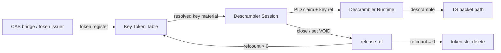
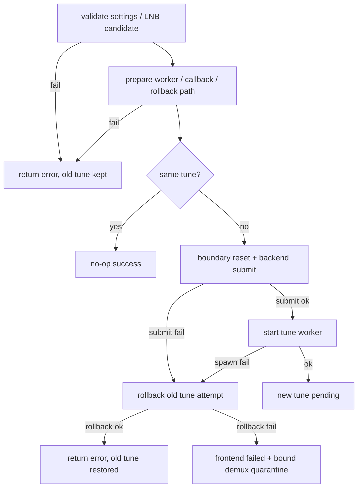

# Tuner HAL 設計判断

## VTS / 実機ゲート対象

ISDB-T、BS、CS110 の explicit tune と 平文ライブ視聴 / DVR path をゲート対象とする。HAL は BLIND_SCAN や HAL-generated Japanese scan plan を 対応宣言しない。Tuner HAL は渡された tune request を処理する。  
日本向け scan 候補、サービス検出、channel key の実装データ保持者は TIS とし、設計契約は tv 直下の開発規則.mdに従う。

`config/tuner_vts_config_aidl_V2.xml` は explicit tune point、AV filter、record DVR path の接続確認に限定する。descrambler オブジェクト は Tuner HAL AIDL 面として実装するが、CAS HAL 仮実装 のまま 本番経路のスクランブル解除成功 は 対応宣言しない。

本製品の Tuner HAL は TS 入力だけを正式対象とする。MMTP、TLV、ALP、IP CID は製品対象外とし、capability と VTS profile に宣言しない。`IFilter.configureIpCid()` は filter 種別にかかわらず `UNAVAILABLE` とする。CID を保存だけして matching、routing、delivery に使わない成功 no-op を残してはならない。


## AIDL 契約境界

`IFilter`、`IDvr`、`IFrontend`、`IDemux`、`ILnb`、`IDescrambler` の public method は、AIDL HAL の契約面として close 後状態を必ず検査する。状態別の戻り値、次状態、維持する内部状態、破棄・無効化する内部状態は、本書の「Tuner HAL 状態遷移表SSOT」を正とする。

`IFrontend.getStatus(statusTypes)` は、要求された `statusTypes` の各要素に対して、同じ順序で1つの `FrontendStatus` を返す。未対応 状態 type を黙ってdropして短い配列を返してはならない。未対応 状態 type が要求された場合、`getStatus()` は呼び出し全体を `INVALID_ARGUMENT` として失敗させる。`getFrontendStatusReadiness(statusTypes)` は AOSP VTS 期待に合わせ、要求された全 状態 type と同じ長さの readiness 配列を返す。`statusCaps` 外の type は要素ごとに `UNSUPPORTED`、`statusCaps` 内で backend が現在利用不可または 状態 word / telemetry を現在取得できない場合は `UNAVAILABLE`、tune/probe 中なら `UNSTABLE`、有効値を返せる状態なら `STABLE` とする。`statusCaps`、`getStatus()`、`getFrontendStatusReadiness()` は同一の 状態 support 判定 SSOT を使うが、戻り方は API ごとの AOSP 契約に従って分ける。`statusCaps` には起動時列挙時点で値の取得根拠を固定できる 状態 type だけを含め、read 時に失敗し得る optional ioctl 由来の 状態 type は含めない。telemetry 未取得値を `0` として成功返却してはならない。

`IFilter.setDataSource(source)` は、AOSP 意味論では `source == NULL` を demux input 復帰として扱う。ただし Android 14 AIDL Rust generated trait の r51 現行境界では NULL filter を Rust HAL public method で受ける実装方式が未固定である。このため `setDataSource(NULL)` を r51 実装済み扱いにしてはならず、nullable filter 境界は `future_work/r51/android14_aidl_rust_nullable_filter_boundary_blocker.md` を正とする。Rust generated trait で到達できる non-null source filter 経路の互換性、閉鎖済み source、別 demux source、自己参照、sink 開始中の扱いは、本書の `setDataSource()` 互換表を正とする。AOSP frozen/stable AIDL の vendor 独自改変、raw Binder transaction parser による公開契約の迂回は採用しない。

`IFrontend.tune()` は binder thread 上で ロック 完了まで待ち続けない。前回 tune / scan の ワーカーを generation で無効化し、backend へ tune request を投入し、非同期 ワーカー が ロック timeout と event 通知を行う。`stopTune()`、`close()`、次回 `tune()`、`scan()` は該当 generation を cancel し、古い ワーカー からの `LOCKED` / `NO_SIGNAL` 通知を捨てる。

`IFrontend.scan()` は、同一条件の再 scan であっても成功 no-op にしない。AOSP 契約に従い、未完了の scan がある場合は既存 scan generation を停止し、新しい scan generation を開始する。既存 scan の callback から来る古い terminal event は generation mismatch として捨てる。

`IFrontend.close()` は frontend backend の critical cleanup を成功扱いで握り潰さない。public close では、scan cancel、tune ワーカー stop、ライブ pump stop、backend close、コールバック解除、demux unbind、frontend lease release を step runner として扱い、途中 step が失敗しても後続 cleanup を継続し、最初に観測した critical error を AIDL 状態 として返す。cleanup failure 後の frontend オブジェクト は通常操作へ戻さず、close retry または Drop 補助 cleanup だけを許可する。補助経路では失敗を返せないため、失敗を成功扱いにせず 実行時診断に残す。

DVB / earth_pt1 backend では、`DTV_CLEAR` は明示的な tune 停止操作である `stop_tune()` の責務とする。DVB backend の `close()` は reader stop と fd release を行うが、`DTV_CLEAR` の実行を close の必須条件とはしない。したがって、DVB `close()` が `DTV_CLEAR` を発行しないことを release blocker または bug と扱わない。

`IFrontend.removeOutputPid(pid)` は、frontend 出力段で PID を除去できる実装が存在しない限り `UNAVAILABLE` とする。soft demux 後段の block list だけで PID を捨てる実装は、frontend-level output PID removal を実装したことにしない。

DVR playback は 対応宣言対象とする。DVR playback の水位通知は AIDL `PlaybackSettings.lowThreshold` / `highThreshold` の説明に合わせ、playback input FMQ の unused space size in bytes を基準に判定する。`SPACE_EMPTY`、`SPACE_ALMOST_EMPTY`、`SPACE_ALMOST_FULL` は threshold 到達時だけ通知し、中間水位では新規状態通知を行わない。used bytes を threshold として直接比較してはならない。標準閾値は buffer 容量比で low 25%、high 75% とし、VTS検査用プロファイル では XML 生成時に明示値へ展開する。

## Tuner HAL 状態遷移表SSOT

本節の表は、Tuner HAL の状態を持つ公開API、内部事象、資源寿命、戻り値、副作用のSSOTである。表に記載した状態別契約は、後続の散文で再定義しない。後続本文は、表だけでは読み取れない背景、製品方針、能力宣言、実装上の補足に限定する。

### 0. 総則

#### 0.1 本製品の固定方針

| 項目 | 固定内容 |
|---|---|
| 入力範囲 | 本製品の Tuner HAL は TS 入力だけを正式対象とする。MMTP、TLV、ALP、IP CID は製品対象外とし、capability と VTS profile に宣言しない |
| ライブAV正式経路 | non-passthrough `MediaEvent` + 共有メモリ + `dataId` 経路だけを正式対応とする |
| AVペイロードとFMQ | AVペイロードは通常FMQへ書き込まない。EventFlag は FMQ対象経路の通知にだけ使う |
| AV共有メモリ解放 | `releaseAvHandle(avMemory, dataId)` は表1-C-AVHの判定優先順位に従う。共有ハンドル経路では empty `avMemory` による既存の解放通知だけを正式対応とする。`getAvSharedHandle()` が返した fd 付き shared handle 本体を `releaseAvHandle()` へ渡す入力は `avDataId` にかかわらず `INVALID_ARGUMENT` とする。`dataId=0` は empty handle による利用者側 AV handle 使用終了通知として扱い、shared backing、公開済みハンドル、既存`dataId`、使用中領域を破棄しない |
| AV passthrough | 本製品では恒久的に対応しない。passthrough capability は宣言せず、passthrough要求は configure時 `UNAVAILABLE` とする |
| 監視イベント配送 | 本製品では正式対応しない。`configureMonitorEvent(0)` は無処理成功、非0マスク値は `UNAVAILABLE` とする |
| PCR | ペイロードキューとして公開しない。AV同期の内部状態として扱う |
| 未対応機能 | capability と VTS profile に宣言しない。要求された場合は configure時、専用API呼び出し時、対応する公開API呼び出し時のいずれかで `UNAVAILABLE` とする |
| close | `closed` は公開API遮断ゲート、`cleanup_complete` は後片付け完了根拠として別管理する |
| ABI不整合 | AIDL ABI、Rust/C 接続層の関数シグネチャ、リンク不整合は実行時状態表に入れない。ビルド、リンク、AIDL確認、VINTF確認で弾く対象とする |

#### 0.2 状態圧縮の許可条件

状態遷移表で複数の状態を1行へ圧縮してよいのは、次の4条件を全て満たす場合だけである。

| 条件 | 固定内容 |
|---|---|
| 条件1 | 選択式の戻り値、選択式の次状態、未固定語をセル内に書かない |
| 条件2 | 対象状態集合を表内に明記し、集合のヌケモレを許さない |
| 条件3 | 戻り値、次状態関数、副作用、診断、資源寿命が対象状態集合内で完全に同じである |
| 条件4 | 同値性根拠を表内に明記する |

次状態は固定値だけでなく、`入力状態を維持`、`共有ハンドル軸だけ公開済みに変更` のような関数で固定してよい。関数で固定する場合は、変更する状態軸と維持する状態軸を表内に書く。

#### 0.3 文書間の責務境界

| 文書 | 正とする内容 | 禁止事項 |
|---|---|---|
| `tuner_hal/DESIGN_JA.md` | Tuner HAL の公開API状態、内部事象、資源寿命、戻り値、副作用、確定点、巻き戻し、閉鎖側失敗の対象 | 同じ状態遷移契約を他文書で再定義すること |
| `tuner_hal/CODE_CONVENTION.md` | Tuner HAL 固有の実装規約、禁止構文、helper 使用規則、静的確認観点 | DESIGN_JA.md の状態遷移、戻り値、資源寿命を別内容で定義すること |
| `GLOBAL_CODE_CONVENTION.md` | Rust / Kotlin 全体に共通する実装規約 | Tuner HAL 固有の状態遷移を定義すること |
| `タスク完了判定の実施方法.md` | 検査手順、証跡の取り方、判定時の確認順序 | 設計契約や実装規約を新規定義すること |

状態遷移、資源寿命、失敗時の戻り値、閉鎖側失敗の対象について文書間に重複または差分がある場合は、本節の表を正として他文書を修正する。

### 表0-F. IFrontend scan 状態表

`scan()` が成功した場合は、常に新しい scan generation を開始する。同一条件の再 scan を成功 no-op にしてはならない。

| No | 事前状態 | 呼び出し | AIDL戻り値 | 次状態 | 副作用 | 完了条件 |
|---:|---|---|---|---|---|---|
| FR-001 | Idle | `scan(settings, type)` | 成功 | Scanning(generation+1) | 新 scan generation を開始 | backend へ新 scan request が投入される |
| FR-002 | Scanning | `scan(same settings, same type)` | 成功 | Scanning(generation+1) | 既存 scan を停止し、新 scan を開始 | 同一条件でも no-op にならない |
| FR-003 | Scanning | `scan(different settings/type)` | 成功 | Scanning(generation+1) | 既存 scan を停止し、新 scan を開始 | 古い callback は generation mismatch で捨てる |
| FR-004 | Scanning | `stopScan()` | 成功 | Idle | 現 scan generation を停止 | terminal reason を Cancelled として診断へ残す |
| FR-005 | Idle | `stopScan()` | 成功 | Idle | なし | 重複 stop は冪等成功 |
| FR-006 | Closing / Closed | `scan(...)` | `INVALID_STATE` | 入力状態を維持 | なし | 閉鎖中または閉鎖後に scan を開始しない |

### 表1. IFilter 状態表

#### 表1-A. IFilter 状態コード

| 状態コード | 状態名 | 意味 |
|---|---|---|
| F0 | 未設定 | `openFilter()` 後、`configure()` 未完了 |
| F1 | FMQ設定済み | section、PES、TS生データ、録画補助情報の FMQ対象フィルタが configure 済み |
| F2 | FMQ開始済み | FMQ対象フィルタが start 済み |
| F3 | FMQ停止済み | FMQ対象フィルタが stop 済み |
| F4 | ペイロードなし設定済み | PCR、監視、状態通知専用など、通常FMQへ公開するペイロードを持たないフィルタが configure 済み |
| F5 | ペイロードなし開始済み | ペイロードなしフィルタが start 済み。監視イベント配送は発生しない |
| F6 | ペイロードなし停止済み | ペイロードなしフィルタが stop 済み |
| A0 | AV設定済み・補助種別未設定・ハンドル未公開 | live AV filter が configure 済み、`configureAvStreamType()` hint 未設定、共有ハンドル未公開。audio/video routing 種別は open subtype から導出済み |
| A1 | AV設定済み・補助種別設定済み・ハンドル未公開 | live AV filter が `configureAvStreamType()` 済み、共有ハンドル未公開。routing 種別は open subtype と一致する場合だけ設定成功 |
| A2 | AV設定済み・補助種別未設定・ハンドル公開済み | A0 を基底状態として共有ハンドルを公開済み |
| A3 | AV設定済み・補助種別設定済み・ハンドル公開済み | A1 を基底状態として共有ハンドルを公開済み |
| A4 | AV開始済み・補助種別未設定・ハンドル未公開 | A0 から start 済み |
| A5 | AV開始済み・補助種別設定済み・ハンドル未公開 | A1 から start 済み |
| A6 | AV開始済み・補助種別未設定・ハンドル公開済み | A2 から start 済み |
| A7 | AV開始済み・補助種別設定済み・ハンドル公開済み | A3 から start 済み |
| A8 | AV停止済み・補助種別未設定・ハンドル未公開 | A4 から stop 済み |
| A9 | AV停止済み・補助種別設定済み・ハンドル未公開 | A5 から stop 済み |
| A10 | AV停止済み・補助種別未設定・ハンドル公開済み | A6 から stop 済み |
| A11 | AV停止済み・補助種別設定済み・ハンドル公開済み | A7 から stop 済み |
| F15 | 閉鎖済み | `close()` 後片付け完了済み |
| F16 | 異常時閉鎖済み | 作業スレッド致命停止、FMQ/共有メモリ致命失敗、後片付け未完などで公開APIを遮断した状態 |

AV filter の audio/video routing 種別は open subtype を正とする。TsAudio は Audio、TsVideo は Video である。`configureAvStreamType()` は codec / stream type hint を保存する補助APIであり、未実行であっても `setDataSource()`、`start()`、PES/AV routing、MediaEvent 配送の必須条件にはしない。

#### 表1-B. IFilter 基本API状態契約

| No | API / 入力 | 対象状態集合 | AIDL戻り値 | 次状態関数 | 副作用 | 診断 | 同値性根拠 / 完了条件 |
|---:|---|---|---|---|---|---|---|
| F-B-001 | `configure()` FMQ対象設定 | F0 | 成功 | F1 | queue世代を更新し旧一過性状態を消去 | `filter_configure_success` | 未設定からFMQ対象へ進む |
| F-B-002 | `configure()` ペイロードなし設定 | F0 | 成功 | F4 | queueを公開しない種別として設定 | `filter_configure_success` | 未設定からペイロードなしへ進む |
| F-B-003 | `configure()` live AV non-passthrough | F0 | 成功 | A0 | AV世代を進め、旧AV資源を全破棄。TsAudio は Audio、TsVideo は Video の routing 種別を open subtype から導出する | `filter_configure_success` | AVはハンドル未公開で開始する。`configureAvStreamType()` 未実行でも routing 種別は存在する |
| F-B-004 | `configure()` AV passthrough | F0 | `UNAVAILABLE` | F0 | なし | `unsupported_passthrough_configure` を増やす | 本製品では passthrough を恒久非対応とする |
| F-B-005 | `configure()` MMTP / TLV / ALP / IP CID | F0 | `UNAVAILABLE` | F0 | なし | `unsupported_filter_configure` を増やす | 製品対象外方式は capability と VTS profile に宣言しない |
| F-B-006 | `configure()` 再設定 | F1, F3 | 成功 | F1 | queue世代を更新し旧データを破棄 | `filter_reconfigure_success` | 開始中でない FMQ対象状態は再設定に関して同値 |
| F-B-007 | `configure()` 再設定 | F4, F6 | 成功 | F4 | 一過性状態を破棄 | `filter_reconfigure_success` | 開始中でないペイロードなし状態は再設定に関して同値 |
| F-B-008 | `configure()` 再設定 | A0, A1, A2, A3, A8, A9, A10, A11 | 成功 | A0 | AV世代を進め、共有ハンドル、使用中領域、`dataId`、`configureAvStreamType()` hint を全無効化。routing 種別は open subtype から再導出する | `filter_reconfigure_success` | 開始中でないAV状態は再設定に関して同値。再設定後は補助種別未設定へ戻るが routing は可能 |
| F-B-009 | `configure()` 開始中 | F2, F5, A4, A5, A6, A7 | `INVALID_STATE` | 入力状態を維持 | なし | `configure_while_started` を増やす | 開始中再設定を禁止する |
| F-B-010 | `start()` FMQ対象 | F1, F3 | 成功 | F2 | FMQ作業スレッドを開始し、停止済みなら再開 | `filter_start_success` | F1 と F3 は start に関して戻り値、副作用、次状態が同一 |
| F-B-011 | `start()` ペイロードなし | F4, F6 | 成功 | F5 | 状態だけ開始済みにする。監視イベント配送は発生しない | `filter_start_success` | F4 と F6 は start に関して同値 |
| F-B-012 | `start()` AV | A0, A1, A2, A3, A8, A9, A10, A11 | 成功 | 実行状態軸だけ開始済みに変更。他軸は維持 | 新規配送可能状態へ進む。ハンドル未公開中はAVペイロードを配送しない | `filter_start_success` | 戻り値、診断、状態軸変換規則、資源寿命が同一。配送可否はハンドル軸から導出する |
| F-B-013 | `start()` 既に開始済み | F2, F5, A4, A5, A6, A7 | 成功 | 入力状態を維持 | なし | `start_idempotent` を増やす | 重複 start は冪等成功 |
| F-B-014 | `start()` 未設定 | F0 | `INVALID_STATE` | F0 | なし | `start_invalid_state` を増やす | 未設定では開始対象が存在しない |
| F-B-015 | `stop()` FMQ対象 | F2 | 成功 | F3 | 新規FMQ書き込みを停止 | `filter_stop_success` | FMQ開始状態を停止状態へ進める |
| F-B-016 | `stop()` ペイロードなし | F5 | 成功 | F6 | 状態だけ停止済みにする | `filter_stop_success` | 配送資源を持たない |
| F-B-017 | `stop()` AV | A4, A5, A6, A7 | 成功 | 実行状態軸だけ停止済みに変更。他軸は維持 | 新規AV配送を停止。既存 `dataId` は release / flush / close まで維持 | `filter_stop_success` | 戻り値、診断、状態軸変換規則、資源寿命が同一 |
| F-B-018 | `stop()` 非開始設定済み状態 | F1, F3, F4, F6, A0, A1, A2, A3, A8, A9, A10, A11 | 成功 | 入力状態を維持 | なし | `stop_idempotent` を増やす | 停止済み相当の状態で stop は冪等成功 |
| F-B-019 | `stop()` 未設定 | F0 | `INVALID_STATE` | F0 | なし | `stop_invalid_state` を増やす | 未設定では停止対象が存在しない |
| F-B-020 | `close()` | 全非閉鎖状態 | 表5に従う | 表5に従う | 後片付け開始 | 表5に従う | close の戻り値と後片付け完了判定は表5を正とする |
| F-B-021 | 閉鎖後の公開API | F15, F16 | `INVALID_STATE` | 入力状態を維持 | なし | `closed_access` を増やす | 閉鎖後は `close()` 以外の公開APIを成功させない |

#### 表1-C. IFilter 補助API状態契約

| No | API / 入力 | 対象状態集合 | AIDL戻り値 | 次状態関数 | 副作用 | 診断 | 同値性根拠 / 完了条件 |
|---:|---|---|---|---|---|---|---|
| F-C-001 | `getQueueDesc()` | F0 かつ open時フィルタ種別が通常FMQ対象、F1, F2, F3 | 成功 | 入力状態を維持 | 通常FMQ記述子を返す | `queue_desc_success` | `getQueueDesc()` の成否は configure 済みではなく通常FMQ有無で決める |
| F-C-002 | `getQueueDesc()` | F0 かつ open時フィルタ種別が通常FMQ非対象 | `UNAVAILABLE` | F0 | なし | `queue_desc_unavailable` を増やす | 未configureでも非FMQ対象は記述子を公開しない |
| F-C-003 | `getQueueDesc()` | F4, F5, F6, A0, A1, A2, A3, A4, A5, A6, A7, A8, A9, A10, A11 | `UNAVAILABLE` | 入力状態を維持 | なし | `queue_desc_unavailable` を増やす | 通常FMQを公開しない状態として同値 |
| F-C-004 | `configureAvStreamType()` 正常入力 | A0, A1, A8, A9 | 成功 | 補助種別軸を設定済みに変更。他軸は維持 | stream type hint を指定値で保存する。TsAudio には Audio、TsVideo には Video だけを許可する | `av_stream_type_configured` | ハンドル未公開の非開始AV状態として同値。routing 種別は open subtype 由来であり、このAPIの有無に依存しない |
| F-C-005 | `configureAvStreamType()` 正常入力 | A2, A3, A10, A11 | 成功 | 補助種別軸を設定済みに変更。他軸は維持 | stream type hint を指定値で保存し、全`dataId`を無効化。TsAudio には Audio、TsVideo には Video だけを許可する | `av_generation` を進める | ハンドル公開済みの非開始AV状態として同値。旧`dataId`を使わせない。routing 種別は open subtype 由来である |
| F-C-006 | `configureAvStreamType()` 開始中 | A4, A5, A6, A7 | `INVALID_STATE` | 入力状態を維持 | なし | `av_stream_type_while_started` を増やす | 開始中の種別変更は禁止 |
| F-C-007 | `configureAvStreamType()` 未設定 | F0 | `INVALID_STATE` | F0 | なし | `av_stream_type_invalid_state` を増やす | 未設定ではAV補助APIの対象が存在しない |
| F-C-008 | `configureAvStreamType()` 非AV | F1, F2, F3, F4, F5, F6 | `UNAVAILABLE` | 入力状態を維持 | なし | `av_stream_type_unavailable` を増やす | 非AV状態は全て同値 |
| F-C-009 | `configureAvStreamType()` passthrough要求 | A0, A1, A2, A3, A8, A9, A10, A11 | `UNAVAILABLE` | 入力状態を維持 | なし | `unsupported_passthrough_configure` を増やす | 本製品では passthrough を恒久非対応とする |
| F-C-010 | `getAvSharedHandle()` 初回 | A0, A1, A4, A5, A8, A9 | 成功 | 共有ハンドル軸だけ公開済みに変更。他軸は維持 | shared backing を生成しハンドルを返す | `av_shared_memory_create` を増やす | 種別軸と実行状態軸を維持し、ハンドル軸だけ変更する |
| F-C-011 | `getAvSharedHandle()` 再取得 | A2, A3, A6, A7, A10, A11 | 成功 | 入力状態を維持 | 既存ハンドルを返す | `av_shared_handle_reuse` を増やす | 再取得は冪等成功 |
| F-C-012 | `getAvSharedHandle()` 未設定 | F0 | `INVALID_STATE` | F0 | なし | `av_handle_invalid_state` を増やす | 未設定ではAV共有ハンドル対象が存在しない |
| F-C-013 | `getAvSharedHandle()` 非AV | F1, F2, F3, F4, F5, F6 | `UNAVAILABLE` | 入力状態を維持 | なし | `av_handle_unavailable` を増やす | 非AV状態は全て同値 |
| F-C-014 | `releaseAvHandle()` | 全状態 | 表1-C-AVHに従う | 表1-C-AVHに従う | 表1-C-AVHに従う | 表1-C-AVHに従う | `releaseAvHandle()` は `avDataId` 符号、fd付き `avMemory`、closed、filter種別、shared handle公開状態、active/stale `dataId` の優先順位を表1-C-AVHで一意に固定する |
| F-C-020 | `flush()` FMQ対象 | F1, F2, F3 | 成功 | 入力状態を維持 | FMQ未消費データと一過性状態を破棄 | `filter_flush_success` | FMQ対象状態は flush に関して同値 |
| F-C-021 | `flush()` ペイロードなし | F4, F5, F6 | 成功 | 入力状態を維持 | 一過性状態を破棄 | `filter_flush_success` | ペイロードなし状態は flush に関して同値 |
| F-C-022 | `flush()` AVハンドル未公開 | A0, A1, A4, A5, A8, A9 | 成功 | 入力状態を維持 | 一過性状態を破棄 | `filter_flush_success` | ハンドル未公開AV状態では共有ハンドル資源を触らない |
| F-C-023 | `flush()` AVハンドル公開済み | A2, A3, A6, A7, A10, A11 | 成功 | 入力状態を維持 | 使用中領域と全`dataId`を破棄し、公開済みハンドルと shared backing は維持 | `filter_flush_success` | flush は全解放と異なり、共有ハンドル公開状態を維持する |
| F-C-024 | `flush()` 未設定 | F0 | `INVALID_STATE` | F0 | なし | `filter_flush_invalid_state` を増やす | 未設定では破棄対象が存在しない |
| F-C-025 | `configureMonitorEvent(0)` | F0, F1, F2, F3, F4, F5, F6, A0, A1, A2, A3, A4, A5, A6, A7, A8, A9, A10, A11 | 成功 | 入力状態を維持 | なし | `monitor_event_mask_zero` を増やす | mask 0 は無処理成功で同値 |
| F-C-026 | `configureMonitorEvent(nonzero)` | F0, F1, F2, F3, F4, F5, F6, A0, A1, A2, A3, A4, A5, A6, A7, A8, A9, A10, A11 | `UNAVAILABLE` | 入力状態を維持 | なし | `monitor_event_unavailable` を増やす | 本製品では監視イベント配送を正式対応しない |
| F-C-027 | `configureIpCid()` | F0, F1, F2, F3, F4, F5, F6, A0, A1, A2, A3, A4, A5, A6, A7, A8, A9, A10, A11 | `UNAVAILABLE` | 入力状態を維持 | なし | `ip_cid_unavailable` を増やす | IP CID は製品対象外 |
| F-C-028 | `setDelayHint()` 正常入力 | F0, F1, F2, F3, F4, F5, F6, A0, A1, A2, A3, A4, A5, A6, A7, A8, A9, A10, A11 | 成功 | 入力状態を維持 | hint 値だけ保存 | `delay_hint_set` | 資源寿命を変えない |
| F-C-029 | `setDelayHint()` 不正入力 | F0, F1, F2, F3, F4, F5, F6, A0, A1, A2, A3, A4, A5, A6, A7, A8, A9, A10, A11 | `INVALID_ARGUMENT` | 入力状態を維持 | なし | `delay_hint_invalid` を増やす | 不正入力は全非閉鎖状態で同じ拒否 |
| F-C-030 | `getId()` / `getId64Bit()` | F0, F1, F2, F3, F4, F5, F6, A0, A1, A2, A3, A4, A5, A6, A7, A8, A9, A10, A11 | 成功 | 入力状態を維持 | IDを返す | なし | 読み取り専用APIで資源寿命を変えない |
| F-C-031 | `setDataSource()` 成功組み合わせ | 表1-Dで成功と定義した組み合わせ | 成功 | 入力状態を維持 | source 参照を保持 | `set_data_source_success` | 詳細は表1-Dを正とする |
| F-C-032 | `setDataSource()` 拒否組み合わせ | 表1-Dで拒否と定義した組み合わせ | 表1-Dに従う | 入力状態を維持 | なし | 表1-Dに従う | 詳細は表1-Dを正とする |

##### 表1-C-AVH. `releaseAvHandle()` 判定優先順位表

`releaseAvHandle(avMemory, avDataId)` は次の優先順位で判定する。共有ハンドル経路では、`DemuxFilterMediaEvent.avMemory` は empty handle とし、個別 AV 領域の解放は empty handle + 非0 `avDataId` で扱う。`getAvSharedHandle()` が返した fd 付き handle 本体は `releaseAvHandle()` の正規入力にしない。利用者側 AV handle 使用終了通知は empty handle + `avDataId == 0` だけで扱う。

`getAvSharedHandle()` が返す `NativeHandle` は fd 1個と `ints[0]=0` を持つ。`ints[0]` は Android framework/JNI が memory index として参照するため、HAL 内部識別子として使わない。`slot_size`、`slot_count`、magic、generation、filter id は `NativeHandle.ints` に公開しない。fd 付き handle は `releaseAvHandle()` では常に不正入力として扱い、同一性判定は行わない。

| No | 優先 | 状態 | 条件 | AIDL戻り値 | 資源変化 | 診断 | 完了条件 |
|---:|---:|---|---|---|---|---|---|
| AVH-001 | 1 | any | `avDataId < 0` | `INVALID_ARGUMENT` | なし | `av_data_id_invalid_release` | 負の `avDataId` が他条件より先に拒否される |
| AVH-002 | 2 | any | fd 付き `avMemory` + `avDataId >= 0` | `INVALID_ARGUMENT` | なし | `av_handle_direct_unsupported` | fd付き handle を `releaseAvHandle()` の正規入力にしない |
| AVH-003 | 3 | any | fd 付き `avMemory` + `avDataId < 0` | `INVALID_ARGUMENT` | なし | `av_data_id_invalid_release` | 負の dataId は fd有無にかかわらず不正IDとして先に拒否する |
| AVH-C01 | 4 | closed | empty `avMemory` + `avDataId >= 0` | 成功 | なし | `av_data_id_stale_release_after_close` | close後に遅れて届いたAV release通知が状態を壊さない |
| AVH-S01 | 5 | open | empty `avMemory` + `avDataId > 0` + current filter が AV ではない + 過去に AV shared handle 公開済み | 成功 | なし | `av_data_id_stale_release` | configure 後に非AVへ再設定されても、旧AV MediaEventの遅延releaseが状態を壊さない |
| AVH-S02 | 6 | open | empty `avMemory` + `avDataId > 0` + current filter が AV ではない + AV shared handle 公開履歴なし | `UNAVAILABLE` | なし | `av_handle_unavailable` | 非AV filterで新規 release が成功しない |
| AVH-S03 | 7 | open AV | empty `avMemory` + `avDataId > 0` + `getAvSharedHandle()` 未実行 | `INVALID_STATE` | なし | `av_handle_release_without_handle` | shared handle未公開で個別slot release が成功しない |
| AVH-S04 | 8 | open AV または未公開 | empty `avMemory` + `avDataId == 0` | 成功。ただし export済みかつ二重通知なら `INVALID_ARGUMENT` | slot解放なし。shared handle export済みかつ client release未済みなら client release済みにする。export未済みなら既存互換 no-op | `av_handle_client_release` またはなし | `avDataId=0` は利用者側 AV handle 使用終了通知であり、全解放にならない。export未済みなら no-op 成功。二重通知は拒否する |
| AVH-S05 | 9 | open AV | empty `avMemory` + active `avDataId > 0` | 成功 | 指定slotを解放 | `av_data_id_release` | 指定slotだけ解放される |
| AVH-S06 | 10 | open AV | empty `avMemory` + stale `avDataId > 0` | 成功 | なし | `av_data_id_stale_release` | configure / configureAvStreamType / flush 後に遅れて届いた旧 `avDataId` release が状態を壊さない |

衝突入力の優先順位は次で固定する。

- closed filter + fd 付き `avMemory` + `avDataId < 0` は AVH-001 とする。
- open non-AV filter + empty `avMemory` + `avDataId < 0` は AVH-001 とする。
- fd 付き `avMemory` + `avDataId >= 0` は AVH-002 とする。

- empty `avMemory` + `avDataId == 0` は、filter種別や export 有無にかかわらず AVH-S04 とする。ただし export済みかつ client release済みの場合は二重通知として `INVALID_ARGUMENT` とする。
- open non-AV filter + empty `avMemory` + `avDataId > 0` + 過去に AV shared handle 公開済み は AVH-S01 とする。
- open non-AV filter + empty `avMemory` + `avDataId > 0` + AV shared handle 公開履歴なし は AVH-S02 とする。

受け入れ条件は次で固定する。

- `releaseAvHandle()` は shared-mode empty `avMemory` を拒否しない。
- `releaseAvHandle()` は `getAvSharedHandle()` が返した fd 付き handle 本体を正式入力として受理しない。
- `releaseAvHandle(returnedSharedHandle, 0)` は `INVALID_ARGUMENT` になる。
- fd付き handle の二重 release も `INVALID_ARGUMENT` になる。
- `releaseAvHandle(fd付き avMemory, dataId >= 0)` は `INVALID_ARGUMENT` になる。
- `releaseAvHandle(fd付き avMemory, dataId < 0)` は `INVALID_ARGUMENT` になり、診断は `av_data_id_invalid_release` になる。
- `releaseAvHandle(fd付き avMemory, dataId >= 0)` は backing 同一性を見ずに `INVALID_ARGUMENT` になる。
- `releaseAvHandle(empty, 0)` は、export済みなら client release済みにし、slot を解放しない。
- `releaseAvHandle(empty, 0)` は、export未済みなら no-op 成功する。
- `releaseAvHandle(empty, 0)` は、export済みかつ client release済みなら二重通知として `INVALID_ARGUMENT` になる。
- `releaseAvHandle(empty, active dataId)` は成功し、指定slotを解放する。
- `releaseAvHandle(empty, stale dataId)` は成功 no-op になる。
- `releaseAvHandle(empty, negative dataId)` は `INVALID_ARGUMENT` になる。
- `configureAvStreamType()` 後の旧 `avDataId` release は成功 no-op になる。
- `configure()` で非AV設定へ再設定した後の旧AV `avDataId` release は成功 no-op になる。
- `close()` 後の `releaseAvHandle(empty, avDataId >= 0)` は成功 no-op になる。
- `close()` 後の `releaseAvHandle(empty, negative avDataId)` は `INVALID_ARGUMENT` になる。
- `close()` 後の `releaseAvHandle(fd付き avMemory, avDataId >= 0)` は `INVALID_ARGUMENT` になり、診断は `av_handle_direct_unsupported` になる。
- `close()` 後の `releaseAvHandle(fd付き avMemory, avDataId < 0)` は `INVALID_ARGUMENT` になり、診断は `av_data_id_invalid_release` になる。

#### 表1-D. `setDataSource()` 互換表

`setDataSource()` は sink 側公開APIである。実装は、表1-D-1の判定順序を先に適用し、通常の source / sink 種別互換は表1-D-3の行列で判定する。

##### 表1-D-1. `setDataSource()` 判定順序表

| 優先 | 条件 | AIDL戻り値 | 次状態 | 固定理由 |
|---:|---|---|---|---|
| 1 | sink が閉鎖済み | `INVALID_STATE` | sink 状態を維持 | `setDataSource()` は sink 側公開APIであり、sink 自身の閉鎖状態を最優先で判定する |
| 2 | sink が実行時失敗状態 | `INVALID_STATE` | sink 状態を維持 | fail-closed 状態の filter は再配線しない |
| 3 | sink が開始中 | `INVALID_STATE` | sink 状態を維持 | 開始中に入力元参照を変更しない |
| 4 | source が `NULL` | AOSP意味論では成功。r51現行Rust境界では到達未固定 | sink 状態を維持 | AOSP意味論では sink の入力元を demux input に戻す。実装済み扱いは禁止し、nullable境界は future_work/r51 の阻害項目を正とする |
| 5 | source と sink が同一 object | `INVALID_ARGUMENT` | sink 状態を維持 | 自己参照を禁止する |
| 6 | source が閉鎖済みまたは実行時失敗状態 | `INVALID_STATE` | sink 状態を維持 | source の lifecycle 異常であり、引数形式不正として扱わない |
| 7 | source が別 demux 所属 | `INVALID_ARGUMENT` | sink 状態を維持 | demux 境界をまたいだ接続を禁止する |
| 8 | 上記に該当しない | 表1-D-3に従う | 表1-D-3に従う | 通常の種別互換判定を行う |

source は非閉鎖かつ非実行時失敗であれば、設定済み、開始済み、停止済みのいずれでも入力元として利用可能とする。sink は非閉鎖、非実行時失敗、かつ非開始の状態だけ、表1-D-3の互換判定へ進む。source が `NULL` の場合は AOSP意味論上は filter object ではないため、自己参照、source閉鎖、別demux所属の判定対象にしない。ただし r51現行Rust境界では NULL filter の到達方式が未固定であり、実装済み扱いにしない。

##### 表1-D-2. `setDataSource()` endpoint分類表

| 分類名 | 含むもの | 通常FMQ payload | AV共有メモリ | 備考 |
|---|---|---:|---:|---|
| demux input | source が `NULL` の場合のAOSP意味論上の標準入力元 | 対象sinkに従う | 対象sinkに従う | filter object ではない。r51現行Rust境界では到達未固定 |
| section フィルタ | section payload を出す FMQ対象フィルタ | あり | なし | source にはしない。SourceFilter 経由の section sink としても扱わない |
| PES フィルタ | PES payload を出す FMQ対象フィルタ | あり | なし | source にはしない。SourceFilter 経由の PES sink としても扱わない |
| TS生データフィルタ | TS raw payload を出す FMQ対象フィルタ | あり | なし | `SourceFilter` 経由で再投入できる唯一の source 種別。下流として成功させるのは TS生データフィルタと record フィルタだけである |
| AV フィルタ | live audio / video フィルタ | なし | あり | source にはしない。SourceFilter 経由の AV sink としても扱わない |
| record フィルタ | DVR record buffer と `TsRecordEvent` 用の終端フィルタ | あり | なし | source にはしない。SourceFilter 経由では record sink としてだけ扱う |
| ペイロードなしフィルタ | PCR、監視、状態通知専用フィルタ | なし | なし | source / sink にしない |

##### 表1-D-3. `setDataSource()` 通常組み合わせ行列

この行列は、表1-D-1の優先1〜7を通過した場合だけ適用する。つまり、sink は非閉鎖かつ非開始、source は非閉鎖、同一 demux 所属、source と sink は別 object である。source が `NULL` の場合は AOSP意味論上は優先4の対象であり、この行列には入らない。ただし r51現行Rust境界では到達未固定である。

| source \ sink | section フィルタ | PES フィルタ | TS生データフィルタ | AV フィルタ | record フィルタ | ペイロードなしフィルタ |
|---|---|---|---|---|---|---|
| section フィルタ | `INVALID_ARGUMENT` | `INVALID_ARGUMENT` | `INVALID_ARGUMENT` | `INVALID_ARGUMENT` | `INVALID_ARGUMENT` | `INVALID_ARGUMENT` |
| PES フィルタ | `INVALID_ARGUMENT` | `INVALID_ARGUMENT` | `INVALID_ARGUMENT` | `INVALID_ARGUMENT` | `INVALID_ARGUMENT` | `INVALID_ARGUMENT` |
| TS生データフィルタ | `UNAVAILABLE` | `UNAVAILABLE` | 成功 | `UNAVAILABLE` | 成功 | `INVALID_ARGUMENT` |
| AV フィルタ | `INVALID_ARGUMENT` | `INVALID_ARGUMENT` | `INVALID_ARGUMENT` | `INVALID_ARGUMENT` | `INVALID_ARGUMENT` | `INVALID_ARGUMENT` |
| record フィルタ | `INVALID_ARGUMENT` | `INVALID_ARGUMENT` | `INVALID_ARGUMENT` | `INVALID_ARGUMENT` | `INVALID_ARGUMENT` | `INVALID_ARGUMENT` |
| ペイロードなしフィルタ | `INVALID_ARGUMENT` | `INVALID_ARGUMENT` | `INVALID_ARGUMENT` | `INVALID_ARGUMENT` | `INVALID_ARGUMENT` | `INVALID_ARGUMENT` |

表1-D-3 に条件付き成功セルは置かない。source filter として指定できるのは TS生データフィルタだけである。下流として成功させるのは TS生データフィルタと record フィルタだけである。section / PES / AV への raw TS 再parse chain、および section payload、PES payload、AV payload、record payload を直接 source として再配送する経路は作らない。非対応の linkage は `UNAVAILABLE` とする。source と sink の `tpid` が一致しない場合は、対応 linkage の場合だけ `INVALID_ARGUMENT` とする。record フィルタと AV フィルタは終端sinkであり、他 filter の source にはしない。

##### 表1-D-4. `setDataSource()` 行列セルの副作用

| 行列結果 | AIDL戻り値 | 次状態 | 副作用 | 診断 | 完了条件 |
|---|---|---|---|---|---|
| demux input 復帰 | AOSP意味論では成功。r51現行Rust境界では到達未固定 | sink 状態を維持 | AOSP意味論では既存 source 参照を解除し、sink の入力元を demux input に戻す | `set_data_source_demux_input` | source が `NULL` で、sink が非閉鎖かつ非開始である。r51実装済み扱いは禁止 |
| 成功 | 成功 | sink 状態を維持 | sink が source 参照を保持する。登録済み source がある場合は新しい source 参照で置換する | `set_data_source_success` | source / sink の組み合わせが表1-D-3の成功セルに一致する |
| `INVALID_ARGUMENT` | `INVALID_ARGUMENT` | sink 状態を維持 | source 参照を変更しない | `set_data_source_invalid_pair` を増やす | source / sink の組み合わせが表1-D-3の拒否セルに一致する |


### 表2. IDvr 状態表

#### 表2-A. IDvr 状態コード

| 状態コード | 状態名 | 意味 |
|---|---|---|
| D0R | 録画DVR未設定 | `openDvr(record)` 後、`configure()` 未完了 |
| D0P | 再生DVR未設定 | `openDvr(playback)` 後、`configure()` 未完了 |
| D1 | 録画設定済み | record DVR が configure 済み |
| D2 | 録画開始済み | record DVR が start 済み |
| D3 | 録画停止済み | record DVR が stop 済み |
| D4 | 再生設定済み | playback DVR が configure 済み |
| D5 | 再生開始済み | playback DVR が start 済み |
| D6 | 再生停止済み | playback DVR が stop 済み |
| D7 | 閉鎖済み | `close()` 後片付け完了済み |
| D8 | 異常時閉鎖済み | DVR作業スレッド致命停止、FMQ致命失敗、後片付け未完などで公開APIを遮断した状態 |

#### 表2-B. IDvr API別状態契約

| No | API / 入力 | 対象状態集合 | AIDL戻り値 | 次状態関数 | 副作用 | 診断 | 同値性根拠 / 完了条件 |
|---:|---|---|---|---|---|---|---|
| DVR-001 | `configure(record settings)` | D0R | 成功 | D1 | 録画DVR queue を設定 | `dvr_configure_success` | DVR種別と settings 種別が一致 |
| DVR-002 | `configure(playback settings)` | D0P | 成功 | D4 | 再生DVR queue を設定 | `dvr_configure_success` | DVR種別と settings 種別が一致 |
| DVR-003 | `configure()` 種別不一致 | D0R, D1, D3, D0P, D4, D6 | `INVALID_ARGUMENT` | 入力状態を維持 | なし | `dvr_configure_kind_mismatch` を増やす | 対象は record DVR への playback settings と playback DVR への record settings とする |
| DVR-004 | `configure()` 同一DVR種別の非開始再設定 | D1, D3, D4, D6 | 成功 | record DVR は D1、playback DVR は D4 | DVR queue世代を更新 | `dvr_reconfigure_success` | 同一DVR種別の非開始再設定として同値 |
| DVR-005 | `configure()` 開始中 | D2, D5 | `INVALID_STATE` | 入力状態を維持 | なし | `dvr_configure_while_started` を増やす | 開始中再設定を禁止 |
| DVR-006 | `getQueueDesc()` | D1, D2, D3, D4, D5, D6 | 成功 | 入力状態を維持 | DVR FMQ記述子を返す | `dvr_queue_desc_success` | configured DVR は種別に関係なく記述子を持つ |
| DVR-007 | `getQueueDesc()` | D0R, D0P | `INVALID_STATE` | 入力状態を維持 | なし | `dvr_queue_desc_invalid_state` を増やす | 未設定DVRは記述子を公開しない |
| DVR-008 | `start()` record / record filter attach 済み | D1, D3 | 成功 | D2 | 録画作業スレッドを開始 | `dvr_start_success` | record DVR は attached record filter を入力源として録画を開始する |
| DVR-008a | `start()` record / record filter 未attach | D1, D3 | `INVALID_STATE` | 入力状態を維持 | なし | `dvr_start_missing_record_filter` を増やす | AOSP の録画DVR実用フローは record filter attach 後の start であり、入力源なしの record DVR start を成功扱いしない |
| DVR-009 | `start()` playback | D4, D6 | 成功 | D5 | 再生入力受付を開始 | `dvr_start_success` | playback DVR の非開始状態は start に関して同値 |
| DVR-010 | `start()` 開始済み | D2, D5 | 成功 | 入力状態を維持 | なし | `dvr_start_idempotent` を増やす | 重複 start は冪等成功 |
| DVR-011 | `start()` 未設定 | D0R, D0P | `INVALID_STATE` | 入力状態を維持 | なし | `dvr_start_invalid_state` を増やす | 未設定DVRでは開始対象が存在しない |
| DVR-012 | `stop()` record | D2 | 成功 | D3 | 録画作業スレッドを停止 | `dvr_stop_success` | record開始済みを停止済みにする |
| DVR-013 | `stop()` playback | D5 | 成功 | D6 | 再生入力受付を停止 | `dvr_stop_success` | playback開始済みを停止済みにする |
| DVR-014 | `stop()` 設定済み非開始 | D1, D3, D4, D6 | 成功 | 入力状態を維持 | なし | `dvr_stop_idempotent` を増やす | 非開始設定済み状態で stop は冪等成功 |
| DVR-015 | `stop()` 未設定 | D0R, D0P | `INVALID_STATE` | 入力状態を維持 | なし | `dvr_stop_invalid_state` を増やす | 未設定DVRでは停止対象が存在しない |
| DVR-016 | `flush()` configured DVR | D1, D2, D3, D4, D5, D6 | 成功 | 入力状態を維持 | DVR queue と一過性状態を破棄 | `dvr_flush_success` | record/playback とも queue と一過性状態を破棄する点で同値 |
| DVR-017 | `flush()` 未設定 | D0R, D0P | `INVALID_STATE` | 入力状態を維持 | なし | `dvr_flush_invalid_state` を増やす | 未設定DVRでは破棄対象が存在しない |
| DVR-018 | `read()` on record DVR | D1, D2, D3 | 成功 | 入力状態を維持 | DVR record queue から読み出す | `dvr_read_success` | queue状態に応じた読み出し結果を返す |
| DVR-019 | `read()` on unconfigured record DVR | D0R | `INVALID_STATE` | D0R | なし | `dvr_read_invalid_state` を増やす | 未設定record DVRでは読み出し対象queueが存在しない |
| DVR-020 | `read()` on playback DVR | D0P, D4, D5, D6 | `INVALID_STATE` | 入力状態を維持 | なし | `dvr_read_wrong_kind` を増やす | playback DVR は read 対象外 |
| DVR-021 | `write()` on playback DVR | D4, D5, D6 | 成功 | 入力状態を維持 | 入力可能分を書き込む。空き不足時は内部結果を 0 byte written とする | `dvr_write_success` | AIDL戻り値は成功に固定し、入力抑制は内部結果で表現 |
| DVR-022 | `write()` on unconfigured playback DVR | D0P | `INVALID_STATE` | D0P | なし | `dvr_write_invalid_state` を増やす | 未設定playback DVRでは入力queueが存在しない |
| DVR-023 | `write()` on record DVR | D0R, D1, D2, D3 | `INVALID_STATE` | 入力状態を維持 | なし | `dvr_write_wrong_kind` を増やす | record DVR は write 対象外 |
| DVR-024 | `attachFilter()` valid filter | D1, D2, D3 | 成功 | 入力状態を維持 | 未登録なら登録する | `dvr_attach_filter_success` | record DVR だけ filter attach を受ける |
| DVR-025 | `attachFilter()` 同一filter重複 | D1, D2, D3 | 成功 | 入力状態を維持 | 登録数を増やさない | `dvr_attach_filter_idempotent` を増やす | 重複attachは冪等成功 |
| DVR-026 | `attachFilter()` 未設定record DVR | D0R | `INVALID_STATE` | D0R | なし | `dvr_attach_invalid_state` を増やす | 未設定record DVRでは attach 対象queueが存在しない |
| DVR-027 | `attachFilter()` playback DVR | D0P, D4, D5, D6 | `INVALID_STATE` | 入力状態を維持 | なし | `dvr_attach_wrong_kind` を増やす | playback DVR では attach しない |
| DVR-028 | `attachFilter()` 不正filter | D1, D2, D3 | `INVALID_ARGUMENT` | 入力状態を維持 | なし | `dvr_attach_invalid_filter` を増やす | 閉鎖済み、別demux、録画非対応filterを attach しない |
| DVR-029 | `detachFilter()` 登録済みfilter | D1, D2, D3 | 成功 | 入力状態を維持 | 登録を解除する | `dvr_detach_filter_success` | record DVR だけ filter detach を受ける |
| DVR-030 | `detachFilter()` 未登録filter | D1, D2, D3 | 成功 | 入力状態を維持 | なし | `dvr_detach_filter_idempotent` を増やす | 未登録 detach は冪等成功 |
| DVR-031 | `detachFilter()` 未設定record DVR | D0R | `INVALID_STATE` | D0R | なし | `dvr_detach_invalid_state` を増やす | 未設定record DVRでは detach 対象登録が存在しない |
| DVR-032 | `detachFilter()` playback DVR | D0P, D4, D5, D6 | `INVALID_STATE` | 入力状態を維持 | なし | `dvr_detach_wrong_kind` を増やす | playback DVR では detach しない |
| DVR-033 | `setStatusCheckIntervalHint()` 正常入力 | D0R, D0P, D1, D2, D3, D4, D5, D6 | 成功 | 入力状態を維持 | hint 値だけ保存 | `dvr_status_hint_set` | 資源寿命を変えない |
| DVR-034 | `setStatusCheckIntervalHint()` 不正入力 | D0R, D0P, D1, D2, D3, D4, D5, D6 | `INVALID_ARGUMENT` | 入力状態を維持 | なし | `dvr_status_hint_invalid` を増やす | 不正入力は全非閉鎖状態で同じ拒否 |
| DVR-035 | `close()` | 全非閉鎖状態 | 表5に従う | 表5に従う | 後片付け開始 | 表5に従う | close の戻り値と後片付け完了判定は表5を正とする |
| DVR-036 | 閉鎖後の公開API | D7, D8 | `INVALID_STATE` | 入力状態を維持 | なし | `dvr_closed_access` を増やす | 閉鎖後は `close()` 以外の公開APIを成功させない |

### 表3. フィルタ種別別データ経路表

configure 非受理後は IFilter 状態が F0 のままである。その後に `getQueueDesc()` が呼ばれた場合は open時フィルタ種別の通常FMQ有無に従い、`start()`、`flush()` 等が呼ばれた場合は表1の F0 行に従う。

| No | フィルタ種別 / 要求 | 本製品での扱い | capability / VTS profile | configure時 / 専用API戻り値 | 後続公開APIの扱い | ペイロード配送 | 固定根拠 |
|---:|---|---|---|---|---|---|---|
| DP-001 | section | 受理 | 宣言する | 成功 | 表1の FMQ対象状態に従う | 通常FMQ | PSI/SI section 取得に必要 |
| DP-002 | PES | 受理 | 宣言する | 成功 | 表1の FMQ対象状態に従う | 通常FMQ | 字幕、音声補助、検査用途に必要 |
| DP-003 | TS生データ | 受理 | 宣言する | 成功 | 表1の FMQ対象状態に従う | 通常FMQ | lab / raw TS 検査用 |
| DP-004 | record filter | 受理 | 宣言する | 成功 | 表1の FMQ対象状態に従う | 通常FMQ、DVR record mirror | 1サービスTS録画の入力 |
| DP-005 | live AV audio/video non-passthrough | 受理 | AV filter と共有メモリ経路を宣言する。通常FMQからのAVペイロード読み出しを VTS profile に入れない | 成功 | 表1の AV状態に従う | `MediaEvent` + 共有メモリ + `dataId` | 本製品のライブAV正式経路 |
| DP-006 | AV passthrough | 恒久非対応 | 宣言しない | `UNAVAILABLE` | 状態は未設定のまま。後続APIは F0 に従う | なし | 本製品では対応しない |
| DP-007 | PCR / AV同期用情報 | 内部状態として受理 | payload queue として宣言しない | 成功 | 表1のペイロードなし状態に従う | ペイロードなし。AV同期内部状態へ反映 | PCRを通常FMQへ出さない |
| DP-008 | 監視 / 状態通知専用 | マスク0だけ受理 | 監視イベント配送は宣言しない | `configureMonitorEvent(0)` は成功、非0は `UNAVAILABLE` | start は状態遷移だけ成功。監視イベント配送なし | なし | 本製品では監視イベント配送を正式対応しない |
| DP-009 | MMTP / TLV / ALP | 製品対象外 | 宣言しない | `UNAVAILABLE` | 状態は未設定のまま。後続APIは F0 に従う | なし | 本製品の受信対象は TS |
| DP-010 | IP CID | 製品対象外 | 宣言しない | `configureIpCid()` は `UNAVAILABLE` | 入力状態を維持 | なし | IP filter を本製品の視聴経路に含めない |

### 表4. AV共有メモリ資源寿命表

shared backing は表4の資源寿命列で管理する。`releaseAvHandle(dataId=0)` は client 側 AV handle 使用終了通知として扱い、shared backing、公開済みハンドル、既存`dataId`、使用中領域を破棄しない。ただし client release済みの間は新しい AV payload を `MediaEvent` として出さず、`getAvSharedHandle()` 再取得で client release未済みに戻してから配送を再開する。

#### 表4-A. AV共有メモリ容量固定表

AV共有メモリの slot size は filter `bufferSize` から算出してはならない。`bufferSize` は通常FMQ対象フィルタの queue 容量であり、AV共有メモリの単位領域サイズとは別定数にする。

| 項目 | 固定内容 |
|---|---|
| slot size | `AV_SHARED_SLOT_SIZE_BYTES` という製品定数で固定する |
| slot count | `AV_SHARED_SLOT_COUNT` という製品定数で固定する |
| `bufferSize` との関係 | filter `bufferSize` を AV slot size に流用しない |
| oversized AV payload | slot size を超える AV payload は配送せず、`av_payload_oversize_drop` を増やす |
| MediaEvent 発行条件 | payload が slot に収まり、共有ハンドル公開済み、client release未済みで、有効な `dataId` を発行できる場合だけ発行する |
| VTS/profile 条件 | AVペイロードの通常FMQ読み出しを前提にしない |

#### 表4-B. AV共有メモリ資源寿命表

| No | 操作 / 事象 | 対象状態集合 | AIDL戻り値 | shared backing | 公開済みハンドル | 使用中領域 | `dataId` | 一過性状態 | 累積カウンタ | 新規配送可否 | 次状態関数 | 完了条件 | 同値性根拠 |
|---:|---|---|---|---|---|---|---|---|---|---|---|---|---|
| AVM-001 | `configure(AV)` | F0 | 成功 | 未生成 | 未公開 | なし | 未発行 | `configureAvStreamType()` hint を消去し、routing 種別を open subtype から導出 | `av_generation` を進める | 不可 | A0 | configure 境界で旧AV資源が残らないこと。TsAudio/TsVideo は hint 未設定でも routing 可能であること | AV初期状態を一意にする |
| AVM-002 | `configureAvStreamType()` | A0, A1, A8, A9 | 成功 | 未生成 | 未公開 | なし | 未発行 | stream type hint を保存 | 変化なし | 不可 | 補助種別軸を設定済みに変更。他軸は維持 | stream type hint が指定値で保存されること。routing 種別は open subtype と一致していること | ハンドル未公開の非開始AV状態として同値 |
| AVM-003 | `configureAvStreamType()` | A2, A3, A10, A11 | 成功 | 維持 | 公開済み | 全破棄 | 全無効化 | stream type hint を保存 | `av_generation` を進める | 不可 | 補助種別軸を設定済みに変更。他軸は維持 | 旧`dataId`が使えないこと。routing 種別は open subtype と一致していること | ハンドル公開済みの非開始AV状態として同値 |
| AVM-004 | `getAvSharedHandle()` 初回 | A0, A1, A4, A5, A8, A9 | 成功 | 未生成なら生成 | 公開済み | なし | 未発行 | なし | `av_shared_memory_create` を増やす | 開始済み状態だけ可 | ハンドル軸だけ公開済みに変更。他軸は維持 | 初回取得でハンドルが返ること | ハンドル未公開状態として同値 |
| AVM-005 | `getAvSharedHandle()` 再取得 | A2, A3, A6, A7, A10, A11 | 成功 | 維持 | 公開済み | 維持 | 維持 | client release済みなら未済みに戻す | `av_shared_handle_reuse` を増やす | 開始済み状態だけ可 | 入力状態を維持 | 再取得で既存資源を維持し、client release 後の配送を再開可能にすること | 再取得は配送再開の合図として扱う |
| AVM-006 | `start()` | A0, A1, A2, A3, A8, A9, A10, A11 | 成功 | 入力状態に従う | 入力状態のハンドル軸に従う | 入力状態に従う | 入力状態に従う | なし | `av_start` を増やす | ハンドル公開済み状態だけ可 | 実行状態軸だけ開始済みに変更。他軸は維持 | ハンドル未公開中にAVペイロードを配送しないこと | 戻り値、診断、状態軸変換規則、資源寿命が同一 |
| AVM-007 | AV payload 到着 | A4, A5 | 公開APIなし | 維持 | 未公開 | 作らない | 発行しない | drop状態更新 | `av_before_export_drop` を増やす | 不可 | 入力状態を維持 | ハンドル未公開中に MediaEvent を出さないこと | ハンドル未公開開始済み状態は同値 |
| AVM-008 | AV payload 到着 | A6, A7 + client release未済み | 公開APIなし | 維持 | 公開済み | 割当 | 発行 | MediaEvent 生成 | `av_delivered` を増やす | 可 | 入力状態を維持 | `dataId` と共有メモリ領域が対応すること | ハンドル公開済み開始済みかつ client release未済み状態は同値 |
| AVM-008B | AV payload 到着 | A6, A7 + client release済み | 公開APIなし | 維持 | 公開済み | 作らない | 発行しない | drop状態更新 | `av_shared_handle_client_released_drop` を増やす | 不可 | 入力状態を維持 | 利用者側使用終了後に MediaEvent を出さないこと | 再取得されるまで配送しない |
| AVM-009 | `releaseAvHandle(empty, dataId=0)` | A2, A3, A6, A7, A10, A11 | 成功。ただし client release済みなら `INVALID_ARGUMENT` | 維持 | 公開済み | 維持 | 維持 | client release済みにする | `av_handle_client_release` を増やす | 不可。再取得後だけ再開可 | 入力状態を維持 | dataId、shared backing、使用中領域を破棄せず、利用者側使用終了だけを記録すること | empty handle の 0 通知だけを lifetime 通知として扱う |
| AVM-010 | `releaseAvHandle(active dataId)` | A2, A3, A6, A7, A10, A11 | 成功 | 維持 | 公開済み | 指定領域だけ破棄 | 指定`dataId`無効化 | なし | `av_data_id_release` を増やす | 開始済み状態だけ可 | 入力状態を維持 | 指定領域だけが解放されること | 部分解放は状態軸を変えない |
| AVM-011 | `releaseAvHandle(stale dataId)` | A2, A3, A6, A7, A10, A11 | 成功 | 維持 | 公開済み | 維持 | 維持 | なし | `av_data_id_stale_release` を増やす | 入力状態に従う | 入力状態を維持 | stale `dataId` release が状態を壊さないこと | AOSP framework/JNI の finalize 遅延を吸収するため |
| AVM-012 | `flush()` | A0, A1, A4, A5, A8, A9 | 成功 | 未生成 | 未公開 | なし | 未発行 | 消去 | 累積値維持 | 入力状態に従う | 入力状態を維持 | ハンドル未取得で flush が失敗しないこと | ハンドル未公開AV状態は同値 |
| AVM-013 | `flush()` | A2, A3, A6, A7, A10, A11 | 成功 | 維持 | 公開済み | 全破棄 | 全無効化 | 消去 | 累積値維持 | 入力状態に従う | 入力状態を維持 | 公開済みハンドルを維持し、active slot だけ破棄すること | ハンドル公開済みAV状態は同値 |
| AVM-014 | `stop()` | A4, A5, A6, A7 | 成功 | 維持 | 入力状態のハンドル軸に従う | 維持 | 維持 | なし | `av_stop` を増やす | 不可 | 実行状態軸だけ停止済みに変更。他軸は維持 | 停止しても既存`dataId`は release / flush / close まで維持 | 戻り値、診断、状態軸変換規則、資源寿命が同一 |
| AVM-015 | `close()` | 全AV状態 | 表5に従う | 解放 | 無効化 | 全破棄 | 全無効化 | 消去 | close診断へ反映 | 不可 | 表5に従う | close後にAV資源が残らないこと | close は表5を正とする |

### 表5. `close()` / 後片付け完了状態表

| No | 対象 | 呼び出し元 / 事象 | 後片付け手順 | 手順分類 | 閉鎖ゲート | 後片付け完了フラグ | 公開API戻り値 | Drop挙動 | 再試行条件 | 後続公開API | 診断保持 | 完了条件 | 固定根拠 |
|---:|---|---|---|---|---|---|---|---|---|---|---|---|---|
| CL-001 | Filter / DVR | 公開`close()`開始 | 公開API遮断開始 | 公開API遮断 | true | false | 後続手順結果で決定 | 該当なし | 後片付け未完の間は再試行対象 | `close()`以外は`INVALID_STATE` | close開始 | `close()`開始直後から他APIが成功しないこと | 閉鎖ゲートと後片付け完了を分離 |
| CL-002 | Filter / DVR | 公開`close()` | 作業スレッド停止 | 致命的、再試行対象 | true | false | 失敗時`UNKNOWN_ERROR` | 未完ならDropで再試行 | 作業スレッド停止未完 | `close()`以外は`INVALID_STATE` | 作業スレッド停止結果 | 作業スレッド停止失敗が成功扱いにならないこと | 動作中スレッドを残さない |
| CL-003 | Filter / DVR | 公開`close()` | キュー停止 / キュー解放 | 致命的、再試行対象 | true | false | 失敗時`UNKNOWN_ERROR` | 未完ならDropで再試行 | キュー後片付け未完 | `close()`以外は`INVALID_STATE` | キュー後片付け結果 | キュー後片付け失敗が記録されること | データ経路資源を残さない |
| CL-004 | Filter / DVR | 公開`close()` | AV / DVR 資源解放 | 致命的、再試行対象 | true | false | 失敗時`UNKNOWN_ERROR` | 未完ならDropで再試行 | 資源解放未完 | `close()`以外は`INVALID_STATE` | 資源解放結果 | 共有メモリやDVRキューが残らないこと | 資源リーク防止 |
| CL-005 | Filter / DVR | 公開`close()` | 未生成資源の解放 | 安全な無処理成功 | true | 既存値を維持 | 成功扱い | 該当なし | 不要 | `close()`以外は`INVALID_STATE` | 安全な無処理成功手順 | 未生成資源の解放が`close()`失敗にならないこと | lazy allocation と整合 |
| CL-006 | Filter / DVR | 公開`close()` | 登録解除 / callback切断 | ベストエフォート | true | 致命的手順の結果で決定 | 致命的手順が全成功なら成功 | Drop時に未完なら再試行 | 登録解除未完 | `close()`以外は`INVALID_STATE` | 登録解除結果 | callback残存が診断へ残ること | 呼び出し元へ成功返却できる手順と致命的手順を分離 |
| CL-007 | Filter / DVR | 公開`close()`全手順成功 | 完了確定 | 完了確定 | true | true | 成功 | Dropで何もしない | 不要 | `close()`以外は`INVALID_STATE`。二重`close()`は CL-009 に従う | close成功 | cleanup_complete が true になること | 完全閉鎖 |
| CL-008 | Filter / DVR | 公開`close()`致命的手順失敗 | 未完確定 | 異常時閉鎖 | true | false | `UNKNOWN_ERROR` | Dropで未完手順を再試行 | 失敗手順が残る間 | `close()`以外は`INVALID_STATE`。二重`close()`は CL-010 に従う | `failed_step`, `error_kind`, `remaining_steps` | 失敗が成功扱いにならないこと | fail-closed |
| CL-009 | Filter / DVR | 二重`close()` | 後片付け完了済み | 無処理成功 | true | true | 成功 | 何もしない | 不要 | `close()`以外は`INVALID_STATE` | `close_idempotent` | 二重closeが資源を壊さないこと | 冪等性 |
| CL-010 | Filter / DVR | 二重`close()` | 後片付け未完 | 再試行 | true | false | 再試行結果に従う | Dropで未完手順を再試行 | 失敗手順が残る間 | `close()`以外は`INVALID_STATE` | `close_retry` | 未完cleanupを成功扱いで隠さないこと | cleanup_complete を正にする |

### 表6. FMQ / EventFlag / 接続層失敗写像表

| No | 発生箇所 | 発生文脈 | 失敗条件 | 失敗分類 | 対象 | AIDL戻り値 | 作業スレッド挙動 | 一過性状態 | 累積カウンタ | あふれ通知 | 異常時閉鎖条件 | 再試行可否 | ペイロード扱い | 完了条件 | 固定根拠 |
|---:|---|---|---|---|---|---|---|---|---|---|---|---|---|---|---|
| FMQ-001 | 記述子公開 | 公開API | grantor数 / grantor取得失敗 | 記述子生成失敗 | Filter / DVR | `UNKNOWN_ERROR` | 該当なし | なし | `descriptor_export_error` を増やす | なし | なし | 可 | ペイロード未公開 | 失敗後オブジェクトが設定済み状態を維持すること | 記述子未公開状態へ戻す |
| FMQ-002 | 記述子公開 | 公開API | ファイル記述子複製失敗 | 記述子生成失敗 | Filter / DVR | `UNKNOWN_ERROR` | 該当なし | なし | `descriptor_fd_error` を増やす | なし | なし | 可 | ペイロード未公開 | ファイル記述子複製失敗後に再取得を試せること | 一時失敗扱い |
| FMQ-003 | 記述子公開 | 公開API | FMQ記述子の grantor配置、quantum、flags、ints の内部値不整合 | FMQ記述子内部不整合 | Filter / DVR | `UNKNOWN_ERROR` | 該当なし | 致命的状態 | `descriptor_internal_error` を増やす | なし | 1回で異常時閉鎖済み | 不可 | ペイロード未公開 | 記述子内部不整合で異常時閉鎖になること | ABI問題ではなく実行時の記述子安全検査 |
| FMQ-003A | FMQ生成 | 内部初期化 | AidlMessageQueue が無効、EventFlag word取得失敗、EventFlag生成失敗 | FMQ生成失敗 | Filter / DVR | `UNKNOWN_ERROR` | 該当なし | 作成失敗 | `fmq_create_error` を増やす | なし | 公開前なので対象なし | 再試行可 | 記述子未公開 | 無効queueをRust側に返さないこと | native薄層は create 成功条件として `isValid()` と EventFlag生成成功を確認する |
| FMQ-004 | Filter FMQ書き込み | 作業スレッド | 接続層の書き込み処理が失敗を返す | 致命的I/O | section / PES / TS生データ / 録画補助情報 | 公開APIなし | 作業スレッド致命停止 | 致命的状態 | `filter_fmq_write_error` を増やす | なし | 1回で異常時閉鎖済み | 不可 | 対象ペイロード破棄 | 書き込み接続層エラーが空データ扱いにならないこと | 採用済み方針 |
| FMQ-005 | Filter FMQ書き込み | 作業スレッド | キュー満杯 / 書き込み余地不足 | あふれ | section / PES / TS生データ / 録画補助情報 | 公開APIなし | 継続 | `overflow_pending=true` | `fmq_overflow` を増やす | 次callbackで通知 | なし | 可 | 新規ペイロード破棄 | キュー満杯が空データ成功に潰れないこと | overflow として扱う |
| FMQ-006 | EventFlag wake | 作業スレッド | wake システムコール失敗 | 致命的通知失敗 | FMQ対象 filter / DVR | 公開APIなし | 作業スレッド致命停止 | 致命的状態 | `eventflag_wake_error` を増やす | なし | 1回で異常時閉鎖済み | 不可 | 対象ペイロード破棄 | wake失敗が無視されないこと | 採用済み方針 |
| FMQ-007 | FMQ消去 | 公開API `flush()` / DVR `configure()` の再設定境界 / frontendストリーム境界初期化 | キュー消去処理の不整合、read不足、再生残りバッファのロック失敗 | 致命的queue破損 | Filter / DVR | `UNKNOWN_ERROR` | 該当なし | 致命的状態 | `fmq_clear_error` を増やす | なし | 1回で異常時閉鎖済み | 不可 | 未消費ペイロード破棄不可 | flush / configure / stream boundary reset 失敗後に通常継続しないこと | queue整合性を優先 |
| FMQ-008 | DVR record 書き込み | 作業スレッド | 接続層の書き込み処理が失敗を返す | 致命的I/O | DVR record | 公開APIなし | 作業スレッド致命停止 | 致命的状態 | `dvr_fmq_write_error` を増やす | なし | 1回で異常時閉鎖済み | 不可 | 対象ペイロード破棄 | record出力失敗が空データ扱いにならないこと | 採用済み方針 |
| FMQ-009 | DVR record 読み出し | 公開API | 読み出し処理が失敗扱いを返し、キューも空である | 通常空読み | DVR record | 成功 | 該当なし | なし | 変化なし | なし | なし | 可 | 0 byte read | 空読みをエラーにしないこと | DVR read契約 |
| FMQ-010 | DVR playback 入力 | 公開API | 書き込み側の空き不足 | 入力抑制 | DVR playback | 成功 | 継続 | `playback_backpressure=true` | `playback_backpressure` を増やす | 状態通知 | なし | 可 | 0 byte written | 古い入力を HAL 内部で勝手に捨てないこと | no-eviction 方針 |
| FMQ-011 | EventFlag wait timeout | 作業スレッド | 待機timeout | 通常待機timeout | Filter / DVR | 公開APIなし | 継続 | なし | 増やさない | なし | なし | 可 | なし | timeoutが異常診断を汚さないこと | 採用済み方針 |
| FMQ-012 | EventFlag wait error | 作業スレッド | 待機システムコールエラー | 致命的通知失敗 | Filter / DVR | 公開APIなし | 作業スレッド致命停止 | 致命的状態 | `eventflag_wait_error` を増やす | なし | 1回で異常時閉鎖済み | 不可 | なし | wait error が黙殺されないこと | 採用済み方針 |
| FMQ-013 | AV共有メモリ割当 | 作業スレッド | 領域割当失敗 | あふれ | live AV | 公開APIなし | 継続 | `av_overflow_pending=true` | `av_shared_memory_overflow` を増やす | 次callbackで通知 | なし | 可 | 新規AVペイロード破棄 | 共有メモリ不足をFMQ空データ扱いにしないこと | AV経路専用 |
| FMQ-014 | AV共有メモリ破損 | 作業スレッド | backing破損、offset範囲外、領域管理不整合 | 致命的AV資源破損 | live AV | 公開APIなし | 作業スレッド致命停止 | 致命的状態 | `av_shared_memory_internal_error` を増やす | なし | 1回で異常時閉鎖済み | 不可 | 対象AVペイロード破棄 | 不正offsetをMediaEventで出さないこと | 安全性優先 |

Filter `configure()` と DVR `configure()` は、旧一過性状態の破棄を先に行い、破棄が成功した後だけ demux 側設定を変更する。Filter では旧通常FMQ出力、AV用FMQ出力、AV shared backing / exported handle / active slot を先に破棄する。DVR record では旧 output queue を先に消去し、DVR playback では playback input queue と packet assembler の残りを先に破棄する。破棄失敗時は `UNKNOWN_ERROR` を返し、`configure_*_with_summary_result()` を呼ばない。これにより「戻り値は失敗だが内部設定だけ新状態」という部分成功を禁止する。

### 表7. 操作別 確定点 / 巻き戻し / 閉鎖側失敗表

本表は、公開APIまたは作業スレッドが複数資源を変更する場合の確定点を固定する。成功を返すには、確定点までに列挙した変更が全て完了していなければならない。確定点前の失敗は、表に記載した巻き戻しを実施する。巻き戻せない場合は、表に記載した対象を閉鎖側失敗へ遷移させる。

| No | 操作 / 事象 | 変更順序 | 成功の確定点 | 確定点前の失敗 | 巻き戻し不能時の対象 | 公開戻り値 / 作業スレッド終了 | 完了条件 |
|---:|---|---|---|---|---|---|---|
| AT-001 | `IFrontend.tune()` | 入力検証 → 旧generation無効化 → bound demux stream boundary reset → backend tune submit → tune worker 起動 | backend tune submit と tune worker 起動が両方成功した時点 | demux reset 失敗では backend へ新tuneを投入しない。backend submit 後の worker 起動失敗では backend stop を試す | frontend runtime、bound demux、配下 filter / DVR | `UNKNOWN_ERROR`。次の tune / scan へ進まない | 「戻り値は失敗だが実機だけ新tune済み」を残さない |
| AT-002 | scan worker の per-request tune | scan generation確認 → bound demux stream boundary reset → backend scan/tune submit → scan callback配送 | backend submit と必要な scan callback 配送が成功した時点 | callback 失敗後は次の scan request や backend tune へ進まない | frontend runtime、scan generation | `WorkerExit::RuntimeFailure`、scan reason は `FailedCallback` または `FailedBackend` | callback 失敗を scan 継続成功にしない |
| AT-003 | tune worker の `LOCKED` / `NO_SIGNAL` 通知 | generation確認 → frontend callback通知 → runtime状態更新 → live pump 起動判定 | callback 成功後にだけ live pump 起動判定へ進む | callback 未登録またはBinder失敗時は callback登録を解除し、live pumpを開始しない | frontend runtime、live path、bound demux配下 | `WorkerExit::RuntimeFailure` | 通知失敗後に映像経路を開始しない |
| AT-004 | scan `END` 通知 | terminal reason確定 → `END` callback配送 → terminal通知済み記録 | `END` callback 成功時 | `END` 失敗は追加診断へ残し、失敗理由を `FailedCallback` にできる | frontend scan generation | `WorkerExit::RuntimeFailure` | terminal通知失敗を `let _ =` で捨てない |
| AT-005 | Filter `configure()` | 旧作業スレッド停止 → 旧FMQ / AV資源破棄 → demux filter設定更新 | 旧資源破棄と demux設定更新が全て成功した時点 | 旧資源破棄失敗では demux設定を変更しない | filter | `UNKNOWN_ERROR` | 失敗戻り値で新設定だけ残さない |
| AT-006 | DVR `configure()` | 旧作業スレッド停止 → 旧record/playback queue破棄 → demux DVR設定更新 | 旧資源破棄と demux設定更新が全て成功した時点 | 旧資源破棄失敗では demux設定を変更しない | DVR | `UNKNOWN_ERROR` | 失敗戻り値で新設定だけ残さない |
| AT-007 | FMQ対象 payload delivery | queue write → EventFlag wake | write 成功と wake 成功の両方が成立した時点 | write失敗、short write、wake失敗はいずれも成功にしない | 対象 filter / DVR | `WorkerExit::RuntimeFailure` | ペイロード格納済みなのに通知不能、または通知成功扱いなのに未格納を残さない |
| AT-008 | DVR playback consumer | playback状態確認 → `playback_consume_lock`取得 → FMQ read → packet assembly → inject | read済み payload が inject まで成功した時点 | 停止中、方向違い、DVR不在では FMQ を読まない。read後の inject拒否は消費済み成功にしない | DVR playback | `WorkerExit::RuntimeFailure` | stop/close競合で入力を黙って捨てない |
| AT-009 | demux close / demux generation invalidation | demux公開API遮断 → filter/DVR停止 → descrambler PID claim無効化 → demux generation無効化 | descrambler側と demux側の無効化が両方完了した時点 | descrambler無効化失敗を Drop / best-effort 経路でも破棄しない | demux、該当 descrambler | 公開経路は `UNKNOWN_ERROR`、戻り値不能経路は `descrambler_demux_invalidate_error` 診断記録 | 閉鎖済みdemuxにPID claimを残さない |
| AT-010 | `IDescrambler.addPid()` / `removePid()` | source filter検証 → demux generation確認 → PID claim更新 → backend packet path反映 | 台帳更新と packet path反映が両方成功した時点 | source不正、世代不一致、閉鎖済みは台帳を変更しない | descrambler、必要に応じて demux | 入力不正は `INVALID_ARGUMENT` / `INVALID_STATE`、内部失敗は `UNKNOWN_ERROR` | PID claim と実packet pathを乖離させない |
| AT-011 | `ILnb.setVoltage()` / `setTone()` / `setSatellitePosition()` | `operation_lock`取得 → 旧状態取得 → 新状態候補作成 → backend反映 → registry確定 | backend反映と registry確定が両方成功した時点 | backend反映失敗では registry を変更しない。registry確定失敗時に backend rollback apply は行わない | LNB、関連 satellite frontend | `UNKNOWN_ERROR`、LNBは失敗状態。以後の公開制御APIも `UNKNOWN_ERROR` | registryとbackendの二重巻き戻し失敗を作らない |
| AT-012 | `ILnb.close()` | `operation_lock`取得 → 安全状態作成 → backend初期化戻し → registry安全状態確定 → callback解放 → 閉鎖確定 | backend初期化戻しと registry確定と callback解放が完了した時点 | 初期化戻し失敗は close成功にしない | LNB、関連 satellite frontend | 公開closeは `UNKNOWN_ERROR`。Dropは診断記録 | 閉鎖後に電圧 / tone / position の実状態を不定にしない |
| AT-013 | worker 起動 / 停止待ち | `WorkerRuntime::spawn_owned_with_exit_hook()` → owner signal 停止要求 → `WorkerHandle::join_from_owner()` | `Normal` または `StopRequested` を確認した時点 | spawn失敗、Condvar / Mutex失敗、`RuntimeFailure`、`PanicOrJoinFailure` は成功にしない | worker所有 object | 公開経路は `UNKNOWN_ERROR`、非同期経路は所有 object を閉鎖側失敗 | 作業スレッド異常終了やDVR callback workerの待機失敗を close成功・通常timeout 扱いにしない |
| AT-014 | callback配送 | callback登録確認 → Binder callback呼び出し → 結果検査 | Binder callback成功時 | callback未登録、Binder失敗、戻り値失敗を `let _ =` で捨てない | callback所有 object | 公開経路は該当 error、作業スレッドは `RuntimeFailure` | callback失敗後に後続副作用へ進まない |

### 表8. 資源寿命・所有権・破棄失敗表

本表は、Tuner HAL 内の資源について、所有者、通常破棄、異常時破棄、破棄失敗時の扱いを固定する。表7の操作別契約と矛盾する場合は、表7の操作別契約を優先し、本表を更新する。

| No | 資源 | 所有者 | 作成 / 取得 | 通常破棄 | 異常時破棄契機 | 破棄失敗時 | 完了条件 |
|---:|---|---|---|---|---|---|---|
| RL-001 | frontend backend state | `FrontendHal` | frontend open / backend probe | `IFrontend.close()` | tune / scan worker異常、backend ioctl失敗 | frontendを閉鎖側失敗。bound demux配下を停止 | backend状態と frontend runtime state が乖離しない |
| RL-002 | scan / tune generation | `FrontendHal` | `tune()` / `scan()` | stopTune / stopScan / close / 次generation | callback失敗、worker異常 | 古いgenerationの通知を捨て、現generationを失敗状態にする | 古いworkerが新状態を上書きしない |
| RL-003 | demux generation | `DemuxHal` | demux open / stream boundary reset | demux close | frontend tune boundary、demux fail-closed | demuxを閉鎖側失敗。診断に失敗対象を残す | closed demux向けの後続配送が残らない |
| RL-004 | filter FMQ / EventFlag | `FilterHal` | `configure()` / `getQueueDesc()` | `flush()` / `configure()` / `close()` | write失敗、wake/wait失敗、queue破損 | filterをF16へ遷移 | 失敗後にDATA_READY成功扱いを返さない |
| RL-005 | DVR record / playback queue | `DvrHal` | `configure()` | `flush()` / `configure()` / `close()` | read/write失敗、playback inject失敗、wait失敗 | DVRを異常時閉鎖 | 入力・出力データを silent drop しない |
| RL-006 | worker thread | 各 owner object | `WorkerRuntime::spawn_owned_with_exit_hook()` | stop / close / Drop補助後片付け | panic、runtime failure、join failure | owner objectを閉鎖側失敗 | 異常停止が診断と状態へ反映される |
| RL-007 | callback object | frontend / filter / DVR / LNB | `setCallback()` 等 | close / 再設定 / callback失敗後cleanup | Binder失敗、登録先死亡 | callback登録を解除し owner を失敗状態へ遷移 | dead callback に後続通知しない |
| RL-008 | AV shared backing / exported handle / active slot | AV filter | AV configure / `getAvSharedHandle()` / payload割当 | `configure()` / `close()` / `flush()` / `releaseAvHandle()` の表4契約 | backing破損、範囲不整合、割当管理破損 | AV filterをF16へ遷移 | 不正offsetや古いdataIdをMediaEventで出さない |
| RL-009 | descrambler PID claim | `DescramblerRegistry` | `addPid()` | `removePid()` / descrambler close / demux close | demux generation失効、key token失効 | descramblerと該当demuxを失敗状態へ遷移 | closed demuxにPID claimを残さない |
| RL-010 | key token binding | 復号鍵台帳 | `setKeyToken()` | session close / service切替 / demux generation失効 / 明示失効 | registry lock失敗、token解決不能 | descramblerを失敗状態へ遷移 | raw keyをBinderへ出さず、失効済みと未知を区別する |
| RL-011 | LNB registry state | `LnbRegistry` / `LnbHal` | LNB open / set系API | `ILnb.close()` | backend反映失敗、registry確定失敗、mutex汚染 | LNBを失敗状態。関連frontendへ診断反映 | registry状態とbackend状態を成功扱いで乖離させない |
| RL-012 | LNB backend state | satellite frontend backend | `setLnb()` / set系API / close初期化戻し | `ILnb.close()` / frontend close | registry確定失敗、close初期化戻し失敗 | LNBと関連frontendを失敗状態 | 閉鎖後に給電状態を不定にしない |

### 表9. 固定表現要約表

本表は、表1から表8に固定した主要事項の要約である。状態遷移、戻り値、資源寿命、閉鎖側失敗対象は表1から表8を正とし、本表だけを根拠に実装完了と判定してはならない。

| No | 固定表現 | 関連箇所 |
|---:|---|---|
| 1 | 本製品の Tuner HAL は TS入力だけを正式対象とする。MMTP、TLV、ALP、IP CID は製品対象外とし、capability と VTS profile に宣言しない | 方式・capability 説明 |
| 2 | 本製品のライブAVフィルタは、non-passthrough `MediaEvent` + 共有メモリ + `dataId` 経路だけを正式対応とする | AV経路説明 |
| 3 | AVペイロードは通常FMQへ書き込まない。EventFlag は FMQ対象経路の通知にだけ使う | AV / FMQ 説明 |
| 4 | 本製品では AV passthrough を恒久的に対応しない。passthrough capability は宣言せず、passthrough要求は configure時 `UNAVAILABLE` とする | AV passthrough 説明 |
| 5 | `getQueueDesc()` は FMQ対象かつ configure 済みの場合だけ成功する | IFilter状態表 |
| 6 | `flush()` は共有ハンドル未公開のAVフィルタでも成功する。共有ハンドル未公開中は無処理成功として扱う | AV flush 説明 |
| 7 | `releaseAvHandle(dataId=0)` は全解放ではない。client 側 AV handle 使用終了通知として扱い、shared backing、公開済みハンドル、既存`dataId`、使用中領域を破棄しない | AV資源寿命説明 |
| 8 | Filter / DVR の `close()` は、公開API遮断ゲートと後片付け完了状態を分離する。致命的な後片付け失敗は `UNKNOWN_ERROR` と異常時閉鎖済み状態に反映する | close説明 |
| 9 | ABI不整合、関数シグネチャ不整合、リンク不整合は実行時状態表に入れない | FMQ / 接続層説明 |
| 10 | 状態行を圧縮してよいのは、対象状態集合、戻り値、次状態関数、副作用、診断、資源寿命の同値性を表内に明記できる場合だけとする | 表の記載規則 |
| 11 | EventFlag はペイロード格納先ではない。EventFlag は FMQ対象経路の通知機構として扱う | EventFlag説明 |
| 12 | close の成功固定に読める既存行は表5に合わせる。致命的後片付け失敗は成功扱いしない | close説明 |
| 13 | AV flush / release の既存行は表4に合わせる。flush は shared backing と公開済みハンドルを維持し、使用中領域と全`dataId`を破棄する。`releaseAvHandle(dataId=0)` は shared backing を破棄しない | AV資源寿命説明 |
| 14 | `setDataSource(NULL)` は AOSP意味論では sink の入力元を demux input に戻す。r51現行Rust境界では NULL filter 到達方式が未固定であるため実装済み扱いにしない | setDataSource説明 |

### 10. 設計表の自己整合条件

| No | 整合観点 | 設計上の条件 |
|---:|---|---|
| 1 | 未固定語検査 | 設計値セルに未固定語が残っていない。互換表の種別名では具体種別名を列挙する |
| 2 | 選択式表現検査 | 戻り値セルと次状態セルに二者択一の表現がない |
| 3 | 状態軸検査 | DVR種別、DVR未設定状態、AVストリーム種別設定有無、共有ハンドル公開有無、開始/停止状態が行で失われていない。shared backing は表4の資源寿命列で管理する |
| 4 | 同値圧縮検査 | 圧縮行には対象状態集合と同値性根拠がある |
| 5 | capability整合検査 | 未対応機能が capability と VTS profile に宣言されていない |
| 6 | AOSP境界検査 | AIDL ABI、リンク、関数シグネチャ不整合を実行時状態表に入れていない |
| 7 | AV経路検査 | AVペイロードを通常FMQへ書き込む経路が表に存在しない |
| 8 | EventFlag表現検査 | EventFlag をペイロード格納先として扱う表現がない |
| 9 | close検査 | `closed` と `cleanup_complete` が分離され、致命的後片付け失敗を成功扱いにしていない |
| 10 | AOSP releaseAvHandle 検査 | `releaseAvHandle(dataId=0)` は client 側 AV handle 使用終了通知として扱い、shared backing、公開済みハンドル、既存`dataId`、使用中領域を破棄しない |
| 11 | AOSP setDataSource 検査 | `setDataSource(NULL)` は AOSP意味論では demux input 復帰として定義されている。ただし r51現行Rust境界では実装済み扱いにしない |
| 12 | 実装反映検査 | 表1〜表8の各行に対応する単体テストや状態遷移テストを作成できる |


### 表10. 失敗領域と波及範囲

Tuner HAL 内の失敗は、失敗領域ごとに波及範囲を分離する。通知失敗、状態取得失敗、data path 失敗、backend 失敗、lifecycle 違反を同じ failure に丸めてはならない。

| 失敗領域 | 代表例 | 戻り値 | 状態遷移 | 波及禁止 |
|---|---|---|---|---|
| 通知経路失敗 | callback未登録、callback Binder error、scan通知失敗 | 対象APIの状態表に従う | callback owner の診断更新。data path は維持 | frontend backend / demux runtime を failed 化しない |
| queue状態取得失敗 | FMQ fill取得失敗、AV shared fill取得失敗 | 状態通知は失敗扱い | 対象queue診断。queue本体は維持 | data path 本体を停止しない |
| data path失敗 | FMQ read/write失敗、shared memory破損 | `UNKNOWN_ERROR` または対象APIの状態表に従う | 対象 filter / DVR / AV path を failed または quarantine | frontend backend 全体へ即波及させない |
| backend失敗 | DVB/px4 ioctl/read/tune/stop失敗 | `UNKNOWN_ERROR` または backend-specific error | frontend failed。必要に応じて bound demux boundary/quarantine | callback失敗と混同しない |
| lifecycle違反 | closed object、foreign filter、expired token | `INVALID_STATE` または `INVALID_ARGUMENT` | 呼び出し対象のみ状態維持 | backend/data path failure へ昇格しない |

### 表11. 同一条件呼び出し no-op 契約

同一条件の再指定は、破壊的操作にしてはならない。破壊的操作が必要な場合は、状態比較により条件差分を確定してから実行する。

| API | 同一条件 | 破壊的処理の可否 | 異なる条件 |
|---|---|---:|---|
| `IDemux.setFrontendDataSource(frontend)` | 現在と同じ frontend / generation | stream boundary reset を行わない | 旧frontend unbind、新frontend bind、boundary reset |
| `IFrontend.tune(settings)` | normalized tune settings が現在条件と同一 | backend stop、live pump停止、demux boundary reset を行わない | 旧tune停止、新tune投入、boundary reset |
| `IFilter.configure(settings)` | 現在設定と同一 | queue / AV backing を破棄しない | validate後にcommitし、必要時だけqueue境界処理 |
| `IDvr.configure(settings)` | 現在設定と同一 | queueを破棄しない | validate後にcommitし、record/playback種別変更時だけqueue境界処理 |

### 表12. public API transaction 契約

public Binder method は、状態変更を validate / prepare / commit に分離する。commit 後に失敗した処理を成功扱いで隠してはならない。

| 段階 | 許可する処理 | 禁止する処理 |
|---|---|---|
| validate | 入力値、状態、capability、owner、resource可用性の検査 | 公開状態、queue、ledger、backend状態の変更 |
| prepare | 新資源の確保、worker生成準備、binder生成準備 | 既存公開状態の破棄 |
| commit | すべての準備が成功した場合だけ公開状態へ反映 | commit後に失敗し得る処理を残す |
| rollback | commit前に確保した資源だけを戻す | commit済み状態を部分的に戻す |
| quarantine | commit後に回復不能な失敗が出た対象を閉鎖側失敗へ移す | 成功扱いで通常状態へ戻す |

### 表13. best-effort 使用範囲

`best_effort` は、戻り値を返せない補助経路に限定する。public API の主状態変更で失敗を握りつぶしてはならない。

| 場所 | 使用可否 | 条件 |
|---|---:|---|
| Drop | 可 | 戻り値を返せないため、診断に残す |
| process teardown | 可 | 既に通常APIの成否へ反映できない場合に限る |
| public API の補助診断 | 可 | public API の状態変更と独立していること |
| public API の主状態変更 | 不可 | rollback、error return、quarantine のいずれかにする |
| registry unregister | 不可 | missing / failure を検出し、状態表へ写像する |
| queue clear / discard | 不可 | primary操作成功後にだけ実行する |

### 表14. 寿命ID・世代ID・token 規則

寿命ID、世代ID、token ID に `saturating_add()` を使って固定値で継続してはならない。上限到達時は対象を失敗状態へ移すか、新規発行を失敗させる。

| 対象 | 加算規則 | 上限到達時 | 禁止事項 |
|---|---|---|---|
| filter delivery generation | `checked_add(1)` | 対象filterをquarantine | `saturating_add()` で固定値継続 |
| section / PES assembler generation | `checked_add(1)` | 対象filterをquarantine | flush判定不能なまま継続 |
| worker signal generation | `checked_add(1)` | 対象workerをfailed停止 | wake generation固定化 |
| LNB state generation | `checked_add(1)` | 対象LNBをquarantine | 世代固定化 |
| AV `avDataId` | 正数だけ発行。0と負数は予約 | AV path failed | wrapして負値IDを発行 |
| descrambler key token | wrap禁止。expired token は削除 | 新規token発行失敗 | expired token を永久保持 |

### 表15. backend state model

DVB と px4 の状態、診断名前空間、失敗扱いは分離する。DVB backend failure を px4 診断へ記録してはならず、px4 backend failure を DVB 診断へ記録してはならない。

| backend | 状態 | 意味 | 診断名前空間 |
|---|---|---|---|
| DVB | `Idle` | fdあり、tuneなし | DVB |
| DVB | `Tuning` | tune ioctl中 | DVB |
| DVB | `Locked` | lock確認済み、reader稼働可 | DVB |
| DVB | `Stopping` | `stop_tune()` 中 | DVB |
| DVB | `Closed` | reader停止、fd release済み | DVB |
| DVB | `Failed` | ioctl/read/clear等で復旧不能 | DVB |
| px4 | `Idle` | device open済み、streamingなし | px4 |
| px4 | `Streaming` | px4 streaming中 | px4 |
| px4 | `Stopping` | streaming停止中 | px4 |
| px4 | `Closed` | device release済み | px4 |
| px4 | `Failed` | px4固有ioctl/read失敗 | px4 |

frontend 共通処理から backend failure を記録する場合は、backend種別を受け取り、対応する診断名前空間だけへ記録する。

### 表16. source filter downstream 契約

source filter downstream は、次の組み合わせだけを正式対応とする。未対応の組み合わせは成功 no-op にせず、設定時または接続時に `UNAVAILABLE` とする。

| source filter 出力 | downstream | 対応 | 配送内容 | 非対応時 |
|---|---|---:|---|---|
| raw TS packet | raw TS filter | 可 | 同一TS packet view | - |
| raw TS packet | record filter | 可 | record event / record packet | - |
| raw TS packet | section filter | 不可 | 再parse section は行わない | `UNAVAILABLE` |
| raw TS packet | PES filter | 不可 | 再parse PES は行わない | `UNAVAILABLE` |
| section payload | 任意downstream | 不可 | 直接再配送しない | `UNAVAILABLE` |
| PES payload | 任意downstream | 不可 | 直接再配送しない | `UNAVAILABLE` |
| AV payload | 任意downstream | 不可 | 直接再配送しない | `UNAVAILABLE` |
| record payload | 任意downstream | 不可 | 直接再配送しない | `UNAVAILABLE` |

### 表17. key token 所有権・参照カウント契約

key token は HAL 内部では refcount 付き共有資源として管理する。同一 token bytes を複数 `IDescrambler` が `setKeyToken()` してよい。

HAL 内 refcount は、HAL が保持する token 解決結果の寿命だけを管理する。CAS session の本来の寿命、CAS HAL 側の失効、ECM更新方針を代替しない。

key token table は token bytes 単位で key material を保持し、descrambler session 単位の参照数を持つ。token slot は refcount が 0 になった時だけ削除する。

| No | 操作 | 入力状態 | AIDL戻り値 | key table 変更 | session 変更 | 完了条件 |
|---:|---|---|---|---|---|---|
| KT-001 | `setKeyToken(non-VOID)` | token malformed | `INVALID_ARGUMENT` | なし | なし | 長さ・形式不正を未知tokenと混同しない |
| KT-002 | `setKeyToken(non-VOID)` | token unknown / expired | `INVALID_STATE` | なし | なし | 未登録または失効済みkeyを有効化しない |
| KT-003 | `setKeyToken(non-VOID)` | 現在tokenなし、新token有効 | 成功 | 新token refcount +1 | sessionに新token設定 | key material解決とrefcount増加が両方成功 |
| KT-004 | `setKeyToken(non-VOID)` | 現在token A、新token A | 成功 | 変更なし | 変更なし | 同一token再設定は no-op。release しない |
| KT-005 | `setKeyToken(non-VOID)` | 現在token A、新token B | 成功 | B refcount +1 後に A refcount -1 | sessionをBへ変更 | B確保成功前にAを失効しない |
| KT-006 | `setKeyToken(VOID)` | 現在token A | 成功 | A refcount -1 | session keyを空へ変更 | refcount減少とsession clearが両方完了 |
| KT-007 | descrambler close | 現在token A | close表に従う | A refcount -1 | session closed | key release失敗時はdescramblerを異常時閉鎖へ移す |
| KT-008 | token refcount 0 | active sessionなし | - | token slot削除 | - | expired tokenを永久保持しない |



### 表18. source filter origin / downstream 状態所有契約

Tuner HAL は AOSP Tuner HAL の filter linkage 構造のうち、capability と本表で固定した範囲だけを受理する。

本製品の source filter linkage は、raw TS packet を下流 raw TS / record 系へ配送する範囲だけを正式対応とする。section payload / PES payload / AV payload を別filterへ直接再投入する linkage は対応しない。

AOSP `DemuxCapabilities.linkCaps` は main type 粒度であり、TS subtype の raw TS / record だけを精密に表現できない。そのため本製品は TS→TS main type linkage の宣言を維持し、subtype 別の正式対応範囲を本表と `setDataSource()` 検証で固定する。対応しない subtype linkage が要求された場合は `UNAVAILABLE` を返し、`INVALID_ARGUMENT` とはしない。

source filter は配送元であり、downstream filter の continuity / assembler 状態を未接続時に進めてはならない。source filter flush / reconfigure / close では、source origin generation を進め、接続済みdownstreamのpartial stateを破棄する。

| No | 事象 | 状態所有者 | 許可する副作用 | 禁止する副作用 | 完了条件 |
|---:|---|---|---|---|---|
| SF-001 | frontend input TS | `TsInputOrigin::Frontend` | frontend origin の continuity / assembler 更新 | source filter origin への混入 | frontend直入力として処理 |
| SF-002 | DVR playback input TS | `TsInputOrigin::Playback(dvr_id)` | playback origin の continuity / assembler 更新 | frontend origin への混入 | playback入力として処理 |
| SF-003 | source filter raw TS delivery | `TsInputOrigin::SourceFilter(filter_id, generation)` | 接続済みdownstreamに限り、そのdownstream用状態を更新 | downstream未接続時のassembler更新 | 未接続なら状態を汚染しない |
| SF-004 | source filter flush | source filter + downstream接続表 | source origin generation更新、接続済みdownstream partial破棄 | 古いpartialの保持 | flush後の旧payloadを配送しない |
| SF-005 | source filter reconfigure | source filter | source generation更新、既存downstream接続解除 | 旧条件でのdownstream継続 | reconfigure後は再接続必須 |
| SF-006 | source filter close | source filter | downstream接続解除、source origin破棄 | downstreamに閉鎖済みsourceを残す | close後source由来配送なし |

| source filter 出力 | downstream | 対応 | 配送内容 | 状態所有者 | flush時処理 | 非対応時 |
|---|---|---:|---|---|---|---|
| raw TS packet | raw TS filter | 可 | 同一TS packet view | downstream raw TS filter | source origin generation更新 | - |
| raw TS packet | record filter | 可 | record event / record packet | record filter | record partial破棄 | - |
| raw TS packet | section filter | 不可 | 再parse section は行わない | なし | なし | `UNAVAILABLE` |
| raw TS packet | PES filter | 不可 | 再parse PES は行わない | なし | なし | `UNAVAILABLE` |
| section payload | 任意downstream | 不可 | 直接再配送しない | なし | なし | `UNAVAILABLE` |
| PES payload | 任意downstream | 不可 | 直接再配送しない | なし | なし | `UNAVAILABLE` |
| AV payload | 任意downstream | 不可 | 直接再配送しない | なし | なし | `UNAVAILABLE` |

### 表19. `IFrontend.tune()` transaction 契約

`IFrontend.tune()` は、validate / prepare が完了するまで旧tune状態を破壊しない。

validate には、settings型、周波数範囲、frontend capability、LNB候補を含める。prepare には、worker生成準備、callback path 準備可能性、backend rollback path 準備可能性を含める。

backend tune submit 後に worker spawn が失敗した場合は、旧tune復旧を試みる。旧tune復旧に失敗した場合は、frontend failed とし、bound demux は quarantine へ移す。

worker spawn 失敗時に `LOCKED` / `NO_SIGNAL` / scan message を送ってはならない。

| No | 段階 | 処理 | 失敗時 | 旧tune維持 |
|---:|---|---|---|---:|
| TN-001 | validate | settings正規化、capability、周波数範囲、LNB候補検証 | `INVALID_ARGUMENT` / `UNAVAILABLE` | 必須 |
| TN-002 | prepare | worker/callback path準備、rollback path準備 | `UNKNOWN_ERROR` | 必須 |
| TN-003 | pre-boundary | 同一tune判定 | no-op成功 | 維持 |
| TN-004 | commit開始 | 旧generation無効化、boundary reset、新backend tune submit | 失敗時は旧tune維持を試す | 努力義務 |
| TN-005 | worker start | tune worker起動 | backend rollbackを試す | 努力義務 |
| TN-006 | rollback成功 | backend旧tune復旧、demux状態維持 | `UNKNOWN_ERROR` | 維持 |
| TN-007 | rollback失敗 | frontend failed、bound demux quarantine | `UNKNOWN_ERROR` | 不可 |
| TN-008 | worker起動成功 | 非同期LOCK/NO_SIGNAL待ち | 成功 | 新tuneへ遷移 |



### 表20. counter / generation overflow 契約

寿命IDは wrap / saturating reuse を禁止し、`checked_add()` 失敗時に対象を failed / quarantine する。

診断counterは `saturating_add()` を許可する。ただし、上限到達時は `diagnostic_counter_saturated` を記録し、本体data pathを停止しない。

診断counter overflowを、filter / DVR / demux / frontend の runtime failure に昇格してはならない。診断counterは成功/失敗判定に使ってはならない。

| 分類 | 対象 | 加算規則 | overflow時 | data path への波及 | 禁止事項 |
|---|---|---|---|---|---|
| 寿命ID | filter generation | `checked_add(1)` | filter failed / demux quarantine | あり | wrap / saturating reuse |
| 寿命ID | section generation | `checked_add(1)` | filter failed | あり | wrap / saturating reuse |
| 寿命ID | PES generation | `checked_add(1)` | filter failed | あり | wrap / saturating reuse |
| 寿命ID | source filter origin generation | `checked_add(1)` | source filter failed | あり | wrap / saturating reuse |
| 寿命ID | AV `avDataId` | 正数範囲で `checked_add(1)` | AV path failed | あり | 0 / 負数発行、wrap |
| 寿命ID | key token ID | `checked_add(1)` | token発行失敗 | なし、対象token発行だけ失敗 | expired token永久保持、wrap |
| 寿命ID | worker wake generation | `checked_add(1)` | owner object failed | あり | wake generation固定化 |
| 診断counter | malformed packet count | `saturating_add(1)` | saturated flag 記録 | なし | wrap、panic、data path停止 |
| 診断counter | drop count | `saturating_add(1)` | saturated flag 記録 | なし | wrap、panic、data path停止 |
| 診断counter | ioctl error count | `saturating_add(1)` | saturated flag 記録 | なし | wrap、panic、data path停止 |
| 診断counter | queue clear failure count | `saturating_add(1)` | saturated flag 記録 | なし | wrap、panic、data path停止 |
| debug統計 | dump用累計 | `saturating_add(1)` | saturated表示 | なし | 成功/失敗判定に使う |

| 表示項目 | 値 |
|---|---|
| `counter_value` | `u64::MAX` |
| `counter_saturated` | `true` |
| `last_increment_result` | `Saturated` |
| API戻り値 | 原則として変えない |
| 本体状態 | 維持 |
| 追加診断 | `diagnostic_counter_saturated:<counter_name>` |

### HAL責務境界

本章の設計は、AOSP Tuner HAL の公開契約に対し、HAL内部の寿命・所有権・失敗時状態を固定するものである。

ARIB SI/PSI の意味解析、EPG生成、TvProvider登録、予約追従判断は Tuner HAL の責務に含めない。

Tuner HAL が行うのは、TS packet / section / PES / AV / record delivery の低レイヤ境界処理、AOSP Tuner HAL event / FMQ / shared memory delivery、resource lifetime、error mapping、capability整合までとする。

## error mapping / scan lifecycle / section overflow / DVR close の契約

`IDescrambler`、`IFilter.setDataSource()`、Filter / DVR / Frontend / LNB の状態別 error mapping は、本書の「Tuner HAL 状態遷移表SSOT」を正とする。本節では、表セルだけでは表現しきれない診断保持、scan terminal 保存、section overflow 通知、DVR cleanup helper の補足だけを固定する。

frontend scan lifecycle では、`scan_session` は active `Running` scan だけを表す。`Completed` / `Cancelled` / `FailedBackend` / `FailedCallback` / `FailedPanic` は terminal 診断として `scan_last_terminal` / `scan_terminal_debug` に保存し、保存後は `scan_session` を `None` にする。`stopTune()` は `scan_session.is_some()` を active scan 判定として使い続けるため、terminal scan が残存して `stopTune()` を `INVALID_STATE` にしてはならない。

section assembler が ARIB table 種別別上限を超える section drop または stale partial discard を検出した場合、該当 セクションフィルター の 診断情報 counter を増やし、`pending_overflow` を立てる。コールバック ワーカー は既存 `pending_overflow` 経路を使い、payload が空でも `DemuxFilterStatus::OVERFLOW` を通知する。CRC mismatch と malformed section syntax は filter 条件不成立または section event 不成立として非 delivery を維持し、overflow 状態 へ写像しない。

`DvrHal` の `closed` は外部操作を止める gate であり、cleanup 完了状態ではない。DVR cleanup 完了は `cleanup_complete` で別管理する。`close_internal()` / `close_internal_best_effort()` / `fail_dvr_worker()` は、`closed=true` だけを理由に未完了 cleanup の再試行を止めてはならない。3経路は `ExternalClose` / `BestEffortDrop` / `WorkerFailure` の呼び出し元種別を共通 cleanup helper に渡す。cleanup helper は step runner を介して コールバック ワーカー stop、runtime unregister、queue stop、demux unregister を実行し、各 step の結果を `Success` / `SafeNoOp` / `Failed` / `Unknown` / `SkippedDueToWorkerFailureContext` に分類する。明示 close では最初に観測した error を返しつつ後続 cleanup を続行する。補助系 API は失敗有無を返せないため、その step は成功扱いにせず `Unknown` として残し、`cleanup_complete=true` の根拠にしない。`WorkerFailure` 経路は コールバック ワーカー 自身から呼ばれ得るため self-join を行わず、ワーカー handle 回収未完了を `SkippedDueToWorkerFailureContext` として扱い、後続の明示 close または Drop 補助 で再試行可能にする。全 step が `Success` または `SafeNoOp` と確認できた場合だけ `cleanup_complete=true` とする。

## lab profile のサービス対応

代表ゲートは次の サービス 対応で固定する。

| 系統 | frontend | 周波数 | ONID | TSID | service_id | PMT PID | PCR PID | video PID | audio PID | record PID |
|---|---|---:|---:|---:|---:|---:|---:|---:|---:|---:|
| ISDB-T | `FE_ISDBT_0` | 557142857 Hz | 32736 | 32736 | 1024 | 256 | 272 | 272 | 273 | 272 |
| BS | `FE_ISDBS_0` | 1049480000 Hz | 4 | 16400 | 101 | 256 | 272 | 272 | 273 | 272 |
| CS110 | `FE_ISDBS_0` | 1613000000 Hz | 6 | 0 | 301 | 256 | 272 | 272 | 273 | 272 |

固定 PID は lab profile の代表値であり、実機検証時は同じ サービス 対応表に合わせる。製品 scan では PMT から得た PID を使う。

## BS と CS110 の選局契約

BS は IF 周波数と stream selector を併用する。HAL外部契約では、earth_pt1/DVB backend と px4 backend のいずれも TIS の BS TSID 表から渡された TSID を受け付ける。px4 backend に限り、周波数帯と相対TS番号の併用も受け付ける。px4 backend は BS `STREAM_ID` の TSID 値をそのまま legacy `slot` へ渡し、BS `RELATIVE_STREAM_NUMBER` の相対TS番号値をそのまま legacy `slot` へ渡す。ただし、BS `STREAM_ID` の 0..11 は px4_drv で相対TS番号として解釈されるため受け付けない。earth_pt1/DVB backend は相対TS番号を受け付けず、BS `STREAM_ID` の 0..11 も absolute TSID ではなく相対TS番号レンジとして拒否する。CS110 の実運用は周波数のみで選局し、backend 変換では streamId/relative stream number を使わない。AOSP VTS XML は schema 上 `streamId` と `streamIdType` が必須であるため、VTS用 profile では schema を満たす値を明示するが、これは CS110 の実運用 selector 対応宣言ではない。


## scan / tune の責務分担

この節は Tuner HAL から見た責務分担を説明するものであり、日本向け scan 候補表のSSOTではない。選局対象範囲と除外条件の設計契約は tv 直下の `開発規則.md`、候補表の具体値と実行時候補生成は TIS の実装データを正とする。

Tuner HAL は、TIS が生成した explicit tune candidate を検証・変換・実行するだけであり、日本向け候補表、BS TSID 表、CATV周波数表、サービス candidate table を独自に生成せず保持しない。

日本向け周波数表、CATV周波数表、BS/CS110のTSID表、channel key、サービス検出 の実装データ保持者は TIS とする。選局対象、周波数帯、BS/CS110 selector 境界、CATV 候補範囲の設計契約は tv 直下の開発規則.mdを正とする。Tuner HAL は HAL-generated Japanese scan plan を持たず、TIS が作った explicit candidate を `Tuner.tune()` で受ける。HAL の `scan()` は AOSP/VTS互換の最小実装に限定し、製品の通常 channel scan は TIS の周波数表 + `tune()` ループに寄せる。

TIS が持つ候補範囲は、地上波UHF、CATV、BS、CS110を含める。地上波UHFとCATVは周波数候補をそのまま試す。CS110は周波数帯だけで試し、frontend stream id / relative stream number を要求しない。BSだけは同一周波数に複数TSが存在するため、TIS が持つBS TSID表に含まれる同一IF周波数上のTSID候補をすべて試す。px4 backend は BS `STREAM_ID` の TSID 値と BS `RELATIVE_STREAM_NUMBER` の相対TS番号値をそのまま legacy `slot` へ渡し、BS `STREAM_ID` の 0..11 は拒否する。earth_pt1/DVB backend はTSIDをそのまま `DTV_STREAM_ID` に渡すが、BS `STREAM_ID` の 0..11 は absolute TSID ではないため拒否する。

実行時候補生成では、TIS が持つ BS TSID 表だけを正とする。px4 backend 側に TSID から legacy slot への変換表を持たない。TIS から渡された absolute TSID はそのまま px4 legacy API の `slot` へ渡し、px4 専用の相対TS番号もそのまま `slot` へ渡す。absolute TSID として 0..11 が渡された場合は、全backendで相対TS番号レンジとして拒否する。TSID 直渡しにより、TIS 候補表と px4 側 TSID 表の一致確認は r51 修正完了条件から削除する。

この px4 BS `STREAM_ID` direct-slot 契約は、対象 kernel driver が本プロジェクトで採用する px4_drv `feat/android-ddk` 系、すなわち BS legacy `slot >= 8` reject が無効化され、`slot` 値を absolute TSID として `set_stream_id()` へ渡せる実装であることを前提にする。公開 `nns779/px4_drv` develop 相当のように BS `slot >= 8` reject が有効な driver では、absolute TSID direct-slot 経路は使用不可であり、その product で px4 BS `STREAM_ID` 対応を 対応宣言 してはならない。HAL は互換 代替処理 として TSID→relative slot 変換表を復活させない。driver 前提が満たせない場合は、TIS/profile/VTS 設定側で px4 BS absolute TSID 経路を使わない構成にする。

CATV も TIS の製品 scan 候補表に実装データとして追加する。CATV候補表は C13〜C63 に固定する。MID band は C13〜C22、SHB band は C23〜C63 とし、中心周波数は ARIB STD-B21 Appendix 10 の `+1/7 MHz` オフセット込みで保持する。C22 は `167 + 1/7 MHz`、C23 は `225 + 1/7 MHz` であり、C21からC22、C22からC23は単純な6MHz連続として計算しない。地上UHF候補表とCATV候補表はどちらもTIS側が正であり、Tuner HAL はCATV scan planを自前生成しない。TIS はCATV候補を explicit tune candidate としてHALへ渡し、px4 backend は渡されたCATV frequencyをlegacy `freq_no/addfreq` へ変換するだけにする。

この節に現れる UHF、CATV、BS、CS110 の範囲説明は、Tuner HAL の独立した候補表定義ではない。値の更新が必要になった場合は、まず `開発規則.md` の設計契約と TIS の候補表実装を更新し、Tuner HAL 側は explicit tune request の validation と backend adapter だけを追従させる。

VHF 1〜12ch は開発規則.mdで恒久的にスコープ外であり、Tuner HAL はVHF候補表、VHF向けpx4変換、VHF lab profileを持たない。

CATVをスコープに含めるため、TIS の製品 scan table は地上UHFだけを前提にしてはならず、CATV C13〜C63 も候補として保持する。

Tuner HAL 側に置いてよい周波数・サービス関連データは、次に限定する。

- VTS / lab profile 用の代表点
- TIS から渡された explicit tune request を backend ioctl へ落とすための backend adapter
- px4 legacy API 用の `freq_no / slot / addfreq` 変換
- explicit tune request の validation に必要な最小境界値

これらは product scan candidate table、サービス検出 SSOT、channel display number、BS/CS110 TSID table、TvProvider メタデータの SSOT ではない。製品 scan 候補表、BS/CS110 TSID 表、CATV 中心周波数表、display number、channel key、TvProvider 登録用 メタデータは TIS 側を正とする。

VTS / lab profile は代表点だけでよく、全 CATV 候補の実波存在を VTS pass 条件にはしない。

`Tuner.scan(AUTO_SCAN)` を実装する場合も、HALが日本向け候補列を生成しない。TISが明示した1候補に対する一回限りのscanとして扱い、継続探索はTISが次のcandidateを投入する。


## セクションフィルター / EIT schedule 上限

`numBytesInSectionFilter` は section payload の最大長ではなく、セクションフィルター condition の byte幅として扱う。mask / filter byte 幅は16 bytesを維持する。

`bitWidthOfLengthField` は本製品の TS 入力対象では `0` と `12` だけを受理し、内部的に `12` へ正規化する。その他の値は `INVALID_ARGUMENT` として configure 時点で拒否する。section assembly、CRC、section condition 判定は同じ正規化済み length フィールド width を使い、condition 判定だけが隠れ 12bit 固定になる実装を残してはならない。


EIT schedule を扱うため、section assembler と セクションフィルター delivery は ARIB STD-B10 の table 種別別 section_length 上限に従う。`section_length` は section_length field 直後から CRC_32 末尾までの byte 数であり、section total length は `3 + section_length` とする。EIT p/f と EIT schedule、すなわち table_id `0x4e..=0x6f` は `section_length <= 4093`、section total length `<= 4096` を受け入れる。その他の正式対応 PSI/SI table は `section_length <= 1021`、section total length `<= 1024` を既定上限とする。未分類 table を EIT と同じ 4093 扱いへ拡大してはならない。table 種別別上限を超える section は破損または対象外としてdropし、診断counterへ記録する。

PUSI到達時の `pointer_field` は、直前の未完了sectionに対して pointer バイト列の範囲だけを合法なtailとして扱う。pointer bytesで直前sectionが完了しない場合、または `pointer_field == 0` で未完了sectionが残っている場合は、旧partial sectionを新section本文へ連結してはならない。旧partial sectionは破棄し、stale partial discard 診断counterへ記録してから `1 + pointer_field` の位置を新section開始として扱う。

## queue overflow / drop 通知方針

internal queue overflow を first-class event として扱う。soft demux 内部 queue、filter delivery queue、DVR record output queue、AV shared buffer、FMQ write のいずれで payload drop または write failure が起きても、無通知破棄 にしてはならない。queue push API は成功、旧データ破棄、新データ破棄、full/backpressure、閉鎖済み を区別できる結果型を返し、破棄バイト数 / drop packets を診断カウンター に必ず反映する。

filter runtime state と DVR runtime state は pending overflow を持つ。コールバック ワーカー は FMQ write failure だけでなく internal queue drop も overflow 通知対象にし、次回 コールバック 周期で `OVERFLOW` / overflow 状態 を必ず上位へ通知する。section / PES / record / DVR raw TS で payload が欠落した場合、上位から欠落を観測できない正常短縮として扱ってはならない。

用途別 drop policy は次で固定する。

| path | 方針 |
|---|---|
| ライブ AV | 低遅延優先。filter queue overflow では古い AV payload の 旧データ破棄 を許容する。ただし overflow event と drop counter は必須。shared memory slot 不足では active slot を eviction せず overflow 診断に落とす。 |
| TS raw | filter FMQ payload は新データ破棄方針とする。古い TS raw payload を暗黙に捨てて時系列を詰めてはならない。 |
| section | 新データ破棄方針とし、overflow event と drop counter を必須にする。EIT / PMT / CAT 等の欠落を上位が検知可能にする。 |
| PES | 新データ破棄方針とし、overflow event と診断カウンター を必須にする。raw PES と ES payload の表現を混在させてはならない。 |
| record metadata event | filter FMQ payload bytes は0とし、entry数上限を持つ新データ破棄方針とする。`TsRecordEvent` 生成用の 188 byte TS packet は metadata として保持し、通常 FMQ watermark / data-size delay の対象にしない。 |
| record / DVR raw TS | 大容量化して極力 drop を避ける。DVR record output queue は新データ破棄方針とし、drop した場合は record 状態 / 診断情報に必ず出す。 |
| DVR playback input | framework producer から playback input FMQ へ書き込まれ、HAL consumer が再注入する入力方向である。HAL 内部の drop-old queue として扱わず、producer-backpressure / no-eviction として model 化する。 |

ライブ AV shared memory slot size と oversized payload の分類は次で固定する。

| 項目 | 固定内容 |
|---|---|
| `AV_SHARED_SLOT_SIZE_BYTES` | r51 product profile では 1 MiB 以上にする。VTS/lab overflow test profile だけ小容量化を許可する |
| slot size と `bufferSize` | AV shared memory slot size は framework が渡す filter `bufferSize` だけから縮小算出しない。product profile の下限を下回ってはならない |
| oversize 診断 | slot size 超過は `DroppedOversizePayload` とし、malformed / empty payload と混同しない |
| overflow 状態 | oversize drop は `pending_overflow` または AV 専用 overflow pending を立て、次 callback 周期で `OVERFLOW` を通知する |
| 通常視聴条件 | r51 product profile では、正常な live AV access unit を 256 KiB 固定値で恒常 drop しないこと |

AV payload delivery result は、少なくとも `Delivered`、`DroppedBeforeHandleExport`、`DroppedNoFreeSlot`、`DroppedOversizePayload`、`DroppedMalformedPayload` を区別する。slot size 超過を `DroppedInvalidPayload` に丸めてはならない。

queue 容量は profile 依存にできる構造にする。VTS/lab profile の小容量で overflow test を行えることと、product profile で record / DVR raw TS を大容量化できることの両方を満たす。overflow 時に古いデータを捨てるか新しいデータを捨てるかは用途別に固定し、ライブ AV の 旧データ破棄 方針を TS raw / section / PES / record path に流用してはならない。`filter_queue_model()`、`dvr_queue_model()`、`QueuePolicy.overflow_policy`、`QueuePolicy.bounded_entries` はこの用途別方針を診断モデルとしてそのまま表す。未公開リリース候補のため、後方互換目的の alias、boolean 互換 field、旧モデル API は残さず削除する。`QueueOverflowPolicy` を唯一の overflow 方針表現とする。


`QueuePushOutcome` は 受理バイト数、破棄バイト数、破棄要素数、旧データ破棄/新データ破棄、overflow を区別する。filter queue で overflow した場合は runtime state の `pending_overflow` を立て、コールバック ワーカー が payload 有無にかかわらず次周期で `DemuxFilterStatus::OVERFLOW` を通知する。record DVR output queue は 1サービスTS録画 用に 新データ破棄 方針を採り、full 時に新規 TS packet を 無通知破棄 せず `RecordStatus::OVERFLOW` へ伝播する。

## フィルタ状態破棄境界と遅延通知方針

filter の `stop()`、`flush()`、`configure()`、上流フィルタ登録解除の状態別契約は、本書の「表1. IFilter 状態表」を正とする。本節では、遅延通知の再arm条件だけを補足する。

`FilterDelayHint::時間遅延指定` は queue-empty → non-empty の各 まとまり ごとに再armする。start/configure直後の1回限りdelayではない。payload queue が空の filter に新規 payload が入った時点で 期限 を再設定し、最初の まとまり delivery 後に queue が空になった場合、次 まとまり は再び time delay を受ける。

## CAS と descrambler の境界

CAS HAL 本体はプレースホルダーのままにする。`IDescrambler` は AOSP Tuner HAL 面として実装するが、実 CAS トークン 連携と実波スクランブル解除成功は後続の確認項目とする。

復号鍵台帳には、Rust 単体テスト 専用の deterministic トークン と、将来 CAS bridge が接続された場合の トークン を別 origin として登録する。product 経路では CAS bridge 未接続を fail-閉鎖済み とし、未登録 トークン、不正 トークン、空 トークン、失効 key slot を復号成功として扱わない。Rust 単体テスト 専用 トークン 登録 API は `#[cfg(test)]` に閉じ、VTS helper や 本番経路 binary から到達できる設計にしない。

## descramble 失敗時 packet policy

対象 PID の descramble に失敗した場合でも、DVR / raw TS recording path では scrambled TS packet を後段へ pass-through してよい。これは録画済み TS を後からデスクランブルできるようにするための意図的な設計である。

ただし pass-through は 平文 成功ではない。packet path は少なくとも次を区別する。

- 平文 packet
- descrambled packet
- scrambled pass-through packet
- descramble 失敗 packet

Live/AV path、診断、recording メタデータ、VTS 判定では、scrambled pass-through を `notifyVideoAvailable()` や 平文 success と混同しない。診断カウンター は `NO_KEY`、`BAD_TOKEN`、`CAS_BRIDGE_UNCONNECTED`、`INVALID_TSC`、`MULTI2_FAIL`、`SCRAMBLED_PASSTHROUGH`、`SCRAMBLED_WITHOUT_DESCRAMBLER` を分離し、debug dump 文字列で demux/PID ごとに観測できるようにする。

## px4_drv ロック 方針

px4_drv は userspace から RF/carrier ロック や demod ロックを個別取得できる API を持たない。開発規則.md の既存方針どおり、px4 backend の `DEMOD_LOCK` は `PTX_SET_SYSTEM_MODE`、`PTX_SET_CHANNEL`、`PTX_START_STREAMING` の tune ioctl 系がすべて成功したことだけを 真値 とする。TS packet 到着、PAT/PMT 到着、AV 到着は px4 frontend の `DEMOD_LOCK` 条件に含めない。

この方針は px4 の frontend 状態 だけの設計であり、視聴可能状態の判定ではない。TIS は `notifyVideoAvailable()` を出す前に、section 到達、PMT/ES PID 解決、AV filter data、decoder/surface の成立を別途確認する。px4 backend は `RF_LOCK` を advertise しない。

## px4_drv chardev open / ライブ TS reader 方針

px4_drv の legacy chardev は同一 device node の二重 open を許さないため、px4 backend は control 用 fd と ライブ TS reader 用 fd を別々に `open()` してはならない。`/dev/px4video*` family は `PTX_SET_SYSTEM_MODE`、`PTX_SET_CHANNEL`、`PTX_START_STREAMING`、TS read を同一 open instance から扱う前提にする。

px4 backend は control fd を一度だけ open し、ライブ TS reader はその `File` を `try_clone()` / fd duplicate 相当で複製して使う。TS pump は nonblocking fd と `poll()` の組み合わせで動かし、reader 作成のために同じ chardev path を再 open しない。これにより、px4_drv の single-open 制約下でも tune 後に ライブ TS、section、AV、record/DVR path へ packet を流せることを保証する。

tune / scan ロック timeout は、backend 種別、ISDB-T、BS、CS110 を問わず一律 5 秒に固定する。timeout は非同期 ワーカー 側で扱い、binder method を5秒間占有しない。

## DVR 方針

Tuner HAL は `IDvr` を 対応宣言対象とする。DVR は 188-byte MPEG-TS のみを受け入れ、192-byte / 204-byte TS、MMT、TLV は扱わない。DVR record gate は ISDB-T、BS、CS110 のすべてに掛ける。TIS の予約 UI と予約スケジューラは 後続対象だが、HAL の `IDvr` record / playback 面は完成状態に固定する。

`DemuxCapabilities.numRecord` と `DemuxCapabilities.numPlayback` は、本製品では恒久的に demux 数と同数を広告する。これは HAL 全体で同時に開ける record DVR / playback DVR の最大数であり、各 demux につき同一方向 DVR は1本までとする。別 demux であれば record DVR は demux 数ぶん同時 open 可能、playback DVR も demux 数ぶん同時 open 可能でなければならない。同一 demux 内の record 2本目または playback 2本目は、現在状態による容量超過として `INVALID_STATE` に倒す。

表明する録画範囲は**1サービスTS録画** とする。サービスPID集合の SSOT は TIS に置く。TIS は PMT と サービス検出結果から、PAT、PMT、PCR、video、audio、caption、data、必要な CA 関連 PID を record filter として接続する。Tuner HAL は service_id を理解して record 対象を自動生成しない。HAL は attach された複数 record filter の 188-byte TS packet を、受信 TS順序に近い順序を保って record DVR へ multiplex する。

record filter capacity は32を標準値とする。8 PID 前提の VTS/lab PID-record だけに最適化してはならない。PMT 変更時の PID attach/detach は TIS が行い、HAL は started 中の合法的な attach/detach、重複 attach、detach 後 packet delivery 停止、overflow 通知を state machine として扱う。full transport recording mode は 対応宣言対象外とし、将来の診断または full TS dump feature として扱う。

record DVR / raw TS filter path は受信した 188-byte TS packet を製品の録画品質方針として保持する。TEI が立った packet、duplicate continuity counter の packet、scrambled pass-through packet は、録画・診断・後段デスクランブルのために record path へ到達させる。一方で、section / PES / AV assembly は破損 packet や duplicate packet による二重組み立てを避けるため、TEI packet と duplicate continuity packet を assembly 入力から除外する。これは AOSP が TEI / duplicate の drop/keep policy を明示しているためではなく、日本向け製品の録画品質と parser 安定性を両立するための固定設計である。

DVR playback は 対応宣言対象とする。playback は client から HAL へ TS を入れる入力方向であり、playback injection payload を record/output DVR queue に積んではならない。`inject_playback_payload()` は playback 専用 stats を更新し、playback 起源の TS として demux/filter 入力へ渡すだけにする。frontend/ライブ 起源 TS と playback 起源 TS は routing origin を分離し、playback 起源 TS では direct record filter delivery でも 下流フィルタ propagation でも record DVR mirror を行わない。record/output queue への mirror、record DVR stats の更新、record コールバック の wake は行わない。DVR playback input は producer-backpressure / no-eviction の入力FMQとして扱い、HAL内部で旧playback入力を破棄して新規入力を押し込む drop-old queue とは model 化しない。

playback 専用 stats は少なくとも injected bytes、injected packets、malformed packets、dropped bytes を持つ。malformed TS は drop + 診断 を標準方針とし、1 packet の malformed input で playback stream 全体を fail させない。playback input FMQ の `PlaybackStatus` は start 直後・周期 コールバック ともに playback input FMQ の実 fill / unused write space を唯一の水位 source とし、record/output queue の `queued_bytes` を流用しない。playback consumer ワーカー は `WorkerHandle` / owner `ConcreteWorkerSignal` に接続し、close / Drop / fail-閉鎖済み で `request_stop()` → `wake()` → `join_from_owner()` の順に停止する。

playback input FMQ の stream 境界 方針は次のとおり固定する。start 前に client が prefill した bytes は保持し、start 後に playback TS として読む。started=false 中は ワーカー が FMQ を読まない。stop 時は playback input FMQ と packet assembler residual を維持し、次 start で既存 stream の続きとして読む。flush 時は playback input FMQ と packet assembler residual を drain/discard し、dropped bytes 診断カウンター と ログ に記録する。flush 後に client が新たに書いた bytes は started=false 中には読まず、直前の flush で既存 stream 境界が drain 済みであることを前提に、次 start の prefill として扱う。playback flush は playback input FMQ、packet assembler、playback stats だけを reset し、record/output queue を破壊しない。record DVR flush は record output queue と record stats だけを reset し、playback input queue と playback stats を破壊しない。

## Frontend capability / 状態 方針

ISDB-T / ISDB-S の frontend capability bitmask は Android 14 AIDL enum 名に基づく固定値とする。ISDB-T は `AUTO | MODE_3`、`AUTO | BANDWIDTH_6MHZ`、`AUTO | MOD_DQPSK | MOD_QPSK | MOD_16QAM | MOD_64QAM`、`AUTO | CODERATE_1_2 | CODERATE_2_3 | CODERATE_3_4 | CODERATE_5_6 | CODERATE_7_8`、`AUTO | INTERVAL_1_32 | INTERVAL_1_16 | INTERVAL_1_8 | INTERVAL_1_4`、`AUTO | INTERLEAVE_3_0 | INTERLEAVE_3_1 | INTERLEAVE_3_2 | INTERLEAVE_3_4` を advertise する。ISDB-S は `AUTO | MOD_BPSK | MOD_QPSK | MOD_TC8PSK` と `AUTO | CODERATE_1_2 | CODERATE_2_3 | CODERATE_3_4 | CODERATE_5_6 | CODERATE_7_8` を advertise する。

`RF_LOCK` は backend が RF/carrier acquisition を別途取得できる場合だけ advertise する。DVB / earth_pt1 backend は Linux DVB `FE_READ_STATUS` が返す `FE_HAS_CARRIER` を `RF_LOCK`、`FE_HAS_LOCK` を `DEMOD_LOCK` に対応させる。px4_drv backend は RF/carrier ロックを返す API を持たないため、px4 の擬似 ロック は `DEMOD_LOCK` のみに使い、`RF_LOCK` には使わない。

`SNR` と `SIGNAL_STRENGTH` は、r51 では `statusCaps` に含めない。DVB / earth_pt1 の `FE_READ_SNR` と `FE_READ_SIGNAL_STRENGTH`、px4 の `PTX_GET_CNR` は target driver / device 状態によって read 時に失敗し得る optional telemetry であり、起動時列挙時点で frontend entry の固定 capability として証明できないためである。これらの optional telemetry は 診断内部値として保持してよいが、AOSP statusCaps 上の supported 状態として advertise してはならない。

`SIGNAL_QUALITY` は、backend ごとに根拠ある合成値を返せる場合だけ `statusCaps` に含める。DVB / earth_pt1 backend の `SIGNAL_QUALITY` は Linux DVB `FE_READ_STATUS` 状態 bit の ロック 進捗を 0〜100 に正規化した値とする。px4 backend は `PTX_GET_CNR` を安定取得できることを frontend entry の capability として固定できない限り、`SNR` と `SIGNAL_QUALITY` を advertise しない。いずれも `DEMOD_LOCK` や `RF_LOCK` の代替ではなく、UI/診断 用の合成指標である。未取得 telemetry を `SIGNAL_QUALITY=0` として成功返却してはならない。


## ライブ AV filter / FMQ 方針

ライブ AV filter を正式スコープに含める。本製品のライブ AV filter は non-passthrough の `MediaEvent` + 共有メモリ + `dataId` 経路だけを正式対応とする。AVペイロードは通常FMQへ書き込まない。EventFlag は FMQ対象経路の通知にだけ使い、AVペイロードの格納先として扱わない。

AV passthrough は本製品では恒久的に対応しない。`DemuxFilterAvSettings.isPassthrough=true` は configure 時点で `UNAVAILABLE` とし、passthrough capability は宣言しない。成功 no-op または無配送の AV filter として受け入れてはならない。

AV filter の状態別契約、shared backing、公開済みハンドル、使用中領域、`dataId`、`releaseAvHandle()`、`flush()`、`configure()`、`close()` の副作用は、本書の「表4. AV共有メモリ資源寿命表」を正とする。本節では、allocator、NativeHandle形式、payload配置、診断方針だけを補足する。

Android 14 系 framework/JNI が受理する `MediaEvent` + 共有ハンドルは、Codec2 が `MediaCodec.LinearBlock` として import できる ION / dma-buf 系共有メモリ fd を `NativeHandle` の先頭 fd として持つ形式に固定する。`IFilter.getAvSharedHandle()` は1個の fd を持つ `NativeHandle` と共有メモリ総サイズを返す。shared handle方式では、各 `DemuxFilterMediaEvent.avMemory` は empty handle とする。通常の AV payload delivery に対応する `avDataId` は、0 以外の領域寿命 ID とする。`avDataId == 0` は shared handle lifetime / release 通知用に予約し、AV payload delivery には使わない。`offset` と `dataLength` は、共有メモリ内の AV access unit 範囲を示す。payload 範囲は半開区間 `[offset, offset + dataLength)` として扱う。そのため、有効な範囲条件は `offset + dataLength <= shared memory total size` である。`offset + dataLength == shared memory total size` は、共有メモリの最後の byte までちょうど使用する正常境界である。範囲外として拒否するのは、`offset + dataLength > shared memory total size` の場合である。Android 14 framework/JNI では、`avDataId == 0` かつ event 内 fd なしの fallback 経路に限り `dataLength + offset < avSharedMemSize` が native context 作成条件に含まれる。本 HAL の通常 AV payload delivery は `avDataId != 0` に固定するため、この fallback 条件を通常 payload の境界条件として扱わない。`releaseAvHandle(empty handle, 0)` は shared backing、公開済みハンドル、既存 `dataId`、使用中領域を破棄しない。zero-length AV payload は MediaEvent として出さず、`DroppedMalformedPayload` / `av_malformed_payload` として診断し、`OVERFLOW` 状態に反映する。slot size 超過 payload は `DroppedOversizePayload` / `av_oversize_payload` として診断し、malformed payload と同じ診断名に丸めない。平文メディア経路であり、`isSecureMemory=false` に固定する。

### AV shared handle の `NativeHandle` 形式

| 項目 | 固定値 | 理由 |
|---|---|---|
| fd数 | 1 | shared backing fd を framework/JNI へ渡すため |
| ints数 | 1 | Android framework/JNI が参照する memory index だけを公開するため |
| `ints[0]` | 0 | 単一 shared memory の index。HAL内部識別子ではない |
| `ints[1..]` | 出さない | HAL内部識別子を framework/JNI へ公開しないため |
| `slot_size` / `slot_count` | 出さない | HAL内部の領域管理値であり、`NativeHandle.ints` ではないため |
| magic / generation / filter id | 出さない | JNI が int を memory index として読むため |

### 利用者側 AV handle 使用終了後の AV payload 処理

| 状態 | AV payload 到着時の動作 |
|---|---|
| shared handle export済み + client release未済み | shared memory に配置し、`MediaEvent` を出す |
| shared handle export済み + client release済み | `MediaEvent` を出さず破棄し、`av_shared_handle_client_released_drop` を増やす |
| shared handle export未済み | `MediaEvent` を出さず破棄し、`av_drop_unexported` を増やす |
| `getAvSharedHandle()` 再取得後 | client release未済みに戻し、配送を再開可能にする |

## A/V sync 方針

AV filter を 対応宣言する demux は AOSP の `getAvSyncHwId(Filter)` と `getAvSyncTime(int)` の契約に沿って A/V sync ID と 90kHz timestamp を返す。`getAvSyncHwId()` は同一 demux 内の audio/video main filter にだけ deterministic ID を返し、section、PES、record、閉鎖済み filter には `UNAVAILABLE` を返す。

`getAvSyncHwId()` は、対象 filter が audio/video main filter であり、かつ soft demux が PCR 由来の source clock を既に保持している場合だけ sync ID を返す。AOSP CTS は `INVALID_AV_SYNC_ID` を許容する一方、valid ID を返した場合は `getAvSyncTime(id)` が valid timestamp を返すことを期待するため、PCR 未観測時に valid ID を先出ししない。

`getAvSyncTime()` は sync ID が指す AV filter を検証し、soft demux が最後に観測した PCR base を基準に、観測時点からの経過時間を 90kHz clock に換算して加算した current timestamp を返す。PCR が未観測の場合は PTS を代用せず `UNAVAILABLE` を返す。PTS は presentation timestamp であり、AOSP が要求する current A/V sync clock の代替にしない。PCR の 33-bit wrap は内部で extended 90kHz 値へ伸長して単調性を保つ。

## A/V sync 後続拡張境界

AV filter の `start()`、共有ハンドル、MediaEvent、`releaseAvHandle()` の状態別契約は、本書の「表4. AV共有メモリ資源寿命表」を正とする。本節では A/V sync の r51 境界と後続拡張だけを固定する。

- A/V sync は、PCR が未観測であれば 有効な同期ID を返さない。有効な同期ID を返す場合は、`getAvSyncTime(id)` が valid 90kHz timestamp を返せる状態に限る。
- PTS は current A/V sync clock の 代替処理 として使わない。
- PCR と monotonic clock の対応付けによる最小 wallclock 補間は維持する。
- `AvSyncState` は、PCR PID 明示管理、サービス clock、jitter smoothing、PLL / clock discipline を後続で接続できる構造にする。

r51 リリース後の後続 future_work として、以下は今回の実装範囲外にする。

- PCR PID 明示管理。
- サービス clock モデル。
- jitter smoothing。
- PLL / clock discipline。
- 複数 clock source の品質評価。
- より厳密な CTS / VTS / 実波ベース補正。

## LNB 固定 profile

対象ハード構成は px4_drv 系と earth_pt1 系に限定する。px4_drv 系で LNB 電源を成功扱いにするのは、対応デバイス仕様で 15V 出力が確認できる `px4video*` family のみとし、`pxmlt5video*`、`pxmlt8video*`、`isdb6014video*` は安全側に倒して `NONE` のみ成功にする。earth_pt1 系は `NONE`、`11V`、`15V` だけを受け付ける。tone、DiSEqC、satellite position switching は恒久的に未対応であり、`POSITION_UNDEFINED` 以外の satellite position、tone ON、自動 tone、DiSEqC message は `UNAVAILABLE` とする。汎用 DVB profile は作らない。

LNB は satellite frontend の所有物として扱い、shared LNB の余地は置かない。`setLnb(lnb_id)` は当該 satellite frontend に紐付いた LNB ID だけを受け付け、別 frontend の LNB ID、地上波 frontend への LNB attach、不明な LNB ID は失敗させる。

`ILnb.setCallback(non-null)` は、受け取ったコールバック実体を `LnbHal` 内に保持する。再設定時は新しいコールバック実体で置換する。`ILnb.close()` と未閉鎖 `LnbHal` の破棄経路では保持中のコールバック実体を解放する。Android 14 の AIDL Rust 生成 trait の r51 現行境界では `setCallback(null)` を Rust HAL 公開メソッドで受ける実装方式がないため、null解除を実装済み扱いにしない。AOSP frozen/stable AIDL の vendor 独自改変、生の Binder transaction 解析器による公開契約の迂回は採用しない。

`setVoltage()`、`setTone()`、`setSatellitePosition()` は `update_lnb_state()` を唯一の状態更新入口にする。LNB状態更新は registry を先に変更しない。旧状態から新状態候補を作り、frontend backend への反映が成功した場合だけ registry を新状態へ更新する。backend 反映に失敗した場合は registry を変更せず、backend rollback apply は行わず、`UNKNOWN_ERROR` と `lnb_backend_apply_error` 診断へ落とす。これにより HAL内部台帳と実 backend 状態の二重 rollback 失敗を作らない。

`ILnb.close()` は終了時の初期化戻しとして扱う。公開 `close()` はコールバックを消すだけでは成功扱いにせず、LNB 台帳の voltage を `NONE`、tone を `NONE`、satellite position を `UNDEFINED` に戻し、世代番号を進め、当該 LNB を選択中の frontend backend へ初期化戻し状態を反映してから閉鎖済み状態を確定する。初期化戻しの反映に失敗した場合は `close()` を成功扱いにせず、破棄経路の補助後始末と公開 Binder `close()` の完了条件を分離する。破棄経路は戻り値を返せないため、未閉鎖の `LnbHal` が破棄された場合に限り、台帳を安全状態へ戻し、選択中 backend への反映を最善努力で試みる。失敗時は失敗を握り潰して成功扱いにせず、`last_close_reset_error` と診断出力へ残す。


## 復号鍵台帳

`IDescrambler.setKeyToken()` が受け取る値は復号鍵そのものではなく、不透明な参照値である。Tuner HAL はこの参照値で復号鍵台帳を引き、内部の `DescramblerKeySlot` に変換する。Binder 境界を越える バイト列に MULTI2 の system key、CBC 初期値、偶数鍵、奇数鍵を入れてはならない。

復号鍵台帳の key slot 状態は次で固定する。

| 状態 | 意味 | resolve結果 | 復号可否 | 完了条件 |
|---|---|---|---|---|
| `Registered` | CAS bridge または test 専用登録により、内部鍵参照が有効である。refcount は 0 以上 | 成功 | 可 | `setKeyToken()` が acquire ref に成功し、packet path が key slot を参照できる |
| `Unknown` | 台帳に存在しない token。未登録、refcount 0 到達による削除、refcount 0 の未使用 slot revoke 済みを含む | `UnknownToken` | 不可 | 削除済み token を復号可能として扱わない |
| `RegistryUnavailable` | 台帳 lock 失敗、内部状態破損、CAS bridge registry 不在などで解決不能 | `RegistryUnavailable` または AIDL `UNKNOWN_ERROR` 相当 | 不可 | 内部障害を復号成功にしない |

r51 の key token table は persistent `Expired` slot を保持しない。通常 release により refcount が 0 になった token slot は削除する。CAS bridge 側の session close / service switch / PMT 変更 / 明示 revoke は、refcount 0 の slot だけを削除し、refcount > 0 の slot は active session が release するまで保持する。削除済み token を後から `setKeyToken()` された場合は `UnknownToken` とする。`ExpiredKeySlot` は stale release / refcount underflow 検出用の診断名であり、通常の `setKeyToken()` resolve 結果として要求しない。

## デスクランブル gate

VTS/lab config には descrambling flow を置かない。VTS 用 XML に ECM filter や `<descramblers>` を生成せず、平文ライブ視聴 / DVR / explicit tune の接続確認に限定する。Tuner HAL は PMT/CAT/SDT/ECM/EMM 等の section payload delivery、`IDescrambler`、`setKeyToken()`、`addPid()` / `removePid()`、トークン lookup 境界、未接続・bad トークン・expired トークン 診断までを確認対象とする。CA情報 / サービス メタデータの semantic extraction、ECM/EMM filter 開始方針、MediaCas/CAS bridge 呼び出し、不透明な参照値の取得試行、Tuner descrambler への接続判断、未接続診断の上位制御は TIS / arib_si_engine_rs / fake CAS テストまたは実機診断で確認する。CAS HAL 本体はプレースホルダーのため、実波スクランブル解除成功は後続の確認項目とする。Tuner HAL の packet 単位のデスクランブル中核は、単体テスト内で復号鍵台帳へ既知鍵を登録して確認する。


## IDescrambler optionalSourceFilter 境界

AOSP 意味論では `IDescrambler.addPid()` / `removePid()` の source filter は optional である。source filter が `NULL` の呼び出しは、demux 入力全体に対する PID 登録 / 解除として扱い、filter 必須の検証をしてはならない。ただし Android 14 AIDL Rust generated trait の r51 現行境界では NULL filter を Rust HAL public method で受ける実装方式が未固定である。このため `optionalSourceFilter == NULL` を r51 実装済み扱いにしてはならず、nullable filter 境界は `future_work/r51/android14_aidl_rust_nullable_filter_boundary_blocker.md` を正とする。

### 表D-1. IDescrambler PID 操作表

| No | API | source filter | 条件 | AIDL戻り値 | 副作用 | 完了条件 |
|---:|---|---|---|---|---|---|
| DS-001 | `addPid(pid, NULL)` | なし | descrambler open、demux generation 有効、pid valid | AOSP意味論では成功。r51現行Rust境界では到達未固定 | demux 単位の PID として登録 | key token 未設定でも PID 登録を拒否しない。source filter 検証を実行しない。r51実装済み扱いは禁止 |
| DS-002 | `addPid(pid, filter)` | あり | filter が同一 demux、非閉鎖、generation 有効、pid valid | 成功 | source filter に紐づく PID として登録 | source filter id と generation を保存する |
| DS-003 | `addPid(pid, filter)` | あり | filter が別 demux、foreign filter、dangling filter、閉鎖済み | `INVALID_ARGUMENT` | なし | 不正 source filter を登録しない |
| DS-004 | `addPid(pid, NULL/filter)` | なしまたはあり | invalid PID | `INVALID_ARGUMENT` | なし | PID 範囲外を登録しない |
| DS-005 | `addPid(pid, NULL/filter)` | なしまたはあり | descrambler 閉鎖済み、demux 未設定、別 active descrambler が同一 demux generation / PID を所有 | `INVALID_STATE` | なし | 状態衝突を引数不正として扱わない。key token 未設定は PID 登録拒否条件ではない |
| DS-006 | `removePid(pid, NULL)` | なし | 登録済み PID | AOSP意味論では成功。r51現行Rust境界では到達未固定 | demux 単位の PID 登録を解除 | source filter 検証を実行しない。r51実装済み扱いは禁止 |
| DS-007 | `removePid(pid, filter)` | あり | 登録済み source-filter 紐づき PID | 成功 | 紐づく PID 登録を解除 | source filter id と generation が一致する登録だけ解除する |
| DS-008 | `removePid(pid, NULL/filter)` | なしまたはあり | 未登録 PID | 成功 | なし | cleanup として冪等成功にする |
| DS-009 | `removePid(pid, NULL/filter)` | なしまたはあり | invalid PID | `INVALID_ARGUMENT` | なし | PID 範囲外を解除対象にしない |
| DS-010 | `addPid()` / `removePid()` | なしまたはあり | unsupported `DemuxPid` variant | `UNAVAILABLE` | なし | product capability 未対応に限定する |

同一 descrambler 内では PID 登録表の主キーを PID とし、同一PIDに対する `addPid(pid, sourceFilter)` は既存登録を新しい source filter generation で置換する。別 descrambler 間では、同一 demux / demux generation / PID を二重に復号対象へ登録しないため、既に他の active descrambler が同一PIDを保持している場合は `INVALID_STATE` とする。

error mapping:
- `INVALID_STATE`: descrambler 閉鎖済み、demux 未設定、demux generation 消失、再検査時 state 不整合、別 active descrambler による同一 demux / demux generation / PID 所有衝突。key token 未設定は `addPid()` / `removePid()` の `INVALID_STATE` 理由にしない。
- `INVALID_ARGUMENT`: invalid PID、foreign filter、別 demux filter、not-open / dangling local filter handle、閉鎖済み source filter。
- `UNAVAILABLE`: unsupported `DemuxPid` variant、product capability 未対応に限定する。

## DVB backend の対応表

DVB backend は frontend index と同じ demux index / dvr index を使う。`adapterN/frontendM` は `adapterN/demuxM` と `adapterN/dvrM` に対応する。demux が別 frontend の TS を読む構成は advertise しない。source 選択 ioctl が失敗した場合は tune / scan / record を成功扱いにしない。

## 診断可観測性の固定

現行設計では CAS bridge はまだ 本番経路 接続しない。`register_from_cas_bridge()` は将来接続用の登録口だが、現時点の非 test product 経路からは呼ばれない。本番TIS は 仮トークン または診断専用トークンを `setKeyToken()` へ渡してはならない。 `production token` は r52 以降に CAS HAL 本体が発行する復号用の不透明参照値だけを指す。`fake token`、`diagnostic token`、`placeholder token` は 本番経路で復号成功に使ってはならない。

`IDescrambler.setKeyToken()` に到達する non-VOID トークン は、HAL key token table が発行した 8 byte の opaque byte array だけを有効とする。Android 14 系の `Tuner.VOID_KEYTOKEN` は 1 byte トークン `[0x00]` として扱い、current key removal 用の有効 トークン とする。空 トークン `[]` は VOID トークン ではなく、常に `INVALID_ARGUMENT` と内部診断 `BAD_TOKEN` に落とす。non-VOID で 8 byte 以外の トークン は registry lookup 前に `INVALID_ARGUMENT` / `BAD_TOKEN` とする。

`maleicacid-cas-desc-token-*`、`maleicacid-placeholder-desc-token*`、既存 TIS 側の `maleicacid-kari-token-*` は、設計文書上の診断名またはログ上のラベルであり、Tuner SDK API 経由で渡す実 トークン ではない。単体テスト、fake CAS、診断注入で同等のケースを表現する場合も、`setKeyToken()` に渡す non-VOID byte array は HAL key token table が発行した 8 byte fixed test トークン とし、長い診断名は test case 名、lookup table の説明、診断 dump の表示名に限定する。

これらの診断 トークン origin を受け取った場合は、復号成功ではなく `CAS_BRIDGE_UNCONNECTED`、`BAD_TOKEN`、`EXPIRED_KEY_SLOT` など該当する診断へ落とす。

`IDescrambler.setKeyToken()` は、最初に `[0x00]` を `Tuner.VOID_KEYTOKEN` として処理し、registry lookup に流さず current key slot のみ解除する。PID 登録は維持する。次に空 トークン `[]` と 8 byte 以外の non-VOID トークン を registry lookup 前に拒否し、`INVALID_ARGUMENT` と内部診断 `BAD_TOKEN` に固定する。8 byte だが未登録の トークン と CAS bridge 未接続 トークン は通常 トークン として registry lookup 後に区別して診断する。診断を迂回する トークン 解決 API は 本番経路へ公開しない。

`IDescrambler.setKeyToken()` の失敗時は、現在の鍵スロット、現在のトークン、demux 紐付け、PID登録を変更しない。空 トークン、長さ超過、未登録、失効済み、台帳異常のどれで失敗しても、成功扱いにせず固定された AIDL 戻り値と診断だけを返す。PID 登録を消す操作は `removePid()` だけであり、`VOID_KEYTOKEN` と 鍵参照の解決失敗は PID 登録削除を伴わない。

デスクランブル診断は、`dump_descrambler_diagnostics_for_debug()` の dump 文字列と `maleicacid-tuner-hal-descrambler-diagnostic` ログで観測する。dump には demux、PID、`CLEAR_PACKET`、`DESCRAMBLED`、`SCRAMBLED_PASSTHROUGH_FOR_RECORDING`、`MALFORMED_PACKET_FOR_RECORDING`、`DESCRAMBLE_FAILED`、`INVALID_PACKET_SIZE`、`BAD_SYNC_BYTE`、`INVALID_AFC`、`INVALID_ADAPTATION_FIELD`、`INVALID_TSC`、`SCRAMBLED_WITHOUT_PAYLOAD`、`NO_KEY`、`BAD_TOKEN`、`CAS_BRIDGE_UNCONNECTED`、`EXPIRED_KEY_SLOT`、`MULTI2_FAIL`、`SCRAMBLED_WITHOUT_DESCRAMBLER` を含める。`SCRAMBLED_PASSTHROUGH_FOR_RECORDING` は後段デスクランブル可能な録画 TS を残すための pass-through であり、平文 成功を意味しない。malformed / undefined な TS-frame-like packet の録画保存は `MALFORMED_PACKET_FOR_RECORDING` で別管理し、`InvalidPacketSize` / `BadSyncByte` は record-DVR raw TS に保存しない。

`MALEICACID_TUNER_HAL_DESCRAMBLER_DIAGNOSTIC_FILE` を設定した デバッグビルドまたは立ち上げ検証環境では、Tuner HAL サービスが 5 秒間隔で同じ descrambler 診断 dump を指定ファイルへ書き出す。Stable AIDL には vendor 独自メソッドを追加しない。


### 失効 トークン 診断

`maleicacid-expired-desc-token-*` は診断名であり、`setKeyToken()` に渡す実 トークン ではない。r51 では persistent expired state を持たないため、失効または revoke 済み token の `setKeyToken()` は unknown token として扱う。`EXPIRED_KEY_SLOT` は stale release / refcount underflow 検出用の診断名としてだけ使う。

`setKeyToken()` は、空 トークン、8 byte 以外の non-VOID トークン、未登録 トークン、CAS bridge 未接続 トークン を区別して診断カウンターに記録する。`[0x00]` は `Tuner.VOID_KEYTOKEN` として扱い、`BAD_TOKEN`、unknown トークン、CAS bridge 未接続には混ぜず、key 未設定状態でも success no-op とする。空 トークン `[]` は registry lookup、current key slot 変更、PID 登録変更を行わない。

## B25 packet デスクランブル中核の範囲

現行 Tuner HAL は、libaribb25 相当の B25 全体実装であるとは主張しない。Tuner HAL に実装済みなのは、188 byte TS packet の payload に対する MULTI2 復号中核、odd/even key 選択、adaptation フィールドを壊さない payload offset 判定、復号成功時の scrambling_control 正規化、復号失敗時の録画向け scrambled pass-through 診断である。

ECM / EMM 処理、カード I/O、CAS 権利判定、CW 取得、不透明 トークン 発行、B25 system key / CBC 初期値 / data key を CAS 側から安全に供給する経路は CAS HAL または CAS bridge の責務であり、現行設計では 仮実装 のままである。そのため、現行ロジックの OK 判定は「Tuner HAL の packet 単位のデスクランブル中核と診断境界が静的に整った」という意味であり、「CAS 通信部だけを除いて libaribb25 の TS→TS B25 処理系が全て完成した」という意味ではない。

## LNB profile 判定表

LNB profile は sysfs `DEVNAME` または `/dev` basename と earth_pt1 の sysfs driver basename で決定する。HAL は以下の表を実装に持つ。

| device node prefix | LNB profile | 成功する voltage |
|---|---|---|
| `px4video*` | `Px4Device15VOnly` | `NONE`, `15V` |
| `pxmlt5video*` | `NoPower` | `NONE` |
| `pxmlt8video*` | `NoPower` | `NONE` |
| `isdb6014video*` | `NoPower` | `NONE` |
| `isdb2056video*` | `NoPower` | `NONE` |
| `pxm1urvideo*` | `NoPower` | `NONE` |
| `pxs1urvideo*` | `NoPower` | `NONE` |
| `isdbt2071video*` | `NoPower` | `NONE` |


`pxmlt5video*` は対応デバイス仕様で LNB 電源非対応のため `15V` を advertise しない。`pxmlt8video*` と `isdb6014video*` は LNB 電源仕様が未確定のため、現行設計では product profile による明示 opt-in を作らず `NoPower` に固定する。未確認デバイスを 15V 成功扱いにする silent overclaim は禁止する。

DVB frontend は sysfs driver basename が `earth-pt1` の場合だけ `EarthPt1FixedLnb` として採用する。frontend name に `tc90522` が含まれるだけでは採用しない。

`EarthPt1FixedLnb` は `NONE`、`11V`、`15V` だけを成功にする。`13V`、`18V`、tone、DiSEqC、satellite position switching は成功扱いしない。

## export ID と VTS profile の固定

Tuner HAL が framework へ export する frontend ID は backend の単純な numeric index だけに依存しない。`px4video0` と `pxmlt5video0` のように異なる device family が同じ unit index を持つ場合でも、HAL の frontend ID と physical group ID は衝突してはならない。device family code と unit index を組み合わせ、1,000,000 番台の px4 frontend ID として export する。DVB frontend ID はハッシュではなく固定ビット割当で生成し、`2,000,000 + (adapter_id << 12) + (frontend_index << 4) + variant` とする。`adapter_id` と `frontend_index` は 8 bit、`variant` は 4 bit で、variant は ISDB-T=0、ISDB-S=1 に固定する。範囲外の DVB probe は export しない。生成後の duplicate ID 検出は最終保険として残す。px4 frontend の `exclusiveGroupId` は unit index 単独値ではなく、device family code と unit index を含む packed physical group id として返す。

VTS設定 は `profiles/*.yaml` から `tools/render_vts_config.py` で生成する。LabProfile は ISDB-T、BS、CS110 をすべて持ち、ProductProfile や DiagnosticProfile と混ぜない。VTS検査用プロファイル は代表 PID による 188-byte TS 録画/再生経路 接続確認に使うが、設計 対応宣言は 1サービスTS録画 であり、8 PID 前提の 検査専用 実装に縮退させてはならない。TIS 録画 UI や予約スケジューラとは結びつけない。製品向け復号フロー は VTS検査用プロファイル で 対応宣言 せず、ECM filter と `<descramblers>` は生成しない。

## product 統合手順

product makefile、BoardConfig、ueventd、SELinux、VINTF/init、VTS設定、通常 vendor binary 統合、APEX template、二重登録禁止の具体手順は `tuner_hal/INTEGRATION.md` を正とする。本書には統合手順を重複定義せず、Tuner HAL の設計判断だけを置く。

px4 probe prefix を変更する場合は、`frontend_px4/src/lib.rs` の `PX4_PROBE_PREFIXES`、`config/ueventd.tuner_hal.rc`、`sepolicy/file_contexts` を同時に更新し、static check とロジック確認で一致を確認する。この整合条件の実機組込手順は `tuner_hal/INTEGRATION.md` に従う。


## Tuner HAL runtime 設計契約

Tuner HAL runtime の公開API状態、内部事象、資源寿命、失敗時波及範囲を以下の設計契約として固定する。

- 対象 tuner device が見つからない場合も HAL サービスは起動する。probe 結果が空の場合、存在しない frontend を registry に登録せず、`getFrontendIds()` と `getFrontendInfo()` で device absent の frontend を advertise しない。サービス 起動自体は継続し、device missing の縮退理由 を診断に残す。対象 resource への操作要求が来た場合は `UNAVAILABLE` と診断へ fail-閉鎖済み する。
- filter ID は HAL 外部へ返す値を demux-local ID のまま維持する。DVR attach/detach、filter データ入力元、AV sync ID 取得では、渡された filter オブジェクト の内部 owner demux を検証し、owner demux が一致しない filter を `INVALID_ARGUMENT` で拒否する。
- ワーカー は handle 保存先の mutex を確保してから spawn する。保存先を確保できない場合は spawn しない。ワーカー `panic` は `WorkerHandle::join_from_owner()` 経由で診断へ残し、detached ワーカーを作らない。
- 長寿命 ワーカー の待機は `Mutex` + `Condvar` を基本とし、stop request → wake → join の順で停止する。`AtomicBool` は close済み / stop要求 / export済みなどの単純 flag に限定し、複合状態同期の代替にしない。`loom` は テスト専用 候補であり、通常 単体テスト と静的ロジック確認の代替にはしない。

- r51 で管理対象となる長寿命 ワーカー は、`WorkerHandle` が owner id、`JoinHandle`、owner `ConcreteWorkerSignal` を所有し、owner signal の `Mutex<WorkerSignalState> + Condvar` で stop/work generation を wake する。`WorkerExit` は `Normal` / `StopRequested` / `RuntimeFailure` / `PanicOrJoinFailure` を正式名とする。
- `frontend_tune_worker` / `frontend_scan_worker` の停止は、`AtomicBool + thread::sleep()` polling ではなく、`WorkerHandle::request_stop()` → `WorkerHandle::wake()` → `WorkerHandle::join_from_owner()` の順に行う。
- Demux close / ライブ pump failure / ワーカー spawn failure は子 Filter / DVR / runtime I/O を fail-閉鎖済み にし、close後の既存 child オブジェクト の `configure()` / `start()` / `getQueueDesc()` などを成功扱いしない。
- frontend source transition は transactional に扱い、new bind / old unbind / record更新 / stream 境界 reset の途中失敗時には新 binding をrollbackし、rollback不能なら demux を fail-閉鎖済み にする。
- public close は critical cleanup の失敗を成功扱いしない。Drop 経路だけ補助 cleanup とし、public Binder close は cleanup 完了後に 閉鎖済み state を確定する。
- DVR start は 状態 interval 分だけ Binder thread を sleep しない。状態 interval は コールバック ワーカー の周期だけに使う。
- playback consumer は no data と fatal error を分離する。FMQ read error、demux mutex汚染、fatal demux error は ワーカー fatal stop として 診断情報と オブジェクト state に反映し、後続操作を成功扱いしない。
- px4 close は control FD だけでなく TS reader FD と reader state も解放する。
- px4 の CNR 取得は optional telemetry であり、`PTX_GET_CNR` 失敗だけで ロック/状態 query を fatal error にしない。
- セクションフィルター は condition の必要 byte 幅が payload 長を超える場合に match しない。prefix だけ一致した短い payload を match としない。
- セクションフィルターの `repeat=false` は重複抑止ではなく、同一 `start()` 世代内の配送停止条件である。`SectionBits` は最初に一致した section を1件配送した後、version や section number が異なる後続 section も配送しない。`TableInfo` は最初に一致した table id / table id extension / version を処理対象 table として固定し、その table の `0..last_section_number` を1回ずつ配送して table 完了後に停止する。table 完了前の別 version は配送しない。`repeat=true` の場合だけ同一条件の section / table を繰り返し配送する。section filter の配送可否状態は demux 入力から直接組み立てた section にだけ適用する。source filter 経由で section payload を再配送する経路は本製品では対応しない。この配送停止は公開 `IFilter.stop()` 呼び出しと同じ状態遷移ではない。filter object の公開状態は Started のまま維持し、利用側が明示的に `stop()` / `flush()` / `configure()` / `close()` を呼べる状態を保つ。
- `TableInfo.version` は `-1` または `0..31` だけを受け付ける。`-1` は wildcard、範囲外は `INVALID_ARGUMENT` とする。
- PES `streamId` は `0..=255` を明示 `stream_id` として照合し、`-1` だけを wildcard として扱う。その他の負値と `256` 以上は `INVALID_ARGUMENT` とする。`streamId=0` は wildcard ではなく、8-bit 値 `0x00` の明示照合である。
- `IFilter.setDataSource()` の non-null source filter 互換性は本書の「表1-D. `setDataSource()` 互換表」を正とする。`setDataSource(NULL)` は AOSP意味論では demux input 復帰であるが、r51現行Rust境界では到達方式未固定のため実装済み扱いにしない。filter source を指定する場合は、表1-D-3の subtype 別成立条件を正とする。source filter として指定できるのは TS生データフィルタだけである。下流として成功させるのは TS生データフィルタと record フィルタだけである。section / PES / AV への raw TS 再parse chain、および section payload、PES payload、AV payload、record payload を直接 source として再配送する経路は作らない。非対応の linkage は `UNAVAILABLE` とし、ペイロードなしフィルタを source または sink にする接続は `INVALID_ARGUMENT` とする。
- `IFilter.getQueueDesc()` の成否は configure 済みかどうかではなく、open時フィルタ種別が通常FMQを持つかどうかで決める。通常FMQ対象フィルタは未configureでも記述子取得を成功させる。
- `IDescrambler.addPid()` / `removePid()` の source filter は AOSP意味論では optional であり、`NULL` は demux 入力全体の PID 指定である。ただし r51現行Rust境界では到達方式未固定のため実装済み扱いにしない。
- AV共有メモリの slot size は filter `bufferSize` に依存させず、製品定数 `AV_SHARED_SLOT_SIZE_BYTES` で固定する。
- 入力値不正は `INVALID_ARGUMENT`、未対応 capability は `UNAVAILABLE`、オブジェクト state 不整合は `INVALID_STATE`、mutex汚染 や内部整合性崩壊は `UNKNOWN_ERROR` / `HalError::Internal` に写像する。
- CHANGELOG と ログ message を除き、source comment は日本語に統一する。
- AV filter の `start()`、shared backing、MediaEvent、`releaseAvHandle()` の状態別契約は、本書の「表4. AV共有メモリ資源寿命表」を正とする。
- A/V sync の状態別契約は本書の「A/V sync 方針」と「A/V sync 後続拡張境界」を正とする。


## Tuner HAL の no-`panic` / 劣化起動 / 閉鎖側失敗 境界

この項目は実装規約であるため、詳細な禁止事項、error mapping、劣化起動、mutex汚染、ワーカー生成・join 方針は `tuner_hal/CODE_CONVENTION.md` を正とする。本書では Tuner HAL が no-`panic` / 劣化起動 / 閉鎖側失敗 を設計上必須とすることだけを固定する。


## Tuner HAL 固定修正境界

- CS110 は周波数のみで選局する。ISDB-S settings で `streamIdType=UNDEFINED` かつ `streamId=0` の明示未指定、または AOSP SDK の default 表現である `streamIdType=STREAM_ID` かつ `streamId=-1` だけを selector なしとして扱う。CS110 tune request に TSID / relative stream-number selector が指定された場合は `INVALID_ARGUMENT` とする。`streamIdType=RELATIVE_STREAM_NUMBER` の負値、`streamIdType=UNDEFINED` の負値、その他の負値 selector は未指定へ丸めない。
- BS は TSID 指定を要求する。px4 backend だけ relative stream number を受け付け、DVB backend では relative stream number を `INVALID_ARGUMENT` とする。BS `STREAM_ID` の 0..11 は全backendで `INVALID_ARGUMENT` とする。
- コールバック失敗、ワーカー異常終了、FMQ / EventFlag 失敗の状態遷移、診断、後続処理停止条件は表7・表8を正とする。本節では再定義しない。
- DVR 状態 interval はコールバックワーカーの周期にだけ使う。ワーカーの wait は stop signal で wake 可能な cancellable wait とし、close / Drop / shutdown は interval 満了を待たない。
- `getAvSharedHandle()`、AV filter `start()`、`releaseAvHandle()` の状態別契約は、本書の「表4. AV共有メモリ資源寿命表」を正とする。
- device missing / open failure は `UNAVAILABLE`、device が存在する状態での runtime ioctl / read failure は `UNKNOWN_ERROR` とする。client invalid input と runtime I/O failure を同じ error path に入れない。
- 本製品では filter monitor event を対応宣言しない。`configureMonitorEvent(0)` のみ成功し、非0 mask は `UNAVAILABLE` とする。通常の `DATA_READY` / `OVERFLOW` / `onFilterEvent()` delivery は monitor mask で抑止しない。
- soft demux の section / PES assembler と filter `stop()` / `flush()` / `configure()` / `close()` の状態別契約は、本書の「表1. IFilter 状態表」を正とする。
- `setMaxNumberOfFrontends()` は `0 <= max_number <= default_max` だけを成功させる。負値と `default_max` 超過はどちらも `INVALID_ARGUMENT` とする。
- product runtime の frontend registry は実在 probe できた backend entry だけで構成する。probe 失敗は 診断情報 record に残し、劣化 frontend entry / test 劣化 helper / 診断 劣化 helper は作らない。


### Android 14 AIDL filter source 境界の現行処理

`IFilter.setDataSource()` は AOSP意味論では `source == NULL` を demux input 復帰として扱う。ただし r51現行Rust境界では NULL filter 到達方式が未固定であるため、`setDataSource(NULL)` を実装・確認済み扱いにしない。source filter を指定する場合の互換性、閉鎖済み source、別 demux source、自己参照、sink 開始中の扱いは、本書の「表1-D. `setDataSource()` 互換表」を正とする。`configure()` は既存上流接続を必ず解除する。

`IDescrambler.addPid()` / `removePid()` の non-null source filter 経路は、本書の「表D-1. IDescrambler PID 操作表」を正とする。AOSP意味論では source filter が `NULL` の PID-only 経路が存在するが、r51現行Rust境界では NULL filter 到達方式が未固定であるため実装済み扱いにしない。source filter が指定された場合だけ、同一 demux、非閉鎖、世代一致を検証する。


## frontend settings validation の固定方針

Tuner HAL が advertise する frontend capability は、Android 14 AIDL enum 名に基づく固定 bitmask とする。capability 値の詳細は本書の「Frontend capability / 状態 方針」を正とし、本節では重複定義しない。

public `FrontendSettings` validation は、advertised capability と矛盾してはならない。`AUTO` だけを受け付け、advertise 済みの具体 enum 値を拒否する実装は禁止する。

explicit 範囲スキャン は ISDB-T / ISDB-S 共通で 対応宣言しない。`endFrequency` が `frequency` と異なる場合は、共通 validation で `UNAVAILABLE` とする。

### ISDB-T validation

- `bandwidth` は `AUTO` または `BANDWIDTH_6MHZ` だけを受け付ける。
- `mode` は `AUTO` または `MODE_3` だけを受け付ける。
- `modulation` / `coderate` / `guardInterval` / `timeInterleave` は、advertised capability に含まれる値だけを受け付ける。
- `timeInterleave` は mode 3 用の `INTERLEAVE_3_0`、`INTERLEAVE_3_1`、`INTERLEAVE_3_2`、`INTERLEAVE_3_4` だけを受け付け、mode 1 / mode 2 用の値は拒否する。
- ブラインドスキャン は `UNAVAILABLE` とする。

対象 driver は modulation / coderate / guard interval / time interleave を userspace から細かく強制設定するモデルではない。したがって、これらの具体値は「driverへ個別プログラムする knob」ではなく、Android 14 AIDL 上 advertise した運用可能値として検証する。backend は frequency / bandwidth / stream selector を主入力として tune し、demod の自動検出に委ねる。

### ISDB-S validation

- `modulation` は `AUTO`、`MOD_BPSK`、`MOD_QPSK`、`MOD_TC8PSK` だけを受け付ける。
- `coderate` は `AUTO`、`CODERATE_1_2`、`CODERATE_2_3`、`CODERATE_3_4`、`CODERATE_5_6`、`CODERATE_7_8` だけを受け付ける。
- public settings の `symbolRate` は `0` / 未指定相当のみ成功とする。
- BS は `streamId` を必須とする。
- CS110 は stream selector を指定してはならない。
- ブラインドスキャン は `UNAVAILABLE` とする。

共通 validation は binder 層の `settings_to_request()` に集約し、backend 固有 validation は `Px4FrontendBackend::validate_tune_request()` / `DvbFrontendBackend::validate_tune_request()` を通す。public `tune()` / `scan()` は validation 済み request だけを backend へ渡す。


## ワーカー abnormal exit と scan terminal state の固定方針

ワーカー `panic` はログ-only にしない。`WorkerRuntime::spawn_owned_with_exit_hook()` / `WorkerHandle::join_from_owner()` が `WorkerExitReason` を返し、`panic` は診断情報と表7・表8で定義した対象状態へ反映する。公開API経路で `stop_tune_worker()` または `stop_live_pump()` が `RuntimeFailure` / `PanicOrJoinFailure` を観測した場合は、表7・表8に従って戻り値と次状態を決め、次の tune / scan / stopTune 処理へ進まない。best-effort 経路では戻り値を返せないが、異常を成功扱いにせず実行時診断へ残す。

scan ワーカー は次の terminal reason を保持する。

```text
Running
Completed
Cancelled
FailedBackend
FailedCallback
FailedPanic
```

scan の normal / stopScan / backend error / コールバック error / `panic` は区別して 診断情報に残す。コールバック 登録済みで scan が開始済みの場合、terminal 時に可能な限り END を送る。ただし END 送信は成功扱いを意味しない。

### scan END 通知失敗の固定

scan worker 内の `END` 通知は、`PROGRESS_PERCENT`、`FREQUENCY`、`LOCKED`、`INPUT_STREAM_IDS`、`LOCKED` / `NO_SIGNAL` event と同じく callback 契約の一部として扱う。
`notify_scan_end_with_callback()` の戻り値を `let _ = ...` で捨ててはならない。

- `END` 通知成功時だけ、scan terminal 通知済みとして扱う。
- `END` 通知が callback 未登録または Binder 失敗で失敗した場合、`ScanPhase::FailedCallback` に遷移する。
- 失敗理由は `record_runtime_failure()` と `mark_live_path_failed()` に記録する。
- scan worker の最終 `WorkerExit` は `RuntimeFailure` とする。
- すでに backend failure / panic failure へ遷移している場合でも、`END` 通知失敗を無視してはならない。追加診断として記録し、`FailedCallback` へ遷移してよい。

この固定は HAL 内部の失敗伝播であり、AOSP AIDL 公開面は変更しない。

### r50dz14: cleanup / AV shared / LNB / AV sync ID 固定

今回の修正対象は、AOSP AIDL 公開面を変更せず、HAL内部の状態遷移と失敗伝播を固定する。

- `IDvr.configure()` は、settings 検証と DVR record 存在確認を先に行う。settings 不正または DVR 不在の場合、旧 playback input、record queue、FMQ状態を破棄しない。旧一過性状態の破棄に成功した後だけ demux DVR 設定を変更する。
- `IDvr.flush()` と `IFilter.flush()` は、demux flush、通常FMQ破棄、AV用FMQ破棄、AV shared active slot 破棄を可能な限り全て試行し、最初の失敗を返す。途中失敗で後続 cleanup を飛ばしてはならない。
- `configureAvStreamType()` は AV MediaEvent 解釈境界である。旧 AV shared backing、active `avDataId`、handle identity を fallible に破棄できた場合だけ stream type hint を変更する。best-effort 破棄で成功扱いしない。
- `ensure_av_shared_backing()` は `FilterHal` 側 slot と `RuntimeIoRegistry` への登録を単一の `av_shared_backing` lock 保持中に行う。`RuntimeIoRegistry` だけに backing が存在し、`FilterHal` slot が `None` の状態を作らない。
- `ILnb.close()` は failed 状態でも資源解放として実行する。callback は必ず解放し、closed は必ず true にする。backend reset / registry commit は試行し、失敗した場合は first error を返すが、callback 解放と closed 遷移は妨げない。Drop も同じく callback を必ず解放する。
- `IFrontend.setLnb()` は LNB state を backend に適用できた後だけ selected LNB ID を更新する。LNB state 適用失敗時に selected LNB ID だけが先に変わる部分成功を禁止する。
- soft demux の filter ID は `checked_add()` で増やし、上限到達時は `DemuxConfigError::IdExhausted` にする。wrap / reuse は禁止する。
- AV sync hardware ID は `filter_id & 0xffff` から導出しない。demux 内の `filter_id -> hw_id` と `hw_id -> filter_id` の双方向表で固定し、filter ID 65536周期の衝突を禁止する。filter unregister、non-AV configure、demux close では双方向表を消す。
- `IFrontend.setCallback()` は callback slot と backend callback flag を固定順序で両方確保してから更新する。片方だけ更新される状態を作らない。


### r50dz15: scan/tune・FMQ・DVR・demux・descrambler・LNB 状態境界の再固定

r50dz15 では、AOSP AIDL 公開面を変更せず、HAL 内部の状態境界を次のように固定する。

- scan の失敗終端は一箇所に集約する。callback failure が原因の場合は `ScanPhase::FailedCallback` とし、END の再送で失敗を重ねない。backend failure / normal completion の場合だけ END 通知を試行する。scan worker 異常終了後も scan session は terminal debug に publish して clear する。
- `tune()` は本書の「表19. `IFrontend.tune()` transaction 契約」を正とし、settings / delivery system / 周波数範囲 / frontend capability / LNB候補 / worker・callback・rollback path の validate / prepare が完了するまで、既存 scan/tune/live pump、backend state、demux stream boundary を破壊しない。commit開始後に backend submit または worker spawn が失敗した場合は旧 tune 復旧を試み、復旧不能な場合だけ frontend failed と bound demux quarantine へ落とす。
- tune worker は `bound_demuxes` lock 失敗を「bound demux なし」と見なしてはならない。LOCKED 通知後の live pump 判定で lock 失敗した場合は `RuntimeFailure` とする。
- FMQ read/write/clear/fill 確認は `ring_io_lock` で直列化する。playback consume は `ring_io_lock -> playback_consume_lock -> demux/DVR state` の順序で固定する。
- checked FMQ shim は `queue == null` または `out_written == null` を invalid argument とし、`size == 0` は `data == null` でも成功 no-op とする。`size > 0 && data == null` は invalid argument とする。
- DVR playback consumer worker は `RuntimeIoRegistry` への DVR 登録成功後にだけ開始する。登録前に playback worker が DVR state を観測してはならない。
- `IFilter.configure()` / `IDvr.configure()` は、open状態・startedではないこと・settings妥当性・容量制限を先に検証する。検証失敗時に旧 queue / AV shared / playback input を破棄してはならない。
- playback status は writable space を基準とし、空き容量 0 を `SPACE_FULL`、空き容量 capacity 以上を `SPACE_EMPTY` とする。低水位以下は `SPACE_ALMOST_FULL`、高水位以上は `SPACE_ALMOST_EMPTY` とする。
- demux close は cleanup 全試行成功後に `closed=true` とする。cleanup 途中失敗時は `closed=false` を維持し、次回 close で再試行可能にする。Drop の best-effort cleanup でも、record lock 取得前に `closed=true` を先行設定しない。
- descrambler の key lifetime と PID lifetime は分離する。`VOID_KEYTOKEN` は key slot だけを解除し、PID登録を維持する。key未設定でも `addPid()` は PID登録を拒否しない。後段の復号時に key が無い PID は `NO_KEY` 診断とする。
- LNB Drop は operation lock 取得失敗時でも callback 解放と closed 遷移を先に試行する。DiSEqC generation は backend送信成功後だけ更新する。

### r50dz16: LNB snapshot・descrambler PID-only・playback consumer 起動順序の補正

r50dz16 では、r50dz15 の未達を次のように固定する。

- `IFrontend.setLnb()` は LNB ID ごとの操作ロックを取得してから owner 検証、LNB state snapshot 取得、backend への state 適用、selected LNB ID 更新を行う。同じ LNB ID に対する `setVoltage()` / `setTone()` / `setSatellitePosition()` / `close()` / Drop reset と `setLnb()` は同時に進めない。selected LNB ID と backend へ適用した LNB state は、同じ snapshot に由来しなければならない。
- LNB 操作ロックは `ILnb` object ごとのロックではなく、LNB ID ごとの共有ロックとする。同じ LNB ID を複数回 open した場合も、状態更新と frontend への適用は直列化する。
- `IDescrambler` の key lifetime と PID lifetime は分離する。key token 未設定でも PID 登録を拒否しない。PID-only 登録は source filter identity を持たない登録として扱い、後段の復号時に key が無い PID は `NO_KEY` 診断へ落とす。
- Rust AIDL public method 境界で source filter が非 null 型として生成される経路では、public `addPid()` / `removePid()` は渡された source filter を検証する。PID-only 経路は HAL 内部経路とテスト経路で固定し、AIDL binding が nullable source filter を表現できる構成へ変わった場合は同じ内部経路へ接続する。
- playback consumer worker は DVR が demux / `RuntimeIoRegistry` へ登録された後にだけ起動する。`SharedMemoryBacking` 生成直後に playback worker を開始する旧 helper は使わない。

## r50dz17: Tuner HAL 内部共通部品の使用固定

Tuner HALの公開AIDL実装は、以下の共通部品を必ず経由する。

1. `hal_sync`
   mutex、condvar、mutex汚染、lock失敗、wait失敗を扱う。`std::sync::Mutex::lock()`の直接使用、`PoisonError::into_inner()`による通常復旧、lock失敗の既定値丸めは禁止する。

2. `worker_runtime`
   worker起動、停止、join、異常終了理由記録を扱う。各HAL objectが`JoinHandle`、`Condvar`、`AtomicBool`を直接組み合わせてworker制御することは禁止する。

3. `lifecycle_txn`
   open、close、configure、rollback、cleanupのvalidate / prepare / apply / commit / rollback / cleanupを扱う。台帳更新とruntime登録を各APIが手書きで分散実装することは禁止する。

4. `registry_ledger`
   demux、filter、DVR、descrambler、LNB、frontend bindingのID、世代、所有権、live状態を管理する。live IDとregistry recordを別々に更新してはならない。

5. `stream_boundary`
   tune、scan、frontend close、frontend unbind、source切替時のsoft_demux reset、RuntimeIo flush、AV/DVR/FMQ旧データ破棄を扱う。soft_demuxだけ、またはRuntimeIoだけを個別resetしてはならない。

6. `fmq_queue`
   FMQ descriptor、read、write、clear、fill、EventFlagを扱う。HAL objectからfmq_shimを直接呼ぶことは禁止する。

7. `packet_pipeline`
   TS packet検証、continuity、section/PES assembly、raw/record/DVR/AV配送、record index event生成を扱う。binder_service内に別TS/PES/parserを置くことは禁止する。

8. `record_index_parser`
   scrambling change、PES timestamp、H.264/H.265/VVC start code index eventを生成する。binder_service側でpayloadを直接走査してindex eventを作ってはならない。

9. `frontend_capability`
   DVB/px4 probe能力、AIDL capability、runtime tune許可、LNB要否を生成する。declared frontend typeだけでruntime allowed systemsを決めてはならない。

10. `descrambler_session`
    PID binding、source filter binding、key token binding、close処理を扱う。PID寿命とkey token寿命を混在させてはならない。

r50dz17では上記共通部品の骨格だけを追加し、既存のtune、scan、filter、DVR、descrambler、LNB実行経路は変更しない。r50dz18以降で各公開AIDL実装を段階的に共通部品へ接続する。


## r50dz18: WP-02 個別先行修正の固定

r50dz18では、共通部品化を待たずに安全に潰せる個別バグを先行修正する。ここで入れる修正は、後続の `registry_ledger`、`packet_pipeline`、`record_index`、`fmq_queue` への移行時に同じ契約を保ったまま共通部品側へ移す。

- DVR ID採番は `checked_add(1)` を使う。採番上限に達した場合は `DemuxConfigError::IdExhausted` とし、Binder境界では `UNKNOWN_ERROR` へ写像する。
- section bits 条件の `filter`、`mask`、`mode` は同一長でなければならない。長さ不一致は configure 時点の不正条件とし、match 時にも一致不能とする。`mode` のbitが0なら一致要求、1なら不一致要求とする。
- filter delivery delay は、有効な時間条件と有効なbyte数条件が両方ある場合、両方を満たした場合だけ配送可能とする。片方だけを満たした状態ではDATA_READYを出さない。
- record DVR start は、接続済み record filter が configured かつ started の場合だけ成功させる。source filter未接続、未configure、停止中はいずれも `INVALID_STATE` とする。
- raw section filter ではFMQ dataに加えて `DemuxFilterEvent::Section` を生成する。section headerをparseできないraw payloadでもevent自体を欠落させない。
- raw PES filter ではFMQ dataに加えて `DemuxFilterEvent::Pes` を生成する。PES headerをparseできないraw payloadでもevent自体を欠落させない。
- TS resync buffer は、入力末尾に完全な188 byte packetがある場合、次入力のsync byteを待たずにそのpacketを返す。
- section validatorは ARIB table 種別別上限に従う。EIT table_id `0x4e..=0x6f` は `section_length <= 4093`、その他の正式対応 PSI/SI table は `section_length <= 1021` とする。syntaxありsectionでは `section_length >= 9` かつ `total_length >= 12` を要求する。section length fieldのreserved bits、およびsyntaxありsectionのversion byte reserved bitsは `11` でなければならない。
- 同一payload内で不正section候補を見つけた場合、その候補だけを診断対象として捨て、後続の正常section候補を走査する。

### r50dz19: WP-03/WP-04 共通部品化実施固定

r50dz19 では、r50dz6 由来50件の再発防止として、以下を実装固定とする。

- FMQ の FFI symbol は `tuner_hal/binder_service/src/fmq_queue.rs` だけが保持する。`FilterHal`、`DvrHal`、`SharedMemoryBacking` は `fmq_queue` module の wrapper を経由する。
- LNB 操作用台帳の mutex 汚染は通常復旧しない。`PoisonError::into_inner()` による継続を禁止する。
- worker signal の lock / wait 失敗は stop / timeout / normal wake へ丸めない。異常として停止させる。
- `current_fill_bytes()` は lock 失敗を `0 byte` として返さない。
- Demux の live ID と registry record は、registry 登録成功後にだけ live ID を公開する。live ID だけが残った場合は同一IDで再作成して修復する。
- `IDescrambler.close()` は registry unregister 成功前に `closed=true` を立てない。unregister失敗時は再 close 可能なまま残す。
- `IDescrambler.setKeyToken()` の non-VOID token 差し替えでは旧 token を expire 対象にする。`VOID_KEYTOKEN` は key binding だけ解除し、PID binding は維持する。
- `IDescrambler.removePid()` は未登録 PID でも source filter 所有権・世代検証を先に実施する。
- frontend unbind / close 系の demux reset では、soft demux reset と RuntimeIo flush を同じ境界処理として実施する。
- soft demux の raw / record / DVR 配送は、TEI、continuity duplicate、discontinuity 判定後の単一 stream view で実施する。
- TS raw source filter 経由の record filter でも、直接 TS 経路と同じ record packet event を生成する。
- PES timestamp は marker bit と forbidden PTS_DTS_flags を検証する。不正時は timestamp なし扱いにする。
- record index の scrambling change は、初回 packet でも scrambled state なら change event を生成する。
- record index の start-code scan は payload 内の全候補を走査する。VVC は2 byte NAL headerの2 byte目から `nal_unit_type` を抽出する。
- DVB frontend の runtime allowed systems は probe 由来 `supported_systems` を正本とし、declared frontend type だけでは削らない。


### r50dz20: WP-04照合時に検出したdemux live ID修復経路の補正

r50dz20では、`open_or_create_demux_record_by_id()` の live ID修復経路で、`demux_live_ids` のguardを明示的に破棄した後に同じguardを再使用する誤りを修正する。

固定事項:

- live IDあり・registry recordなしの部分登録修復では、`demux_live_ids` guardを保持したまま該当IDを除去し、同一IDでrecordを再作成する。
- guard破棄後の再使用は禁止する。
- demux live IDとregistry recordの整合性修復は、成功時のみ公開状態へ戻す。

## r50dz21: WP-04 未達補修の固定

r50dz20 の WP-04 確認で残った補修事項を次の通り固定する。

- LNB ID ごとの操作ロック台帳は、mutex 汚染時に `panic` や通常復旧を行わず、Binder error として fail-closed する。
- FMQ fill 取得は `0 byte` や `panic` へ丸めず、失敗を `BinderResult<usize>` として呼び出し側へ伝播する。ワーカー文脈では runtime failure として対象 filter / DVR を fail-closed にする。
- DVR playback 入力で読み取った bytes がすべて malformed TS と判定された場合、成功消費にしない。playback worker failure として扱う。
- TS packet view は `packet_pipeline` の `TsPacketView` を唯一の定義とし、`soft_demux/src/lib.rs` 内に別定義を置かない。
- adaptation field の `discontinuity_indicator` は `packet_pipeline` で露出し、soft demux は当該 PID の continuity 状態と section/PES assembler を切断する。

## r50dz22: WP-04 完了補修の固定

r50dz22 では、r50dz21 の WP-04 照合で残った実質未達を次のように補修する。

- worker signal は mutex 汚染時に `expect()` で `panic` してはならない。汚染を `runtime_failure` として記録し、ワーカー終了分類は `WorkerExit::RuntimeFailure` に写像する。
- DVR callback wake は mutex 汚染時に `panic` してはならない。公開経路では `BinderResult` として返し、best-effort cleanup では診断ログに残す。
- record event 用 TS packet view は `packet_pipeline::TsPacketView` を使用する。binder_service 側に `TsPacketRecordView` を置かない。
- record index 用の start-code 走査、PES timestamp 解析、NAL header 解釈は `record_index` へ置く。binder_service 側に record event 用 TS/PES/start-code parser を再追加しない。
- `packet_pipeline::TsPacketView` は record event に必要な priority、scrambling_control、adaptation field flags も公開する。

### r50dz23: WP-04 完了補修

WP-04 の旧コード削除確認で残った未達を補修する。

- worker 起動、停止、join、異常終了理由記録は `worker_runtime.rs` の `WorkerHandle` / `WorkerExit` / `WorkerRuntime::spawn_owned*` を経由する。`tuner_hal.rs` には worker join 実装を置かない。
- LNB ID ごとの操作ロックは `registry_ledger.rs` の `LnbLedger` が管理する。`tuner_hal.rs` に LNB 操作ロック用の裸の大域台帳を置かない。
- `soft_demux::configure_filter_with_summary_result()` は AV sync ID の採番失敗があり得る処理を、下流切断や filter 状態更新より前に検証する。configure失敗時に下流切断だけ反映された状態を作らない。
- DVR playback payload は、全 TS packet が破棄された場合に成功消費扱いにしない。
- record-only TS packet delivery は TEI 付き packet を成功配送扱いにしない。

## r50dz24: WP-04 補修の固定

r50dz24では、r50dz23時点で残っていたWP-04未達を補修する。

- FMQのnative接続は`tuner_hal/binder_service/src/fmq_queue.rs`に閉じ込める。
- `SharedMemoryBacking`は`NativeFmqQueue`のメソッドだけを使い、`tuner_fmq_*`または`fmq_queue_*`相当のraw関数を直接呼ばない。
- mutex汚染時のBinder/IO/HAL向け写像は`hal_sync`に集約し、`tuner_hal.rs`内に手書きのlock helperを置かない。
- live pumpおよびDVR callback wakeのlock/wait失敗は正常停止・timeoutとして丸めず、runtime failureまたはBinder errorとして扱う。

### r50dz24追加固定: DVR callback worker wake

DVR callback workerの起床・停止通知は `WorkerHandle::request_stop()` / `WorkerHandle::wake()` と owner `ConcreteWorkerSignal` を使う。
`Arc<(Mutex<bool>, Condvar)>`をDVR専用wake flagとして保持する実装は禁止する。

## 60件修正後の恒久仕様補足

### Filter / DVR 開始 commit 境界

Filter と DVR の開始状態は、内部 start commit が成功した後に確定する。初回 callback / status callback は commit 後に送信する。commit 前の検証または start commit が失敗した場合、対象オブジェクトは開始済み状態へ遷移せず旧状態を維持する。commit 後の callback delivery だけが失敗した場合、開始済み状態は rollback せず、対象 callback 状態を `callback_unhealthy` に固定し、継続配送を必要とする通常 `start()` / `read()` / `write()` は拒否する。ただし `stop()` / `flush()` / `close()` は復旧操作として許可する。継続利用が必要な場合は当該 filter / DVR object を `close()` して新規 `openFilter()` / `openDvr()` で作り直す。cleanup が失敗した場合は成功扱いにせず、診断、失敗状態、再試行可能な cleanup 状態のいずれかへ反映する。

### PES 解析境界

record index は、PES と raw elementary stream を区別する。共有 PES parser が PES 形式として拒否した入力を、元 payload 全体の raw elementary stream として再走査してはならない。raw elementary stream として扱うのは、PES stream id として解釈しない入力だけとする。

### packet origin

source filter 由来の TS packet は frontend 由来の TS packet と同じ packet pipeline を通る。ただし origin namespace は frontend と source filter で分離し、assembler generation、carry state、flush state を相互に消してはならない。

### worker 停止失敗

scan worker と tune worker は、join 失敗時に worker slot を破棄してはならない。停止失敗は診断に残し、後続 close または stop で再試行できる状態を保持する。

### AV shared backing

AV shared backing は、検証が成功するまで旧 backing を保持する。設定変更の後段失敗で旧 backing、公開済み handle、stream type を破棄してはならない。release、flush、clear は active/free map を中間不整合のまま公開してはならない。

### test と release API の境界

テストの都合で release path の API 可視性を広げない。テスト補助関数は `#[cfg(test)]` 内に閉じる。旧 helper、互換 alias、互換 wrapper を release path に戻してはならない。

## LNB 状態更新の失敗時整合性

LNB backend へ新状態を適用した後に registry commit が失敗した場合、HAL は backend rollback apply を行わない。registry を成功扱いで新状態へ進めず、当該 LNB を `quarantined` または `failed` に固定し、通常の `setVoltage()` / `setTone()` / `setSatellitePosition()` を拒否する。以後は `close()` / cleanup 経路だけを許可し、close で voltage none、tone none、position undefined の安全状態を backend へ再投入してから registry 解放を試みる。registry commit 失敗後に通常操作を継続させて backend 実状態と HAL 台帳の乖離を隠してはならない。旧状態 rollback と安全状態再投入を二重に試す構造は作らない。

## Filter data source の source lifecycle エラー

`setDataSource()` の source filter が closed または runtime failed の場合、HAL は lifecycle 異常として `INVALID_STATE` を返す。存在しない filter、別 demux の filter、local HAL filter ではない object、source と sink の自己参照、種別不一致、PID不一致は引数不正として `INVALID_ARGUMENT` を返す。source lifecycle 異常を `INVALID_ARGUMENT` に丸めてはならない。

## unbounded PES の上限超過境界

`PES_packet_length == 0` の unbounded PES は、次の payload unit start indicator 付き TS packet で前PESを完成できる範囲だけ正式対応とする。assembler の保持量が `MAX_PES_BUFFER_BYTES` を超えた場合は 上限超過 PES として当該 PID / 入力元世代キーの PES assembler state を破棄し、診断 counter を増やす。上限超過した PES を配送単位として分割配送する経路は作らない。flush、stop、close、source unlink 境界では未完了 unbounded PES を完成扱いにしない。

## 失敗時状態・境界処理の設計固定

この節は、Tuner HAL の公開 API、soft demux、frontend backend、worker、Filter / DVR close、AV 共有メモリの間で、成功時状態、失敗時状態、再試行条件を一意に固定する。ここに記載する処理は、Tuner HAL の TS packet processing、section assembly、PES / AV / DVR delivery、FMQ / EventFlag、callback、backend I/O、resource lifetime の範囲に閉じる。SI/EIT 意味解析、EPG生成、TvProvider反映、予約追従判断は Tuner HAL の責務ではない。

### TS 入力元と flush 境界

soft demux に入る TS packet の入力元は次の三種類だけとする。

| 入力元 | 意味 | 世代キー |
|---|---|---|
| `Frontend` | frontend backend から来るライブ TS | `Frontend(frontend_generation)` |
| `Playback` | `IDvr.write()` から投入される playback TS | `Playback(dvr_generation)` |
| `SourceFilter` | `IFilter.setDataSource()` により、上流 filter の raw TS 出力を下流 filter へ再投入する TS | `SourceFilter(filter_id, filter_generation)` |

`SourceFilter` は raw TS packet の再投入経路だけを表す。section payload、PES payload、AV payload、record payload を `SourceFilter` 経由で再配送する経路は作らない。上流 filter が raw TS を出力できない種別である場合、`setDataSource()` は接続を拒否する。

section assembler と PES assembler は、上記の世代キー単位で flush generation を保持する。`flush()`、`setDataSource()`、filter close、source unlink、stream boundary reset のいずれかが発生した場合、対象入力元の assembler state と carry state を破棄し、flush generation を更新する。古い generation で組み立て開始された section / PES は配送しない。新しい generation で開始された section / PES だけを配送する。

上流 filter が close、flush、configure、`setDataSource(NULL)`、`setDataSource(別source)` のいずれかで source として使えなくなった場合、当該上流 filter に対応する `SourceFilter(filter_id, filter_generation)` の assembler state と carry state を破棄する。下流 filter の設定は維持してよいが、旧 source 由来の組立途中データを新 source 由来データへ連結してはならない。

本製品の多段 filter は、上流の raw TS filter から `SourceFilter` 経由で raw TS packet を再投入し、下流の TS raw / record filter へ配送する経路だけを正式対応とする。

```text
Frontend / Playback -> raw TS filter -> SourceFilter -> TS raw / record filter
```

この制限は暫定的なリリース範囲ではなく、本製品の正式仕様である。次の経路は非対応とし、`setDataSource()` 時点で `UNAVAILABLE` として拒否する。

```text
section filter -> SourceFilter -> 任意 filter
PES filter     -> SourceFilter -> 任意 filter
AV filter      -> SourceFilter -> 任意 filter
record filter  -> SourceFilter -> 任意 filter
```

### PES assembler の異常系状態表

PES assembler は正常 PES だけを配送対象とする。malformed PES、continuation-only PES、上限超過 PES は配送しない。異常検出時は、当該 PID と入力元世代キーに対応する PES assembler state を破棄し、次の payload unit start indicator 付き TS packet から再同期する。

| 入力状態 | 判定 | assembler 動作 | 配送 |
|---|---|---|---|
| PUSI あり、PES start code 正常 | 新規 PES 開始 | 既存未完了 PES を破棄し、新規 PES を開始 | まだ配送しない |
| PUSI なし、既存 PES あり | continuation | buffer へ追加 | 完成条件を満たせば配送 |
| PUSI なし、既存 PES なし | continuation-only | state 破棄 | 配送しない |
| PES start code 不正 | malformed | state 破棄 | 配送しない |
| optional header marker 不正 | malformed | state 破棄 | 配送しない |
| `PTS_DTS_flags == 0b01` | malformed | state 破棄 | 配送しない |
| PTS / DTS marker bit 不正 | malformed | state 破棄 | 配送しない |
| `PES_packet_length` と header 長が矛盾 | malformed | state 破棄 | 配送しない |
| buffer が `MAX_PES_BUFFER_BYTES` を超過 | oversized | state 破棄 | 配送しない |
| flush / stop / close / source unlink | boundary | state 破棄 | 未完了 PES は配送しない |

`PES_packet_length == 0` の unbounded PES は、映像または音声 PES として受け付ける。ただし、access unit 境界または次の PUSI でのみ完成扱いにする。flush、stop、close 境界で未完了の unbounded PES を完成扱いにしてはならない。

### worker failure と所有権境界

worker はデータ処理と通知だけを担当し、resource lifetime の所有者ではない。worker failure 発生時、worker は demux、filter、DVR、descrambler を直接 unregister してはならない。

worker が行ってよい処理は次だけとする。

```text
- runtime failure reason の記録
- 対象 object の worker unhealthy 状態設定
- waiters / callback wait の起床
- 診断 counter の更新
```

cleanup は public API object の close 経路に集約する。

playback worker で異常が発生した場合、DVR runtime state を `Failed` に遷移させる。worker は `demux.unregister_dvr()` を直接呼ばない。DVR の demux unregister、queue clear、callback worker stop、ledger close は `IDvr.close()` の `DvrHal::close_internal()` で行う。

filter callback worker で異常が発生した場合、filter runtime state を `Failed` に遷移させる。worker は `demux.unregister_filter()` を直接呼ばない。filter の demux unregister、queue clear、callback worker stop、ledger close は `IFilter.close()` の `FilterHal::close_internal()` で行う。

worker failure 後の公開 API 動作は次に固定する。

| API | 動作 |
|---|---|
| `start()` | `INVALID_STATE` |
| `stop()` | 停止可能な範囲で停止し、後片付け失敗時は cleanup failed |
| `flush()` | 復旧操作として demux flush、queue boundary clear、AV shared cleanup を可能な範囲で実行する。後片付け失敗時は cleanup failed |
| `read()` / `write()` | `INVALID_STATE` |
| `close()` | 必ず cleanup 経路へ進む。worker failure 済みでも直接成功扱いしない |

### close / unregister / quarantine 条件

close は、公開 object の lifetime を閉じる唯一の正規経路である。close 中に demux 側 unregister が missing を返した場合、通常は成功扱いしない。missing を成功扱いできるのは、同じ object の runtime failure 経路で事前 unregister 済みと明示記録されている場合だけである。

`IFilter.close()` は次の順序で処理する。

```text
1. FilterLedger begin_close
2. callback worker stop
3. runtime unregister
4. queue / AV backing clear
5. demux.unregister_filter(filter_id, generation)
6. FilterLedger commit_close
7. cleanup_complete = true
```

`demux.unregister_filter()` が missing を返した場合の動作は次に固定する。

| 条件 | 動作 |
|---|---|
| runtime に `pre_unregistered_by_worker_failure` がある | close 継続可能 |
| それ以外 | cleanup failed / quarantine |

`IDvr.close()` は次の順序で処理する。

```text
1. DvrLedger begin_close
2. playback / record worker stop
3. queue clear
4. demux.unregister_dvr(dvr_id, generation)
5. DvrLedger commit_close
6. cleanup_complete = true
```

`demux.unregister_dvr()` が missing を返した場合の動作は次に固定する。

| 条件 | 動作 |
|---|---|
| runtime に `pre_unregistered_by_worker_failure` がある | close 継続可能 |
| それ以外 | cleanup failed / quarantine |

cleanup failed になった object は quarantine 状態に遷移する。quarantine 状態の object は通常 API では利用不可とする。同じ generation の close retry は許可する。新規 open は同じ ID / generation を再利用しない。

### `IFrontend.stopTune()` の失敗時状態

`IFrontend.stopTune()` は backend tune を停止し、当該 frontend に接続された demux の stream boundary を閉じる操作である。backend stop 後に demux boundary reset が失敗した場合、古いデータが通常配送可能状態として残ってはならない。

`stopTune()` は次の順序に固定する。

```text
1. 対象 frontend に接続された demux 一覧を確定する
2. backend stop を実行する
3. tune worker / scan worker を停止する
4. 各 demux に stream boundary reset を実行する
5. 全 demux reset 成功後、frontend state を Idle にする
```

backend stop 成功後、demux boundary reset が失敗した場合の動作は次に固定する。

```text
- stopTune() は失敗を返す
- backend は停止済みとして扱う
- reset 失敗した demux は quarantine へ遷移する
- quarantine demux の filter / DVR / AV backing は通常配送不可とする
- 該当 demux の close retry は許可する
```

backend 停止済みなのに、旧 FMQ、AV shared backing、DVR queue、packet pipeline が通常利用可能状態として残ることは禁止する。

backend stop が失敗した場合、demux boundary reset は実行しない。frontend state は backend 実状態と一致する状態へ残し、`stopTune()` は backend error を返す。

### AV 共有メモリの原子性不変条件

AV shared backing は、MediaEvent 用 shared memory slot の lifetime を所有する。slot の `active`、`reserved`、`free`、`next_generation` は、一つの原子的状態として扱う。

`clear_result()`、`release()`、`release_all()` は、失敗時に部分更新してはならない。内部状態は次を一つの mutex 配下に置く。

```text
AvSharedState {
  active_slots
  reserved_slots
  free_slots
  next_generation
  diagnostics
}
```

複数 mutex に分けて順次更新してはならない。lock 取得に失敗した場合、状態は呼び出し前から変化しない。

`clear_result()` の動作は次に固定する。

| 条件 | 動作 |
|---|---|
| lock 取得失敗 | Err を返す。状態は不変 |
| lock 取得成功 | active / reserved を空にし、free を全 slot へ戻し、generation を更新して commit |
| generation 枯渇 | Err を返す。状態は不変 |

`release(avDataId)` の動作は次に固定する。

| 条件 | 動作 |
|---|---|
| lock 取得失敗 | Err。状態不変 |
| active に存在しない | `INVALID_ARGUMENT` |
| active に存在する | active から削除し、同一 commit で free へ戻す |
| free 復帰に失敗 | 状態不変で Err |

active から削除した後に free へ戻せない状態は禁止する。`release_all()` は `clear_result()` と同じ原子性を持つ。途中まで slot を戻してから失敗する状態は禁止する。


### TS continuity / adaptation-only packet 固定

- adaptation-only packet は MPEG-TS continuity counter の組立進行条件に含めない。payloadなし packet は continuity tracker の次期待値を進めず、section/PES assembler へ入力しない。
- adaptation-only packet に `discontinuity_indicator` が立つ場合だけ、当該 PID の continuity 状態と section/PES assembler を切断する。


### r50ea82 実装修正固定事項

- `setMaxNumberOfFrontends(frontend_type, max_number)` は、HAL が公開していない `frontend_type` について `max_number == 0` であっても成功させない。未搭載 type は `UNAVAILABLE`、値域不正は `INVALID_ARGUMENT` とする。
- Playback DVR へ投入された入力が malformed TS のみで構成され、有効 TS packet を1件も形成しない場合は、通常の payload delivery 成功とは区別し、malformed playback diagnostic として記録する。worker 自体は即時 fail-close しない。
- `IDvr.start()` 後の初期 status callback は start commit 後の queue fill / threshold snapshot を使う。start 前 snapshot で status を通知しない。
- fd 付き `TunerNativeHandle` を伴う `releaseAvHandle()` は、個別 dataId release には使わない。`avDataId == 0` と fd 付き handle の組み合わせは `INVALID_ARGUMENT` とする。empty handle + `avDataId == 0` の lifetime 通知とは区別する。


### r50ea83 設計固定事項: scan停止、section repeat、queue overflow policy

- active scan 中の停止APIは `stopScan()` に一本化する。`IFrontend.scan()` が backend tune/stop を内部で行っていても、public `stopTune()` は scan generation を停止しない。active scan 中の `stopTune()` は `INVALID_STATE` を返す。利用者は scan 停止に `stopScan()` を使う。これは scan lifecycle と tune lifecycle を分け、scan worker の terminal reason と callback ordering を保つためである。
- `TableInfo + repeat=false` は、最初に latch した `table_id / table_id_extension / version` の table を `section_number = 0..last_section_number` で1回ずつ集め、table complete 後に同じ start 世代内の配送を停止する。放送中の version 更新を同じ filter start 世代で拾う用途には使わない。version 更新を継続取得する場合は `repeat=true`、または `stop()` / `flush()` / `configure()` / `start()` による明示的な世代更新を使う。
- filter queue では `payload_len == buffer_size` を正当な境界値として許容する。この payload は queue 全体を占有し、次 payload で overflow / drop 診断が出る。`payload_len > buffer_size` だけを oversized payload として drop する。
- DVR record queue は drop-new policy に固定する。満杯時に古いTSを捨てて新TSを入れる drop-old にはしない。録画 path では暗黙に古いデータを消して連続して見せるより、overflow / pending_overflow 診断で新規入力欠落を明示することを優先する。playback DVR は producer backpressure policy とし、record DVR と混同しない。
