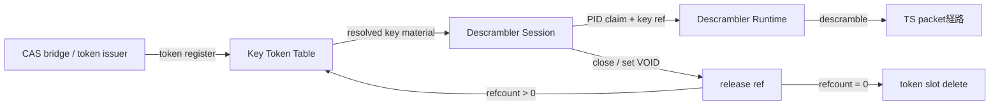
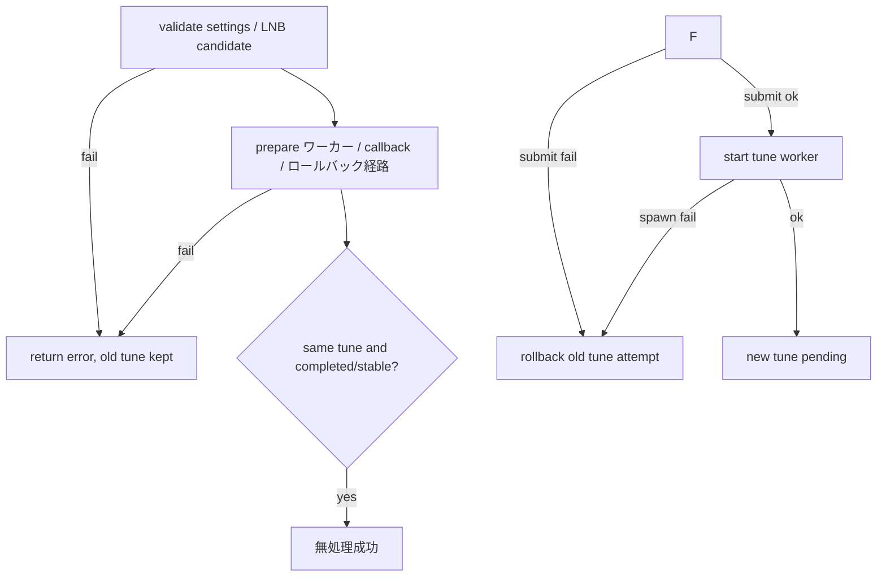

# Tuner HAL 設計判断


## DESIGN_JA.md の責務境界

`DESIGN_JA.md` は Tuner HAL の設計正本である。本書は、AOSP 公開契約、ARIB/ISDB 入力処理、本製品の対応範囲、状態所有者、資源寿命、失敗時遷移、quarantine 条件、未対応機能の返却方針を定義する。

本書は、作業履歴、リリース履歴、ビルド手順、atest手順、VTS手順、静的検索手順、成果物命名規則、完了宣言テンプレートを定義しない。それらは `開発規則.md`、`タスク完了判定の実施方法.md`、`CHANGELOG.md`、各作業計画を正とする。

本書と他文書で、状態遷移、資源寿命、戻り値、capability、失敗時波及範囲が矛盾する場合は、本書を正として他文書を修正する。ただし、作業完了判定、成果物名、build / atest / VTS 手順については `タスク完了判定の実施方法.md` を正とする。


### 共通部品の定義条件

本書で共通部品と呼ぶものは、単なる関数名・ファイル名・薄い委譲 wrapper ではない。共通部品として設計正本へ置く場合は、次を定義する。

| 項目 | 必須内容 |
|---|---|
| 論理契約名 | 例: `ObjectCloseTxn`、`ObjectMethodTxn`、`StreamBoundaryTxn` |
| 実装正本 | 状態・寿命・失敗時遷移を所有する module / file / type |
| 公開入口 | AIDL層または service_runtime 層から呼んでよい entry point |
| 所有する状態 | lifecycle、registry、callback、worker、FMQ、packet assembler など、当該部品が正本として変更する状態 |
| 所有しない状態 | 呼び出し元または別 transaction が所有する状態 |
| phase order | lifetime / request build / validation / dispatch / commit / rollback / quarantine の順序 |
| 失敗時処理 | 戻り値、rollback、cleanup継続、cleanup failed、quarantine の扱い |
| 呼び出し許可層 | AIDL method body、object wrapper、service_runtime façade、domain transaction のうち許可する層 |
| 呼び出し禁止層 | 誤用を避けるため直接呼んではならない層 |
| 最低テスト | status precedence、rollback、retry、cleanup failure、quarantine などを固定する test |

上記を満たさないものは、共通部品ではなく helper、façade、adapter、または implementation detail と呼ぶ。helper / façade が transaction 正本を名乗ってはならない。

`transaction` という名前は、少なくとも状態変更の開始条件、commit、rollback または cleanup failure / quarantine のいずれかを所有する部品にだけ使う。runtime lock を取って closure を呼ぶだけの部品、引数を同名 method へ横流しするだけの wrapper、domain naming を隠さない薄い façade は transaction ではない。


## 外部文書参照: no-panic / 劣化起動 / 閉鎖側失敗境界

この項目は実装規約であるため、詳細な禁止事項、エラー写像、劣化起動、mutex汚染、ワーカー生成・join 方針は `tuner_hal/CODE_CONVENTION.md` を正とする。本書では Tuner HAL が no-`panic` / 劣化起動 / 閉鎖側失敗 を設計上必須とすることだけを固定する。


## 正本・移動済み情報の読み方

本書の正本階層は次の順とする。

1. `DESIGN_JA.md の責務境界`、`製品スコープ / AOSP capability / VTS profile 境界`、`AIDL 契約境界`、`Tuner HAL 状態遷移表SSOT` を最上位正本とする。
2. `0-S. 状態所有・寿命・失敗時遷移設計`、`表1`〜`表20`、`ARIB/ISDB入力処理契約`、`Stream boundary 契約`、`Packet pipeline 正本契約`、`AV shared handle 入出力契約` を、現在の設計契約の正本とする。
3. 旧 `補足契約:` 章は本体正本章へ吸収済みであり、本書内に二重正本として残さない。
4. 個別リリースの履歴、作業経緯、ビルド/atest/VTS/静的検索/成果物命名/完了宣言は本書では定義しない。履歴は `CHANGELOG.md`、完了判定は `タスク完了判定の実施方法.md` を正とする。

削除・移動した旧記載の追跡表は現行リリース物に置かない。現行仕様は本書、実装規約は `tuner_hal/CODE_CONVENTION.md`、統合手順は `tuner_hal2/INTEGRATION.md`、変更履歴は `tuner_hal/CHANGELOG.md` を正とする。存在しない trace 文書を正本参照にしてはならない。

## 製品スコープ / AOSP capability / VTS profile 境界

製品全体のリリース到達点、日本向け scan 候補、サービス検出、channel key の実装データ保持者は tv 直下の `開発規則.md` を正とする。本節では、Tuner HAL の capability、VTS/profile、AIDL戻り値に閉じる境界だけを固定する。HAL は渡された tune request を処理し、BLIND_SCAN や HAL-generated Japanese scan plan は capability / VTS profile で対応宣言しない。

Tuner VTS 用XMLは実行環境依存の静的variantであり、既定では導入しない。`config/tuner_vts_config_aidl_V1.reference_isdbs_lab.xml` は参考profileに過ぎず、AOSP branch、受信source、周波数/stream ID/PID、実行flow、Filter/DVR queue byte、製品memory budgetが宣言され、その完全resource vectorを起動前にreserveできる場合だけ `ro.vendor.vts_tuner_configuration_variant=reference_isdbs_lab` と対応moduleを製品へ導入する。環境未確定時は `DESIGN_HOLD_VTS_ENVIRONMENT_UNDECLARED` とし、VTS成功を宣言しない。descrambler objectはAIDL面として実装しても、この参考profileでは本番scramble解除成功を宣言しない。

Tuner HAL の capability / VTS profile では TS 入力だけを宣言する。製品全体の TS-only スコープは `開発規則.md` を正とし、本書では Tuner HAL の宣言値と返却値を固定する。MMTP、TLV、ALP、IP CID は capability と VTS profile に宣言しない。`IFilter.configureIpCid()` は filter種別にかかわらず `UNAVAILABLE` とする。CID を保存だけして 照合、経路制御、配送 に使わない成功扱いの無処理 を残してはならない。


### export ID と VTS profile の固定

Tuner HAL が framework へ export する frontend ID は backend の単純な numeric index だけに依存しない。`px4video0` と `pxmlt5video0` のように異なる device family が同じ unit index を持つ場合でも、HAL の frontend ID と physical group ID は衝突してはならない。device family code と unit index を組み合わせ、1,000,000 番台の px4 frontend ID として export する。DVB frontend ID はハッシュではなく固定ビット割当で生成し、`2,000,000 + (adapter_id << 12) + (frontend_index << 4) + variant` とする。`adapter_id` と `frontend_index` は 8 bit、`variant` は 4 bit で、variant は ISDB-T=0、ISDB-S=1 に固定する。範囲外の DVB probe は export しない。生成後の duplicate ID 検出は最終保険として残す。px4 frontend の `exclusiveGroupId` は unit index 単独値ではなく、device family code と unit index を含む packed physical group id として返す。


**Canonical rule `CD-1b216b960772`（`DP-079;DP-164`、規範）**

DvrLeasePool is a view of the committed immutable CapabilitySnapshot and is the sole source for getDemuxCaps and openDvr admission. Global playback/record counts are snapshot.playback_count and snapshot.record_count; per-demux limits are one playback and one record DVR. Admission validates lifecycle/arguments, atomically reserves direction and per-demux leases, then prepares caller-requested FMQ and the exact notifier slot budget. Failure rolls back every provisional lease and publishes no partial object. CleanupPending/Quarantined objects remain counted until terminal release. Tuner VTS is environment-bound rather than a default C1 promise: until a pre-start VtsEnvironmentProfile declares source, PIDs, flows, queue sizes and memory budget, VTS is DESIGN_HOLD and no XML is installed. A bound static variant must fit C1 and reserve its exact queue-byte demand.


### VTS profile / capability / 実装済み機能 対応表

VTS XML/profileで使う機能、capabilityで宣言する機能、実装済み機能は一致させる。VTS profileで使用する機能をcapability非宣言または未実装扱いにしてはならない。capabilityで宣言する機能をVTS/profileから到達不能にして検査を回避してはならない。

| 領域 | capability / profile 方針 | 設計契約 |
|---|---|---|
| `setDataSource(NULL)` | AOSP意味論として存在し、現行AOSP契約として成功対象に含める | sink filter の入力元を demux input へ戻す。生成trait上の非nullable表現を理由に現行対象外へ落とさない |
| `IDescrambler.addPid/removePid(NULL)` | AOSP意味論として存在し、現行AOSP契約として成功対象に含める | demux input 全体に対する PID 登録 / 解除として扱う。生成trait上の非nullable表現を理由に現行対象外へ落とさない |
| AV shared handle release | media filter shared memory profileでは到達する | `releaseAvHandle(fd付き handle, 0)` を成功させる |
| monitor event | `monitorEventTypes > 0` を使うprofileだけ対応宣言 | 非対応profileでは非0 mask を使わない |
| AV passthrough | 対応宣言しない | profileでは `isPassthrough=false` に固定する |
| `linkCaps` | main type 粒度 | 広告した main type pair は VTS が生成する subtype `UNDEFINED` 接続も成功対象に含める。成功させない pair は広告しない |


### Tuner HAL 固定境界

- CS110 は周波数のみで選局する。ISDB-S settings で `streamIdType=UNDEFINED` かつ `streamId=0` の明示未指定、または AOSP SDK の default 表現である `streamIdType=STREAM_ID` かつ `streamId=INVALID_STREAM_ID(0xFFFF)` だけを selector なしとして扱う。CS110 tune request に TSID / relative stream-number selector が指定された場合は `INVALID_ARGUMENT` とする。`streamIdType=RELATIVE_STREAM_NUMBER` の負値、`streamIdType=UNDEFINED` の負値、その他の負値 selector は未指定へ丸めない。

**Canonical rule `CD-ee2559d5330c`（`DP-112`、規範）**

ISDB-S selector support is created only by a capability-domain-eligible fact in an exact SupportedDeviceCapabilityCatalog entry keyed by SupportedBackendIdentity, driver repository/commit, exact USB VID/PID or equivalent device identity, and revision scope. With no matching verified entry, or when selector_capability_release_eligible is false, no ISDB-S selector capability is advertised and no tune object for that selector is created. An eligible entry may advertise RELATIVE_STREAM_NUMBER 0..7 when the exact adapter path is proven; an absolute STREAM_ID request is then UNAVAILABLE without backend mutation. A separately proven entry may advertise absolute TSID 0..65534; 65535 is INVALID_ARGUMENT and there is no special 0..11 rejection. ProductProfile may suppress an eligible selector fact but cannot create or widen one. Runtime reads only immutable EffectiveCapabilities.


- コールバック失敗、ワーカー異常終了、FMQ / EventFlag 失敗の状態遷移、診断、後続処理停止条件は表7・表8を正とする。本節では再定義しない。
- DVR 状態 interval はコールバックワーカーの周期にだけ使う。ワーカーの wait は stop signal で wake 可能な cancellable wait とし、close / Drop / shutdown は interval 満了を待たない。
- `getAvSharedHandle()`、AV filter `start()`、`releaseAvHandle()` の状態別契約は、本書の「表4. AV共有メモリ資源寿命表」を正とする。

**Canonical rule `CD-f5a3c9aad0f5`（`DP-117`、規範）**

backend error mappingを固定する。client malformed/range=INVALID_ARGUMENT、Missing/Busy/Capacity/valid-but-unsupported=UNAVAILABLE、wrong lifecycle=INVALID_STATE、dependency未初期化=NOT_INITIALIZED、allocation=OUT_OF_MEMORY、permission/I/O/config corruption/invariant=UNKNOWN_ERROR。


- filter monitor event は profile / capability 依存とする。monitor event 非対応 profile では `configureMonitorEvent(0)` のみ成功し、非0 mask は `UNAVAILABLE` とする。monitor event 対応 profile で `monitorEventTypes > 0` を使う場合は、`configureMonitorEvent(nonzero)` を成功させ、要求 mask に対応する monitor event を配送する。通常の `DATA_READY` / `OVERFLOW` / `onFilterEvent()` delivery は monitor mask で抑止しない。
- soft demux の section / PES assembler と filter `stop()` / `flush()` / `configure()` / `close()` の状態別契約は、本書の「表1. IFilter 状態表」を正とする。
- `setMaxNumberOfFrontends()` は `0 <= max_number <= default_max` だけを成功させる。負値と `default_max` 超過はどちらも `INVALID_ARGUMENT` とする。
- 製品実行時 の frontend registry は実在 probe できた backendエントリ だけで構成する。probe 失敗は 診断情報レコード に残し、劣化 frontendエントリ / テスト劣化補助関数 / 診断劣化補助関数 は作らない。


### nullable Binder 境界

AOSP意味論として NULL binder 入力を持つ境界は、`IFilter.setDataSource(NULL)`、`IDescrambler.addPid(NULL)`、`IDescrambler.removePid(NULL)`、`IFrontend.setCallback(NULL)`、`ILnb.setCallback(NULL)` とする。これらは現行AOSP契約として扱い、生成trait上の表現差を理由に実装済み対象外へ落とさない。`setDataSource(NULL)` は demux input 復帰、`IDescrambler` の NULL filter は demux input 全体の PID 操作、callback NULL は登録解除として成功対象に含める。

この境界は本書で管理する。`future_work` を現行リリース契約の正本として参照してはならない。NULL 経路と non-null 経路の状態遷移、戻り値、資源寿命、失敗時遷移は本書の各表を正とする。nullable binder 入力をAOSP契約どおり受けるための実装方式は公開AIDL契約を改変せずに実装する。

### Android 14 AIDL filter source 境界の現行処理


**Canonical rule `CD-7dce44077973`（`DP-004`、規範）**

configure()はsource bindingを変更しない。新settingsが既存bindingと非互換ならINVALID_STATEで拒否し、旧settings/bindingを保持する。切断はsetDataSource(null)で明示する。malformed settingsはINVALID_ARGUMENT。


`IDescrambler.addPid()` / `removePid()` は、`optionalSourceFilter == NULL` を demux input 全体に対する PID 登録 / 解除として扱い、`optionalSourceFilter != NULL` を指定 filter output、すなわち upper stream に対する PID 登録 / 解除として扱う。NULL 経路は現行AOSP契約上の成功対象であり、実装済み対象に含める。non-null source filter 経路は、本書の「表D-1. IDescrambler PID 操作表」を正とし、同一 demux、非閉鎖、世代一致を検証する。


## AIDL 契約境界

`IFilter`、`IDvr`、`IFrontend`、`IDemux`、`ILnb`、`IDescrambler` の 公開メソッド は、AIDL HAL の契約面として close 後状態を必ず検査する。状態別の戻り値、次状態、維持する内部状態、破棄・無効化する内部状態は、本書の「Tuner HAL 状態遷移表SSOT」を正とする。


**Canonical rule `CD-a625b795dfe0`（`DP-100;DP-150`、規範）**

`IFrontend.getStatus(statusTypes)` and `getFrontendStatusReadiness(statusTypes)` have distinct cardinality contracts. `getStatus` rejects an unknown enum representation with `INVALID_ARGUMENT` and no output. For known values it emits one `FrontendStatus` only for each requested type advertised in `FrontendInfo.statusCaps`, preserving relative order and duplicates among emitted advertised types; known-unadvertised types are ignored, so an all-unadvertised request succeeds with an empty vector. It never fabricates type-specific not-available sentinels. Failure to obtain any advertised requested value atomically returns `UNAVAILABLE` and no partial vector. The HAL performs this filter because the public framework/JNI forwards the request while the SDK contract says unadvertised types are ignored. `getFrontendStatusReadiness` also rejects unknown representations, but for every known requested type returns exactly one result in request order: advertised types are `UNAVAILABLE`, `UNSTABLE` or `STABLE`; unadvertised types are `UNSUPPORTED`. The APIs may share enum validation but not an output-cardinality helper.


`IFilter.setDataSource(source)` は、AOSP意味論どおり `source != NULL` の場合に指定 filter output を入力元とし、`source == NULL` の場合に sink filter の入力元を demux input へ戻す。`setDataSource(NULL)` は実装済み対象に含める。AOSP frozen/stable AIDL の vendor 独自改変、raw Binder transaction parser による公開契約を通さない実装は採用しない。non-null source filter 経路では、旧 `SourceFilter(filter_id, generation)` origin に属する section / PES assembler、continuity、flush generation、downstream partial state を切断し、旧 source 由来の未完了 payload を新 source 由来 payload へ連結してはならない。

`IFrontend.tune()` は binder thread 上で ロック 完了まで待ち続けない。前回 tune / scan の ワーカーを generation で無効化し、backend へ tune request を投入し、非同期 ワーカー が ロック timeout と event 通知を行う。`stopTune()`、`close()`、次回 `tune()`、`scan()` は該当 generation を cancel し、古い ワーカー からの `LOCKED` / `NO_SIGNAL` 通知を捨てる。

`IFrontend.scan()` は、同一条件の再 scan であっても成功扱いの無処理 にしない。AOSP 契約に従い、未完了の scan がある場合は既存 scan generation を停止し、新しい scan generation を開始する。既存 scan の callback から来る古い terminal event は generation mismatch として捨てる。

`IFrontend.close()` は frontend backend の critical cleanup を成功扱いで握り潰さない。公開 close では、scan cancel、tune ワーカー stop、ライブ pump stop、backend close、コールバック解除、demux unbind、frontend lease release を step runner として扱い、途中 step が失敗しても後続 cleanup を継続し、最初に観測した critical error を AIDL 状態 として返す。cleanup failure 後の frontend オブジェクト は通常操作へ戻さず、close retry だけを通常の復旧経路として許可する。戻り値を返せない Drop 経路は通常 cleanup の代替にせず、未 close または cleanup 未完了を DropLeakTxn に記録し、対象を漏えい診断 / 隔離診断へ落とす。

DVB / earth_pt1 backend では、`DTV_CLEAR` は明示的な tune 停止操作である `stop_tune()` の責務とする。DVB backend の `close()` は reader stop と fd release を行うが、`DTV_CLEAR` の実行を close の必須条件とはしない。したがって、DVB `close()` が `DTV_CLEAR` を発行しないことを release blocker または bug と扱わない。

`IFrontend.removeOutputPid(pid)` は、frontend 出力段で PID を除去できる実装が存在しない限り `UNAVAILABLE` とする。soft demux 後段の block list だけで PID を捨てる実装は、frontend-level output PID removal を実装したことにしない。


### DVR playback status の空き領域基準

DVR playback status は playback input buffer の空き領域、すなわち space を基準に判定する。

| PlaybackStatus | 意味 |
|---|---|
| `SPACE_EMPTY` | playback input buffer の空き領域が空、すなわち書き込み余地がない |
| `SPACE_ALMOST_EMPTY` | 空き領域が少ない |
| `SPACE_ALMOST_FULL` | 空き領域が多い |
| `SPACE_FULL` | 空き領域が満杯、すなわち buffer は空に近い |

使用済み量基準と空き領域基準を混同してはならない。


## Tuner HAL 状態遷移表SSOT

本節の表は、Tuner HAL の状態を持つ公開API、内部事象、資源寿命、戻り値、副作用のSSOTである。表に記載した状態別契約は、後続の散文で再定義しない。後続本文は、表だけでは読み取れない背景、製品方針、能力宣言、実装上の補足に限定する。


### 0-S. 状態所有・寿命・失敗時遷移設計

#### 0-S-1. 設計原則

Tuner HAL は、内部状態の正本を1つに固定する。複数の構造体が同じ状態を独立に保持してはならない。

公開API 主経路は、必ず正本所有者を経由する。共通部品を追加しただけ、一部経路が共通部品を呼ぶだけ、旧名が消えただけでは、設計適合とはみなさない。

各APIは次を固定する。

| 項目 | 内容 |
|---|---|
| 状態所有者 | どの構造体が正本か |
| 成功時commit | 何が確定するか |
| 失敗時rollback | 何を戻すか |
| rollback失敗時 | quarantine / failed / retry のどれに落とすか |
| cleanup失敗時 | 再試行可能に残すか、quarantineするか |
| Drop時動作 | Dropで何をしてよいか |
| 診断 | 何を残すか |
| 公開API戻り値 | どのAIDL状態を返すか |

rollback不能、cleanup不能、正本不一致、backend実状態とregistry不一致、ワーカー状態不一致は、通常状態として扱ってはならない。通常状態へ戻せない場合は quarantine または failed 状態へ落とす。

#### 0-S-2. 状態所有者表

| 資源 / 状態 | 正本所有者 | 補助所有者 | 禁止事項 |
|---|---|---|---|
| service lifecycle | `TunerHal` | なし | 子資源が service 全体状態を直接変更しない |
| frontend lease | `FrontendLedger` | `FrontendRuntime` | open count、physical group、runtime binding を別々に確定しない |
| frontend backend state | `FrontendRuntime` | backend adapter | backend実状態とruntime状態を通常状態で乖離させない |
| demux id / refcount | `DemuxLedger` | `DemuxHal` | live id、registry record、refcount を別々に確定しない |
| demux データ経路 | `DemuxRuntime` | `RuntimeIoRegistry` | FMQ/DVR/AV境界処理をAPIごとに重複実装しない |
| filter lifecycle | `FilterLedger` | `FilterHal`, `soft_demux` | soft demux filter record と binder object の片方だけを残さない |
| filter queue | `FilterQueueBacking` | `FilterHal` | write成功後のwake失敗を完全失敗として黙殺しない |
| DVR lifecycle | `DvrLedger` | `DvrHal`, `soft_demux` | DVR object と soft demux DVR record の片方だけを残さない |
| playback queue | `PlaybackQueueBacking` | playback ワーカー | ワーカー失敗だけでDVRをclosed扱いにしない |
| descrambler session | `DescramblerSession` | `DescramblerLedger` | demux binding、PID、source filter、key tokenを別々に閉じない |
| key token | `DescramblerKeyTable` | `DescramblerSession` | refcount不整合のまま成功扱いしない |
| LNB state | `LnbRegistry` | backend adapter | backend状態とregistry状態の乖離を通常状態にしない |
| ワーカー | `WorkerRuntime` | 所有オブジェクト | 所有者不明ワーカーを作らない |
| stream boundary | `StreamBoundaryTxn` | demux/filter/DVR/AV | tune/scan/source切替で境界処理を重複実装しない |
| packet pipeline | `PacketPipeline` | `soft_demux` | continuity、origin、generationを複数箇所で更新しない |
| AV shared memory | `AvSharedBacking` | `FilterHal` | fd番号一致をshared handle同一性条件にしない。fd付きhandle + `avDataId == 0` はclient側shared handle使用終了通知として扱う |

**Canonical rule `CD-cbde311bfcd9`（`DP-123`、規範）**

Shared and event-local fd identity is never numeric-fd equality. On export/allocation HAL records `backing_id`, transport mode, handle integer payload, expected size and fstat identity `{st_dev, st_ino}`. Duplicated fds for the same backing resolve to the same identity. Shared-handle release validates the recorded shared backing. Event-local release validates the fd identity and full allocation tuple. `empty+dataId` validates the ledger identity without an fd. A mismatched handle/dataId/backing pair is `INVALID_ARGUMENT` and cannot release another allocation. Registry/fstat failure is `UNKNOWN_ERROR` and fences uncertain storage.


#### 0-S-3. 公開API transaction（状態遷移）契約

公開API の状態変更は、原則として次の段階で扱う。

```text
validate
  -> reserve
  -> prepare
  -> apply
  -> commit
```

| 段階 | 許可 | 禁止 |
|---|---|---|
| validate | 引数、状態、capability、owner一致、closed状態の確認 | 状態変更 |
| reserve | ledger / id / slot / ワーカーslot の仮確保 | backend実状態の変更 |
| prepare | ワーカー生成準備、コールバック経路準備、rollback snapshot取得 | 旧公開状態の破壊 |
| apply | backend / soft_demux / queue / registry への変更 | commit不能な変更をsnapshotなしに行うこと |

**Canonical rule `CD-de1ca7f6a3b9`（`DP-152`、規範）**

各operationをPrepare→CommitCritical→PostCommitへ統一する。CommitCriticalは正本state/ownership/backend apply、PostCommitはcallback、status wake、diagnostic、cleanup accounting。PostCommit失敗はtyped secondary outcomeとして保存し、primary Resultを変更しない。


| rollback | commit前変更の取り消し | 失敗を握りつぶして通常状態へ戻すこと |
| quarantine | rollback不能資源の隔離 | 成功扱いで通常操作を許すこと |

commit前失敗では、成功戻りを返してはならない。commit後cleanup失敗では、APIの戻り値方針を各API表で固定し、必ず診断に残す。rollback失敗時は、対象資源を quarantine または failed 状態へ落とす。


#### 0-S-3A. 共通部品適用表


**Canonical rule `CD-73adc4b61306`（`DP-118`、規範）**

共有primitive/invariantのみ共通化し、interface-specific orchestrationを許容。この規則を唯一のSSOTとし、旧分岐・重複表・例外規則を削除する。


| 対象処理 | 所有共通部品 | 必ず通す経路 | 禁止する実装 |
|---|---|---|---|
| Filter / DVR `start()` の commit 後 コールバック失敗 | `PostCommitCallbackFailureTxn` | start commit 後の callback 失敗は rollback せず `callback_unhealthy` に固定。既存実装名が異なる場合でも、この責務を単一の callback health 正本へ移管する | APIごとに `stop_*()` を直接呼んで rollback すること、またはAPI別に同型の コールバック失敗 処理を再実装すること |
| Filter / DVR `flush()` の queue cleanup | `QueueCleanupTxn` | demux flush 後の FMQ / AV / playback cleanup 失敗を runtime failed または cleanup failed に接続 | `clear_best_effort()` で 公開API 成功に丸めること |


| ワーカー起動 / 停止 / join / wake | `WorkerFailureClassifier` | ワーカー制御失敗、コールバック失敗、backend failure を enum / domain error で分類 | `reason.contains(...)` など文字列分類で失敗種別を決めること |
| frontend / demux / source filter / flush 境界 | `StreamBoundaryTxn` / `SourceBoundaryTxn` | origin、generation、assembler、FMQ、AV shared、record queue を対象単位で処理 | 各APIが assembler / queue / generation を個別に直接操作すること |
| descrambler demux / PID / key cleanup | `DescramblerSessionCleanupTxn` / `DescramblerKeyTxn` | session と key table の更新・release・失敗集約を一体で扱う | 1件の stale cleanup 失敗で後続 session を未処理のまま抜けること |


| DVR playback read / inject | `PlaybackConsumeTxn` | FMQ read、TS parse、注入結果、消費確定を1つの状態機械で扱う | read済み入力を 注入結果未確認のまま一律消費済みにすること |


#### 0-S-4. 失敗分類と波及範囲

| 失敗種別 | 例 | 戻り値 | 波及範囲 | 禁止事項 |
|---|---|---|---|---|
| クライアント誤用 | 引数不正、owner不一致 | `INVALID_ARGUMENT` | 呼び出し対象のみ | backend/データ経路 failureへ昇格しない |

**Canonical rule `CD-23d2e1c35c4f`（`DP-003;DP-017;DP-115;DP-153`、規範）**

Public close semantics use one interface×logical-lifecycle×cleanup-state table. A first close on a Live object commits LogicalClosed before all-attempt cleanup and rejects every non-recovery method. `IFrontend.close()` and `ILnb.close()` may be called more than once: LogicalClosed+CleanupComplete returns SUCCESS without rerunning completed cleanup. `IDvr.close()` and `IFilter.close()` on LogicalClosed+CleanupComplete return INVALID_STATE; IDvr's other methods also fail, and IFilter late `releaseAvHandle()` remains a separate release-ledger operation. For every interface, LogicalClosed+CleanupPending exposes close only as a recovery retry: it runs only pending cleanup steps, returns SUCCESS only when they complete, otherwise returns the operation-specific cleanup failure and remains CleanupPending. Quarantined rejects public close with INVALID_STATE and is serviced only by internal cleanup/reaper authority. LogicalClosed, CleanupPending, CleanupComplete and Quarantined are orthogonal axes.


| unsupported | capability外、恒久非対応 | `UNAVAILABLE` | なし | callback/ワーカー状態を先に見て別エラーにしない |
| コールバック失敗 | Binder コールバック失敗 | API表に従う | コールバック所有者 | データ経路全体を即failedにしない |

**Canonical rule `CD-49b9ecfb3112`（`DP-020`、規範）**

WorkerPanic、JoinFailure、StopWakeFailure、EventFlagWakeFailureを別variantへ分ける。この規則を唯一のSSOTとし、旧分岐・重複表・例外規則を削除する。


| データ経路 failure | FMQ/shared memory破損 | `UNKNOWN_ERROR` | 対象filter/DVR/AV | frontend backend failureと混同しない |
| ledger failure | 正本台帳不整合 | `UNKNOWN_ERROR` | 対象資源 | 通常状態に戻さない |
| rollback failure | 旧状態復元失敗 | `UNKNOWN_ERROR` | 対象資源をquarantine | 成功扱いにしない |
| cleanup failure | close/drop後片付け失敗 | API表に従う | 対象資源 | Dropだけに逃がさない |

#### 0-S-5. API別設計適合条件

各API表は、少なくとも次の列を持つ。既存表に同じ情報が分散している場合も、各項目への対応を追跡できることを必須とする。

| 項目 | 必須理由 |
|---|---|
| 事前状態 | closed / closing / failed / quarantined を区別するため |
| validate内容 | 引数不正と状態不正を分けるため |
| commit対象 | 成功時に何が確定するかを固定するため |
| rollback対象 | 失敗時に何を戻すかを固定するため |
| cleanup失敗時 | close / Drop / best-effort の扱いを固定するため |
| 次状態 | API戻り値と内部状態を一致させるため |
| 診断 | 失敗原因を追跡するため |

### Tuner HAL runtime 設計契約

Tuner HAL runtime の公開API状態、内部事象、資源寿命、失敗時波及範囲を以下の設計契約として固定する。


**Canonical rule `CD-780d0b462c25`（`DP-021`、規範）**

public Result表を固定する。不存在/foreign ID=INVALID_ARGUMENT、closed local object=INVALID_STATE、capacity/resource absence=UNAVAILABLE、未初期化dependency=NOT_INITIALIZED、内部不整合/破損=UNKNOWN_ERROR。phantom objectや自動quarantineは作らない。


- filter ID は HAL 外部へ返す値を demux-local ID のまま維持する。DVR attach/detach、filter データ入力元、AV sync ID 取得では、渡された filter オブジェクト の内部 owner demux を検証し、owner demux が一致しない filter を `INVALID_ARGUMENT` で拒否する。
- ワーカー は handle 保存先の mutex を確保してから spawn する。保存先を確保できない場合は spawn しない。ワーカー `panic` は `WorkerHandle::join_from_owner()` 経由で診断へ残し、detached ワーカーを作らない。
- 長寿命 ワーカー の待機は `Mutex` + `Condvar` を基本とし、stop request → wake → join の順で停止する。`AtomicBool` は close済み / stop要求 / export済みなどの単純 flag に限定し、複合状態同期の代替にしない。`loom` は テスト専用 候補であり、通常 単体テスト と静的ロジック確認の代替にはしない。

- 現行仕様で管理対象となる長寿命ワーカーは、`WorkerHandle` が owner id、`JoinHandle`、owner `ConcreteWorkerSignal` を所有し、owner signal の `Mutex<WorkerSignalState> + Condvar` で stop/work generation を wake する。`WorkerExit` は `Normal` / `StopRequested` / `RuntimeFailure` / `PanicOrJoinFailure` を正式名とする。

**Canonical rule `CD-b25dddb0e92b`（`DP-119`、規範）**

Worker cleanup is event-driven under the Worker termination contract in this document and has no TargetDriverTimingProfile or normative millisecond bound. Cancellation sends all available stop/wake signals once. Already-complete workers are collected immediately. A running worker is owner-generation-revoked and mutation-fenced before one-time transfer to bounded ReaperSupervisor and quarantine; the public caller never blocks on join. Lease consumption continues until actual termination and residual cleanup. Reaper capacity is derived from enforced live-worker ceilings and creates no retry timer jobs. Only typed evidence of unfenced global mutation, exclusive unfenceable global resource, or replacement race permits service-critical escalation; a fully fenced owner-local residual cannot stop unrelated capabilities.

**Canonical rule `CD-d2a67d36ae9b`（`DP-120`、規範）**

Failure propagation is owner×generation×dependency-local by default; a new spawn/callback/request failure must not destroy healthy siblings. A residual worker is service-critical iff, after owner-generation revocation, it can still mutate a service-global registry/backend, holds an exclusive service-global singleton/FD/queue, cannot be fenced by owner/generation/dependency tokens, or would race a new boot for the same resource. If none applies, quarantine is owner×generation×dependency-local and unrelated owners remain available.Escalation to service quarantine requires an explicit predicate witness in the typed diagnostic.


- frontend source transition は transactional に扱い、new bind / old unbind / record更新 / stream 境界 reset の途中失敗時には新 binding をrollbackし、rollback不能なら demux を 異常時閉鎖済み にする。


- DVR start は 状態 interval 分だけ Binder thread を sleep しない。状態 interval は コールバック ワーカー の周期だけに使う。

**Canonical rule `CD-538d0251a7a1`（`DP-022`、規範）**

Every queue/device/packet read outcome is classified by the Failure scope taxonomy in this document. Nonblocking empty/WouldBlock is `NoData`; EINTR is `Interrupted` and retries without state change; explicit stop/owned EOF is `Closed`. `InfrastructureCorrupt` is limited to FMQ descriptor/control/transaction invariants and quarantines the affected path. A malformed 188-byte TS packet is packet-local drop and typed diagnostic, not infrastructure corruption. TEI is preserved on raw/record output and excluded from semantic assembly. Continuity discontinuity preserves raw/record bytes and resets only PID-local semantic assemblers. Section/PES parse failure drops the semantic unit and restarts at a legal boundary. Permanent owned I/O failure terminates only the affected runtime unless a typed witness proves unfenced global mutation. No Corrupt/Fatal branch is silently mapped to NoData.


- px4 close は control FD だけでなく TS reader FD と reader state も解放する。
- px4 の CNR 取得は optional telemetry であり、`PTX_GET_CNR` 失敗だけで ロック/状態 query を fatal error にしない。
- セクションフィルター は condition の必要 byte 幅が payload 長を超える場合に match しない。prefix だけ一致した短い payload を match としない。
- セクションフィルターの `repeat=false` は重複抑止ではなく、同一 `start()` 世代内の配送停止条件である。`SectionBits` は最初に一致した section を1件配送した後、version や section number が異なる後続 section も配送しない。`TableInfo` は最初に一致した table id / table id extension / version を処理対象 table として固定し、その table の `0..last_section_number` を1回ずつ配送して table 完了後に停止する。table 完了前の別 version は配送しない。`repeat=true` の場合だけ同一条件の section / table を繰り返し配送する。section filter の配送可否状態は demux 入力から直接組み立てた section にだけ適用する。source filter 経由で section payload を再配送する経路は本製品では対応しない。この配送停止は公開 `IFilter.stop()` 呼び出しと同じ状態遷移ではない。filter object の公開状態は Started のまま維持し、利用側が明示的に `stop()` / `flush()` / `configure()` / `close()` を呼べる状態を保つ。
- `TableInfo.version` は `-1` または `0..31` だけを受け付ける。`-1` は wildcard、範囲外は `INVALID_ARGUMENT` とする。
- PES `streamId` は `0..=255` を明示 `stream_id` として照合し、`-1` だけを wildcard として扱う。その他の負値と `256` 以上は `INVALID_ARGUMENT` とする。`streamId=0` は wildcard ではなく、8-bit 値 `0x00` の明示照合である。
- `IFilter.setDataSource()` の互換性は本書の「表1-D. `setDataSource()` 互換表」を正とする。`setDataSource(NULL)` は demux input 復帰として成功対象に含める。filter source を指定する場合は、表1-D-3の subtype 別成立条件を正とする。source filter として指定できるのは TS生データフィルタだけである。下流として成功させるのは TS生データフィルタと record フィルタだけである。section / PES / AV への raw TS 再parse chain、および section payload、PES payload、AV payload、record payload を直接 source として再配送する経路は作らない。非対応の linkage は `UNAVAILABLE` とし、ペイロードなしフィルタを source または sink にする接続は `INVALID_ARGUMENT` とする。`linkCaps` に広告した main type pair はVTS生成の `UNDEFINED` subtype接続も成功させる。
- `IFilter.setDataSource(source)` の non-null source 経路は 同一demux内のfilter接続グラフ の接続だけを正式対象とする。`linkCaps` は同一 demux 内で開いた source / sink filter の main type 対応可否を表し、別 demux に属する filter を source に指定する経路を capability / VTS profile 対象に含めない。source / sink object の lifetime、generation、kind を先に確認し、その後に owner demux 不一致と自己参照を `INVALID_ARGUMENT` で拒否する。AOSP API 文面上の「another filter」は本製品では同一 demux の filter graph 内の別 filter として扱い、別demux間のfilter接続グラフは作らない。
- `IFilter.getQueueDesc()` の成否は configure 済みかどうかではなく、open時フィルタ種別が通常FMQを持つかどうかで決める。通常FMQ対象フィルタは未configureでも記述子取得を成功させる。

**Canonical rule `CD-0235ec29ab63`（`DP-121`、規範）**

health gate表を固定する。callback sink failure: domain operation継続可・新callback配送停止。diagnostic store failure: domain継続可・fallback counterのみ。backend unavailable: query/close可、mutation=UNAVAILABLE。registry corruption:当該domain mutation=UNKNOWN_ERROR、close/query可。FMQ corruption:当該object start/write不可、flush/close可。


- `IDescrambler.addPid()` / `removePid()` の source filter は AOSP意味論では optional であり、`NULL` は demux 入力全体の PID 指定である。NULL 経路は現行AOSP契約上の成功対象として扱い、実装済み対象に含める。

**Canonical rule `CD-6a647f1fda89`（`DP-023;DP-033;DP-034;DP-056;DP-057;DP-126`、規範）**

Capability publication is derived from one immutable CapabilitySnapshot selected after device probing. F=successful_frontend_count and L=successful_lnb_count are fixed first. The ordered runtime candidates C8, C4, C2 and C1 are enumerated in the CapabilitySnapshot candidates table in this document with numeric demux/filter/DVR/AV values and exact F/L formulas. For each candidate the service provisionally reserves the complete runtime vector, rolls back the whole vector on any component failure and commits the largest successful candidate exactly once. C1 is mandatory for ITuner publication and contains one audio plus one video AV filter, av_filter_count=2, av_ledger_entries_total=16 and av_reserved_bytes_total=16777216. The committed snapshot is the sole authority for getDemuxCaps(), admission, cleanup accounting and terminal release. VTS is not an unconditional part of C1: the AOSP branch, frontend source, tune parameters/PIDs, enabled flows, Filter/DVR buffer sizes and product memory budget form a pre-start VtsEnvironmentProfile. Until declared, VTS is DESIGN_HOLD_VTS_ENVIRONMENT_UNDECLARED, no default V1 XML is installed and no VTS-success claim is made. A bound static variant must fit C1 and atomically reserve its exact queue-byte vector before service/VTS startup.


- 入力値不正は `INVALID_ARGUMENT`、未対応 capability は `UNAVAILABLE`、オブジェクト state 不整合は `INVALID_STATE`、mutex汚染 や内部整合性崩壊は `UNKNOWN_ERROR` / `HalError::Internal` に写像する。

**Canonical rule `CD-2e715668ecfe`（`DP-109`、規範）**

source comment言語規則を`CODE_CONVENTION.md`へ移し、DESIGN_JA.mdから削除する。設計文書にはAPI・状態・資源寿命だけを残す。


- AV filter の `start()`、shared backing、MediaEvent、`releaseAvHandle()` の状態別契約は、本書の「表4. AV共有メモリ資源寿命表」を正とする。
- A/V sync の状態別契約は本書の「A/V sync 方針」と「A/V sync 非採用範囲」を正とする。


### 0. 総則

#### 0.1 本製品の固定方針

| 項目 | 固定内容 |
|---|---|
| 入力範囲 | 製品全体の入力方式スコープは `開発規則.md` を正とする。本書では Tuner HAL の capability / VTS profile として TS 入力だけを宣言し、MMTP、TLV、ALP、IP CID を宣言しないことを固定する |
| ライブAV正式経路 | non-passthrough `MediaEvent` + 共有メモリ + `dataId` 経路だけを正式対応とする |
| AVペイロードとFMQ | AVペイロードは通常FMQへ書き込まない。EventFlag は FMQ対象経路の通知にだけ使う |

**Canonical rule `CD-f2a57e6a5c98`（`DP-010`、規範）**

`releaseAvHandle()` is classified only by the `releaseAvHandle()` matrix in this document, which covers both shared-arena and event-local-FD `MediaEvent` modes. Negative dataId is `INVALID_ARGUMENT`. `empty handle + 0` is a success no-op. A returned shared handle + 0 releases only the client shared-handle lease; a known duplicate finalization is success no-op, while foreign/mismatched identity is `INVALID_ARGUMENT`. `empty handle + positive dataId` releases a matching active shared or event-local allocation and is success no-op for a known already-released issued ID. An event-local fd-bearing handle + matching positive dataId releases that event-local allocation; fd-bearing + 0 closes only the received event-handle lease when the allocation is retained by another framework reference. Unknown/never-issued/foreign/mismatched tuples are `INVALID_ARGUMENT`. Registry or fstat classification failure is `UNKNOWN_ERROR` with no uncertain free/reassignment. Release remains available after logical close for issued allocation identities; quarantined cleanup is internal only.


| AV passthrough | 本製品では恒久的に対応しない。passthrough capability は宣言せず、passthrough要求は configure時 `UNAVAILABLE` とする |
| 監視イベント配送 | profile / capability 依存とする。非対応 profile では `configureMonitorEvent(0)` は成功、非0マスク値は `UNAVAILABLE`。対応 profile で `monitorEventTypes > 0` を使う場合は非0マスク値も成功し、要求eventを配送する |
| PCR | ペイロードキューとして公開しない。AV同期の内部状態として扱う |
| 未対応機能 | capability と VTS profile に宣言しない。要求された場合は configure時、専用API呼び出し時、対応する公開API呼び出し時のいずれかで `UNAVAILABLE` とする |
| close | `closed` は公開API遮断ゲート、`cleanup_complete` は後片付け完了根拠として別管理する |
| ABI不整合 | AIDL ABI、Rust/C 接続層の関数シグネチャ、リンク不整合は実行時状態表に入れない。ビルド、リンク、AIDL確認、VINTF確認で弾く対象とする |

#### 0.2 状態圧縮の許可条件

状態遷移表で複数の状態を1行へ圧縮してよいのは、次の4条件を全て満たす場合だけである。

| 条件 | 固定内容 |
|---|---|
| 条件1 | 選択式の戻り値、選択式の次状態、未固定語をセル内に書かない |
| 条件2 | 対象状態集合を表内に明記し、集合のヌケモレを許さない |
| 条件3 | 戻り値、次状態関数、副作用、診断、資源寿命が対象状態集合内で完全に同じである |
| 条件4 | 同値性根拠を表内に明記する |

次状態は固定値だけでなく、`入力状態を維持`、`共有ハンドル軸だけ公開済みに変更` のような関数で固定してよい。関数で固定する場合は、変更する状態軸と維持する状態軸を表内に書く。

#### 0.3 文書間の責務境界

| 文書 | 正とする内容 | 禁止事項 |
|---|---|---|
| `tuner_hal/DESIGN_JA.md` | Tuner HAL の公開API状態、内部事象、資源寿命、戻り値、副作用、確定点、巻き戻し、閉鎖側失敗の対象 | 同じ状態遷移契約を他文書で再定義すること |
| `tuner_hal/CODE_CONVENTION.md` | Tuner HAL 固有の実装規約、禁止構文、補助関数 使用規則、静的確認観点 | DESIGN_JA.md の状態遷移、戻り値、資源寿命を別内容で定義すること |
| `GLOBAL_CODE_CONVENTION.md` | Rust / Kotlin 全体に共通する実装規約 | Tuner HAL 固有の状態遷移を定義すること |
| `タスク完了判定の実施方法.md` | 検査手順、証跡の取り方、判定時の確認順序 | 設計契約や実装規約を新規定義すること |
| `tuner_hal/CHANGELOG.md` | 変更履歴、リリース履歴、過去の作業理由 | 現行設計の正本として扱うこと。CHANGELOG にしかない方針で実装を正当化すること |


**Canonical rule `CD-d6a10d6f3d8f`（`DP-110`、規範）**

曖昧な「表1/表4等」を廃止し、各移動規則にstable anchor IDを付ける。状態契約=STATE-FE-01/STATE-FILTER-01/STATE-DVR-01、Result precedence=RESULT-01、cleanup=LC-01、AV release=AV-01。本文はanchor IDだけを参照する。


### 表0-F. IFrontend scan 状態表

`scan()` が成功した場合は、常に新しい scan generation を開始する。同一条件の再 scan を成功扱いの無処理 にしてはならない。

| No | 事前状態 | 呼び出し | AIDL戻り値 | 次状態 | 副作用 | 設計上の成立条件 |
|---:|---|---|---|---|---|---|
| FR-001 | Idle | `scan(settings, type)` | 成功 | Scanning(generation+1) | 新 scan generation を開始 | backend へ新 scan request が投入される |
| FR-002 | Scanning | `scan(same settings, same type)` | 成功 | Scanning(generation+1) | 既存 scan を停止し、新 scan を開始 | 同一条件でも 無処理 にならない |
| FR-003 | Scanning | `scan(different settings/type)` | 成功 | Scanning(generation+1) | 既存 scan を停止し、新 scan を開始 | 古い callback は generation mismatch で捨てる |
| FR-004 | Scanning | `stopScan()` | 成功 | Idle | 現 scan generation を停止 | terminal reason を Cancelled として診断へ残す |
| FR-005 | Idle | `stopScan()` | 成功 | Idle | なし | 重複 stop は冪等成功 |
| FR-006 | Closing / Closed | `scan(...)` | `INVALID_STATE` | 入力状態を維持 | なし | 閉鎖中または閉鎖後に scan を開始しない |

### 表1. IFilter 状態表

#### 表1-A. IFilter 状態コード

| 状態コード | 状態名 | 意味 |
|---|---|---|
| F0 | 未設定 | `openFilter()` 後、`configure()` 未完了 |

**Canonical rule `CD-5f092381c515`（`DP-006`、規範）**

Filter normal-FMQ payload, DVR record stream, and TS/MMTP record callback metadata are three distinct planes. TS/MMTP record filters do not expose a normal filter FMQ. Their payload is written only to the attached Record DVR FMQ, while PID/index/byte-number/PTS/start-code metadata is delivered by DemuxFilterTsRecordEvent/DemuxFilterMmtpRecordEvent callbacks. Section, PES and raw TS payload filters may use the normal filter FMQ according to their subtype table.


| F2 | FMQ開始済み | FMQ対象フィルタが start 済み |
| F3 | FMQ停止済み | FMQ対象フィルタが stop 済み |

**Canonical rule `CD-784341f0278c`（`DP-005`、規範）**

payload planeとmonitor mask/event planeを分離し、対応profileでは初回状態と変化eventをcallback配送。この規則を唯一のSSOTとし、旧分岐・重複表・例外規則を削除する。

**Canonical rule `CD-f90c09663c36`（`DP-024`、規範）**

PCR等の実行状態とmonitor mask/event配送状態を別軸にする。この規則を唯一のSSOTとし、旧分岐・重複表・例外規則を削除する。

**Canonical rule `CD-c0c3b6c7452d`（`DP-122`、規範）**

run_state、hint、handle_export、generationを直交型へ分離し、不可能組合せだけ型で禁止。この規則を唯一のSSOTとし、旧分岐・重複表・例外規則を削除する。


AV filter の audio/video routing 種別は open subtype を正とする。TsAudio は Audio、TsVideo は Video である。`configureAvStreamType()` は codec / stream type hint を保存する補助APIであり、未実行であっても `setDataSource()`、`start()`、PES/AV routing、MediaEvent 配送の必須条件にはしない。

#### 表1-B. IFilter 基本API状態契約

| No | API / 入力 | 対象状態集合 | AIDL戻り値 | 次状態関数 | 副作用 | 診断 | 同値性根拠 / 設計上の成立条件 |
|---:|---|---|---|---|---|---|---|
| F-B-001 | `configure()` FMQ対象設定 | F0 | 成功 | F1 | queue世代を更新し旧一過性状態を消去 | `filter_configure_success` | 未設定からFMQ対象へ進む |

**Canonical rule `CD-2a23a0328beb`（`DP-025`、規範）**

queue非公開とcallback event無効を分離する。この規則を唯一のSSOTとし、旧分岐・重複表・例外規則を削除する。


| F-B-003 | `configure()` live AV non-passthrough | F0 | 成功 | A0 | AV世代を進め、旧AV資源を全破棄。TsAudio は Audio、TsVideo は Video の routing 種別を open subtype から導出する | `filter_configure_success` | AVはハンドル未公開で開始する。`configureAvStreamType()` 未実行でも routing 種別は存在する |
| F-B-004 | `configure()` AV passthrough | F0 | `UNAVAILABLE` | F0 | なし | `unsupported_passthrough_configure` を増やす | 本製品では passthrough を恒久非対応とする |
| F-B-005 | `configure()` MMTP / TLV / ALP / IP CID | F0 | `UNAVAILABLE` | F0 | なし | `unsupported_filter_configure` を増やす | Tuner HAL capability / VTS profile では宣言しない方式を成功扱いにしない |
| F-B-006 | `configure()` 再設定 | F1, F3 | 成功 | F1 | queue世代を更新し旧データを破棄 | `filter_reconfigure_success` | 開始中でない FMQ対象状態は再設定に関して同値 |

**Canonical rule `CD-ff9722480885`（`DP-026`、規範）**

Reset semantics use independent filter_delivery_generation and parser_state_generation axes; DVR queues additionally use queue_epoch. configure() success increments filter_delivery_generation and parser_state_generation, resets parser/PCR/startId state, and preserves queue backing/identity, source binding, callback, monitor mask and hints unless the configure contract explicitly changes them. Filter/SharedFilter flush enters FilterProducerDrainGate Draining, rejects new linear permits, wakes the service-owned worker and waits for the finite nonblocking permit set without holding locks needed by release. Permit scope begins only after blocking read/wait/staging and ends after FMQ commit or pending-event enqueue; Binder callbacks and external I/O are outside it. Flush then atomically discards unconsumed FMQ bytes and not-yet-dispatched event entries, preserves dequeued/in-flight callbacks and delivered AV allocations, resets parser state, increments only parser_state_generation and returns Open. Any failure before clear commit leaves pointers, content, pending events and all generations unchanged; poison or impossible partial commit closes/quarantines. DVR flush follows QueueEpochProtocol and advances only queue_epoch after its begin/commit transaction fence drains. stop() preserves queue bytes and identity while discarding partial parser state; source replacement increments both filter and parser generations at one atomic boundary; close fences all axes.

**Canonical rule `CD-ca5c89902839`（`DP-027`、規範）**

current generationから切り離してもretired backingとrelease台帳を保持し、UAF/slot再利用衝突を防ぐ。この規則を唯一のSSOTとし、旧分岐・重複表・例外規則を削除する。


| F-B-009 | `configure()` 開始中 | F2, F5, A4, A5, A6, A7 | `INVALID_STATE` | 入力状態を維持 | なし | `configure_while_started` を増やす | 開始中再設定を禁止する |
| F-B-010 | `start()` FMQ対象 | F1, F3 | 成功 | F2 | FMQ作業スレッドを開始し、停止済みなら再開 | `filter_start_success` | F1 と F3 は start に関して戻り値、副作用、次状態が同一 |


| F-B-012 | `start()` AV | A0, A1, A2, A3, A8, A9, A10, A11 | 成功 | 実行状態軸だけ開始済みに変更。他軸は維持 | 新規配送可能状態へ進む。ハンドル未公開中はAVペイロードを配送しない | `filter_start_success` | 戻り値、診断、状態軸変換規則、資源寿命が同一。配送可否はハンドル軸から導出する |
| F-B-013 | `start()` 既に開始済み | F2, F5, A4, A5, A6, A7 | 成功 | 入力状態を維持 | なし | `start_idempotent` を増やす | 重複 start は冪等成功 |
| F-B-014 | `start()` 未設定 | F0 | `INVALID_STATE` | F0 | なし | `start_invalid_state` を増やす | 未設定では開始対象が存在しない |
| F-B-015 | `stop()` FMQ対象 | F2 | 成功 | F3 | 新規FMQ書き込みを停止 | `filter_stop_success` | FMQ開始状態を停止状態へ進める |


| F-B-017 | `stop()` AV | A4, A5, A6, A7 | 成功 | 実行状態軸だけ停止済みに変更。他軸は維持 | 新規AV配送を停止。既存 `dataId` は release / flush / close まで維持 | `filter_stop_success` | 戻り値、診断、状態軸変換規則、資源寿命が同一 |
| F-B-018 | `stop()` 非開始設定済み状態 | F1, F3, F4, F6, A0, A1, A2, A3, A8, A9, A10, A11 | 成功 | 入力状態を維持 | なし | `stop_idempotent` を増やす | 停止済み相当の状態で stop は冪等成功 |
| F-B-019 | `stop()` 未設定 | F0 | 成功 | F0 | なし | `stop_idempotent` を増やす | AOSP SDK 契約に合わせ、未開始 filter stop は no-op 成功とする |
| F-B-020 | `close()` | 全非閉鎖状態 | 表5に従う | 表5に従う | 後片付け開始 | 表5に従う | close の戻り値と後片付け完了判定は表5を正とする |

**Canonical rule `CD-c175c4d6b7f4`（`DP-029;DP-075;DP-108;DP-154;DP-156`、規範）**

the AV allocation profile in this document and the `releaseAvHandle()` matrix in this document are the sole AV SSOTs. Shared and exact-size event-local transport use one ledger per AV filter generation with a resource-safety ceiling of 8 live entries and 8 MiB. The service reserves snapshot.av_filter_count times that budget during CapabilitySnapshot selection; C1 has two AV filters and therefore reserves 16 entries and 16777216 bytes. Shared slots and event-local descriptors consume the same per-filter ledger. Allocation is allowed only when an entry is free, request_bytes <= 8388608 and the exact allocation fits remaining bytes. Oversize, exhaustion or allocator failure is rejected before callback/dataId publication; only that event is dropped and no live allocation is evicted. avDataId is positive signed-63-bit and never reused. Flush, reconfigure and logical close retain delivered allocations as ReleaseOnly. Active/ReleaseOnly release succeeds once; known finalized IDs are success no-op; unknown, foreign or tuple mismatch is INVALID_ARGUMENT; registry uncertainty is UNKNOWN_ERROR with storage fencing.


#### 表1-C. IFilter 補助API状態契約

| No | API / 入力 | 対象状態集合 | AIDL戻り値 | 次状態関数 | 副作用 | 診断 | 同値性根拠 / 設計上の成立条件 |
|---:|---|---|---|---|---|---|---|
| F-C-001 | `getQueueDesc()` | F0 かつ open時フィルタ種別が通常FMQ対象、F1, F2, F3 | 成功 | 入力状態を維持 | 通常FMQ記述子を返す | `queue_desc_success` | `getQueueDesc()` の成否は configure 済みではなく通常FMQ有無で決める |
| F-C-002 | `getQueueDesc()` | F0 かつ open時フィルタ種別が通常FMQ非対象 | `UNAVAILABLE` | F0 | なし | `queue_desc_unavailable` を増やす | 未configureでも非FMQ対象は記述子を公開しない |

**Canonical rule `CD-a3ed070a2132`（`DP-028`、規範）**

The FMQ table is subtype-specific. Section/PES/raw-TS payload filters use the normal filter FMQ. TS/MMTP record filters have no normal filter FMQ: payload goes to Record DVR FMQ and indexing metadata goes to callback events. Audio/Video media filters use AV shared memory plus MediaEvent, not normal FMQ. PCR/monitor/startId and other callback-only events have no payload FMQ. Record DVR owns record FMQ and Playback DVR owns playback FMQ. Valid-but-unsupported subtypes return UNAVAILABLE at openFilter.


| F-C-004 | `configureAvStreamType()` 正常入力 | A0, A1, A8, A9 | 成功 | 補助種別軸を設定済みに変更。他軸は維持 | stream type hint を指定値で保存する。TsAudio には Audio、TsVideo には Video だけを許可する | `av_stream_type_configured` | ハンドル未公開の非開始AV状態として同値。routing 種別は open subtype 由来であり、このAPIの有無に依存しない |


| F-C-006 | `configureAvStreamType()` 開始中 | A4, A5, A6, A7 | `INVALID_STATE` | 入力状態を維持 | なし | `av_stream_type_while_started` を増やす | 開始中の種別変更は禁止 |

**Canonical rule `CD-f6050e1fda11`（`DP-007`、規範）**

IFilter.configureAvStreamType() is valid only for an open audio/video filter. In OpenUnconfigured or ConfiguredStopped state it returns SUCCESS and atomically replaces the AV stream-type hint; repeating the same value is a SUCCESS no-op. In Started state it returns INVALID_STATE and changes no state, source binding, backing, dataId or queue generation. A non-AV filter returns INVALID_ARGUMENT. A logically closed filter returns INVALID_STATE; closed-state precedence applies even when runtime_failed is also true.


| F-C-008 | `configureAvStreamType()` 非AV | F1, F2, F3, F4, F5, F6 | `UNAVAILABLE` | 入力状態を維持 | なし | `av_stream_type_unavailable` を増やす | 非AV状態は全て同値 |
| F-C-009 | `configureAvStreamType()` passthrough要求 | A0, A1, A2, A3, A8, A9, A10, A11 | `UNAVAILABLE` | 入力状態を維持 | なし | `unsupported_passthrough_configure` を増やす | 本製品では passthrough を恒久非対応とする |
| F-C-010 | `getAvSharedHandle()` 初回 | A0, A1, A4, A5, A8, A9 | 成功 | 共有ハンドル軸だけ公開済みに変更。他軸は維持 | shared backing を生成しハンドルを返す | `av_shared_memory_create` を増やす | 種別軸と実行状態軸を維持し、ハンドル軸だけ変更する |

**Canonical rule `CD-d3650ae4aad6`（`DP-155`、規範）**

handle_exportedとclient_handle_activeを分離しfresh dup再取得遷移を追加。この規則を唯一のSSOTとし、旧分岐・重複表・例外規則を削除する。

**Canonical rule `CD-715d65f37498`（`DP-008`、規範）**

open済みAV filterではconfigure前でも成功。この規則を唯一のSSOTとし、旧分岐・重複表・例外規則を削除する。


| F-C-013 | `getAvSharedHandle()` 非AV | F1, F2, F3, F4, F5, F6 | `UNAVAILABLE` | 入力状態を維持 | なし | `av_handle_unavailable` を増やす | 非AV状態は全て同値 |


| F-C-020 | `flush()` FMQ対象 | F1, F2, F3 | 成功 | 入力状態を維持 | FMQ未消費データと一過性状態を破棄 | `filter_flush_success` | FMQ対象状態は flush に関して同値 |

**Canonical rule `CD-fc8b02c41794`（`DP-030`、規範）**

flush対象からmonitor mask、callback registration、PCR identityを除外して明記する。この規則を唯一のSSOTとし、旧分岐・重複表・例外規則を削除する。


| F-C-022 | `flush()` AVハンドル未公開 | A0, A1, A4, A5, A8, A9 | 成功 | 入力状態を維持 | 一過性状態を破棄 | `filter_flush_success` | ハンドル未公開AV状態では共有ハンドル資源を触らない |

**Canonical rule `CD-0a54541fd508`（`DP-016`、規範）**

pending-undelivered dataとdelivered/in-use slotを分け、後者はreleaseAvHandleまで保持する。この規則を唯一のSSOTとし、旧分岐・重複表・例外規則を削除する。


| F-C-024 | `flush()` 未設定 | F0 | `INVALID_STATE` | F0 | なし | `filter_flush_invalid_state` を増やす | 未設定では破棄対象が存在しない |

**Canonical rule `CD-18477953ae56`（`DP-009`、規範）**

maskを0へcommitし監視停止・再設定時初回通知を定義。この規則を唯一のSSOTとし、旧分岐・重複表・例外規則を削除する。


| F-C-026 | `configureMonitorEvent(nonzero)` | F0, F1, F2, F3, F4, F5, F6, A0, A1, A2, A3, A4, A5, A6, A7, A8, A9, A10, A11 | profile 非対応では `UNAVAILABLE`、profile 対応では成功 | 入力状態を維持 | profile 対応では要求 mask を保存し monitor event 配送対象にする | `monitor_event_unavailable` または `monitor_event_configured` を増やす | VTS/profile で `monitorEventTypes > 0` を使う場合は成功と event 配送を必須とする |
| F-C-027 | `configureIpCid()` | F0, F1, F2, F3, F4, F5, F6, A0, A1, A2, A3, A4, A5, A6, A7, A8, A9, A10, A11 | `UNAVAILABLE` | 入力状態を維持 | なし | `ip_cid_unavailable` を増やす | IP CID は Tuner HAL の視聴経路 / capability 対象外 |
| F-C-028 | `setDelayHint()` 正常入力 / non-media filter | F0, F1, F2, F3, F4, F5, F6 | 成功 | 入力状態を維持 | hint 値だけ保存 | `delay_hint_set` | 資源寿命を変えない。media / AV filter は対象外 |
| F-C-028a | `setDelayHint()` media / AV filter | A0, A1, A2, A3, A4, A5, A6, A7, A8, A9, A10, A11 | `UNAVAILABLE` | 入力状態を維持 | なし | `delay_hint_media_unavailable` を増やす | `FilterDelayHint` は media filter に非適用であり、成功扱いにしない |

**Canonical rule `CD-da05e7b16091`（`DP-031`、規範）**

All time hints are signed milliseconds. Negative is INVALID_ARGUMENT; zero disables/resets the hint; every positive value is accepted if conversion to the internal duration is representable. Checked conversion overflow is INVALID_ARGUMENT. No arbitrary ProductProfile maximum is defined; internal counters use saturating arithmetic and never reverse a committed public result.


| F-C-030 | `getId()` / `getId64Bit()` | F0, F1, F2, F3, F4, F5, F6, A0, A1, A2, A3, A4, A5, A6, A7, A8, A9, A10, A11 | 成功 | 入力状態を維持 | IDを返す | なし | 読み取り専用APIで資源寿命を変えない |
| F-C-031 | `setDataSource()` 成功組み合わせ | 表1-Dで成功と定義した組み合わせ | 成功 | 入力状態を維持 | source 参照を保持 | `set_data_source_success` | 詳細は表1-Dを正とする |
| F-C-032 | `setDataSource()` 拒否組み合わせ | 表1-Dで拒否と定義した組み合わせ | 表1-Dに従う | 入力状態を維持 | なし | 表1-Dに従う | 詳細は表1-Dを正とする |

##### 表1-C-AVH. `releaseAvHandle()` 全域判定表

shared-handle lease、event-local handle lease、個別AV allocationは別の寿命であり、数値fd一致ではなく記録済みbacking/allocation identityで、次の優先順に分類する。

| precedence | matrix_id | handle_kind | filter_lifecycle | registry_state | data_id_class | identity_condition | aidl_result | state_after | allocation_effect | notes |
|---|---|---|---|---|---|---|---|---|---|---|
| 1 | AVH-001 | ANY | ANY | ANY | NEGATIVE | not evaluated | INVALID_ARGUMENT | UNCHANGED | NONE | negative dataId precedence |
| 2 | AVH-002 | MALFORMED_OR_UNSUPPORTED_FD_SHAPE | OPEN_OR_LOGICAL_CLOSED | ANY | ZERO_OR_POSITIVE | shape cannot be classified | INVALID_ARGUMENT | UNCHANGED | NONE | do not release by numeric fd equality |
| 3 | AVH-003 | RETURNED_SHARED_HANDLE | OPEN_OR_LOGICAL_CLOSED | RegistryFailure | ZERO | backing identity cannot be classified | UNKNOWN_ERROR | RegistryFailure | retain/fence uncertain storage | no uncertain free |
| 4 | AVH-004 | RETURNED_SHARED_HANDLE | OPEN_OR_LOGICAL_CLOSED | ActiveSharedHandleLease | ZERO | fstat + exported payload resolve current shared backing | SUCCESS | SharedHandleLeaseRemoved | release client shared-handle lease only | allocations/backing retained; later getAvSharedHandle may reacquire lease |
| 5 | AVH-005 | RETURNED_SHARED_HANDLE | OPEN_OR_LOGICAL_CLOSED | KnownReleasedSharedHandleLease | ZERO | same exported backing and lease already released | SUCCESS | UNCHANGED | NONE | idempotent delayed/duplicate finalization |
| 6 | AVH-006 | RETURNED_SHARED_HANDLE | OPEN_OR_LOGICAL_CLOSED | UnknownOrForeignSharedHandle | ZERO | foreign/mismatched backing identity | INVALID_ARGUMENT | UNCHANGED | NONE | malformed/foreign is not stale-known |
| 7 | AVH-007 | EMPTY | OPEN_OR_LOGICAL_CLOSED | ANY | ZERO | event finalization with no allocation release | SUCCESS | UNCHANGED | NONE | no-op; never clears backing/lease/allocations |
| 8 | AVH-008 | EMPTY | OPEN_OR_LOGICAL_CLOSED | ActiveCurrentOrReleaseOnly | POSITIVE | issued range and full allocation tuple identify active allocation | SUCCESS | KnownReleased | free bytes and allocation lease exactly once | works after flush/reconfigure/logical close |
| 9 | AVH-009 | EMPTY | OPEN_OR_LOGICAL_CLOSED | KnownReleased | POSITIVE | ID is within this filter generation issued range but no active allocation remains | SUCCESS | KnownReleased | NONE | idempotent delayed/duplicate release; ID is never reused |
| 10 | AVH-010 | EMPTY | OPEN_OR_LOGICAL_CLOSED | UnknownOrForeign | POSITIVE | never issued for this service/filter identity or wrong tuple | INVALID_ARGUMENT | UNCHANGED | NONE | unknown is distinct from known stale |
| 11 | AVH-011 | EVENT_LOCAL_HANDLE | OPEN_OR_LOGICAL_CLOSED | RegistryFailure | ZERO_OR_POSITIVE | event-local fd identity cannot be classified | UNKNOWN_ERROR | RegistryFailure | retain/fence uncertain allocation | no uncertain close/free |
| 12 | AVH-012 | EVENT_LOCAL_HANDLE | OPEN_OR_LOGICAL_CLOSED | ActiveEventLocal | POSITIVE | fstat {st_dev,st_ino,size} and ledger tuple match allocation | SUCCESS | KnownReleased | close event-local handle lease and free allocation once | exact MediaEvent finalize release |
| 13 | AVH-013 | EVENT_LOCAL_HANDLE | OPEN_OR_LOGICAL_CLOSED | ActiveEventLocal | ZERO | allocation retained by outstanding LinearBlock reference | SUCCESS | ActiveEventLocalHandleFinalized | close only received handle lease; allocation remains releasable by empty+dataId | matches finalize when dataId refcount remains nonzero |
| 14 | AVH-014 | EVENT_LOCAL_HANDLE | OPEN_OR_LOGICAL_CLOSED | KnownReleasedOrHandleFinalized | ZERO_OR_POSITIVE | same issued tuple already terminal for requested component | SUCCESS | UNCHANGED | NONE | idempotent delayed finalization |
| 15 | AVH-015 | EVENT_LOCAL_HANDLE | OPEN_OR_LOGICAL_CLOSED | UnknownOrForeign | ZERO_OR_POSITIVE | fd/dataId tuple never issued or mismatched | INVALID_ARGUMENT | UNCHANGED | NONE | foreign pair cannot release another allocation |
| 16 | AVH-016 | ANY | QUARANTINED | ANY | ZERO_OR_POSITIVE | public ledger not safely classifiable | INVALID_STATE | UNCHANGED | NONE | internal reaper owns quarantine cleanup |

受け入れ条件:

- `avDataId` は1..=`I64_MAX`のchecked monotonic IDで、service instance内で再利用しない。
- 既知staleは同一service/filter generationのissued range/high-watermarkと非再利用で判定し、allocationごとの無制限tombstoneを要求しない。
- flush、reconfigure、logical closeは配送済み未解放allocationを`ReleaseOnly`として保持する。
- unknown/foreign/never-issued/wrong-generation/wrong-backingは`INVALID_ARGUMENT`であり、既知released/duplicateとは区別する。
- registry/fstat/storage failureは`UNKNOWN_ERROR`であり、不確実な資源を解放・再割当しない。

#### 表1-D. `setDataSource()` 互換表

`setDataSource()` は sink 側公開APIである。実装は、表1-D-1の判定順序を先に適用し、通常の source / sink 種別互換は表1-D-3の行列で判定する。

##### 表1-D-1. `setDataSource()` 判定順序表

| 優先 | 条件 | AIDL戻り値 | 次状態 | 固定理由 |
|---:|---|---|---|---|
| 1 | sink が閉鎖済み | `INVALID_STATE` | sink 状態を維持 | `setDataSource()` は sink 側公開APIであり、sink 自身の閉鎖状態を最優先で判定する |
| 2 | sink が実行時失敗状態 | `INVALID_STATE` | sink 状態を維持 | fail-closed 状態の filter は再配線しない |
| 3 | sink が開始中 | `INVALID_STATE` | sink 状態を維持 | 開始中に入力元参照を変更しない |
| 4 | source が `NULL` | 成功 | sink 状態を維持 | sink filter の入力元を demux input へ戻す。filter object ではないため自己参照・source閉鎖・別demux所属の判定対象にしない |
| 5 | source と sink が同一 object | `INVALID_ARGUMENT` | sink 状態を維持 | 自己参照を禁止する |
| 6 | source が閉鎖済みまたは実行時失敗状態 | `INVALID_STATE` | sink 状態を維持 | source の lifecycle 異常であり、引数形式不正として扱わない |
| 7 | source が別 demux 所属 | `INVALID_ARGUMENT` | sink 状態を維持 | demux 境界をまたいだ接続を禁止する |
| 8 | 上記に該当しない | 表1-D-3に従う | 表1-D-3に従う | 通常の種別互換判定を行う |


**Canonical rule `CD-1a3afe124d5f`（`DP-011`、規範）**

open済み未configureを有効source/sinkへ含め、全広告pairでVTS SetFilterLinkage同等試験を通す。この規則を唯一のSSOTとし、旧分岐・重複表・例外規則を削除する。

**Canonical rule `CD-be1cd667d295`（`DP-124`、規範）**

TS→TS linkCapsとnon-null `setDataSource()` graphを維持する。open済み未configureのUNDEFINED/TS endpointをVTS用`TsRaw`として接続可能にし、具体subtypeのvalid-but-unsupportedは`UNAVAILABLE`へ写像する。製品利用要件を正本へ記載し、linkCaps撤回案は採用しない。


##### 表1-D-2. `setDataSource()` endpoint分類表

| 分類名 | 含むもの | 通常FMQ payload | AV共有メモリ | 備考 |
|---|---|---:|---:|---|
| demux input | source が `NULL` の場合のAOSP契約上の標準入力元 | 対象sinkに従う | 対象sinkに従う | filter object ではない。sink filter を demux input へ戻す成功経路として扱う |
| section フィルタ | section payload を出す FMQ対象フィルタ | あり | なし | source にはしない。SourceFilter 経由の section sink としても扱わない |
| PES フィルタ | PES payload を出す FMQ対象フィルタ | あり | なし | source にはしない。SourceFilter 経由の PES sink としても扱わない |
| TS生データフィルタ | TS raw payload を出す FMQ対象フィルタ | あり | なし | `SourceFilter` 経由で再投入できる唯一の source 種別。下流として成功させるのは TS生データフィルタと record フィルタだけである |
| AV フィルタ | live audio / video フィルタ | なし | あり | source にはしない。SourceFilter 経由の AV sink としても扱わない |


##### 表1-D-3. `setDataSource()` 通常組み合わせ行列

この行列は、表1-D-1の優先1〜7を通過した場合だけ適用する。つまり、sink は非閉鎖かつ非開始、source は非閉鎖、同一 demux 所属、source と sink は別 object である。source が `NULL` の場合は AOSP契約上は優先4の対象であり、この行列には入らない。

| source \ sink | section フィルタ | PES フィルタ | TS生データフィルタ | AV フィルタ | record フィルタ | ペイロードなしフィルタ |
|---|---|---|---|---|---|---|

**Canonical rule `CD-89c7c4a029c5`（`DP-157`、規範）**

Result表を固定する。null/foreign/wrong-demux object=INVALID_ARGUMENT、closed/wrong lifecycle=INVALID_STATE、validだがunsupported subtype/capability=UNAVAILABLE、TPID/tag mismatch=INVALID_ARGUMENT、resource capacity=UNAVAILABLE、internal corruption=UNKNOWN_ERROR。


| TS生データフィルタ | `UNAVAILABLE` | `UNAVAILABLE` | 成功 | `UNAVAILABLE` | 成功 | `INVALID_ARGUMENT` |


| ペイロードなしフィルタ | `INVALID_ARGUMENT` | `INVALID_ARGUMENT` | `INVALID_ARGUMENT` | `INVALID_ARGUMENT` | `INVALID_ARGUMENT` | `INVALID_ARGUMENT` |


##### 表1-D-4. `setDataSource()` 行列セルの副作用

| 行列結果 | AIDL戻り値 | 次状態 | 副作用 | 診断 | 設計上の成立条件 |
|---|---|---|---|---|---|
| demux input 復帰 | 成功 | sink 状態を維持 | AOSP契約に従い既存 source 参照を解除し、sink の入力元を demux input に戻す | `set_data_source_demux_input` | source が `NULL` で、sink が非閉鎖かつ非開始である |
| 成功 | 成功 | sink 状態を維持 | sink が source 参照を保持する。登録済み source がある場合は新しい source 参照で置換する | `set_data_source_success` | source / sink の組み合わせが表1-D-3の成功セルに一致する |


### Filter data source の source lifecycle エラー


### 表2. IDvr 状態表

#### 表2-A. IDvr 状態コード

| 状態コード | 状態名 | 意味 |
|---|---|---|
| D0R | 録画DVR未設定 | `openDvr(record)` 後、`configure()` 未完了 |
| D0P | 再生DVR未設定 | `openDvr(playback)` 後、`configure()` 未完了 |
| D1 | 録画設定済み | record DVR が configure 済み |
| D2 | 録画開始済み | record DVR が start 済み |
| D3 | 録画停止済み | record DVR が stop 済み |
| D4 | 再生設定済み | playback DVR が configure 済み |
| D5 | 再生開始済み | playback DVR が start 済み |
| D6 | 再生停止済み | playback DVR が stop 済み |
| D7 | 閉鎖済み | `close()` 後片付け完了済み |


#### 表2-B. IDvr API別状態契約

| No | API / 入力 | 対象状態集合 | AIDL戻り値 | 次状態関数 | 副作用 | 診断 | 同値性根拠 / 設計上の成立条件 |
|---:|---|---|---|---|---|---|---|
| DVR-001 | `configure(record settings)` | D0R | 成功 | D1 | 録画DVR queue を設定 | `dvr_configure_success` | DVR種別と settings 種別が一致 |
| DVR-002 | `configure(playback settings)` | D0P | 成功 | D4 | 再生DVR queue を設定 | `dvr_configure_success` | DVR種別と settings 種別が一致 |
| DVR-003 | `configure()` 種別不一致 | D0R, D1, D3, D0P, D4, D6 | `INVALID_ARGUMENT` | 入力状態を維持 | なし | `dvr_configure_kind_mismatch` を増やす | 対象は record DVR への playback settings と playback DVR への record settings とする |
| DVR-004 | `configure()` 同一DVR種別の非開始再設定 | D1, D3, D4, D6 | 成功 | record DVR は D1、playback DVR は D4 | DVR queue世代を更新 | `dvr_reconfigure_success` | 同一DVR種別の非開始再設定として同値 |
| DVR-005 | `configure()` 開始中 | D2, D5 | `INVALID_STATE` | 入力状態を維持 | なし | `dvr_configure_while_started` を増やす | 開始中再設定を禁止 |
| DVR-006 | `getQueueDesc()` | D1, D2, D3, D4, D5, D6 | 成功 | 入力状態を維持 | DVR FMQ記述子を返す | `dvr_queue_desc_success` | configured DVR は種別に関係なく記述子を持つ |

**Canonical rule `CD-e3aff2aeb4fa`（`DP-012`、規範）**

open済みrecord/playback DVRではconfigure前も同一queue descriptorを返す。この規則を唯一のSSOTとし、旧分岐・重複表・例外規則を削除する。


| DVR-008 | `start()` record / record filter attach 済み | D1, D3 | 成功 | D2 | 録画作業スレッドを開始 | `dvr_start_success` | record DVR は attached record filter を入力源として録画を開始する |
| DVR-008a | `start()` record / record filter 未attach | D1, D3 | 成功 | D2 | 録画作業スレッドを開始。filter未attach中は実データ配送なし | `dvr_start_without_record_filter` を増やす | record DVR は filter未attachでも start() 自体を成功させる。後続attachまたはstatus通知でデータ経路を接続する |
| DVR-009 | `start()` playback | D4, D6 | 成功 | D5 | 再生入力受付を開始 | `dvr_start_success` | playback DVR の非開始状態は start に関して同値 |
| DVR-010 | `start()` 開始済み | D2, D5 | 成功 | 入力状態を維持 | なし | `dvr_start_idempotent` を増やす | 重複 start は冪等成功 |
| DVR-011 | `start()` 未設定 | D0R, D0P | `INVALID_STATE` | 入力状態を維持 | なし | `dvr_start_invalid_state` を増やす | 未設定DVRでは開始対象が存在しない |
| DVR-012 | `stop()` record | D2 | 成功 | D3 | 録画作業スレッドを停止 | `dvr_stop_success` | record開始済みを停止済みにする |
| DVR-013 | `stop()` playback | D5 | 成功 | D6 | 再生入力受付を停止 | `dvr_stop_success` | playback開始済みを停止済みにする |
| DVR-014 | `stop()` 設定済み非開始 | D1, D3, D4, D6 | 成功 | 入力状態を維持 | なし | `dvr_stop_idempotent` を増やす | 非開始設定済み状態で stop は冪等成功 |
| DVR-015 | `stop()` 未設定 | D0R, D0P | 成功 | 入力状態を維持 | なし | `dvr_stop_idempotent` を増やす | AOSP SDK 契約に合わせ、未開始 DVR stop は no-op 成功とする |

**Canonical rule `CD-6484d4ea4ac8`（`DP-013`、規範）**

record DVRの`flush()`はstarted中`INVALID_STATE`、stopped/configured中は成功とする。playback DVRの`flush()`はstarted中も成功し、未読inputを既存queue上で破棄する。record/playbackを別セルへ分離する。


| DVR-017 | `flush()` 未設定 | D0R, D0P | `INVALID_STATE` | 入力状態を維持 | なし | `dvr_flush_invalid_state` を増やす | 未設定DVRでは破棄対象が存在しない |

**Canonical rule `CD-a0871e161a83`（`DP-014`、規範）**

read/writeをSDK/JNI wrapper契約へ移し、playback readはsource→playback FMQ、record writeはrecord FMQ→destinationとしてbyte countで定義する。この規則を唯一のSSOTとし、旧分岐・重複表・例外規則を削除する。


| DVR-024 | `attachFilter()` valid filter | D1, D2, D3 | 成功 | 入力状態を維持 | 未登録なら登録する | `dvr_attach_filter_success` | record DVR だけ filter attach を受ける |
| DVR-025 | `attachFilter()` 同一filter重複 | D1, D2, D3 | 成功 | 入力状態を維持 | 登録数を増やさない | `dvr_attach_filter_idempotent` を増やす | 重複attachは冪等成功 |

**Canonical rule `CD-744c7a6b8d38`（`DP-125`、規範）**

open済みrecord DVRでconfigure前もattach/detachを許可する。この規則を唯一のSSOTとし、旧分岐・重複表・例外規則を削除する。


| DVR-027 | `attachFilter()` playback DVR | D0P, D4, D5, D6 | `UNAVAILABLE` | 入力状態を維持 | なし | `dvr_attach_unavailable` を増やす | attachFilter は record DVR 用操作であり、playback DVRでは未対応APIとして扱う |
| DVR-028 | `attachFilter()` 不正filter | D1, D2, D3 | `INVALID_ARGUMENT` | 入力状態を維持 | なし | `dvr_attach_invalid_filter` を増やす | 閉鎖済み、別demux、録画非対応filterを attach しない |
| DVR-029 | `detachFilter()` 登録済みfilter | D1, D2, D3 | 成功 | 入力状態を維持 | 登録を解除する | `dvr_detach_filter_success` | record DVR だけ filter detach を受ける |
| DVR-030 | `detachFilter()` 未登録filter | D1, D2, D3 | 成功 | 入力状態を維持 | なし | `dvr_detach_filter_idempotent` を増やす | 未登録 detach は冪等成功 |


| DVR-032 | `detachFilter()` playback DVR | D0P, D4, D5, D6 | `UNAVAILABLE` | 入力状態を維持 | なし | `dvr_detach_unavailable` を増やす | detachFilter は record DVR 用操作であり、playback DVRでは未対応APIとして扱う |
| DVR-033 | `setStatusCheckIntervalHint()` 正常入力 | D0R, D0P, D1, D2, D3, D4, D5, D6 | 成功 | 入力状態を維持 | hint 値だけ保存 | `dvr_status_hint_set` | 資源寿命を変えない |

**Canonical rule `CD-93c614a55615`（`DP-032`、規範）**

size/count/offset入力は負値=INVALID_ARGUMENT。0はAPIごとの明示意味に限定し、bufferSize=0とread/write size=0はINVALID_ARGUMENT、offset=0は有効、status interval=0は既定値復帰。size+offset overflowまたはusize変換不能=INVALID_ARGUMENT、allocation不能=OUT_OF_MEMORY。


| DVR-035 | `close()` | 全非閉鎖状態 | 表5に従う | 表5に従う | 後片付け開始 | 表5に従う | close の戻り値と後片付け完了判定は表5を正とする |
| DVR-036 | 閉鎖後の公開API | D7, D8 | `INVALID_STATE` | 入力状態を維持 | なし | `dvr_closed_access` を増やす | 閉鎖後は `close()` 以外の公開APIを成功させない |

### 表3. フィルタ種別別データ経路表

configure 非受理後は IFilter 状態が F0 のままである。その後に `getQueueDesc()` が呼ばれた場合は open時フィルタ種別の通常FMQ有無に従い、`start()`、`flush()` 等が呼ばれた場合は表1の F0 行に従う。

| No | フィルタ種別 / 要求 | 本製品での扱い | capability / VTS profile | configure時 / 専用API戻り値 | 後続公開APIの扱い | ペイロード配送 | 固定根拠 |
|---:|---|---|---|---|---|---|---|
| DP-001 | section | 受理 | 宣言する | 成功 | 表1の FMQ対象状態に従う | 通常FMQ | PSI/SI section 取得に必要 |
| DP-002 | PES | 受理 | 宣言する | 成功 | 表1の FMQ対象状態に従う | 通常FMQ | 字幕、音声補助、検査用途に必要 |
| DP-003 | TS生データ | 受理 | 宣言する | 成功 | 表1の FMQ対象状態に従う | 通常FMQ | lab / raw TS 検査用 |


| DP-005 | live AV audio/video non-passthrough | 受理 | AV filter と共有メモリ経路を宣言する。通常FMQからのAVペイロード読み出しを VTS profile に入れない | 成功 | 表1の AV状態に従う | `MediaEvent` + 共有メモリ + `dataId` | 本製品のライブAV正式経路 |
| DP-006 | AV passthrough | 恒久非対応 | 宣言しない | `UNAVAILABLE` | 状態は未設定のまま。後続APIは F0 に従う | なし | 本製品では対応しない |
| DP-007 | PCR / AV同期用情報 | 内部状態として受理 | payload queue として宣言しない | 成功 | 表1のペイロードなし状態に従う | ペイロードなし。AV同期内部状態へ反映 | PCRを通常FMQへ出さない |


| DP-009 | MMTP / TLV / ALP | Tuner HAL capability / VTS profile 対象外 | 宣言しない | `UNAVAILABLE` | 状態は未設定のまま。後続APIは F0 に従う | なし | 製品全体の入力方式スコープは `開発規則.md` を正とし、本書では Tuner HAL の返却値だけを固定する |
| DP-010 | IP CID | Tuner HAL capability / VTS profile 対象外 | 宣言しない | `configureIpCid()` は `UNAVAILABLE` | 入力状態を維持 | なし | IP filter を Tuner HAL の視聴経路に含めない |


#### raw section / raw PES event 生成契約


**Canonical rule `CD-d4d379f3a2ab`（`DP-015`、規範）**

Section/PES processing has two independent planes. Envelope extraction proves a complete bounded block without reading outside the TS/PES/section length; semantic validation proves metadata fields are meaningful. For a raw filter, an envelope-extractable block is enqueued byte-for-byte even when semantic validation fails; no Section/Pes semantic event is emitted and a typed malformed diagnostic is recorded. For a non-raw filter, both byte delivery and semantic event require semantic validation. If the envelope is incomplete, length-impossible, over configured bound, or cannot be delimited, neither plane delivers data. No path fabricates tableId, version, streamId, PTS/DTS or dataLength metadata. Raw byte delivery and semantic event delivery have separate counters and acceptance tests.


### raw section / raw PES event の metadata


### 表4. AV共有メモリ資源寿命表


#### 表4-A. AV共有メモリ容量固定表

AV共有メモリの slot size は filter `bufferSize` から算出してはならない。`bufferSize` は通常FMQ対象フィルタの queue 容量であり、AV共有メモリの単位領域サイズとは別定数にする。

| 項目 | 固定内容 |
|---|---|


| `bufferSize` との関係 | filter `bufferSize` を AV slot size に流用しない |


| MediaEvent 発行条件 | payload が slot に収まり、共有ハンドル公開済み、client release未済みで、有効な `dataId` を発行できる場合だけ発行する |
| VTS/profile 条件 | AVペイロードの通常FMQ読み出しを前提にしない |

#### 表4-B. AV共有メモリ資源寿命表

| No | 操作 / 事象 | 対象状態集合 | AIDL戻り値 | shared backing | 公開済みハンドル | 使用中領域 | `dataId` | 一過性状態 | 累積カウンタ | 新規配送可否 | 次状態関数 | 設計上の成立条件 | 同値性根拠 |
|---:|---|---|---|---|---|---|---|---|---|---|---|---|---|
| AVM-001 | `configure(AV)` | F0 | 成功 | 未生成 | 未公開 | なし | 未発行 | `configureAvStreamType()` hint を消去し、routing 種別を open subtype から導出 | `av_generation` を進める | 不可 | A0 | configure 境界で旧AV資源が残らないこと。TsAudio/TsVideo は hint 未設定でも routing 可能であること | AV初期状態を一意にする |


| AVM-005 | `getAvSharedHandle()` 再取得 | A2, A3, A6, A7, A10, A11 | 成功 | 維持 | 公開済み | 維持 | 維持 | client release済みなら未済みに戻す | `av_shared_handle_reuse` を増やす | 開始済み状態だけ可 | 入力状態を維持 | 再取得で既存資源を維持し、client release 後の配送を再開可能にすること | 再取得は配送再開の合図として扱う |


| AVM-008 | AV payload 到着 | A6, A7 + client release未済み | 公開APIなし | 維持 | 公開済み | 割当 | 発行 | MediaEvent 生成 | `av_delivered` を増やす | 可 | 入力状態を維持 | `dataId` と共有メモリ領域が対応すること | ハンドル公開済み開始済みかつ client release未済み状態は同値 |
| AVM-008B | AV payload 到着 | A6, A7 + client release済み | 公開APIなし | 維持 | 公開済み | 作らない | 発行しない | drop状態更新 | `av_shared_handle_client_released_drop` を増やす | 不可 | 入力状態を維持 | 利用者側使用終了後に MediaEvent を出さないこと | 再取得されるまで配送しない |


| AVM-010 | `releaseAvHandle(active dataId)` | A2, A3, A6, A7, A10, A11 | 成功 | 維持 | shared/event-local modeに従う | 指定領域だけ破棄 | 指定`dataId`をKnownReleased化 | なし | `av_data_id_release` を増やす | logical close後もrelease ledger経由で可 | 入力状態を維持 | 指定allocationだけが一度解放されること | modeとfilter stateを直交させる |
| AVM-011 | `releaseAvHandle(known released dataId)` | A2, A3, A6, A7, A10, A11 | 成功扱いの無処理 | 維持 | modeに従う | 維持 | KnownReleasedを維持 | なし | `av_data_id_stale_release` を増やす | 入力状態に従う | 入力状態を維持 | 既知stale releaseが状態を壊さないこと | AOSP framework/JNIの遅延finalizeを吸収 |
| AVM-012 | `flush()` | A0, A1, A4, A5, A8, A9 | 成功 | 未生成 | 未公開 | なし | 未発行 | 消去 | 累積値維持 | 入力状態に従う | 入力状態を維持 | ハンドル未取得で flush が失敗しないこと | ハンドル未公開AV状態は同値 |


| AVM-014 | `stop()` | A4, A5, A6, A7 | 成功 | 維持 | 入力状態のハンドル軸に従う | 維持 | 維持 | なし | `av_stop` を増やす | 不可 | 実行状態軸だけ停止済みに変更。他軸は維持 | 停止しても既存`dataId`は release / flush / close まで維持 | 戻り値、診断、状態軸変換規則、資源寿命が同一 |
| AVM-015 | `close()` | 全AV状態 | 表5に従う | 解放 | 無効化 | 全破棄 | 全無効化 | 消去 | close診断へ反映 | 不可 | 表5に従う | close後にAV資源が残らないこと | close は表5を正とする |


### AV shared handle 入出力契約

`getAvSharedHandle()` は、AV shared memory を表す fd付き `NativeHandle` と共有メモリ総サイズを返す。client は、共有ハンドル使用終了時に、`getAvSharedHandle()` で受け取った fd付き `NativeHandle` を `releaseAvHandle(avMemory, 0)` に渡してよい。

`releaseAvHandle()` の正規入力は次に固定する。

| 入力 | 結果 | 意味 |
|---|---|---|
| fd付き handle + `avDataId == 0` | 成功 | client側 shared AV handle 使用終了通知 |


| empty handle + active `avDataId > 0` | 成功 | MediaEvent slot release |
| empty handle + known released `avDataId > 0` | 成功扱いの無処理 | 遅延/重複finalize吸収。never-issuedは`INVALID_ARGUMENT` |
| empty handle + unknown `avDataId > 0` | `INVALID_ARGUMENT` | 不正dataId |
| fd付き handle + `avDataId > 0` | `INVALID_ARGUMENT` | fd付きhandleはslot releaseには使わない |
| 任意handle + `avDataId < 0` | `INVALID_ARGUMENT` | 不正dataId |


**Canonical rule `CD-14dbc0361d74`（`DP-035`、規範）**

Backing identity validation precedes the release-state lookup in the `releaseAvHandle()` matrix in this document. A duplicated fd is accepted when the complete backing tuple matches; fd number is never identity. A generation mismatch with a known unreleased delivered token classifies as ReleaseOnly, not INVALID_STATE. Tuple mismatch or foreign handle classifies as UnknownOrForeign/INVALID_ARGUMENT. Internal fstat/registry failure returns UNKNOWN_ERROR and quarantines the affected registry without freeing uncertain memory.


fd付きhandle + `avDataId == 0` の成功は、shared backing、公開済みhandle、既存slot、active `avDataId` を破棄することを意味しない。以後のAV payload配送を継続するには、client release済み状態を解除するために `getAvSharedHandle()` 再取得を必要としてよい。


### 表5. `close()` / 後片付け完了状態表

| No | 対象 | 呼び出し元 / 事象 | 後片付け手順 | 手順分類 | 閉鎖ゲート | 後片付け完了フラグ | 公開API戻り値 | Drop挙動 | 再試行条件 | 後続公開API | 診断保持 | 設計上の成立条件 | 固定根拠 |
|---:|---|---|---|---|---|---|---|---|---|---|---|---|---|
| CL-001 | Filter / DVR | 公開`close()`開始 | 公開API遮断開始 | 公開API遮断 | true | false | 後続手順結果で決定 | 該当なし | 後片付け未完の間は再試行対象 | `close()`以外は`INVALID_STATE` | close開始 | `close()`開始直後から他APIが成功しないこと | 閉鎖ゲートと後片付け完了を分離 |

**Canonical rule `CD-607c3aafef57`（`DP-127`、規範）**

Drop/owner-lossで非blocking cleanupを起動し、blocking joinはreaperへ委譲する。この規則を唯一のSSOTとし、旧分岐・重複表・例外規則を削除する。


| CL-005 | Filter / DVR | 公開`close()` | 未生成資源の解放 | 安全な無処理成功 | true | 既存値を維持 | 成功扱い | 該当なし | 不要 | `close()`以外は`INVALID_STATE` | 安全な無処理成功手順 | 未生成資源の解放が`close()`失敗にならないこと | lazy allocation と整合 |


| CL-007 | Filter / DVR | 公開`close()`全手順成功 | 完了確定 | 完了確定 | true | true | 成功 | Dropで何もしない | 不要 | `close()`以外は`INVALID_STATE`。二重`close()`は CL-009 に従う | close成功 | cleanup_complete が true になること | 完全閉鎖 |
| CL-008 | Filter / DVR | 公開`close()`致命的手順失敗 | 未完確定 | 異常時閉鎖 | true | false | `UNKNOWN_ERROR` | Dropでは通常後片付けを再試行しない。DropLeakTxnへ未完診断を記録 | 失敗手順が残る間 | `close()`以外は`INVALID_STATE`。二重`close()`は CL-010 に従う | `failed_step`, `error_kind`, `remaining_steps` | 失敗が成功扱いにならないこと | fail-closed |


| CL-010 | Filter / DVR | 二重`close()` | 後片付け未完 | 再試行 | true | false | 再試行結果に従う | Dropでは通常後片付けを再試行しない。DropLeakTxnへ未完診断を記録 | 失敗手順が残る間 | `close()`以外は`INVALID_STATE` | `close_retry` | 未完cleanupを成功扱いで隠さないこと | cleanup_complete を正にする |

> **V48R4 close-state interpretation (normative)** — `CleanupPending`では全interfaceの`close()`がpending cleanupだけを再試行する。`CleanupComplete`後だけFrontend/LNBはSUCCESS no-op、DVR/FilterはINVALID_STATEである。Filterのactive AV ledgerはclose retryまたはrecloseで消費しない。


#### 表5-A. close開始遮断 実装所有表


| Resource | close開始時の状態 | close中に許可する操作 | close中に拒否する操作 | cleanup失敗時状態 | 再試行条件 |
|---|---|---|---|---|---|


| Frontend | `closing=true`, `cleanup_complete=false` | `close()` の再試行、所有者喪失 cleanup | `tune/scan/stopTune/stopScan/setCallback/linkLnb` | `cleanup_failed` または failed | `close()` または 所有者喪失 経路で再試行 |


| Descrambler | `closing=true`, `cleanup_complete=false` | `close()` の再試行 | `setDemuxSource/setKeyToken/addPid/removePid` | `cleanup_failed` | `close()` 再試行可 |


### 表6. FMQ / EventFlag / 接続層失敗写像表

| No | 発生箇所 | 発生文脈 | 失敗条件 | 失敗分類 | 対象 | AIDL戻り値 | 作業スレッド挙動 | 一過性状態 | 累積カウンタ | あふれ通知 | 異常時閉鎖条件 | 再試行可否 | ペイロード扱い | 設計上の成立条件 | 固定根拠 |
|---:|---|---|---|---|---|---|---|---|---|---|---|---|---|---|---|

**Canonical rule `CD-18392effc3b5`（`DP-036`、規範）**

Typed error mapping is: InvalidInput/Range/ForeignObject=INVALID_ARGUMENT; WrongLifecycle/Closed/AlreadyActive=INVALID_STATE; MissingResource/Busy/Capacity/UnsupportedValidInput=UNAVAILABLE; DependencyNotInitialized=NOT_INITIALIZED; AllocatorFailure=OUT_OF_MEMORY; Io/Permission/Corruption/InvariantViolation=UNKNOWN_ERROR. This table applies only where the interface-specific method contract does not override it. In particular, repeated `IFrontend.close()`/`ILnb.close()` use DP-003 SUCCESS semantics, while DVR/Filter repeated close use DP-003 INVALID_STATE semantics.


| FMQ-002 | 記述子公開 | 公開API | ファイル記述子複製失敗 | 記述子生成失敗 | Filter / DVR | `UNKNOWN_ERROR` | 該当なし | なし | `descriptor_fd_error` を増やす | なし | なし | 可 | ペイロード未公開 | ファイル記述子複製失敗後に再取得を試せること | 一時失敗扱い |

**Canonical rule `CD-61d48d942c35`（`DP-037`、規範）**

Object lifecycle has independent public_closed and runtime_failed axes; cleanup_pending is a third internal axis. Normal (false,false) permits the interface methods. runtime_failed only permits diagnostics/snapshot and close; mutating or data methods return UNKNOWN_ERROR without mutation. public_closed permits only the interface-specific idempotent close contract; all other methods return INVALID_STATE. When both axes are true, public_closed has precedence for non-close methods and close remains interface-specific. Closing the public surface does not falsely claim cleanup completion; cleanup_pending may continue under the service cleanup supervisor.


| FMQ-003A | FMQ生成 | 内部初期化 | AidlMessageQueue が無効、EventFlag word取得失敗、EventFlag生成失敗 | FMQ生成失敗 | Filter / DVR | `UNKNOWN_ERROR` | 該当なし | 作成失敗 | `fmq_create_error` を増やす | なし | 公開前なので対象なし | 再試行可 | 記述子未公開 | 無効queueをRust側に返さないこと | native薄層は create 成功条件として `isValid()` と EventFlag生成成功を確認する |

**Canonical rule `CD-3ccd79b1315f`（`DP-128`、規範）**

queue commit後のEventFlag wake失敗はpost-commit diagnostic。committed dataはqueueに保持しrollbackしない。producerを停止し、flushは破棄、closeは破棄、再wake成功後はdrain再開を許可する。public commit済みoperation結果は反転しない。

**Canonical rule `CD-a3b8c049b896`（`DP-039`、規範）**

QueueFull/Backpressureは非破損としてpublic methodではUNAVAILABLE、running worker内ではstatus/counterだけ更新する。DescriptorMismatch/PointerCorruption/ImpossibleRegionはUNKNOWN_ERRORとし当該queueだけquarantine。service全体は閉鎖しない。


| FMQ-011 | EventFlag wait timeout | 作業スレッド | 待機timeout | 通常待機timeout | Filter / DVR | 公開APIなし | 継続 | なし | 増やさない | なし | なし | 可 | なし | timeoutが異常診断を汚さないこと | 採用済み方針 |

**Canonical rule `CD-b5b5ff3e8a44`（`DP-140`、規範）**

wait outcomeをtimeout/retryable interruption/fatal corruptionへ型分けする。この規則を唯一のSSOTとし、旧分岐・重複表・例外規則を削除する。

**Canonical rule `CD-7c3b864016b3`（`DP-141`、規範）**

capacity/oversize/allocation/corruptionを別variantとfailure scopeへ分ける。この規則を唯一のSSOTとし、旧分岐・重複表・例外規則を削除する。


| FMQ-014 | AV共有メモリ破損 | 作業スレッド | backing破損、offset範囲外、領域管理不整合 | 致命的AV資源破損 | live AV | 公開APIなし | 作業スレッド致命停止 | 致命的状態 | `av_shared_memory_internal_error` を増やす | なし | 1回で異常時閉鎖済み | 不可 | 対象AVペイロード破棄 | 不正offsetをMediaEventで出さないこと | 安全性優先 |


**Canonical rule `CD-5c05f634918b`（`DP-130`、規範）**

Common transaction framework requires all fallible prepare work before an operation-specific linearization point. Replacement tune is an explicit exception with two domain commits defined only by DP-134: Commit A terminalizes old stream state before the fallible new backend submit; Commit B activates the new generation after submit succeeds. DP-130 must not collapse or reorder these commits and non-tune operations do not inherit tune boundary reset semantics.


#### checked FMQ shim 入力契約


#### 表6-A. FMQ / EventFlag commit 細分表

表6の失敗写像を実装へ落とすため、FMQ delivery の commit 点を次で固定する。記述子公開、payload write、clear、playback read は同じ成功条件で扱わない。

| 処理 | commit前 | commit点 | commit後失敗 | 公開API戻り値 / worker挙動 | 内部状態 |
|---|---|---|---|---|---|
| FMQ descriptor export | grantor / fd / ints / flags の検証 | descriptor を AIDL へ返す直前 | fd duplicate 失敗、grantor配置不整合 | transient export failure は Err 後も再取得可。structural failure は runtime failed | 表6 FMQ-001〜003 に従う |

**Canonical rule `CD-b6feea518693`（`DP-040;DP-042`、規範）**

CleanupPending is owner-local, dependency-typed and event-driven under the Worker termination contract in this document; it contains no normative millisecond schedule. The initiating operation attempts every immediately available cleanup step once. Completed dependencies release their leases. Retryable incomplete non-running dependencies remain CleanupPending and resume only on repeated close, owner-death supervision, dependency-completion notification or service reset, coalesced by owner/generation/dependency. A still-running worker is generation-revoked and fenced before one-time transfer to the bounded ReaperSupervisor and immediate quarantine; the public caller never waits on join. Leases remain consumed until actual termination and residual cleanup. Transfer/fencing failure or typed unfenced-global-mutation witness is service-critical; a fully fenced owner-local residual cannot stop unrelated ITuner capabilities. Public results preserve primary operation precedence and typed aggregate cleanup evidence.

**Canonical rule `CD-31def4318a93`（`DP-129`、規範）**

FMQ bytesをowned stagingへcopy後、commitReadしてFMQ_CONSUMEDへ遷移する。backend inject成功時DEMUX_INJECTED。inject失敗はstagingからretryし、stop/close時残存はexplicit loss diagnostic。

**Canonical rule `CD-286d4d848914`（`DP-041`、規範）**

EINTR is retried while stop/cancel is not set and the existing operation deadline has not expired. There is no retry-count parameter. Cancellation returns the typed Cancelled outcome; deadline expiry returns Timeout; fatal wait errors retain errno in diagnostics and map through the method result table.


checked FMQ shim は、`queue == null` または `out_written == null` を `INVALID_ARGUMENT` とする。`size == 0` は `data == null` でも成功扱いの無処理 とする。`size > 0 && data == null` は `INVALID_ARGUMENT` とする。この契約は FMQ 実体の read/write 契約より前に適用する。

### 表7. 操作別 確定点 / 巻き戻し / 閉鎖側失敗表

本表は、公開APIまたは作業スレッドが複数資源を変更する場合の確定点を固定する。成功を返すには、確定点までに列挙した変更が全て完了していなければならない。確定点前の失敗は、表に記載した巻き戻しを実施する。巻き戻せない場合は、表に記載した対象を閉鎖側失敗へ遷移させる。

| No | 操作 / 事象 | 変更順序 | 成功の確定点 | 確定点前の失敗 | 巻き戻し不能時の対象 | 公開戻り値 / 作業スレッド終了 | 設計上の成立条件 |
|---:|---|---|---|---|---|---|---|

**Canonical rule `CD-26c7896fa081`（`DP-134`、規範）**

Replacement tune has two explicitly distinct linearization points. Phase A: validate and dormant-prepare; acquire frontend transaction lock; stop old backend; quiesce old worker. Commit A (old-generation terminalization commit) atomically marks the old generation terminal and resets bound demux/assembler boundary state. Then submit the new backend tune. On submit success, Commit B (new-generation activation commit) publishes the new generation and activates the prepared worker. On submit failure, release prepared state and remain Untuned/Failed; never restore the old tune. Commit A and Commit B must not be described as one commit, and boundary reset must occur in Commit A before backend submit.

**Canonical rule `CD-756d4401c071`（`DP-142`、規範）**

pre-commit callback registration/delivery failureはbackendを停止しgenerationをTerminalFailedへ遷移、以後callbackを抑止、bound demux boundaryをresetしpublic operationはUNKNOWN_ERROR。post-commit callback delivery failureはdomain状態を維持しpublic結果を反転せずdiagnostic/fallback accountingへ記録。

**Canonical rule `CD-100ea74f7c46`（`DP-160`、規範）**

Store terminal_reason and end_delivery_outcome as orthogonal fields. terminal_reason is one of Completed, Cancelled, FailedBackend, FailedPanic and is never overwritten by END delivery. end_delivery_outcome is Delivered, CallbackMissing, StoreFailure or BinderFailure. Backend stop and generation terminalization occur exactly once; delivery failure is secondary diagnostic/accounting only.

**Canonical rule `CD-ee4cbaef9d3a`（`DP-131`、規範）**

callback healthを独立軸にし、callback依存operationだけへ波及を限定する。この規則を唯一のSSOTとし、旧分岐・重複表・例外規則を削除する。

**Canonical rule `CD-a698e84336b0`（`DP-143`、規範）**

`addPid/removePid`はbackend packet routeをprepareし、成功後にPID claim ledgerをcommitする。backendがprepare APIを持たない場合はidempotent applyと補償rollbackを同一transaction内で完了し、rollback失敗時だけdescramblerをquarantineする。


| AT-011 | `ILnb.setVoltage()` / `setTone()` / `setSatellitePosition()` | `operation_lock`取得 → 旧状態取得 → 新状態候補作成 → backend反映 → registry確定 | backend反映と registry確定が両方成功した時点 | backend反映失敗では registry を変更しない。registry確定失敗時に backend rollback apply は行わない | LNB、関連 satellite frontend | `UNKNOWN_ERROR`、LNBは失敗状態。以後の公開制御APIも `UNKNOWN_ERROR` | registryとbackendの二重巻き戻し失敗を作らない |


### 表8. 資源寿命・所有権・破棄失敗表

本表は、Tuner HAL 内の資源について、所有者、通常破棄、異常時破棄、破棄失敗時の扱いを固定する。表7の操作別契約と矛盾する場合は、表7の操作別契約を優先し、本表を更新する。

| No | 資源 | 所有者 | 作成 / 取得 | 通常破棄 | 異常時破棄契機 | 破棄失敗時 | 設計上の成立条件 |
|---:|---|---|---|---|---|---|---|


| RL-002 | scan / tune generation | `FrontendHal` | `tune()` / `scan()` | stopTune / stopScan / close / 次generation | コールバック失敗、ワーカー異常 | 古いgenerationの通知を捨て、現generationを失敗状態にする | 古いワーカーが新状態を上書きしない |
| RL-003 | demux generation | `DemuxHal` | demux open / stream boundary reset | demux close | frontend tune boundary、demux fail-closed | demuxを閉鎖側失敗。診断に失敗対象を残す | closed demux向けの後続配送が残らない |

**Canonical rule `CD-ad630d6e167a`（`DP-018`、規範）**

open時生成・close時破棄へ統一し、flushは内容clear、configureはsettings更新に限定する。この規則を唯一のSSOTとし、旧分岐・重複表・例外規則を削除する。


**Canonical rule `CD-f45e7fb8ca5c`（`DP-144;DP-146`、規範）**

A token with no active registry entry is INVALID_ARGUMENT; this includes unknown, foreign, expired, revoked or previously released tokens because no persistent expired/revoked tombstone is retained. A currently registered token whose active entry cannot be used in the requested session/lifecycle is INVALID_STATE. VOID token returns SUCCESS and unlinks the session key. Registry lock timeout is UNAVAILABLE. Registry corruption is UNKNOWN_ERROR and quarantines the registry. Client token rejection alone never closes or poisons the descrambler object.


| RL-011 | LNB registry state | `LnbRegistry` / `LnbHal` | LNB open / set系API | `ILnb.close()` | backend反映失敗、registry確定失敗、mutex汚染 | LNBを失敗状態。関連frontendへ診断反映 | registry状態とbackend状態を成功扱いで乖離させない |

**Canonical rule `CD-007dd3e15a9e`（`DP-043`、規範）**

hardware state unknownとfrontend operational stateを分離する。この規則を唯一のSSOTとし、旧分岐・重複表・例外規則を削除する。


### 表9. 固定表現要約表

本表は、表1から表8に固定した主要事項の要約である。状態遷移、戻り値、資源寿命、閉鎖側失敗対象は表1から表8を正とし、本表だけを根拠に実装完了と判定してはならない。

| No | 固定表現 | 関連箇所 |
|---:|---|---|
| 1 | 製品全体の入力方式スコープは `開発規則.md` を正とする。本書では Tuner HAL の capability / VTS profile として TS入力だけを宣言し、MMTP、TLV、ALP、IP CID を宣言しないことを固定する | 方式・capability 説明 |
| 2 | 本製品のライブAVフィルタは、non-passthrough `MediaEvent` + 共有メモリ + `dataId` 経路だけを正式対応とする | AV経路説明 |
| 3 | AVペイロードは通常FMQへ書き込まない。EventFlag は FMQ対象経路の通知にだけ使う | AV / FMQ 説明 |
| 4 | 本製品では AV passthrough を恒久的に対応しない。passthrough capability は宣言せず、passthrough要求は configure時 `UNAVAILABLE` とする | AV passthrough 説明 |
| 5 | `getQueueDesc()` は横断gateに該当しない通常可用状態で、対象オブジェクトが通常FMQ記述子を持つ場合だけ成功する。IFilterでは configure 済みかどうかではなく open時フィルタ種別の通常FMQ有無を正とする | IFilter / DVR状態表 |
| 6 | `flush()` は共有ハンドル未公開のAVフィルタでも成功する。共有ハンドル未公開中は無処理成功として扱う | AV flush 説明 |


| 8 | Filter / DVR の `close()` は、公開API遮断ゲートと後片付け完了状態を分離する。致命的な後片付け失敗は `UNKNOWN_ERROR` と異常時閉鎖済み状態に反映する | close説明 |
| 9 | ABI不整合、関数シグネチャ不整合、リンク不整合は実行時状態表に入れない | FMQ / 接続層説明 |
| 10 | 状態行を圧縮してよいのは、対象状態集合、戻り値、次状態関数、副作用、診断、資源寿命の同値性を表内に明記できる場合だけとする | 表の記載規則 |
| 11 | EventFlag はペイロード格納先ではない。EventFlag は FMQ対象経路の通知機構として扱う | EventFlag説明 |


| 14 | `setDataSource(NULL)` は AOSP意味論として sink の入力元を demux input に戻し、現行AOSP契約として成功対象に含める | setDataSource説明 / nullable Binder 境界 |

### 10. 設計表の自己整合条件

| No | 整合観点 | 設計上の条件 |
|---:|---|---|
| 1 | 未固定語検査 | 設計値セルに未固定語が残っていない。互換表の種別名では具体種別名を列挙する |
| 2 | 選択式表現検査 | 戻り値セルと次状態セルに二者択一の表現がない |

**Canonical rule `CD-0512afc37228`（`DP-158`、規範）**

自己検査を宣言だけでなく実際の表へ適用し、各NGセルを修正してから完了条件を満たす。この規則を唯一のSSOTとし、旧分岐・重複表・例外規則を削除する。


| 4 | 同値圧縮検査 | 圧縮行には対象状態集合と同値性根拠がある |
| 5 | capability整合検査 | 未対応機能が capability と VTS profile に宣言されていない |


| 7 | AV経路検査 | AVペイロードを通常FMQへ書き込む経路が表に存在しない |
| 8 | EventFlag表現検査 | EventFlag をペイロード格納先として扱う表現がない |
| 9 | close検査 | `closed` と `cleanup_complete` が分離され、致命的後片付け失敗を成功扱いにしていない |


| 11 | AOSP setDataSource 検査 | `setDataSource(NULL)` は demux input 復帰として成功対象に含める |
| 12 | 実装反映検査 | 表1〜表8の各行に対応する単体テストや状態遷移テストを作成できる |


### 表10. 失敗領域と波及範囲

失敗分類と波及範囲は、本書冒頭の「0-S-4. 失敗分類と波及範囲」を正本とする。本節では再定義しない。

各API表で異なる戻り値または波及範囲を採る場合は、API表側にその差分だけを記載する。コールバック失敗、ワーカー失敗、backend failure、データ経路 failure、ledger failure、rollback failure、cleanup failure を同じ失敗として丸めてはならない。

### 表11. 同一条件呼び出し 無処理 契約

同一条件の再指定は、破壊的操作にしてはならない。破壊的操作が必要な場合は、状態比較により条件差分を確定してから実行する。

| API | 同一条件 | 破壊的処理の可否 | 異なる条件 |
|---|---|---:|---|
| `IDemux.setFrontendDataSource(frontend)` | 現在と同じ frontend / generation | stream boundary reset を行わない | 旧frontend unbind、新frontend bind、boundary reset |
| `IFrontend.tune(settings)` | normalized tune settings が現在条件と同一、かつ前回tuneが完了済みで安定状態 | backend stop、live pump停止、demux boundary reset を行わない | 前回tune未完了なら同一条件でも旧tune停止、新generation、新tune投入、boundary reset |
| `IFilter.configure(settings)` | 現在設定と同一 | queue / AV backing を破棄しない | validate後にcommitし、必要時だけqueue境界処理 |

**Canonical rule `CD-d1438a6d3709`（`DP-019`、規範）**

configureのkind変更分岐を削除し、open時kindと異なるsettings unionはINVALID_ARGUMENTにする。この規則を唯一のSSOTとし、旧分岐・重複表・例外規則を削除する。


### 表12. 公開API transaction（状態遷移）契約

公開API transaction の共通契約は、本書冒頭の「0-S-3. 公開API transaction（状態遷移）契約」を正本とする。本節では validate / reserve / prepare / apply / commit / rollback / quarantine を再定義しない。

個別APIの確定点と巻き戻し対象は「表7. 操作別 確定点 / 巻き戻し / 閉鎖側失敗表」を正とする。表7が0-S-3と矛盾する場合は、0-S-3の原則に合わせて表7を更新する。

### 表13. best-effort 使用範囲

`best_effort` の使用範囲は、「0-S-3. 公開API transaction（状態遷移）契約」と「0-S-4. 失敗分類と波及範囲」を正本とする。本節では表を重複定義しない。


### 表14. 寿命ID・世代ID・token 規則

寿命ID、世代ID、token ID に `saturating_add()` を使って固定値で継続してはならない。上限到達時は対象を失敗状態へ移すか、新規発行を失敗させる。

| 対象 | 加算規則 | 上限到達時 | 禁止事項 |
|---|---|---|---|
| filter delivery generation | `checked_add(1)` | 対象filterをquarantine | `saturating_add()` で固定値継続 |
| section / PES assembler generation | `checked_add(1)` | 対象filterをquarantine | flush判定不能なまま継続 |
| ワーカー signal generation | `checked_add(1)` | 対象ワーカーをfailed停止 | wake generation固定化 |
| LNB state generation | `checked_add(1)` | 対象LNBをquarantine | 世代固定化 |
| AV `avDataId` | 正数だけ発行。0と負数は予約 | AV経路 failed | wrapして負値IDを発行 |

**Canonical rule `CD-bb523f266dc2`（`DP-132`、規範）**

OpaqueKeyToken、TokenEntryId、ResolvedKeyMaterial、CAS validityを別型・別寿命に分離する。この規則を唯一のSSOTとし、旧分岐・重複表・例外規則を削除する。


### 表15. backend state model

DVB と px4 の状態、診断名前空間、失敗扱いは分離する。DVB backend failure を px4 診断へ記録してはならず、px4 backend failure を DVB 診断へ記録してはならない。

| backend | 状態 | 意味 | 診断名前空間 |
|---|---|---|---|
| DVB | `Idle` | fdあり、tuneなし | DVB |
| DVB | `Tuning` | tune ioctl中 | DVB |
| DVB | `Locked` | lock確認済み、reader稼働可 | DVB |
| DVB | `Stopping` | `stop_tune()` 中 | DVB |
| DVB | `Closed` | reader停止、fd release済み | DVB |
| DVB | `Failed` | ioctl/read/clear等で復旧不能 | DVB |
| px4 | `Idle` | device open済み、streamingなし | px4 |
| px4 | `Streaming` | px4 streaming中 | px4 |
| px4 | `Stopping` | streaming停止中 | px4 |
| px4 | `Closed` | device release済み | px4 |
| px4 | `Failed` | px4固有ioctl/read失敗 | px4 |

frontend 共通処理から backend failure を記録する場合は、backend種別を受け取り、対応する診断名前空間だけへ記録する。

### 表16. source filter downstream 契約

source filter downstream の対応範囲は、「表18. source filter origin / downstream 状態所有契約」を正本とする。本節では同じ行列を重複定義しない。

本製品の source filter linkage は raw TS packet を下流 raw TS / record 系へ配送する範囲だけを正式対応とする。section payload / PES payload / AV payload / record payload を別filterへ直接再投入する linkage は対応しない。非対応組み合わせは成功扱いの無処理 にせず、設定時または接続時に `UNAVAILABLE` とする。

### 表17. key token 所有権・参照カウント契約

key token は HAL 内部では refcount 付き共有資源として管理する。同一 token bytes を複数 `IDescrambler` が `setKeyToken()` してよい。

HAL 内 refcount は、HAL が保持する token 解決結果の寿命だけを管理する。CAS session の本来の寿命、CAS HAL 側の失効、ECM更新方針を代替しない。


| No | 操作 | 入力状態 | AIDL戻り値 | key table 変更 | session 変更 | 設計上の成立条件 |
|---:|---|---|---|---|---|---|
| KT-001 | `setKeyToken(non-VOID)` | token malformed | `INVALID_ARGUMENT` | なし | なし | 長さ・形式不正を未知tokenと混同しない |
| KT-002 | `setKeyToken(non-VOID)` | token unknown / expired | `INVALID_STATE` | なし | なし | 未登録または失効済みkeyを有効化しない |
| KT-003 | `setKeyToken(non-VOID)` | 現在tokenなし、新token有効 | 成功 | 新token refcount +1 | sessionに新token設定 | key material解決とrefcount増加が両方成功 |
| KT-004 | `setKeyToken(non-VOID)` | 現在token A、新token A | 成功 | 変更なし | 変更なし | 同一token再設定は 無処理。release しない |
| KT-005 | `setKeyToken(non-VOID)` | 現在token A、新token B | 成功 | B refcount +1 後に A refcount -1 | sessionをBへ変更 | B確保成功前にAを失効しない |
| KT-006 | `setKeyToken(VOID)` | 現在token A | 成功 | A refcount -1 | session keyを空へ変更 | refcount減少とsession clearが両方完了 |
| KT-007 | descrambler close | 現在token A | close表に従う | A refcount -1 | session closed | key release失敗時はdescramblerを異常時閉鎖へ移す |
| KT-008 | token refcount 0 | active sessionなし | - | token slot削除 | - | expired tokenを永久保持しない |


#### 表17-B. Descrambler cleanup / key lifetime transaction（状態遷移）表

`DescramblerSession` と `DescramblerKeyTable` の更新は `DescramblerKeyTxn` / `DescramblerSessionCleanupTxn` が所有する。session と key table をAPIごとに別々に個別更新してはならない。cleanup 中に1件失敗しても、同じ demux / close 対象に属する後続 session の cleanup を未試行のまま終了してはならない。

| 操作 | session更新順序 | key table更新順序 | 失敗時 | 後続session処理 | 共通部品 |
|---|---|---|---|---|---|
| `setKeyToken(non-VOID)` validate | session未変更 | 新key ref取得 | 取得失敗ならsession変更なし | 継続 | `DescramblerKeyTxn` |

**Canonical rule `CD-7ebca776dbd1`（`DP-145`、規範）**

old token entryを使用不可のcleanup_pendingへ移し、close/resetから再試行できるrelease authorityを保存する。この規則を唯一のSSOTとし、旧分岐・重複表・例外規則を削除する。

**Canonical rule `CD-7e20ddf99cc0`（`DP-133`、規範）**

snapshot queryを純粋読取にし、stale cleanupを明示transactionへ分離する。この規則を唯一のSSOTとし、旧分岐・重複表・例外規則を削除する。


| `invalidate_demux()` | 全affected sessionを走査 | key release/expire | 1件失敗しても全件試行 | 失敗一覧を返す | `DescramblerSessionCleanupTxn` |
| `close()` | closing gate | key release | 失敗時 cleanup_failed、再close可能 | retry可 | `CloseLifecycleTxn` |




### 表18. source filter origin / downstream 状態所有契約

Tuner HAL は AOSP Tuner HAL の filter linkage 構造のうち、capability と本表で固定した範囲だけを受理する。

本製品の source filter linkage は、raw TS packet を下流 raw TS / record 系へ配送する範囲だけを正式対応とする。section payload / PES payload / AV payload を別filterへ直接再投入する linkage は対応しない。

AOSP `DemuxCapabilities.linkCaps` は main type 粒度であり、VTS は広告された main type pair について subtype `UNDEFINED` の filter 接続を生成し得る。そのため本製品は、実際に成功させない main type pair を `linkCaps` に広告しない。TS→TS main type linkage を広告する場合は、VTS が生成する `UNDEFINED` subtype source / sink の `setDataSource()` 接続と demux input 復帰を成功対象に含める。

VTS は linkCaps の main type bit から subtype `UNDEFINED` の `DemuxFilterType` を生成し得る。そのため、TS→TS main type linkage を宣言する場合、`UNDEFINED` subtype による source filter 接続要求は成功対象として扱う。`UNDEFINED` subtype を成功させない方針を採る場合は、対応する main type pair を `linkCaps` に広告しない。

source filter は配送元であり、downstream filter の continuity / assembler 状態を未接続時に進めてはならない。source filter flush / reconfigure / close では、source origin generation を進め、接続済みdownstreamのpartial stateを破棄する。

| No | 事象 | 状態所有者 | 許可する副作用 | 禁止する副作用 | 設計上の成立条件 |
|---:|---|---|---|---|---|
| SF-001 | frontend input TS | `TsInputOrigin::Frontend` | frontend origin の continuity / assembler 更新 | source filter origin への混入 | frontend直入力として処理 |
| SF-002 | DVR playback input TS | `TsInputOrigin::Playback(dvr_id)` | playback origin の continuity / assembler 更新 | frontend origin への混入 | playback入力として処理 |
| SF-003 | source filter raw TS delivery | `TsInputOrigin::SourceFilter(filter_id, generation)` | 接続済みdownstreamに限り、そのdownstream用状態を更新 | downstream未接続時のassembler更新 | 未接続なら状態を汚染しない |
| SF-004 | source filter flush | source filter + downstream接続表 | source origin generation更新、接続済みdownstream partial破棄 | 古いpartialの保持 | flush後の旧payloadを配送しない |


| SF-006 | source filter close | source filter | downstream接続解除、source origin破棄 | downstreamに閉鎖済みsourceを残す | close後source由来配送なし |

| source filter 出力 | downstream | 対応 | 配送内容 | 状態所有者 | flush時処理 | 非対応時 |
|---|---|---:|---|---|---|---|
| raw TS packet | raw TS filter | 可 | 同一TS packet view | downstream raw TS filter | source origin generation更新 | - |

**Canonical rule `CD-bb0b7b1493e9`（`DP-044`、規範）**

record data/eventの経路を分離して明記する。この規則を唯一のSSOTとし、旧分岐・重複表・例外規則を削除する。


| raw TS packet | section filter | 不可 | 再parse section は行わない | なし | なし | `UNAVAILABLE` |
| raw TS packet | PES filter | 不可 | 再parse PES は行わない | なし | なし | `UNAVAILABLE` |
| section payload | 任意downstream | 不可 | 直接再配送しない | なし | なし | `UNAVAILABLE` |
| PES payload | 任意downstream | 不可 | 直接再配送しない | なし | なし | `UNAVAILABLE` |
| AV payload | 任意downstream | 不可 | 直接再配送しない | なし | なし | `UNAVAILABLE` |


#### 表18-B. source filter boundary 補足表

source filter boundary は downstream lifecycle、queued payload、pending event、assembler state、DVR attach を分けて扱う。source filter の接続変更だけで downstream filter の公開 lifecycle を暗黙に stopped / failed へ変えてはならない。failed 化する条件は本表または表6/表5に明記された異常に限定する。

| 操作 | downstream lifecycle | queued payload | pending event | assembler state | DVR attach | public状態 |
|---|---|---|---|---|---|---|

**Canonical rule `CD-a06efdfafb1e`（`DP-159`、規範）**

started中の`setDataSource(non-null/null)`は常に`INVALID_STATE`とする。source接続・切断はopen/configured/stopped中だけ許可し、hot-switchは実装しない。境界表の`started維持`行を削除する。


| source filter close | downstreamは source lost 境界を観測 | source由来queueは `SourceBoundaryTxn` が物理破棄できるentryを破棄し、残るentryを旧generationとして配送禁止にする。この組み合わせを唯一の共通方針とし、API別に分岐させない | source由来event抑止 | source origin reset | DVR attach解除は `FilterUnregisterTxn` / `SourceBoundaryTxn` が診断へ残す | downstreamを自動failedにしない。閉鎖済みsourceを参照する再配送だけ拒否 |

**Canonical rule `CD-5b813c7ca8ac`（`DP-045`、規範）**

Record DVR attach/detach表を固定する。duplicate attach=SUCCESS no-op、未attach detach=INVALID_STATE、foreign/wrong-demux/wrong-kind/playback DVRへのattach=INVALID_ARGUMENT、attachment capacity=UNAVAILABLE、backend failure=UNKNOWN_ERROR。attach順序は結果に影響しない。


| upstream generation mismatch | 変更しない | 配送しない | event抑止 | reset | 変更なし | runtime failedにはしない |


### 表19. `IFrontend.tune()` transaction（状態遷移）契約

`IFrontend.tune()` は、validate / prepare が完了するまで旧tune状態を破壊しない。同一正規化設定の再 `tune()` であっても、前回 `tune()` が未完了の場合は無処理成功にしてはならず、AIDL契約に従って前回 `tune()` を停止し、新generationで再開始する。

validate には、settings型、周波数範囲、frontend capability、LNB候補を含める。prepare には、ワーカー生成準備、コールバック経路 準備可能性、バックエンドロールバック経路 準備可能性を含める。


ワーカー生成 失敗時に `LOCKED` / `NO_SIGNAL` / scan message を送ってはならない。

| No | 段階 | 処理 | 失敗時 | 旧tune維持 |
|---:|---|---|---|---:|

**Canonical rule `CD-dc79dedcdd71`（`DP-046`、規範）**

malformed/range違反はINVALID_ARGUMENT、構文上validだが当該frontend/profileが非対応ならUNAVAILABLE。例: 負周波数/不正enum/selector型不一致=INVALID_ARGUMENT、対応外delivery system/帯域/機能=UNAVAILABLE。


| TN-003 | pre-boundary | 同一tune判定。前回tune完了済みかつ安定中なら無処理成功可。前回tune未完了なら旧tune停止・新generation開始へ進む | 未完了同一tuneをno-opにしない | 完了済み同一tuneのみ維持 |


| TN-008 | worker起動成功 | 非同期LOCK/NO_SIGNAL待ち | 成功 | 新tuneへ遷移 |



### 表20. counter / generation overflow 契約

寿命IDは wrap / saturating reuse を禁止し、`checked_add()` 失敗時に対象を failed / quarantine する。

診断counterは `saturating_add()` を許可する。ただし、上限到達時は `diagnostic_counter_saturated` を記録し、本体データ経路を停止しない。

診断counter overflowを、filter / DVR / demux / frontend の runtime failure に昇格してはならない。診断counterは成功/失敗判定に使ってはならない。

| 分類 | 対象 | 加算規則 | overflow時 | データ経路 への波及 | 禁止事項 |
|---|---|---|---|---|---|

**Canonical rule `CD-97ffaaad87a9`（`DP-135`、規範）**

対象filterの新規operation拒否に限定し、demux quarantineは共有ledger corruption時だけにする。この規則を唯一のSSOTとし、旧分岐・重複表・例外規則を削除する。


| 寿命ID | section generation | `checked_add(1)` | filter failed | あり | wrap / saturating reuse |
| 寿命ID | PES generation | `checked_add(1)` | filter failed | あり | wrap / saturating reuse |
| 寿命ID | source filter origin generation | `checked_add(1)` | source filter failed | あり | wrap / saturating reuse |
| 寿命ID | AV `avDataId` | 正数範囲で `checked_add(1)` | AV経路 failed | あり | 0 / 負数発行、wrap |

**Canonical rule `CD-af4d5a96cfa9`（`DP-047`、規範）**

wake generation overflow時は当該workerだけを停止し、新しいepochを持つworkerへ再生成する。worker再生成に失敗した場合だけownerをquarantineし、generation overflowだけでowner全体をfailedにしない。


| 診断counter | malformed packet count | `saturating_add(1)` | saturated flag 記録 | なし | wrap、panic、データ経路停止 |
| 診断counter | drop count | `saturating_add(1)` | saturated flag 記録 | なし | wrap、panic、データ経路停止 |
| 診断counter | ioctl error count | `saturating_add(1)` | saturated flag 記録 | なし | wrap、panic、データ経路停止 |
| 診断counter | queue clear failure count | `saturating_add(1)` | saturated flag 記録 | なし | wrap、panic、データ経路停止 |
| debug統計 | dump用累計 | `saturating_add(1)` | saturated表示 | なし | 成功/失敗判定に使う |

| 表示項目 | 値 |
|---|---|
| `counter_value` | `u64::MAX` |
| `counter_saturated` | `true` |
| `last_increment_result` | `Saturated` |

**Canonical rule `CD-94ebd39c8e98`（`DP-048`、規範）**

diagnostic counterのsaturation/dropは、diagnostic取得APIを除く全business APIの戻り値を変更しない。例外は設けない。


| 本体状態 | 維持 |
| 追加診断 | `diagnostic_counter_saturated:<counter_name>` |


## ワーカー abnormal exit と scan terminal state の固定方針

ワーカー `panic` はログ-only にしない。`WorkerRuntime::spawn_owned_with_exit_hook()` / `WorkerHandle::join_from_owner()` が `WorkerExitReason` を返し、`panic` は診断情報と表7・表8で定義した対象状態へ反映する。公開API経路で `stop_tune_worker()` または `stop_live_pump()` が `RuntimeFailure` / `PanicOrJoinFailure` を観測した場合は、表7・表8に従って戻り値と次状態を決め、次の tune / scan / stopTune 処理へ進まない。best-effort 経路では戻り値を返せないが、異常を成功扱いにせず実行時診断へ残す。

scan ワーカー は次の terminal reason を保持する。

```text

**Canonical rule `CD-4f095fd17166`（`DP-111`、規範）**

Runningをscan lifecycle stateへ分離し、terminal reason enumはCompleted/Cancelled/Failed*だけに限定する。この規則を唯一のSSOTとし、旧分岐・重複表・例外規則を削除する。


Completed
Cancelled
FailedBackend
FailedCallback
FailedPanic
```

scan の normal / stopScan / backend error / コールバック error / `panic` は区別して 診断情報に残す。コールバック 登録済みで scan が開始済みの場合、terminal 時に可能な限り END を送る。ただし END 送信は成功扱いを意味しない。

### scan END 通知失敗の固定

scan END 通知失敗は コールバック失敗 の固定契約であり、Stream boundary / データ経路 failure の正本を変更しない。

scan ワーカー 内の `END` 通知は、`PROGRESS_PERCENT`、`FREQUENCY`、`LOCKED`、`INPUT_STREAM_IDS`、`LOCKED` / `NO_SIGNAL` event と同じく callback 契約の一部として扱う。
`notify_scan_end_with_callback()` の戻り値を `let _ = ...` で捨ててはならない。

- `END` 通知成功時だけ、scan terminal 通知済みとして扱う。


- 失敗理由は コールバック失敗 診断に記録する。コールバック失敗 だけで `mark_live_path_failed()` を呼んではならない。


この固定は HAL 内部の失敗伝播であり、AOSP AIDL 公開面は変更しない。


## ARIB/ISDB入力処理契約

本書は、Tuner HALが扱うARIB/ISDB入力処理のうち、HAL内に置く処理だけを固定する。

| 項目 | 所有者 |
|---|---|
| 日本向けscan候補表 | TIS |
| channel key / service候補 | TIS |
| 明示選局要求の検証 | Tuner HAL |
| TS packet validation | Tuner HAL `PacketPipeline` |
| section/PES assembly | Tuner HAL `soft_demux` |
| record index | Tuner HAL `soft_demux` |
| MULTI2 payload復号中核 | Tuner HAL descrambler |
| ECM/EMM処理 | CAS HAL / CAS bridge |
| card I/O | CAS HAL / CAS bridge |
| EPG / SI意味解釈 | TIS / arib_si_engine_rs |

Tuner HALは、日本向けscan候補表、BS TSID表、CATV周波数表、service candidate tableを独自生成しない。TISが生成した 明示選局候補 を検証・変換・実行する。

### HAL責務境界

モジュール間の責務境界は `開発規則.md` を正とする。本章の設計は、AOSP Tuner HAL の公開契約に対し、Tuner HAL 内部の寿命、所有権、失敗時状態、配送境界、capability、AIDL戻り値だけを固定する。

## エラー写像 / scan lifecycle / section overflow / DVR close の契約

`IDescrambler`、`IFilter.setDataSource()`、Filter / DVR / Frontend / LNB の状態別 エラー写像 は、本書の「Tuner HAL 状態遷移表SSOT」を正とする。本節では、表セルだけでは表現しきれない診断保持、scan terminal 保存、section overflow 通知、DVR cleanup 補助関数 の補足だけを固定する。


**Canonical rule `CD-ca940c603a45`（`DP-049`、規範）**

terminal reasonとcallback delivery outcomeを別軸にする。この規則を唯一のSSOTとし、旧分岐・重複表・例外規則を削除する。


**Canonical rule `CD-507707a73419`（`DP-147`、規範）**

Malformed/OversizeSection、StalePartialDiscard、QueueOverflowを別result/counter/statusへ分ける。この規則を唯一のSSOTとし、旧分岐・重複表・例外規則を削除する。


**Canonical rule `CD-87d41c6451bf`（`DP-050`、規範）**

owner-lossで非blocking cleanupを起動しreaperへ委譲する。この規則を唯一のSSOTとし、旧分岐・重複表・例外規則を削除する。


## lab profile のサービス対応

代表ゲートは次の サービス 対応で固定する。

| 系統 | frontend | 周波数 | ONID | TSID | service_id | PMT PID | PCR PID | video PID | audio PID | record PID |
|---|---|---:|---:|---:|---:|---:|---:|---:|---:|---:|
| ISDB-T | `FE_ISDBT_0` | 557142857 Hz | 32736 | 32736 | 1024 | 256 | 272 | 272 | 273 | 272 |
| BS | `FE_ISDBS_0` | 1049480000 Hz | 4 | 16400 | 101 | 256 | 272 | 272 | 273 | 272 |
| CS110 | `FE_ISDBS_0` | 1613000000 Hz | 6 | 0 | 301 | 256 | 272 | 272 | 273 | 272 |

固定 PID は lab profile の代表値であり、実機検証時は同じ サービス 対応表に合わせる。製品 scan では PMT から得た PID を使う。

## BS と CS110 の選局契約


**Canonical rule `CD-f8549eabc707`（`DP-051`、規範）**

STREAM_IDとRELATIVE_STREAM_NUMBERを別validationにし、absolute 0..11特別拒否を削除する。この規則を唯一のSSOTとし、旧分岐・重複表・例外規則を削除する。


## scan / tune の責務分担

この節は Tuner HAL から見た責務分担を説明するものであり、日本向け scan 候補表のSSOTではない。選局対象範囲と除外条件の設計契約は tv 直下の `開発規則.md`、候補表の具体値と実行時候補生成は TIS の実装データを正とする。

Tuner HAL は、TIS が生成した 明示選局候補 を検証・変換・実行するだけであり、日本向け候補表、BS TSID 表、CATV周波数表、サービス candidate table を独自に生成せず保持しない。

日本向け周波数表、CATV周波数表、BS/CS110のTSID表、channel key、サービス検出 の実装データ保持者は TIS とする。選局対象、周波数帯、BS/CS110 selector 境界、CATV 候補範囲の設計契約は tv 直下の開発規則.mdを正とする。Tuner HAL は HAL-generated Japanese scan plan を持たず、TIS が作った explicit candidate を `Tuner.tune()` で受ける。HAL の `scan()` は AOSP/VTS互換の最小実装に限定し、製品の通常 channel scan は TIS の周波数表 + `tune()` ループに寄せる。


**Canonical rule `CD-bda34cbad6d1`（`DP-052`、規範）**

Base selector matrix: Linux DVB accepts ISDB-S STREAM_ID values 0..65534 and passes them unchanged to DTV_STREAM_ID; 65535 (`Constant.INVALID_STREAM_ID`) is rejected. Legacy unmodified px4 accepts RELATIVE_STREAM_NUMBER 0..7 only. The target `kazuki0824/px4_drv` `feat/android-ddk` backend advertises only selector modes that are release-eligible in the exact SupportedDeviceCapabilityCatalog entry; the current catalog enables RELATIVE_STREAM_NUMBER and does not enable STREAM_ID because values 0..11 collide with relative-slot semantics. Empty, unmatched, or selector-ineligible entries advertise no ISDB-S selector. ISDB-T/CATV/CS110 use no ISDB-S selector.


**Canonical rule `CD-877bdf6adf13`（`DP-053`、規範）**

selector typeを正として判定し、値域推測を廃止する。この規則を唯一のSSOTとし、旧分岐・重複表・例外規則を削除する。


この px4 BS `STREAM_ID` direct-slot 契約は、対象 kernel driver が本プロジェクトで採用する px4_drv `feat/android-ddk` 系、すなわち BS legacy `slot >= 8` reject が無効化され、`slot` 値を absolute TSID として `set_stream_id()` へ渡せる実装であることを前提にする。公開 `nns779/px4_drv` develop 相当のように BS `slot >= 8` reject が有効な driver では、absolute TSID direct-slot 経路は使用不可であり、その product で px4 BS `STREAM_ID` 対応を 対応宣言 してはならない。HAL は互換 代替処理 として TSID→relative slot 変換表を復活させない。driver 前提が満たせない場合は、TIS/profile/VTS 設定側で px4 BS absolute TSID 経路を使わない構成にする。

CATV も TIS の製品 scan 候補表に実装データとして追加する。CATV候補表は C13〜C63 に固定する。MID band は C13〜C22、SHB band は C23〜C63 とし、中心周波数は ARIB STD-B21 Appendix 10 の `+1/7 MHz` オフセット込みで保持する。C22 は `167 + 1/7 MHz`、C23 は `225 + 1/7 MHz` であり、C21からC22、C22からC23は単純な6MHz連続として計算しない。地上UHF候補表とCATV候補表はどちらもTIS側が正であり、Tuner HAL はCATV scan planを自前生成しない。TIS はCATV候補を 明示選局候補 としてHALへ渡し、px4 backend は渡されたCATV frequencyをlegacy `freq_no/addfreq` へ変換するだけにする。

この節に現れる UHF、CATV、BS、CS110 の範囲説明は、Tuner HAL の独立した候補表定義ではない。値の更新が必要になった場合は、まず `開発規則.md` の設計契約と TIS の候補表実装を更新し、Tuner HAL 側は 明示選局要求 の validation と backend adapter だけを追従させる。


CATVをスコープに含めるため、TIS の製品 scan table は地上UHFだけを前提にしてはならず、CATV C13〜C63 も候補として保持する。

Tuner HAL 側に置いてよい周波数・サービス関連データは、次に限定する。

- VTS / lab profile 用の代表点
- TIS から渡された 明示選局要求 を backend ioctl へ落とすための backend adapter
- px4 legacy API 用の `freq_no / slot / addfreq` 変換
- 明示選局要求 の validation に必要な最小境界値

これらは product scan candidate table、サービス検出 SSOT、channel display number、BS/CS110 TSID table、TvProvider メタデータの SSOT ではない。製品 scan 候補表、BS/CS110 TSID 表、CATV 中心周波数表、display number、channel key、TvProvider 登録用 メタデータは TIS 側を正とする。

VTS / lab profile は代表点だけでよく、全 CATV 候補の実波存在を VTS pass 条件にはしない。

`Tuner.scan(AUTO_SCAN)` を実装する場合も、HALが日本向け候補列を生成しない。TISが明示した1候補に対する一回限りのscanとして扱い、継続探索はTISが次のcandidateを投入する。


## セクションフィルター / EIT schedule 上限

`numBytesInSectionFilter` は section payload の最大長ではなく、セクションフィルター condition の byte幅として扱う。mask / filter byte 幅は16 bytesを維持する。

`bitWidthOfLengthField` は本製品の TS 入力対象では `0` と `12` だけを受理し、内部的に `12` へ正規化する。その他の値は `INVALID_ARGUMENT` として configure 時点で拒否する。section assembly、CRC、section condition 判定は同じ正規化済み length フィールド width を使い、condition 判定だけが隠れ 12bit 固定になる実装を残してはならない。


**Canonical rule `CD-5cdd4307b4a3`（`DP-054;DP-055;DP-103;DP-104;DP-105;DP-161`、規範）**

Tuner HAL owns generic MPEG-TS section transport only: TS payload extraction, section framing, declared-length enforcement, optional CRC checking, filter matching, queue/FMQ delivery, and transport diagnostics. It must not perform table-specific semantic parsing, normalization, cross-section aggregation, database updates, or semantic-object construction for any PSI/SI table. This applies uniformly to PAT, CAT, PMT, NIT, SDT, BAT, EIT, TDT, TOT, BIT, NBIT, LDT, CDT, PCAT, SDTT, AIT, AMT, and other standard-defined, private, reserved, or future table IDs. A client such as TIS configures the generic section filter and owns table semantics above the HAL boundary; a reusable SI parser library may be used only in that client layer, not as Tuner-HAL policy. For every matched section, Tuner HAL either delivers the complete generic section and metadata under the configured filter contract or reports a generic transport/framing/CRC failure; it must not silently discard a matched EIT, TOT, AMT, or other PSI/SI section merely because HAL does not understand its semantics. The closed registry records syntax bounds and the semantic owner above HAL for each table_id/range. Registered 1021-class tables have section_length at most 1021 and total section size at most 1024; registered extended-class tables have section_length at most 4093 and total section size at most 4096. Reserved, unassigned, private, and externally owned IDs are never inferred as typed ARIB SI by Tuner HAL, but still remain eligible for generic raw-section delivery when selected by a valid client filter. The closed section-length registry and semantic-ownership table are defined in `arib_si_engine_rs/DESIGN_JA.md`「PSI/SI table-id規則と意味責務」.


### PSI/SI section CRC_32

CRC_32 は MPEG-2 PSI/SI section CRC_32 を用いる。CRC対象範囲は `table_id` から CRC_32 直前までとし、受信section末尾4 byteを期待CRCとして比較する。

CRC計算の初期値、生成多項式、bit order は ISO/IEC 13818-1 / ARIB STD-B10 の PSI/SI section CRC_32 に従う。

`isCheckCrc=false` の場合でも、section length、reserved bit、syntax構造検証は省略しない。CRC不一致はdelivery不成立であり、queue overflowに写像しない。


PUSI到達時の `pointer_field` は、直前の未完了sectionに対して pointer バイト列の範囲だけを合法なtailとして扱う。pointer bytesで直前sectionが完了しない場合、または `pointer_field == 0` で未完了sectionが残っている場合は、旧partial sectionを新section本文へ連結してはならない。旧partial sectionは破棄し、stale partial discard 診断counterへ記録してから `1 + pointer_field` の位置を新section開始として扱う。


### ARIB section validator 契約


section length field 周辺および version byte 周辺の reserved bit は、ARIB / MPEG-TS の reserved bit として検証する。reserved bit が仕様値から外れる section は malformed として扱う。`isCheckCrc=false` の場合でも、長さ・reserved bit・syntax構造の検証を省略してはならない。

## queue overflow / drop 通知方針

internal queue overflow を first-class event として扱う。soft demux 内部 queue、filter delivery queue、DVR record output queue、AV shared buffer、FMQ write のいずれで payload drop または write failure が起きても、無通知破棄 にしてはならない。queue push API は成功、旧データ破棄、新データ破棄、full/backpressure、閉鎖済み を区別できる結果型を返し、破棄バイト数 / drop packets を診断カウンター に必ず反映する。

filter runtime state と DVR runtime state は pending overflow を持つ。コールバック ワーカー は FMQ write failure だけでなく internal queue drop も overflow 通知対象にし、次回 コールバック 周期で `OVERFLOW` / overflow 状態 を必ず上位へ通知する。section / PES / record / DVR raw TS で payload が欠落した場合、上位から欠落を観測できない正常短縮として扱ってはならない。

用途別 drop policy は次で固定する。

| path | 方針 |
|---|---|
| ライブ AV | 低遅延優先。filter queue overflow では古い AV payload の 旧データ破棄 を許容する。ただし overflow event と drop counter は必須。shared memory slot 不足では active slot を eviction せず overflow 診断に落とす。 |
| TS raw | filter FMQ payload は新データ破棄方針とする。古い TS raw payload を暗黙に捨てて時系列を詰めてはならない。 |
| section | 新データ破棄方針とし、overflow event と drop counter を必須にする。EIT / PMT / CAT 等の欠落を上位が検知可能にする。 |
| PES | 新データ破棄方針とし、overflow event と診断カウンター を必須にする。raw PES と ES payload の表現を混在させてはならない。 |
| record metadata event | filter FMQ payload bytes は0とし、entry数上限を持つ新データ破棄方針とする。`TsRecordEvent` 生成用の 188 byte TS packet は metadata として保持し、通常 FMQ watermark / data-size delay の対象にしない。 |
| record / DVR raw TS | 大容量化して極力 drop を避ける。DVR record output queue は新データ破棄方針とし、drop した場合は record 状態 / 診断情報に必ず出す。 |
| DVR playback input | framework producer から playback input FMQ へ書き込まれ、HAL consumer が再注入する入力方向である。HAL 内部の drop-old queue として扱わず、producer-backpressure / no-eviction として model 化する。 |

ライブ AV shared memory slot size と oversized payload の分類は次で固定する。

| 項目 | 固定内容 |
|---|---|


| slot size と `bufferSize` | AV shared memory slot size は framework が渡す filter `bufferSize` だけから縮小算出しない。product profile の下限を下回ってはならない |
| oversize 診断 | slot size 超過は `DroppedOversizePayload` とし、malformed / empty payload と混同しない |
| overflow 状態 | oversize drop は `pending_overflow` または AV 専用 overflow pending を立て、次 callback 周期で `OVERFLOW` を通知する |


AV payload delivery result は、少なくとも `Delivered`、`DroppedBeforeHandleExport`、`DroppedNoFreeSlot`、`DroppedOversizePayload`、`DroppedMalformedPayload` を区別する。slot size 超過を `DroppedInvalidPayload` に丸めてはならない。

queue 容量は profile 依存にできる構造にする。VTS/lab profile の小容量で overflow test を行えることと、product profile で record / DVR raw TS を大容量化できることの両方を満たす。overflow 時に古いデータを捨てるか新しいデータを捨てるかは用途別に固定し、ライブ AV の 旧データ破棄 方針を TS raw / section / PES / 録画経路 に流用してはならない。`filter_queue_model()`、`dvr_queue_model()`、`QueuePolicy.overflow_policy`、`QueuePolicy.bounded_entries` はこの用途別方針を診断モデルとしてそのまま表す。未公開リリース候補のため、後方互換目的の alias、boolean 互換 field、旧モデル API は残さず削除する。`QueueOverflowPolicy` を唯一の overflow 方針表現とする。


`QueuePushOutcome` は 受理バイト数、破棄バイト数、破棄要素数、旧データ破棄/新データ破棄、overflow を区別する。filter queue で overflow した場合は runtime state の `pending_overflow` を立て、コールバック ワーカー が payload 有無にかかわらず次周期で `DemuxFilterStatus::OVERFLOW` を通知する。record DVR output queue は 1サービスTS録画 用に 新データ破棄 方針を採り、full 時に新規 TS packet を 無通知破棄 せず `RecordStatus::OVERFLOW` へ伝播する。


## Stream boundary 契約

stream boundary は、次の事象で発生する。

```text
tune
stopTune
scan candidate 切替
frontend close
frontend unbind
setFrontendDataSource
setDataSource
filter flush
DVR flush
filter close
DVR close
descrambler demux/key/PID invalidate
```

boundary処理は `StreamBoundaryTxn` を正本とする。各APIが個別に FMQ、AV shared memory、section/PES assembler、DVR queue、callback generation を直接処理してはならない。

| 対象 | 処理 |
|---|---|
| FMQ | 旧generation payloadは `StreamBoundaryTxn` が破棄する。物理破棄前に観測されるentryはgeneration判定で無効化し、配送しない |
| EventFlag | wake失敗を診断 |

**Canonical rule `CD-269afeb9ba9e`（`DP-058`、規範）**

delivered-in-use slotはreleaseAvHandleまで保持する。この規則を唯一のSSOTとし、旧分岐・重複表・例外規則を削除する。


| section assembler | 対象origin/PID/generationだけ破棄 |
| PES assembler | 対象origin/PID/generationだけ破棄 |
| continuity tracker | 対象origin/PIDだけreset |
| source filter origin | frontend/playback/source-filterを混在させない |
| record queue | 旧boundary payloadを新boundaryとして扱わない |
| callback | old generationのコールバックを抑止 |

1つのfilter flushが、同じsource origin/PIDを共有する無関係なfilterのassemblerまたはcontinuityを壊してはならない。


#### 表SB-1. 複数 demux boundary 一部失敗表

複数 demux を跨ぐ stream boundary は、全体成功/全体失敗だけでなく、demux 単位の一部成功を第一級状態として扱う。成功済み demux を rollback して通常状態へ戻そうとしてはならない。

| 状態 | 成功demux | 失敗demux | 公開API戻り値 | 後続操作 | 診断 |
|---|---|---|---|---|---|
| 全件成功 | boundary generation 更新済み | なし | `OK` | 通常継続 | boundary success |

**Canonical rule `CD-e4bc78b405ad`（`DP-059`、規範）**

複数demux boundaryで一部成功した場合、public operationはerrorを返す。commit済みdemuxは新generationで継続し、失敗demuxはmutation前失敗なら旧状態を維持、mutation後で実状態不明ならそのdemuxだけquarantineする。依存childへのfailure波及も失敗demux配下だけに限定する。

**Canonical rule `CD-c4a1397ad849`（`DP-060`、規範）**

全demux失敗時も一律quarantineしない。各demuxをstep outcomeで判定し、precondition/prepare失敗は旧状態維持、mutation後の実状態不明だけをquarantineする。frontendはoperation failureを返すが、健全な旧generationを保持できるdemuxは再試行可能とする。

**Canonical rule `CD-c11d68a79f3d`（`DP-061`、規範）**

retryable lock failureとregistry corruptionを分離する。この規則を唯一のSSOTとし、旧分岐・重複表・例外規則を削除する。

**Canonical rule `CD-6b38a338ba5e`（`DP-062`、規範）**

boundary transaction内部失敗では、commit済みdemuxを維持し、未処理demuxは未変更のまま再試行対象へ残す。quarantineはmutation開始後にcompletion不明となったdemuxだけに限定し、未処理対象を自動quarantineしない。


## Packet pipeline 正本契約

### TS resync buffer 末尾 packet 契約

TS resync buffer は、入力末尾に完全な188 byte packetがある場合、次入力のsync byteを待たずにそのpacketを返す。次入力のsync byte確認が必要なのは resync候補が完全packet境界として確定できない場合だけである。

完全な188 byte packetを次入力待ちで保留し続けてはならない。DVR playback / chunked input の最後のpacketを永久保留しないことを設計契約とする。


`PacketPipeline` は、次を正本として持つ。

```text
TS packet validation
source origin
PID continuity
discontinuity
section generation
PES generation
filter delivery generation
flush generation
record index input
```

source origin は次の名前空間で分離する。

| origin | 意味 |
|---|---|
| Frontend | backend live TS |
| PlaybackDvr | playback DVR input |
| SourceFilter(filter_id, generation) | source filterからのraw TS再投入 |

Frontend と SourceFilter を同じ continuity / generation 名前空間に入れてはならない。

malformed TS、TEI、adaptation field不整合、PES header不整合、section長不整合は正常payloadとして配送しない。dropしたpacketを投入成功として数えない。

### record index packet boundary 契約

record index は、TS packet境界をまたぐ以下の構造を検出できなければならない。

| 構造 | 要件 |
|---|---|
| `00 00 01` start code prefix | 3 byte prefixがTS packet境界で分割されても検出する |
| PES header | headerがTS packet境界で分割されても継続解析する |
| PTS field | PTS 5 byteがTS packet境界で分割されても抽出する |
| malformed PES後の復帰 | 次PUSIまたは次start codeから復帰する |

record indexは、現在payload単体だけで完結する前提にしてはならない。必要な最小carry stateをrecord index側が持つ。


### filter delivery delay 条件

`FilterDelayHint` は、コールバック配送頻度を抑制するための遅延ヒントである。media filter には適用しない。

有効な時間条件と有効な byte 数条件が両方ある場合、どちらか一方を満たした時点で配送可能とする。すなわち、time delay と data-size delay は OR 条件である。

| 条件 | 配送可能条件 |
|---|---|
| time delayのみ有効 | 指定時間経過 |
| data-size delayのみ有効 | 指定byte数以上 |
| time delay + data-size delay | 指定時間経過、または指定byte数以上 |
| 両方無効 | delayなし |

時間条件は queue-empty から non-empty へ遷移した payload のまとまりごとに再armする。巨大な時間値は `Instant::checked_add()` で検証し、overflow する値を受理しない。

### unbounded PES の上限超過境界

`PES_packet_length == 0` の unbounded PES は、次の payload unit start indicator 付き TS packet で前PESを完成できる範囲だけ正式対応とする。assembler の保持量が `MAX_PES_BUFFER_BYTES` を超えた場合は 上限超過 PES として当該 PID / 入力元世代キーの PES assembler state を破棄し、診断 counter を増やす。上限超過した PES を配送単位として分割配送する経路は作らない。flush、stop、close、source unlink 境界では未完了 unbounded PES を完成扱いにしない。

## 失敗時状態・境界処理の設計固定

この節は、Tuner HAL の公開 API、soft demux、frontend backend、worker、Filter / DVR close、AV 共有メモリの間で、成功時状態、失敗時状態、再試行条件を一意に固定する。ここに記載する処理は、Tuner HAL の TS packet processing、section assembly、PES / AV / DVR delivery、FMQ / EventFlag、callback、backend I/O、資源寿命 の範囲に閉じる。SI/EIT 意味解析、EPG生成、TvProvider反映、予約追従判断は Tuner HAL の責務ではない。

### TS 入力元と flush 境界

soft demux に入る TS packet の入力元は次の三種類だけとする。

| 入力元 | 意味 | 世代キー |
|---|---|---|
| `Frontend` | frontend backend から来るライブ TS | `Frontend(frontend_generation)` |

**Canonical rule `CD-e09f67bd54a2`（`DP-063;DP-070`、規範）**

IDvr has no AIDL read/write methods. Remove read/write from every AIDL lifecycle/result/worker table. Describe SDK/JNI beginRead/commitRead and beginWrite/commitWrite byte-count helpers in a separate DVR FMQ data-plane section, with static AIDL-surface and integration cases.


| `SourceFilter` | `IFilter.setDataSource()` により、上流 filter の raw TS 出力を下流 filter へ再投入する TS | `SourceFilter(filter_id, filter_generation)` |

`SourceFilter` は raw TS packet の再投入経路だけを表す。section payload、PES payload、AV payload、record payload を `SourceFilter` 経由で再配送する経路は作らない。上流 filter が raw TS を出力できない種別である場合、`setDataSource()` は接続を拒否する。

section assembler と PES assembler は、上記の世代キー単位で flush generation を保持する。`flush()`、`setDataSource()`、filter close、source unlink、stream boundary reset のいずれかが発生した場合、対象入力元の assembler state と carry state を破棄し、flush generation を更新する。古い generation で組み立て開始された section / PES は配送しない。新しい generation で開始された section / PES だけを配送する。


**Canonical rule `CD-2f9cb4c25252`（`DP-064`、規範）**

DP-004と同一規則へ統合する。非互換reconfigureはINVALID_STATEで旧settings/bindingを保持し、切断はsetDataSource(null)またはsource closeだけ。


本製品の多段 filter は、上流の raw TS filter から `SourceFilter` 経由で raw TS packet を再投入し、下流の TS raw / record filter へ配送する経路だけを正式対応とする。

```text
Frontend / Playback -> raw TS filter -> SourceFilter -> TS raw / record filter
```

この制限は暫定的なリリース範囲ではなく、本製品の正式仕様である。次の経路は非対応とし、`setDataSource()` 時点で `UNAVAILABLE` として拒否する。

```text
section filter -> SourceFilter -> 任意 filter
PES filter     -> SourceFilter -> 任意 filter
AV filter      -> SourceFilter -> 任意 filter
record filter  -> SourceFilter -> 任意 filter
```

### PES assembler の異常系状態表

PES assembler は正常 PES だけを配送対象とする。malformed PES、continuation-only PES、上限超過 PES は配送しない。異常検出時は、当該 PID と入力元世代キーに対応する PES assembler state を破棄し、次の payload unit start indicator 付き TS packet から再同期する。

| 入力状態 | 判定 | assembler 動作 | 配送 |
|---|---|---|---|
| PUSI あり、PES start code 正常 | 新規 PES 開始 | 既存未完了 PES を破棄し、新規 PES を開始 | まだ配送しない |
| PUSI なし、既存 PES あり | continuation | buffer へ追加 | 完成条件を満たせば配送 |
| PUSI なし、既存 PES なし | continuation-only | state 破棄 | 配送しない |
| PES start code 不正 | malformed | state 破棄 | 配送しない |
| optional header marker 不正 | malformed | state 破棄 | 配送しない |
| `PTS_DTS_flags == 0b01` | malformed | state 破棄 | 配送しない |
| PTS / DTS marker bit 不正 | malformed | state 破棄 | 配送しない |
| `PES_packet_length` と header 長が矛盾 | malformed | state 破棄 | 配送しない |
| buffer が `MAX_PES_BUFFER_BYTES` を超過 | oversized | state 破棄 | 配送しない |
| flush / stop / close / source unlink | boundary | state 破棄 | 未完了 PES は配送しない |


**Canonical rule `CD-f0bf306d0422`（`DP-065`、規範）**

PES assembly is scoped per PID. For PES_packet_length > 0, completion occurs only after exactly the declared number of PES bytes has been collected; an early same-PID PUSI is corruption and the incomplete bounded PES is discarded. For PES_packet_length == 0, completion occurs only immediately before a later same-PID TS payload whose payload_unit_start_indicator is 1 and whose payload begins with a structurally valid 0x000001 PES start-code prefix and minimally valid PES header. The boundary packet starts the next PES and is never appended to the previous PES. A 0x000001 elementary-stream start code occurring without a same-PID PUSI and valid PES header never terminates the current PES. A same-PID PUSI without a structurally valid PES start/header is transport corruption: discard the incomplete current PES, record a typed diagnostic, and do not emit it as complete. A PUSI on another PID has no effect. TEI, continuity discontinuity, flush, stop, or close each independently discards any incomplete PES and records the corresponding typed diagnostic; none emits a complete PES. The bounded/unbounded claims above are normative for this design.


### ワーカー失敗と所有権境界

ワーカー はデータ処理と通知だけを担当し、資源寿命 の所有者ではない。ワーカー失敗 発生時、ワーカー は demux、filter、DVR、descrambler を直接 unregister してはならない。

ワーカー が行ってよい処理は次だけとする。

```text
- runtime failure reason の記録
- 対象 object の ワーカー unhealthy 状態設定
- waiters / コールバック待機 の起床
- 診断 counter の更新
```


**Canonical rule `CD-bb476146a101`（`DP-066`、規範）**

closeとowner-lossが同じcleanup正本へ入るよう修正する。この規則を唯一のSSOTとし、旧分岐・重複表・例外規則を削除する。


**Canonical rule `CD-b3bc6ffe7012`（`DP-067`、規範）**

Every deferred cleanup job is keyed by owner_id, owner_generation, dependency_kind and dependency_id. States are Queued, Running, WaitingForTrigger, Released, Quarantined and Complete. Duplicate enqueue coalesces. No timer, retry offset, TTL, deadline or acknowledgement protocol exists. Cleanup is attempted on enqueue and on explicit lifecycle triggers only. Success releases then completes. A retryable failure moves to WaitingForTrigger while retaining the lease. An unfenced or indeterminate dependency moves to Quarantined while retaining the lease; completion notification may later resume residual cleanup. Owner death transfers the linear authority to the service cleanup supervisor. The maximum number of queued/running/quarantined jobs is bounded by the same advertised object/worker ceilings.


**Canonical rule `CD-6c1cdb71a895`（`DP-068`、規範）**

owner-loss cleanupを追加する。この規則を唯一のSSOTとし、旧分岐・重複表・例外規則を削除する。


ワーカー失敗 後の公開 API 動作は次に固定する。

| API | 動作 |
|---|---|
| `start()` | `INVALID_STATE` |
| `stop()` | 停止可能な範囲で停止し、後片付け失敗時は cleanup failed |

**Canonical rule `CD-755c21bee4a2`（`DP-069`、規範）**

worker failure後の`flush()`はpending-undelivered payloadとparser partialだけを破棄する。FMQ descriptor/backing、monitor設定、delivered AV slotは維持する。clear失敗時はruntime_failedへ移し、close/reaperだけを許可する。


| `close()` | 必ず cleanup 経路へ進む。ワーカー失敗 済みでも直接成功扱いしない |

### close / unregister / quarantine 条件

close は、公開 object の lifetime を閉じる唯一の正規経路である。close 中に demux 側 unregister が missing を返した場合、通常は成功扱いしない。missing を成功扱いできるのは、同じ object の runtime failure 経路で事前 unregister 済みと明示記録されている場合だけである。

`IFilter.close()` は次の順序で処理する。

```text
1. FilterLedger begin_close


3. runtime unregister


5. demux.unregister_filter(filter_id, generation)
6. FilterLedger commit_close
7. cleanup_complete = true
```

`demux.unregister_filter()` が missing を返した場合の動作は次に固定する。

| 条件 | 動作 |
|---|---|
| runtime に `pre_unregistered_by_worker_failure` がある | close 継続可能 |

**Canonical rule `CD-acc8220a0d1d`（`DP-071`、規範）**

close/unregister失敗は`cleanup_pending`へ記録して再試行可能にする。quarantineはdevice/queue/registryへmutation済みで実状態を確定できない場合だけに限定し、その他のcleanup failureを一律quarantineしない。


`IDvr.close()` は次の順序で処理する。

```text
1. DvrLedger begin_close


3. queue clear
4. demux.unregister_dvr(dvr_id, generation)
5. DvrLedger commit_close
6. cleanup_complete = true
```

`demux.unregister_dvr()` が missing を返した場合の動作は次に固定する。

| 条件 | 動作 |
|---|---|
| runtime に `pre_unregistered_by_worker_failure` がある | close 継続可能 |

**Canonical rule `CD-45e91720cae1`（`DP-072`、規範）**

child unregister/closeの未完了stepはdependency別`cleanup_pending`へ保存する。quarantineは共有state corruptionまたはmutation結果不明の対象だけに適用し、通常のremove failureは再試行対象とする。


cleanup failed になった object は quarantine 状態に遷移する。quarantine 状態の object は通常 API では利用不可とする。同じ generation の close retry は許可する。新規 open は同じ ID / generation を再利用しない。

### `IFrontend.stopTune()` の失敗時状態

`IFrontend.stopTune()` は backend tune を停止し、当該 frontend に接続された demux の stream boundary を閉じる操作である。backend stop 後に demux boundary reset が失敗した場合、古いデータが通常配送可能状態として残ってはならない。

`stopTune()` は次の順序に固定する。

```text
1. 対象 frontend に接続された demux 一覧を確定する
2. backend stop を実行する


4. 各 demux に stream boundary reset を実行する
5. 全 demux reset 成功後、frontend state を Idle にする
```

backend stop 成功後、demux boundary reset が失敗した場合の動作は次に固定する。

```text
- stopTune() は失敗を返す
- backend は停止済みとして扱う
- reset 失敗した demux は quarantine へ遷移する

**Canonical rule `CD-ed2607ed14ad`（`DP-073`、規範）**

新規配送停止とclient-held backing寿命を分離する。この規則を唯一のSSOTとし、旧分岐・重複表・例外規則を削除する。


- 該当 demux の close retry は許可する
```


backend stop が失敗した場合、demux boundary reset は実行しない。frontend state は backend 実状態と一致する状態へ残し、`stopTune()` は backend error を返す。

### AV 共有メモリの原子性不変条件

AV shared backing は、MediaEvent 用 shared memory slot の lifetime を所有する。slot の `active`、`reserved`、`free`、`next_generation` は、一つの原子的状態として扱う。

`clear_result()`、`release()`、`release_all()` は、失敗時に部分更新してはならない。内部状態は次を一つの mutex 配下に置く。

```text
AvSharedState {
  active_slots
  reserved_slots
  free_slots
  next_generation
  diagnostics
}
```

複数 mutex に分けて順次更新してはならない。lock 取得に失敗した場合、状態は呼び出し前から変化しない。

`clear_result()` の動作は次に固定する。

| 条件 | 動作 |
|---|---|
| lock 取得失敗 | Err を返す。状態は不変 |

**Canonical rule `CD-4fe2b10cfb21`（`DP-074`、規範）**

pendingとdelivered-in-useを分離しactiveはrelease時のみfree化する。この規則を唯一のSSOTとし、旧分岐・重複表・例外規則を削除する。


| generation 枯渇 | Err を返す。状態は不変 |

`release(avDataId)` の動作は次に固定する。

| 条件 | 動作 |
|---|---|
| lock 取得失敗 | Err。状態不変 |


| active に存在する | active から削除し、同一 commit で free へ戻す |
| free 復帰に失敗 | 状態不変で Err |


**Canonical rule `CD-9828932a3560`（`DP-076`、規範）**

Resource lifetime is explicit and dual-mode. FMQ descriptor/backing is queue-runtime-owned, survives flush and is released only after logical close plus zero admitted transactions. AV shared backing is filter-generation-owned and event-local backing is allocation-owned. Delivered avDataId allocations remain client-held across flush, reconfigure and logical close until releaseAvHandle() or internal terminal quarantine. Each AV filter generation owns one 8-entry/8-MiB ledger; service reservation is the sum across snapshot.av_filter_count, so C1 reserves 16 entries and 16 MiB for its audio and video filters. Oversize, exhaustion and allocation failure occur before callback/dataId publication and never evict a live allocation. Worker handles remain service-worker-store/reaper-owned until actual termination. Queue epoch, filter delivery generation and parser generation reset logical state but never destroy exported/client-held backing.


### TS continuity / adaptation-only packet 固定

- adaptation-only packet は MPEG-TS continuity counter の組立進行条件に含めない。payloadなし packet は continuity tracker の次期待値を進めず、section/PES assembler へ入力しない。
- adaptation-only packet に `discontinuity_indicator` が立つ場合だけ、当該 PID の continuity 状態と section/PES assembler を切断する。


## フィルタ状態破棄境界と遅延通知方針

filter の `stop()`、`flush()`、`configure()`、上流フィルタ登録解除の状態別契約は、本書の「表1. IFilter 状態表」を正とする。本節では、遅延通知の再arm条件だけを補足する。

`FilterDelayHint::時間遅延指定` は queue-empty → non-empty の各まとまりごとに再armする。start/configure直後の1回限りdelayではない。payload queue が空の filter に新規 payload が入った時点で期限を再設定し、最初のまとまり delivery 後に queue が空になった場合、次まとまりは再び time delay を受ける。time delay と data-size delay が両方有効な場合は OR 条件であり、どちらか一方を満たした時点でコールバック配送可能とする。

## CAS と descrambler の境界

CAS HAL / TIS / Tuner HAL のリリース段階ごとのスクランブル解除スコープは `開発規則.md` を正とする。本節では、CAS 本体未接続時でも Tuner HAL の `IDescrambler` AIDL面、key token検証、PID登録、packet単位デスクランブル中核、診断境界をどう扱うかだけを固定する。


## descramble 失敗時 packet policy

対象 PID の descramble に失敗した場合でも、DVR / raw TS 録画経路 では scrambled TS packet を後段へ pass-through してよい。これは録画済み TS を後からデスクランブルできるようにするための意図的な設計である。

ただし pass-through は 平文 成功ではない。packet経路 は少なくとも次を区別する。

- 平文 packet
- descrambled packet
- scrambled pass-through packet
- descramble 失敗 packet

Live/AV経路、診断、recording メタデータ、VTS 判定では、scrambled pass-through を `notifyVideoAvailable()` や 平文 success と混同しない。診断カウンター は `NO_KEY`、`BAD_TOKEN`、`CAS_BRIDGE_UNCONNECTED`、`INVALID_TSC`、`MULTI2_FAIL`、`SCRAMBLED_PASSTHROUGH`、`SCRAMBLED_WITHOUT_DESCRAMBLER` を分離し、debug dump 文字列で demux/PID ごとに観測できるようにする。

## px4_drv ロック 方針


**Canonical rule `CD-e76e00542742`（`DP-077`、規範）**

lock観測不能ならDEMOD_LOCKをadvertise/true化せず、別の内部TuneSubmitted状態にする。この規則を唯一のSSOTとし、旧分岐・重複表・例外規則を削除する。


この方針は px4 の frontend 状態 だけの設計であり、視聴可能状態の判定ではない。TIS は `notifyVideoAvailable()` を出す前に、section 到達、PMT/ES PID 解決、AV filter data、decoder/surface の成立を別途確認する。px4 backend は `RF_LOCK` を advertise しない。

## px4_drv chardev open / ライブ TS reader 方針

px4_drv の legacy chardev は同一 device node の二重 open を許さないため、px4 backend は control 用 fd と ライブ TS reader 用 fd を別々に `open()` してはならない。`/dev/px4video*` family は `PTX_SET_SYSTEM_MODE`、`PTX_SET_CHANNEL`、`PTX_START_STREAMING`、TS read を同一 open instance から扱う前提にする。

px4 backend は control fd を一度だけ open し、ライブ TS reader はその `File` を `try_clone()` / fd duplicate 相当で複製して使う。TS pump は nonblocking fd と `poll()` の組み合わせで動かし、reader 作成のために同じ chardev path を再 open しない。これにより、px4_drv の single-open 制約下でも tune 後に ライブ TS、section、AV、record/DVR経路 へ packet を流せることを保証する。


**Canonical rule `CD-f4c611431b0b`（`DP-078`、規範）**

Frontend existence/capability is derived only from the device/driver catalog and is never suppressed because a measured lock timeout is absent. Tune is asynchronous: a successful backend tune request remains active until lock or terminal status callback, explicit stop, retune, close or backend fatal failure. No fixed elapsed-time deadline may reverse a successful tune or remove frontend advertisement. A service diagnostic may report elapsed-lock-time threshold crossings, but it cannot alter the public Result, capability or state. Any backend operation deadline used solely to prevent a stuck ioctl/read is an internal bounded-I/O policy, not a device capability.


## DVR 方針


**Canonical rule `CD-fa92b03abef6`（`DP-080`、規範）**

DVR concurrency is defined by the committed CapabilitySnapshot: P=snapshot.playback_count, R=snapshot.record_count, P_d=1 and R_d=1. A scenario is admitted only when its global direction and per-demux lease are available and requested queue plus the exact notifier slot are prepared transactionally. Validation order is lifecycle/argument, direction capacity, per-demux limit, then fallible preparation. Failure returns INVALID_ARGUMENT, UNAVAILABLE or UNKNOWN_ERROR as appropriate with no committed mutation. Capability reporting, admission, cleanup and terminal release read the same snapshot. VTS has no generated runtime configuration and no unconditional default XML. A pre-start environment profile may select a static V1 variant only after source/flows/PIDs/queue budgets are declared and the exact queue vector fits C1; otherwise VTS remains DESIGN_HOLD without weakening runtime service guarantees.


**Canonical rule `CD-f19898c24226`（`DP-081`、規範）**

Compile all active Record-DVR-attached record-filter predicates into one immutable union predicate at the demux ingress generation. Evaluate each arriving 188-byte TS packet once; if it matches any attached record predicate, write it exactly once to the Record DVR in arrival order. Maintain per-filter index/callback state separately. Attach/detach/configuration transactionally replaces the union predicate at a generation boundary. Do not fan out then globally sort, deduplicate or infer gaps with an ingress_sequence.


**Canonical rule `CD-84285ae93e78`（`DP-082`、規範）**

started中のrecord filter attach/detachはrecord route lock下で次の188-byte packet境界にcommitする。重複attachは冪等成功、未attach filterのdetachは`INVALID_STATE`、detach boundary以後のpacketは配送しない。route generationで重複・遅延配送を抑止する。


record DVR / raw TS filter経路 は受信した 188-byte TS packet を製品の録画品質方針として保持する。TEI が立った packet、duplicate continuity counter の packet、scrambled pass-through packet は、録画・診断・後段デスクランブルのために 録画経路 へ到達させる。一方で、section / PES / AV assembly は破損 packet や duplicate packet による二重組み立てを避けるため、TEI packet と duplicate continuity packet を assembly 入力から除外する。これは AOSP が TEI / duplicate の drop/keep policy を明示しているためではなく、日本向け製品の録画品質と parser 安定性を両立するための固定設計である。


**Canonical rule `CD-19a0feba3093`（`DP-165`、規範）**

playback inputを通常demux routingへ流し、attach済みrecord filter/DVRへの配送を許可。この規則を唯一のSSOTとし、旧分岐・重複表・例外規則を削除する。


playback 専用 stats は少なくとも injected bytes、injected packets、malformed packets、dropped bytes を持つ。malformed TS は drop + 診断 を標準方針とし、1 packet の malformed input で playback stream 全体を fail させない。playback input FMQ の `PlaybackStatus` は start 直後・周期 コールバック ともに playback input FMQ の実 fill / unused write space を唯一の水位 source とし、record/output queue の `queued_bytes` を流用しない。playback consumer ワーカー は `WorkerHandle` / owner `ConcreteWorkerSignal` に接続し、close / Drop / 異常時閉鎖済み で `request_stop()` → `wake()` → `join_from_owner()` の順に停止する。

playback input FMQ の stream 境界 方針は次のとおり固定する。start 前に client が prefill した bytes は保持し、start 後に playback TS として読む。started=false 中は ワーカー が FMQ を読まない。stop 時は playback input FMQ と packet assembler residual を維持し、次 start で既存 stream の続きとして読む。flush 時は playback input FMQ と packet assembler residual を drain/discard し、dropped bytes 診断カウンター と ログ に記録する。flush 後に client が新たに書いた bytes は started=false 中には読まず、直前の flush で既存 stream 境界が drain 済みであることを前提に、次 start の prefill として扱う。playback flush は playback input FMQ、packet assembler、playback stats だけを reset し、record/output queue を破壊しない。record DVR flush は record output queue と record stats だけを reset し、playback input queue と playback stats を破壊しない。


### playback consumer commit（消費確定）表

本表は `ConsumedNoDelivery` と内部注入失敗を混同しないための補足である。DVR playback は入力方向のFMQであり、filter未接続や未startedによる配送先なしを即時致命失敗にしてはならない。一方で、TS parse後の内部注入処理そのものが失敗した場合は、FMQ read 済み入力を成功消費扱いにしてはならない。

| 入力状態 | FMQ read | TS parse | 注入結果 | 消費扱い | public/diagnostic |
|---|---|---|---|---|---|
| valid TS + delivery成功 | 成功 | 成功 | `Consumed` | 消費済み | 正常 |
| valid TS + delivery先なし | 成功 | 成功 | `ConsumedNoDelivery` | 設計上、診断付き消費済み可 | no delivery diagnostic。filter未接続/未startedをfatalにしない |

**Canonical rule `CD-e4bafb2c9420`（`DP-166`、規範）**

attached sink/filterが1つ以上startedになるまでplayback consumerはFMQを読まない。別staging queueは導入せず、FMQ自体のbackpressureで待機する。sink停止でconsumerを再pauseし、queue容量超過は通常FMQ statusで通知する。


| malformed TS | 成功 | malformed | `MalformedOnly` | 消費済み可 | malformed diagnostic。1 packet でstream全体をfailしない |
| partial TS | 成功 | pending | 未commit | residual保持 | 次readへ持ち越し |

**Canonical rule `CD-4138be949451`（`DP-083`、規範）**

Playback consumption uses one owned staging buffer bounded by the configured playback FMQ capacity and one cursor per queue generation. FMQ beginRead/commit transfers bytes exactly once into staging; after commit, retry operates only from staging. The inject cursor advances only for bytes accepted by the backend and is monotonic, preventing duplicates. A new FMQ batch is not consumed until staging is empty. Retryable backend errors retain the remaining suffix. Fatal error, stop or close records the exact remaining-byte loss and terminal reason before discarding; no silent loss occurs. Generation change invalidates an empty cursor only; non-empty staging must be completed or explicitly terminalized first.


### playback consumer ワーカー 起動順序

DVR playback consumer ワーカー は、DVR が soft demux と `RuntimeIoRegistry` の両方へ登録され、queue と ワーカー signal の所有権が `DvrHal` へ確定した後にだけ開始する。登録前に playback ワーカー が DVR state を観測してはならない。

ワーカー生成 後に registry commit する構造は禁止する。spawn 後に後段登録が失敗した場合は、ワーカー stop / join、queue cleanup、soft demux unregister、ledger rollback を一体で行う。

## Frontend capability / 状態 方針


**Canonical rule `CD-926c6165abfb`（`DP-084`、規範）**

ISDB-T enum domains follow reviewed ARIB STD-B31 2.2 clauses and official 2.2-E1 translation provenance. Domain validity and target-driver programmability are separate. The target backend advertises/accepts AUTO for mode, modulation, code rate, guard interval and time interleave unless the TARGET_DRIVER evidence proves a concrete value is programmed and honored.


`RF_LOCK` は backend が RF/carrier acquisition を別途取得できる場合だけ advertise する。DVB / earth_pt1 backend は Linux DVB `FE_READ_STATUS` が返す `FE_HAS_CARRIER` を `RF_LOCK`、`FE_HAS_LOCK` を `DEMOD_LOCK` に対応させる。px4_drv backend は RF/carrier ロックを返す API を持たないため、px4 の擬似 ロック は `DEMOD_LOCK` のみに使い、`RF_LOCK` には使わない。

`SNR` と `SIGNAL_STRENGTH` は、現行Tuner HAL capability / VTS profile では `statusCaps` に含めない。DVB / earth_pt1 の `FE_READ_SNR` と `FE_READ_SIGNAL_STRENGTH`、px4 の `PTX_GET_CNR` は target driver / device 状態によって read 時に失敗し得る optional telemetry であり、起動時列挙時点で frontendエントリ の固定 capability として証明できないためである。これらの optional telemetry は 診断内部値として保持してよいが、AOSP statusCaps 上の supported 状態として advertise してはならない。

`SIGNAL_QUALITY` は、backend ごとに根拠ある合成値を返せる場合だけ `statusCaps` に含める。DVB / earth_pt1 backend の `SIGNAL_QUALITY` は Linux DVB `FE_READ_STATUS` 状態 bit の ロック 進捗を 0〜100 に正規化した値とする。px4 backend は `PTX_GET_CNR` を安定取得できることを frontendエントリ の capability として固定できない限り、`SNR` と `SIGNAL_QUALITY` を advertise しない。いずれも `DEMOD_LOCK` や `RF_LOCK` の代替ではなく、UI/診断 用の合成指標である。未取得 telemetry を `SIGNAL_QUALITY=0` として成功返却してはならない。


### frontend settings validation の固定方針

Frontend capability、AIDL input acceptance、ProductProfile、VTS tune inputは 本書「Frontend setting programming matrix」 から生成する。ARIBが定義する放送パラメータ集合と、target backendが明示programできる入力集合を混同しない。具体値をadvertise/acceptできるのはdriverへprogramまたはread-back verifyする経路が存在する場合だけである。値をvalidationだけしてbackend requestから捨てる成功経路は禁止する。

**Canonical rule `CD-eec1d09349d6`（`DP-085`、規範）**

For target px4/earth_pt1 ISDB-T, frequency and 6 MHz/AUTO bandwidth are supported as defined by the programming matrix. Mode, layer modulation, layer code rate, guard interval and layer time interleave are AUTO-only because the current `FrontendTuneRequest`/px4 tune mapping does not carry or program concrete values. AUTO succeeds. Every concrete known value for those fields returns `UNAVAILABLE` and leaves backend and previous request unchanged. Invalid tags/ranges return `INVALID_ARGUMENT`. Capability, AIDL validation, ProductProfile and VTS tune inputs are generated from the same matrix. ARIB STD-B31 v2.2 pages 20 and 24 define the broadcast parameter domain; the AUTO-only subset is the truthful implementation capability, not an ARIB restriction.


explicit範囲scanはISDB-T / ISDB-S共通で対応宣言しない。`endFrequency`が`frequency`と異なる場合は`UNAVAILABLE`とし、既存tune/scan stateを変更しない。

### ISDB-T validation

- `frequency`はtarget channel mappingへ変換可能な値だけを受け付ける。
- `bandwidth`は`AUTO`または`BANDWIDTH_6MHZ`を受け付ける。
- `mode`、layer `modulation`、layer `codeRate`、`guardInterval`、layer `timeInterleave`は`AUTO`だけをadvertise・受理する。
- 上記AUTO-only fieldの既知具体値は`UNAVAILABLE`、malformed union/rangeは`INVALID_ARGUMENT`とし、backend/previous requestを変更しない。
- blind scanは`UNAVAILABLE`とする。

**Canonical rule `CD-ecab28a4133a`（`DP-086`、規範）**

ISDB-T setting validity follows the reviewed ARIB STD-B31 domain and official translation provenance. Target-driver programmability is independently authoritative. For mode, modulation, code rate, guard interval and time interleave, the target backend advertises and accepts AUTO only unless TARGET_DRIVER evidence proves that a concrete value is programmed and honored. Concrete domain values may be represented internally for parsing/testing but must not be advertised or accepted as controllable settings without that proof.


ARIB STD-B31 v2.2のPDF page 20および24はmode、carrier modulation、inner code rate、guard interval、time interleaveの放送パラメータdomainを定義する。現backendのAUTO-onlyはARIB上の値を否定するものではなく、明示program経路がないtarget capabilityを過大広告しないためのsubsetである。

### ISDB-S validation

- public settingsの`symbolRate`は`0` / 未指定相当のみ成功とする。
- BSは有効なstream selectorを必須とする。CS110はfixed-slot profileに従いselectorを制限する。
- modulationとcodeRateは`AUTO`だけをadvertise・受理し、既知具体値は`UNAVAILABLE`、malformed値は`INVALID_ARGUMENT`とする。
- blind scanは`UNAVAILABLE`とする。

**Canonical rule `CD-b0d4ada43334`（`DP-087`、規範）**

For target px4/earth_pt1 ISDB-S, modulation and code rate are AUTO-only unless a future exact driver/device entry proves a concrete programmer. AUTO succeeds; concrete known enum values return `UNAVAILABLE` with no mutation; malformed values return `INVALID_ARGUMENT`. Frequency and relative/absolute selector behavior remain separately governed by the selector programming matrix and ARIB B20/B21 evidence.

**Canonical rule `CD-e605d48c671e`（`DP-088`、規範）**

ISDB-S modulation is AUTO-only for the target backend. BPSK/QPSK/TC8PSK explicit input returns `UNAVAILABLE` without mutation until a concrete programmer and capability evidence are added.

**Canonical rule `CD-041de602bb3a`（`DP-089`、規範）**

ISDB-S code rate is AUTO-only for the target backend. Every explicit code rate returns `UNAVAILABLE` without mutation until a concrete programmer and capability evidence are added.


共通validationはbinder層のrequest変換とservice_runtime preflightで実施するが、matrixのprogramming authorityを持たない層が具体値を成功扱いにしてはならない。validation済みrequestだけをbackendへ渡し、unsupported入力では旧worker/tune stateを破壊しない。

## ライブ AV filter / FMQ 方針

ライブAV filterを正式スコープに含める。本製品はnon-passthrough `MediaEvent`のdual transportを正式対応とする。第一選択はexport済みshared arena + positive `dataId`、fallbackはexact-size event-local one-fd handle + positive `dataId`である。AV payloadは通常FMQへ書かない。EventFlagはFMQ対象経路の通知にだけ使う。

AV passthrough は本製品では恒久的に対応しない。`DemuxFilterAvSettings.isPassthrough=true` は configure 時点で `UNAVAILABLE` とし、passthrough capability は宣言しない。成功扱いの無処理 または無配送の AV filter として受け入れてはならない。

VTS/profileでは、AV filterを使用する場合でも `isPassthrough=false` に固定する。`isPassthrough=true` を含むprofileは本製品の対応profileとして扱わない。

AV filter の状態別契約、shared backing、公開済みハンドル、使用中領域、`dataId`、`releaseAvHandle()`、`flush()`、`configure()`、`close()` の副作用は、本書の「表4. AV共有メモリ資源寿命表」を正とする。本節では、allocator、NativeHandle形式、payload配置、診断方針だけを補足する。

Android framework/JNIが受理する`MediaEvent` representationは 本書「AV allocation profile」 を正とする。shared modeでは`IFilter.getAvSharedHandle()`が一個のdma-buf/ION系fdを持つhandleを返し、各eventの`avMemory`はempty、positive `avDataId`と`offset/dataLength`がshared arena内の半開区間を識別する。event-local modeでは各eventがexact-size一個fdの`avMemory`とpositive `avDataId`を持つ。event-localはshared handle未取得/lease release済み、free fitting slotなし、またはAUがslot sizeを超える場合の正式fallbackであり、oversizeをdropしてdual-mode capabilityと矛盾させてはならない。

両modeの`avDataId`は同じbounded allocation lease poolから発行する。allocationはmemory、ledger、MediaEvent準備が全て成功してからcommitし、失敗時はcallback/dataIdを公開しない。`offset + dataLength <= backing size`を正常境界とし、overflow-safe checked additionを使う。zero-lengthはmalformedとしてeventを出さない。`isSecureMemory=false`に固定する。

release形状、known-stale no-op、unknown rejection、fd identity validation、logical close後releaseは表1-C-AVHと本書「表1-C-AVH. `releaseAvHandle()` 全域判定表」を正とする。`releaseAvHandle(fd,0)`をshared backing全体破棄と解釈してはならず、event-local modeではframework reference状態に応じて受領handle leaseだけを閉じる場合がある。

### AV shared handle の `NativeHandle` 形式

| 項目 | 固定値 | 理由 |
|---|---|---|
| fd数 | 1 | shared backing fd を framework/JNI へ渡すため |
| ints数 | 1 | Android framework/JNI が参照する memory index だけを公開するため |
| `ints[0]` | 0 | 単一 shared memory の index。HAL内部識別子ではない |
| `ints[1..]` | 出さない | HAL内部識別子を framework/JNI へ公開しないため |
| `slot_size` / `slot_count` | 出さない | HAL内部の領域管理値であり、`NativeHandle.ints` ではないため |
| magic / generation / filter id | 出さない | JNI が int を memory index として読むため |

### AV transport selection とclient lifetime

| 状態 | AV payload到着時の動作 |
|---|---|
| shared handle export済み + client lease active + free fitting slot | shared arenaへ配置しempty handle + positive dataIdのMediaEventを出す |
| shared handle未取得またはclient lease released | event-local exact-size fdをfallible allocationし、fd handle + positive dataIdのMediaEventを出す |
| shared slotなしまたはAU > slot size | event-local exact-size fdへfallbackする |
| allocation lease pool exhausted | `OVERFLOW`を通知し、既存allocationをevictしない |
| event-local allocation失敗 | `UNAVAILABLE`またはtyped allocation failure。偽MediaEvent/dataIdを出さない |
| `getAvSharedHandle()`再取得 | new/current shared client leaseをactiveにし、後続eventでshared modeを再選択可能にする |

## A/V sync 方針


### AV sync hardware ID 所有契約

AV sync hardware ID は `filter_id & 0xffff` から導出しない。demux 内の `filter_id -> hw_id` と `hw_id -> filter_id` の双方向表で固定し、filter ID 65536周期の衝突を禁止する。

filter unregister、non-AV configure、AV filter close、demux close では、双方向表の両方向を同一commitで削除する。片方向だけ残る場合は demux の AV sync 状態を通常状態として扱わない。


AV filterを対応宣言する demux は AOSP の `getAvSyncHwId(Filter)` と `getAvSyncTime(int)` の契約に沿って A/V sync ID と 90kHz timestamp を返す。`getAvSyncHwId(media filter)` は AV filter 固有IDではなく、対応する PCR filter ID を返す。section、PES、record、閉鎖済み filter、対応する PCR filter が存在しない media filter には契約に従った失敗を返す。

`getAvSyncHwId()` は、対象 media filter に対応する PCR filter が configure 済みであれば、PCR 観測前でもその PCR filter ID を返す。PCR 観測済みかどうかを sync ID 返却の前提にしない。PCR 未観測状態は `getAvSyncTime(id)` の戻り値側で未確定値として表現する。


## A/V sync 非採用範囲

AV filter の `start()`、共有ハンドル、MediaEvent、`releaseAvHandle()` の状態別契約は、本書の「表4. AV共有メモリ資源寿命表」を正とする。本節では A/V sync の現行境界と非採用範囲だけを固定する。


- PTS は current A/V sync clock の 代替処理 として使わない。
- PCR と monotonic clock の対応付けによる最小 wallclock 補間は維持する。
- PCR PID 明示管理、サービス clock、jitter smoothing、PLL / clock discipline を追加する場合は、clock source、reset 条件、戻り値、診断、実機確認条件を本書へ固定してから扱う。

以下は現行実装範囲外にする。

- PCR PID 明示管理。
- サービス clock モデル。
- jitter smoothing。
- PLL / clock discipline。
- 複数 clock source の品質評価。
- より厳密な CTS / VTS / 実波ベース補正。

## LNB 固定 profile


**Canonical rule `CD-a58fa66e5923`（`DP-113`、規範）**

LNB is a device-scoped endpoint resource governed solely by the LNB device resource contract in this document and the event-driven worker termination contract, not a static ServiceResourcePlan pool or TargetDriverTimingProfile. `getLnbIds()` enumerates successfully probed eligible endpoints. `openLnb()` acquires one endpoint lease; unknown ID returns `INVALID_ARGUMENT`; leased, CleanupPending or Quarantined endpoint returns `UNAVAILABLE` without mutation. First close commits LogicalClosed, rejects new public work, and attempts all immediate cleanup. Retryable incomplete dependencies remain CleanupPending; running workers are fenced and transferred once to ReaperSupervisor. The lease is returned exactly once only after backend and worker cleanup complete; quarantine retains it. ProductProfile may suppress LNB but cannot fabricate endpoint or voltage capability.


LNB は satellite frontend の所有物として扱い、shared LNB の余地は置かない。`setLnb(lnb_id)` は当該 satellite frontend に紐付いた LNB ID だけを受け付け、別 frontend の LNB ID、地上波 frontend への LNB attach、不明な LNB ID は失敗させる。

`ILnb.setCallback(callback)` は、受け取ったコールバック実体を `LnbHal` 内に保持する。`callback == NULL` は AOSP契約上の callback 登録解除として成功対象に含め、保持中の callback 実体を解放する。再設定時は新しいコールバック実体で置換する。`ILnb.close()` と未閉鎖 `LnbHal` の破棄経路では保持中のコールバック実体を解放する。AOSP frozen/stable AIDL の vendor 独自改変、生の Binder transaction 解析器による公開契約を通さない実装は採用しない。


**Canonical rule `CD-e33f02576328`（`DP-092`、規範）**

BackendApplyOutcome={Applied,Rejected,Indeterminate,RollbackFailed}。Applied→commit、Rejected→旧状態維持、Indeterminate→対象resource quarantine+UNKNOWN_ERROR、RollbackFailed→quarantine+UNKNOWN_ERROR。retryは新operation IDでだけ許可。


**Canonical rule `CD-0035f501335a`（`DP-093`、規範）**

Drop/owner-lossで非blocking safe-state cleanupを起動する。この規則を唯一のSSOTとし、旧分岐・重複表・例外規則を削除する。


### LNB 状態更新の失敗時整合性


**Canonical rule `CD-5abddd905719`（`DP-094`、規範）**

LNB backend apply後にregistry commitが失敗した場合、diagnosticへrequested state、backend apply outcome、最後に確認できたhardware state、registry errorを原子的に保存する。当該LNBをquarantineし、close/reaperで安全状態を再適用してcleanupする。


## 復号鍵台帳

`IDescrambler.setKeyToken()` が受け取る値は復号鍵そのものではなく、不透明な参照値である。Tuner HAL はこの参照値で復号鍵台帳を引き、内部の `DescramblerKeySlot` に変換する。Binder 境界を越える バイト列に MULTI2 の system key、CBC 初期値、偶数鍵、奇数鍵を入れてはならない。

復号鍵台帳の key slot 状態は次で固定する。

| 状態 | 意味 | resolve結果 | 復号可否 | 設計上の成立条件 |
|---|---|---|---|---|
| `Registered` | CAS bridge または test 専用登録により、内部鍵参照が有効である。refcount は 0 以上 | 成功 | 可 | `setKeyToken()` が acquire ref に成功し、packet経路 が key slot を参照できる |
| `Unknown` | 台帳に存在しない token。未登録、refcount 0 到達による削除、refcount 0 の未使用 slot revoke 済みを含む | `UnknownToken` | 不可 | 削除済み token を復号可能として扱わない |
| `RegistryUnavailable` | 台帳 lock 失敗、内部状態破損、CAS bridge registry 不在などで解決不能 | `RegistryUnavailable` または AIDL `UNKNOWN_ERROR` 相当 | 不可 | 内部障害を復号成功にしない |


**Canonical rule `CD-ea31a3f44c02`（`DP-095`、規範）**

revokeで即時invalid化し、新規/既存resolveを停止してkey materialを使用不可にする。この規則を唯一のSSOTとし、旧分岐・重複表・例外規則を削除する。


## デスクランブル gate

VTS/lab config には descrambling flow を置かない。VTS 用 XML に ECM filter や `<descramblers>` を生成せず、平文ライブ視聴 / DVR / 明示選局 の接続確認に限定する。Tuner HAL は PMT/CAT/SDT/ECM/EMM 等の section payload delivery、`IDescrambler`、`setKeyToken()`、`addPid()` / `removePid()`、トークン lookup 境界、未接続・bad トークン・expired トークン 診断までを確認対象とする。本番経路スクランブル解除成功のリリーススコープと、CA情報 / サービス メタデータの意味解析、ECM/EMM filter 開始方針、MediaCas/CAS bridge 呼び出し、不透明な参照値の取得試行、Tuner descrambler への接続判断、未接続診断の上位制御の責務境界は `開発規則.md` を正とする。Tuner HAL の packet 単位のデスクランブル中核は、単体テスト内で復号鍵台帳へ既知鍵を登録して確認する。


## IDescrambler optionalSourceFilter 境界

AOSP意味論では、`IDescrambler.addPid(pid, optionalSourceFilter)` および `removePid(pid, optionalSourceFilter)` の `optionalSourceFilter == NULL` は demux input 全体に対する PID 登録 / 解除である。NULL経路は現行AOSP契約上の成功対象として扱う。non-null 経路は指定 filter output、すなわち upper stream を対象にした PID 登録 / 解除であり、source filter検証後に成功対象とする。

### 表D-1. IDescrambler PID 操作表

| No | API | source filter | 条件 | AIDL戻り値 | 副作用 | 設計上の成立条件 |
|---:|---|---|---|---|---|---|
| DS-001 | `addPid(pid, NULL)` | なし | valid PID、descrambler非閉鎖、demux設定済み、PID未衝突 | 成功 | demux input 全体に対する PID として登録 | NULL filter は demux input を表す。source filter id / generation は持たない |
| DS-002 | `addPid(pid, filter)` | あり | filter が同一 demux、非閉鎖、generation 有効、pid valid | 成功 | source filter に紐づく PID として登録 | source filter id と generation を保存する |

**Canonical rule `CD-17a78fc72be2`（`DP-096`、規範）**

closed local objectをINVALID_STATEへ統一する。この規則を唯一のSSOTとし、旧分岐・重複表・例外規則を削除する。


| DS-004 | `addPid(pid, filter)` | あり | invalid PID | `INVALID_ARGUMENT` | なし | PID 範囲外を登録しない |
| DS-005 | `addPid(pid, filter)` | あり | descrambler 閉鎖済み、demux 未設定、別 active descrambler が同一 demux generation / PID を所有 | `INVALID_STATE` | なし | 状態衝突を引数不正として扱わない。key token 未設定は PID 登録拒否条件ではない |
| DS-006 | `removePid(pid, NULL)` | なし | demux input 全体に登録済みPID、または未登録PID | 成功 | demux input 全体に対する PID 登録を解除。未登録なら無処理 | NULL filter は demux input を表す。cleanup として冪等成功にする |
| DS-007 | `removePid(pid, filter)` | あり | 登録済み source-filter 紐づき PID | 成功 | 紐づく PID 登録を解除 | source filter id と generation が一致する登録だけ解除する |
| DS-008 | `removePid(pid, filter)` | あり | 未登録 PID | 成功 | なし | cleanup として冪等成功にする |
| DS-009 | `removePid(pid, filter)` | あり | invalid PID | `INVALID_ARGUMENT` | なし | PID 範囲外を解除対象にしない |
| DS-010 | `addPid()` / `removePid()` | あり/なし | unsupported `DemuxPid` variant | `UNAVAILABLE` | なし | product capability 未対応に限定する。NULL filterかどうかではなくPID variantで判定する |


**Canonical rule `CD-c3fca9bd0cfb`（`DP-097`、規範）**

`addPid(pid, source)`は完全同一のdemux generation・PID・source filter generation tupleだけ冪等成功とする。sourceが異なる既存登録には`INVALID_STATE`を返し、変更には先行`removePid()`を必須とする。


エラー写像:
- `INVALID_STATE`: descrambler 閉鎖済み、demux 未設定、demux generation 消失、再検査時 state 不整合、別 active descrambler による同一 demux / demux generation / PID 所有衝突。key token 未設定は `addPid()` / `removePid()` の `INVALID_STATE` 理由にしない。

**Canonical rule `CD-18226a3350a0`（`DP-098`、規範）**

閉鎖済みsource filterは`INVALID_STATE`へ統一し、`INVALID_ARGUMENT`行を削除する。


- `UNAVAILABLE`: unsupported `DemuxPid` variant、product capability 未対応に限定する。

## DVB backend の対応表

DVB backend は frontend index と同じ demux index / dvr index を使う。`adapterN/frontendM` は `adapterN/demuxM` と `adapterN/dvrM` に対応する。demux が別 frontend の TS を読む構成は advertise しない。source 選択 ioctl が失敗した場合は tune / scan / record を成功扱いにしない。

## 診断可観測性の固定

本番経路トークンの用語、リリース段階、TIS から `setKeyToken()` へ渡してよい値のスコープは `開発規則.md` を正とする。本節では、Tuner HAL が受け取ったトークンの検証、AIDL戻り値、診断、副作用だけを固定する。`register_from_cas_bridge()` は CAS bridge 接続口であり、非 test product 経路からの到達可否は `開発規則.md` の本番経路スコープに従う。

`IDescrambler.setKeyToken()` に到達する non-VOID トークン は、HAL key token table が発行した 8 byte の opaque byte array だけを有効とする。Android 14 系の `Tuner.VOID_KEYTOKEN` は 1 byte トークン `[0x00]` として扱い、current key removal 用の有効 トークン とする。空 トークン `[]` は VOID トークン ではなく、常に `INVALID_ARGUMENT` と内部診断 `BAD_TOKEN` に落とす。non-VOID で 8 byte 以外の トークン は registry lookup 前に `INVALID_ARGUMENT` / `BAD_TOKEN` とする。

`maleicacid-cas-desc-token-*`、`maleicacid-placeholder-desc-token*`、既存 TIS 側の `maleicacid-kari-token-*` は、設計文書上の診断名またはログ上のラベルであり、Tuner SDK API 経由で渡す実 トークン ではない。単体テスト、fake CAS、診断注入で同等のケースを表現する場合も、`setKeyToken()` に渡す non-VOID byte array は HAL key token table が発行した 8 byte fixed テストトークン とし、長い診断名は テストケース 名、lookup table の説明、診断 dump の表示名に限定する。

これらの診断 トークン origin を受け取った場合は、復号成功ではなく `CAS_BRIDGE_UNCONNECTED`、`BAD_TOKEN`、`EXPIRED_KEY_SLOT` など該当する診断へ落とす。

`IDescrambler.setKeyToken()` は、最初に `[0x00]` を `Tuner.VOID_KEYTOKEN` として処理し、registry lookup に流さず current key slot のみ解除する。PID 登録は維持する。次に空 トークン `[]` と 8 byte 以外の non-VOID トークン を registry lookup 前に拒否し、`INVALID_ARGUMENT` と内部診断 `BAD_TOKEN` に固定する。8 byte だが未登録の トークン と CAS bridge 未接続 トークン は通常 トークン として registry lookup 後に区別して診断する。診断を通さない トークン 解決 API は 本番経路へ公開しない。

`IDescrambler.setKeyToken()` の失敗時は、現在の鍵スロット、現在のトークン、demux 紐付け、PID登録を変更しない。空 トークン、長さ超過、未登録、失効済み、台帳異常のどれで失敗しても、成功扱いにせず固定された AIDL 戻り値と診断だけを返す。PID 登録を消す操作は `removePid()` だけであり、`VOID_KEYTOKEN` と 鍵参照の解決失敗は PID 登録削除を伴わない。

デスクランブル診断は、`dump_descrambler_diagnostics_for_debug()` の dump 文字列と `maleicacid-tuner-hal-descrambler-diagnostic` ログで観測する。dump には demux、PID、`CLEAR_PACKET`、`DESCRAMBLED`、`SCRAMBLED_PASSTHROUGH_FOR_RECORDING`、`MALFORMED_PACKET_FOR_RECORDING`、`DESCRAMBLE_FAILED`、`INVALID_PACKET_SIZE`、`BAD_SYNC_BYTE`、`INVALID_AFC`、`INVALID_ADAPTATION_FIELD`、`INVALID_TSC`、`SCRAMBLED_WITHOUT_PAYLOAD`、`NO_KEY`、`BAD_TOKEN`、`CAS_BRIDGE_UNCONNECTED`、`EXPIRED_KEY_SLOT`、`MULTI2_FAIL`、`SCRAMBLED_WITHOUT_DESCRAMBLER` を含める。`SCRAMBLED_PASSTHROUGH_FOR_RECORDING` は後段デスクランブル可能な録画 TS を残すための pass-through であり、平文 成功を意味しない。malformed / undefined な TS-frame-like packet の録画保存は `MALFORMED_PACKET_FOR_RECORDING` で別管理し、`InvalidPacketSize` / `BadSyncByte` は record-DVR raw TS に保存しない。

`MALEICACID_TUNER_HAL_DESCRAMBLER_DIAGNOSTIC_FILE` を設定した デバッグビルドまたは立ち上げ検証環境では、Tuner HAL サービスが 5 秒間隔で同じ descrambler 診断 dump を指定ファイルへ書き出す。Stable AIDL には vendor 独自メソッドを追加しない。


### 失効 トークン 診断

`maleicacid-expired-desc-token-*` は診断名であり、`setKeyToken()` に渡す実 トークン ではない。現行仕様では persistent expired state を持たないため、失効または revoke 済み token の `setKeyToken()` は unknown token として扱う。`EXPIRED_KEY_SLOT` は stale release / refcount underflow 検出用の診断名としてだけ使う。

`setKeyToken()` は、空 トークン、8 byte 以外の non-VOID トークン、未登録 トークン、CAS bridge 未接続 トークン を区別して診断カウンターに記録する。`[0x00]` は `Tuner.VOID_KEYTOKEN` として扱い、`BAD_TOKEN`、unknown トークン、CAS bridge 未接続には混ぜず、key 未設定状態でも 成功扱いの無処理 とする。空 トークン `[]` は registry lookup、current key slot 変更、PID 登録変更を行わない。

## B25 packet デスクランブル中核の範囲

現行 Tuner HAL は、libaribb25 相当の B25 全体実装であるとは主張しない。Tuner HAL に実装済みなのは、188 byte TS packet の payload に対する MULTI2 復号中核、odd/even key 選択、adaptation フィールドを壊さない payload offset 判定、復号成功時の scrambling_control 正規化、復号失敗時の録画向け scrambled pass-through 診断である。

### MULTI2 / B25 境界

Tuner HAL の descrambler は、key token で与えられた鍵を用いて、188 byte TS packet の payload 部分だけを復号する。

| 項目 | 契約 |
|---|---|
| TS header | 変更しない |
| adaptation field | 変更しない |
| PCR / OPCR | 変更しない |
| continuity counter | 変更しない |
| payload | MULTI2復号対象 |
| scrambling_control | 復号成功時に clear 化する |
| odd/even key | scrambling_control に従い選択する |

ECM / EMM、CAS権利判定、card I/O、CW取得は Tuner HAL の責務ではない。CAS HAL または CAS bridge が責務を持つ。Tuner HAL は、取得済み key token を使う payload 復号中核だけを担当する。


ECM / EMM 処理、カード I/O、CAS 権利判定、CW 取得、不透明 トークン 発行、B25 system key / CBC 初期値 / data key を CAS 側から安全に供給する経路は CAS HAL または CAS bridge の責務である。CAS / TIS / Tuner HAL のリリース段階ごとの統合スコープは `開発規則.md` を正とする。本節の OK 判定は「Tuner HAL の packet 単位のデスクランブル中核と診断境界が静的に整った」という意味であり、「CAS 通信部だけを除いて libaribb25 の TS→TS B25 処理系が全て完成した」という意味ではない。

## LNB profile 判定表

LNB profile は sysfs `DEVNAME` または `/dev` basename と earth_pt1 の sysfs driver basename で決定する。HAL は以下の表を実装に持つ。

| device node prefix | LNB profile | 成功する voltage |
|---|---|---|
| `px4video*` | `Px4Device15VOnly` | `NONE`, `15V` |
| `pxmlt5video*` | `NoPower` | `NONE` |
| `pxmlt8video*` | `NoPower` | `NONE` |
| `isdb6014video*` | `NoPower` | `NONE` |
| `isdb2056video*` | `NoPower` | `NONE` |
| `pxm1urvideo*` | `NoPower` | `NONE` |
| `pxs1urvideo*` | `NoPower` | `NONE` |
| `isdbt2071video*` | `NoPower` | `NONE` |


DVB frontend は sysfs driver basename が `earth-pt1` の場合だけ `EarthPt1FixedLnb` として採用する。frontend name に `tc90522` が含まれるだけでは採用しない。

`EarthPt1FixedLnb` は `NONE`、`11V`、`15V` だけを成功にする。`13V`、`18V`、tone、DiSEqC、satellite position switching は成功扱いしない。


## 恒久仕様

### Filter / DVR 開始 commit 境界


**Canonical rule `CD-0996803849af`（`DP-099`、規範）**

AIDL surfaceを正しcallback依存操作だけへ制限する。この規則を唯一のSSOTとし、旧分岐・重複表・例外規則を削除する。


### PES 解析境界

record index は、PES と raw elementary stream を区別する。共有 PES parser が PES 形式として拒否した入力を、元 payload 全体の raw elementary stream として再走査してはならない。raw elementary stream として扱うのは、PES stream id として解釈しない入力だけとする。

### packet origin

source filter 由来の TS packet は frontend 由来の TS packet と同じ packet pipeline を通る。ただし origin namespace は frontend と source filter で分離し、assembler generation、carry state、flush state を相互に消してはならない。

### ワーカー 停止失敗

scan ワーカー と tune ワーカー は、join 失敗時に ワーカーslot を破棄してはならない。停止失敗は診断に残し、後続 close または stop で再試行できる状態を保持する。

### AV shared backing

AV shared backing は、検証が成功するまで旧 backing を保持する。設定変更の後段失敗で旧 backing、公開済み handle、stream type を破棄してはならない。release、flush、clear は active/free map を中間不整合のまま公開してはならない。

### test と release API の境界

テストの都合で release経路 の API 可視性を広げない。テスト補助関数は `#[cfg(test)]` 内に閉じる。旧 補助関数、互換 alias、互換 wrapper を release経路 に戻してはならない。


## product 統合手順

product makefile、BoardConfig、ueventd、SELinux、VINTF/init、VTS設定、通常 vendor binary 統合、二重登録禁止の具体手順は `tuner_hal2/INTEGRATION.md` を正とする。本書には統合手順を重複定義せず、Tuner HAL の設計判断だけを置く。旧 `tuner_hal` は参照用ソースであり、product default serviceとして組み込まない。

px4 probe prefix を変更する場合は、frontend_px4系実装、`tuner_hal2/config/ueventd.tuner_hal2.rc`、`tuner_hal2/sepolicy/file_contexts` を同時に更新し、静的確認 と ロジック確認で一致を確認する。この整合条件の実機組込手順は `tuner_hal2/INTEGRATION.md` に従う。


## 契約確認観点

本節は設計契約に対する確認観点を列挙する。実行手順、atest名、VTSコマンド、成果物名、完了判定は `タスク完了判定の実施方法.md` または個別テスト計画を正とし、本書では定義しない。

### AOSP / AIDL / VTS 系

| No | 確認観点 | 目的 |
|---:|---|---|
| T-AOSP-1 | `setDataSource(sourceFilter)` 成功 | 同一 demux 内の source filter接続 |
| T-AOSP-2 | `setDataSource(nullptr)` | demux input 復帰として成功 |
| T-AOSP-3 | `setDataSource(nullptr)` 後の再start/data出力 | demux inputからの再start/data出力成功 |
| T-AOSP-4 | source filter owner demux不一致 | `INVALID_ARGUMENT` |
| T-AOSP-5 | source filter closed/failed | `INVALID_STATE` |
| T-AOSP-6 | unsupported source/sink subtype | `UNAVAILABLE` |
| T-AOSP-7 | `addPid(pid, nullptr)` | AOSP意味論確認。demux input 全体へのPID登録として成功 |
| T-AOSP-8 | `removePid(pid, nullptr)` | AOSP意味論確認。demux input 全体へのPID解除として成功 |
| T-AOSP-9 | `addPid(pid, sourceFilter)` 成功 | upper stream識別ありPID登録 |
| T-AOSP-10 | `removePid(pid, sourceFilter)` 成功 | upper stream識別ありPID解除 |
| T-AOSP-11 | optionalSourceFilter owner demux不一致 | `INVALID_ARGUMENT` |
| T-AOSP-12 | optionalSourceFilter closed/failed | `INVALID_STATE` |
| T-AOSP-13 | `linkCaps` main type matrix | 広告したmain type pairはVTS生成のUNDEFINED subtype接続も成功 |
| T-AOSP-14 | `linkCaps`非宣言main type接続 | `UNAVAILABLE` |
| T-AOSP-15 | TS main type `UNDEFINED` subtype source filter | linkCapsでTS→TSを広告する場合は接続成功 |
| T-AOSP-16 | `getAvSharedHandle()` 成功 | fd付きNativeHandleとsize取得 |
| T-AOSP-17 | `releaseAvHandle(fd付きhandle, 0)` 成功 | VTS互換shared handle release |
| T-AOSP-18 | `releaseAvHandle(empty, 0)` | fdなし通知経路 |
| T-AOSP-19 | `releaseAvHandle(empty, activeAvDataId)` | MediaEvent slot release |
| T-AOSP-20 | `releaseAvHandle(event-local fd handle, matching activeAvDataId)` | 成功。foreign/mismatchは`INVALID_ARGUMENT` |
| T-AOSP-21 | `releaseAvHandle(any, negativeAvDataId)` | `INVALID_ARGUMENT` |
| T-AOSP-22 | `getAvSharedHandle()` 複数回取得 + release | fd duplicate寿命確認 |
| T-AOSP-23 | `configureMonitorEvent(0)` | 成功、通常event抑止なし |
| T-AOSP-24 | `configureMonitorEvent(nonzero)` profile有効時 | monitor event発生 |
| T-AOSP-25 | `configureMonitorEvent(nonzero)` profile無効時 | `UNAVAILABLE` |
| T-AOSP-26 | AV `isPassthrough=false` | shared memory AV経路成功 |
| T-AOSP-27 | AV `isPassthrough=true` | `UNAVAILABLE` |


| T-AOSP-29 | `getFrontendStatusReadiness()` 要求順・同長 | AIDL配列契約 |

**Canonical rule `CD-89a38be520eb`（`DP-101`、規範）**

SSOT修正後にtest期待値を更新する。この規則を唯一のSSOTとし、旧分岐・重複表・例外規則を削除する。


| T-AOSP-30b | `getFrontendStatusReadiness()` unsupported status type | 要求順・同長で要素ごとにUNSUPPORTED |
| T-AOSP-31 | `tune()` 中の再`tune()` | 旧tune停止、新tune開始 |
| T-AOSP-32 | `scan()` 中の再`scan()` | 旧scan停止、新scan開始 |
| T-AOSP-33 | `stopTune()` | tune停止、attached demuxへdata停止 |
| T-AOSP-34 | `stopScan()` | scan停止 |
| T-AOSP-35 | active scan中の`stopTune()` | 製品設計通りの挙動固定 |
| T-AOSP-36 | DVR playback watermark | 空き領域基準 |
| T-AOSP-37 | DVR record watermark | record callback基準 |
| T-AOSP-38 | `FilterDelayHint` timeのみ | time条件 |
| T-AOSP-39 | `FilterDelayHint` dataのみ | data条件 |
| T-AOSP-40 | `FilterDelayHint` time+data | OR条件 |

**Canonical rule `CD-37b6e0fd27ba`（`DP-102`、規範）**

For non-close public methods, precedence is LogicalClosed→InvalidArgument→WrongLifecycle→ResourceUnavailable→BackendFailure→Success. The result of `close()` itself is not defined by this generic precedence: it is delegated exclusively to the DP-003 interface-specific close table. Late `IFilter.releaseAvHandle()` follows the AV release ledger and is not a generic post-close method.


| T-AOSP-42 | VTS XML/profile full run | `VtsHalTvTunerTargetTest` |
| T-AOSP-43 | VTS config audit | monitor / descrambler / AV shared / linkCaps / passthrough整合 |

### ARIB TS packet 系

| No | 確認観点 | 目的 |
|---:|---|---|
| T-TS-1 | sync byte不正 | reject |
| T-TS-2 | 187/189 byte | reject |
| T-TS-3 | TEI set packet | section/PES/AV assemblyへ入れない |

**Canonical rule `CD-5c2a8939c31b`（`DP-163`、規範）**

A complete 188-byte TS packet with TEI=1 is preserved in raw-TS and TS-record output in ingress order. The HAL increments a saturating TEI counter and keeps record byteNumber relative to bytes actually written. Section/PES/AV and other semantic consumers discard or resynchronize on that packet and emit no parsed event. Malformed sync/length is a distinct packet-local drop. Continuity discontinuity is a distinct assembler reset. None of these broadcast packet variants quarantines the queue/path; only infrastructure corruption may do so. Error-stripped raw/record output requires a separate explicit ProductProfile with its own byte-number contract.


| T-TS-5 | adaptation_field_control reserved | reject |
| T-TS-6 | adaptation length overflow | reject |
| T-TS-7 | PCR flagありPCR不足 | reject |
| T-TS-8 | OPCR flagありOPCR不足 | reject |
| T-TS-9 | splicing/private/extension長不足 | reject |
| T-TS-10 | duplicate CC | assemblyへ入れない |
| T-TS-11 | discontinuity_indicator | continuity/assembler reset |
| T-TS-12 | adaptation-only packet | continuityを進めない |
| T-TS-13 | TS resync末尾完全188byte | 次入力sync待ちせず返す |
| T-TS-14 | false `0x47` resync | 誤同期しない |
| T-TS-15 | scrambling_control set + keyなし | record pass-through / assembly drop |

### ARIB section 系

| No | 確認観点 | 目的 |
|---:|---|---|
| T-SEC-1 | section_length最小未満 | reject |
| T-SEC-2 | syntaxあり最小長不足 | reject |
| T-SEC-3 | reserved bit不正 | reject |
| T-SEC-4 | CRC good | accept |
| T-SEC-5 | CRC bad | reject / overflowに写像しない |
| T-SEC-6 | `isCheckCrc=false` + reserved bit不正 | CRC無効でも構文不正はreject |
| T-SEC-7 | EIT `section_length == 4093` | accept |
| T-SEC-8 | EIT `section_length == 4094` | reject |


| T-SEC-13 | `SectionBits repeat=false` | one-shot |
| T-SEC-14 | `TableInfo repeat=false` | 1 table / 1 version |
| T-SEC-15 | `repeat=true` version更新 | 継続監視 |

**Canonical rule `CD-f11f9b437f06`（`DP-106`、規範）**

Raw section uses the two-plane contract. A complete section envelope requires pointer/section_length bounds and a complete byte extent. If the envelope is complete but table syntax, reserved bits, CRC or semantic fields are invalid, raw bytes may be delivered only to a raw filter, no DemuxFilterSectionEvent is emitted, and a typed section-parse diagnostic is recorded. Non-raw section filters drop the block. An invalid or incomplete envelope is dropped for every filter.


### PES / record index 系

| No | 確認観点 | 目的 |
|---:|---|---|
| T-PES-1 | PES start code不正 | malformed |
| T-PES-2 | optional header marker不正 | malformed |
| T-PES-3 | `PTS_DTS_flags == 0b01` | malformed |
| T-PES-4 | PTS marker bit不正 | malformed |
| T-PES-5 | DTS marker bit不正 | malformed |
| T-PES-6 | `PES_packet_length` とheader長矛盾 | malformed |
| T-PES-7 | bounded PES complete | delivery |
| T-PES-8 | unbounded PES next PUSI | 前PES完成 |
| T-PES-9 | unbounded PES flush/stop/close | 未完成を完成扱いしない |
| T-PES-10 | `MAX_PES_BUFFER_BYTES` 超過 | oversized drop + reset |
| T-PES-11 | PES header TS packet境界分割 | 正しく組立 |
| T-PES-12 | PTS field TS packet境界分割 | PTS抽出 |
| T-PES-13 | start code `00 00 01` TS packet境界分割 | record index検出 |
| T-PES-14 | malformed PES後の復帰 | 次PUSIから正常復帰 |

**Canonical rule `CD-29afb20f7bfd`（`DP-107`、規範）**

PES uses the two-plane contract. A complete PES envelope supports valid bounded PES and packet_length=0, including headers split across TS packets. Semantic event emission additionally requires prefix, stream_id-specific optional-header form, flags, marker bits, header_data_length and PTS/DTS validation. Semantic failure suppresses DemuxFilterPesEvent; an envelope-complete raw PES filter may still receive exact bytes with a typed diagnostic. Envelope failure drops all output.


### MULTI2 / B25 descrambler 系

| No | 確認観点 | 目的 |
|---:|---|---|
| T-B25-1 | MULTI2既知ベクトル | 復号中核確認 |
| T-B25-2 | payload-only復号 | TS header/adaptation/PCR/CC非破壊 |
| T-B25-3 | even key `10` | even key選択 |
| T-B25-4 | odd key `11` | odd key選択 |
| T-B25-5 | key未設定 | record pass-through + 診断 |
| T-B25-6 | bad token | `INVALID_ARGUMENT` / 診断 |


| T-B25-8 | 復号成功 | scrambling_control clear |

**Canonical rule `CD-e7e1b35f2ec1`（`DP-162`、規範）**

Descrambler/TS failure behavior is governed by the failure-scope taxonomy. Infrastructure framing corruption alone quarantines the affected path. Malformed TS is packet-local drop; TEI and continuity remain path-specific; valid still-scrambled packets may remain on raw/record paths but never produce decoded semantic events. ARIB STD-B25 6.7-E1 Part 1 clauses 2.2.2.4, 2.2.2.10-2.2.2.11, 3.1.5-3.1.7, 3.2.3-3.2.4, 4.3.3.3 Tables 4-11 to 4-14, 4.8, 4.9 and 4.10 are the pinned review baseline. Those clauses establish TS-payload/per-packet scrambling, receiver-side ECM/EMM transfer to the CA module, Ks return to the receiver, scrambling detection, at least one odd/even key pair per tuner, and at least 12 simultaneous PIDs. These capacity obligations must be separately advertised and enforced. The no-public-ECM/EMM/Ks boundary is justified by the AOSP public Tuner HAL surface and least-exposure design, not asserted as verbatim STD-B25 text. HAL quarantine/error mapping remains an AOSP/internal design decision.


| T-B25-10 | ECM/EMM/card I/O不在 | Tuner HALへ持ち込まない |


## Capability-local authority

- Device facts are resolved by `DeviceProbeCapability`; only successfully probed frontend/LNB instances are published.
- Demux/filter/DVR counts are defined by 本書「Service object ceiling profile」 and must be enforced by the same lease ledgers.
- AV transport/allocation/release are defined jointly by 本書「AV allocation profile」 and 本書「表1-C-AVH. `releaseAvHandle()` 全域判定表」; shared arena is an optimization and exact-size event-local FD is the formal fallback. Known delayed finalization is idempotent; unknown/foreign identity is rejected.
- Worker/LNB stop and cleanup are defined by 本書「Worker termination contract」 and 本書「LNB device resource contract」; no TargetDriverTimingProfile or public-path unbounded join is permitted.
- Packet/infrastructure failure scope is defined by 本書「Failure scope taxonomy」; malformed TS/TEI/continuity never inherit infrastructure quarantine.
- Frontend advertised/accepted values are defined by 本書「Frontend setting programming matrix」, with ARIB B31 parameter-domain evidence in 本書「VTS environment と ARIB B31 境界」.
- A local capability failure suppresses or rejects only that capability/request. It does not block unrelated ITuner publication.


## Capability・queue・ARIB境界の補強

- Filter and SharedFilter use the HAL-internal `FilterProducerDrainGate`: a linear RAII permit is acquired only after blocking backend read/FMQ wait/parser staging and immediately before nonblocking in-memory FMQ commit or pending-event enqueue. A permit never spans Binder callback, backend I/O, FMQ/condition wait, or acquisition outside the declared lock order. Flush enters Draining without holding locks needed by permit release, rejects new permits, wakes the service-owned worker, waits for the finite nonblocking permit set to reach zero, discards unconsumed FMQ bytes and not-yet-dispatched event entries, and preserves already committed/in-flight callbacks and delivered AV allocations. Worker exit/panic releases the guard; detected poison or unfenced terminal failure closes and quarantines the filter. `QueueEpochProtocol` remains DVR-only.
- Demux/filter/DVR capacities come from one atomically reserved C8/C4/C2/C1 `CapabilitySnapshot` evaluated after frontend/LNB probe. For each tuple, filter/object/AV values are numeric and worker/callback/reaper/cleanup slots are exact formulas over `F=successful frontend count` and `L=successful LNB count`; unresolved prose formulas are forbidden. The committed tuple is the sole caps/admission/cleanup authority and C1 is the mandatory runtime-service minimum. C1 contains one audio AV filter plus one video AV filter, therefore `av_filter_count=2`, `av_ledger_entries_total=16` and `av_reserved_bytes_total=16777216`. Tuner VTS is a separate pre-start environment binding: until the AOSP branch, frontend source, tune parameters/PIDs, enabled flows, filter/DVR queue sizes and product memory budget are declared, VTS execution is `DESIGN_HOLD_VTS_ENVIRONMENT_UNDECLARED`, no default V1 XML is installed and no VTS-success claim is made. A selected static variant must fit C1 object counts and atomically reserve its exact queue-byte vector before service/VTS startup.
- AV shared and event-local transports share one resource-safety budget per filter generation: 8 live entries and 8 MiB, derived from the existing 8 x 1 MiB backing layout. This is not a codec access-unit maximum or a lossless-delivery guarantee. A request larger than the per-filter budget or remaining budget is rejected before callback/dataId publication with typed overflow/unavailable diagnostics; no live allocation is evicted. A larger product bound requires a new startup reservation, candidate tuple and boundary tests.
- ARIB B10 5.13-E1 supplies the table-specific 1021/4093 section limits and B32 3.11-E1 Part 3 supplies TS/PES/Section carriage and PES syntax; B32 is not used as an independent 4093 limit authority. B25 uses the pinned English 6.7-E1 full text. Part 1 clauses 4.9 and 4.10 require at least one odd/even key pair per tuner and at least 12 simultaneously processed PIDs; capacity claims are separately advertised and enforced.
- Target-driver and upstream-Linux evidence are separate authorities from AOSP contracts.


## VTS environment と ARIB B31 境界

- `VtsEnvironmentProfile=UNBOUND` installs/selects no XML or module and has no scenario. Runtime C1 remains a service minimum only.
- `BOUND` selects exactly one declared pre-start static variant after C1 fit and exact queue-vector reservation.
- `REJECTED` does not fall back to C1/default V1.
- ISDB-T parameter domains for DP-084..086 use the packaged official English STD-B31 2.2-E1 under the user-approved fallback. The official 2.3 summary/sample produced no identified impact to the relevant section structure; full 2.3 text equivalence is not claimed.

<!-- BEGIN INLINE CANONICAL DESIGN TABLES -->
## Canonical design tables and protocols

本章の表と状態機械は本書内の正本であり、外部の提案bundleや版番号付き成果物を実行時・設計時の参照先にしない。

### CapabilitySnapshot candidates

| candidate_id | rank | demux_count | filter_ts | filter_section | filter_audio | filter_video | filter_pes | filter_pcr | filter_total_slots | playback_count | record_count | dvr_total_slots | av_filter_count | av_entries_per_filter | av_bytes_per_filter | av_ledger_entries_total | av_reserved_bytes_total | tuple_worker_slots | probe_worker_slots_formula | callback_slots_formula | reaper_handle_slots_formula | cleanup_authority_slots_formula | formula_variables | selection_status | vts_profile_binding_status | vts_filter_queue_bytes_total | vts_dvr_queue_bytes_total | vts_environment_profile_id |
|---|---|---|---|---|---|---|---|---|---|---|---|---|---|---|---|---|---|---|---|---|---|---|---|---|---|---|---|---|
| C8 | 1 | 8 | 32 | 8 | 4 | 4 | 8 | 4 | 60 | 8 | 8 | 16 | 8 | 8 | 8388608 | 64 | 67108864 | 16 | 2*F | F+L+60+16 | 2*F+16 | F+L+8+60+16 | F=successful_frontend_count;L=successful_lnb_count | ORDERED_EXPLICIT_EVALUABLE_RUNTIME_CANDIDATE;VTS_ENVIRONMENT_SEPARATE | DESIGN_HOLD_VTS_ENVIRONMENT_UNDECLARED | UNBOUND_ENVIRONMENT_INPUT | UNBOUND_ENVIRONMENT_INPUT | UNBOUND |
| C4 | 2 | 4 | 16 | 4 | 2 | 2 | 4 | 2 | 30 | 4 | 4 | 8 | 4 | 8 | 8388608 | 32 | 33554432 | 8 | 2*F | F+L+30+8 | 2*F+8 | F+L+4+30+8 | F=successful_frontend_count;L=successful_lnb_count | ORDERED_EXPLICIT_EVALUABLE_RUNTIME_CANDIDATE;VTS_ENVIRONMENT_SEPARATE | DESIGN_HOLD_VTS_ENVIRONMENT_UNDECLARED | UNBOUND_ENVIRONMENT_INPUT | UNBOUND_ENVIRONMENT_INPUT | UNBOUND |
| C2 | 3 | 2 | 8 | 2 | 1 | 1 | 2 | 1 | 15 | 2 | 2 | 4 | 2 | 8 | 8388608 | 16 | 16777216 | 4 | 2*F | F+L+15+4 | 2*F+4 | F+L+2+15+4 | F=successful_frontend_count;L=successful_lnb_count | ORDERED_EXPLICIT_EVALUABLE_RUNTIME_CANDIDATE;VTS_ENVIRONMENT_SEPARATE | DESIGN_HOLD_VTS_ENVIRONMENT_UNDECLARED | UNBOUND_ENVIRONMENT_INPUT | UNBOUND_ENVIRONMENT_INPUT | UNBOUND |
| C1 | 4 | 1 | 4 | 1 | 1 | 1 | 1 | 1 | 9 | 1 | 1 | 2 | 2 | 8 | 8388608 | 16 | 16777216 | 2 | 2*F | F+L+9+2 | 2*F+2 | F+L+1+9+2 | F=successful_frontend_count;L=successful_lnb_count | ORDERED_EXPLICIT_EVALUABLE_RUNTIME_CANDIDATE;VTS_ENVIRONMENT_SEPARATE | DESIGN_HOLD_VTS_ENVIRONMENT_UNDECLARED | UNBOUND_ENVIRONMENT_INPUT | UNBOUND_ENVIRONMENT_INPUT | UNBOUND |

### Service object ceiling profile

| resource | scope | candidate_max | advertised_count | minimum_release_count | per_owner_limit | selection_rule | enforcement | non_guarantee |
|---|---|---|---|---|---|---|---|---|
| LIVE_DEMUX | SERVICE_GLOBAL | 8 | CAPABILITY_SNAPSHOT_FIELD | 1 | N/A | Atomically reserve one complete explicit C8/C4/C2/C1 resource vector; commit the largest fully reserved tuple; rollback the whole provisional vector on any component failure; C1 is mandatory. | The immutable CapabilitySnapshot is the sole caps/admission/cleanup authority; CleanupPending and Quarantined remain counted until terminal release. | Caller-requested FMQ bytes are not implied by object count and remain transactional. |
| FILTER_TS | SERVICE_GLOBAL | 32 | CAPABILITY_SNAPSHOT_FIELD | 1 | N/A | Atomically reserve one complete explicit C8/C4/C2/C1 resource vector; commit the largest fully reserved tuple; rollback the whole provisional vector on any component failure; C1 is mandatory. | The immutable CapabilitySnapshot is the sole caps/admission/cleanup authority; CleanupPending and Quarantined remain counted until terminal release. | Caller-requested FMQ bytes are not implied by object count and remain transactional. |
| FILTER_SECTION | SERVICE_GLOBAL | 8 | CAPABILITY_SNAPSHOT_FIELD | 1 | N/A | Atomically reserve one complete explicit C8/C4/C2/C1 resource vector; commit the largest fully reserved tuple; rollback the whole provisional vector on any component failure; C1 is mandatory. | The immutable CapabilitySnapshot is the sole caps/admission/cleanup authority; CleanupPending and Quarantined remain counted until terminal release. | Caller-requested FMQ bytes are not implied by object count and remain transactional. |
| FILTER_AUDIO | SERVICE_GLOBAL | 4 | CAPABILITY_SNAPSHOT_FIELD | 1 | N/A | Atomically reserve one complete explicit C8/C4/C2/C1 resource vector; commit the largest fully reserved tuple; rollback the whole provisional vector on any component failure; C1 is mandatory. | The immutable CapabilitySnapshot is the sole caps/admission/cleanup authority; CleanupPending and Quarantined remain counted until terminal release. | Each published AV filter additionally owns 8 ledger entries and 8 MiB reserved AV budget; no live eviction. |
| FILTER_VIDEO | SERVICE_GLOBAL | 4 | CAPABILITY_SNAPSHOT_FIELD | 1 | N/A | Atomically reserve one complete explicit C8/C4/C2/C1 resource vector; commit the largest fully reserved tuple; rollback the whole provisional vector on any component failure; C1 is mandatory. | The immutable CapabilitySnapshot is the sole caps/admission/cleanup authority; CleanupPending and Quarantined remain counted until terminal release. | Each published AV filter additionally owns 8 ledger entries and 8 MiB reserved AV budget; no live eviction. |
| FILTER_PES | SERVICE_GLOBAL | 8 | CAPABILITY_SNAPSHOT_FIELD | 1 | N/A | Atomically reserve one complete explicit C8/C4/C2/C1 resource vector; commit the largest fully reserved tuple; rollback the whole provisional vector on any component failure; C1 is mandatory. | The immutable CapabilitySnapshot is the sole caps/admission/cleanup authority; CleanupPending and Quarantined remain counted until terminal release. | Caller-requested FMQ bytes are not implied by object count and remain transactional. |
| FILTER_PCR | SERVICE_GLOBAL | 4 | CAPABILITY_SNAPSHOT_FIELD | 1 | N/A | Atomically reserve one complete explicit C8/C4/C2/C1 resource vector; commit the largest fully reserved tuple; rollback the whole provisional vector on any component failure; C1 is mandatory. | The immutable CapabilitySnapshot is the sole caps/admission/cleanup authority; CleanupPending and Quarantined remain counted until terminal release. | Caller-requested FMQ bytes are not implied by object count and remain transactional. |
| DVR_PLAYBACK | SERVICE_GLOBAL | 8 | CAPABILITY_SNAPSHOT_FIELD | 1 | 1 per demux | Atomically reserve one complete explicit C8/C4/C2/C1 resource vector; commit the largest fully reserved tuple; rollback the whole provisional vector on any component failure; C1 is mandatory. | The immutable CapabilitySnapshot is the sole caps/admission/cleanup authority; CleanupPending and Quarantined remain counted until terminal release. | When VtsEnvironmentProfile is UNBOUND, no XML/module/scenario is selected and VTS admission is forbidden. When BOUND, requested queue bytes come only from the declared static variant and remain transactional; no C1/default fallback. |
| DVR_RECORD | SERVICE_GLOBAL | 8 | CAPABILITY_SNAPSHOT_FIELD | 1 | 1 per demux | Atomically reserve one complete explicit C8/C4/C2/C1 resource vector; commit the largest fully reserved tuple; rollback the whole provisional vector on any component failure; C1 is mandatory. | The immutable CapabilitySnapshot is the sole caps/admission/cleanup authority; CleanupPending and Quarantined remain counted until terminal release. | When VtsEnvironmentProfile is UNBOUND, no XML/module/scenario is selected and VTS admission is forbidden. When BOUND, requested queue bytes come only from the declared static variant and remain transactional; no C1/default fallback. |

### AV allocation profile

| parameter | value | scope | authority | behavior |
|---|---|---|---|---|
| transport_profile | DUAL_SHARED_PLUS_EVENT_LOCAL | per AV filter generation | AOSP MediaEvent/JNI dual representation | shared fitting slot preferred; event-local exact-size fallback consumes same budget |
| combined_live_entry_ceiling | 8 | per AV filter generation | source-derived shared backing capacity + single ledger | shared and event-local allocations both consume one entry; no reuse before terminal release |
| combined_live_byte_budget | 8388608 | per AV filter generation | resource-safety bound derived from existing 8 x 1 MiB backing; not codec AU maximum | shared/event-local live bytes charged together; no lossless-delivery guarantee |
| service_reserved_byte_budget | snapshot.av_filter_count * 8388608 | service instance | CapabilitySnapshot | C1 evaluates to 2 * 8388608 = 16777216; reserved atomically with runtime candidate tuple |
| shared_slot_count | 8 | per AV filter | source-derived allocator | implementation optimization; consumes combined entries/bytes |
| shared_slot_size_bytes | 1048576 | per shared slot | source-derived allocator | fitting free slot preferred; not a codec maximum |
| event_local_max_bytes | remaining per-filter budget, at most 8388608 | per allocation | combined byte ledger | exact-size only when request <= 8388608 and fits remaining budget; 8388609 is rejected before publication |
| allocation_failure | UNAVAILABLE_OR_TYPED_OVERFLOW_BEFORE_CALLBACK | per event | allocation transaction | drop event; publish no dataId; never evict live allocation; oversize and exhaustion are distinguishable diagnostics |
| data_id | CHECKED_POSITIVE_SIGNED_63_BIT_NEVER_REUSED | service lifetime | AV ledger | exhaustion rejects allocation |
| delivered_lifetime | ACTIVE_OR_RELEASE_ONLY_UNTIL_RELEASE | allocation | release matrix | flush/reconfigure/logical close never reclaim delivered storage |

### Failure scope taxonomy

| variant | detection_boundary | examples | raw_ts | record_ts | semantic_section_pes_av | worker_or_path_state | public_result | diagnostic | quarantine_rule |
|---|---|---|---|---|---|---|---|---|---|
| InfrastructureCorrupt | FMQ/native transaction/control plane | descriptor grantor out of range; impossible transaction length; queue control block invariant failure; EventFlag object corruption | not applicable/stop affected path | not applicable/stop affected path | stop affected path | fence and quarantine affected queue/path | UNKNOWN_ERROR or operation-specific infrastructure failure | typed InfrastructureCorrupt with identity/epoch/direction | REQUIRED for the affected infrastructure path; service/global quarantine is permitted only for InfrastructureCorrupt or FatalUnfencedGlobalMutation. FatalOwnedIo may use owner/path-local quarantine only when its own cleanup is incomplete. |
| PacketMalformed | 188-byte TS ingress validation | length != 188; sync != 0x47; reserved adaptation_control; adaptation length overflow | drop malformed packet | drop malformed packet; byteNumber counts bytes actually written | drop; reset only affected partial assembler when required | continue | no per-packet AIDL failure | saturating malformed_ts counter + typed reason | FORBIDDEN |
| TransportErrorIndicator | validated 188-byte TS header | TEI=1 | preserve in arrival order | preserve; byteNumber tracks actual bytes | discard/resynchronize; emit no parsed event | continue | none | tei_packets_observed and per-semantic TEI discard | FORBIDDEN |
| ContinuityDiscontinuity | PID continuity/adaptation discontinuity | CC gap; discontinuity_indicator | preserve | preserve | reset PID-local assemblers/generation; no cross-boundary concatenation | continue | none | typed PID/generation discontinuity | FORBIDDEN |
| SemanticParseFailure | section/PES/record-index parser | bad section length/CRC/reserved bits; malformed PES header/PTS marker | preserve validated TS | preserve validated TS | drop affected semantic unit and restart at legal boundary | continue | none | typed parser reason and PID | FORBIDDEN |
| NoUsableDescramblerKey | descrambler policy | scrambled packet without active matching key | preserve scrambled packet | preserve scrambled packet | emit no decoded semantic event | continue | none | scrambled_without_key saturating counter | FORBIDDEN |
| FatalOwnedIo | owned source/driver/EventFlag runtime | permanent read/ioctl failure; closed required device; unrecoverable owned EventFlag failure | stop affected path | stop affected path | stop affected path | terminal failed for owner-local runtime | UNKNOWN_ERROR/UNAVAILABLE by operation boundary | typed primary failure | owner/path-local quarantine only if that owner cleanup is incomplete; never infrastructure/service-global without a FatalUnfencedGlobalMutation witness |
| FatalUnfencedGlobalMutation | cleanup/reaper supervision | residual worker can mutate global state after generation revoke | not applicable | not applicable | not applicable | service-critical evidence; block only affected authority unless global mutation proven | service-critical projection | typed witness of unfenced global mutation | REQUIRED for the proven unfenced authority; service/global escalation requires an explicit global-mutation witness |

### Frontend setting programming matrix

| backend | immutable_commit | frontend | setting | accepted_input | driver_observation | result | invalid_input_result |
|---|---|---|---|---|---|---|---|
| px4_drv | c2a031db8771ddd6e3e0b3b4a712b64ec384139b | ISDB-T | frequency | valid backend range | programmed by r850_set_frequency | SUPPORTED | invalid range -> INVALID_ARGUMENT |
| px4_drv | c2a031db8771ddd6e3e0b3b4a712b64ec384139b | ISDB-T | modulation/coderate/guard/interleave | AUTO | no caller-selectable programming path | AUTO_ONLY | any concrete value -> INVALID_ARGUMENT |
| px4_drv | c2a031db8771ddd6e3e0b3b4a712b64ec384139b | ISDB-S | frequency | valid backend range | programmed by rt710_set_params | SUPPORTED | invalid range -> INVALID_ARGUMENT |
| px4_drv | c2a031db8771ddd6e3e0b3b4a712b64ec384139b | ISDB-S | RELATIVE_STREAM_NUMBER | 0..11 | TMCC slot resolves to TSID | SUPPORTED | outside 0..11 invalid for relative selector |
| px4_drv | c2a031db8771ddd6e3e0b3b4a712b64ec384139b | ISDB-S | STREAM_ID | 12..65535 | used as absolute TSID | SUPPORTED_WITH_LOW_RANGE_AMBIGUITY_REJECTED | 0..11 absolute -> INVALID_ARGUMENT |
| px4_drv | c2a031db8771ddd6e3e0b3b4a712b64ec384139b | ISDB-S | modulation/coderate/rolloff/symbol-rate | AUTO/fixed | fixed 28860/mode4; no caller mapping | AUTO_OR_FIXED_ONLY | arbitrary concrete -> INVALID_ARGUMENT |
| earth_pt1 | ffc253263a1375a65fa6c9f62a893e9767fbebfa | ISDB-T | frequency | supported channel-derived frequencies | driver tunes channel/frequency path | SUPPORTED | out-of-domain -> INVALID_ARGUMENT |
| earth_pt1 | ffc253263a1375a65fa6c9f62a893e9767fbebfa | ISDB-T | modulation/coderate/guard/interleave | AUTO | no AIDL concrete programming proof in pinned pt1.c | AUTO_ONLY | any concrete value -> INVALID_ARGUMENT |
| earth_pt1 | ffc253263a1375a65fa6c9f62a893e9767fbebfa | ISDB-S | frequency/TS selector | driver-supported path only | no generic concrete modulation/coderate programming proof | SUPPORTED_FOR_PROVEN_FIELDS_ONLY | unproven concrete field -> INVALID_ARGUMENT |

### LNB device resource contract

| backend | immutable_commit | aosp_surface | driver_fact | design_contract | resource_rule | source_locator |
|---|---|---|---|---|---|---|
| px4_drv feat/android-ddk | c2a031db8771ddd6e3e0b3b4a712b64ec384139b | ILnb.setVoltage / ITuner.openLnb | 0 or 15 V only | Expose OFF and 15V-capable path only; reject unsupported mappings | device-scoped shared voltage state serialized/reference-counted | driver/px4_device.c blob cfed72f...; driver/ptx_chrdev.c blob 18f074... |
| earth_pt1 Linux v6.6 | ffc253263a1375a65fa6c9f62a893e9767fbebfa | ILnb.setVoltage | pt1.c maps SEC_VOLTAGE_13 to 11V and SEC_VOLTAGE_18 to 15V | Backend-specific mapping only; no global voltage assumption | device-scoped LNB endpoint | drivers/media/pci/pt1/pt1.c at Linux v6.6 commit |

### VTS environment design hold

| input_id | required_input | decision_rule | status |
|---|---|---|---|
| VTS-ENV-01 | AOSP branch and Tuner VTS configuration schema/version | Bind only to the exact target VTS loader/schema; no cross-version assumption | UNDECLARED_DESIGN_HOLD |
| VTS-ENV-02 | Frontend source and tune/scan parameters | Declare hardware or software source, frequency, stream ID/type and signal availability before selecting XML | UNDECLARED_DESIGN_HOLD |
| VTS-ENV-03 | Audio/video/record PIDs and enabled data flows | Only flows with an available source and supported HAL path may be present | UNDECLARED_DESIGN_HOLD |
| VTS-ENV-04 | Filter and DVR buffer sizes | Use exact declared static-variant values as a startup resource vector; do not infer them from object counts | UNDECLARED_DESIGN_HOLD |
| VTS-ENV-05 | Product process-memory and FMQ allocation budget | Reserve the complete declared queue vector atomically before service/VTS startup or reject the profile | UNDECLARED_DESIGN_HOLD |
| VTS-ENV-06 | Static variant filename/module and ro.vendor.vts_tuner_configuration_variant | Install/select only the declared variant before the VTS process starts; runtime renderer is forbidden | UNDECLARED_DESIGN_HOLD |
| VTS-STATE-UNBOUND | No complete VtsEnvironmentProfile | Do not select/install XML or module; scenario is null; runtime C1 remains allowed independently | DESIGN_HOLD |
| VTS-STATE-BOUND | All six inputs declared; object demand fits C1; exact queue vector reserved | Select exactly one declared pre-start static variant; no automatic fallback | BOUND_STATIC_VARIANT |
| VTS-STATE-REJECTED | Object demand exceeds C1 or queue reservation fails | Reject profile; preserve runtime CapabilitySnapshot; do not choose C1/default XML as fallback | PROFILE_REJECTED |

### Queue and producer private protocols

#### Scope

Stable Tuner AIDL is unchanged. `QueueEpochProtocol` is DVR-only. `FilterProducerDrainGate` is process-local to Filter/SharedFilter and creates no Binder endpoint, parcelable token or shared-memory control plane.

#### FilterProducerDrainGate

State is exactly `Open`, `Draining`, or `Closed`. The gate stores checked `filter_delivery_generation`, `parser_state_generation`, `admitted_producer_count`, and a bounded service-owned pending-event queue. A nonparcelable linear `FilterProducerPermit(g)` is RAII-owned and released exactly once.

##### Permit scope and finite drain

1. Blocking backend reads, FMQ waits, parser input accumulation and all external I/O occur before permit acquisition.
2. The permit is acquired immediately before the nonblocking in-memory commit that writes FMQ bytes or enqueues an immutable callback artifact. It may cover only declared object-local locks in the established lock order.
3. It never spans a Binder callback, backend/device I/O, FMQ wait, condition-variable wait, thread join, allocator operation that may block, or acquisition of a service lock needed by flush.
4. Binder invocation consumes an immutable artifact after permit release. A dequeued/in-flight callback is already committed; flush does not cancel or wait for the Binder call. A pending artifact not yet dequeued is unconsumed and may be discarded by flush.
5. Worker exit, panic unwind and cancellation own the RAII guard and therefore release the permit. The service-owned nonblocking critical section gives structural finite drain without an arbitrary timer. Lock poison, owner-terminal failure or evidence of an unfenced holder is a typed invariant failure: the object transitions to `Closed`, waiters wake, and the filter is quarantined.
6. Flush waits without holding any lock that permit release requires.

##### Flush

1. Validate descriptor identity and transition `Open -> Draining`.
2. Reject new permits and wake/cancel the service-owned delivery worker.
3. Wait for `admitted_producer_count == 0` under the finite-scope rules above.
4. Prepare an identity-preserving libfmq clear; do not mutate pointers or generations during preparation.
5. Atomically clear unconsumed FMQ bytes and not-yet-dispatched pending event artifacts. Preserve dequeued/in-flight callbacks, callback registration, monitor/hint state, source binding, descriptor identity and all delivered AV allocations.
6. Reset parser/PCR/startId state, increment only `parser_state_generation`, preserve `filter_delivery_generation`, transition `Draining -> Open`, and wake waiters.

A pre-commit drain/identity/clear failure restores `Open` with content, pointers, events and generations unchanged. An impossible partial infrastructure commit is `InfrastructureCorrupt`, closes and quarantines the object, and is never reported as successful rollback.

##### Close and owner loss

`Open|Draining -> Closed`; no new permit or event enqueue is admitted. Pending undelivered artifacts are discarded, dequeued/in-flight callbacks remain already committed, waiters wake, and terminal cleanup owns remaining resources. Checked generation exhaustion closes the gate and returns `UNAVAILABLE`; generations are never reused.

#### QueueEpochProtocol for DVR

State is exactly `Open(g)`, `Draining(g)` or `Closed`. `beginRead/beginWrite` returns a nonparcelable one-shot token containing queue identity, checked queue epoch, direction and reservation. `commit/cancel` consumes it exactly once. Flush enters `Draining`, rejects new transactions, waits for admitted transactions of epoch g, atomically clears the DVR queue, advances to checked g+1 and returns to `Open`. Failure preserves pointers/content and epoch. Close/owner death closes the identity, makes all tokens stale and wakes waiters. Descriptor replacement closes the old identity and creates a distinct identity at epoch zero.

#### Independent axes

`queue_epoch`, `filter_delivery_generation`, and `parser_state_generation` are never aliases or advanced as one bundled generation.

### Worker termination contract

This contract is event-driven. It contains no retry interval, join grace, or terminal millisecond deadline.

#### States

`Running(owner_generation)`, `StopSignalled(owner_generation)`, `Completed(report)`, `CleanupPending(dependencies)`, `Quarantined(fenced_generation,reaper_lease)`, `Released`, and `ServiceCritical(witness)`.

#### Transition rules

1. Stop/close sends every available cancellation and wake primitive once and records each outcome.
2. If completion is already observable, the caller collects the report, performs all residual cleanup, and releases the lease.
3. A retryable incomplete non-running dependency becomes `CleanupPending`; only repeated close, owner-death supervision, dependency-completion notification, or service reset may resume it. Triggers coalesce by `{owner_kind, owner_id, owner_generation, dependency}`.
4. A worker that is still running is generation-revoked and mutation-fenced before transfer. It becomes `Quarantined` and its join handle is transferred exactly once to `ReaperSupervisor`. The public caller never blocks on join.
5. The worker/resource/LNB endpoint lease remains consumed while CleanupPending or Quarantined. Reaper completion performs residual cleanup and releases the lease exactly once.
6. Reaper capacity is statically bounded by enforced live-worker ceilings. It does not create retry timer jobs; it waits on actual termination/service-reset events.
7. Transfer failure, failure to establish fencing, or a typed witness that the worker can still mutate unfenced global state becomes `ServiceCritical`. A fully fenced owner-local residual cannot shut down unrelated ITuner capabilities.
8. Public operation result preserves the primary operation result; later cleanup failures are returned only where the interface cleanup contract requires them and are always recorded in the typed aggregate cleanup report.

#### Filter drain connection

Filter producer permits are short nonblocking RAII scopes and are not reaper-owned worker lifetimes. A delivery worker may be cancelled/woken by flush, but flush waits only for permit release, never for Binder callback completion or an unbounded thread join. A terminal worker failure releases any guard during unwind; lock poison or an unfenced terminal report closes/quarantines the filter.

#### LNB connection

LNB logical close uses the same transitions. `LogicalClosed+CleanupPending` allows close only as a recovery retry. `Quarantined` is internal-reaper-owned. The endpoint lease is not returned to `openLnb()` admission until terminal cleanup is complete.

<!-- END INLINE CANONICAL DESIGN TABLES -->
