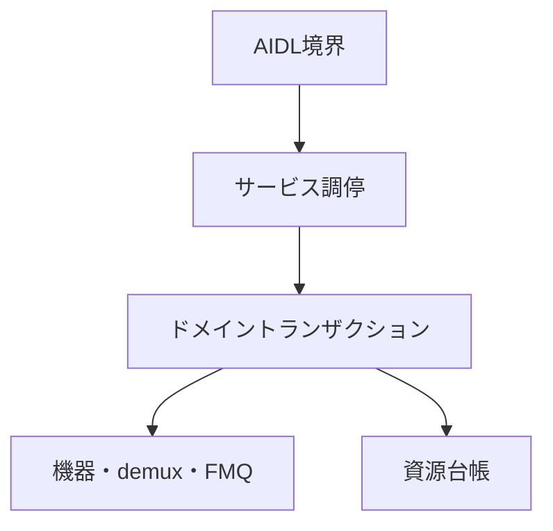
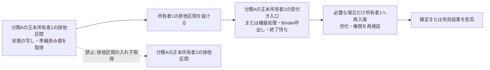

# Tuner HAL2 実装構造設計

## 本書の責務

本書は、`tuner_hal2`における論理責務の分割、依存方向、AIDL境界とドメイン処理の接続、実装owner/anchorとの対応を定義する。

公開AIDLの状態、戻り値、能力値、資源寿命、確定点、巻き戻し、後片付け、ワーカー、キュー、section/PES/TS処理は`../tuner_hal/DESIGN_JA.md`を正とする。PSI/SI表固有の意味解釈は`../arib_si_engine_rs/DESIGN_JA.md`を正とする。本書はこれらの契約を再定義せず、`tuner_hal2`の論理責務へ対応付ける。

物理ファイル名、module名、type名、関数名はAOSP公開契約またはARIB規範ではない。ただし、`../tuner_hal/DESIGN_JA.md`の論理契約を実装へ一意に接続するため、実装owner/anchorと許可entry pointは、本書の`共通transaction / use-caseの規範実装アンカー`で追跡アンカーとして固定する。責務を変えないrename、split、mergeだけでは公開設計変更にならないが、同一変更でアンカーを更新し、移動前後に複数ownerを残してはならない。論理契約の状態、phase、確定点、rollback / cleanup、failure semanticsは本書へ再掲せず`../tuner_hal/DESIGN_JA.md`を参照する。

## 責務の一方向参照

| 正本 | 所有する内容 | 他文書での扱い |
|---|---|---|
| `tuner_hal/DESIGN_JA.md` | AOSP公開契約、VTSと能力公開、TS伝送構文、Table ID別section長、公開状態、寿命、失敗時遷移、共通部品の論理契約 | `tuner_hal2`は実装責務へ接続するだけとし、同じ状態表を持たない |
| `arib_si_engine_rs/DESIGN_JA.md` | PSI/SI表固有の意味解析と意味オブジェクト | Tuner HAL公開状態または伝送長を定義しない |
| `tuner_hal2/DESIGN_JA.md` | 実装内の論理責務、依存方向、実装owner/anchor、許可entry point、禁止bypass | 公開契約の値・状態・phase・確定点・rollback/cleanup・failure semanticsを独自定義しない |
| `tuner_hal2/CODE_CONVENTION.md` | 実装規約、禁止構造、静的検査観点 | 状態遷移または戻り値を定義しない |

依存はAIDL境界からドメイン処理へ向かう。下位層がAIDL objectまたはBinder statusを保持してはならない。

## 論理コンポーネント

| 論理責務 | 入力 | 所有するもの | 所有しないもの |
|---|---|---|---|
| AIDL境界 | AIDL引数、callback、object handle | AIDL値の外形検証、typed requestへの変換、Binder statusへの変換 | ドメイン状態、backend、rollback方針 |
| サービス調停 | typed request、root/object識別子 | object所有関係、世代の再検証、操作の振り分け、単一lock snapshot | packet解析、driver固有I/O |
| ドメイントランザクション | 検証済みrequest、予約済み資源 | `../tuner_hal/DESIGN_JA.md`の同名transaction契約を実装ownerへ接続するtyped request/entry mapping | Binder表現、AIDL callback実体、確定点・補償・rollback・quarantine semanticsの独自定義 |
| 機器適合 | frontend/LNB要求 | device probe、driver固有設定、実状態の確認 | 公開能力の捏造、上位状態の直接変更 |
| demux処理 | 入力元とTS packet | demux / packet ingress componentから`PacketPipeline` / `StreamBoundaryTxn` / `FilterProducerDrainGate`のtyped entryへの実装mapping | 入力元generation、continuity、section/PES assembler、Filter delivery generationのmutation ownership、PSI/SI意味解析、公開object寿命 |
| FMQ・callback配送 | 確定済みpayload/event | FMQ / EventFlag / callback delivery componentからqueue・callbackのcanonical owner / typed entryへの実装mapping | queue/generation state、callback delivery outcomeのmutation ownership、backend状態の巻き戻し、worker制御失敗分類 |
| 資源台帳 | 予約・確定・解放要求 | object数、FMQ、PES、AV、DVR、descrambler、workerの使用権 | 公開能力値の独自算出 |
| 後片付け管理 | 閉鎖、所有者消滅、失敗した解放 | `../tuner_hal/DESIGN_JA.md`のcleanup契約を実装ownerへ接続するtyped cleanup entry mapping | 通常操作への復帰判断、未完手順・retry authority・quarantine semanticsの独自定義 |

## 公開メソッドの接続規則

静的inventory／capability参照メソッドはservice_runtimeのcapability/query ownerからAIDL応答変換へ接続し、動的な`IFrontend.getStatus()`／`getFrontendStatusReadiness()`はfrontend status query ownerからAIDL応答変換へ接続する。`CapabilitySnapshot`と`FrontendStatusSnapshot`の値、更新・無効化条件、同期/非同期read条件、公開statusは`../tuner_hal/DESIGN_JA.md`の該当契約を正とし、本書では再定義しない。

更新系メソッドは、AIDL境界からservice_runtimeのobject-method / domain use-case ownerへtyped requestを渡し、そこから資源台帳、domain transaction、backend adapterの各ownerへ接続する。AIDL境界はBinder表現との変換だけを担当し、service_runtime / domain ownerを迂回してbackendまたはregistryを直接変更しない。

lifecycle/owner/generation検証、引数検証との優先順位、再検証、execution authority、資源予約、外部副作用、phase order、commit point、pre-commit rollback、post-commit cleanup、失敗時statusは`../tuner_hal/DESIGN_JA.md`のobject method契約・各API状態表・同名transaction契約を正とし、本書では再定義しない。

### 契約正本と実装入口の対応

公開transactionの状態、phase、確定点、rollback / cleanup、failure semanticsは`../tuner_hal/DESIGN_JA.md`の同名論理契約を正とする。本節が規範として所有するのは、論理契約名から`tuner_hal2`の実装ownerへの対応と、ownerを迂回して第二の実装ownerを作ることの禁止だけである。

| 契約 | 実装所有者 | 禁止入口 |
|---|---|---|
| object method | サービス調停のobject method use-case | AIDL methodからbackend、registry、低水準dispatchを直接呼ばない |
| `RootOpenTxn` | サービス調停のルートオープン手順所有者 | AIDL層で実行時資源割当、オブジェクト表、巻戻し補助処理を直接扱わない |
| `ChildOpenTxn` | サービス調停の子オープン手順所有者 | AIDL補助処理で台帳IDを再解釈せず、`Filter` / `DVR` / `TimeFilter`等が別の子オープン所有者を持たない |
| public close / owner loss / Drop | `ObjectCloseTxn` | AIDL、Drop、Reaper、個別objectが別のclose ownerを持たない |
| descrambler key | `DescramblerKeyTxn` | callerがkey台帳を直接変更しない |
| descrambler PID | `DescramblerPidTxn` | `addPid()` / `removePid()` callerが別のPID mutation ownerを持たない |
| descrambler session cleanup | `DescramblerSessionCleanupTxn` | close/invalidate callerがPID、key、pool台帳を直接変更しない |
| Filter source relation | `SourceBoundaryTxn` | filter wrapperまたはAPI別use-caseが接続graphを直接変更しない |
| Demux frontend source relation | `DemuxFrontendSourceTxn` | `IDemux.setFrontendDataSource()` callerがrelation ownerを迂回しない |
| stream boundary | `StreamBoundaryTxn` | relation、queue、A/V sync、PCR、callback、descramblerの各ownerを迂回しない |
| `PacketPipeline` | `PacketPipeline` | 通常のパケット入力・解析・フィルタ振分けを`StreamBoundaryTxn`へ吸収せず、別の正規パケット処理所有者を設けない |
| `FrontendTuneScanTxn` | フロントエンド選局・走査の手順所有者 | ワーカー、下位実装接続層、コールバック層がフロントエンド所有者を迂回しない |
| Record DVR / Filter relation | `RecordDvrFilterRelationTxn` | DVR側とFilter側が別のrelation ownerを持たない |
| Frontend / LNB assignment relation | `FrontendLnbRelationTxn` | frontend object method use-caseまたはLNB registry ownerがrelation/leaseを別commitしない |
| LNB persistent control | `LnbControlTxn` | persistent control APIごとに別のcontrol ownerを持たない |
| callback registration | `CallbackRegistrationUseCase`。`RuntimeCallbackRegistry`とBinder callback artifactの保管主体は別責務 | AIDL façadeまたはdomain別use-caseが別のregistration ownerを持たない |
| post-commit callback failure | `PostCommitCallbackFailureTxn` | API別に同型handlerを設けない |
| Filter / DVR flush cleanup orchestration | `QueueCleanupTxn` | API別に別のflush cleanup orchestratorを設けない |
| DVR playback consume | `PlaybackConsumeTxn` | playback workerが別のconsume ownerを持たない |
| A/V sync relation | `AvSyncRegistry` | API、filter wrapper、`StreamBoundaryTxn`がregistryを迂回しない |
| PCR clock anchor | `PcrClockAnchorStore` | APIまたは`StreamBoundaryTxn`がstoreを迂回しない |
| worker lifecycle mechanism | `WorkerRuntime`が唯一のcanonical A state owner。`WorkerHandle`は`WorkerRuntime`に従属するopaqueなtyped handle / authority表現 | `WorkerHandle`を第二のgeneric lifecycle ownerまたは第二のstate正本として扱わず、別のgeneric worker lifecycle ownerも重ねない |
| worker failure classification | `WorkerFailureClassifier` | 各ownerがclassifierを迂回して別のfailure classification ownerを設けない |
| `FrontendWorkerTerminationTxn` | フロントエンド固有の終了手順所有者。汎用寿命管理のcanonical state ownerは`WorkerRuntime`であり、`WorkerHandle`は従属物理要素 | フロントエンド固有の終了手順へ汎用ワーカー寿命管理の所有責務を吸収せず、ワーカー・AIDL層が別の終了手順所有者を持たない |

#### 共通transaction / use-caseの規範実装アンカー

次表は`../tuner_hal/DESIGN_JA.md`の同名論理契約を`tuner_hal2`へ接続する物理module/file/type、許可entry point、禁止bypassだけを固定する。状態、phase、確定点、rollback / cleanup、failure semantics、cardinality、token/generation state machineは同名論理契約を参照し、本表では再定義しない。

| 契約 | 実装owner / anchor | 許可entry point | 禁止する迂回 |
|---|---|---|---|
| object method | `service_runtime/src/object_method_txn.rs`。補助moduleは`method_validation.rs` / `method_dispatch.rs` | `aidl_service/src/object_runtime/mod.rs`の`execute_*_use_case*`、`plan_unavailable_object_method_use_case()`、`execute_object_query_use_case()`、domain側`TunerServiceRuntime::*_for_object` | 個別AIDL methodからの先行runtime query、`AidlMethodAdapter::plan()`直接実行、backend/registry直接変更 |
| `RootOpenTxn` | 正規手順所有者・入口は`RootOpenTxn`名を持つ。既存の補助アンカーは`service_runtime/src/root_object_ops.rs`、`service_runtime/src/open_rollback.rs` | `aidl_service/src/tuner_service.rs`のルートオブジェクト処理入口 | AIDL層で実行時資源割当、オブジェクト表、巻戻し補助処理を直接扱う。別名のルートオープン手順を第二の正規所有者として残さない |
| `ChildOpenTxn` | 正規手順所有者・入口は`ChildOpenTxn`名を持つ。既存の補助アンカーは`service_runtime/src/boot/demux_filter_dvr_txn.rs::DemuxFilterDvrTxn<'a>`、`service_runtime/src/demux_filter_dvr_ops.rs`であり、`DemuxFilterDvrTxn<'a>`は非公開補助処理または呼出し単位の文脈型としてのみ扱う | `aidl_service/src/child_object_open.rs`の`open_filter_child_for_owner_object_with_request_builder()` / `open_dvr_child_for_owner_object_with_request_builder()`を含む、`Filter` / `DVR` / `TimeFilter`等の子オブジェクト生成用正規入口 | API別の資源割当・後始末所有者、`RuntimeObjectEntry.ledger_id`の再解釈、`Filter` / `DVR`だけの別の正規子オープン所有者 |
| `ObjectCloseTxn` | `service_runtime/src/object_close_txn.rs::ObjectCloseTxn` | `aidl_service/src/object_runtime/mod.rs`のpublic close / owner-loss / Drop接続とservice_runtimeのshutdown/reaper接続 | `DropLeakTxn`等の別close owner、AIDL/Drop/worker/Reaperの直接cleanup |
| `DescramblerPidTxn` | `service_runtime/src/boot/descrambler_txn.rs`、`service_runtime/src/descrambler_session.rs`、`service_runtime/src/descrambler_key_table.rs`を共用してよいが、正規手順所有者・入口は`DescramblerPidTxn`名で独立させる | `service_runtime/src/descrambler_ops.rs`のPID変更処理入口 | AIDL層またはデスクランブラ実装からPID台帳を直接変更、鍵変更・セッション後始末と同じ別名所有者だけを入口にする |
| `DescramblerKeyTxn` | `service_runtime/src/boot/descrambler_txn.rs`、`service_runtime/src/descrambler_session.rs`、`service_runtime/src/descrambler_key_table.rs`を共用してよいが、正規手順所有者・入口は`DescramblerKeyTxn`名で独立させる | `service_runtime/src/descrambler_ops.rs`の鍵変更処理入口 | AIDL層またはデスクランブラ実装から鍵台帳を直接変更、PID変更・セッション後始末と同じ別名所有者だけを入口にする |
| `DescramblerSessionCleanupTxn` | `service_runtime/src/boot/descrambler_txn.rs`、`service_runtime/src/descrambler_session.rs`、`service_runtime/src/descrambler_key_table.rs`を共用してよいが、正規手順所有者・入口は`DescramblerSessionCleanupTxn`名で独立させる | デスクランブラのクローズ接続、Demux無効化接続 | AIDL層またはデスクランブラ実装からPID・鍵・プール台帳を直接変更、通常のPID・鍵変更所有者へ後始末責務を統合する |
| `SourceBoundaryTxn` | `demux/src/runtime/source_boundary.rs` | `service_runtime/src/demux_filter_dvr_ops.rs`のFilter source use-case、source Filter close/unlink接続 | filter wrapper/cleanup callerによるgraph直接変更、demux/frontend ownerとの統合 |
| `DemuxFrontendSourceTxn` | `service_runtime/src/demux_filter_dvr_ops.rs::DemuxFrontendSourceTxn` | `IDemux.setFrontendDataSource()` object use-case、Frontend/Demux close接続 | cleanup callerによるrelation直接編集、`SourceBoundaryTxn`への統合 |
| `StreamBoundaryTxn` | `demux/src/runtime/generation_boundary.rs::StreamBoundaryTxn` | `service_runtime/src/packet_ops.rs`の型付き境界処理入口 | `GenerationBoundaryTxn`を正規状態所有型の恒久別名として残すこと、関係・キュー・A/V同期・PCR・コールバック・デスクランブラ各所有者の直接変更 |
| `PacketPipeline` | `demux/src/parser/packet_pipeline.rs::PacketPipeline` | `service_runtime/src/packet_ops.rs`の型付きパケット入力処理入口 | `StreamBoundaryTxn`への通常パケット処理吸収、AIDL・下位実装・Filterコールバックからの`PacketPipeline`直接変更、第二の正規パケット処理所有者または正規手順所有者の追加 |
| `RecordDvrFilterRelationTxn` | `service_runtime/src/demux_filter_dvr_ops.rs::RecordDvrFilterRelationTxn` | Record DVR `attachFilter()` / `detachFilter()`、Filter/DVR close、demux cleanup接続 | object側shadow relationの直接変更 |
| `FrontendLnbRelationTxn` | `service_runtime/src/frontend_ops.rs::FrontendLnbRelationTxn` | `IFrontend.setLnb()` object use-case、Frontend close時の`ObjectCloseTxn` typed assignment release | frontend use-case/LNB registryによるrelation・lease別commit、`LnbControlTxn`へのassignment ownership統合 |
| `LnbControlTxn` | `service_runtime/src/lnb_control_txn.rs::LnbControlTxn` | `ILnb.setVoltage()` / `setTone()` / `setSatellitePosition()` object use-case | API別control owner、`sendDiseqcMessage()`の同ownerへの統合 |
| `CallbackRegistrationUseCase` | 正規B手順所有者は`service_runtime/src/callback_registry.rs::CallbackRegistrationUseCase`。`RuntimeCallbackRegistry`は実行時登録簿の状態所有者、`aidl_service/src/callback_store.rs`はBinderコールバック生成物の保管主体であり、いずれも`CallbackRegistrationUseCase`へ統合または同名化しない | `IFrontend.setCallback()` / `ILnb.setCallback()`等のAIDLファサードからサービス実行時のコールバック登録入口 | AIDLファサード・ドメイン別処理による別の登録所有者、`RuntimeCallbackRegistry`またはコールバック生成物保管主体をBの共有進行状態として所有すること、コールバック生成物の別保管先 |
| `PostCommitCallbackFailureTxn` | `service_runtime/src/post_commit_callback_failure_txn.rs::PostCommitCallbackFailureTxn` | domain commit後のcallback delivery failureを受けたcompletion use-caseからのtyped入口 | API別handler、classifierまたはdomain ownerの置換 |
| `FilterProducerDrainGate` | `demux/src/runtime/queue_runtime.rs` | Filter/SharedFilter data path、`QueueCleanupTxn`からのtyped入口 | 公開API/worker/`QueueCleanupTxn`からのgate内部直接変更、DVR ownerとの統合 |
| `QueueEpochProtocol` | `demux/src/runtime/queue_runtime.rs` | DVR data path、`QueueCleanupTxn`からのtyped入口 | 公開API/worker/`QueueCleanupTxn`からのprotocol内部直接変更、`PlaybackQueueBacking` ownerとの統合 |
| `QueueCleanupTxn` | `service_runtime/src/queue_cleanup_txn.rs::QueueCleanupTxn` | Filter/DVR `flush()` object use-case | 下位protocol内部への直接アクセス、API別orchestrator |
| `PlaybackConsumeTxn` | `service_runtime/src/playback_consume_txn.rs` | playback workerのtyped consume入口 | worker/FMQ/packet helperによる別consume owner |
| `FrontendTuneScanTxn` | 正規手順所有者・入口は`FrontendTuneScanTxn`名を持つ。既存アンカーは`service_runtime/src/boot/frontend_txn.rs::FrontendTxn<'a>`、`service_runtime/src/frontend_ops.rs`であり、`FrontendTxn<'a>`は非公開補助処理または呼出し単位の文脈型としてのみ扱う | `FrontendTuneScanTxn`の有限正規入口集合 `begin_tune` / `begin_scan` / `stop_tune` / `stop_scan` / `accept_operation_event` / `accept_worker_terminal`。AIDL境界は`begin_*` / `stop_*`だけ、ワーカー・下位機器処理の完了通知橋渡しは`accept_*`だけを呼ぶ | ワーカー・機器層・コールバック層によるフロントエンド所有者の迂回、Demux所有者の吸収、`FrontendTxn<'a>`の第二正規所有者化、有限正規入口集合外での選局・走査進行の再実装 |
| `AvSyncRegistry` | `demux/src/runtime/av_sync_registry.rs::AvSyncRegistry` | filter configure/unregister/close、demux closeからのtyped relation入口 | API/filter wrapper/`StreamBoundaryTxn`からのregistry直接変更、PCR ownerとの統合 |
| `PcrClockAnchorStore` | `demux/src/runtime/pcr_clock_anchor.rs::PcrClockAnchorStore` | PCR観測、stream boundary側のtyped invalidation入口 | API/`StreamBoundaryTxn`からのstore内部直接変更、A/V sync ownerとの統合 |
| `WorkerRuntime` | `service_runtime/src/worker_runtime.rs::{WorkerRuntime, WorkerHandle}`。`WorkerRuntime`がgeneric worker lifecycleの唯一のcanonical A state ownerであり、`WorkerHandle`は同ownerに従属するopaqueなtyped handle / authority表現 | 各domain worker ownerの`WorkerRuntime`正規入口。必要な場合に同ownerが発行・管理する`WorkerHandle`を使用する | `WorkerHandle`による独立したgeneration / retry / reaper state所有、別generic lifecycle owner、domain start/stop ownerの吸収 |
| `WorkerFailureClassifier` | `service_runtime/src/worker_failure_classifier.rs` | worker owner / cleanup manager / callback・backend failure ownerからのtyped入口 | owner側の別classifier、classifierによるdomain ownerの置換 |
| `FrontendWorkerTerminationTxn` | 正規手順所有者・入口は`FrontendWorkerTerminationTxn`名を持つ。`service_runtime/src/frontend_worker_txn.rs`はフロントエンド固有終了の補助処理、`device/src/runtime/frontend_worker.rs::FrontendWorkerRegistry`は既存の状態所有者として扱う。汎用の停止・起床・終了待ち・回収処理・再試行機構のcanonical state ownerは`WorkerRuntime`であり、`WorkerHandle`は従属する物理要素 | `service_runtime/src/frontend_ops.rs`、`service_runtime/src/boot/frontend_txn.rs`、`ObjectCloseTxn`からの型付き後始末接続 | ワーカー・AIDL層による所有者登録解除、リース、終了待ち・回収処理、失敗分類器の直接代替、汎用寿命管理の所有責務の吸収、別のフロントエンド終了手順所有者 |

##### 共通化対象のRust物理化追加要件

次表は、`../tuner_hal/DESIGN_JA.md`の論理契約と本書の実装owner / anchorを変更せず、A/B/C判定後に必要となるRust上の同期、stale操作・one-shot識別、正の`Send` / `Sync`要件、Bのcall-local進行状態だけを固定する。公開状態、phase、commit point、rollback / cleanup、failure semanticsは`../tuner_hal/DESIGN_JA.md`を正とする。one-shot authorityの一般実装規則とA/Bのpersistent storage境界は`CODE_CONVENTION.md`を正とする。

`trait要求`の`—`は非`Send` / 非`Sync`を要求する意味ではなく、本契約から正のauto trait要件を追加しないことを表す。Bの`通常制御`は通常の関数制御、typed snapshot / prepared value / one-shot authority、immutableなplan / result enumで手順を表現し、B自身のmutable進行状態を呼出し越しに保持しないことを表す。

| # | 対象 | 分類 | 同期 | stale操作・one-shot識別 | trait要求 | B進行状態 |
|---:|---|:---:|---|---|---|---|
| 1 | `ObjectCloseTxn` | A | public close / owner loss / Drop / shutdown / reaperによる同一object変更をowner内で直列化する | lifecycle generation + one-shot `CloseCleanupAuthority` | `Send + Sync` | — |
| 2 | `SourceBoundaryTxn` | A | set / unlink / closeによるrelation変更をowner内で直列化する | relation generation + prepared relation mutation | `Send + Sync` | — |
| 3 | `DemuxFrontendSourceTxn` | B | B共有lockを持たず、relation ownerと`StreamBoundaryTxn`の正規同期入口を使う | 各Aが発行するprepared mutationを消費し、独自generationを発行しない | — | 通常制御 |
| 4 | `StreamBoundaryTxn` | A | boundary prepare / commitとsteady-state ownerへのdispatchをowner内で整合させる | `stream_boundary_generation` + one-shot `PreparedStreamBoundary` | `Send + Sync` | — |
| 5 | `CallbackRegistrationUseCase` | B | B共有lockを持たず、callback store / runtime registry / domain ownerのprepared入口を使う | prepared artifact / registry mutation / domain mutationを一回だけ消費し、独自generationを発行しない | — | 通常制御 |
| 6 | `FrontendLnbRelationTxn` | A | `setLnb()` / closeによるassignment mutationをowner内で直列化する | object generation + prepared assignment lease mutation + transaction authority | `Send + Sync` | — |
| 7 | `LnbControlTxn` | A | operation lockをowner自身が持つ | LNB state generation + 一回だけ確定するcandidate | `Send + Sync` | — |
| 8 | `DescramblerPidTxn` | B | B共有lockを持たず、pool / PID ledger / backend ownerの正規入口を使う | prepared PID claim / compensation authorityを一回だけ消費し、独自generationを発行しない | — | 通常制御 |
| 9 | `DescramblerKeyTxn` | B | B共有lockを持たず、key table / session / backend ownerの正規入口を使う | prepared key ref / session mutationを一回だけ消費し、独自generationを発行しない | — | 通常制御 |
| 10 | `DescramblerSessionCleanupTxn` | B | 同一session cleanupの直列化はsession / close / invalidation側のpersistent ownerへ置き、B共有lockを追加しない | trigger generation / cleanup authorityを入力として消費し、retryable pendingはpersistent ownerへ返す | — | 通常制御 |
| 11 | `RecordDvrFilterRelationTxn` | A | attach / detach / close / demux cleanupによるrelation変更をowner内で直列化する | object generation + prepared relation / route mutation | `Send + Sync` | — |
| 12 | `WorkerRuntime` | A | handle slot / stop / wake / join / reaper stateをowner内で同期し、外側に第二のlifecycle lockを作らない | owner generation + signal generation + one-shot stop / wake authority + reaper handoff authority | `Send + Sync` | — |
| 13 | `WorkerFailureClassifier` | C | なし | なし | — | — |
| 14 | `PostCommitCallbackFailureTxn` | B | B共有lockを持たず、診断・cleanupのpersistent ownerへtyped結果を渡す | callback delivery result / owner generationを入力にし、独自generationを発行しない | — | 通常制御 |
| 15 | `FilterProducerDrainGate` | A | producerとdrain / closeの競合をgate自身の同期境界で解決する | delivery / parser generation + one-shot `FilterProducerPermit` | `Send + Sync` | — |
| 16 | `QueueEpochProtocol` | A | queue I/Oとdrain / flush / closeの競合をprotocol自身の同期境界で解決する | queue epoch + one-shot read / write transaction authority | `Send + Sync` | — |
| 17 | `QueueCleanupTxn` | B | B共有lockを持たず、`FilterProducerDrainGate` / `QueueEpochProtocol`のtyped入口を順に使用する | 各protocolのauthorityを消費し、独自epochを発行しない | — | 通常制御 |
| 18 | `PlaybackConsumeTxn` | A | playback workerを単一mutation ownerとし、同じconsume stateを複数threadから直接変更しない。共有のためだけの外側mutexを標準形にしない | `QueueEpochProtocol`が発行するtyped epoch / consume authorityを使用し、第二のqueue generationを持たない | `Send` | — |
| 19 | `AvSyncRegistry` | A | configure / unregister / close / demux cleanupをowner内で直列化する | object / relation generationをtyped keyに含め、同義のgeneration namespaceを追加しない | `Send + Sync` | — |
| 20 | `PcrClockAnchorStore` | A | packet観測とboundary invalidationをowner内で整合させ、複数fieldの不変条件に必要な最小同期を持つ | anchorをstream boundary generationへ従属させ、stale anchorを確定しない | `Send + Sync` | — |
| 21 | `ObjectMethodTxn` | B | B共有lockを持たず、object / relation / resource ownerのsnapshotとtyped入口を使う | one-shot execution authorityをconsume-by-valueで消費する | — | 通常制御 |
| 22 | `RootOpenTxn` | B | B共有lockを持たず、resource / runtime registry / Binder artifact ownerのprepared入口を使う | prepared reservation / registrationを一回だけcommitまたはabortする | — | 通常制御 |
| 23 | `ChildOpenTxn` | B | B共有lockを持たず、parent / resource / runtime / Binder ownerのprepared入口を使う | parent generation + prepared reservation / registrationを一回だけ消費する | — | 通常制御 |
| 24 | `FrontendTuneScanTxn` | B | B共有進行状態を持たず、フロントエンド実行時状態、`WorkerRuntime`、各`StreamBoundaryTxn`の正規同期入口を調停する | 要求指紋 / フロントエンド操作世代 / 準備済み境界を既存所有者から取得し、第二の走査世代を発行しない | — | 有限正規入口集合から毎回呼出し内で再入場し、入口終了時にB自身の可変進行状態を残さない |
| 25 | `FrontendWorkerTerminationTxn` | B | B共有lockを持たず、`WorkerRuntime`とfrontend固有ownerのtyped入口を使う | `WorkerRuntime`のowner generation / terminal resultを使用し、独自worker generationを発行しない | — | 通常制御 |
| 26 | `PacketPipeline` | A | demuxごとの単一packet mutation ownerを基本とし、boundaryとの競合はtyped generation fence / commandで同期する。packetごとの外側mutexを標準形にしない | typed `TsInputOrigin`のgenerationとstream boundary generationを使用し、第二の同義generation namespaceを持たない | `Send` | — |
| 27 | `FilterWatermarkClassifier` | C | なし | なし | — | — |
| 28 | `DvrWatermarkClassifier` | C | なし | なし | — | — |

A=13、B=12、C=3であり、`WorkerHandle`を第二のAまたは第二の論理契約として数えない。

##### 所有者間排他制御の取得規則（有向非巡回図）

共通化対象の分類Aの正本所有者間では、**別の正本所有者の排他制御を保持したまま、さらに別の正本所有者の排他制御へ入ってはならない**。複数所有者をまたぐ分類Bまたは上位の調停処理は、元の所有者の排他区間内で型付き状態の写し・準備済み値・一回実行権限を取得して排他区間を抜け、その後に別所有者の型付き入口または外部処理を実行し、必要な場合だけ元の所有者へ再入場して世代・権限を再検証して確定する。これにより、所有者をまたぐ排他制御の取得順序表そのものを不要とし、所有者追加時に暗黙の排他制御階層を増やさない。

次図の矢印は処理順序を示し、所有者1の排他区間を抜けてから次の所有者へ進むことを必須とする。所有者1の排他区間から所有者2の排他区間へ直接入る経路は存在せず、その入れ子取得は禁止する。

- `TunerServiceRuntime`等の上位登録簿・オブジェクト表の排他制御も、分類Aの正本所有者を呼ぶ前に解放し、上位の排他制御と分類A所有者の排他制御を入れ子に保持しない。
- `StreamBoundaryTxn`から定常時状態所有者へ初期化・無効化を振り分ける場合も、`StreamBoundaryTxn`自身の内部排他制御を保持したまま対象所有者へ入らない。準備済み世代・権限を境界として渡し、各所有者の結果を再集約する。
- `DemuxFrontendSourceTxn`、`CallbackRegistrationUseCase`、`Descrambler*Txn`、`QueueCleanupTxn`、`RootOpenTxn`、`ChildOpenTxn`、`FrontendTuneScanTxn`、`FrontendWorkerTerminationTxn`等の分類Bは、所有者をまたぐ排他制御を保持せず、各分類A所有者の型付き準備・確定・取消し入口を順に使用する。
- 機器入出力、Binder呼出し、コールバック配送、待機処理、FMQ待機、ワーカー終了待ちの間は、分類Aの正本所有者または上位実行時状態の排他制御を保持しない。
- 所有者をまたぐ不可分性をこの規則だけで保てない場合は、入れ子取得の例外を追加せず、必要な状態を一つの分類A正本所有者へ集約するか、一つの分類A所有者が管理する準備済み値・一回限り権限の手順へ責務境界を再設計する。

##### `FrontendTuneScanTxn` の有限正規入口集合

`FrontendTuneScanTxn`は呼出しを越えて存続する手順実体を保持せず、次の有限入口集合だけを正規の再入場面とする。各入口は呼出しごとの分類B実行として完結し、非同期操作の継続状態、世代、ワーカー寿命、コールバック配送予約は対応する正本所有者へ残す。

| 入口 | 呼出元 | 入力 | 分類Bが行うこと | 永続化先 |
|---|---|---|---|---|
| `begin_tune` | `IFrontend.tune()`のオブジェクトメソッド境界 | 検証済み選局要求、フロントエンド世代 | 要求指紋・世代候補を準備し、`WorkerRuntime`・下位機器処理・`StreamBoundaryTxn`の型付き準備結果を集約する | フロントエンド操作所有者、`WorkerRuntime`、各`StreamBoundaryTxn` |
| `begin_scan` | `IFrontend.scan()`のオブジェクトメソッド境界 | 検証済み走査要求、フロントエンド世代 | 走査要求指紋を確定し、ワーカー・下位機器処理・境界処理を準備し、初期コールバック配送予約へ世代遮断条件を設定する | フロントエンド操作所有者、`WorkerRuntime`、コールバック所有者 |
| `stop_tune` | `IFrontend.stopTune()`のオブジェクトメソッド境界 | 現在のフロントエンド世代 | 対象選局世代を遮断し、ワーカー・下位機器処理の停止と必要な境界処理結果を集約する | フロントエンド操作所有者、`WorkerRuntime`、各`StreamBoundaryTxn` |
| `stop_scan` | `IFrontend.stopScan()`のオブジェクトメソッド境界 | 現在のフロントエンド世代 | 対象走査世代を遮断し、ワーカー・下位機器処理の停止と必要な境界処理結果を集約する | フロントエンド操作所有者、`WorkerRuntime`、各`StreamBoundaryTxn` |
| `accept_operation_event` | ワーカー・下位機器処理の完了通知橋渡し | 操作世代 + 型付きフロントエンド事象・結果 | 世代を再検証し、失効事象を拒否し、現世代に対するコールバック配送予約とドメイン完了処理を調停する | フロントエンド操作所有者、コールバック所有者 |
| `accept_worker_terminal` | `WorkerRuntime`の完了通知橋渡し | ワーカー所有者世代 + 型付き終了結果 | 操作世代との対応を再検証し、フロントエンド固有の終了結果を`FrontendWorkerTerminationTxn`と失敗分類へ接続する | フロントエンド操作所有者、`WorkerRuntime`、後片付け所有者 |

- `begin_*` / `stop_*`はAIDL境界だけから、`accept_*`はワーカー・下位機器処理の完了通知橋渡しだけから呼ぶ。コールバック配送境界自身は`FrontendTuneScanTxn`へ再入場せず、予約済みの型付きコールバックを配送し、配送失敗は`PostCommitCallbackFailureTxn`へ接続する。
- 各入口は開始時に正本所有者から状態の写し・世代・一回実行権限を取得し、外部処理後に世代を再検証する。旧世代の`accept_operation_event` / `accept_worker_terminal`は状態変更またはコールバック予約を行わず、失効結果として破棄・診断する。
- `FrontendTuneScanTxn`用の`Arc<Mutex<...>>`、共有可変段階状態、独自再試行キュー、独自走査世代を設けない。複数呼出しにまたがる情報が必要なら上表の永続化先へ置く。
- 上記6入口を複数のRust関数へ分割してよいが、正規名称標識から同じ入口役割へ追跡可能にし、実装都合だけで第7の入口役割を追加しない。新たな外部非同期入力種別が必要になった場合は、この有限集合と正本所有者境界を設計更新してから入口を追加する。

##### 実装依存とcomposition接続規則

論理契約の状態、phase、commit / rollback、failure semanticsは`../tuner_hal/DESIGN_JA.md`の同名契約を正とし、本節は`tuner_hal2`内でowner同士をどのtyped入口で接続するかだけを定義する。

- Filter source use-caseは`SourceBoundaryTxn`、Demux frontend source use-caseは`DemuxFrontendSourceTxn`へ接続し、stream boundaryが必要な場合は`service_runtime/src/packet_ops.rs`の`StreamBoundaryTxn` typed入口へ接続する。
- callback AIDL façadeは`aidl_service/src/callback_store.rs`とservice_runtime側`CallbackRegistrationUseCase`を接続し、runtime/domain側へ直接書き込まない。`RuntimeCallbackRegistry`とcallback artifactの保管主体は別責務のまま維持する。
- descramblerのPID変更は`DescramblerPidTxn`、鍵変更は`DescramblerKeyTxn`へ接続する。descrambler closeは`ObjectCloseTxn`から、demux invalidationはdemux invalidation ownerから`DescramblerSessionCleanupTxn`のtyped入口へ接続し、3手順を一つの別名所有者へ統合しない。
- Record DVR/Filter lifecycle use-caseは`RecordDvrFilterRelationTxn`のtyped入口へ接続する。
- Frontend LNB assignment use-caseは`FrontendLnbRelationTxn`へ接続し、LNB resource ownerのlease台帳内部を直接変更しない。
- Filter/DVR `flush()` use-caseは`QueueCleanupTxn`へ接続し、同ownerからFilter側`FilterProducerDrainGate`またはDVR側`QueueEpochProtocol`のtyped入口を使用する。
- filter lifecycle use-caseは`AvSyncRegistry`、stream boundary側は`PcrClockAnchorStore`のtyped invalidation入口へ接続し、各store内部へ直接アクセスしない。
- post-commit callback failureを受けたdomain completion use-caseは、`WorkerFailureClassifier`で分類済みのtyped callback failureだけを`PostCommitCallbackFailureTxn`へ渡す。callbackを伴わない正常completionまたは別種failureは同Txnへ接続しない。
- domain worker ownerは`WorkerRuntime`のtyped入口と`WorkerFailureClassifier`を使用し、必要な場合に`WorkerRuntime`が発行・管理する従属`WorkerHandle`を使用する。`WorkerHandle`をgeneric lifecycle ownerとして扱わず、generic runtime/classifierを再実装しない。フロントエンド固有の終了手順は`FrontendWorkerTerminationTxn`へ接続し、同手順が汎用寿命管理機構を所有しない。
- top-level cleanup / rollback use-caseは`CleanupExecutionReport` / `SharedCleanupDiagnostics`と共通failure-composition helperへ接続し、API別・worker別helperを設けない。

### ルートobject

`openFrontendById()`、`openDemux()`、`openDemuxById()`、`openDescrambler()`、`openLnbById()`、`openLnbByName()`は`RootOpenTxn`の正規入口へ接続する。公開ID検証、object/out IDの公開確定点、失敗時rollback、`openDescrambler()`の未結合生成は`../tuner_hal/DESIGN_JA.md`の各公開APIの名前付き契約、「公開transactionのphase・確定点・失敗処理契約」の`root/child open`、`IDescrambler demux結合契約`を正とし、本書では再定義しない。

`getFrontendIds()`、`getFrontendInfo()`、`getLnbIds()`、`getDemuxIds()`、`getDemuxInfo()`、`getDemuxCaps()`、`getMaxNumberOfFrontends()`、`isLnaSupported()`はservice_runtimeのcapability/query ownerへ接続する。snapshot、使用上限、probe可否その他の公開query semanticsは`../tuner_hal/DESIGN_JA.md`を正とする。

### 子objectと関連付け

Filter、DVR、TimeFilterなどの子object生成は`ChildOpenTxn`の正規入口へ接続する。親demuxの検証順序、登録確定点、rollback、TimeFilter非対応時の公開結果は`../tuner_hal/DESIGN_JA.md`の各公開APIの名前付き契約と「公開transactionのphase・確定点・失敗処理契約」の`root/child open`を正とする。Descramblerのroot未結合生成と`setDemuxSource()`の一回性・原子的結合は同書`IDescrambler demux結合契約`を正とし、本書では再定義しない。

`IFilter.setDataSource()`は`SourceBoundaryTxn`、`IDemux.setFrontendDataSource()`は`DemuxFrontendSourceTxn`、Record DVR接続は`RecordDvrFilterRelationTxn`、descrambler PID登録は`DescramblerPidTxn`を通す。`IFrontend.setLnb()`は`FrontendLnbRelationTxn`を通し、同ownerからLNB resource ownerのprepared assignment lease入口へ接続する。CI CAM系は`../tuner_hal/DESIGN_JA.md`の非対応契約へ接続し、backend relationを生成しない。relationのvalidation、generation、commit/rollback semanticsは同書を正とする。

### 入力処理

TS入力originとgeneration名前空間は`../tuner_hal/DESIGN_JA.md`の`TsInputOrigin`／soft demux入力元契約を正とする。本書では、各パケットを型付き`TsInputOrigin`とともに`PacketPipeline`の正規入口へ入力し、`PacketPipeline`がパケット検証と入力元別の定常時continuityの正本を所有し、各Filter等の正規所有者へ配送接続する責務境界を定義する。section/PES assembler等の状態所有権とPSI/SI意味解析は`PacketPipeline`へ吸収しない。通常パケット処理の第二の正規状態所有者または正規手順所有者を設けない。

Filter/SharedFilterのqueue確定は`FilterProducerDrainGate`、DVR queue I/Oは`QueueEpochProtocol`、配送済みAV領域のallocation/leaseはAV resource ownerへ接続する。write authorityのgeneration、失効条件、配送済みAV資源の寿命は`../tuner_hal/DESIGN_JA.md`の同名契約・資源寿命表を正とし、本書では再定義しない。

## 実装構造索引

次表は規範実装アンカーを探すための補助索引であり、transaction正本または公開契約を置き換えない。

| 論理責務 | 主な構造位置 |
|---|---|
| AIDL境界 | `aidl_service/`、`binder_adapter/` |
| サービス調停 | `service_runtime/` |
| typed request | `domain_request/` |
| frontend/LNB backend | `device/`、`lnb/` |
| demuxとpacket処理 | `demux/` |
| descrambler | `descrambler/` |
| FMQ | `fmq/`、`fmq_shim/` |
| 資源台帳 | `resource_ledger/` |
| 共通の値型 | `common/` |
| Android公開設定 | `manifest/`、`init/`、`sepolicy/`、`config/` |

完了判定・未達理由・実装適用状況は`../タスク完了判定の実施方法.md`に従う判定側を正とし、本書へ重複記載しない。

## 構造上の禁止事項

- AIDL methodごとにclose、queue、rollback、quarantineの状態機械を複製しない。
- `../tuner_hal/DESIGN_JA.md`の共通部品適用表が所有者を指定した処理について、API別use-case、worker、helperが同じ状態変更、cleanup、失敗分類を個別再実装しない。
- `DropLeakTxn`を`ObjectCloseTxn`と並ぶcleanup authorityとして置かない。
- Demux frontend relationをFilter用`SourceBoundaryTxn`へ吸収しない。
- relation transactionと`StreamBoundaryTxn`を別々の公開commitにしない。
- 通常パケット処理について、`PacketPipeline`と並ぶ第二の正規状態所有者または正規手順所有者を設けない。
- Filter/DVR `flush()`のcleanup orchestrationと失敗集約をAPI別に複製せず、`QueueCleanupTxn`のtyped入口を使用する。
- `WorkerLifecycleProtocol`等を`WorkerRuntime`と並ぶgeneric lifecycle ownerとして置かず、`WorkerHandle`を第二のgeneric lifecycle ownerまたは第二のcanonical state ownerとして扱わない。
- worker owner/APIがstop/wake/join/EventFlag/Reaper/backend-control/callback等の同型失敗分類を個別実装せず、`WorkerFailureClassifier`のtyped結果を使用する。
- LNB Binder callback実体をLNB domain/AIDL objectに直接保持しない。
- DVR側とFilter側がRecord relationを別々にcommitしない。
- A/V sync relation / reverse indexまたはPCR anchorを複数ownerが直接変更しない。
- `tuner_hal`で定義した公開戻り値を`service_runtime`またはbackendで別の値へ読み替えない。
- AIDL objectまたはcallback実体をdemux、device、resource ledgerへ渡さない。
- 静的inventory／capability queryからcleanup、worker操作、backend I/Oを開始しない。動的frontend status queryのread model、`FrontendStatusSnapshot`の更新・無効化、bounded synchronous readへ変更できる条件は`../tuner_hal/DESIGN_JA.md`を正とし、本書ではowner/entry mapping以外を再定義しない。
- file名またはtype名をAOSP公開契約、ARIB根拠、公開状態遷移の値そのものとして扱わない。
- `共通transaction / use-caseの規範実装アンカー`以外の物理配置表を状態遷移の正本として扱わない。
- 規範実装アンカーのrename、split、merge時に旧アンカーを残したまま新アンカーを追加し、複数のtransaction正本を作らない。