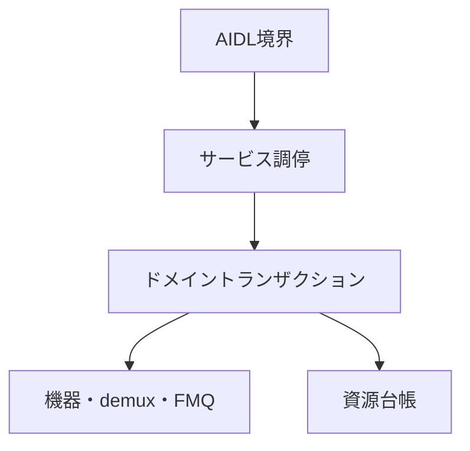

# Tuner HAL2 実装構造設計

## 本書の責務

本書は、`tuner_hal2`における論理責務の分割、依存方向、AIDL境界とドメイン処理の接続、現在の実装位置との対応を定義する。

公開AIDLの状態、戻り値、能力値、資源寿命、確定点、巻き戻し、後片付け、ワーカー、キュー、section/PES/TS処理は`../tuner_hal/DESIGN_JA.md`を正とする。PSI/SI表固有の意味解釈は`../arib_si_engine_rs/DESIGN_JA.md`を正とする。本書はこれらの契約を再定義せず、`tuner_hal2`の論理責務へ対応付ける。

物理ファイル名、module名、type名、関数名はAOSP公開契約またはARIB規範ではない。ただし、`../tuner_hal/DESIGN_JA.md`の`共通部品の定義条件`を満たすため、状態・寿命・失敗時遷移を所有する単一実装正本と許可entry pointは、本書の`共通transaction / use-caseの規範実装アンカー`で規範的な追跡アンカーとして固定する。責務を変えないrename、split、mergeだけでは公開設計変更にならないが、同一変更でアンカーを更新し、移動前後に複数正本を残してはならない。

本PRで追加・変更する契約は、`tuner_hal2`へ適用する目標設計であり、現行実装済みの事実を表すものではない。公開能力を有効にできるのは、対応する実装入口、状態遷移・異常系試験、製品設定またはVTS設定がそろった機能だけである。移行は公開API単位を最小ゲートとし、依存するAPI、台帳、worker、設定を含む適用単位の完了条件も同時に満たす。未移行APIまたは未完了の依存閉包を新設計の成功能力として広告してはならない。

## 責務の一方向参照

| 正本 | 所有する内容 | 他文書での扱い |
|---|---|---|
| `tuner_hal/DESIGN_JA.md` | AOSP公開契約、VTSと能力公開、TS伝送構文、Table ID別section長、公開状態、寿命、失敗時遷移、共通部品の論理契約 | `tuner_hal2`は実装責務へ接続するだけとし、同じ状態表を持たない |
| `arib_si_engine_rs/DESIGN_JA.md` | PSI/SI表固有の意味解析と意味オブジェクト | Tuner HAL公開状態または伝送長を定義しない |
| `tuner_hal2/DESIGN_JA.md` | 実装内の論理責務、依存方向、規範実装アンカー | 公開契約の値や状態を上書きしない |
| `tuner_hal2/CODE_CONVENTION.md` | 実装規約、禁止構造、静的検査観点 | 状態遷移または戻り値を定義しない |

### 現行適用状態: nullable Binder境界

公開契約の意味・戻り値・状態遷移は`../tuner_hal/DESIGN_JA.md`の「nullable Binder 境界」を正とし、本節は現在の実装適用状態だけを追跡する。

Android 14 official AIDLから生成される現行Rust traitは、`IFilter.setDataSource()`、`IDescrambler.addPid()` / `removePid()`、`IFrontend.setCallback()`、`ILnb.setCallback()`のBinder interface引数をnon-null `Strong<dyn ...>`として受けるため、現在のRust実装にはNULLを受信するend-to-end経路がない。`future_work/r51/android14_aidl_rust_nullable_filter_boundary_blocker.md`は、公開AIDLを改変せずに現行Rust backendでNULLを受け取れない実装阻害だけを追跡する残課題であり、契約SSOTではない。同残課題が解消されるまでは、上記NULL経路を実装済み、VTS接続済み、またはAOSP契約達成済みと表明しない。この阻害を理由に`setDataSource(NULL)`または`IDescrambler.addPid()` / `removePid()`のNULL経路を実装対象から除外してはならない。

依存はAIDL境界からドメイン処理へ向かう。下位層がAIDL objectまたはBinder statusを保持してはならない。

## 論理コンポーネント

| 論理責務 | 入力 | 所有するもの | 所有しないもの |
|---|---|---|---|
| AIDL境界 | AIDL引数、callback、object handle | AIDL値の外形検証、typed requestへの変換、Binder statusへの変換 | ドメイン状態、backend、rollback方針 |
| サービス調停 | typed request、root/object識別子 | object所有関係、世代の再検証、操作の振り分け、単一lock snapshot | packet解析、driver固有I/O |
| ドメイントランザクション | 検証済みrequest、予約済み資源 | 確定点、補償操作、局所隔離、状態変更 | Binder表現、AIDL callback実体 |
| 機器適合 | frontend/LNB要求 | device probe、driver固有設定、実状態の確認 | 公開能力の捏造、上位状態の直接変更 |
| demux処理 | 入力元とTS packet | 入力元世代、continuity、section/PES assembler、配送候補 | PSI/SI意味解析、公開object寿命 |
| FMQ・callback配送 | 確定済みpayload/event | queueへの確定、data通知EventFlag、callback配送結果 | backend状態の巻き戻し、worker制御失敗分類 |
| 資源台帳 | 予約・確定・解放要求 | object数、FMQ、PES、AV、DVR、descrambler、workerの使用権 | 公開能力値の独自算出 |
| 後片付け管理 | 閉鎖、所有者消滅、失敗した解放 | 未完手順、再試行権限、隔離資源 | 通常操作への復帰判断 |

## 公開メソッドの接続規則

静的inventory／capability参照メソッドは、サービス調停が同一lock内で変更不能な`CapabilitySnapshot`から応答snapshotを作り、AIDL境界が応答へ変換する。動的な`IFrontend.getStatus()`／`getFrontendStatusReadiness()`は`../tuner_hal/DESIGN_JA.md`の世代付き`FrontendStatusSnapshot`契約を正とし、現行製品ではtune/scan workerまたはbackend監視ownerがbounded backend I/O完了後に更新した値を読む。参照呼出し自身は状態変更、後片付け、ワーカー停止、callback配送を行わない。AOSPはqueryごとの同期backend readを必須にしていないため、現在のsnapshot方式を維持する。特定statusをbounded同期readへ変更する場合は、対象status、I/O上限、失敗写像、generation再検証、snapshot更新との排他を公開状態表へ追加してから有効化する。

更新系メソッドは次の責務分担を守る。

1. AIDL境界は、対象objectとAPI種別を特定するための外形だけを読み取り、失敗し得るdomain入力変換は行わない。
2. サービス調停が同一排他区間で呼出対象objectの生存、呼出対象自身の登録owner、object generation、kind、依存generationを検証する。呼出対象lifecycle/generation不整合と引数値不正の優先順位および公開statusは`../tuner_hal/DESIGN_JA.md`の該当状態表をそのまま適用し、本書では値を再定義しない。
3. 呼出対象の生存検証後に、AIDL境界のtag、列挙値、nullable入力、値域をtyped requestへ変換する。引数として別objectを受けるAPIでは、引数objectの生存/generationとowner/demux/kind/互換関係を別段階で検証し、公開statusと状態不変条件は`../tuner_hal/DESIGN_JA.md`を正とする。呼出対象objectのowner検証と引数objectのownership検証を同じ判定へ丸めない。
4. サービス調停がrequestと依存関係を再検証し、一回限りの実行権限を発行する。
5. 資源台帳が失敗し得る予約を行う。
6. ドメイントランザクションが外部副作用を実行し、commit pointでdomain状態を確定する。commit前失敗は予約と準備物を逆順に戻し、commit後の後片付け失敗は`../tuner_hal/DESIGN_JA.md`の`CleanupPending`または隔離へ接続する。
7. AIDL境界は確定結果だけをBinder応答へ変換する。

失敗時の戻り値、補償操作、`CleanupPending`、隔離条件は`../tuner_hal/DESIGN_JA.md`に従う。AIDL境界、サービス調停、機器適合が独自の状態表を持ってはならない。

### 契約正本と実装入口の対応

公開transactionのphase、確定点、失敗処理は`../tuner_hal/DESIGN_JA.md`の「公開transactionのphase・確定点・失敗処理契約」と「0-S-3B. 共通部品の規範定義」を正とする。本節が規範として所有するのは、その契約を強制する実装ownerと呼び出し禁止入口だけである。

| 契約 | 実装所有者 | 禁止入口 |
|---|---|---|
| object method | サービス調停のobject method use-case | AIDL methodからbackend、registry、低水準dispatchを直接呼ばない |
| root/child open | サービス調停のopen use-case | AIDL helperでledger IDを再解釈しない |
| public close / owner loss / Drop | `ObjectCloseTxn`だけがcleanup実行authorityを持つ | AIDL、Drop、Reaper、個別objectが別々にcleanup authorityを持たない |
| descrambler key | `DescramblerKeyTxn` | callerがkey refcountとsession keyを別々に更新しない |
| descrambler PID | `DescramblerPidTxn` | `addPid()` / `removePid()` callerがbackend apply、PID claim、補償、quarantine判定を個別実装しない |
| descrambler session cleanup | `DescramblerSessionCleanupTxn` | close/invalidate callerがPID、key、pool帰属を個別releaseしない |
| Filter source relation | `SourceBoundaryTxn` | filter wrapperまたはAPI別use-caseが接続graphを直接確定しない |
| Demux frontend source relation | `DemuxFrontendSourceTxn` | `IDemux.setFrontendDataSource()` callerがrelationとstream boundaryを別々の確定点で公開しない |
| stream boundary | `StreamBoundaryTxn` | relation、queue token、A/V sync map、PCR store内部、callback artifactを所有しない |
| Record DVR / Filter relation | `RecordDvrFilterRelationTxn` | DVR側とFilter側がrelation shadow copyを別commitしない |
| LNB persistent control | `LnbControlTxn` | 3つのpersistent control APIで同じbackend+registry transactionを複製しない |
| callback registration | 既存callback registration use-case | Binder artifact、runtime registry、domain callback stateを片側だけcommitしない |
| post-commit callback failure | `PostCommitCallbackFailureTxn` | commit済みdomain stateをcallback delivery失敗でrollbackしない |
| Filter flush | `FilterFlushTxn` | Filter flushをDVR flushと同じtransaction authorityへ統合しない |
| DVR flush | `DvrFlushTxn` | DVR flushをFilter flushと同じtransaction authorityへ統合しない |
| DVR playback consume | `PlaybackConsumeTxn` | playback workerがread/parse/inject/consume状態機械を再実装しない |
| A/V sync relation | `AvSyncRegistry` | 双方向mapを片側だけ直接変更しない |
| PCR clock anchor | `PcrClockAnchorStore` | APIまたは`StreamBoundaryTxn`がanchor内部を直接変更しない |
| worker lifecycle mechanism | 既存`WorkerRuntime` / `WorkerHandle` | 別のgeneric worker lifecycle transaction/protocolを重ねない |
| worker infrastructure failure classification | `WorkerFailureClassifier` | backend/device/callback/FMQ data通知EventFlag失敗をworker failureへ分類しない |

#### 共通transaction / use-caseの規範実装アンカー

次表は`../tuner_hal/DESIGN_JA.md`の`共通部品の定義条件`に対する`実装正本`、`公開入口`、`呼び出し許可層`、`呼び出し禁止層`を固定する。既存アンカーは責務変更がない限り維持し、新しい論理契約だけを既存の責務層へ追加する。記載した新規type名は目標設計の単一正本名であり、実装済みであることを意味しない。

| 契約 | 状態・寿命・失敗時遷移の単一実装正本 | 許可entry point | 禁止する迂回 |
|---|---|---|---|
| object method | `service_runtime/src/object_method_txn.rs`の`ObjectMethodTxnPlan`、`ObjectMethodDispatchProof`、`ObjectMethodExecutionToken`。validation/dispatchの補助正本は同moduleからだけ呼ぶ`method_validation.rs`と`method_dispatch.rs` | `aidl_service/src/object_runtime/mod.rs`の`execute_*_use_case*`、`plan_unavailable_object_method_use_case()`、`execute_object_query_use_case()`。domain側は`TunerServiceRuntime::*_for_object`が`ObjectMethodExecutionToken`を一回消費する | 個別AIDL methodによる先行runtime query、dispatch proofの生成・再利用、backend/registryの直接変更 |
| root open | `service_runtime/src/root_object_ops.rs`。登録後失敗の補償正本は`service_runtime/src/open_rollback.rs` | `aidl_service/src/tuner_service.rs`のroot AIDL methodからroot object use-caseを呼び、返された`RuntimeObjectEntry`からtyped Binder objectを生成する。生成後失敗はservice_runtime rollback入口へ返す | AIDL層でruntime allocation、object table登録、rollback順序、status写像を組み立てる |
| child open | `service_runtime/src/boot/demux_filter_dvr_txn.rs`の`DemuxFilterDvrTxn<'a>`。公開use-case façadeは`service_runtime/src/demux_filter_dvr_ops.rs` | `aidl_service/src/child_object_open.rs`のfilter/DVR child open入口 | `openFilter()`/`openDvr()`ごとのallocation・callback cleanup・rollback複製 |
| `ObjectCloseTxn` | `service_runtime/src/object_close_txn.rs`のtyped artifact/domain/runtime cleanup command、`CleanupExecutionReport`接続、close finalization | `aidl_service/src/object_runtime/mod.rs`の`close_object_after_close_preflight()`、owner-loss/Drop入口、service shutdown/reaper retry。runtime unregisterは`TunerServiceRuntime::unregister_public_runtime_for_closed_aidl_entry()`だけを使用する | `DropLeakTxn`等の別cleanup authority、AIDL/Drop/worker/Reaperによるauthority重複、個別objectでのclose state machine複製 |
| `DescramblerKeyTxn` / `DescramblerPidTxn` / `DescramblerSessionCleanupTxn` | 既存`service_runtime/src/boot/descrambler_txn.rs`の`DescramblerTxn<'a>`内に三者を独立typeとして置く。session stateは`service_runtime/src/descrambler_session.rs`、key token/slot/refcountは`service_runtime/src/descrambler_key_table.rs`だけが所有する | `service_runtime/src/descrambler_ops.rs`のobject use-case。AIDL methodはobject method façade経由で一回性tokenを渡す | key/PID/cleanupのstate machineを相互に吸収する、AIDL層またはdescrambler crateから台帳を直接変更する |
| `SourceBoundaryTxn` | 既存`demux/src/runtime/source_boundary.rs` | `service_runtime/src/demux_filter_dvr_ops.rs`のFilter source use-case | demux/frontend relationをこのtransactionへ吸収する、filter wrapperからgraph/stream stateを直接変更する |
| `DemuxFrontendSourceTxn` | `service_runtime/src/demux_filter_dvr_ops.rs`のDemux frontend-source relation use-case内の単一論理type | `IDemux.setFrontendDataSource()` object use-case | relation recordと`StreamBoundaryTxn`を別commitで公開する、`SourceBoundaryTxn`へ吸収する |
| `StreamBoundaryTxn` | 既存`demux/src/runtime/generation_boundary.rs`の`GenerationBoundaryTxn`。`GenerationBoundaryTxn`は`StreamBoundaryTxn`の実装名であり別正本ではない | `service_runtime/src/packet_ops.rs`のtyped boundary use-case。上位transactionは`prepare`で`PreparedStreamBoundary`を得て、同一owner排他区間で`commit`または`abort`する | relation table、Filter/DVR queue内部、A/V sync map、PCR store内部、callback artifact、descrambler key/PIDを直接変更する |
| `RecordDvrFilterRelationTxn` | `service_runtime/src/demux_filter_dvr_ops.rs`のRecord DVR/Filter relation use-case内の単一論理type | Record DVR `attachFilter()` / `detachFilter()`、Filter/DVR close、demux cleanupからのtyped relation mutation | 両objectのrelation shadow copyを別commitする、close側がrelation tableを直接編集する |
| `LnbControlTxn` | `service_runtime`のLNB object operation use-caseに置く単一論理type。物理アンカーは同type導入時に本表へ一意に固定し、LNB backend adapterや`LnbRegistry`自身をtransaction ownerにしない | `ILnb.setVoltage()` / `setTone()` / `setSatellitePosition()`のobject use-case | `sendDiseqcMessage()`をpersistent state transactionへ吸収する、3 APIでlock/apply/commit/failure transitionを複製する |
| callback registration use-case | 既存`service_runtime/src/callback_registry.rs`の`RuntimeCallbackRegistry`、`aidl_service/src/callback_store.rs`のBinder artifact store、対象`service_runtime/src/*_ops.rs`のdomain callback state。三者のcommit/rollback orchestrationは`aidl_service/src/object_runtime/mod.rs`のcallback registration façadeから開始する | `IFrontend.setCallback()` / `ILnb.setCallback()`等のcallback登録/解除入口 | Binder callback実体をLNB/demux/device/resource ledgerへ保持する、artifact/runtime/domainを片側だけcommitする |
| `PostCommitCallbackFailureTxn` | `service_runtime`共通callback failure use-caseの単一論理type。Filter/DVR専用typeの親子関係にはせず、frontendとdemux系のcommit後callbackから同じtyped入口へ合流する | domain commitを完了したFrontend/Filter/DVR等のcompletion use-case | domain commitをrollbackする、APIごとに`callback_unhealthy`/診断更新を再実装する |
| `FilterProducerDrainGate` | 既存`demux/src/runtime/queue_runtime.rs` | Filter/SharedFilter data pathのproducer admission/finishと`FilterFlushTxn`のtyped drain入口 | flush transactionがgate内部状態を直接変更する |
| `QueueEpochProtocol` | 既存`demux/src/runtime/queue_runtime.rs` | DVR data pathのbegin/commit/cancelと`DvrFlushTxn`のtyped drain/prepare入口 | flush transactionがqueue token/epoch内部状態を直接変更する |
| `FilterFlushTxn` | 既存`service_runtime/src/queue_cleanup_txn.rs`に置くFilter専用transaction type。共有result/helperは同fileでよいがtransaction ownerにはしない | Filter `flush()` object use-case | DVR eligibility/epoch/token stateを所有する、共有`QueueCleanupTxn`をtransaction authorityとして再導入する |
| `DvrFlushTxn` | 既存`service_runtime/src/queue_cleanup_txn.rs`に置くDVR専用transaction type。共有result/helperは同fileでよいがtransaction ownerにはしない | DVR `flush()` object use-case | Filter producer/callback stateを所有する、共有`QueueCleanupTxn`をtransaction authorityとして再導入する |
| `PlaybackConsumeTxn` | 既存`service_runtime/src/playback_consume_txn.rs` | playback workerから1 consume stepごとのtyped入口 | worker/FMQ helper/packet helperがread/parse/inject/consume遷移を再実装する |
| `AvSyncRegistry` / `PcrClockAnchorStore` | demux runtimeのA/V sync state ownerとして独立typeを置き、双方向sync mapとgeneration-scoped PCR anchorを別々に所有する。物理アンカーは同type導入時に本表へ一意に固定する | filter configure/unregister/close、demux close、PCR観測、`StreamBoundaryTxn`からのprepared invalidation | API、filter wrapper、`StreamBoundaryTxn`がmap/anchor内部を直接更新する、両state ownerを1つへ統合する |
| `WorkerRuntime` / `WorkerHandle` | 既存worker runtime/handle実装。owner id、signal、JoinHandle、generation fence、reaper handoffの共通mechanism | 各domain worker ownerのspawn/stop/wake/join/reaper入口 | `WorkerLifecycleProtocol`等の別generic lifecycle ownerを追加する、domain start/stop state machineを共通runtimeへ吸収する |
| `WorkerFailureClassifier` | 既存`service_runtime/src/worker_failure_classifier.rs` | worker ownerとcleanup管理から、worker panic/join/worker-control wake/reaper failureだけをtyped入力する | backend/device/callback failure、FMQ payload通知用EventFlag失敗、domain transaction failureを入力する |
| frontend worker終端 | 既存`service_runtime/src/frontend_worker_txn.rs`、worker slot/generationは`device/src/runtime/frontend_worker.rs`の`FrontendWorkerRegistry` | `service_runtime/src/frontend_ops.rs`および`service_runtime/src/boot/frontend_txn.rs` | generic worker mechanismやclassifierの責務を再実装する |

##### 共通部品とAPI固有手順の合成規則

- `SourceBoundaryTxn`はFilter source/sink relationだけを所有する。demux/frontend relationは`DemuxFrontendSourceTxn`が所有する。
- relation transactionがstream data boundaryを必要とする場合、`StreamBoundaryTxn.prepare()`で変更不能な`PreparedStreamBoundary`を取得し、relation prepareとともに同じ上位transactionのcommit対象へ含める。pre-commit failureでは両方をabortし、旧relationと旧stream generationを維持する。relationだけまたはboundaryだけを先に公開してはならない。
- `StreamBoundaryTxn`はstream generation、continuity、section/PES/record-index parser/assembler boundaryとprepared invalidation dispatchだけを所有する。Filter/DVR queue内部、relation table、A/V sync map、PCR anchor内部、callback artifact、descrambler key/PIDを所有しない。
- callback登録は既存のartifact preparation → runtime registration → domain callback state commitの三者transactionを使う。`ILnb.setCallback()`専用のBinder artifact ownerを新設しない。
- `DescramblerPidTxn`は通常の`addPid()` / `removePid()`だけを所有し、key mutationとsession cleanupを吸収しない。
- Record DVR/Filter relationは`RecordDvrFilterRelationTxn`の一つのrelation stateを正本とし、DVR/Filter側の集合は同commitから導出する。
- `WorkerRuntime` / `WorkerHandle`はstop predicate、wake/cancel、generation fence、join、reaper handoffのmechanismだけを共通化し、Frontend/Filter/DVR/Playbackのdomain start/stop state machineを所有しない。
- `WorkerFailureClassifier`はworker infrastructure failureだけを分類する。FMQ payload commit後のEventFlag通知失敗はqueue/data-path runtimeが所有し、queue内payload保持と再起床契約へ従う。
- `PostCommitCallbackFailureTxn`はAPI名ではなくdomain commitとの相対時点で適用する。commit後だけを対象とし、domain stateをrollbackせずcallback health/diagnosticだけを更新する。
- `FilterFlushTxn`は`FilterProducerDrainGate`とFilter固有queue/event/parser/AV pending stateを調停し、`DvrFlushTxn`は`QueueEpochProtocol`とDVR固有queue/parser/stats/token stateを調停する。両者のtransaction-level commit/rollback authorityは統合しない。
- `AvSyncRegistry`と`PcrClockAnchorStore`はprepared mutation/invalidation tokenを上位transactionへ返し、外側のfilter lifecycleまたは`StreamBoundaryTxn`のcommitと同じ排他区間で確定する。pre-commit failureではtokenをabortし、片側だけ更新しない。
- top-level cleanup / rollback use-caseは`CleanupExecutionReport` / `SharedCleanupDiagnostics`と共通failure-composition helperを通してよい。これらは結果表現/helperであってtransaction ownerではない。

### ルートobject

`openFrontendById()`、`openDemux()`、`openDemuxById()`、`openDescrambler()`、`openLnbById()`、`openLnbByName()`は、同じroot open責務を使う。各APIのAIDL入出力を混成せず、入力IDを持つAPIでは公開IDを検証し、`openDemux()`と`openLnbByName()`ではobjectとout IDを同一確定点で公開する。`openDescrambler()`はdemux未結合のobject/session枠だけを生成し、demux IDと復号poolの選択は一回限りの`setDemuxSource()`へ委ねる。使用権予約、runtime登録、typed Binder object生成、失敗時の解放を一つの操作として扱い、objectを返した後に登録を巻き戻さない。

`getFrontendIds()`、`getFrontendInfo()`、`getLnbIds()`、`getDemuxIds()`、`getDemuxInfo()`、`getDemuxCaps()`、`getMaxNumberOfFrontends()`、`isLnaSupported()`は、起動時に確定した能力snapshotと現在の使用上限から応答する。照会中にprobeまたは能力の再選択を行わない。

### 子objectと関連付け

Filter、DVR、TimeFilterなどの子objectは、親demuxの生存、所有者、世代、能力、資源予約を確認してから登録する。Descramblerはrootで未結合objectを生成した後、`setDemuxSource()`で親demuxの生存、世代、能力、復号poolを検証し、一回だけ原子的に結合する。対応しないTimeFilterは`tuner_hal`の契約どおりobjectを生成しない。

`IFilter.setDataSource()`は`SourceBoundaryTxn`、`IDemux.setFrontendDataSource()`は`DemuxFrontendSourceTxn`、Record DVR接続は`RecordDvrFilterRelationTxn`、descrambler PID登録は`DescramblerPidTxn`を通す。frontendとLNBまたはCI CAMの接続は、両objectの所有者と世代を同じsnapshotで検証する。片側だけを確定した状態を通常状態として公開しない。

### 入力処理

TS入力は、frontend、playback DVR、許可されたsource filterの入力元を別の世代空間で保持する。packet validation、continuity、section/PES組み立て、filter照合までをdemux責務とし、PSI/SI意味解析を呼ばない。

queueへの書き込み権限は世代付きとし、`flush()`、再設定、停止、再選局、入力元変更、閉鎖で旧世代を失効させる。配送済みAV領域など、クライアントが保持する資源の寿命はqueue世代と分離する。

## 現在実装との追跡索引

次表は規範実装アンカーを探すための補助索引であり、transaction正本または公開契約を置き換えない。

| 論理責務 | 現在の主な位置 |
|---|---|
| AIDL境界 | `aidl_service/`、`binder_adapter/` |
| サービス調停 | `service_runtime/` |
| typed request | `domain_request/` |
| frontend/LNB backend | `device/`、`lnb/` |
| demuxとpacket処理 | `demux/` |
| descrambler | `descrambler/` |
| FMQ | `fmq/`、`fmq_shim/` |
| 資源台帳 | `resource_ledger/` |
| 共通の値型 | `common/` |
| Android公開設定 | `manifest/`、`init/`、`sepolicy/`、`config/` |

## 適用状態と移行完了条件

公開契約または実装構造の移行状態を追跡する既存表は、実装作業の判定に用いる。本PRで定義する共通化境界そのものの設計完了条件は`../tuner_hal/DESIGN_JA.md`の共通部品定義と各論理契約の自己整合性だけで判定し、実装追従、静的確認、異常系試験の実施状況をこの設計PRの完了条件へ混在させない。

| 適用単位 | 現在状態 | 実装追跡先 | 移行完了条件 |
|---|---|---|---|
| 公開object methodの検証順序とtransaction境界 | 設計済み・実装未適用 | `aidl_service/`、`service_runtime/`、`domain_request/` | 対象APIの入口が規範phase orderへ一本化され、状態不正と入力不正の優先順位、commit前後失敗、rollbackの試験が合格 |
| frontend tune/scan、再選局、終端deadline | 設計済み・実装未適用 | `service_runtime/`、`device/`、callback配送 | AOSP callback契約を満たす終端、scan継続、非破壊re-entry、full retune、原因別状態、deadlineの試験が合格 |
| Filter/DVR/AV/PESとFMQの資源契約 | 設計済み・実装未適用 | `demux/`、`fmq/`、`fmq_shim/`、`resource_ledger/` | `CapabilitySnapshot`からの予約、event-local/shared AV、processing buffer、overflow、close解放の試験が合格 |
| 自律cleanupとworker回収 | 設計済み・実装未適用 | `service_runtime/`、各worker owner、`resource_ledger/` | owner操作なしで再試行が進み、期限後の隔離またはservice-critical遷移とlease非再利用を試験で確認 |
| query snapshotとbackend適合 | 設計済み・実装未適用 | `service_runtime/`、`device/`、`config/` | queryがbackend I/Oを行わず、世代付きcacheの更新・失効とmanifest/probeによるbackend選択を試験で確認 |
| VTS/product profile | 設計保留 | `config/`、VTS XML、製品設定 | `VTS-ENV-01`から`06`の実測値を確定し、対応XML一式を静的選択して対象VTSを合格 |

## 構造上の禁止事項

- AIDL methodごとにclose、queue、rollback、quarantineの状態機械を複製しない。
- `../tuner_hal/DESIGN_JA.md`の共通部品適用表が所有者を指定した処理について、API別use-case、worker、helperが同じ状態変更、cleanup、失敗分類を個別再実装しない。
- `DropLeakTxn`を`ObjectCloseTxn`と並ぶcleanup authorityとして置かない。
- Demux frontend relationをFilter用`SourceBoundaryTxn`へ吸収しない。
- relation transactionと`StreamBoundaryTxn`を別々の公開commitにしない。
- `QueueCleanupTxn`をFilter/DVR共通flush transaction authorityとして置かない。
- `WorkerLifecycleProtocol`等を既存`WorkerRuntime` / `WorkerHandle`と並ぶgeneric lifecycle ownerとして置かない。
- `WorkerFailureClassifier`へbackend/device/callback/FMQ data通知EventFlag failureを入力しない。
- LNB Binder callback実体をLNB domain/AIDL objectに直接保持しない。
- DVR側とFilter側がRecord relationを別々にcommitしない。
- A/V sync双方向mapまたはPCR anchorを複数ownerが直接変更しない。
- `tuner_hal`で定義した公開戻り値を`service_runtime`またはbackendで別の値へ読み替えない。
- AIDL objectまたはcallback実体をdemux、device、resource ledgerへ渡さない。
- 静的inventory／capability queryからcleanup、worker操作、backend I/Oを開始しない。動的frontend status queryは世代付き`FrontendStatusSnapshot`だけを読む。
- file名またはtype名をAOSP公開契約、ARIB根拠、公開状態遷移の値そのものとして扱わない。
- `共通transaction / use-caseの規範実装アンカー`以外の物理配置表を状態遷移の正本として扱わない。
- 規範実装アンカーのrename、split、merge時に旧アンカーを残したまま新アンカーを追加し、複数のtransaction正本を作らない。
