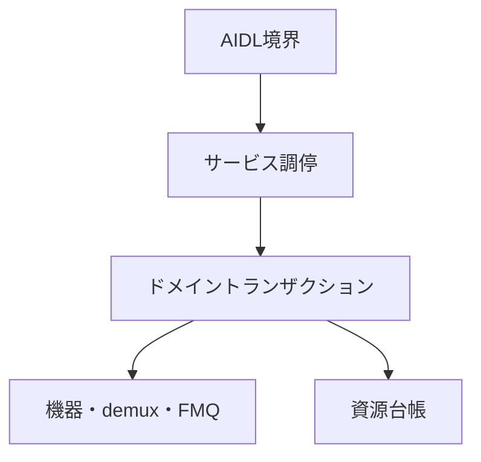

# Tuner HAL2 実装構造設計

## 本書の責務

本書は、`tuner_hal2`における論理責務の分割、依存方向、AIDL境界とドメイン処理の接続、現在の実装位置との対応を定義する。

公開AIDLの状態、戻り値、能力値、資源寿命、確定点、巻き戻し、後片付け、ワーカー、キュー、section/PES/TS処理は`../tuner_hal/DESIGN_JA.md`を正とする。PSI/SI表固有の意味解釈は`../arib_si_engine_rs/DESIGN_JA.md`を正とする。本書はこれらの契約を再定義せず、`tuner_hal2`の論理責務へ対応付ける。

物理ファイル名、module名、type名、関数名は実装の追跡情報であり、設計上の規範ではない。改名または分割だけでは設計変更にならない。論理責務、依存方向、所有状態、公開契約との対応を変える場合に設計を更新する。

本PRで追加・変更する契約は、`tuner_hal2`へ適用する目標設計であり、現行実装済みの事実を表すものではない。実装、設定、`Android.bp`、VTS用XML、単体試験が同じ契約へ追従し、`../タスク完了判定の実施方法.md`による横断確認が完了するまでは「設計済み・実装未適用」とする。公開能力を有効にできるのは、対応する実装入口、状態遷移・異常系試験、製品設定またはVTS設定がそろった機能だけである。移行は公開API単位で行い、未移行APIを新設計の成功能力として広告してはならない。

## 責務の一方向参照

| 正本 | 所有する内容 | 他文書での扱い |
|---|---|---|
| `tuner_hal/DESIGN_JA.md` | AOSP公開契約、VTSと能力公開、TS伝送構文、Table ID別section長、公開状態、寿命、失敗時遷移 | `tuner_hal2`は実装責務へ接続するだけとし、同じ表を持たない |
| `arib_si_engine_rs/DESIGN_JA.md` | PSI/SI表固有の意味解析と意味オブジェクト | Tuner HAL公開状態または伝送長を定義しない |
| `tuner_hal2/DESIGN_JA.md` | 実装内の論理責務、依存方向、現在位置との対応 | 公開契約の値や状態を上書きしない |
| `tuner_hal2/CODE_CONVENTION.md` | 実装規約、禁止構造、静的検査観点 | 状態遷移または戻り値を定義しない |

依存はAIDL境界からドメイン処理へ向かう。下位層がAIDL objectまたはBinder statusを保持してはならない。

## 論理コンポーネント

| 論理責務 | 入力 | 所有するもの | 所有しないもの |
|---|---|---|---|
| AIDL境界 | AIDL引数、callback、object handle | AIDL値の外形検証、typed requestへの変換、Binder statusへの変換 | ドメイン状態、backend、rollback方針 |
| サービス調停 | typed request、root/object識別子 | object所有関係、世代の再検証、操作の振り分け、単一lock snapshot | packet解析、driver固有I/O |
| ドメイントランザクション | 検証済みrequest、予約済み資源 | 確定点、補償操作、局所隔離、状態変更 | Binder表現、AIDL callback実体 |
| 機器適合 | frontend/LNB要求 | device probe、driver固有設定、実状態の確認 | 公開能力の捏造、上位状態の直接変更 |
| demux処理 | 入力元とTS packet | 入力元世代、continuity、section/PES assembler、配送候補 | PSI/SI意味解析、公開object寿命 |
| FMQ・callback配送 | 確定済みpayload/event | queueへの確定、EventFlag、callback配送結果 | backend状態の巻き戻し |
| 資源台帳 | 予約・確定・解放要求 | object数、FMQ、PES、AV、DVR、descrambler、workerの使用権 | 公開能力値の独自算出 |
| 後片付け管理 | 閉鎖、所有者消滅、失敗した解放 | 未完手順、再試行権限、隔離資源 | 通常操作への復帰判断 |

## 公開メソッドの接続規則

参照系メソッドは、サービス調停が同一lock内で不変snapshotを作り、AIDL境界が応答へ変換する。参照処理は状態変更、後片付け、ワーカー停止、callback配送を行わない。

更新系メソッドは次の責務分担を守る。

1. AIDL境界は、対象objectとAPI種別を特定するための外形だけを読み取り、失敗し得るdomain入力変換は行わない。
2. サービス調停が同一排他区間でobjectの生存、所有者、object generation、kind、依存generationを検証する。この検証に失敗した場合は、入力値の詳細検証より先に`INVALID_STATE`を確定する。
3. 生存検証後に、AIDL境界のtag、列挙値、nullable入力、値域をtyped requestへ変換する。不正入力は`INVALID_ARGUMENT`とし、状態を変更しない。
4. サービス調停がrequestと依存関係を再検証し、一回限りの実行権限を発行する。
5. 資源台帳が失敗し得る予約を行う。
6. ドメイントランザクションが外部副作用を実行し、commit pointでdomain状態を確定する。commit前失敗は予約と準備物を逆順に戻し、commit後の後片付け失敗は`../tuner_hal/DESIGN_JA.md`の`CleanupPending`または隔離へ接続する。
7. AIDL境界は確定結果だけをBinder応答へ変換する。

失敗時の戻り値、補償操作、`CleanupPending`、隔離条件は`../tuner_hal/DESIGN_JA.md`に従う。AIDL境界、サービス調停、機器適合が独自の状態表を持ってはならない。

### 規範契約と実装入口の対応

次表は、公開契約を実装で強制する境界を固定する。物理名は追跡索引として変更できるが、所有者、順序、確定点、巻き戻し、禁止入口は変更してはならない。

| 契約 | 所有者 | 必須phase order | 確定点・失敗処理 | 禁止入口 |
|---|---|---|---|---|
| object method | サービス調停のobject method use-case | live・owner・全依存generation確認 → request変換 → validation → dispatch計画 → 一回限り権限消費 → domain実行 | domain commit前は無変更、commit後失敗は型付き診断と契約別後片付けへ接続 | AIDL methodからbackend、registry、低水準dispatchを直接呼ばない |
| root/child open | サービス調停のopen use-case | 公開ID・能力確認 → 全使用権仮予約 → runtime登録準備 → Binder object準備 → 一括commit | objectとruntime登録を同時公開し、途中失敗は全仮予約・artifactを逆順解放 | AIDL helperでledger IDを再解釈しない |
| public close / owner loss / Drop leak | 一回限りのcleanup authorityを持つclose use-case | 論理閉鎖 → 新規権限遮断 → worker・queue・接続・artifact・domain cleanup → runtime unregister → ledger解放 | runtime unregister成功後だけobject tableをClosedへ確定。再試行可能失敗はauthorityとleaseを`CleanupPending`へ移す | AIDL、Drop、Reaperが同時にcleanup authorityを持たない |
| descrambler key/session | descrambler transaction use-case | session検証 → key claim準備 → PID・session変更 → commit → 旧claim解放 | sessionとkey tableを同じcommitで更新し、失敗時は旧sessionを維持 | AIDL層またはdescrambler crateからkey tableを直接変更しない |
| source boundary | source boundary use-case | 両objectのlive・owner・demux・generation確認 → 新関係準備 → queue/assembler境界 → 関係commit → 旧関係解放 | commit前失敗は旧関係を維持し、境界の部分確定は隔離 | filter wrapperから接続表・queue世代を個別変更しない |
| frontend tune/scan | frontend session transaction | request検証 → worker/callback/rollback準備 → 旧session遮断 → backend要求 → 新generation commit | `../tuner_hal/DESIGN_JA.md`の表19と統合状態表に従う | worker、backend adapter、callback層がfrontend公開状態を直接確定しない |
| callback artifact | callback registry use-case | owner live確認 → artifact保持 → runtime登録 → domain確定 → lock外配送 | lookup失敗、Binder配送失敗、cleanup失敗を別phaseとして記録し、片側だけ残さない | demux/device/resource ledgerへBinder callback実体を渡さない |
| worker終端 | worker ownerと後片付け管理 | stop predicate確定 → wake/cancel → 終了回収またはReaper移管 → 残cleanup → lease返却 | 世代遮断前に移管せず、回収完了前に専有資源を再利用しない | worker自身がowner objectをunregisterしない |

### ルートobject

`openFrontendById()`、`openDemux()`、`openDemuxById()`、`openDescrambler()`、`openLnbById()`、`openLnbByName()`は、同じroot open責務を使う。公開IDの検証、使用権予約、runtime登録、typed Binder object生成、失敗時の解放を一つの操作として扱い、objectを返した後に登録を巻き戻さない。

`getFrontendIds()`、`getLnbIds()`、`getDemuxIds()`、`getDemuxInfo()`、`getDemuxCaps()`、`getMaxNumberOfFrontends()`、`isLnaSupported()`は、起動時に確定した能力snapshotと現在の使用上限から応答する。照会中にprobeまたは能力の再選択を行わない。

### 子objectと関連付け

Filter、DVR、TimeFilterなどの子objectは、親demuxの生存、所有者、世代、能力、資源予約を確認してから登録する。対応しないTimeFilterは`tuner_hal`の契約どおりobjectを生成しない。

`IFilter.setDataSource()`、DVR接続、descramblerのPID登録、frontendとLNBまたはCI CAMの接続は、両objectの所有者と世代を同じsnapshotで検証する。片側だけを確定した状態を通常状態として公開しない。

### 入力処理

TS入力は、frontend、playback DVR、許可されたsource filterの入力元を別の世代空間で保持する。packet validation、continuity、section/PES組み立て、filter照合までをdemux責務とし、PSI/SI意味解析を呼ばない。

queueへの書き込み権限は世代付きとし、`flush()`、再設定、停止、再選局、入力元変更、閉鎖で旧世代を失効させる。配送済みAV領域など、クライアントが保持する資源の寿命はqueue世代と分離する。

## 現在実装との追跡索引

次表は現在位置を探すための非規範情報である。改名時は追跡索引だけを更新し、論理責務が同じなら公開設計を変更しない。

| 論理責務 | 現在の主な位置 |
|---|---|
| AIDL境界 | `aidl_service/`、`binder_adapter/` |
| サービス調停 | `service_runtime/` |
| typed request | `domain_request/` |
| frontend/LNB backend | `device/`、`lnb/` |
| demuxとpacket処理 | `demux/` |
| descrambler | `descrambler/` |
| FMQ | `fmq/`、`fmq_shim/` |
| 資源台帳 | `resource_ledger/` |
| 共通の値型 | `common/` |
| Android公開設定 | `manifest/`、`init/`、`sepolicy/`、`config/` |

## 適用状態と移行完了条件

本PRの文書変更だけでは、次の項目を実装済みまたは試験済みと扱わない。各行は独立して移行し、完了条件を満たした行だけを製品profileで有効にする。

| 適用単位 | 現在状態 | 実装追跡先 | 移行完了条件 |
|---|---|---|---|
| 公開object methodの検証順序とtransaction境界 | 設計済み・実装未適用 | `aidl_service/`、`service_runtime/`、`domain_request/` | 対象APIの入口が規範phase orderへ一本化され、状態不正と入力不正の優先順位、commit前後失敗、rollbackの試験が合格 |
| frontend tune/scan、再選局、終端deadline | 設計済み・実装未適用 | `service_runtime/`、`device/`、callback配送 | AOSP callback契約を満たす終端、旧session遮断、新要求失敗時restore、deadlineの試験が合格 |
| Filter/DVR/AV/PESとFMQの資源契約 | 設計済み・実装未適用 | `demux/`、`fmq/`、`fmq_shim/`、`resource_ledger/` | `CapabilitySnapshot`からの予約、event-local/shared AV、processing buffer、overflow、close解放の試験が合格 |
| 自律cleanupとworker回収 | 設計済み・実装未適用 | `service_runtime/`、各worker owner、`resource_ledger/` | owner操作なしで再試行が進み、期限後の隔離またはservice-critical遷移とlease非再利用を試験で確認 |
| query snapshotとbackend適合 | 設計済み・実装未適用 | `service_runtime/`、`device/`、`config/` | queryがbackend I/Oを行わず、世代付きcacheの更新・失効とmanifest/probeによるbackend選択を試験で確認 |
| VTS/product profile | 設計保留 | `config/`、VTS XML、製品設定 | `VTS-ENV-01`から`06`の実測値を確定し、対応XML一式を静的選択して対象VTSを合格 |

## 構造上の禁止事項

- AIDL methodごとにclose、queue、rollback、quarantineの状態機械を複製しない。
- `tuner_hal`で定義した公開戻り値を`service_runtime`またはbackendで別の値へ読み替えない。
- AIDL objectまたはcallback実体をdemux、device、resource ledgerへ渡さない。
- read-only queryからcleanup、worker操作、backend I/Oを開始しない。
- file名またはtype名を公開契約、ARIB根拠、設計変更判定の根拠にしない。
- 物理配置表を状態遷移の正本として扱わない。
