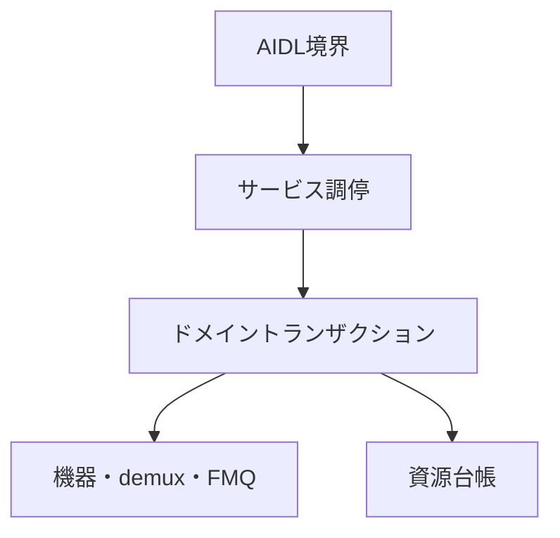
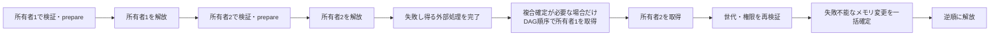

# Tuner HAL2 実装構造設計

## 本書の責務

本書は、`tuner_hal2`における論理責務の分割、依存方向、AIDL境界とドメイン処理の接続、実装owner/anchorとの対応を定義する。

公開AIDLの状態、戻り値、能力値、資源寿命、確定点、巻き戻し、後片付け、ワーカー、キュー、section/PES/TS処理は`../tuner_hal/DESIGN_JA.md`を正とする。PSI/SI表固有の意味解釈は`../arib_si_engine_rs/DESIGN_JA.md`を正とする。本書はこれらの契約を再定義せず、`tuner_hal2`の論理責務へ対応付ける。

物理ファイル名、module名、type名、関数名はAOSP公開契約またはARIB規範ではない。ただし、`../tuner_hal/DESIGN_JA.md`の論理契約を実装へ一意に接続するため、実装owner/anchorと許可entry pointは、本書の`共通transaction / use-caseの規範実装アンカー`で追跡アンカーとして固定する。責務を変えないrename、split、mergeだけでは公開設計変更にならないが、同一変更でアンカーを更新し、移動前後に複数ownerを残してはならない。論理契約の状態、phase、確定点、rollback / cleanup、failure semanticsは本書へ再掲せず`../tuner_hal/DESIGN_JA.md`を参照する。

## 責務の一方向参照

| 正本 | 所有する内容 | 他文書での扱い |
|---|---|---|
| `tuner_hal/DESIGN_JA.md` | AOSP公開契約、VTSと能力公開、TS伝送構文、Table ID別section長、公開状態、寿命、失敗時遷移、共通部品の論理契約 | `tuner_hal2`は実装責務へ接続するだけとし、同じ状態表を持たない |
| `arib_si_engine_rs/DESIGN_JA.md` | PSI/SI表固有の意味解析と意味オブジェクト | Tuner HAL公開状態または伝送長を定義しない |
| `tuner_hal2/DESIGN_JA.md` | 実装内の論理責務、依存方向、実装owner/anchor、許可entry point、禁止bypass | 公開契約の値・状態・phase・確定点・rollback/cleanup・failure semanticsを独自定義しない |
| `tuner_hal2/CODE_CONVENTION.md` | 実装規約、禁止構造、静的検査観点 | 状態遷移または戻り値を定義しない |

依存はAIDL境界からドメイン処理へ向かう。下位層がAIDL objectまたはBinder statusを保持してはならない。

## 論理コンポーネント

| 論理責務 | 入力 | 所有するもの | 所有しないもの |
|---|---|---|---|
| AIDL境界 | AIDL引数、callback、object handle | AIDL値の外形検証、typed requestへの変換、Binder statusへの変換 | ドメイン状態、backend、rollback方針 |
| サービス調停 | typed request、root/object識別子 | object所有関係、世代の再検証、操作の振り分け、単一lock snapshot | packet解析、driver固有I/O |
| ドメイントランザクション | 検証済みrequest、予約済み資源 | `../tuner_hal/DESIGN_JA.md`の同名transaction契約を実装ownerへ接続するtyped request/entry mapping | Binder表現、AIDL callback実体、確定点・補償・rollback・quarantine semanticsの独自定義 |
| 機器適合 | frontend/LNB要求 | device probe、driver固有設定、実状態の確認 | 公開能力の捏造、上位状態の直接変更 |
| demux処理 | 入力元とTS packet | demux / packet ingress componentから`PacketPipeline` / `StreamBoundaryTxn` / `FilterProducerDrainGate`のtyped entryへの実装mapping | 入力元generation、continuity、section/PES assembler、Filter delivery generationのmutation ownership、PSI/SI意味解析、公開object寿命 |
| FMQ・callback配送 | 確定済みpayload/event | FMQ / EventFlag / callback delivery componentからqueue・callbackのcanonical owner / typed entryへの実装mapping | queue/generation state、callback delivery outcomeのmutation ownership、backend状態の巻き戻し、worker制御失敗分類 |
| 資源台帳 | 予約・確定・解放要求 | object数、FMQ、PES、AV、DVR、descrambler、workerの使用権 | 公開能力値の独自算出 |
| 後片付け管理 | 閉鎖、所有者消滅、失敗した解放 | `../tuner_hal/DESIGN_JA.md`のcleanup契約を実装ownerへ接続するtyped cleanup entry mapping | 通常操作への復帰判断、未完手順・retry authority・quarantine semanticsの独自定義 |

## 公開メソッドの接続規則

静的inventory／capability参照メソッドはservice_runtimeのcapability/query ownerからAIDL応答変換へ接続し、動的な`IFrontend.getStatus()`／`getFrontendStatusReadiness()`はfrontend status query ownerからAIDL応答変換へ接続する。`CapabilitySnapshot`と`FrontendStatusSnapshot`の値、更新・無効化条件、同期/非同期read条件、公開statusは`../tuner_hal/DESIGN_JA.md`の該当契約を正とし、本書では再定義しない。

更新系メソッドは、AIDL境界からservice_runtimeのobject-method / domain use-case ownerへtyped requestを渡し、そこから資源台帳、domain transaction、backend adapterの各ownerへ接続する。AIDL境界はBinder表現との変換だけを担当し、service_runtime / domain ownerを迂回してbackendまたはregistryを直接変更しない。

lifecycle/owner/generation検証、引数検証との優先順位、再検証、execution authority、資源予約、外部副作用、phase order、commit point、pre-commit rollback、post-commit cleanup、失敗時statusは`../tuner_hal/DESIGN_JA.md`のobject method契約・各API状態表・同名transaction契約を正とし、本書では再定義しない。

### 契約正本と実装入口の対応

公開transactionの状態、phase、確定点、rollback / cleanup、failure semanticsは`../tuner_hal/DESIGN_JA.md`の同名論理契約を正とする。本節が規範として所有するのは、論理契約名から`tuner_hal2`の実装ownerへの対応と、ownerを迂回して第二の実装ownerを作ることの禁止だけである。

| 契約 | 実装所有者 | 禁止入口 |
|---|---|---|
| object method | サービス調停のobject method use-case | AIDL methodからbackend、registry、低水準dispatchを直接呼ばない |
| `RootOpenTxn` | サービス調停のルートオープン手順所有者 | AIDL層で実行時資源割当、オブジェクト表、巻戻し補助処理を直接扱わない |
| `ChildOpenTxn` | サービス調停の子オープン手順所有者 | AIDL補助処理で台帳IDを再解釈せず、`Filter` / `DVR` / `TimeFilter`等が別の子オープン所有者を持たない |
| public close / owner loss / Drop | `ObjectCloseTxn` | AIDL、Drop、Reaper、個別objectが別のclose ownerを持たない |
| descrambler key | `DescramblerKeyTxn` | callerがkey台帳を直接変更しない |
| descrambler PID | `DescramblerPidTxn` | `addPid()` / `removePid()` callerが別のPID mutation ownerを持たない |
| descrambler session cleanup | `DescramblerSessionCleanupTxn` | close/invalidate callerがPID、key、pool台帳を直接変更しない |
| Filter source relation | `SourceBoundaryTxn` | filter wrapperまたはAPI別use-caseが接続graphを直接変更しない |
| Demux frontend source relation | `DemuxFrontendSourceTxn` | `IDemux.setFrontendDataSource()` callerがrelation ownerを迂回しない |
| stream boundary | `StreamBoundaryTxn` | relation、queue、A/V sync、PCR、callback、descramblerの各ownerを迂回しない |
| `PacketPipeline` | `PacketPipeline` | 通常のパケット入力・解析・フィルタ振分けを`StreamBoundaryTxn`へ吸収せず、別の正規パケット処理所有者を設けない |
| `FrontendTuneScanTxn` | フロントエンド選局・走査の手順所有者 | ワーカー、下位実装接続層、コールバック層がフロントエンド所有者を迂回しない |
| Record DVR / Filter relation | `RecordDvrFilterRelationTxn` | DVR側とFilter側が別のrelation ownerを持たない |
| Frontend / LNB assignment relation | `FrontendLnbRelationTxn` | frontend object method use-caseまたはLNB registry ownerがrelation/leaseを別commitしない |
| LNB永続状態・物理I/O直列化 | `LnbRegistry` | `LnbControlTxn`、固定給電、安全状態復帰、DiSEqCが別の永続状態所有者または物理I/Oロックを持たない |
| LNB永続制御手順 | `LnbControlTxn` | 永続制御APIごとに別の制御手順所有者を持たず、`LnbRegistry`の永続状態・物理I/O所有権を吸収しない |
| callback registration | `CallbackRegistrationUseCase`。`RuntimeCallbackRegistry`とBinder callback artifactの保管主体は別責務 | AIDL façadeまたはdomain別use-caseが別のregistration ownerを持たない |
| post-commit callback failure | `PostCommitCallbackFailureTxn` | API別に同型handlerを設けない |
| Filter / DVR flush cleanup orchestration | `QueueCleanupUseCase` | API別に別のflush cleanup orchestratorを設けない |
| DVR playback consume | `PlaybackConsumeTxn` | playback workerが別のconsume ownerを持たない |
| A/V sync relation | `AvSyncRegistry` | API、filter wrapper、`StreamBoundaryTxn`がregistryを迂回しない |
| PCR clock anchor | `PcrClockAnchorStore` | APIまたは`StreamBoundaryTxn`がstoreを迂回しない |
| worker lifecycle mechanism | `WorkerRuntime`が唯一のcanonical A state owner。`WorkerHandle`は`WorkerRuntime`に従属するopaqueなtyped handle / authority表現 | `WorkerHandle`を第二のgeneric lifecycle ownerまたは第二のstate正本として扱わず、別のgeneric worker lifecycle ownerも重ねない |
| worker failure classification | `WorkerFailureClassifier` | 各ownerがclassifierを迂回して別のfailure classification ownerを設けない |
| `FrontendWorkerTerminationUseCase` | フロントエンド固有の終了手順所有者。汎用寿命管理のcanonical state ownerは`WorkerRuntime`であり、`WorkerHandle`は従属物理要素 | フロントエンド固有の終了手順へ汎用寿命管理の所有責務を吸収せず、ワーカー・AIDL層が別の終了手順所有者を持たない |

#### 共通化対象の A/B/C 分類境界

共通化対象の分類は論理状態と責務の単位で行い、Rustの型数、ファイル数、モジュール数、スレッド配置、共有参照方式を分類根拠にしない。次の順序で判定する。

- **A**: 呼出しを越えて状態の正本を持つ。一意な状態所有者と一意な変更入口を設ける。その正規変更入口は正規状態所有型自身に置く。競合する操作要求が複数の実行主体から並行して到達し得る場合は、正規入口で順序を一意に確定できなければならない。具体的な排他制御、単一所有の実行主体、命令待ち行列などの方式は実装側で選ぶ。古い操作や競合する操作を識別しなければ整合性を保てない場合に限り、必要な世代番号や一回性権限を追加する。Aに排他制御が必要な場合、その同期手段の所有者と取得規則は当該Aの設計に含める。所有者間の入れ子取得は通常の接続手段にせず、正規契約が複合確定を要求する最終確定区間だけ、後述の有向非巡回取得規則に従って限定的に許可する。Aの状態所有境界を曖昧にする外側からの無条件な`Arc<Mutex<A>>`包装を標準形にしない。
- **B**: 呼出しを越える状態の正本は持たないが、複数段階の手順そのものを一意化する必要がある。一意な手順所有者と明示された正規入口を設ける。通常の関数制御だけで進行順序を保持できる場合は追加の状態機械を設けない。追加の状態表現が必要な場合も呼出し単位に閉じ、列挙型で段階を明示し、段階ごとに必要な値は対応する列挙子に保持する。手順が複数の実行主体にまたがる場合は型付き要求と型付き結果で責務境界を明示し、B自身の共有永続状態を作らない。同じ操作の二重実行を防ぐことが契約上必要な場合に限り一回性権限を追加する。共有永続状態が必要になった場合は、既存Aへ状態を置くか、A/Bの責務境界を設計側で再判定する。Bが一回の呼出し内で複数の実行主体へ処理を分配する場合、Bの可変な進行状態を直接変更する主体は一つに限定する。各実行主体は型付き結果を返し、その一つの調停主体だけが結果を集約して進行状態を更新する。
- **C**: 呼出しを越える状態の正本も、一意化すべき複数段階手順も持たない分類・変換責務とする。分類Cであることだけを理由に、状態機械、世代番号、一回性権限、排他制御、ワーカー、キュー、タイマーを追加しない。

この判定は`Send` / `Sync`を決めない。具体型の`Send` / `Sync`要件は、AIDL/Binder等の外部API・実行基盤が境界型へ課す型制約と、選択したRust実装で実際に生じるスレッド間の所有権移送・共有参照から別途決める。分類、論理上の並行要求、複数の呼出経路だけを理由に、内部の正本所有型や従属型へ`Send` / `Sync`を機械的に要求しない。

正規論理契約を実装へ一意に追跡できるよう、Aでは正規論理契約名と正規状態所有型名を一致させる。B/Cでは正規の手順所有者、分類器所有者、または正規入口のRust識別子・経路に、正規論理契約名そのもの、またはその機械的な`snake_case`形を直接現し、これを**正規名称標識**とする。

一つの論理契約を一つのファイルや一つのモジュールへ固定する必要はない。補助処理や呼出し単位の文脈型を別の名前や別のファイルへ分けてもよい。ただし、正規所有者と正規入口は一意に追跡できなければならない。正規入口が複数必要な場合は、有限の操作集合として明示し、すべて同じ正規名称標識から追跡できるようにする。関数名を一律に`execute`へ固定しない。

呼出元は正規入口を使用し、同じ手順や分類を別経路で手書きし直してはならない。本来その共通部品を使用すべき呼出元が正規名称標識を経由せず、別名の所有者・別入口・下位操作の直接組合せによって同じ責務を再構成している場合は、重複実装、迂回実装、旧実装残存の監査異常として扱う。

名称変更時は、正規論理契約名、規範実装アンカー、正規名称標識、正規入口とその呼出元、対応する検査を同一変更で更新する。旧名を同一責務の恒久的な互換入口として残さない。現在の実装名を維持することだけを理由に、正規論理契約名を変更しない。

Cの正規分類器・変換器は、同じ意味判断を行う正規入口を一つにし、呼出元が再分類する必要のない型付き結果を返す。呼出元が生の`errno`、文字列、下位実装固有の詳細などから同じ分類を再実装してはならない。

A/B/Cの分類と`Txn` / `UseCase` / `Context`の命名判定は別である。Bであることだけを理由に`Txn`と呼ばず、命名は次節および`../tuner_hal/DESIGN_JA.md`の共通部品命名規則に従う。

##### `WatermarkClassifier` の分類境界

`WatermarkClassifier` は Filter / Record DVR / Playback DVR に共通する閾値比較の実装責務だけを一意化する分類Cの純粋分類器とする。公開statusの意味、threshold値の由来、queue snapshotの意味、比較式、判定優先順位、直前statusの保持、callback抑止、`statusMask`、`DATA_READY`、`OVERFLOW`は `../tuner_hal/DESIGN_JA.md` の各Filter/DVR契約だけを正本とし、本書では再定義しない。

`WatermarkPolicy` は公開API種別ではなく比較規則の形だけを表す変更不能な列挙型とし、variant集合を `OccupancyBand { low, high }` と `ReadableWritableBand { low, high }` の2つだけに固定する。`WatermarkDecision` はAIDL非依存の型付き分類結果とし、variant集合を `Empty`、`Low`、`High`、`Full`、`NoTransition` の5つだけに固定する。各variantをどの条件で生成し、どの公開statusへ射影するかは `../tuner_hal/DESIGN_JA.md` の正本契約を参照し、本書へ比較条件を複製しない。

各status評価の呼出元は、評価開始時にcommit済みsettings / queue契約から当該正本契約が要求する `WatermarkPolicy` を構成し、`WatermarkClassifier::new(policy)` のようなconstructorで変更不能なpolicyをclassifier instanceへ束縛してから、同一評価のqueue snapshotだけを分類入口へ渡す。分類入口はpolicyを追加引数として受け取らず、classifier instanceのpolicyを評価中に更新しない。threshold変更が正規契約上commitされた後の次回評価では、新しいcommit済みsettingsから新しいpolicyを構成して新しいclassifier instanceを生成する。classifier instanceを呼出し越しの正本状態として保持せず、lock、generation、worker、queue、timer、callback状態を追加しない。

`WatermarkPolicy`へ `Filter` / `RecordDvr` / `PlaybackDvr` のような公開API種別tagを持たせず、classifier内部でAIDL statusを生成しない。各domain ownerは `WatermarkDecision` を `../tuner_hal/DESIGN_JA.md` の正本契約に従って公開statusへ射影する。

#### `Txn` / `UseCase` / `Context` の物理名称境界

`Txn` の論理上の成立条件は `../tuner_hal/DESIGN_JA.md` の共通部品命名規則を正とする。本書では、その判定結果を物理アンカーへ反映する。取引境界を所有しない共通調停手順は `UseCase`、正規手順所有者ではない呼出し単位の非公開補助型は `Context` とし、実装都合だけで `Txn` を付けない。

#### 共通transaction / use-caseの規範実装アンカー

次表は`../tuner_hal/DESIGN_JA.md`の同名論理契約を`tuner_hal2`へ接続する物理module/file/type、許可entry point、禁止bypassを固定する。加えて、本書が実装内の分類C共通部品として定義する分類器については、その物理anchor、許可entry point、禁止bypassだけを同表で固定し、公開status semanticsは`../tuner_hal/DESIGN_JA.md`を正とする。

| 契約 | 実装owner / anchor | 許可entry point | 禁止する迂回 |
|---|---|---|---|
| object method | `service_runtime/src/object_method_use_case.rs`。補助moduleは`method_validation.rs` / `method_dispatch.rs` | `aidl_service/src/object_runtime/mod.rs`の`execute_*_use_case*`、`plan_unavailable_object_method_use_case()`、`execute_object_query_use_case()`、domain側`TunerServiceRuntime::*_for_object` | 個別AIDL methodからの先行runtime query、`AidlMethodAdapter::plan()`直接実行、backend/registry直接変更 |
| `RootOpenTxn` | 正規手順所有者・入口は`RootOpenTxn`名を持つ。既存の補助アンカーは`service_runtime/src/root_object_ops.rs`、`service_runtime/src/open_rollback.rs` | `aidl_service/src/tuner_service.rs`のルートオブジェクト処理入口 | AIDL層で実行時資源割当、オブジェクト表、巻戻し補助処理を直接扱う。別名のルートオープン手順を第二の正規所有者として残さない |
| `ChildOpenTxn` | `service_runtime/src/demux_filter_dvr_ops.rs::ChildOpenTxn<'a>`を正規入口とし、allocation / registration / commit / rollbackの実手順は`service_runtime/src/boot/child_open_context.rs::impl ChildOpenTxn<'_>`が同じ型へ実装する。第二の`Context` ownerを置かない | `aidl_service/src/child_object_open.rs`の`open_filter_child_for_owner_object_with_request_builder()` / `open_dvr_child_for_owner_object_with_request_builder()`を含む、`Filter` / `DVR` / `TimeFilter`等の子オブジェクト生成用正規入口 | API別の資源割当・後始末所有者、`RuntimeObjectEntry.ledger_id`の再解釈、`Filter` / `DVR`だけの別の正規子オープン所有者 |
| `ObjectCloseTxn` | `service_runtime/src/object_close_txn.rs::ObjectCloseTxn` | `aidl_service/src/object_runtime/mod.rs`のpublic close / owner-loss / Drop接続とservice_runtimeのshutdown/reaper接続 | 別のclose owner、AIDL/Drop/worker/Reaperの直接cleanup |
| `DescramblerPidTxn` | `service_runtime/src/boot/descrambler_txn.rs::DescramblerPidTxn<'a>`がsource検証、排他確認、session commit、失敗診断の実手順を所有し、`service_runtime/src/descrambler_session.rs::DescramblerPidTxn<'a>`を単一sessionのatomic commit primitiveとして使用する | `service_runtime/src/descrambler_ops.rs`のPID変更処理入口 | AIDL層またはデスクランブラ実装からPID台帳を直接変更、鍵変更・セッション後片付けと同じ別名所有者だけを入口にする |
| `DescramblerKeyTxn` | `service_runtime/src/boot/descrambler_txn.rs`、`service_runtime/src/descrambler_session.rs`、`service_runtime/src/descrambler_key_table.rs`を共用してよいが、正規手順所有者・入口は`DescramblerKeyTxn`名で独立させる | `service_runtime/src/descrambler_ops.rs`の鍵変更処理入口 | AIDL層またはデスクランブラ実装から鍵台帳を直接変更、PID変更・セッション後片付けと同じ別名所有者だけを入口にする |
| `DescramblerSessionCleanupTxn` | `service_runtime/src/boot/descrambler_txn.rs`、`service_runtime/src/descrambler_session.rs`、`service_runtime/src/descrambler_key_table.rs`を共用してよいが、正規手順所有者・入口は`DescramblerSessionCleanupTxn`名で独立させる | デスクランブラのクローズ接続、Demux無効化接続 | AIDL層またはデスクランブラ実装からPID・鍵・プール台帳を直接変更、通常のPID・鍵変更所有者へ後片付け責務を統合する |
| `SourceBoundaryTxn` | `demux/src/runtime/source_boundary.rs` | `service_runtime/src/demux_filter_dvr_ops.rs`のFilter source use-case、source Filter close/unlink接続 | filter wrapper/cleanup callerによるgraph直接変更、demux/frontend ownerとの統合 |
| `DemuxFrontendSourceTxn` | `service_runtime/src/demux_filter_dvr_ops.rs::DemuxFrontendSourceTxn` | `IDemux.setFrontendDataSource()` object use-case、Frontend/Demux close接続 | cleanup callerによるrelation直接編集、`SourceBoundaryTxn`への統合 |
| `StreamBoundaryTxn` | `demux/src/runtime/generation_boundary.rs::StreamBoundaryTxn` | `service_runtime/src/packet_ops.rs`の型付き境界処理入口 | 正規状態所有型の恒久別名または第二の正規所有者を残すこと、関係・キュー・A/V同期・PCR・コールバック・デスクランブラ各所有者の直接変更 |
| `PacketPipeline` | `demux/src/parser/packet_pipeline.rs::PacketPipeline` | `service_runtime/src/packet_ops.rs`の型付きパケット入力処理入口 | `StreamBoundaryTxn`への通常パケット処理吸収、AIDL・下位実装・Filterコールバックからの`PacketPipeline`直接変更、第二の正規パケット処理所有者または正規手順所有者の追加 |
| `RecordDvrFilterRelationTxn` | `service_runtime/src/demux_filter_dvr_ops.rs::RecordDvrFilterRelationTxn` | Record DVR `attachFilter()` / `detachFilter()`、Filter/DVR close、demux cleanup接続 | object側shadow relationの直接変更 |
| `FrontendLnbRelationTxn` | `service_runtime/src/frontend_ops.rs::FrontendLnbRelationTxn` | `IFrontend.setLnb()` object use-case、Frontend close時の`ObjectCloseTxn` typed assignment release | frontend use-case/LNB registryによるrelation・lease別commit、`LnbControlTxn`へのassignment ownership統合 |
| `LnbRegistry` | 正規状態所有者は`LnbRegistry`名を持つ。物理LNB・レール競合単位ごとの非公開I/O権限も同所有者に従属させる | `LnbControlTxn`の準備済み変更の準備・確定・取消し、HAL内部固定給電、安全状態復帰、DiSEqCの型付き物理I/O入口 | 永続状態・世代・失敗・隔離・共有レールのリース参照数の別所有者、`LnbRegistry`を迂回するbackend I/O、I/O権限待ち中のregistry状態ロック保持 |
| `LnbControlTxn` | 正規B手順所有者・入口は`service_runtime/src/lnb_control_txn.rs::LnbControlTxn` | `ILnb.setVoltage()` / `setTone()` / `setSatellitePosition()` object use-case | API別制御手順所有者、呼出しを越える状態・世代・失敗状態・操作ロックの所有、`LnbRegistry`を迂回するbackend I/O、`sendDiseqcMessage()`の同手順への統合 |
| `CallbackRegistrationUseCase` | 正規B手順所有者は`service_runtime/src/callback_registry.rs::CallbackRegistrationUseCase`。`RuntimeCallbackRegistry`は実行時登録簿の状態所有者、`aidl_service/src/callback_store.rs`はBinderコールバック生成物の保管主体であり、いずれも`CallbackRegistrationUseCase`へ統合または同名化しない | `IFrontend.setCallback()` / `ILnb.setCallback()`等のAIDLファサードからサービス実行時のコールバック登録入口 | AIDLファサード・ドメイン別処理による別の登録所有者、`RuntimeCallbackRegistry`またはコールバック生成物保管主体をBの共有進行状態として所有すること、コールバック生成物の別保管先 |
| `PostCommitCallbackFailureTxn` | `service_runtime/src/post_commit_callback_failure_txn.rs::PostCommitCallbackFailureTxn` | domain commit後のcallback delivery failureを受けたcompletion use-caseからのtyped入口 | API別handler、classifierまたはdomain ownerの置換 |
| `FilterProducerDrainGate` | `demux/src/runtime/queue_runtime.rs` | Filter/SharedFilter data path、`QueueCleanupUseCase`からのtyped入口 | 公開API/worker/`QueueCleanupUseCase`からのgate内部直接変更、DVR ownerとの統合 |
| `QueueEpochProtocol` | `demux/src/runtime/queue_runtime.rs` | DVR data path、`QueueCleanupUseCase`からのtyped入口 | 公開API/worker/`QueueCleanupUseCase`からのprotocol内部直接変更、`PlaybackQueueBacking` ownerとの統合 |
| `QueueCleanupUseCase` | `service_runtime/src/queue_cleanup_use_case.rs::QueueCleanupUseCase` | Filter/DVR `flush()` object use-case | 下位protocol内部への直接アクセス、API別orchestrator |
| `PlaybackConsumeTxn` | `service_runtime/src/playback_consume_txn.rs` | playback workerのtyped consume入口 | worker/FMQ/packet helperによる別consume owner |
| `WatermarkClassifier` | `demux/src/runtime/watermark_classifier.rs::{WatermarkClassifier, WatermarkPolicy, WatermarkDecision}` | Filter / Record DVR / Playback DVRのstatus評価が、commit済み契約値からexactly-oneの変更不能`WatermarkPolicy`を構成してconstructorへ渡し、同一評価のqueue snapshotだけを分類入口へ渡す | API / domain別のwatermark classifier、分類入口へのpolicy再注入、classifier内部のAIDL status生成、statusMask・callback状態・queue所有、domain種別tagによる分岐 |
| `FrontendTuneScanTxn` | `service_runtime/src/frontend_ops.rs::FrontendTuneScanTxn`がpreflight、固定給電準備、worker start/stop、rollback、operation event / terminal acceptanceを直接所有する。第二の`Context` ownerを置かない | `FrontendTuneScanTxn`の有限正規入口集合 `begin_tune` / `begin_scan` / `stop_tune` / `stop_scan` / `accept_operation_event` / `accept_worker_terminal`。AIDL境界は`begin_*` / `stop_*`だけ、ワーカー・下位機器処理の完了通知橋渡しは`accept_*`だけを呼ぶ | ワーカー・機器層・コールバック層によるフロントエンド所有者の迂回、Demux所有者の吸収、第二の正規所有者化、有限正規入口集合外での選局・走査進行の再実装 |
| `AvSyncRegistry` | `demux/src/runtime/av_sync_registry.rs::AvSyncRegistry` | filter configure/unregister/close、demux closeからのtyped relation入口 | API/filter wrapper/`StreamBoundaryTxn`からのregistry直接変更、PCR ownerとの統合 |
| `PcrClockAnchorStore` | `demux/src/runtime/pcr_clock_anchor.rs::PcrClockAnchorStore` | PCR観測、stream boundary側のtyped invalidation入口 | APIまたは`StreamBoundaryTxn`からのstore内部直接変更、A/V sync ownerとの統合 |
| `WorkerRuntime` | `service_runtime/src/worker_runtime.rs::{WorkerRuntime, WorkerHandle}`。`WorkerRuntime`がgeneric worker lifecycleの唯一のcanonical A state ownerであり、`WorkerHandle`は同ownerに従属するopaqueなtyped handle / authority表現 | 各domain worker ownerの`WorkerRuntime`正規入口。必要な場合に同ownerが発行・管理する`WorkerHandle`を使用する | `WorkerHandle`による独立したgeneration / retry / reaper state所有、別generic lifecycle owner、domain start/stop ownerの吸収 |
| `WorkerFailureClassifier` | `service_runtime/src/worker_failure_classifier.rs` | worker owner / cleanup manager / callback・backend failure ownerからのtyped入口 | owner側の別classifier、classifierによるdomain ownerの置換 |
| `FrontendWorkerTerminationUseCase` | 正規手順所有者・入口は`FrontendWorkerTerminationUseCase`名を持つ。`service_runtime/src/frontend_worker_termination_use_case.rs`はフロントエンド固有終了の補助処理、`device/src/runtime/frontend_worker.rs::FrontendWorkerRegistry`は既存の状態所有者として扱う。汎用の停止・起床・終了待ち・回収処理・再試行機構のcanonical state ownerは`WorkerRuntime`であり、`WorkerHandle`は従属する物理要素 | `service_runtime/src/frontend_ops.rs`、`ObjectCloseTxn`からの型付き後始末接続 | ワーカー・AIDL層による所有者登録解除、リース、終了待ち・回収処理、失敗分類器の直接代替、汎用寿命管理の所有責務の吸収、別のフロントエンド終了手順所有者 |

##### 共通化対象のRust物理化追加要件

次表は、`../tuner_hal/DESIGN_JA.md`の論理契約と本書の実装所有者・アンカーを変更せず、A/B/C判定後に必要となる論理上の並行性・直列化契約、失効操作・一回性識別、Bの呼出し内進行状態だけを固定する。公開状態、段階、確定点、巻戻し・後片付け、失敗時の意味は`../tuner_hal/DESIGN_JA.md`を正とする。一回性権限の一般実装規則とA/Bの永続状態格納境界は`CODE_CONVENTION.md`を正とする。`Send` / `Sync`はA/B/C分類から導出せず、外部API・実行基盤の型制約と、実際のスレッド間移送・共有参照から判定する。

`B進行状態`の`通常制御`は通常の関数制御、型付きスナップショット、準備済み値、一回性権限、変更不能な計画、結果列挙型で手順を表現し、B自身の可変進行状態を呼出し越しに保持しないことを表す。

従属するハンドル・権限・準備済み値の自動トレイト要件は、正本所有型のトレイト有無から自動的に導出しない。値そのものを実際にスレッド間で移送する境界では、その転送型に`Send`を要求する。共有参照を複数スレッドから同時利用する境界では、その共有対象型に`Sync`を要求する。同一スレッド内で処理主体が変わるだけの場合は`Send`の根拠にしない。

AIDL/Binder等の外部API・実行基盤が、境界に現れる型へ`Send` / `Sync`を要求する場合は、その境界の型制約として満たす。この要求は内部正本の共有方式とは独立に発生し得るため、内部の正本所有型へ機械的に伝播させない。

- `CloseCleanupAuthority`を所有者消滅処理または回収処理へ値のままスレッド間移送する実装では、`CloseCleanupAuthority: Send`を正の要件とする。正本所有者内で権限を消費して別の専用実行項目へ変換してからスレッド境界を越える実装では、スレッド境界を越える実行項目に`Send`を要求し、元の`CloseCleanupAuthority`へ不要な`Send`を強制しない。
- `WorkerHandle`、停止・起床権限、回収移管権限その他の従属値も同じ規則とし、実際にスレッド境界を越える型だけ`Send`を要求する。共有参照を渡さない値へ対称性だけを理由に`Sync`を追加しない。
- 正の自動トレイト要件はフィールド構成から成立させ、要求対象となる具体型についてコンパイル時の型検査で確認する。`unsafe impl Send` / `unsafe impl Sync`は、コンパイラが自動導出できない低水準要素を直接封じ込め、その要素についてスレッド安全性と別名参照の安全性を型自身の不変条件として証明できる最小の型に限る。実行器やキューのトレイト要件を満たすためだけに追加せず、上位の正本所有型や調停型で下位型の非`Send` / 非`Sync`を打ち消すためにも使用しない。
- 設計上、具体型を非`Send`または非`Sync`に保つ必要がある場合は、安定版Rustで利用できない`negative impl`を前提にせず、フィールド構成でその性質を成立させ、コンパイル失敗検査またはリポジトリで採用する同等の静的検査で確認する。

次表は、`../tuner_hal/DESIGN_JA.md`が定める競合・順序関係を実装接続の観点で追跡するための表であり、公開契約を再定義しない。複数の実行主体から要求が並行到達し得る場合に必要なのは、各契約が定める順序、世代柵、一回性等の不変条件を守ることである。実行主体が複数であることだけを理由に一回性権限を追加しない。正本所有型そのものを共有参照する物理形も要求せず、単一所有の専用実行主体や命令キュー等の物理形も許容する。`Send` / `Sync`の具体型要件は、この表とは別に、外部API・実行基盤の型制約と実際のスレッド間移送・共有参照から確定する。

| 正本・手順所有者 | 並行し得る要求 | 契約上必要な性質 |
|---|---|---|
| `ObjectCloseTxn` | 公開close、所有者消滅 / Drop、終了処理 / 回収処理 | 同一オブジェクトのclose開始権限と後片付け進行を一つの正本で線形化する |
| `SourceBoundaryTxn` | `setDataSource()`、入力元解除、Filter close | 同一関係の変更を一つの正本で順序付ける |
| `StreamBoundaryTxn` | 関係変更、flush / close、パケット側境界通知 | ストリーム境界世代と型付きリセット・無効化通知の順序を一意にする |
| `FrontendLnbRelationTxn` | `setLnb()`、Frontend close | 割当関係とリース参照変更を一つの正本で確定する |
| `LnbRegistry` | 公開LNB制御、固定給電、安全状態復帰、DiSEqC | 同一物理LNB・レールへのI/Oと永続状態変更を同じ物理競合単位で直列化する |
| `RecordDvrFilterRelationTxn` | 接続 / 切離し、Filter close、DVR close、demux後片付け | Record DVR / Filter 関係変更を一つの正本で確定する |
| `WorkerRuntime` | ドメインstart / stop、ワーカー終了通知、close、終了処理 / 回収処理 | 同一ワーカー寿命の停止・起床・終了・回収・再試行を一つの正本で順序付ける |
| `FilterProducerDrainGate` | 生成側、flush / closeの排出要求 | 受付・許可・排出・世代更新を同一gateで線形化する |
| `QueueEpochProtocol` | キューI/O、flush / close / drain | 読出し・書込み権限とキュー世代変更を同一protocolで順序付ける |
| `PlaybackConsumeTxn` | Playback消費処理とflush / close等の境界要求 | 消費処理状態の変更主体は一つとし、他経路は`QueueEpochProtocol`等の型付き境界から影響させる。消費処理状態を複数実行主体が直接変更しない |
| `AvSyncRegistry` | 設定 / 登録解除、Filter close、demux後片付け | A/V同期関係変更を一つの正本で確定する |
| `PcrClockAnchorStore` | PCR観測、ストリーム境界無効化 | 同一世代の観測と無効化の順序を一つの正本で確定する |
| `PacketPipeline` | パケット処理、ストリーム境界変更 | パケット状態の変更主体は一つとし、型付き世代柵・指示で境界競合を解消する |

この表は `Send` / `Sync` を要求する表ではない。具体型のトレイト要件は、AIDL/Binder等の外部API・実行基盤が要求する型制約と、選択したRust物理形で実際に生じるスレッド間移送・共有参照の双方から別途決める。

| # | 対象 | 分類 | 並行性・直列化契約 | 失効操作・一回性識別 | B進行状態 |
|---:|---|:---:|---|---|---|
| 1 | `ObjectCloseTxn` | A | public close / owner loss / Drop / shutdown / reaperによる同一object変更をowner内で直列化する | lifecycle generation + 一回性 `CloseCleanupAuthority` | — |
| 2 | `SourceBoundaryTxn` | A | set / unlink / closeによるrelation変更をowner内で直列化する | relation generation + prepared relation mutation | — |
| 3 | `DemuxFrontendSourceTxn` | B | B共有lockを持たず、relation ownerと`StreamBoundaryTxn`の正規同期入口を使う | 各Aが発行するprepared mutationを消費し、独自generationを発行しない | 通常制御 |
| 4 | `StreamBoundaryTxn` | A | boundary prepare / commitとsteady-state ownerへのdispatchをowner内で整合させる | `stream_boundary_generation` + 一回性 `PreparedStreamBoundary` | — |
| 5 | `CallbackRegistrationUseCase` | B | B共有lockを持たず、callback store / runtime registry / domain ownerのprepared入口を使う | prepared artifact / registry mutation / domain mutationを一回だけ消費し、独自generationを発行しない | 通常制御 |
| 6 | `FrontendLnbRelationTxn` | A | `setLnb()` / closeによるassignment mutationをowner内で直列化する | object generation + prepared assignment lease mutation + transaction authority | — |
| 7 | `LnbControlTxn` | B | B共有ロックを持たず、`LnbRegistry`の準備済み変更入口と物理I/O権限を使う | 準備済み制御変更・backend適用結果を一回だけ消費し、独自の世代または失敗状態を発行しない | 通常制御 |
| 8 | `DescramblerPidTxn` | B | B共有lockを持たず、pool / PID ledger / backend ownerの正規入口を使う | prepared PID claim / compensation authorityを一回だけ消費し、独自generationを発行しない | 通常制御 |
| 9 | `DescramblerKeyTxn` | B | B共有lockを持たず、key table / session / backend ownerの正規入口を使う | prepared key ref / session mutationを一回だけ消費し、独自generationを発行しない | 通常制御 |
| 10 | `DescramblerSessionCleanupTxn` | B | 同一session cleanupの直列化はsession / close / invalidation側のpersistent ownerへ置き、B共有lockを追加しない | trigger generation / cleanup authorityを入力として消費し、retryable pendingはpersistent ownerへ返す | 通常制御 |
| 11 | `RecordDvrFilterRelationTxn` | A | attach / detach / close / demux cleanupによるrelation変更をowner内で直列化する | object generation + prepared relation / route mutation | — |
| 12 | `WorkerRuntime` | A | handle slot / stop / wake / join / reaper stateをowner内で同期し、外側に第二のlifecycle lockを作らない | owner generation + signal generation + 一回性の停止・起床権限 + 回収移管権限 | — |
| 13 | `WorkerFailureClassifier` | C | なし | なし | — |
| 14 | `PostCommitCallbackFailureTxn` | B | B共有lockを持たず、診断・cleanupのpersistent ownerへtyped結果を渡す | callback delivery result / owner generationを入力にし、独自generationを発行しない | 通常制御 |
| 15 | `FilterProducerDrainGate` | A | producerとdrain / closeの競合をgate自身の同期境界で解決する | delivery / parser generation + 一回性 `FilterProducerPermit` | — |
| 16 | `QueueEpochProtocol` | A | queue I/Oとdrain / flush / closeの競合をprotocol自身の同期境界で解決する | queue epoch + 一回性の読出し・書込み取引権限 | — |
| 17 | `QueueCleanupUseCase` | B | B共有lockを持たず、`FilterProducerDrainGate` / `QueueEpochProtocol`のtyped入口を順に使用する | 各protocolのauthorityを消費し、独自epochを発行しない | 通常制御 |
| 18 | `PlaybackConsumeTxn` | A | playback workerを単一mutation ownerとし、同じconsume stateを複数threadから直接変更しない。共有のためだけの外側mutexを標準形にしない | `QueueEpochProtocol`が発行するtyped epoch / consume authorityを使用し、第二のqueue generationを持たない | — |
| 19 | `AvSyncRegistry` | A | configure / unregister / close / demux cleanupをowner内で直列化する | object / relation generationをtyped keyに含め、同義のgeneration namespaceを追加しない | — |
| 20 | `PcrClockAnchorStore` | A | packet観測とboundary invalidationをowner内で整合させ、複数fieldの不変条件に必要な最小同期を持つ | anchorをstream boundary generationへ従属させ、stale anchorを確定しない | — |
| 21 | `ObjectMethodUseCase` | B | B共有lockを持たず、object / relation / resource ownerのsnapshotとtyped入口を使う | 一回性実行権限をconsume-by-valueで消費する | 通常制御 |
| 22 | `RootOpenTxn` | B | B共有lockを持たず、resource / runtime registry / Binder artifact ownerのprepared入口を使う | prepared reservation / registrationを一回だけcommitまたはabortする | 通常制御 |
| 23 | `ChildOpenTxn` | B | B共有lockを持たず、parent / resource / runtime / Binder ownerのprepared入口を使う | parent generation + prepared reservation / registrationを一回だけ消費する | 通常制御 |
| 24 | `FrontendTuneScanTxn` | B | B共有進行状態を持たず、フロントエンド実行時状態、`WorkerRuntime`、各`StreamBoundaryTxn`の正規同期入口を調停する | 要求指紋 / フロントエンド操作世代 / 準備済み境界を既存所有者から取得し、第二の走査世代を発行しない | 有限正規入口集合から毎回呼出し内で再入場し、入口終了時にB自身の可変進行状態を残さない |
| 25 | `FrontendWorkerTerminationUseCase` | B | B共有lockを持たず、`WorkerRuntime`とfrontend固有ownerのtyped入口を使う | `WorkerRuntime`のowner generation / terminal resultを使用し、独自worker generationを発行しない | 通常制御 |
| 26 | `PacketPipeline` | A | demuxごとの単一packet mutation ownerを基本とし、boundaryとの競合はtyped generation fence / commandで同期する。packetごとの外側mutexを標準形にしない | typed `TsInputOrigin`のgenerationとstream boundary generationを使用し、第二の同義generation namespaceを持たない | — |
| 27 | `WatermarkClassifier` | C | なし | なし | — |

A=12、B=13、C=2であり、`WorkerHandle`を第二のAまたは第二の論理契約として数えない。

##### 所有者間排他制御の取得規則（有向非巡回図）

分類Aまたはそれに準ずる永続状態所有者間では、入れ子取得を通常の接続手段にしない。検証、状態の写し、準備済み値・一回実行権限の取得は原則として一つの所有者の排他区間内で完結させ、排他区間を抜けてから次の所有者へ進む。機器入出力、Binder呼出し、コールバック配送、FMQ待機、ワーカー終了待ちその他の失敗し得る外部処理の間は、所有者間の排他制御を保持しない。

ただし、`../tuner_hal/DESIGN_JA.md`の正規契約が複数所有者にまたがる**複合確定または一括確定**を要求し、片側だけの確定を禁止しており、一つの所有者と準備済み値だけではその不可分性を満たせない場合に限り、**最終確定区間だけ**複数所有者の排他制御を同時取得してよい。この例外は分類Bへ共有永続状態または専用の共有ロックを追加する根拠にはならず、Bは既存の正本所有者が持つ排他制御を呼出し単位で調停するだけとする。

最終確定区間に入る前に、失敗し得る検証、資源確保、準備、機器入出力、Binder処理、コールバック処理、待機を完了させる。最終確定区間では、あらかじめ有限に定めた順序で必要な所有者の排他制御だけを取得し、世代・準備済み値・一回実行権限を再検証した後、**失敗不能なメモリ上の状態変更だけ**を一括して確定する。再検証に失敗した場合は状態を変更せずに全排他制御を解放し、準備済み値の取消しは排他区間外の正規入口で行う。確定後は取得と逆順に排他制御を解放する。

複合確定の最終確定区間でも、各正本所有者の状態所有境界は維持する。調停手順は各所有者が提供する型付きの正規確定機構を通じてのみ準備済み変更を確定し、他所有者のprivate state、raw mutable registry、任意の変更closureを直接取得・変更しない。複数所有者の排他制御を同時保持するための具体的なRust物理形は固定せず、所有者境界、後述のDAG取得順序、正規契約の片側確定禁止を同時に満たす実装を選ぶ。

所有者間の同時取得を使う実装では、対象となる所有者集合と取得辺を当該正規契約の実装接続規則として実装前に明示する。`tuner_hal2`全体で許可する取得辺の和集合は有向非巡回図でなければならず、object ID、要求値、実行時分岐等によって同じ所有者対の取得方向を反転させない。新しい取得辺を追加すると閉路になる場合は、逆向き取得を例外追加せず、準備済み値・一回実行権限で分離するか、必要な状態を一つの正本所有者へ集約して責務境界を再設計する。

- `TunerServiceRuntime`等の上位登録簿・オブジェクト表の排他制御も通常処理では分類Aの正本所有者を呼ぶ前に解放する。正規契約の複合確定で上位所有者自身が最終確定集合に明示された場合だけ、上記DAG順序に従う最終確定区間へ含めてよい。
- `StreamBoundaryTxn`から定常時状態所有者へ初期化・無効化を振り分ける通常処理では、`StreamBoundaryTxn`自身の内部排他制御を保持したまま対象所有者へ入らない。準備済み世代・権限を境界として渡し、各所有者の結果を再集約する。正規契約がrelationとstream boundary等の片側確定を禁止する場合だけ、最終確定区間に必要な所有者集合を明示して上記例外を適用できる。
- `DemuxFrontendSourceTxn`、`CallbackRegistrationUseCase`、`RootOpenTxn`、`ChildOpenTxn`、`FrontendTuneScanTxn`等の分類Bは、準備・外部処理の間に所有者をまたぐ排他制御を保持しない。正規契約が要求する複合確定の不可分性を単一所有者だけで満たせない場合に限り、B自身の共有ロックを追加せず、既存所有者の最終確定集合をDAG順序で一時的に取得する。
- `FrontendLnbRelationTxn`等、分類A自身の正規契約が別の資源所有者との一括確定を要求する場合も同じ規則を適用し、外部I/Oまたは失敗し得る処理を複数排他制御の保持中に実行しない。
- `Descrambler*Txn`、`QueueCleanupUseCase`、`FrontendWorkerTerminationUseCase`等、正規契約が補償・個別結果集約・再試行で整合性を定めており片側確定禁止の複合確定を要求しない手順には、この例外を広げない。

##### `FrontendTuneScanTxn` の有限正規入口集合

`FrontendTuneScanTxn`は呼出しを越えて存続する手順実体を保持せず、次の有限入口集合だけを正規の再入場面とする。各入口は呼出しごとの分類B実行として完結し、非同期操作の継続状態、世代、ワーカー寿命、コールバック配送予約は対応する正本所有者へ残す。ここで「フロントエンド操作所有者」は`../tuner_hal/DESIGN_JA.md`の0-S-2でフロントエンド機器状態の正本とされた`FrontendRuntime`を指し、選局・走査の現行操作状態、要求指紋、操作世代、継続状態を同正本所有者の非公開状態として保持する。「コールバック所有者」は、現行操作に従属する配送予約・世代遮断については`FrontendRuntime`、コールバック登録記録については`RuntimeCallbackRegistry`を指し、`FrontendTuneScanTxn`自身または第三の永続状態所有者を追加しない。「後片付け所有者」は、汎用ワーカー寿命について`WorkerRuntime`、公開`close()`の未完後片付け義務が存在する場合について`ObjectCloseTxn`を指す。

| 入口 | 呼出元 | 入力 | 分類Bが行うこと | 永続化先 |
|---|---|---|---|---|
| `begin_tune` | `IFrontend.tune()`のオブジェクトメソッド境界 | 検証済み選局要求、フロントエンド世代 | 要求指紋・世代候補を準備し、`WorkerRuntime`・下位機器処理・`StreamBoundaryTxn`の型付き準備結果を集約する | `FrontendRuntime`の現行操作状態、`WorkerRuntime`、各`StreamBoundaryTxn` |
| `begin_scan` | `IFrontend.scan()`のオブジェクトメソッド境界 | 検証済み走査要求、フロントエンド世代 | 走査要求指紋を確定し、ワーカー・下位機器処理・境界処理を準備し、初期コールバック配送予約へ世代遮断条件を設定する | `FrontendRuntime`の現行操作・コールバック配送状態、`WorkerRuntime` |
| `stop_tune` | `IFrontend.stopTune()`のオブジェクトメソッド境界 | 現在のフロントエンド世代 | 対象選局世代を遮断し、ワーカー・下位機器処理の停止と必要な境界処理結果を集約する | `FrontendRuntime`の現行操作状態、`WorkerRuntime`、各`StreamBoundaryTxn` |
| `stop_scan` | `IFrontend.stopScan()`のオブジェクトメソッド境界 | 現在のフロントエンド世代 | 対象走査世代を遮断し、ワーカー・下位機器処理の停止と必要な境界処理結果を集約する | `FrontendRuntime`の現行操作状態、`WorkerRuntime`、各`StreamBoundaryTxn` |
| `accept_operation_event` | ワーカー・下位機器処理の完了通知橋渡し | 操作世代 + 型付きフロントエンド事象・結果 | 世代を再検証し、失効事象を拒否し、現世代に対するコールバック配送予約とドメイン完了処理を調停する | `FrontendRuntime`の現行操作・コールバック配送状態 |
| `accept_worker_terminal` | `WorkerRuntime`の完了通知橋渡し | ワーカー所有者世代 + 型付き終了結果 | 操作世代との対応を再検証し、フロントエンド固有の終了結果を`FrontendWorkerTerminationUseCase`と失敗分類へ接続する | `FrontendRuntime`の現行操作状態、`WorkerRuntime`、公開`close()`の未完義務がある場合の`ObjectCloseTxn` |

- `begin_*` / `stop_*`はAIDL境界だけから、`accept_*`はワーカー・下位機器処理の完了通知橋渡しだけから呼ぶ。コールバック配送境界自身は`FrontendTuneScanTxn`へ再入場せず、予約済みの型付きコールバックを配送し、配送失敗は`PostCommitCallbackFailureTxn`へ接続する。
- 各入口は開始時に正本所有者から状態の写し・世代・一回実行権限を取得し、外部処理後に世代を再検証する。旧世代の`accept_operation_event` / `accept_worker_terminal`は状態変更またはコールバック予約を行わず、失効結果として破棄・診断する。
- `FrontendTuneScanTxn`用の`Arc<Mutex<...>>`、共有可変段階状態、独自再試行キュー、独自走査世代を設けない。複数呼出しにまたがる情報が必要なら上表の永続化先へ置く。
- 上記6入口を複数のRust関数へ分割してよいが、正規名称標識から同じ入口役割へ追跡可能にし、実装都合だけで第7の入口役割を追加しない。新たな外部非同期入力種別が必要になった場合は、この有限集合と正本所有者境界を設計更新してから入口を追加する。

##### 実装依存とcomposition接続規則

論理契約の状態、phase、commit / rollback、failure semanticsは`../tuner_hal/DESIGN_JA.md`の同名契約を正とし、本節は`tuner_hal2`内でowner同士をどのtyped入口で接続するかだけを定義する。

- Filter source use-caseは`SourceBoundaryTxn`、Demux frontend source use-caseは`DemuxFrontendSourceTxn`へ接続し、stream boundaryが必要な場合は`service_runtime/src/packet_ops.rs`の`StreamBoundaryTxn` typed入口へ接続する。
- callback AIDL façadeは`aidl_service/src/callback_store.rs`とservice_runtime側`CallbackRegistrationUseCase`を接続し、runtime/domain側へ直接書き込まない。`RuntimeCallbackRegistry`とcallback artifactの保管主体は別責務のまま維持する。
- descramblerのPID変更は`DescramblerPidTxn`、鍵変更は`DescramblerKeyTxn`へ接続する。descrambler closeは`ObjectCloseTxn`から、demux invalidationはdemux invalidation ownerから`DescramblerSessionCleanupTxn`のtyped入口へ接続し、3手順を一つの別名所有者へ統合しない。
- Record DVR/Filter lifecycle use-caseは`RecordDvrFilterRelationTxn`のtyped入口へ接続する。
- Frontend LNB assignment use-caseは`FrontendLnbRelationTxn`へ接続し、LNB resource ownerのlease台帳内部を直接変更しない。
- Filter/DVR `flush()` use-caseは`QueueCleanupUseCase`へ接続し、同ownerからFilter側`FilterProducerDrainGate`またはDVR側`QueueEpochProtocol`のtyped入口を使用する。
- Filter / Record DVR / Playback DVRのwatermark評価は単一`WatermarkClassifier`へ接続する。各domain ownerは評価開始時に`../tuner_hal/DESIGN_JA.md`の正本契約とcommit済みsettingsから変更不能`WatermarkPolicy`を構成してclassifier constructorへ渡し、同一評価のqueue snapshotだけを分類入口へ渡す。`WatermarkDecision`の公開statusへの射影も同書の正本契約に従い、classifierに比較条件の第二正本、直前status、statusMask、callback配送、DATA_READY/OVERFLOW、queue stateを持たせない。
- filter lifecycle use-caseは`AvSyncRegistry`、stream boundary側は`PcrClockAnchorStore`のtyped invalidation入口へ接続し、各store内部へ直接アクセスしない。
- post-commit callback failureを受けたdomain completion use-caseは、`WorkerFailureClassifier`で分類済みのtyped callback failureだけを`PostCommitCallbackFailureTxn`へ渡す。callbackを伴わない正常completionまたは別種failureは同Txnへ接続しない。
- domain worker ownerは`WorkerRuntime`のtyped入口と`WorkerFailureClassifier`を使用し、必要な場合に`WorkerRuntime`が発行・管理する従属`WorkerHandle`を使用する。`WorkerHandle`をgeneric lifecycle ownerとして扱わず、generic runtime/classifierを再実装しない。フロントエンド固有の終了手順は`FrontendWorkerTerminationUseCase`へ接続し、同手順が汎用寿命管理機構を所有しない。
- top-level cleanup / rollback use-caseは`CleanupExecutionReport` / `SharedCleanupDiagnostics`と共通failure-composition helperへ接続し、API別・worker別helperを設けない。

### ルートobject

`openFrontendById()`、`openDemux()`、`openDemuxById()`、`openDescrambler()`、`openLnbById()`、`openLnbByName()`は`RootOpenTxn`の正規入口へ接続する。公開ID検証、object/out IDの公開確定点、失敗時rollback、`openDescrambler()`の未結合生成は`../tuner_hal/DESIGN_JA.md`の各公開APIの名前付き契約、「公開transactionのphase・確定点・失敗処理契約」の`root/child open`、`IDescrambler demux結合契約`を正とし、本書では再定義しない。

`getFrontendIds()`、`getFrontendInfo()`、`getLnbIds()`、`getDemuxIds()`、`getDemuxInfo()`、`getDemuxCaps()`、`getMaxNumberOfFrontends()`、`isLnaSupported()`はservice_runtimeのcapability/query ownerへ接続する。snapshot、使用上限、probe可否その他の公開query semanticsは`../tuner_hal/DESIGN_JA.md`を正とする。

### 子objectと関連付け

Filter、DVR、TimeFilterなどの子object生成は`ChildOpenTxn`の正規入口へ接続する。親demuxの検証順序、登録確定点、rollback、TimeFilter非対応時の公開結果は`../tuner_hal/DESIGN_JA.md`の各公開APIの名前付き契約と「公開transactionのphase・確定点・失敗処理契約」の`root/child open`を正とする。Descramblerのroot未結合生成と`setDemuxSource()`の一回性・原子的結合は同書`IDescrambler demux結合契約`を正とし、本書では再定義しない。

`IFilter.setDataSource()`は`SourceBoundaryTxn`、`IDemux.setFrontendDataSource()`は`DemuxFrontendSourceTxn`、Record DVR接続は`RecordDvrFilterRelationTxn`、descrambler PID登録は`DescramblerPidTxn`を通す。`IFrontend.setLnb()`は`FrontendLnbRelationTxn`を通し、同ownerからLNB resource ownerのprepared assignment lease入口へ接続する。CI CAM系は`../tuner_hal/DESIGN_JA.md`の非対応契約へ接続し、backend relationを生成しない。relationのvalidation、generation、commit/rollback semanticsは同書を正とする。

### 入力処理

TS入力originとgeneration名前空間は`../tuner_hal/DESIGN_JA.md`の`TsInputOrigin`／soft demux入力元契約を正とする。本書では、各パケットを型付き`TsInputOrigin`とともに`PacketPipeline`の正規入口へ入力し、`PacketPipeline`がパケット検証と入力元別の定常時continuityの正本を所有し、各Filter等の正規所有者へ配送接続する責務境界を定義する。section/PES assembler等の状態所有権とPSI/SI意味解析は`PacketPipeline`へ吸収しない。通常パケット処理の第二の正規状態所有者または正規手順所有者を設けない。

Filter/SharedFilterのqueue確定は`FilterProducerDrainGate`、DVR queue I/Oは`QueueEpochProtocol`、配送済みAV領域のallocation/leaseはAV resource ownerへ接続する。write authorityのgeneration、失効条件、配送済みAV資源の寿命は`../tuner_hal/DESIGN_JA.md`の同名契約・資源寿命表を正とし、本書では再定義しない。

TS AUDIOのPTS-sparse event associationは`demux/src/av/audio_timestamp.rs`の有限codec extractorを`FilterRuntime`所有の従属状態として保持し、`DemuxRuntime`の既存AV配送境界からだけ更新する。独立した正規state owner、packet pipeline、clock、queue、workerを追加しない。明示PTSをH.222.0のfirst AU commencing in PESへanchorし、PES境界を跨ぐMPEG-2 AAC LC ADTS / MPEG audioについて、規格上限8191 byte以内の未完了frameを最大1件だけbyte完全に保持する。完成frameだけを1件のMediaEvent payloadとし、その正確なframe長と同じframeへ適用可能なPTS/provenanceを既存AV allocationへ渡す。未anchorかつ`data_alignment_indicator=false`では先行frameの最大残り長未満だけを走査し、対応headerと宣言frame lengthを検査する。次境界未確認の候補はanchorへcommitせず、先行AU最大1 frame、first AU最大1 frame、次header最大7 byteの合計16389 byte以内だけ保留する。後続PES上で同一signatureの次境界まで確認できた一意候補だけを採用し、複数候補または上限超過はfail-closedとする。syncword一致だけの探索や上限なし走査は追加せず、`data_alignment_indicator=true`ならpayload先頭以外を候補にしない。連続ES上で検証したframe headerのactual sample rateとexact sample countだけを33-bit 90 kHzへ変換し、合法なpartial frameをPES境界だけを理由に抑止しない。TEI、continuity gap、scramble/drop、flush、source/generation変更は既存`PacketPipeline` / filter lifecycle / stream boundaryの結果からanchor、未完了frame、cold-start保留bytesへreset通知し、PCR / wallclock / nominal値へfallbackしない。AIDLのpresence/value投影と成功配送条件は`../tuner_hal/DESIGN_JA.md`の「clear non-passthrough MediaEvent presentation timestamp 契約」を正とする。

Filterの`stop()`は配送を停止するだけで、FMQ内容、Section/PES assembler、Section one-shot状態、audio timestamp anchor/有限残余を保持する。`start()`はその状態から再開し、`flush()`、close、source/generation変更、transport discontinuity、failureだけを破棄境界とする。再configure後の`startId`は既存`FilterRuntime`が単調な非0 IDと未配送1件だけを所有し、次の通常event直前に単独callback eventとして消費する。別owner、queue、worker、時計は設けない。

物理frontendの`exclusiveGroupId`はbackend namespaceとprobe済み物理排他group keyから生成し、公開DVB tuple自体を物理トポロジーの証拠にしない。現行`earth-pt1` profileはcanonical sysfs物理device identityごとにLinux v6.6 driverの独立4-stream構成が完全な場合だけ各driver streamへ別keyを与え、同じstreamのdelivery-system variantは同じkeyを共有する。shared-resource keyは複数tupleで共有し、topology不明候補は公開しない。ISDB-S symbol rateはpx4とLinux DVB / earth_pt1の双方で固定28,860,000を`CapabilitySnapshot`へ広告し、public入力は未指定sentinelの`0`または同固定値だけを受理する。Linux v6.6 `tc90522`の`FE_GET_INFO`が返す0/0を抑止理由にせず、Binder境界で`0`を未指定のまま保持した後、DVB mapping境界で実効値28,860,000へ正規化し、`DTV_SYMBOL_RATE`へ必ず投影する。

## 実装構造索引

次表は規範実装アンカーを探すための補助索引であり、transaction正本または公開契約を置き換えない。

| 論理責務 | 主な構造位置 |
|---|---|
| AIDL境界 | `aidl_service/`、`binder_adapter/` |
| サービス調停 | `service_runtime/` |
| typed request | `domain_request/` |
| frontend/LNB backend | `device/`、`lnb/` |
| demuxとpacket処理 | `demux/` |
| descrambler | `descrambler/` |
| FMQ | `fmq/`、`fmq_shim/` |
| 資源台帳 | `resource_ledger/` |
| 共通の値型 | `common/` |
| Android公開設定 | `manifest/`、`init/`、`sepolicy/`、`config/` |

完了判定・未達理由・実装適用状況は`../タスク完了判定の実施方法.md`に従う判定側を正とし、本書へ重複記載しない。

## 構造上の禁止事項

- AIDL methodごとにclose、queue、rollback、quarantineの状態機械を複製しない。
- `../tuner_hal/DESIGN_JA.md`の共通部品適用表が所有者を指定した処理について、API別use-case、worker、helperが同じ状態変更、cleanup、失敗分類を個別再実装しない。
- `ObjectCloseTxn`と並ぶ別のcleanup authorityを置かない。
- Demux frontend relationをFilter用`SourceBoundaryTxn`へ吸収しない。
- relation transactionと`StreamBoundaryTxn`を別々の公開commitにしない。
- 通常パケット処理について、`PacketPipeline`と並ぶ第二の正規状態所有者または正規手順所有者を設けない。
- Filter/DVR `flush()`のcleanup orchestrationと失敗集約をAPI別に複製せず、`QueueCleanupUseCase`のtyped入口を使用する。
- Filter / Record DVR / Playback DVRの閾値比較をAPI別classifierへ分裂させず、`WatermarkClassifier`のtyped入口を使用する。`WatermarkClassifier`へ公開API種別tag、AIDL status、直前status、statusMask、callback状態、queue stateを持ち込まない。
- `WorkerRuntime`と並ぶ別のgeneric lifecycle ownerを置かず、`WorkerHandle`を第二のgeneric lifecycle ownerまたは第二のcanonical state ownerとして扱わない。
- worker owner/APIがstop/wake/join/EventFlag/Reaper/backend-control/callback等の同型失敗分類を個別実装せず、`WorkerFailureClassifier`のtyped結果を使用する。
- LNB Binder callback実体をLNB domain/AIDL objectに直接保持しない。
- DVR側とFilter側がRecord relationを別々にcommitしない。
- A/V sync relation / reverse indexまたはPCR anchorを複数ownerが直接変更しない。
- `tuner_hal`で定義した公開戻り値を`service_runtime`またはbackendで別の値へ読み替えない。
- AIDL objectまたはcallback実体をdemux、device、resource ledgerへ渡さない。
- 静的inventory／capability queryからcleanup、worker操作、backend I/Oを開始しない。動的frontend status queryのread model、`FrontendStatusSnapshot`の更新・無効化、bounded synchronous readへ変更できる条件は`../tuner_hal/DESIGN_JA.md`を正とし、本書ではowner/entry mapping以外を再定義しない。
- file名またはtype名をAOSP公開契約、ARIB根拠、公開状態遷移の値そのものとして扱わない。
- `共通transaction / use-caseの規範実装アンカー`以外の物理配置表を状態遷移の正本として扱わない。
- 規範実装アンカーのrename、split、merge時に旧アンカーを残したまま新アンカーを追加し、複数のtransaction正本を作らない。
