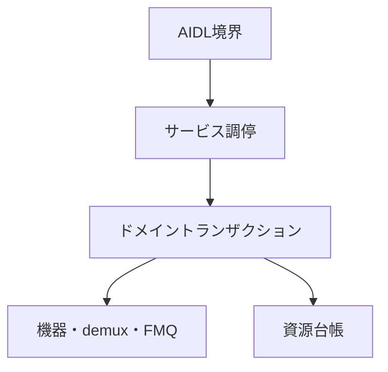

# Tuner HAL2 実装構造設計

## 本書の責務

本書は、`tuner_hal2`における論理責務の分割、依存方向、AIDL境界とドメイン処理の接続、現在の実装位置との対応を定義する。

公開AIDLの状態、戻り値、能力値、資源寿命、確定点、巻き戻し、後片付け、ワーカー、キュー、section/PES/TS処理は`../tuner_hal/DESIGN_JA.md`を正とする。PSI/SI表固有の意味解釈は`../arib_si_engine_rs/DESIGN_JA.md`を正とする。本書はこれらの契約を再定義せず、`tuner_hal2`の論理責務へ対応付ける。

物理ファイル名、module名、type名、関数名はAOSP公開契約またはARIB規範ではない。ただし、`../tuner_hal/DESIGN_JA.md`の`共通部品の定義条件`を満たすため、状態・寿命・失敗時遷移を所有する単一実装正本と許可entry pointは、本書の`共通transaction / use-caseの規範実装アンカー`で規範的な追跡アンカーとして固定する。責務を変えないrename、split、mergeだけでは公開設計変更にならないが、同一変更でアンカーを更新し、移動前後に複数正本を残してはならない。

本PRで追加・変更する契約は、`tuner_hal2`へ適用する目標設計であり、現行実装済みの事実を表すものではない。実装、設定、`Android.bp`、VTS用XML、単体試験が同じ契約へ追従し、`../タスク完了判定の実施方法.md`による横断確認が完了するまでは「設計済み・実装未適用」とする。公開能力を有効にできるのは、対応する実装入口、状態遷移・異常系試験、製品設定またはVTS設定がそろった機能だけである。移行は公開API単位を最小ゲートとし、依存するAPI、台帳、worker、設定を含む適用単位の完了条件も同時に満たす。未移行APIまたは未完了の依存閉包を新設計の成功能力として広告してはならない。

## 責務の一方向参照

| 正本 | 所有する内容 | 他文書での扱い |
|---|---|---|
| `tuner_hal/DESIGN_JA.md` | AOSP公開契約、VTSと能力公開、TS伝送構文、Table ID別section長、公開状態、寿命、失敗時遷移 | `tuner_hal2`は実装責務へ接続するだけとし、同じ表を持たない |
| `arib_si_engine_rs/DESIGN_JA.md` | PSI/SI表固有の意味解析と意味オブジェクト | Tuner HAL公開状態または伝送長を定義しない |
| `tuner_hal2/DESIGN_JA.md` | 実装内の論理責務、依存方向、現在位置との対応 | 公開契約の値や状態を上書きしない |
| `tuner_hal2/CODE_CONVENTION.md` | 実装規約、禁止構造、静的検査観点 | 状態遷移または戻り値を定義しない |

依存はAIDL境界からドメイン処理へ向かう。下位層がAIDL objectまたはBinder statusを保持してはならない。

## 論理コンポーネント

| 論理責務 | 入力 | 所有するもの | 所有しないもの |
|---|---|---|---|
| AIDL境界 | AIDL引数、callback、object handle | AIDL値の外形検証、typed requestへの変換、Binder statusへの変換 | ドメイン状態、backend、rollback方針 |
| サービス調停 | typed request、root/object識別子 | object所有関係、世代の再検証、操作の振り分け、単一lock snapshot | packet解析、driver固有I/O |
| ドメイントランザクション | 検証済みrequest、予約済み資源 | 確定点、補償操作、局所隔離、状態変更 | Binder表現、AIDL callback実体 |
| 機器適合 | frontend/LNB要求 | device probe、driver固有設定、実状態の確認 | 公開能力の捏造、上位状態の直接変更 |
| demux処理 | 入力元とTS packet | 入力元世代、continuity、section/PES assembler、配送候補 | PSI/SI意味解析、公開object寿命 |
| FMQ・callback配送 | 確定済みpayload/event | queueへの確定、EventFlag、callback配送結果 | backend状態の巻き戻し |
| 資源台帳 | 予約・確定・解放要求 | object数、FMQ、PES、AV、DVR、descrambler、workerの使用権 | 公開能力値の独自算出 |
| 後片付け管理 | 閉鎖、所有者消滅、失敗した解放 | 未完手順、再試行権限、隔離資源 | 通常操作への復帰判断 |

## 公開メソッドの接続規則

静的inventory／capability参照メソッドは、サービス調停が同一lock内で変更不能な`CapabilitySnapshot`から応答snapshotを作り、AIDL境界が応答へ変換する。動的な`IFrontend.getStatus()`／`getFrontendStatusReadiness()`は`../tuner_hal/DESIGN_JA.md`の世代付き`FrontendStatusSnapshot`契約を正とし、現行製品ではtune/scan workerまたはbackend監視ownerがbounded backend I/O完了後に更新した値を読む。参照呼出し自身は状態変更、後片付け、ワーカー停止、callback配送を行わない。AOSPはqueryごとの同期backend readを必須にしていないため、現在のsnapshot方式を維持する。将来、特定statusをbounded同期readへ変更する場合は、対象status、I/O上限、失敗写像、generation再検証、snapshot更新との排他を公開状態表へ追加してから有効化する。

更新系メソッドは次の責務分担を守る。

1. AIDL境界は、対象objectとAPI種別を特定するための外形だけを読み取り、失敗し得るdomain入力変換は行わない。
2. サービス調停が同一排他区間で呼出対象objectの生存、呼出対象自身の登録owner、object generation、kind、依存generationを検証する。呼出対象のlifecycle/generation不整合は、引数値の詳細検証より先に`INVALID_STATE`へ確定する。
3. 呼出対象の生存検証後に、AIDL境界のtag、列挙値、nullable入力、値域をtyped requestへ変換する。不正値は`INVALID_ARGUMENT`とし、状態を変更しない。引数として別objectを受けるAPIは、その引数objectの生存/generation不整合を`INVALID_STATE`、foreign owner、別demux、wrong kind、非互換関係を`INVALID_ARGUMENT`へ写像する。呼出対象objectのowner検証と引数objectのownership検証を同じ判定へ丸めない。
4. サービス調停がrequestと依存関係を再検証し、一回限りの実行権限を発行する。
5. 資源台帳が失敗し得る予約を行う。
6. ドメイントランザクションが外部副作用を実行し、commit pointでdomain状態を確定する。commit前失敗は予約と準備物を逆順に戻し、commit後の後片付け失敗は`../tuner_hal/DESIGN_JA.md`の`CleanupPending`または隔離へ接続する。
7. AIDL境界は確定結果だけをBinder応答へ変換する。

失敗時の戻り値、補償操作、`CleanupPending`、隔離条件は`../tuner_hal/DESIGN_JA.md`に従う。AIDL境界、サービス調停、機器適合が独自の状態表を持ってはならない。

### 規範契約と実装入口の対応

次表は、公開契約を実装で強制する境界を固定する。所有者、順序、確定点、巻き戻し、禁止入口を変更する場合は設計変更として扱う。

| 契約 | 所有者 | 必須phase order | 確定点・失敗処理 | 禁止入口 |
|---|---|---|---|---|
| object method | サービス調停のobject method use-case | 呼出対象live・自身の登録owner・generation・kind確認 → request変換 → 引数object live/generation確認 → 引数object owner/demux/kind/関係検証 → dispatch計画 → 一回限り権限消費 → domain実行 | domain commit前は無変更。呼出対象lifecycle不整合と引数object lifecycle不整合は`INVALID_STATE`、foreign/wrong関係は`INVALID_ARGUMENT`、commit後失敗は型付き診断と契約別cleanupへ接続 | AIDL methodからbackend、registry、低水準dispatchを直接呼ばない |
| root/child open | サービス調停のopen use-case | 公開ID・能力確認 → 全使用権仮予約 → runtime登録準備 → Binder object準備 → 一括commit | objectとruntime登録を同時公開し、途中失敗は全仮予約・artifactを逆順解放 | AIDL helperでledger IDを再解釈しない |
| public close / owner loss / Drop leak | 一回限りのcleanup authorityを持つclose use-case | 論理閉鎖 → 新規権限遮断 → worker・queue・接続・artifact・domain cleanup → runtime unregister → ledger解放 | runtime unregister成功後だけobject tableをClosedへ確定。再試行可能失敗はauthorityとleaseを`CleanupPending`へ移す | AIDL、Drop、Reaperが同時にcleanup authorityを持たない |
| descrambler key/session | descrambler transaction use-case | session検証 → key claim準備 → PID・session変更 → commit → 旧claim解放 | sessionとkey tableを同じcommitで更新し、失敗時は旧sessionを維持 | AIDL層またはdescrambler crateからkey tableを直接変更しない |
| source boundary | source boundary use-case | 両objectのlive・owner・demux・generation確認 → 新関係準備 → queue/assembler境界 → 関係commit → 旧関係解放 | commit前失敗は旧関係を維持し、境界の部分確定は隔離 | filter wrapperから接続表・queue世代を個別変更しない |
| frontend tune/scan | frontend session transaction | request検証 → tuneでは同一条件・healthy snapshot判定、scanではrequest fingerprint確定 → worker/callback/rollback準備 → 非破壊tune re-entry、同一`LockedReported`のscan継続、または旧session遮断後のbackend要求・新generation commitへ分岐 | 同一健全tuneは`request_sequence`と現lockの`LOCKED`配送予約だけを確定し、現generation・worker・backend・demux境界・AVを維持する。scan継続は旧scan generationをfenceし、backend再探索なしに新callback generationからENDを1回配送する。それ以外のfull tune/scanだけが旧session遮断、backend要求、新generation commitへ進み、失敗時は`../tuner_hal/DESIGN_JA.md`の表19と統合状態表に従う | worker、backend adapter、callback層がfrontend公開状態、tune re-entry判定、またはscan continuation stateを直接確定しない |
| callback artifact | callback registry use-case | owner live確認 → artifact保持 → runtime登録 → domain確定 → lock外配送 | lookup失敗、Binder配送失敗、cleanup失敗を別phaseとして記録し、片側だけ残さない | demux/device/resource ledgerへBinder callback実体を渡さない |
| worker終端 | worker ownerと後片付け管理 | stop predicate確定 → wake/cancel → 終了回収またはReaper移管 → 残cleanup → lease返却 | 世代遮断前に移管せず、回収完了前に専有資源を再利用しない | worker自身がowner objectをunregisterしない |

#### 共通transaction / use-caseの規範実装アンカー

次表は`../tuner_hal/DESIGN_JA.md`の`共通部品の定義条件`に対する`実装正本`、`公開入口`、`呼び出し許可層`、`呼び出し禁止層`を固定する。記載したmodule/file/typeは外部APIではなく、現在の単一実装正本を特定する規範的トレーサビリティアンカーである。責務不変のrename、split、mergeでは同一変更で本表を更新し、旧アンカーと新アンカーを同時に正本として残してはならない。

| 契約 | 状態・寿命・失敗時遷移の単一実装正本 | 許可entry point | 禁止する迂回 |
|---|---|---|---|
| object method | `service_runtime/src/object_method_txn.rs`の`ObjectMethodTxnPlan`、`ObjectMethodDispatchProof`、`ObjectMethodExecutionToken`。validation/dispatchの補助正本は同moduleからだけ呼ぶ`method_validation.rs`と`method_dispatch.rs` | `aidl_service/src/object_runtime/mod.rs`の`execute_*_use_case*`、`plan_unavailable_object_method_use_case()`、`execute_object_query_use_case()`。domain側は`TunerServiceRuntime::*_for_object`が`ObjectMethodExecutionToken`を一回消費する | 個別AIDL methodによる先行runtime query、`AidlMethodAdapter::plan()`の直接実行、dispatch proofの生成・再利用、backend/registryの直接変更 |
| root open | `service_runtime/src/root_object_ops.rs`。登録後失敗の補償正本は`service_runtime/src/open_rollback.rs` | `aidl_service/src/tuner_service.rs`のroot AIDL methodからroot object use-caseを呼び、返された`RuntimeObjectEntry`からtyped Binder objectを生成する。生成後失敗はservice_runtime rollback入口へ返す | AIDL層でruntime allocation、object table登録、rollback順序、status写像を組み立てる |
| child open | `service_runtime/src/boot/demux_filter_dvr_txn.rs`の`DemuxFilterDvrTxn<'a>`。公開use-case façadeは`service_runtime/src/demux_filter_dvr_ops.rs` | `aidl_service/src/child_object_open.rs`の`open_filter_child_for_owner_object_with_request_builder()`および`open_dvr_child_for_owner_object_with_request_builder()` | `openFilter()`/`openDvr()`ごとのallocation・callback cleanup・rollback複製、`RuntimeObjectEntry.ledger_id`の再解釈 |
| public close / owner loss / Drop leak | `service_runtime/src/object_close_txn.rs`のtyped artifact/domain/runtime cleanup command、`CleanupExecutionReport`接続、close finalization | `aidl_service/src/object_runtime/mod.rs`の`close_object_after_close_preflight()`および`drop_leak_object()`。runtime unregisterは`TunerServiceRuntime::unregister_public_runtime_for_closed_aidl_entry()`だけを使用する | AIDL、Drop、worker、Reaperによるcleanup authorityの重複保持、runtime unregister前の`Closed` commit、個別objectでのclose state machine複製 |
| descrambler key/session | `service_runtime/src/boot/descrambler_txn.rs`の`DescramblerTxn<'a>`。session stateは`service_runtime/src/descrambler_session.rs`、key token/slot/refcountは`service_runtime/src/descrambler_key_table.rs`だけが所有する | `service_runtime/src/descrambler_ops.rs`の`TunerServiceRuntime::*_for_object` use-case。AIDL methodはobject method façade経由で`ObjectMethodExecutionToken`を渡す | AIDL層または`descrambler` crateからsession/key tableを直接変更する、旧claim解放順序をcallerへ露出する |
| source relation | `demux/src/runtime/source_boundary.rs`の`SourceBoundaryTxn`。service-level owner/generation調停は`service_runtime/src/boot/demux_filter_dvr_txn.rs` | `service_runtime/src/demux_filter_dvr_ops.rs`のobject-handle based source use-caseをobject method façadeから呼ぶ | filter wrapperから接続graph、owner demux、queue generation、assemblerを個別に変更する |
| stream generation / packet ingress | `demux/src/runtime/generation_boundary.rs`の`GenerationBoundaryTxn`と`service_runtime/src/boot/packet_txn.rs`の`PacketTxn<'a>`。packet pipelineは`demux/src/parser/packet_pipeline.rs`が所有する | `service_runtime/src/packet_ops.rs`のtyped packet/source-boundary use-case | AIDL層、backend adapter、filter callbackからcontinuity、assembler、FMQ世代を直接変更する |
| frontend tune/scan | `service_runtime/src/boot/frontend_txn.rs`の`FrontendTxn<'a>`。public use-case façadeは`service_runtime/src/frontend_ops.rs` | `aidl_service/src/tuner_service/frontend_methods.rs`からobject method façadeを経由して`TunerServiceRuntime`のfrontend object use-caseを呼ぶ | worker、device backend、callback delivery層によるfrontend公開状態・generation・rollback状態の直接確定 |
| callback artifact | callback registry stateは`service_runtime/src/callback_registry.rs`の`RuntimeCallbackRegistry`、AIDL callback実体は`aidl_service/src/callback_store.rs`だけが所有し、domain commit/rollbackは対象の`service_runtime/src/*_ops.rs` use-caseが所有する | `aidl_service/src/object_runtime/mod.rs`のcallback registration façadeでlive/dispatch preflight後にartifact bridgeを実行し、service_runtime finish use-caseへ結果を返す | callback実体をdemux/device/resource ledgerへ渡す、AIDL層でruntime registrationとdomain commitのrollback方針を持つ |
| worker終端 | frontend workerの停止・回収・cleanup resultは`service_runtime/src/frontend_worker_txn.rs`、worker slot/generationは`device/src/runtime/frontend_worker.rs`の`FrontendWorkerRegistry`が所有する | `service_runtime/src/frontend_ops.rs`および`service_runtime/src/boot/frontend_txn.rs`のworker lifecycle use-case。close/owner-lossは`ObjectCloseTxn`からtyped cleanup commandとして接続する | worker自身によるowner unregister/lease返却、回収完了前のresource再利用、AIDL層によるjoin/reaper方針の決定 |

### ルートobject

`openFrontendById()`、`openDemux()`、`openDemuxById()`、`openDescrambler()`、`openLnbById()`、`openLnbByName()`は、同じroot open責務を使う。各APIのAIDL入出力を混成せず、入力IDを持つAPIでは公開IDを検証し、`openDemux()`と`openLnbByName()`ではobjectとout IDを同一確定点で公開する。`openDescrambler()`はdemux未結合のobject/session枠だけを生成し、demux IDと復号poolの選択は一回限りの`setDemuxSource()`へ委ねる。使用権予約、runtime登録、typed Binder object生成、失敗時の解放を一つの操作として扱い、objectを返した後に登録を巻き戻さない。

`getFrontendIds()`、`getFrontendInfo()`、`getLnbIds()`、`getDemuxIds()`、`getDemuxInfo()`、`getDemuxCaps()`、`getMaxNumberOfFrontends()`、`isLnaSupported()`は、起動時に確定した能力snapshotと現在の使用上限から応答する。照会中にprobeまたは能力の再選択を行わない。

### 子objectと関連付け

Filter、DVR、TimeFilterなどの子objectは、親demuxの生存、所有者、世代、能力、資源予約を確認してから登録する。Descramblerはrootで未結合objectを生成した後、`setDemuxSource()`で親demuxの生存、世代、能力、復号poolを検証し、一回だけ原子的に結合する。対応しないTimeFilterは`tuner_hal`の契約どおりobjectを生成しない。

`IFilter.setDataSource()`、DVR接続、descramblerのPID登録、frontendとLNBまたはCI CAMの接続は、両objectの所有者と世代を同じsnapshotで検証する。片側だけを確定した状態を通常状態として公開しない。

### 入力処理

TS入力は、frontend、playback DVR、許可されたsource filterの入力元を別の世代空間で保持する。packet validation、continuity、section/PES組み立て、filter照合までをdemux責務とし、PSI/SI意味解析を呼ばない。

queueへの書き込み権限は世代付きとし、`flush()`、再設定、停止、再選局、入力元変更、閉鎖で旧世代を失効させる。配送済みAV領域など、クライアントが保持する資源の寿命はqueue世代と分離する。

## 現在実装との追跡索引

次表は規範実装アンカーを探すための補助索引であり、transaction正本または公開契約を置き換えない。

| 論理責務 | 現在の主な位置 |
|---|---|
| AIDL境界 | `aidl_service/`、`binder_adapter/` |
| サービス調停 | `service_runtime/` |
| typed request | `domain_request/` |
| frontend/LNB backend | `device/`、`lnb/` |
| demuxとpacket処理 | `demux/` |
| descrambler | `descrambler/` |
| FMQ | `fmq/`、`fmq_shim/` |
| 資源台帳 | `resource_ledger/` |
| 共通の値型 | `common/` |
| Android公開設定 | `manifest/`、`init/`、`sepolicy/`、`config/` |

## 適用状態と移行完了条件

本PRの文書変更だけでは、次の項目を実装済みまたは試験済みと扱わない。各行は依存するAPI・台帳・worker・設定を含む不変条件閉包として移行し、完了条件を満たした行だけを製品profileで有効にする。

| 適用単位 | 現在状態 | 実装追跡先 | 移行完了条件 |
|---|---|---|---|
| 公開object methodの検証順序とtransaction境界 | 設計済み・実装未適用 | `aidl_service/`、`service_runtime/`、`domain_request/` | 対象APIの入口が規範phase orderへ一本化され、状態不正と入力不正の優先順位、commit前後失敗、rollbackの試験が合格 |
| frontend tune/scan、再選局、終端deadline | 設計済み・実装未適用 | `service_runtime/`、`device/`、callback配送 | AOSP callback契約を満たす終端、`scan(K)→LOCKED(g1)→scan(K)→END(g2)`で2回目のbackend探索・LOCKED再配送がないこと、異なるscan request・stopScan・tune・closeで継続状態が失効すること、安定同一条件の非破壊re-entry、full retuneでの旧session遮断、破壊的commit後に旧要求を再投入しないこと、旧TSが新demux/filter世代へ混入しないこと、原因別の`Untuned`／`FailedBackend`／`FailedBoundary`／`Quarantined`遷移、deadlineの試験が合格 |
| Filter/DVR/AV/PESとFMQの資源契約 | 設計済み・実装未適用 | `demux/`、`fmq/`、`fmq_shim/`、`resource_ledger/` | `CapabilitySnapshot`からの予約、event-local/shared AV、processing buffer、overflow、close解放の試験が合格 |
| 自律cleanupとworker回収 | 設計済み・実装未適用 | `service_runtime/`、各worker owner、`resource_ledger/` | owner操作なしで再試行が進み、期限後の隔離またはservice-critical遷移とlease非再利用を試験で確認 |
| query snapshotとbackend適合 | 設計済み・実装未適用 | `service_runtime/`、`device/`、`config/` | queryがbackend I/Oを行わず、世代付きcacheの更新・失効とmanifest/probeによるbackend選択を試験で確認 |
| VTS/product profile | 設計保留 | `config/`、VTS XML、製品設定 | `VTS-ENV-01`から`06`の実測値を確定し、対応XML一式を静的選択して対象VTSを合格 |

## 構造上の禁止事項

- AIDL methodごとにclose、queue、rollback、quarantineの状態機械を複製しない。
- `tuner_hal`で定義した公開戻り値を`service_runtime`またはbackendで別の値へ読み替えない。
- AIDL objectまたはcallback実体をdemux、device、resource ledgerへ渡さない。
- 静的inventory／capability queryからcleanup、worker操作、backend I/Oを開始しない。動的frontend status queryは現行製品では世代付き`FrontendStatusSnapshot`だけを読み、query呼出しを契機にbackend I/Oを開始しない。
- file名またはtype名をAOSP公開契約、ARIB根拠、公開状態遷移の値そのものとして扱わない。
- `共通transaction / use-caseの規範実装アンカー`以外の物理配置表を状態遷移の正本として扱わない。
- 規範実装アンカーのrename、split、merge時に旧アンカーを残したまま新アンカーを追加し、複数のtransaction正本を作らない。
