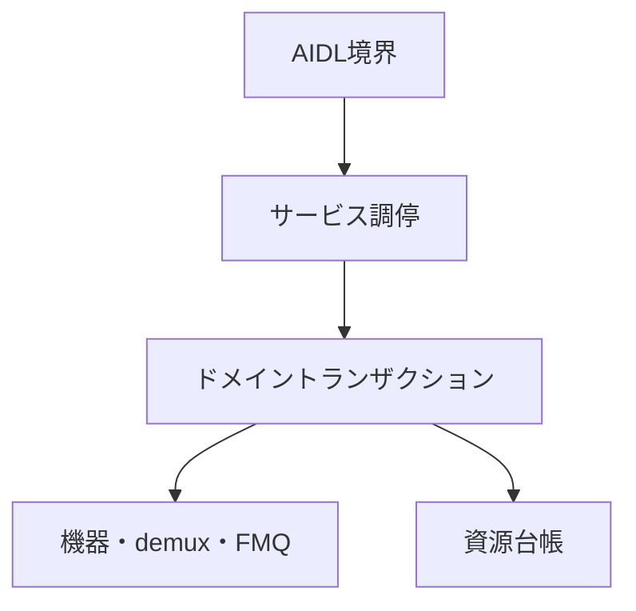

# Tuner HAL2 実装構造設計

## 本書の責務

本書は、`tuner_hal2`における論理責務の分割、依存方向、AIDL境界とドメイン処理の接続、実装owner/anchorとの対応を定義する。

公開AIDLの状態、戻り値、能力値、資源寿命、確定点、巻き戻し、後片付け、ワーカー、キュー、section/PES/TS処理は`../tuner_hal/DESIGN_JA.md`を正とする。PSI/SI表固有の意味解釈は`../arib_si_engine_rs/DESIGN_JA.md`を正とする。本書はこれらの契約を再定義せず、`tuner_hal2`の論理責務へ対応付ける。

物理ファイル名、module名、type名、関数名はAOSP公開契約またはARIB規範ではない。ただし、`../tuner_hal/DESIGN_JA.md`の論理契約を実装へ一意に接続するため、実装owner/anchorと許可entry pointは、本書の`共通transaction / use-caseの規範実装アンカー`で追跡アンカーとして固定する。責務を変えないrename、split、mergeだけでは公開設計変更にならないが、同一変更でアンカーを更新し、移動前後に複数ownerを残してはならない。論理契約の状態、phase、確定点、rollback / cleanup、failure semanticsは本書へ再掲せず`../tuner_hal/DESIGN_JA.md`を参照する。

## 責務の一方向参照

| 正本 | 所有する内容 | 他文書での扱い |
|---|---|---|
| `tuner_hal/DESIGN_JA.md` | AOSP公開契約、VTSと能力公開、TS伝送構文、Table ID別section長、公開状態、寿命、失敗時遷移、共通部品の論理契約 | `tuner_hal2`は実装責務へ接続するだけとし、同じ状態表を持たない |
| `arib_si_engine_rs/DESIGN_JA.md` | PSI/SI表固有の意味解析と意味オブジェクト | Tuner HAL公開状態または伝送長を定義しない |
| `tuner_hal2/DESIGN_JA.md` | 実装内の論理責務、依存方向、実装owner/anchor、許可entry point、禁止bypass | 公開契約の値・状態・phase・確定点・rollback/cleanup・failure semanticsを独自定義しない |
| `tuner_hal2/CODE_CONVENTION.md` | 実装規約、禁止構造、静的検査観点 | 状態遷移または戻り値を定義しない |

依存はAIDL境界からドメイン処理へ向かう。下位層がAIDL objectまたはBinder statusを保持してはならない。

## 論理コンポーネント

| 論理責務 | 入力 | 所有するもの | 所有しないもの |
|---|---|---|---|
| AIDL境界 | AIDL引数、callback、object handle | AIDL値の外形検証、typed requestへの変換、Binder statusへの変換 | ドメイン状態、backend、rollback方針 |
| サービス調停 | typed request、root/object識別子 | object所有関係、世代の再検証、操作の振り分け、単一lock snapshot | packet解析、driver固有I/O |
| ドメイントランザクション | 検証済みrequest、予約済み資源 | 確定点、補償操作、局所隔離、状態変更 | Binder表現、AIDL callback実体 |
| 機器適合 | frontend/LNB要求 | device probe、driver固有設定、実状態の確認 | 公開能力の捏造、上位状態の直接変更 |
| demux処理 | 入力元とTS packet | 入力元世代、continuity、section/PES assembler、配送候補 | PSI/SI意味解析、公開object寿命 |
| FMQ・callback配送 | 確定済みpayload/event | queueへの確定、data通知EventFlag、callback配送結果 | backend状態の巻き戻し、worker制御失敗分類 |
| 資源台帳 | 予約・確定・解放要求 | object数、FMQ、PES、AV、DVR、descrambler、workerの使用権 | 公開能力値の独自算出 |
| 後片付け管理 | 閉鎖、所有者消滅、失敗した解放 | 未完手順、再試行権限、隔離資源 | 通常操作への復帰判断 |

## 公開メソッドの接続規則

静的inventory／capability参照メソッドはservice_runtimeのcapability/query ownerからAIDL応答変換へ接続し、動的な`IFrontend.getStatus()`／`getFrontendStatusReadiness()`はfrontend status query ownerからAIDL応答変換へ接続する。`CapabilitySnapshot`と`FrontendStatusSnapshot`の値、更新・無効化条件、同期/非同期read条件、公開statusは`../tuner_hal/DESIGN_JA.md`の該当契約を正とし、本書では再定義しない。

更新系メソッドは、AIDL境界からservice_runtimeのobject-method / domain use-case ownerへtyped requestを渡し、そこから資源台帳、domain transaction、backend adapterの各ownerへ接続する。AIDL境界はBinder表現との変換だけを担当し、service_runtime / domain ownerを迂回してbackendまたはregistryを直接変更しない。

lifecycle/owner/generation検証、引数検証との優先順位、再検証、execution authority、資源予約、外部副作用、phase order、commit point、pre-commit rollback、post-commit cleanup、失敗時statusは`../tuner_hal/DESIGN_JA.md`のobject method契約・各API状態表・同名transaction契約を正とし、本書では再定義しない。

### 契約正本と実装入口の対応

公開transactionの状態、phase、確定点、rollback / cleanup、failure semanticsは`../tuner_hal/DESIGN_JA.md`の同名論理契約を正とする。本節が規範として所有するのは、論理契約名から`tuner_hal2`の実装ownerへの対応と、ownerを迂回して第二の実装ownerを作ることの禁止だけである。

| 契約 | 実装所有者 | 禁止入口 |
|---|---|---|
| object method | サービス調停のobject method use-case | AIDL methodからbackend、registry、低水準dispatchを直接呼ばない |
| root/child open | サービス調停のopen use-case | AIDL helperでledger IDを再解釈しない |
| public close / owner loss / Drop | `ObjectCloseTxn` | AIDL、Drop、Reaper、個別objectが別のclose ownerを持たない |
| descrambler key | `DescramblerKeyTxn` | callerがkey台帳を直接変更しない |
| descrambler PID | `DescramblerPidTxn` | `addPid()` / `removePid()` callerが別のPID mutation ownerを持たない |
| descrambler session cleanup | `DescramblerSessionCleanupTxn` | close/invalidate callerがPID、key、pool台帳を直接変更しない |
| Filter source relation | `SourceBoundaryTxn` | filter wrapperまたはAPI別use-caseが接続graphを直接変更しない |
| Demux frontend source relation | `DemuxFrontendSourceTxn` | `IDemux.setFrontendDataSource()` callerがrelation ownerを迂回しない |
| stream boundary | `StreamBoundaryTxn` | relation、queue、A/V sync、PCR、callback、descramblerの各ownerを迂回しない |
| packet ingress / pipeline | `PacketTxn` / `PacketPipeline` | 通常packet ingress/parse/filter dispatchを`StreamBoundaryTxn`へ吸収しない |
| frontend tune/scan | `FrontendTxn` | worker、backend adapter、callback層がfrontend ownerを迂回しない |
| Record DVR / Filter relation | `RecordDvrFilterRelationTxn` | DVR側とFilter側が別のrelation ownerを持たない |
| LNB persistent control | `LnbControlTxn` | persistent control APIごとに別のcontrol ownerを持たない |
| callback registration | service_runtime側`CallbackRegistrationUseCase`。Binder callback artifactは`aidl_service/src/callback_store.rs` | AIDL façadeまたはdomain別use-caseが別のregistration ownerを持たない |
| post-commit callback failure | `PostCommitCallbackFailureTxn` | API別に同型handlerを設けない |
| Filter / DVR flush cleanup orchestration | `QueueCleanupTxn` | API別に別のflush cleanup orchestratorを設けない |
| DVR playback consume | `PlaybackConsumeTxn` | playback workerが別のconsume ownerを持たない |
| A/V sync relation | `AvSyncRegistry` | API、filter wrapper、`StreamBoundaryTxn`がregistryを迂回しない |
| PCR clock anchor | `PcrClockAnchorStore` | APIまたは`StreamBoundaryTxn`がstoreを迂回しない |
| worker lifecycle mechanism | `WorkerRuntime` / `WorkerHandle` | 別のgeneric worker lifecycle ownerを重ねない |
| worker failure classification | `WorkerFailureClassifier` | 各ownerがclassifierを迂回して別のfailure classification ownerを設けない |

#### 共通transaction / use-caseの規範実装アンカー

次表は`../tuner_hal/DESIGN_JA.md`の同名論理契約を`tuner_hal2`へ接続する物理module/file/type、許可entry point、禁止bypassだけを固定する。状態、phase、確定点、rollback / cleanup、failure semantics、cardinality、token/generation state machineは同名論理契約を参照し、本表では再定義しない。

| 契約 | 実装owner / anchor | 許可entry point | 禁止する迂回 |
|---|---|---|---|
| object method | `service_runtime/src/object_method_txn.rs`。補助moduleは`method_validation.rs` / `method_dispatch.rs` | `aidl_service/src/object_runtime/mod.rs`の`execute_*_use_case*`、`plan_unavailable_object_method_use_case()`、`execute_object_query_use_case()`、domain側`TunerServiceRuntime::*_for_object` | 個別AIDL methodからの先行runtime query、`AidlMethodAdapter::plan()`直接実行、backend/registry直接変更 |
| root open | `service_runtime/src/root_object_ops.rs`、`service_runtime/src/open_rollback.rs` | `aidl_service/src/tuner_service.rs`のroot object use-case | AIDL層でruntime allocation、object table、rollback helperを直接扱う |
| child open | `service_runtime/src/boot/demux_filter_dvr_txn.rs::DemuxFilterDvrTxn<'a>`、`service_runtime/src/demux_filter_dvr_ops.rs` | `aidl_service/src/child_object_open.rs`の`open_filter_child_for_owner_object_with_request_builder()` / `open_dvr_child_for_owner_object_with_request_builder()` | API別allocation/cleanup owner、`RuntimeObjectEntry.ledger_id`再解釈 |
| `ObjectCloseTxn` | `service_runtime/src/object_close_txn.rs::ObjectCloseTxn` | `aidl_service/src/object_runtime/mod.rs`のpublic close / owner-loss / Drop接続とservice_runtimeのshutdown/reaper接続 | `DropLeakTxn`等の別close owner、AIDL/Drop/worker/Reaperの直接cleanup |
| `DescramblerKeyTxn` / `DescramblerPidTxn` / `DescramblerSessionCleanupTxn` | `service_runtime/src/boot/descrambler_txn.rs`、`service_runtime/src/descrambler_session.rs`、`service_runtime/src/descrambler_key_table.rs` | `service_runtime/src/descrambler_ops.rs`、descrambler close接続、demux invalidation接続 | AIDL層またはdescrambler crateから台帳を直接変更、別cleanup ownerを設置 |
| `SourceBoundaryTxn` | `demux/src/runtime/source_boundary.rs` | `service_runtime/src/demux_filter_dvr_ops.rs`のFilter source use-case、source Filter close/unlink接続 | filter wrapper/cleanup callerによるgraph直接変更、demux/frontend ownerとの統合 |
| `DemuxFrontendSourceTxn` | `service_runtime/src/demux_filter_dvr_ops.rs::DemuxFrontendSourceTxn` | `IDemux.setFrontendDataSource()` object use-case、Frontend/Demux close接続 | cleanup callerによるrelation直接編集、`SourceBoundaryTxn`への統合 |
| `StreamBoundaryTxn` | `demux/src/runtime/generation_boundary.rs::GenerationBoundaryTxn`（`StreamBoundaryTxn`の実装名） | `service_runtime/src/packet_ops.rs`のtyped boundary use-case | relation/queue/A-V sync/PCR/callback/descrambler各ownerの直接変更 |
| packet ingress / pipeline | `service_runtime/src/boot/packet_txn.rs::PacketTxn<'a>`、`demux/src/parser/packet_pipeline.rs::PacketPipeline` | `service_runtime/src/packet_ops.rs`のtyped packet ingress use-case | `StreamBoundaryTxn`への通常packet処理吸収、AIDL/backend/filter callbackからのpipeline直接変更 |
| `RecordDvrFilterRelationTxn` | `service_runtime/src/demux_filter_dvr_ops.rs::RecordDvrFilterRelationTxn` | Record DVR `attachFilter()` / `detachFilter()`、Filter/DVR close、demux cleanup接続 | object側shadow relationの直接変更 |
| `LnbControlTxn` | `service_runtime/src/lnb_control_txn.rs::LnbControlTxn` | `ILnb.setVoltage()` / `setTone()` / `setSatellitePosition()` object use-case | API別control owner、`sendDiseqcMessage()`の同ownerへの統合 |
| `CallbackRegistrationUseCase` | `service_runtime/src/callback_registry.rs::CallbackRegistrationUseCase`、`RuntimeCallbackRegistry`、`aidl_service/src/callback_store.rs` | `IFrontend.setCallback()` / `ILnb.setCallback()`等のAIDL façadeからservice_runtime callback registration入口 | AIDL façade/domain別use-caseによる別registration owner、callback artifactの別保管先 |
| `PostCommitCallbackFailureTxn` | `service_runtime/src/post_commit_callback_failure_txn.rs::PostCommitCallbackFailureTxn` | domain completion use-caseからのtyped入口 | API別handler、classifierまたはdomain ownerの置換 |
| `FilterProducerDrainGate` | `demux/src/runtime/queue_runtime.rs` | Filter/SharedFilter data path、`QueueCleanupTxn`からのtyped入口 | 公開API/worker/`QueueCleanupTxn`からのgate内部直接変更、DVR ownerとの統合 |
| `QueueEpochProtocol` | `demux/src/runtime/queue_runtime.rs` | DVR data path、`QueueCleanupTxn`からのtyped入口 | 公開API/worker/`QueueCleanupTxn`からのprotocol内部直接変更、`PlaybackQueueBacking` ownerとの統合 |
| `QueueCleanupTxn` | `service_runtime/src/queue_cleanup_txn.rs::QueueCleanupTxn` | Filter/DVR `flush()` object use-case | 下位protocol内部への直接アクセス、API別orchestrator |
| `PlaybackConsumeTxn` | `service_runtime/src/playback_consume_txn.rs` | playback workerのtyped consume入口 | worker/FMQ/packet helperによる別consume owner |
| frontend tune/scan | `service_runtime/src/boot/frontend_txn.rs::FrontendTxn<'a>`、`service_runtime/src/frontend_ops.rs` | `aidl_service/src/tuner_service/frontend_methods.rs`からobject method façade経由 | worker/device/callback層によるfrontend owner迂回、demux ownerの吸収 |
| `AvSyncRegistry` | `demux/src/runtime/av_sync_registry.rs::AvSyncRegistry` | filter configure/unregister/close、demux closeからのtyped relation入口 | API/filter wrapper/`StreamBoundaryTxn`からのregistry直接変更、PCR ownerとの統合 |
| `PcrClockAnchorStore` | `demux/src/runtime/pcr_clock_anchor.rs::PcrClockAnchorStore` | PCR観測、stream boundary側のtyped invalidation入口 | API/`StreamBoundaryTxn`からのstore内部直接変更、A/V sync ownerとの統合 |
| `WorkerRuntime` / `WorkerHandle` | `service_runtime/src/worker_runtime.rs::{WorkerRuntime, WorkerHandle}` | 各domain worker ownerのworker runtime入口 | 別generic lifecycle owner、domain start/stop ownerの吸収 |
| `WorkerFailureClassifier` | `service_runtime/src/worker_failure_classifier.rs` | worker owner / cleanup manager / callback・backend failure ownerからのtyped入口 | owner側の別classifier、classifierによるdomain ownerの置換 |
| frontend worker終端 | `service_runtime/src/frontend_worker_txn.rs`、`device/src/runtime/frontend_worker.rs::FrontendWorkerRegistry` | `service_runtime/src/frontend_ops.rs`、`service_runtime/src/boot/frontend_txn.rs`、`ObjectCloseTxn`からのtyped cleanup接続 | worker/AIDL層によるowner unregister、lease、join/reaper、failure classifierの直接代替 |

##### 実装依存とcomposition接続規則

論理契約の状態、phase、commit / rollback、failure semanticsは`../tuner_hal/DESIGN_JA.md`の同名契約を正とし、本節は`tuner_hal2`内でowner同士をどのtyped入口で接続するかだけを定義する。

- Filter source use-caseは`SourceBoundaryTxn`、Demux frontend source use-caseは`DemuxFrontendSourceTxn`へ接続し、stream boundaryが必要な場合は`service_runtime/src/packet_ops.rs`の`StreamBoundaryTxn` typed入口へ接続する。
- callback AIDL façadeは`aidl_service/src/callback_store.rs`とservice_runtime側`CallbackRegistrationUseCase`を接続し、runtime/domain側へ直接書き込まない。
- descrambler closeは`ObjectCloseTxn`から、demux invalidationはdemux invalidation ownerから、`DescramblerSessionCleanupTxn`のtyped入口へ接続する。
- Record DVR/Filter lifecycle use-caseは`RecordDvrFilterRelationTxn`のtyped入口へ接続する。
- Filter/DVR `flush()` use-caseは`QueueCleanupTxn`へ接続し、同ownerからFilter側`FilterProducerDrainGate`またはDVR側`QueueEpochProtocol`のtyped入口を使用する。
- filter lifecycle use-caseは`AvSyncRegistry`、stream boundary側は`PcrClockAnchorStore`のtyped invalidation入口へ接続し、各store内部へ直接アクセスしない。
- domain completion use-caseは`WorkerFailureClassifier`のtyped結果を`PostCommitCallbackFailureTxn`へ渡す接続だけを持つ。
- domain worker ownerは`WorkerRuntime` / `WorkerHandle`と`WorkerFailureClassifier`のtyped入口を使用し、generic runtime/classifierを再実装しない。
- top-level cleanup / rollback use-caseは`CleanupExecutionReport` / `SharedCleanupDiagnostics`と共通failure-composition helperへ接続し、API別・worker別helperを設けない。

### ルートobject

`openFrontendById()`、`openDemux()`、`openDemuxById()`、`openDescrambler()`、`openLnbById()`、`openLnbByName()`はroot open実装ownerへ接続する。公開ID検証、object/out IDの公開確定点、失敗時rollback、`openDescrambler()`の未結合生成は`../tuner_hal/DESIGN_JA.md`の各API表、AT-010a、`IDescrambler demux結合契約`を正とし、本書では再定義しない。

`getFrontendIds()`、`getFrontendInfo()`、`getLnbIds()`、`getDemuxIds()`、`getDemuxInfo()`、`getDemuxCaps()`、`getMaxNumberOfFrontends()`、`isLnaSupported()`はservice_runtimeのcapability/query ownerへ接続する。snapshot、使用上限、probe可否その他の公開query semanticsは`../tuner_hal/DESIGN_JA.md`を正とする。

### 子objectと関連付け

Filter、DVR、TimeFilterなどの子object生成はchild-open実装ownerへ接続する。親demuxの検証順序、登録確定点、rollback、TimeFilter非対応時の公開結果は`../tuner_hal/DESIGN_JA.md`の各API表とAT-010aを正とする。Descramblerのroot未結合生成と`setDemuxSource()`の一回性・原子的結合は同書AT-009aおよび`IDescrambler demux結合契約`を正とし、本書では再定義しない。

`IFilter.setDataSource()`は`SourceBoundaryTxn`、`IDemux.setFrontendDataSource()`は`DemuxFrontendSourceTxn`、Record DVR接続は`RecordDvrFilterRelationTxn`、descrambler PID登録は`DescramblerPidTxn`を通す。`IFrontend.setLnb()`はservice_runtimeのfrontend object method use-caseからLNB lease/registry ownerへ接続する。CI CAM系は`../tuner_hal/DESIGN_JA.md`の非対応契約へ接続し、backend relationを生成しない。relationのvalidation、generation、commit/rollback semanticsは同書を正とする。

### 入力処理

TS入力originとgeneration名前空間は`../tuner_hal/DESIGN_JA.md`の`TsInputOrigin`／soft demux入力元契約を正とする。本書ではdemux packet pipelineをpacket validation、continuity、section/PES組み立て、filter照合の実装ownerへ接続し、PSI/SI意味解析を呼ばない責務境界だけを定義する。

Filter/SharedFilterのqueue確定は`FilterProducerDrainGate`、DVR queue I/Oは`QueueEpochProtocol`、配送済みAV領域のallocation/leaseはAV resource ownerへ接続する。write authorityのgeneration、失効条件、配送済みAV資源の寿命は`../tuner_hal/DESIGN_JA.md`の同名契約・資源寿命表を正とし、本書では再定義しない。

## 実装構造索引

次表は規範実装アンカーを探すための補助索引であり、transaction正本または公開契約を置き換えない。

| 論理責務 | 主な構造位置 |
|---|---|
| AIDL境界 | `aidl_service/`、`binder_adapter/` |
| サービス調停 | `service_runtime/` |
| typed request | `domain_request/` |
| frontend/LNB backend | `device/`、`lnb/` |
| demuxとpacket処理 | `demux/` |
| descrambler | `descrambler/` |
| FMQ | `fmq/`、`fmq_shim/` |
| 資源台帳 | `resource_ledger/` |
| 共通の値型 | `common/` |
| Android公開設定 | `manifest/`、`init/`、`sepolicy/`、`config/` |

完了判定・未達理由・実装適用状況は`../タスク完了判定の実施方法.md`に従う判定側を正とし、本書へ重複記載しない。

## 構造上の禁止事項

- AIDL methodごとにclose、queue、rollback、quarantineの状態機械を複製しない。
- `../tuner_hal/DESIGN_JA.md`の共通部品適用表が所有者を指定した処理について、API別use-case、worker、helperが同じ状態変更、cleanup、失敗分類を個別再実装しない。
- `DropLeakTxn`を`ObjectCloseTxn`と並ぶcleanup authorityとして置かない。
- Demux frontend relationをFilter用`SourceBoundaryTxn`へ吸収しない。
- relation transactionと`StreamBoundaryTxn`を別々の公開commitにしない。
- Filter/DVR `flush()`のcleanup orchestrationと失敗集約をAPI別に複製せず、`QueueCleanupTxn`のtyped入口を使用する。
- `WorkerLifecycleProtocol`等を`WorkerRuntime` / `WorkerHandle`と並ぶgeneric lifecycle ownerとして置かない。
- worker owner/APIがstop/wake/join/EventFlag/Reaper/backend-control/callback等の同型失敗分類を個別実装せず、`WorkerFailureClassifier`のtyped結果を使用する。
- LNB Binder callback実体をLNB domain/AIDL objectに直接保持しない。
- DVR側とFilter側がRecord relationを別々にcommitしない。
- A/V sync relation / reverse indexまたはPCR anchorを複数ownerが直接変更しない。
- `tuner_hal`で定義した公開戻り値を`service_runtime`またはbackendで別の値へ読み替えない。
- AIDL objectまたはcallback実体をdemux、device、resource ledgerへ渡さない。
- 静的inventory／capability queryからcleanup、worker操作、backend I/Oを開始しない。動的frontend status queryのread model、`FrontendStatusSnapshot`の更新・無効化、bounded synchronous readへ変更できる条件は`../tuner_hal/DESIGN_JA.md`を正とし、本書ではowner/entry mapping以外を再定義しない。
- file名またはtype名をAOSP公開契約、ARIB根拠、公開状態遷移の値そのものとして扱わない。
- `共通transaction / use-caseの規範実装アンカー`以外の物理配置表を状態遷移の正本として扱わない。
- 規範実装アンカーのrename、split、merge時に旧アンカーを残したまま新アンカーを追加し、複数のtransaction正本を作らない。
